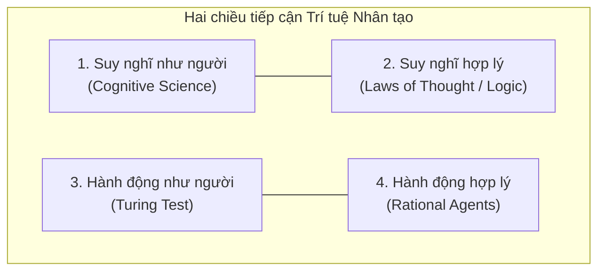

*Học phần AIT2004 — Cơ sở Trí tuệ Nhân tạo*

[Mục lục môn học](/bieu-dien-tri-thuc/notes/00-muc-luc.md) · [Chương 2: Tìm kiếm mù →](/bieu-dien-tri-thuc/bai-giang/02-tim-kiem-mu.md)

::: info Trọng tâm bài giảng
Trí tuệ Nhân tạo (Artificial Intelligence - AI) là gì? Trong suốt nhiều thập kỷ, câu hỏi tưởng chừng đơn giản này đã làm tốn không biết bao nhiêu giấy mực của các nhà triết học, toán học và kỹ sư máy tính. Liệu AI là một cỗ máy biết suy nghĩ như con người, hay là một hệ thống hành động hợp lý để đạt được mục tiêu?

Bài giảng mở đầu này đặt nền móng tư duy cho toàn bộ học phần:
1. **Bản chất của Trí tuệ Nhân tạo:** Bốn trường phái định nghĩa và lý do cách tiếp cận **Tác tử hợp lý (Rational Agent)** trở thành trung tâm của AI hiện đại.
2. **Cấu trúc Tác tử và Môi trường:** Mối tương tác giữa Cảm biến (Sensors), Lịch sử tri giác (Percept Sequence) và Cơ cấu chấp hành (Actuators).
3. **Mô hình đặc tả PEAS:** Khung phân tích chuẩn mực cho mọi bài toán AI thực tế từ xe tự hành tới trợ lý y khoa.
4. **Phân loại Môi trường bài toán:** Sáu chiều kích thước phân định độ phức tạp của bài toán.
5. **Năm kiến trúc tác tử kinh điển:** Từ phản xạ đơn giản đến tác tử học tập tự hoàn thiện.
:::

---

## 1.1 Trí tuệ Nhân tạo là gì? Bốn góc nhìn lịch sử

Khi tiếp cận AI, giới học thuật phân chia các định nghĩa theo hai trục tọa độ độc lập:
- Trục 1: Quan tâm đến **Tiến trình tư duy (Thinking)** hay **Hành vi thực tế (Acting)**.
- Trục 2: Lấy **Con người làm thước đo (Humanly)** hay lấy **Tính hợp lý lý tưởng làm chuẩn mực (Rationally)**.



### 1. Hành động như con người: Phép thử Turing (1950)
Alan Turing đề xuất: Thay vì tranh cãi mơ hồ xem "máy tính có biết nghĩ hay không", hãy kiểm tra xem máy tính có thể đánh lừa một người thẩm vấn bằng văn bản hay không. Để vượt qua phép thử Turing toàn diện, cỗ máy cần: Xử lý ngôn ngữ tự nhiên (NLP), Biểu diễn tri thức (KR), Suy luận tự động (Automated Reasoning), Học máy (Machine Learning), Thị giác máy tính (Computer Vision) và Điều khiển học (Robotics).

### 2. Suy nghĩ như con người: Khoa học nhận thức (Cognitive Science)
Muốn kết luận một chương trình suy nghĩ như con người, ta phải giải mã được bộ não con người vận hành ra sao (thông qua nội quan tâm lý học hoặc quét ảnh thần kinh fMRI), sau đó mô phỏng lại các xung thần kinh đó trong thuật toán.

### 3. Suy nghĩ hợp lý: Các quy luật tư duy (Laws of Thought)
Bắt nguồn từ các tam đoạn luận (Syllogisms) của Aristotle: "Mọi người đều phải chết; Socrates là người; vậy Socrates phải chết." Trường phái này hình thức hóa tư duy thành các hệ thống logic chặt chẽ. Tuy nhiên, nó gặp rào cản khi đối mặt với tri thức không chắc chắn và sự bùng nổ tổ hợp trong thực tế.

### 4. Hành động hợp lý: Hướng tiếp cận Tác tử (The Rational Agent Approach)
Một **tác tử (agent)** là bất cứ thực thể nào có khả năng nhận thức môi trường và hành động tác động trở lại môi trường. Một **tác tử hợp lý (rational agent)** là tác tử luôn hành động nhằm đạt được kết quả kỳ vọng tốt nhất.

> **Tại sao AI hiện đại chọn hướng tiếp cận Tác tử hợp lý?**
> Bởi vì mục tiêu tối thượng của kỹ thuật không phải là sao chép mọi định kiến, sai sót cảm xúc hay giới hạn sinh học của con người. Giống như việc kỹ sư chế tạo máy bay lấy cảm hứng từ loài chim nhưng không gắn lông vũ lên cánh, ngành AI tạo ra những cỗ máy đưa ra quyết định chuẩn xác, tối ưu hóa mục tiêu đã đề ra.

---

## 1.2 Cấu trúc Tác tử và Khái niệm Tính hợp lý

```mermaid
flowchart TD
    Env["MÔI TRƯỜNG"] -->|Tri giác (Percepts)| Sensors["Cảm biến (Sensors)"]
    subgraph Agent ["TÁC TỬ (AGENT)"]
        Sensors --> Decision["Chương trình tác tử<br/>f: P* → A"]
        Decision --> Actuators["Cơ cấu chấp hành<br/>(Actuators)"]
    end
    Actuators -->|Hành động (Actions)| Env
```

Về mặt toán học:
- Gọi $\mathcal{P}$ là tập các tri giác (percepts) mà cảm biến thu nhận tại một thời điểm.
- Dãy tri giác $\mathcal{P}^*$ là toàn bộ lịch sử các tri giác mà tác tử đã trải qua từ lúc khởi động đến thời điểm hiện tại.
- Gọi $\mathcal{A}$ là tập các hành động hợp lệ mà tác tử có thể thực thi.

Hành vi của tác tử được trừu tượng hóa bằng một **Hàm tác tử (Agent Function)**:
$$
f: \mathcal{P}^* \to \mathcal{A}
$$
Chương trình tác tử (Agent Program) chính là đoạn mã cụ thể cài đặt hàm $f$ chạy trên một nền tảng kiến trúc phần cứng vật lý.

### Tính hợp lý khác gì với Toàn tri?

Người mới học thường nhầm lẫn giữa **Hợp lý (Rationality)** và **Toàn tri (Omniscience)**:
- **Toàn tri:** Biết trước kết quả thực tế của mọi hành động trong tương lai (điều không tưởng trong thế giới thực).
- **Hợp lý:** Tối đa hóa hiệu năng **kỳ vọng** dựa trên những gì tác tử đã quan sát được trong quá khứ cùng với tri thức ban đầu được nạp sẵn.

Ví dụ: Bạn nhìn sang hai bên đường, thấy đường vắng và quyết định băng qua đường. Bất ngờ, một thiên thạch rơi xuống từ bầu trời. Quyết định qua đường của bạn vẫn là một quyết định **hoàn toàn hợp lý**, dù kết quả thực tế không trọn vẹn. Bạn không thể bị coi là thiếu lý trí chỉ vì bạn không thể tiên đoán một sự kiện bất khả kháng.

---

## 1.3 Đặc tả bài toán theo mô hình PEAS

Để thiết kế một tác tử AI, bước đầu tiên của người kỹ sư luôn là xác định bộ khung **PEAS**:
- **P (Performance Measure):** Thước đo hiệu năng (chỉ số đánh giá sự thành công).
- **E (Environment):** Môi trường hoạt động.
- **A (Actuators):** Cơ cấu chấp hành (các bộ phận thực thi hành động).
- **S (Sensors):** Cảm biến (các thiết bị thu nhận tín hiệu).

### Bảng phân tích PEAS cho ba hệ thống thực tế

| Hệ thống AI | Thước đo hiệu năng (P) | Môi trường (E) | Cơ cấu chấp hành (A) | Cảm biến (S) |
|:---|:---|:---|:---|:---|
| **Xe taxi tự hành** | An toàn, tốc độ di chuyển, tuân thủ luật, êm ái, tiết kiệm nhiên liệu | Đường phố, đèn giao thông, người đi bộ, thời tiết | Vô lăng, chân ga, chân phanh, còi, đèn tín hiệu | Camera, LiDAR, Radar, GPS, cảm biến tốc độ |
| **Robot hút bụi thông minh** | Tỉ lệ sàn sạch, thời gian dọn, tuổi thọ pin, tránh va chạm | Mặt sàn nhà, đồ đạc nội thất, bậc cầu thang, thảm | Bánh xe dẫn động, chổi quét, động cơ hút, đèn báo | Cảm biến va chạm, cảm biến chống rơi, camera hồng ngoại |
| **Trợ lý chẩn đoán y khoa** | Độ chính xác chẩn đoán, giảm chi phí điều trị, thời gian phát hiện bệnh | Bệnh nhân, phòng khám, hồ sơ xét nghiệm | Màn hình hiển thị chẩn đoán, đề xuất đơn thuốc, cảnh báo | Bàn phím nhập triệu chứng, dữ liệu ảnh X-quang, máy đo sinh hiệu |

---

## 1.4 Phân loại môi trường bài toán

Bản chất của môi trường quyết định trực tiếp việc bạn phải chọn thuật toán nào:

1. **Quan sát toàn phần (Fully Observable) vs. Một phần (Partially Observable):**
   - *Toàn phần:* Cảm biến thu thập trọn vẹn trạng thái môi trường ở mọi thời điểm (ví dụ: bàn cờ vua).
   - *Một phần:* Môi trường có góc khuất, tiếng ồn hoặc cảm biến bị hạn chế (ví dụ: xe tự hành không nhìn xuyên qua xe tải phía trước, bài Poker không nhìn thấy bài đối thủ).
2. **Đơn tác tử (Single Agent) vs. Đa tác tử (Multi-Agent):**
   - *Đơn tác tử:* Tác tử hoạt động một mình (giải Sudoku, robot dọn phòng).
   - *Đa tác tử:* Có nhiều tác tử cùng hiện diện, có thể cạnh tranh (cờ vua) hoặc hợp tác (xe tự hành nhường đường nhau).
3. **Tất định (Deterministic) vs. Bất định (Stochastic):**
   - *Tất định:* Trạng thái tiếp theo được quyết định hoàn toàn bởi trạng thái hiện tại và hành động của tác tử.
   - *Bất định:* Có yếu tố ngẫu nhiên ngoài tầm kiểm soát (thời tiết, xúc xắc, hành vi người đi bộ).
4. **Theo giai đoạn (Episodic) vs. Tuần tự (Sequential):**
   - *Theo giai đoạn:* Quyết định ở lượt này không ảnh hưởng tới các lượt sau (ví dụ: phân loại ảnh sản phẩm lỗi trên băng chuyền).
   - *Tuần tự:* Quyết định hiện tại sẽ thay đổi tương lai lâu dài (ví dụ: cờ vua, tìm đường đi).
5. **Tĩnh (Static) vs. Động (Dynamic):**
   - *Tĩnh:* Môi trường đứng yên trong khi tác tử đang suy nghĩ (ví dụ: cờ ca-rô).
   - *Động:* Môi trường biến đổi liên tục trong khi tác tử đang tính toán (ví dụ: lái xe trên cao tốc).
6. **Rời rạc (Discrete) vs. Liên tục (Continuous):**
   - *Rời rạc:* Số lượng trạng thái và hành động là đếm được (các ô cờ, số bước đi).
   - *Liên tục:* Tọa độ vị trí, vận tốc, thời gian biến thiên liên tục trong không gian thực $\mathbb{R}^n$.

---

## 1.5 Năm kiến trúc tác tử cơ bản

### 1. Tác tử phản xạ đơn giản (Simple Reflex Agent)
Chỉ hành động dựa trên tri giác hiện tại, bỏ qua toàn bộ lịch sử. Sử dụng các luật điều kiện–hành động:
$$
\text{IF } \text{trước\_mặt\_có\_vật\_cản} \text{ THEN } \text{phanh\_lại}
$$
*Hạn chế:* Chỉ hoạt động được nếu môi trường là quan sát toàn phần. Trong môi trường quan sát một phần, tác tử dễ rơi vào vòng lặp vô hạn.

### 2. Tác tử phản xạ dựa trên mô hình (Model-based Reflex Agent)
Tác tử duy trì một **trạng thái nội tại (Internal State)** để theo dõi những khía cạnh của thế giới mà cảm biến hiện thời không nhìn thấy được. Nó cần hai loại tri thức:
- Thế giới tự biến chuyển ra sao theo thời gian?
- Hành động của chính tác tử ảnh hưởng tới thế giới thế nào?

### 3. Tác tử dựa trên mục tiêu (Goal-based Agent)
Không chỉ biết trạng thái hiện tại, tác tử còn có một **mục tiêu (Goal)** mô tả những trạng thái mong muốn đạt tới. Tác tử phải lập kế hoạch và tìm kiếm đường đi từ trạng thái hiện tại tới mục tiêu.
*Đây chính là khởi đầu cho các thuật toán Tìm kiếm trong không gian trạng thái ở Chương 2, 3 và 4!*

### 4. Tác tử dựa trên hàm thỏa dụng (Utility-based Agent)
Khi có nhiều cách đạt được mục tiêu, hoặc khi các mục tiêu xung đột nhau (nhanh hơn nhưng tốn xăng hơn và nguy hiểm hơn), tác tử cần một **Hàm thỏa dụng (Utility Function)** để lượng hóa mức độ hạnh phúc/hài lòng đối với từng trạng thái.

### 5. Tác tử có khả năng học tập (Learning Agent)
Được cấu thành từ 4 thành phần:
- **Phần tử thực thi (Performance Element):** Đưa ra hành động dựa trên tri giác.
- **Bộ phê bình (Critic):** Đánh giá xem hành động thực thi tốt hay dở so với chuẩn hiệu năng bên ngoài.
- **Phần tử học (Learning Element):** Cải tiến phần tử thực thi dựa trên phản hồi của bộ phê bình.
- **Bộ phát sinh bài toán (Problem Generator):** Thử nghiệm các hành động mới mẻ nhằm thu nạp kinh nghiệm mới (khám phá, exploration).

---

## Hệ thống bài tập tự luyện {#bai-tap}

### Bài tập 1: Đặc tả khung PEAS cho hệ thống giao dịch tài chính tự động (Trading Agent)
**Đề bài:**
Hãy xác định và phân tích 4 thành phần của khung PEAS đối với một tác tử phần mềm tự động giao dịch chứng khoán tần suất cao (High-Frequency Trading Agent) trên thị trường tài chính.

**Phân tích & Hướng dẫn giải:**
1. **Thước đo hiệu năng (Performance Measure - P):**
   - Lợi nhuận ròng thu về trên tổng vốn đầu tư (ROI).
   - Chỉ số Sharpe đo lường tỷ suất sinh lời trên mỗi đơn vị rủi ro chịu đựng.
   - Mức độ sụt giảm tài sản tối đa trong một chu kỳ (Max Drawdown).
   - Chi phí giao dịch và thuế phát sinh khi thực hiện lệnh.
2. **Môi trường hoạt động (Environment - E):**
   - Sàn giao dịch chứng khoán điện tử (khớp lệnh liên tục và khớp lệnh định kỳ).
   - Sổ lệnh khớp (Order Book) chứa các lệnh chờ mua và bán.
   - Tin tức kinh tế vĩ mô, báo cáo tài chính định kỳ từ doanh nghiệp.
   - Các bên tham gia thị trường khác gồm nhà đầu tư cá nhân và các thuật toán cạnh tranh.
3. **Cơ cấu chấp hành (Actuators - A):**
   - Lệnh gửi qua giao diện kết nối API của sàn: đặt lệnh mua (Buy), đặt lệnh bán (Sell), hủy lệnh chờ (Cancel).
   - Lệnh cơ cấu danh mục tài sản và tái phân bổ hạn mức tiền mặt.
4. **Cảm biến (Sensors - S):**
   - Dòng dữ liệu giá khớp và khối lượng giao dịch theo thời gian thực (Market Data Feeds).
   - Dữ liệu độ sâu sổ lệnh cấp 2 (Level 2 Order Book Depth).
   - Trình phân tích văn bản tin tức tài chính và thông cáo báo chí (News Feeds).
   - Đồng hồ hệ thống đo thời gian với độ chính xác nano giây.

---

### Bài tập 2: Phân loại đặc trưng môi trường cho ba bài toán tiêu biểu
**Đề bài:**
Hãy lập bảng phân tích 6 thuộc tính môi trường cho ba hệ thống sau: (1) Cờ vua tiêu chuẩn, (2) Xe taxi tự lái trong đô thị, (3) Trò chơi Poker (Texas Hold'em).

**Phân tích & Hướng dẫn giải:**

| Thuộc tính môi trường | Cờ vua tiêu chuẩn | Xe taxi tự lái | Trò chơi Poker |
| :--- | :--- | :--- | :--- |
| **Khả năng quan sát** | Toàn phần (toàn bộ quân cờ đều nhìn thấy) | Một phần (có điểm mù, bị khuất tầm nhìn, thời tiết xấu) | Một phần (bài tẩy của đối phương bị úp) |
| **Số lượng tác tử** | Đa tác tử cạnh tranh (2 người đối kháng) | Đa tác tử hỗn hợp (vừa hợp tác nhường đường, vừa cạnh tranh không gian) | Đa tác tử cạnh tranh (nhiều người chơi đối kháng) |
| **Tính tất định** | Tất định (nước đi dẫn tới trạng thái xác định) | Bất định (người đi bộ ngẫu nhiên, sự cố kỹ thuật xe) | Bất định (yếu tố xáo bài ngẫu nhiên từ bộ bài) |
| **Thời gian ra quyết định** | Tuần tự (nước cờ đầu ảnh hưởng tới tàn cuộc) | Tuần tự (đánh lái ảnh hưởng vị trí tiếp theo) | Tuần tự (cược ở vòng Pre-flop ảnh hưởng đến vòng River) |
| **Tính biến động** | Bán tĩnh (bàn cờ không đổi nhưng có đồng hồ tính giờ) | Động (môi trường giao thông thay đổi liên tục khi tác tử suy nghĩ) | Tĩnh (ở lượt cược của mình, bài không tự đổi) |
| **Không gian biểu diễn** | Rời rạc (64 ô cờ, số lượng nước đi đếm được) | Liên tục (tọa độ, vận tốc, góc lái là số thực liên tục) | Rời rạc (lá bài, số phỉnh đặt cược) |

---

### Bài tập 3: Khắc phục điểm mù của tác tử phản xạ đơn giản bằng mô hình nội tại
**Đề bài:**
Một robot hút bụi hoạt động trong phòng có vật cản di động. Nếu chỉ sử dụng kiến trúc tác tử phản xạ đơn giản (Simple Reflex), robot rất dễ rơi vào vòng lặp vô hạn (chẳng hạn va chạm tường, lùi lại, rồi lại tiến lên đâm vào đúng vị trí cũ). Hãy giải thích bản chất nguyên nhân và đề xuất cách giải quyết bằng kiến trúc tác tử có mô hình (Model-based Reflex Agent).

**Phân tích & Hướng dẫn giải:**
1. **Bản chất nguyên nhân:**
   - Tác tử phản xạ đơn giản ánh xạ trực tiếp tri giác hiện tại thành hành động mà không lưu lại ký ức lịch sử.
   - Khi môi trường chỉ quan sát được một phần (robot không có bản đồ toàn phòng mà chỉ có cảm biến va chạm trước mũi), hai vị trí khác nhau trong phòng có thể tạo ra cùng một tri giác (đâm vào tường).
   - Do đó, tác tử chọn cùng một hành động phản xạ, dẫn tới chu kỳ hành động tuần hoàn không hồi kết.
2. **Giải pháp kiến trúc có mô hình:**
   - Robot duy trì một trạng thái nội tại bao gồm lưới tọa độ của căn phòng (Occupancy Grid Map).
   - Mỗi khi di chuyển hoặc va chạm, robot cập nhật xác suất có vật cản tại ô tương ứng trên bản đồ nội tại.
   - Robot cập nhật vị trí ước lượng của bản thân và ghi nhớ những ô đã dọn sạch.
   - Khi gặp vật cản, tác tử tra cứu bản đồ nội tại để tìm một hướng chưa dọn và chưa bị chặn, từ đó phá vỡ hoàn toàn vòng lặp vô hạn.

---

[← Quay lại Mục lục môn học](/bieu-dien-tri-thuc/notes/00-muc-luc.md) · [Tiếp tục sang Chương 2: Tìm kiếm mù →](/bieu-dien-tri-thuc/bai-giang/02-tim-kiem-mu.md)
