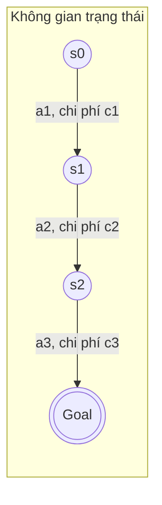
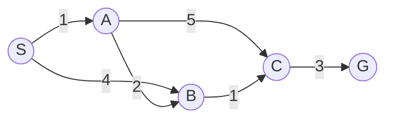
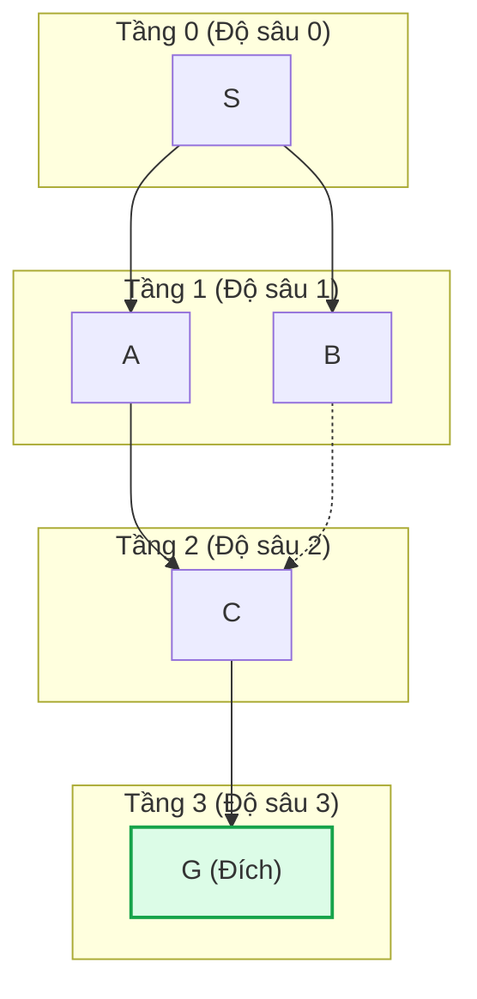
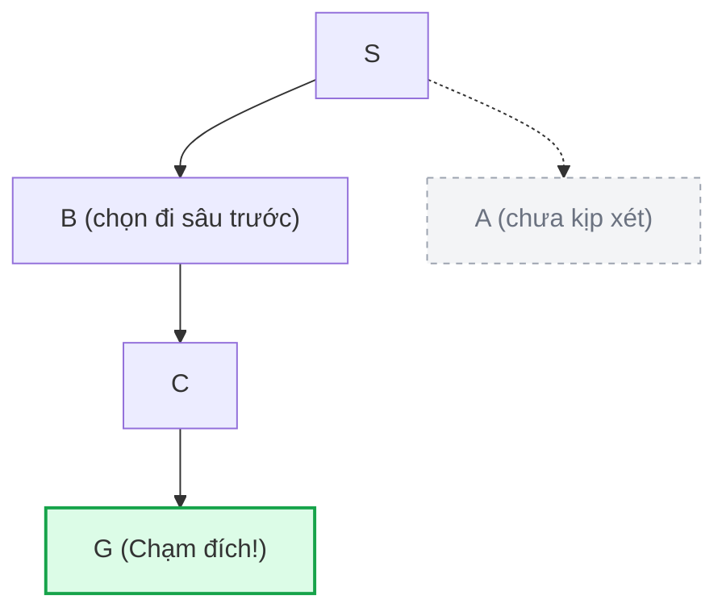
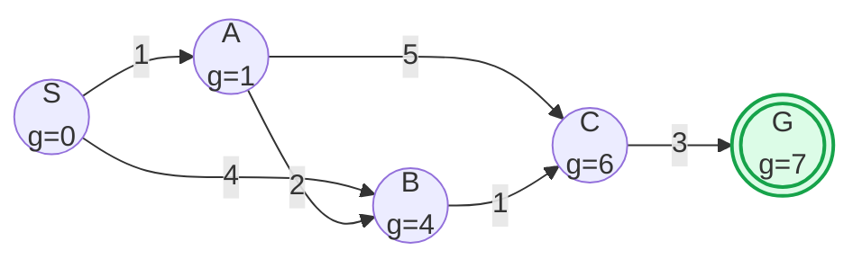
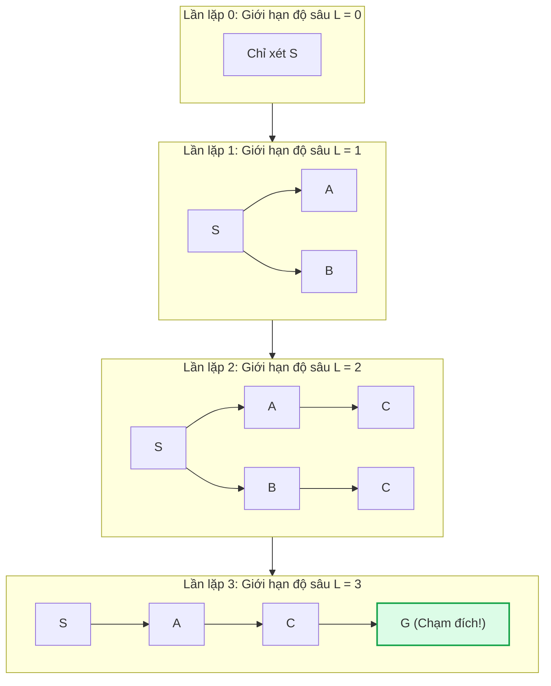

*Học phần AIT2004 — Cơ sở Trí tuệ Nhân tạo*

[Mục lục môn học](/bieu-dien-tri-thuc/notes/00-muc-luc.md) · [Chương 3: Tìm kiếm kinh nghiệm →](/bieu-dien-tri-thuc/bai-giang/03-tim-kiem-kinh-nghiem.md)

::: info Trọng tâm bài giảng
Khi giải một bài toán mà máy tính hoàn toàn không có bất kỳ manh mối hay ước lượng nào về vị trí của đích đến — tựa như việc bước vào một mê cung tối đen mà không có la bàn — nó buộc phải dựa vào cấu trúc liên kết thuần túy của các trạng thái. Đó chính là bản chất của **tìm kiếm không có thông tin (Uninformed Search)**, hay thường gọi dân dã là **tìm kiếm mù**.

Bài giảng này phân tích bản chất cơ chế, tính tối ưu, chi phí tài nguyên và các tình huống ứng dụng thực tế của bốn giải thuật kinh điển:
1. **BFS (Breadth-First Search)** — Tìm kiếm theo chiều rộng: Lan tỏa theo từng lớp đồng mức.
2. **DFS (Depth-First Search)** — Tìm kiếm theo chiều sâu: Thám hiểm kiên định tới tận cùng nhánh.
3. **UCS (Uniform-Cost Search)** — Tìm kiếm chi phí đồng nhất: Dẫn đường bằng chi phí tích lũy thực tế.
4. **IDS (Iterative Deepening Search)** — Tìm kiếm sâu dần: Sự kết hợp tinh tế giữa tiết kiệm bộ nhớ và bảo toàn tính tối ưu.
:::

## Minh họa tương tác

<CodeIllustration type="search" />

---

## 2.1 Từ bài toán thực tế đến không gian trạng thái

Trước khi giải thuật đầu tiên có thể vận hành, người kỹ sư AI phải trả lời được câu hỏi cốt lõi: **Làm thế nào để mô hình hóa bài toán thành ngôn ngữ mà máy tính có thể tìm kiếm?**

Một bài toán tìm kiếm chuẩn mực luôn được xác định bởi 5 thành phần hình thức:
1. **Trạng thái ban đầu (Initial State $s_0$):** Điểm xuất phát của tác tử.
2. **Tập hành động hợp lệ ($\text{Actions}(s)$):** Những việc tác tử có thể làm khi đang ở trạng thái $s$.
3. **Mô hình chuyển trạng thái ($\text{Result}(s, a)$):** Trạng thái mới đạt được sau khi thực hiện hành động $a$ tại $s$.
4. **Kiểm tra đích ($\text{GoalTest}(s)$):** Hàm xác định xem $s$ đã là trạng thái mục tiêu cần đến hay chưa.
5. **Chi phí bước đi ($c(s, a, s')$):** Lượng tài nguyên tiêu hao (thời gian, khoảng cách, xăng dầu) khi chuyển từ $s$ sang $s'$.



### Đồ thị trạng thái khác cây tìm kiếm như thế nào?

Đây là một điểm phân biệt rất quan trọng mà người học cần làm rõ:
- **Đồ thị trạng thái (State Space Graph):** Là bản đồ trừu tượng mô tả toàn bộ cấu trúc bài toán. Mỗi trạng thái vật lý xuất hiện duy nhất một lần. Nếu bài toán có các hành động thuận nghịch (như bước tới rồi bước lùi), đồ thị trạng thái sẽ chứa chu trình.
- **Cây tìm kiếm (Search Tree):** Là cây các đường đi được thuật toán sinh ra trong quá trình thám hiểm. Gốc của cây là trạng thái ban đầu, và mỗi nút trên cây biểu diễn cho **một đường đi cụ thể** từ gốc đến trạng thái đó. Vì vậy, cùng một trạng thái vật lý có thể xuất hiện tại nhiều nút khác nhau trên cây tìm kiếm nếu có nhiều đường đi dẫn tới nó.

---

## 2.2 Đồ thị mẫu dùng xuyên suốt bài học

Để so sánh công bằng và trực quan sức mạnh của từng giải thuật, chúng ta sử dụng một đồ thị trạng thái mẫu có trọng số cố định: trạng thái ban đầu là $S$, đích cần đến là $G$.



Bằng quan sát giải tích, ta dễ dàng tính trước được:
- Đường đi ngắn nhất về **số bước nhảy (cạnh)** là: $S \to A \to C \to G$ hoặc $S \to B \to C \to G$ (cùng tốn 3 bước).
- Đường đi có **tổng chi phí nhỏ nhất (tối ưu thực tế)** là: $S \to A \to B \to C \to G$ với tổng chi phí:
  $$
  c^* = 1 + 2 + 1 + 3 = 7
  $$

Con số $7$ này chính là "thước đo chân lý". Chúng ta hãy xem từng thuật toán mù phản ứng ra sao trước đồ thị này.

---

## 2.3 Breadth-First Search (BFS) — Lan tỏa theo từng lớp đồng mức

### Trực giác cơ chế

Hãy hình dung bạn thả một giọt mực vào ly nước tĩnh lặng: vết mực lan dần thành từng vòng tròn đồng tâm cách đều nhau theo thời gian. BFS hoạt động theo đúng cơ chế đó: nó quét sạch tất cả các nút ở độ sâu $d$ trước khi chạm vào bất kỳ nút nào ở độ sâu $d+1$.

Để hiện thực hóa trật tự này, BFS sử dụng một hàng đợi vào-trước-ra-trước (**FIFO Queue**). Mỗi khi một nút được lấy ra khỏi đầu hàng đợi, tất cả các nút lân cận chưa từng được khám phá của nó sẽ được đưa vào cuối hàng đợi.



### Quá trình duyệt từng bước trên đồ thị mẫu

Quy ước thứ tự duyệt khi có nhiều lựa chọn: ưu tiên đỉnh theo thứ tự chữ cái ($A$ trước $B$).

| Lượt | Đỉnh lấy ra | Tập đỉnh kề sinh ra | Hàng đợi FIFO sau lượt | Ghi chú |
|:---:|:---:|:---|:---|:---|
| 1 | **S** | $A, B$ | $[A, B]$ | Đưa $S$ vào tập đã thăm |
| 2 | **A** | $B$ (đã có trong hàng đợi), $C$ | $[B, C]$ | Thêm $C$ vào hàng đợi |
| 3 | **B** | $C$ (đã có trong hàng đợi) | $[C]$ | Không sinh thêm đỉnh mới |
| 4 | **C** | $G$ | $[G]$ | **Phát hiện nút đích $G$** |
| 5 | **G** | — | $\emptyset$ | Lấy $G$ ra, kết thúc tìm kiếm |

Đường đi tìm được qua BFS: $S \to A \to C \to G$ (độ dài 3 bước nhảy).
Tổng chi phí thực tế:
$$
\text{Chi phí} = 1 + 5 + 3 = 9 > 7
$$

### Đào sâu bản chất: Tại sao BFS tìm ra đường đi đắt hơn?

BFS được thiết kế để tối ưu **số bước chuyển trạng thái (hop count)**, chứ không phải **tổng chi phí tích lũy**. Đối với BFS, một cạnh có trọng số $1$ cũng hoàn toàn bình đẳng với một cạnh có trọng số $1000$.

Một cách người ta hay dùng trong thực tế để kiểm tra nhanh xem có nên dùng BFS hay không:
- Nếu bài toán có chi phí bước đi **đồng nhất** (mọi hành động tiêu tốn chi phí như nhau, ví dụ đếm số bước đi trên bàn cờ ca-rô, lưới ô vuông không chướng ngại vật): BFS **chắc chắn tối ưu**.
- Nếu bài toán có chi phí bước đi **khác nhau** (như độ dài đoạn đường, lượng tiêu thụ nhiên liệu): BFS sẽ tìm ra đường ít bước nhất nhưng có thể rất đắt đỏ.

### Ứng dụng thực tế của BFS
- **Độ tách biệt trong mạng xã hội:** Tìm đường ngắn nhất về số mối quan hệ bạn bè giữa hai người bất kỳ (Degrees of Separation trên LinkedIn/Facebook).
- **Bộ thu thập dữ liệu web (Web Crawler):** Bắt đầu từ trang chủ, tải toàn bộ các liên kết ở độ sâu 1, rồi mới đào sâu tiếp sang các liên kết cấp 2.
- **Phân tích mạng máy tính:** Định tuyến gói tin theo số lượng trạm trung chuyển (hop count) nhỏ nhất.

---

## 2.4 Depth-First Search (DFS) — Thám hiểm kiên định tới tận cùng

### Trực giác cơ chế

Nếu BFS là giọt mực lan đều, thì DFS giống như một người thám hiểm đi trong mê cung theo nguyên tắc: **luôn rẽ trái ở mọi ngã rẽ cho đến khi đụng ngõ cụt**, chỉ khi không còn đường đi tiếp mới chịu quay lui (backtracking) lại ngã ba gần nhất để thử hướng rẽ khác.

DFS sử dụng ngăn xếp vào-sau-ra-trước (**LIFO Stack**), thường được cài đặt trực tiếp thông qua kỹ thuật **đệ quy**.



Giả sử tại đỉnh $S$, ta thử nhánh $B$ trước $A$:
DFS sẽ lao thẳng: $S \to B \to C \to G$. Ngay khi chạm đích $G$, thuật toán công bố kết quả:
$$
\text{Chi phí} = 4 + 1 + 3 = 8
$$
Kết quả này phụ thuộc hoàn toàn vào thứ tự nhánh được chọn khi cài đặt. Nếu ta thử $A$ trước, DFS lại có thể đi theo $S \to A \to C \to G$ ($=9$) hoặc $S \to A \to B \to C \to G$ ($=7$).

### Điểm mạnh tối thượng và tử huyệt của DFS

Hãy so sánh lượng bộ nhớ mà hai giải thuật phải gánh chịu:
- Gọi $b$ là hệ số rẽ nhánh (branching factor - trung bình mỗi đỉnh có $b$ con).
- Gọi $d$ là độ sâu của lời giải nông nhất.
- Gọi $m$ là độ sâu tối đa của không gian trạng thái.

| Tiêu chí | BFS | DFS |
|:---|:---:|:---:|
| **Độ phức tạp thời gian** | $O(b^d)$ | $O(b^m)$ |
| **Độ phức tạp không gian (Bộ nhớ)** | $O(b^d)$ | $O(b \cdot m)$ |

Hãy chú ý thật kỹ sự khác biệt ở hàng **bộ nhớ**:
Trong khi BFS đòi hỏi bộ nhớ bùng nổ theo hàm mũ $O(b^d)$ (buộc phải nhớ toàn bộ biên giới của tầng hiện tại), thì DFS chỉ cần lưu trữ các nút dọc theo đường đi hiện tại từ gốc cộng với các nhánh anh em chưa xét, tức chỉ tốn **bộ nhớ tuyến tính** $O(b \cdot m)$!

Ví dụ sinh động: Giả sử $b = 10$, độ sâu $d = 10$:
- BFS cần lưu trữ khoảng $10^{10}$ nút trong RAM — tương đương hàng chục Gigabyte, máy tính cá nhân lập tức cạn bộ nhớ và dừng chương trình (Out of Memory).
- DFS chỉ cần lưu khoảng $10 \times 10 = 100$ nút trong Call Stack — chỉ vỏn vẹn vài Kilobyte!

Tuy nhiên, **tử huyệt** của DFS là: Nếu không gian trạng thái có chu trình hoặc sâu vô hạn, DFS có thể lao đầu mãi mãi xuống một nhánh cụt mà không bao giờ quay lại, dẫn đến mất tính đầy đủ (Incompleteness).

### Ứng dụng thực tế của DFS
- **Sắp xếp tô-pô (Topological Sorting):** Giải quyết bài toán phụ thuộc gói tin trong quản lý thư viện phần mềm (npm, Maven, apt).
- **Phát hiện chu trình:** Kiểm tra khóa chết (Deadlock) trong hệ điều hành và cơ sở dữ liệu.
- **Trò chơi giải câu đố:** Giải Sudoku, tìm đường đi trong mê cung kín có giới hạn kích thước.

---

## 2.5 Uniform-Cost Search (UCS) — Dẫn đường bằng chi phí thực tế

### Trực giác cơ chế

Làm thế nào để vừa không mù quáng trước số bước nhảy như BFS, vừa không liều lĩnh như DFS? Câu trả lời là: **Hãy luôn mở rộng trạng thái có tổng chi phí tích lũy từ gốc $g(n)$ nhỏ nhất!**

UCS thay thế hàng đợi FIFO đơn thuần bằng một **hàng đợi ưu tiên (Priority Queue)** với khóa sắp xếp là $g(n)$. Về mặt bản chất toán học, UCS chính là thuật toán **Dijkstra** lừng danh được áp dụng trên không gian trạng thái.



### Diễn biến từng bước trên đồ thị mẫu

| Bước | Đỉnh lấy ra khỏi hàng đợi | Chi phí $g(u)$ | Hàng đợi ưu tiên (sắp theo $g$) | Tập đóng (Closed) |
|:---:|:---:|:---:|:---|:---|
| Khởi tạo | — | — | $[(S, 0)]$ | $\emptyset$ |
| 1 | **S** | $0$ | $[(A, 1), (B, 4)]$ | $\{S\}$ |
| 2 | **A** | $1$ | Thử đến $B$ qua $A$ tốn $1+2=3 < 4$ (cập nhật $B$ thành 3). Thêm $C$ với $g=1+5=6$.<br/>Hàng đợi: $[(B, 3), (C, 6)]$ | $\{S, A\}$ |
| 3 | **B** | $3$ | Thử đến $C$ qua $B$ tốn $3+1=4 < 6$ (cập nhật $C$ thành 4).<br/>Hàng đợi: $[(C, 4)]$ | $\{S, A, B\}$ |
| 4 | **C** | $4$ | Đến $G$ qua $C$ tốn $4+3=7$.<br/>Hàng đợi: $[(G, 7)]$ | $\{S, A, B, C\}$ |
| 5 | **G** | $7$ | Lấy $G$ ra khỏi hàng đợi $\to$ **DỪNG** | $\{S, A, B, C, G\}$ |

Kết quả đường đi:
$$
S \to A \to B \to C \to G, \quad \text{Tổng chi phí} = 7 \quad (\text{Tối ưu tuyệt đối!})
$$

### Quy tắc vàng khi cài đặt UCS: Điều kiện dừng chuẩn xác

Một câu hỏi bản chất mà người mới học thường băn khoăn là: **Tại sao ta không được dừng ngay khi vừa nhìn thấy nút đích được sinh ra (được đẩy vào hàng đợi)?**

Hãy suy ngẫm trường hợp sau: Giả sử tại Bước 2, từ đỉnh $A$ ta có một cạnh nối trực tiếp đến $G$ với chi phí $10$. Lúc đó, cặp $(G, 11)$ sẽ được đẩy vào hàng đợi ưu tiên.
Nếu dừng ngay lúc thấy $G$, thuật toán sẽ trả về đường đi qua cạnh đó với chi phí $11$. Nhưng trong hàng đợi lúc đó vẫn còn đỉnh $B$ với chi phí chỉ là $3$. Từ $B$, ta hoàn toàn có thể đi tiếp tới $G$ với tổng chi phí chỉ là $7$.

> **Quy tắc bất biến:** UCS (và cả A* sau này) **chỉ được phép công bố lời giải khi nút đích được lấy ra (pop) khỏi hàng đợi ưu tiên**, tuyệt đối không dừng khi nút đích vừa được sinh ra (push).

### Điều kiện đảm bảo tính tối ưu của UCS
Để UCS đảm bảo tìm ra lời giải tối ưu và dừng lại được, mọi chi phí bước đi phải bị chặn dưới bởi một số thực dương nhỏ $\epsilon > 0$:
$$
c(s, a, s') \ge \epsilon > 0
$$
Nếu tồn tại cạnh có chi phí bằng $0$ hoặc âm, thuật toán có thể lặp vô tận trên các chu trình không tốn phí mà không bao giờ tiến đến đích.

---

## 2.6 Iterative Deepening Search (IDS) — Đỉnh cao dung hòa

Chúng ta đứng trước một nghịch lý lớn:
- **BFS:** Tìm được đường tối ưu về số bước, nhưng **bộ nhớ RAM bùng nổ theo hàm mũ**, nhanh chóng làm tràn máy.
- **DFS:** Bộ nhớ tuyến tính cực kỳ thanh thoát, nhưng **không tối ưu** và có thể **lạc vô tận** trong nhánh sâu.

Liệu có giải pháp nào mang trọn vẹn ưu điểm của cả hai: vừa tốn ít bộ nhớ như DFS, lại vừa đảm bảo tìm được lời giải nông nhất như BFS?
Nhà khoa học máy tính Richard Korf đã đưa ra câu trả lời xuất sắc: **Tìm kiếm sâu dần (Iterative Deepening Search - IDS)**.



### Cơ chế hoạt động
IDS chạy thuật toán DFS lặp đi lặp lại nhiều lần với giới hạn độ sâu $\ell$ tăng dần từng bước: $\ell = 0, 1, 2, 3, \ldots$
- Tại mỗi vòng lặp, DFS bị chặn đứng nếu chạm tới độ sâu $\ell$.
- Nếu không tìm thấy đích trong ngưỡng $\ell$, toàn bộ cây tìm kiếm được giải phóng khỏi bộ nhớ, và vòng lặp tiếp theo bắt đầu lại từ đầu với ngưỡng $\ell + 1$.

### Giải đáp nghi vấn: "Lặp lại từ đầu có gây lãng phí khủng khiếp không?"

Một phản xạ rất tự nhiên của người học là: "Mỗi lần tăng giới hạn, ta lại phải duyệt lại tất cả các nút ở tầng trên từ đầu. Làm như vậy chẳng phải quá lãng phí tài nguyên tính toán hay sao?"

Để hiểu thấu đáo câu trả lời, hãy nhìn vào bản chất của **cấp số nhân**:
Trong một cây tìm kiếm với hệ số rẽ nhánh $b$:
- Tầng sâu nhất $d$ có $b^d$ nút.
- Tầng $d-1$ có $b^{d-1}$ nút.
- Tổng số nút ở tất cả các tầng phía trên gộp lại chỉ xấp xỉ $\frac{b^d}{b-1}$.

Số lần một nút ở độ sâu $i$ được duyệt trong IDS là $(d - i + 1)$. Tổng số lần duyệt nút trên toàn cây là:
$$
N_{\text{IDS}} = (d+1) \cdot 1 + d \cdot b + (d-1) \cdot b^2 + \cdots + 1 \cdot b^d
$$

Khi $b > 1$ (ví dụ thực tế $b = 10$ và $d = 5$):
- Nút ở tầng đáy ($d=5$) có $100.000$ nút, chỉ bị duyệt đúng **1 lần**.
- Nút ở tầng $4$ có $10.000$ nút, bị duyệt $2$ lần.
- Nút ở tầng gốc chỉ có $1$ nút, bị duyệt $6$ lần.

Tổng số thao tác của IDS chỉ tăng thêm khoảng $\frac{b}{b-1}$ lần so với BFS (khi $b=10$, chi phí chỉ tăng thêm chừng $11\%$).
Đánh đổi một lượng tính toán phụ cực nhỏ để đổi lấy **sự an toàn tuyệt đối về bộ nhớ** (chỉ tốn $O(b \cdot d)$ thay vì $O(b^d)$) là một sự đánh đổi quá hời! Đó là lý do IDS được xem là giải thuật tìm kiếm mù tiêu chuẩn khi không gian tìm kiếm lớn và độ sâu của đích chưa biết trước.

---

## 2.7 Bảng đối chiếu tổng kết bốn thuật toán

Dưới đây là bức tranh toàn cảnh để định hình tư duy giải thuật:

| Tiêu chuẩn đánh giá | BFS | DFS | UCS | IDS |
|:---|:---:|:---:|:---:|:---:|
| **Tính đầy đủ (Complete)?** | Có (nếu $b$ hữu hạn) | Không (vô hạn/chu trình) | Có (nếu $c \ge \epsilon > 0$) | Có (nếu $b$ hữu hạn) |
| **Tính tối ưu (Optimal)?** | Chỉ khi chi phí bước đều | Không | **Có (theo chi phí)** | Chỉ khi chi phí bước đều |
| **Thời gian** | $O(b^d)$ | $O(b^m)$ | $O\left(b^{1 + \lfloor C^* / \epsilon \rfloor}\right)$ | $O(b^d)$ |
| **Bộ nhớ (Không gian)** | $O(b^d)$ *(nút thắt)* | $O(b \cdot m)$ *(rất nhỏ)* | $O\left(b^{1 + \lfloor C^* / \epsilon \rfloor}\right)$ | $O(b \cdot d)$ *(tối ưu nhất)* |

*Ký hiệu: $b$ là hệ số nhánh, $d$ là độ sâu lời giải nông nhất, $m$ là độ sâu lớn nhất của không gian trạng thái, $C^*$ là chi phí của lời giải tối ưu.*

---

## 2.8 Cài đặt mẫu bằng C++ chuẩn mực

Mã nguồn dưới đây minh họa sự khác biệt căn bản trong việc tổ chức cấu trúc dữ liệu giữa ba chiến lược cốt lõi: BFS, DFS và IDS.

```cpp
#include <iostream>
#include <vector>
#include <queue>
#include <stack>
#include <algorithm>

using namespace std;

struct Edge {
    int to;
    int cost;
};

using Graph = vector<vector<Edge>>;

// ============================================================================
// 1. BREADTH-FIRST SEARCH (BFS)
// Dùng hàng đợi FIFO; tối ưu về số bước chuyển trạng thái (hops)
// ============================================================================
vector<int> breadthFirstSearch(int start, int goal, const Graph& graph) {
    int n = graph.size();
    queue<int> frontier;
    vector<bool> visited(n, false);
    vector<int> parent(n, -1);

    frontier.push(start);
    visited[start] = true;

    while (!frontier.empty()) {
        int u = frontier.front();
        frontier.pop();

        if (u == goal) break; // Phát hiện đích

        for (const auto& edge : graph[u]) {
            int v = edge.to;
            if (!visited[v]) {
                visited[v] = true;
                parent[v] = u;
                frontier.push(v);
            }
        }
    }

    // Tái dựng lại lộ trình từ đỉnh đích về nguồn
    vector<int> path;
    for (int curr = goal; curr != -1; curr = parent[curr]) {
        path.push_back(curr);
    }
    reverse(path.begin(), path.end());
    return (path.front() == start) ? path : vector<int>{};
}

// ============================================================================
// 2. DEPTH-FIRST SEARCH (DFS)
// Dùng đệ quy (ngăn xếp hệ thống); tiết kiệm tối đa bộ nhớ làm việc
// ============================================================================
bool depthFirstSearchRecursive(int u, int goal, const Graph& graph,
                               vector<bool>& inPath, vector<int>& path) {
    path.push_back(u);
    inPath[u] = true;

    if (u == goal) return true;

    for (const auto& edge : graph[u]) {
        int v = edge.to;
        if (!inPath[v]) {
            if (depthFirstSearchRecursive(v, goal, graph, inPath, path)) {
                return true;
            }
        }
    }

    // Quay lui (Backtracking)
    path.pop_back();
    inPath[u] = false;
    return false;
}

// ============================================================================
// 3. ITERATIVE DEEPENING SEARCH (IDS)
// DFS có kiểm soát giới hạn độ sâu, lặp tăng dần từ 0 tới maxDepth
// ============================================================================
bool depthLimitedSearch(int u, int goal, int limit, const Graph& graph, vector<int>& path) {
    path.push_back(u);
    if (u == goal) return true;
    if (limit <= 0) {
        path.pop_back();
        return false; // Chạm ngưỡng độ sâu, cắt nhánh
    }

    for (const auto& edge : graph[u]) {
        if (depthLimitedSearch(edge.to, goal, limit - 1, graph, path)) {
            return true;
        }
    }

    path.pop_back();
    return false;
}

vector<int> iterativeDeepeningSearch(int start, int goal, const Graph& graph, int maxDepth) {
    for (int depth = 0; depth <= maxDepth; ++depth) {
        vector<int> path;
        if (depthLimitedSearch(start, goal, depth, graph, path)) {
            return path; // Tìm thấy lời giải ở độ sâu nhỏ nhất
        }
    }
    return {};
}
```

---

## 2.9 Những cạm bẫy tư duy thường gặp

1. **Đồng nhất hóa tính tối ưu của BFS với mọi bài toán:**
   *Hiểu đúng:* BFS chỉ tối ưu khi mọi hành động có chi phí bằng nhau. Khi cạnh có trọng số khác nhau, BFS chỉ tối ưu về số cạnh đã đi, không tối ưu về tổng chi phí.
2. **Dừng tìm kiếm quá sớm trong UCS:**
   *Hiểu đúng:* Không bao giờ được dừng khi vừa nhìn thấy đích được đẩy vào hàng đợi ưu tiên. Phải đợi cho tới khi đích được rút ra khỏi đầu hàng đợi, bởi vì có thể tồn tại một đường đi vòng khác qua các nút trung gian chưa mở rộng nhưng có tổng chi phí rẻ hơn.
3. **Ngộ nhận rằng IDS lãng phí vì duyệt lại:**
   *Hiểu đúng:* Nhờ sự bùng nổ cấp số nhân ở tầng đáy, chi phí duyệt lặp ở các tầng nông chỉ chiếm một tỉ lệ không đáng kể (chừng 10–15% tổng thời gian). Sự đánh đổi này mang lại lợi ích vô giá: bộ nhớ chỉ tốn $O(b \cdot d)$.

---

[← Quay lại Mục lục](/bieu-dien-tri-thuc/notes/00-muc-luc.md) · [Tiếp tục sang Chương 3: Tìm kiếm kinh nghiệm →](/bieu-dien-tri-thuc/bai-giang/03-tim-kiem-kinh-nghiem.md)
