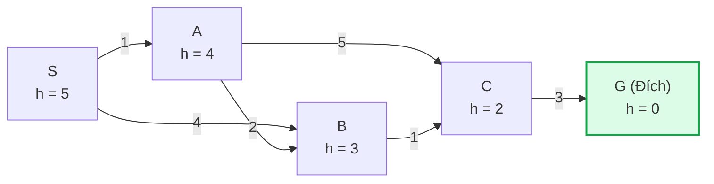
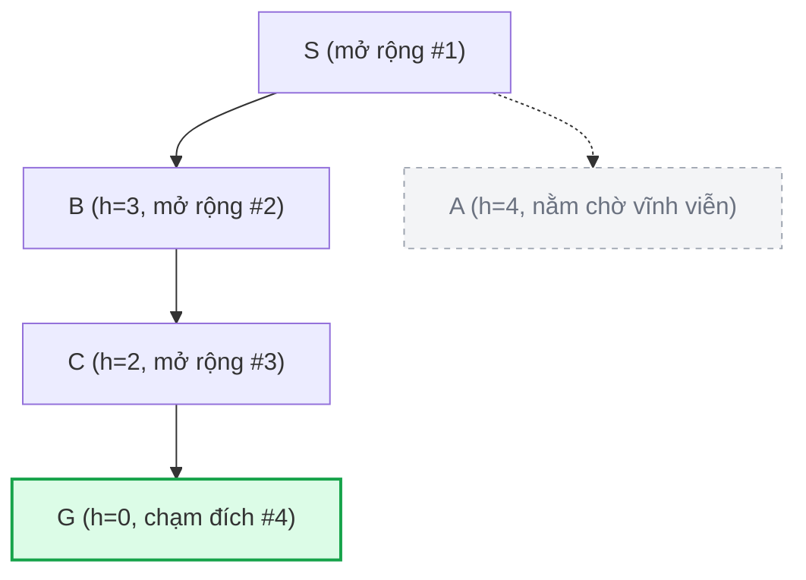
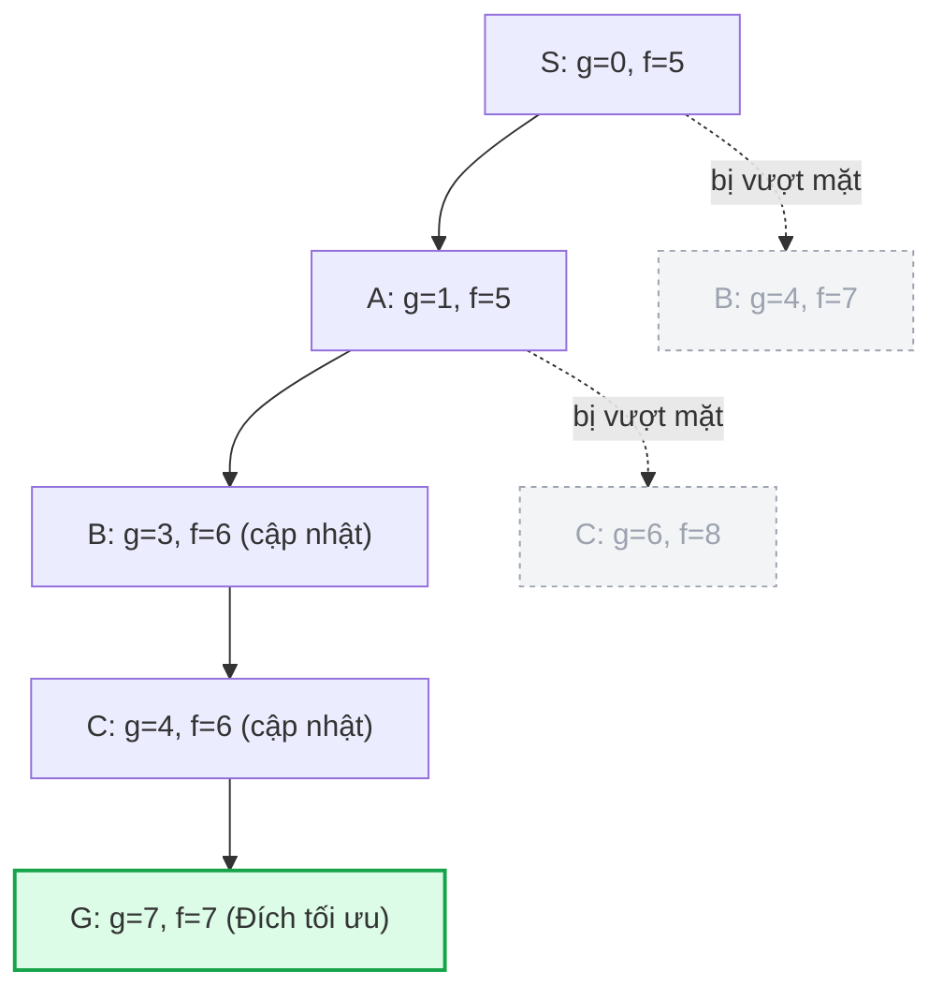

*Học phần AIT2004 — Cơ sở Trí tuệ Nhân tạo*

← [Chương 2: Tìm kiếm mù](/bieu-dien-tri-thuc/bai-giang/02-tim-kiem-mu.md) · [Mục lục môn học](/bieu-dien-tri-thuc/notes/00-muc-luc.md) · [Chương 4: Tìm kiếm đối kháng →](/bieu-dien-tri-thuc/bai-giang/04-tim-kiem-doi-khang.md)

::: info Trọng tâm bài giảng
Trong Chương 2, chúng ta đã chứng kiến giới hạn nghẹt thở của các giải thuật tìm kiếm mù: không có la bàn định hướng, UCS buộc phải quét đều các đường đồng mức ra mọi phía như sóng nước, khiến không gian tìm kiếm bùng nổ khủng khiếp khi bài toán mở rộng quy mô.

Làm thế nào để cỗ máy biết "nhìn về phía trước" và dồn toàn bộ nỗ lực thám hiểm về hướng chứa đích đến? Giải pháp nằm ở **hàm kinh nghiệm Heuristic $h(n)$**. Bài giảng này đi sâu vào:
1. **Tìm kiếm tham lam (Greedy Best-First Search):** Khi sự thiển cận chỉ nhìn vào tương lai dẫn tới bẫy sai lầm.
2. **Thuật toán A\*:** Sự kết tinh hoàn hảo giữa chi phí thực tế đã đi $g(n)$ và ước lượng tương lai $h(n)$.
3. **Bản chất của Heuristic:** Tính chấp nhận được (Admissible), tính nhất quán (Consistent) và nghệ thuật thiết kế heuristic bằng phương pháp nới lỏng bài toán.
4. **Giải thuật IDA\*:** Biến thể sâu dần giúp chinh phục các không gian trạng thái khổng lồ mà không lo cạn kiệt bộ nhớ RAM.
:::

## Minh họa tương tác

<CodeIllustration type="search" />

---

## 3.0 Đồ thị mẫu kèm giá trị Heuristic

Để đối chiếu trực tiếp với kết quả của Chương 2, ta giữ nguyên đồ thị trạng thái mẫu ($S \to G$), bổ sung thêm giá trị hàm lượng giá heuristic $h(n)$ tại từng đỉnh (ước lượng khoảng cách từ đỉnh đó về đích $G$):



Lời giải tối ưu thực tế đã biết:
$$
S \to A \to B \to C \to G, \quad \text{Tổng chi phí thực tế } C^* = 1 + 2 + 1 + 3 = 7
$$

Trong Chương 2:
- BFS tìm ra $S \to A \to C \to G$ với chi phí $9$ (bị đánh lừa bởi số cạnh ít).
- DFS phụ thuộc vào may rủi của thứ tự nhánh.
- UCS tìm đúng $7$ nhưng phải duyệt qua mọi nút trong mạng vì không biết đích ở hướng nào.

Bây giờ, chúng ta hãy xem việc trang bị thêm tri thức định hướng $h(n)$ sẽ thay đổi cuộc chơi như thế nào.

---

## 3.1 Tìm kiếm ăn tham (Greedy Best-First Search)

### Trực giác và hàm đánh giá

Chiến lược ăn tham (Greedy) vận hành theo đúng tâm lý thông thường của con người khi vội vã: **Tại mỗi bước, luôn chọn đi tới trạng thái có vẻ gần đích nhất ngay trước mắt.**

Thuật toán chỉ nhìn về phía tương lai và hoàn toàn phớt lờ chi phí quá khứ đã bỏ ra:
$$
f(n) = h(n)
$$

### Diễn biến từng bước trên đồ thị mẫu

Thuật toán sử dụng một hàng đợi ưu tiên sắp xếp tăng dần theo giá trị $h(n)$:

| Lượt | Đỉnh lấy ra | $h(u)$ | Hàng đợi ưu tiên (sắp theo $h$) | Tập đóng (Closed) | Nhận xét |
|:---:|:---:|:---:|:---|:---|:---|
| 1 | **S** | $5$ | $[(B, 3), (A, 4)]$ | $\{S\}$ | Vì $h(B) = 3 < h(A) = 4$, ưu tiên $B$ trước |
| 2 | **B** | $3$ | $[(C, 2), (A, 4)]$ | $\{S, B\}$ | Sinh $C$ với $h(C) = 2$ |
| 3 | **C** | $2$ | $[(G, 0), (A, 4)]$ | $\{S, B, C\}$ | Sinh $G$ với $h(G) = 0$ |
| 4 | **G** | $0$ | $[(A, 4)]$ | $\{S, B, C, G\}$ | **Lấy $G$ ra, dừng tìm kiếm** |



Kết quả đường đi do Greedy tìm được:
$$
S \to B \to C \to G, \quad \text{Tổng chi phí} = 4 + 1 + 3 = 8 > 7
$$

Đỉnh $A$ có $h(A) = 4$ không bao giờ được chạm tới, dù đoạn đường qua $A$ có chi phí thực tế chỉ là $1+2 = 3$, rẻ hơn nhiều so với đi thẳng sang $B$ tốn $4$.

### Đào sâu bản chất: Điểm mù của chiến lược ăn tham

Tại sao Greedy lại thất bại trong việc tìm lời giải tối ưu?
Nguyên nhân cốt lõi là tính **thiển cận (myopic)** của giải thuật:
- Nó bị thu hút bởi các trạng thái có $h(n)$ nhỏ, nhưng một trạng thái có vẻ gần đích theo đường chim bay hoàn toàn có thể dẫn vào một địa hình hiểm trở có chi phí vượt qua rất lớn.
- Trong các ứng dụng thực tế như bản đồ giao thông: Một con đường hẻm nhỏ đâm thẳng về hướng mục tiêu ($h$ giảm nhanh) có thể dẫn tới tắc đường nghẽn cứng, trong khi đường vành đai vòng xa hơn một chút ($h$ giảm chậm) lại là đường cao tốc thông thoáng. Greedy sẽ luôn đâm đầu vào con ngõ hẻm đó.

Độ phức tạp thời gian trong trường hợp xấu nhất của Greedy tương tự như DFS: $O(b^m)$, và nó hoàn toàn không bảo đảm tính tối ưu.

---

## 3.2 Thuật toán A\* — Đỉnh cao kết hợp giữa quá khứ và tương lai

### Trực giác toán học của A\*

Để khắc phục sai lầm của cả UCS (quá cẩn trọng, chỉ nhìn quá khứ) lẫn Greedy (quá vội vã, chỉ nhìn tương lai), các nhà nghiên cứu Peter Hart, Nils Nilsson và Bertram Raphael (1968) đã đưa ra một công thức kinh điển kết hợp cả hai yếu tố:

$$
f(n) = g(n) + h(n)
$$

Trong đó:
- $g(n)$: **Chi phí thực tế** đã tiêu tốn để đi từ điểm xuất phát tới nút $n$ (đây là thành phần của UCS).
- $h(n)$: **Ước lượng chi phí còn lại** để đi từ $n$ tới đích (đây là thành phần của Greedy).
- $f(n)$: **Ước lượng tổng chi phí rẻ nhất** của một hành trình hoàn chỉnh đi từ điểm xuất phát, xuyên qua nút $n$, và kết thúc tại đích.

Một cách người ta hay dùng để hình dung ý nghĩa của $f(n)$ trong đời sống: Khi lập kế hoạch tài chính cho một dự án, bạn không thể chỉ nhìn số tiền đã tiêu ($g$), cũng không thể chỉ nhìn số tiền dự trù còn thiếu ($h$). Tổng ngân sách dự kiến của cả dự án bắt buộc phải là tổng của hai con số đó: $f = g + h$.

```mermaid
flowchart LR
    Start((Start)) -->|g(n): chi phí đã đi thật sự| N((Nút n))
    N -.->|h(n): khoảng cách ước tính| Goal(((Goal)))
```

### Diễn biến từng bước của A\* trên đồ thị mẫu

A\* sử dụng hàng đợi ưu tiên sắp xếp tăng dần theo giá trị $f(n) = g(n) + h(n)$:

| Lượt | Đỉnh lấy ra | $g$ | $h$ | $f=g+h$ | Hàng đợi ưu tiên sau khi cập nhật | Tập Closed |
|:---:|:---:|:---:|:---:|:---:|:---|:---|
| 1 | **S** | $0$ | $5$ | $5$ | $A(g=1, f=5)$, $B(g=4, f=7)$ | $\{S\}$ |
| 2 | **A** | $1$ | $4$ | $5$ | Đến $B$ qua $A$: $g=1+2=3, f=3+3=6$ (tốt hơn $f=7$ cũ).<br/>Đến $C$ qua $A$: $g=1+5=6, f=6+2=8$.<br/>Hàng đợi: $B(g=3, f=6)$, $B_{cũ}(f=7)$, $C(g=6, f=8)$ | $\{S, A\}$ |
| 3 | **B** | $3$ | $3$ | $6$ | Đến $C$ qua $B$: $g=3+1=4, f=4+2=6$ (tốt hơn $f=8$ cũ).<br/>Hàng đợi: $C(g=4, f=6)$, $B_{cũ}(f=7)$, $C_{cũ}(f=8)$ | $\{S, A, B\}$ |
| 4 | **C** | $4$ | $2$ | $6$ | Đến $G$ qua $C$: $g=4+3=7, f=7+0=7$.<br/>Hàng đợi: $G(g=7, f=7)$, $B_{cũ}(f=7)$, $C_{cũ}(f=8)$ | $\{S, A, B, C\}$ |
| 5 | **G** | $7$ | $0$ | $7$ | Lấy $G$ ra khỏi hàng đợi $\to$ **DỪNG TÌM KIẾM** | $\{S, A, B, C, G\}$ |



Kết quả: A\* tìm ra lộ trình hoàn hảo $S \to A \to B \to C \to G$ với chi phí $7$, đồng thời chỉ phải mở rộng đúng các nút trên trục tối ưu, không hề duyệt lãng phí các hướng đi lạc như UCS!

---

## 3.3 Điều kiện bảo toàn tính tối ưu của A\*

A\* có luôn tìm ra lời giải tối ưu không? Câu trả lời là: **Phụ thuộc hoàn toàn vào phẩm chất của hàm Heuristic $h(n)$**.

### 1. Tính chấp nhận được (Admissibility) — Áp dụng cho tìm kiếm trên cây

Một hàm Heuristic $h(n)$ được gọi là **chấp nhận được (admissible)** nếu nó **không bao giờ ước lượng cao hơn chi phí thực tế**:
$$
0 \le h(n) \le h^*(n), \quad \forall n
$$
Trong đó $h^*(n)$ là chi phí thực tế rẻ nhất từ nút $n$ về đích. Tại đích, bắt buộc $h(\text{đích}) = 0$.

> **Ẩn dụ sư phạm:** Hàm heuristic chấp nhận được giống như một người dẫn đường luôn giữ thái độ **lạc quan có căn cứ**. Người đó có thể ước lượng con đường phía trước ngắn hơn thực tế một chút, nhưng tuyệt đối không bao giờ dọa bạn rằng con đường đó dài hơn sự thật. Chính sự lạc quan này ngăn cản việc một đường đi tiềm năng tốt bị bỏ rơi.

#### Chứng minh định lý: A\* trên cây tìm kiếm luôn tối ưu nếu $h$ chấp nhận được

Gọi $G_2$ là một trạng thái đích cận tối ưu ($g(G_2) > C^*$), và $C^*$ là chi phí của lời giải tối ưu thực sự.
Giả sử phản chứng rằng A\* lấy $G_2$ ra khỏi hàng đợi trước khi tìm thấy lời giải tối ưu.

1. Vì có một đường đi tối ưu tồn tại từ gốc tới đích tối ưu, chắc chắn phải có ít nhất một nút $n$ nằm trên đường đi tối ưu đó đang hiện diện trong hàng đợi ưu tiên (Open List).
2. Theo tính chất chấp nhận được:
   $$
   f(n) = g(n) + h(n) \le g(n) + h^*(n) = C^*
   $$
3. Vì $G_2$ là trạng thái đích nên $h(G_2) = 0$, do đó:
   $$
   f(G_2) = g(G_2) + h(G_2) = g(G_2) > C^*
   $$
4. Kết hợp hai bất đẳng thức trên:
   $$
   f(n) \le C^* < f(G_2) \implies f(n) < f(G_2)
   $$
5. Vì hàng đợi ưu tiên luôn rút nút có giá trị $f$ nhỏ nhất trước, nút $n$ bắt buộc phải được lấy ra và mở rộng **trước** $G_2$. Điều này dẫn tới mâu thuẫn với giả thiết $G_2$ bị lấy ra trước!
   Vậy A\* trên cây tìm kiếm không bao giờ chọn nhầm một đích kém tối ưu. $\blacksquare$

---

### 2. Tính nhất quán (Consistency / Monotonicity) — Áp dụng cho tìm kiếm trên đồ thị

Khi tìm kiếm trên **đồ thị** (nơi có nhiều đường dẫn tới cùng một trạng thái và ta duy trì một tập đóng Closed để không duyệt lại các đỉnh đã xử lý), tính chất chấp nhận được là **chưa đủ**. Ta cần một điều kiện mạnh hơn: **Tính nhất quán (Consistency)**.

Một heuristic $h(n)$ được gọi là nhất quán nếu với mọi nút $n$ và mọi nút con $n'$ sinh ra từ hành động $a$ có chi phí $c(n, a, n')$, ta luôn có:
$$
h(n) \le c(n, a, n') + h(n')
$$

```mermaid
flowchart LR
    N["Nút n<br/>h(n)"] -->|c(n, a, n')| Np["Nút n'<br/>h(n')"]
    N -.->|Đường trực tiếp h(n)| Goal(((Goal)))
    Np -.->|h(n')| Goal
```

Bất đẳng thức này phản ánh cấu trúc của **bất đẳng thức tam giác**: Chi phí ước tính từ $n$ về đích không được phép lớn hơn chi phí đi từ $n$ sang $n'$ cộng với chi phí ước tính từ $n'$ về đích.

#### Hệ quả thực hành của tính nhất quán
Nếu $h(n)$ nhất quán, giá trị $f(n)$ dọc theo bất kỳ đường đi nào sẽ **không bao giờ giảm**:
$$
f(n') = g(n') + h(n') = g(n) + c(n, a, n') + h(n') \ge g(n) + h(n) = f(n)
$$

Hệ quả toán học then chốt:
> Khi $h(n)$ nhất quán, thời điểm một nút $u$ được lấy ra khỏi hàng đợi ưu tiên (đưa vào tập Closed), **đường đi tìm được tới $u$ đã chắc chắn là đường đi ngắn nhất tối ưu**. Ta có thể an tâm đóng vĩnh viễn nút $u$ mà không bao giờ cần phải mở lại (re-open) nó!

#### Cạm bẫy thực tế: Khi heuristic chấp nhận được nhưng KHÔNG nhất quán
Xét ví dụ: Nếu ta cố tình sửa $h(A) = 6$ (vẫn chấp nhận được vì chi phí thật từ $A$ tới $G$ là $6$), nhưng tại cạnh $A \to B$ có chi phí $2$:
$$
h(A) = 6 > 2 + h(B) = 2 + 3 = 5 \quad (\text{Vi phạm tính nhất quán!})
$$
Nếu cài đặt đồ thị thông thường (đã vào Closed là bỏ qua), đỉnh $B$ sẽ bị mở rộng từ $S$ trước với $g=4, f=7$. Sau đó khi $A$ mở rộng và tìm ra đường tới $B$ tốt hơn với $g=3$, vì $B$ đã nằm trong Closed nên đường đi ưu việt này bị vứt bỏ! A\* sẽ trả về chi phí $8$ thay vì $7$.

---

## 3.4 Nghệ thuật thiết kế Heuristic trong thực tế

Một câu hỏi mang tính bản chất kỹ thuật: **Làm thế nào để các kỹ sư tạo ra được một hàm heuristic vừa tốt, vừa đảm bảo tính nhất quán?**

Câu trả lời nằm ở phương pháp **Nới lỏng bài toán (Problem Relaxation)**:
Một bài toán nới lỏng được tạo ra bằng cách **lược bỏ bớt một số luật hoặc ràng buộc** của bài toán gốc. Khi các ràng buộc bị gỡ bỏ, số lượng hành động hợp lệ tăng lên, và chi phí tối ưu của bài toán nới lỏng sẽ tự nhiên trở thành một cận dưới (Admissible & Consistent Heuristic) cho bài toán gốc!

### Ví dụ kinh điển: Trò chơi 8-Puzzle (Xếp số 8 ô)

Quy tắc bài toán gốc: Một ô số chỉ có thể di chuyển sang vị trí $B$ nếu $B$ kề cạnh với nó **và** $B$ đang là ô trống.

```
Trạng thái ban đầu:       Trạng thái đích:
  [ 7 | 2 | 4 ]             [ 1 | 2 | 3 ]
  [ 5 |   | 6 ]             [ 4 | 5 | 6 ]
  [ 8 | 3 | 1 ]             [ 7 | 8 |   ]
```

1. **Nới lỏng cấp độ 1:** Cho phép một ô số di chuyển sang bất kỳ ô nào, kể cả khi ô đó không kề cạnh và đang có số khác nằm đè lên.
   $\to$ Ta thu được Heuristic $h_1$: **Số ô nằm sai vị trí so với đích**.
2. **Nới lỏng cấp độ 2:** Cho phép một ô số di chuyển sang ô kề cạnh ngay cả khi ô đó đang bị ô khác chiếm chỗ.
   $\to$ Ta thu được Heuristic $h_2$: **Tổng khoảng cách Manhattan** (tổng độ lệch ngang và dọc của từng ô về vị trí đích của nó).

### Khái niệm Thống trị Heuristic (Heuristic Dominance)
Dễ thấy với mọi trạng thái $n$, ta luôn có:
$$
h_2(n) \ge h_1(n)
$$
Khi một heuristic $h_2$ luôn cho giá trị ước lượng lớn hơn hoặc bằng $h_1$ trên mọi trạng thái (và cả hai đều không vượt quá $h^*$), ta nói **$h_2$ thống trị $h_1$**.
Trong thực tế, sử dụng heuristic thống trị hơn ($h_2$) sẽ giúp A\* loại bỏ được nhiều nhánh thừa hơn, mở rộng ít nút hơn đáng kể và tìm ra lời giải nhanh hơn gấp nhiều lần.

---

## 3.5 Thuật toán IDA\* (Iterative-Deepening A\*)

Mặc dù A\* có tốc độ mở rộng vượt bậc so với UCS, nó vẫn phải chịu chung số phận với BFS ở một điểm: **phải lưu trữ toàn bộ các nút sinh ra trong bộ nhớ RAM**. Với các bài toán có không gian trạng thái lớn như khối Rubik hay 15-Puzzle, A\* sẽ làm tràn bộ nhớ chỉ sau vài giây.

Để giải quyết nút thắt này, giải thuật **IDA\* (Iterative-Deepening A\*)** ra đời:
- Tương tự như IDS dùng DFS lặp theo độ sâu, IDA\* chạy DFS lặp nhưng giới hạn bởi **ngưỡng chi phí $f = g + h$**.
- Tại mỗi vòng lặp, DFS duyệt nhánh cho tới khi $f(n)$ vượt quá ngưỡng hiện tại thì cắt tỉa.
- Ngưỡng cho vòng lặp tiếp theo chính là **giá trị $f$ nhỏ nhất trong số các nút bị cắt tỉa ở vòng trước**.

Nhờ đó, IDA\* giữ trọn vẹn ưu điểm tìm kiếm tối ưu của A\* nhưng chỉ tiêu tốn **bộ nhớ tuyến tính** $O(b \cdot d)$!

---

## 3.6 Cài đặt C++ hoàn chỉnh cho A\*

Trong thực tế lập trình, cấu trúc `std::priority_queue` của C++ không hỗ trợ thao tác giảm khóa (`decrease-key`). Một kỹ thuật chuẩn mực được các kỹ sư áp dụng là **Lazy Deletion**: Khi tìm thấy đường đi tốt hơn tới một đỉnh đã có trong hàng đợi, ta chỉ việc đẩy thêm bản ghi mới với giá trị $f$ nhỏ hơn vào hàng đợi. Về sau, khi rút ra một bản ghi mà đỉnh đó đã được đánh dấu trong tập Closed, ta chỉ việc bỏ qua nó.

```cpp
#include <iostream>
#include <vector>
#include <queue>
#include <unordered_map>
#include <limits>
#include <algorithm>

using namespace std;

struct Edge {
    int to;
    int cost;
};

struct AStarNode {
    int id;
    int g;
    int f;

    // Toán tử so sánh cho min-heap (ưu tiên f nhỏ nhất)
    bool operator>(const AStarNode& other) const {
        return f > other.f;
    }
};

using Graph = vector<vector<Edge>>;

vector<int> aStarSearch(int start, int goal, const Graph& graph, const vector<int>& h) {
    int n = graph.size();
    priority_queue<AStarNode, vector<AStarNode>, greater<AStarNode>> openList;
    vector<int> bestG(n, numeric_limits<int>::max());
    vector<int> parent(n, -1);
    vector<bool> closed(n, false);

    bestG[start] = 0;
    openList.push({start, 0, h[start]});

    while (!openList.empty()) {
        AStarNode current = openList.top();
        openList.pop();

        int u = current.id;

        // Nếu đỉnh này đã được đóng với đường đi tối ưu, bỏ qua bản ghi cũ dư thừa
        if (closed[u]) continue;

        // Điểm then chốt: CHỈ công bố kết quả khi lấy nút đích ra khỏi hàng đợi
        if (u == goal) {
            vector<int> path;
            for (int curr = goal; curr != -1; curr = parent[curr]) {
                path.push_back(curr);
            }
            reverse(path.begin(), path.end());
            return path;
        }

        closed[u] = true;

        for (const auto& edge : graph[u]) {
            int v = edge.to;
            int newG = current.g + edge.cost;

            // Tìm thấy đường đi tới v có chi phí rẻ hơn đường đã biết
            if (newG < bestG[v]) {
                bestG[v] = newG;
                parent[v] = u;
                int newF = newG + h[v];
                openList.push({v, newG, newF});
            }
        }
    }

    return {}; // Không tìm thấy đường đi tới đích
}
```

---

## 3.7 Ứng dụng thực tế của A\* trong công nghệ hiện đại

- **Hệ thống dẫn đường toàn cầu (Google Maps, Apple Maps):** A\* kết hợp với các kỹ thuật phân tầng đường bộ (Contraction Hierarchies) để tìm lộ trình lái xe tối ưu giữa hàng triệu giao lộ trong vài mili-giây.
- **Trí tuệ nhân tạo trong Game (StarCraft, Age of Empires, RPG):** Điều hướng hàng trăm đơn vị lính di chuyển mượt mà tránh vật cản trên bản đồ ô lưới (NavMesh) theo thời gian thực.
- **Kỹ thuật sinh học tính toán:** Căn chỉnh trình tự DNA và cấu trúc protein, tìm chuỗi biến đổi có năng lượng tự do thấp nhất.
- **Định tuyến vi mạch điện tử (VLSI Design):** Tìm đường đi cho hàng triệu dây dẫn đồng trên bo mạch chủ mà không để các đường tín hiệu chạm chập vào nhau.

---

[← Quay lại Chương 2: Tìm kiếm mù](/bieu-dien-tri-thuc/bai-giang/02-tim-kiem-mu.md) · [Mục lục môn học](/bieu-dien-tri-thuc/notes/00-muc-luc.md) · [Tiếp tục sang Chương 4: Tìm kiếm đối kháng →](/bieu-dien-tri-thuc/bai-giang/04-tim-kiem-doi-khang.md)
