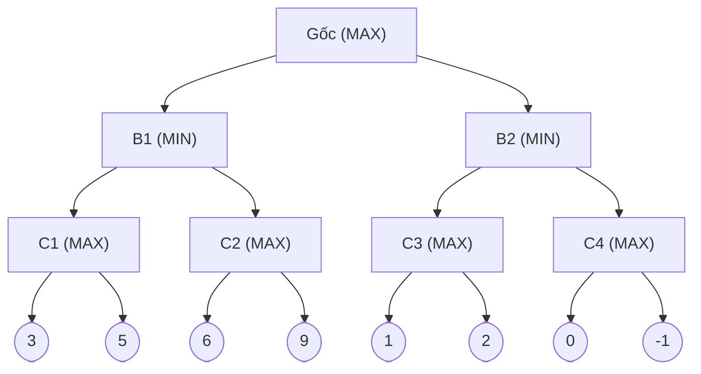
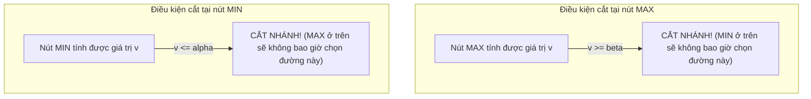
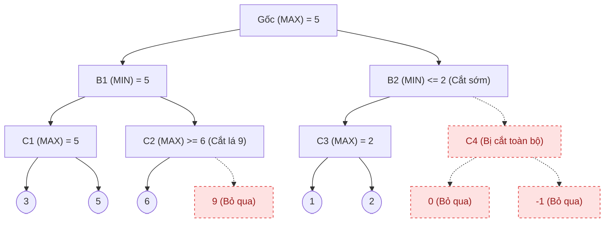

*Học phần AIT2004 — Cơ sở Trí tuệ Nhân tạo*

← [Chương 3: Tìm kiếm kinh nghiệm](/bieu-dien-tri-thuc/bai-giang/03-tim-kiem-kinh-nghiem.md) · [Mục lục môn học](/bieu-dien-tri-thuc/notes/00-muc-luc.md) · [Chương 5: Bài toán ràng buộc CSP →](/bieu-dien-tri-thuc/bai-giang/05-csp.md)

::: info Trọng tâm bài giảng
Trong các bài toán tìm đường đi như BFS hay A\*, thế giới xung quanh tác tử là một môi trường thụ động: các vật cản đứng yên và không ai cố tình ngăn cản tác tử đến đích. Nhưng trong thế giới thực, trí tuệ nhân tạo thường xuyên phải đối đầu với những thực thể có trí tuệ khác — những đối thủ có lợi ích đối nghịch trực tiếp.

Đó là bối cảnh của **Tìm kiếm đối kháng (Adversarial Search)**, nhánh giao thoa rực rỡ giữa Khoa học Máy tính và Lý thuyết Trò chơi (Game Theory). Bài giảng này làm sáng tỏ:
1. **Mô hình Trò chơi Tổng bằng Không (Zero-Sum Games):** Định nghĩa toán học và nguyên lý Maximin của John von Neumann.
2. **Thuật toán Minimax:** Cách một cỗ máy suy nghĩ ngược từ tương lai để đưa ra quyết định tối ưu trước một đối thủ không bao giờ mắc sai lầm.
3. **Kỹ thuật Cắt tỉa Alpha–Beta:** Nghệ thuật bỏ qua những nhánh tính toán vô nghĩa để tăng gấp đôi tầm nhìn mà không làm sai lệch kết quả.
4. **Hàm lượng giá heuristic và Hiệu ứng đường chân trời:** Ranh giới thực tế khi đối mặt với không gian trạng thái vượt tầm vũ trụ.
:::

## Minh họa tương tác

<CodeIllustration type="search" />

---

## 4.1 Mô hình hóa trò chơi đối kháng hình thức

Chúng ta tập trung vào lớp trò chơi kinh điển có đặc tính: **Hai người chơi, theo lượt, tất định (không có yếu tố may rủi xúc xắc), thông tin hoàn hảo (hai bên đều quan sát được toàn bộ bàn cờ) và có tổng bằng không (Zero-Sum)** — ví dụ tiêu biểu là cờ vua, cờ tướng, cờ ca-rô, cờ vây.

"Tổng bằng không" nghĩa là lợi ích của người này chính là thiệt hại của người kia:
$$
\text{Lợi ích}(\text{MAX}) + \text{Lợi ích}(\text{MIN}) = 0
$$

Một trò chơi hình thức gồm 6 thành phần:
1. **Trạng thái ban đầu ($s_0$):** Cấu hình bàn cờ lúc bắt đầu.
2. **Hàm xác định lượt đi ($\text{Player}(s)$):** Cho biết đến lượt ai đi (người chơi MAX muốn tối đa hóa điểm số, hoặc người chơi MIN muốn tối thiểu hóa điểm số).
3. **Tập hành động hợp lệ ($\text{Actions}(s)$):** Các nước đi đúng luật từ trạng thái $s$.
4. **Mô hình kết quả ($\text{Result}(s, a)$):** Trạng thái bàn cờ mới sau khi thực hiện nước đi $a$.
5. **Kiểm tra kết thúc ($\text{TerminalTest}(s)$):** Trò chơi đã ngã ngũ hay chưa (thắng, thua, hòa).
6. **Hàm lợi ích ($\text{Utility}(s, p)$):** Điểm số số học tại trạng thái kết thúc đối với người chơi $p$ (ví dụ: $+1$ cho thắng, $-1$ cho thua, $0$ cho hòa).

---

## 4.2 Thuật toán Minimax: Tư duy tối ưu trong nghịch cảnh

### Nguyên lý Maximin của John von Neumann

Giả sử bạn là người chơi **MAX**. Bạn muốn chọn nước đi dẫn tới điểm số cao nhất có thể. Nhưng bạn không được phép mơ mộng rằng đối thủ sẽ đi một nước ngớ ngẩn để dâng chiến thắng cho bạn. Đối thủ **MIN** là một kỳ thủ hoàn hảo, luôn tính toán nước đi khiến bạn chịu kết quả tồi tệ nhất.

Do đó, triết lý sinh tồn của Minimax là: **Hãy tìm nước đi tốt nhất trong số những kịch bản xấu nhất mà đối thủ có thể gây ra cho bạn.**

Công thức đệ quy Minimax được định nghĩa:

$$
\text{Minimax}(s) =
\begin{cases}
\text{Utility}(s), & s \in \text{Terminal}, \\
\displaystyle\max_{a \in A(s)} \text{Minimax}(\text{Result}(s, a)), & \text{Lượt của MAX}, \\
\displaystyle\min_{a \in A(s)} \text{Minimax}(\text{Result}(s, a)), & \text{Lượt của MIN}.
\end{cases}
$$

### Quá trình tính toán trên cây trò chơi mẫu

Xét cây trò chơi 3 tầng dưới đây: MAX ở gốc, kế tiếp là MIN, rồi đến MAX, và cuối cùng là các trạng thái kết thúc (lá) kèm điểm số lợi ích đã biết.



Để tìm nước đi tại gốc, Minimax duyệt cây theo chiều sâu (DFS) xuống tận các nút lá, rồi truyền ngược giá trị lên từ dưới lên trên (Bottom-Up):

1. **Tại tầng MAX ($C_1, C_2, C_3, C_4$):** Chọn giá trị lớn nhất của các lá con:
   - $C_1 = \max(3, 5) = 5$
   - $C_2 = \max(6, 9) = 9$
   - $C_3 = \max(1, 2) = 2$
   - $C_4 = \max(0, -1) = 0$
2. **Tại tầng MIN ($B_1, B_2$):** Đối thủ MIN sẽ chọn giá trị nhỏ nhất từ các lựa chọn của MAX:
   - $B_1 = \min(C_1, C_2) = \min(5, 9) = 5$
   - $B_2 = \min(C_3, C_4) = \min(2, 0) = 0$
3. **Tại gốc (MAX):** Ta chọn nước đi mang lại điểm số cao nhất:
   - $\text{Root} = \max(B_1, B_2) = \max(5, 0) = \mathbf{5}$

Quyết định tối ưu của MAX tại gốc là: **Đi vào nhánh $B_1$**, đảm bảo chắc chắn thu về ít nhất $5$ điểm bất kể đối thủ chống cự thế nào.

### Nút thắt thế kỷ: Sự bùng nổ tổ hợp của cây trò chơi

Mặc dù Minimax cho lời giải hoàn hảo về mặt lý thuyết, việc duyệt cạn kiệt toàn bộ cây trò chơi là điều bất khả thi trong thực tế:
- Với cờ vua: Hệ số nhánh trung bình $b \approx 35$, độ dài ván cờ trung bình $m \approx 80$. Tổng số trạng thái trên cây trò chơi là $35^{80} \approx 10^{123}$.
- Để hình dung con số này: Tổng số nguyên tử trong toàn bộ vũ trụ quan sát được chỉ vào khoảng $10^{80}$. Một siêu máy tính tính được 1 tỷ trạng thái mỗi giây cũng cần hàng tỷ tỷ năm để duyệt hết cây cờ vua.

Vì vậy, chúng ta bắt buộc phải có hai vũ khí chiến lược: **Cắt tỉa nhánh thừa (Alpha-Beta)** và **Giới hạn độ sâu kèm hàm lượng giá**.

---

## 4.3 Cắt tỉa Alpha–Beta (Alpha–Beta Pruning)

### Trực giác bản chất

Hãy tưởng tượng bạn đang chọn mua máy tính giữa hai cửa hàng A và B.
- Tại cửa hàng A, bạn đã tìm thấy một chiếc máy rất ưng ý với giá 20 triệu đồng.
- Sang cửa hàng B, vừa bước vào cửa, người bán hàng giới thiệu chiếc máy đầu tiên với giá 25 triệu đồng. Người bán hàng cũng nói thêm rằng các máy phía trong còn đắt tiền hơn nữa.
- Bạn có cần đi sâu vào bên trong cửa hàng B để xem hết từng chiếc máy còn lại không? **Hoàn toàn không!** Vì cửa hàng B chắc chắn không thể cho bạn mức giá rẻ hơn 20 triệu của cửa hàng A.

Đó chính là nguyên lý của **Cắt tỉa Alpha–Beta**: **Dừng việc mở rộng một nhánh ngay khi có đủ bằng chứng toán học chứng minh nhánh đó không thể thay đổi quyết định ở gốc.**

### Hai tham số $\alpha$ và $\beta$

Trong suốt quá trình duyệt DFS trên cây, ta duy trì hai ngưỡng giá trị:
- $\alpha$: **Giá trị tốt nhất (lớn nhất)** mà người chơi **MAX** chắc chắn đã đạt được trên đường đi từ gốc tới hiện tại. Đây là cận dưới của điểm số mà MAX chấp nhận. (Khởi tạo $\alpha = -\infty$).
- $\beta$: **Giá trị tốt nhất (nhỏ nhất)** mà người chơi **MIN** chắc chắn đã đạt được trên đường đi từ gốc tới hiện tại. Đây là cận trên của điểm số mà MIN chấp nhận. (Khởi tạo $\beta = +\infty$).



### Diễn biến cắt tỉa từng bước trên cây mẫu

Chúng ta áp dụng Alpha–Beta lên đúng cây trò chơi ở mục 4.2 theo thứ tự duyệt từ trái sang phải:



1. **Nhánh $C_1$:** Duyệt lá 3 và 5 $\to C_1 = 5$. Truyền lên $B_1$, $B_1$ cập nhật $\beta = \min(+\infty, 5) = 5$.
2. **Nhánh $C_2$ (tại $B_1$ với $\alpha=-\infty, \beta=5$):**
   - Duyệt lá đầu tiên: giá trị là **6**.
   - Tại nút MAX $C_2$, giá trị hiện thời $v = 6 \ge \beta = 5$.
   - **CẮT TỈA NGAY LẬP TỨC!** Không cần duyệt lá 9, vì $C_2$ chắc chắn có giá trị $\ge 6$. Đối thủ $B_1$ (đang có lựa chọn $5$) sẽ không bao giờ chọn nhánh $C_2$.
3. **Truyền giá trị lên Gốc:** $B_1$ chốt giá trị 5. Gốc (MAX) cập nhật $\alpha = \max(-\infty, 5) = 5$.
4. **Nhánh $B_2$ (với $\alpha = 5, \beta = +\infty$):**
   - Xuống $C_3$: duyệt lá 1 và 2 $\to C_3 = 2$.
   - Truyền lên $B_2$: $B_2$ cập nhật giá trị hiện thời $v = 2$.
   - Nhưng tại nút MIN $B_2$, giá trị $v = 2 \le \alpha = 5$.
   - **CẮT TỈA TOÀN BỘ NHÁNH $C_4$!** Người chơi MAX ở gốc đã nắm chắc trong tay 5 điểm ở nhánh $B_1$, nên sẽ không bao giờ rẽ sang $B_2$ (nơi điểm số chỉ tối đa là 2).

Kết quả: Giá trị tại gốc vẫn là **5**, nước đi chọn vẫn là **$B_1$**, nhưng ta chỉ cần duyệt **$5$ trong tổng số $8$ nút lá**.

---

## 4.4 Sức mạnh của thứ tự duyệt nước đi (Move Ordering)

Một câu hỏi quyết định chất lượng của một engine AI: **Cắt tỉa Alpha–Beta có thể giúp ta đi sâu tới mức nào?**

Hiệu quả của Alpha–Beta phụ thuộc hoàn toàn vào **thứ tự duyệt các nước đi**:
- **Trường hợp lý tưởng (Best Case):** Nếu tại mỗi nút, nước đi tốt nhất luôn được duyệt đầu tiên:
  Độ phức tạp thời gian giảm từ $O(b^m)$ xuống còn:
  $$
  O\left(b^{m/2}\right) = O\left((\sqrt{b})^m\right)
  $$
  Điều này có nghĩa là hệ số nhánh hiệu dụng giảm từ $b$ xuống $\sqrt{b}$. Trong cờ vua, $b = 35$ giảm xuống chỉ còn $\approx \sqrt{35} \approx 6$.
  Với cùng một ngân sách thời gian, **Alpha–Beta có thể tìm kiếm sâu gấp đôi Minimax thuần túy!**
- **Trường hợp xấu nhất (Worst Case):** Nếu nước đi tồi tệ nhất luôn bị duyệt trước, không có nhánh nào bị cắt, độ phức tạp vẫn là $O(b^m)$.

Trong thực tế, các engine cờ vua hàng đầu như Stockfish dành rất nhiều công sức cho các thuật toán sắp xếp nước đi trước khi gọi Alpha-Beta (ưu tiên các nước ăn quân lớn, các nước chiếu vua, hoặc các nước đã chứng minh hiệu quả ở các vòng lặp trước thông qua Bảng chuyển vị trí - Transposition Table).

---

## 4.5 Cài đặt C++ chuẩn mực cho Minimax và Alpha–Beta

Dưới đây là cấu trúc mã nguồn C++ thanh thoát, phân tách rành mạch giữa hai vai trò MAX và MIN:

```cpp
#include <iostream>
#include <vector>
#include <algorithm>
#include <climits>

using namespace std;

struct GameNode {
    bool isTerminal;
    int utility; // Chỉ có ý nghĩa khi isTerminal == true
    vector<GameNode*> children;
};

// ============================================================================
// CẮT TỈA ALPHA-BETA
// alpha: Giá trị tốt nhất mà MAX đảm bảo có được (cận dưới)
// beta:  Giá trị tốt nhất mà MIN đảm bảo có được (cận trên)
// ============================================================================

int alphaBetaMin(GameNode* node, int alpha, int beta);

int alphaBetaMax(GameNode* node, int alpha, int beta) {
    if (node->isTerminal) return node->utility;

    int v = INT_MIN;
    for (auto* child : node->children) {
        v = max(v, alphaBetaMin(child, alpha, beta));

        // Điều kiện cắt nhánh của MAX: đối thủ MIN ở tầng trên sẽ không chọn đường này
        if (v >= beta) return v;

        alpha = max(alpha, v); // Cập nhật cận dưới của MAX
    }
    return v;
}

int alphaBetaMin(GameNode* node, int alpha, int beta) {
    if (node->isTerminal) return node->utility;

    int v = INT_MAX;
    for (auto* child : node->children) {
        v = min(v, alphaBetaMax(child, alpha, beta));

        // Điều kiện cắt nhánh của MIN: người chơi MAX ở tầng trên sẽ không chọn đường này
        if (v <= alpha) return v;

        beta = min(beta, v); // Cập nhật cận trên của MIN
    }
    return v;
}

// Lời gọi từ gốc (lượt của MAX):
// int bestScore = alphaBetaMax(root, INT_MIN, INT_MAX);
```

---

## 4.6 Giới hạn độ sâu và Hàm lượng giá Heuristic

Trong các trò chơi thực tế, ngay cả với Alpha–Beta, ta cũng không thể đi tới tận cùng ván cờ. Giải pháp là **áp dụng ngưỡng cắt độ sâu (Cutoff)** và thay thế hàm `Utility` bằng **Hàm lượng giá heuristic $\text{Eval}(s)$**.

Một hàm lượng giá tiêu chuẩn thường là tổ hợp tuyến tính của các đặc trưng vị trí:
$$
\text{Eval}(s) = w_1 f_1(s) + w_2 f_2(s) + \cdots + w_n f_n(s)
$$

Ví dụ trong cờ vua:
- $f_1$: Chênh lệch giá trị quân cờ (Tốt = 1, Mã = 3, Tượng = 3, Xe = 5, Hậu = 9).
- $f_2$: Khả năng kiểm soát 4 ô trung tâm bàn cờ.
- $f_3$: Chỉ số an toàn của Vua (số quân che chắn trước mặt vua).
- $f_4$: Độ cơ động (số nước đi hợp lệ có thể thực hiện).

### Cạm bẫy thực tế: Hiệu ứng đường chân trời (Horizon Effect)

Khi cắt độ sâu cứng ở tầng $d$, một hiện tượng nguy hiểm thường xảy ra: Đối thủ có một nước đi tất sát (như bắt Hậu) ở độ sâu $d+1$. Máy tính nhìn thấy điều này và cố tình thực hiện các nước đi chiếu vô nghĩa hoặc thí Tốt nhằm đẩy biến cố mất Hậu ra ngoài phạm vi quan sát của độ sâu $d$.

Để khắc phục hiện tượng này, các kỳ thủ nhân tạo sử dụng kỹ thuật **Tìm kiếm tĩnh lặng (Quiescence Search)**: Khi chạm ngưỡng độ sâu cắt, máy tính không dừng lại ngay nếu bàn cờ đang ở trạng thái "bão táp" (vừa có quân bị ăn hoặc đang bị chiếu). Thuật toán sẽ tiếp tục tìm kiếm thêm vài nước chỉ dành riêng cho các nước ăn quân cho tới khi bàn cờ trở về trạng thái yên ả thì mới gọi hàm $\text{Eval}$.

---

## 4.7 Ứng dụng thực tế ngoài các trò chơi cờ

Các nguyên lý của Minimax và Alpha–Beta không chỉ giới hạn trong trò chơi cờ bàn, mà là nền tảng của việc ra quyết định đối kháng:
- **An ninh mạng (Cybersecurity):** Mô hình hóa cuộc chiến giữa Đội tấn công (Red Team - tìm mọi lỗ hổng) và Đội phòng thủ (Blue Team - vá các lỗ hổng trọng yếu nhất).
- **Hệ thống đấu giá tự động:** Các bot giao dịch cạnh tranh giá thầu trên thị trường chứng khoán tần suất cao (High-Frequency Trading).
- **Quy hoạch chiến lược và đàm phán:** Mô phỏng các phản ứng của đối thủ cạnh tranh khi tung ra sản phẩm mới trong kinh tế học.

---

## Hệ thống bài tập tự luyện {#bai-tap}

### Bài tập 1: Mô phỏng từng bước thuật toán Cắt tỉa Alpha-Beta
**Đề bài:**
Cho cây trò chơi hai người có tổng bằng 0 với người chơi MAX ở nút gốc $A$. Nút $A$ có hai con là $B$ và $C$ (tầng MIN).
- Nút $B$ có ba con là $D, E, F$ với giá trị lượng giá lá lần lượt là:
  $$
  V(D) = 3, \quad V(E) = 5, \quad V(F) = 2
  $$
- Nút $C$ có ba con là $G, H, K$ với giá trị lượng giá lá lần lượt là:
  $$
  V(G) = 1, \quad V(H) = 8, \quad V(K) = 4
  $$

Duyệt cây từ trái sang phải với khoảng giá trị ban đầu $\alpha = -\infty, \beta = +\infty$.
1. Hãy theo dõi sự thay đổi của cặp $[\alpha, \beta]$ qua từng nút.
2. Xác định xem có nhánh nào bị cắt tỉa hay không. Nếu có, đó là cắt tỉa $\alpha$ hay $\beta$?
3. Nước đi tối ưu của người chơi MAX tại nút gốc là gì, và giá trị Minimax trả về bằng bao nhiêu?

**Phân tích & Hướng dẫn giải:**
1. **Quá trình duyệt nhánh trái (nút $B$):**
   - Tại gốc $A$ (MAX): Khởi tạo $[\alpha = -\infty, \beta = +\infty]$.
   - Đi xuống nút $B$ (MIN): Thừa kế $[\alpha = -\infty, \beta = +\infty]$.
     + Thăm lá $D$: Giá trị là $3$. Do $B$ là nút MIN, $B$ cập nhật giá trị hiện tại $v = 3$ và cập nhật cận trên:
       $$
       \beta = \min(+\infty, 3) = 3
       $$
       Khoảng hiện tại ở $B$: $[\alpha = -\infty, \beta = 3]$.
     + Thăm lá $E$: Giá trị là $5$. Vì $5 > 3$, $B$ không nhận giá trị này. Khoảng vẫn là $[\alpha = -\infty, \beta = 3]$.
     + Thăm lá $F$: Giá trị là $2 < 3$. Nút $B$ nhận giá trị $v = 2$, cập nhật:
       $$
       \beta = \min(3, 2) = 2
       $$
     + Nút $B$ duyệt xong toàn bộ các nhánh con, trả về giá trị $2$.
   - Quay lại nút $A$ (MAX):
     + Nút $A$ nhận giá trị $v = 2$ từ $B$ và cập nhật cận dưới:
       $$
       \alpha = \max(-\infty, 2) = 2
       $$
     + Khoảng tại $A$ chuyển thành $[\alpha = 2, \beta = +\infty]$.
2. **Quá trình duyệt nhánh phải (nút $C$):**
   - Đi xuống nút $C$ (MIN): Thừa kế khoảng $[\alpha = 2, \beta = +\infty]$.
     + Thăm lá $G$: Giá trị là $1$. Nút $C$ cập nhật giá trị $v = 1$ và cập nhật cận trên:
       $$
       \beta = \min(+\infty, 1) = 1
       $$
     + Lúc này kiểm tra điều kiện cắt tỉa:
       $$
       \alpha = 2 \ge \beta = 1
       $$
     + Điều kiện $\alpha \ge \beta$ đã xảy ra tại nút MIN $C$. Do đó, toàn bộ các nhánh con còn lại của $C$ (gồm các nút $H$ và $K$) lập tức **bị cắt tỉa ($\alpha$-cutoff)** mà không cần xét tới.
   - Nút $C$ trả về giá trị $1$.
3. **Kết luận nước đi và giá trị Minimax:**
   - Tại nút gốc $A$: Nhánh $B$ mang lại giá trị 2, nhánh $C$ mang lại giá trị 1.
   - Do $A$ là người chơi MAX:
     $$
     V(A) = \max(2, 1) = 2
     $$
   - Người chơi MAX chọn đi nước sang nhánh $B$, giá trị Minimax của trò chơi là $2$.

---

### Bài tập 2: Tầm quan trọng của sắp xếp nước đi (Move Ordering) trong Alpha-Beta
**Đề bài:**
Gọi $b$ là hệ số rẽ nhánh của cây trò chơi và $d$ là độ sâu tìm kiếm.
1. Trong trường hợp lý tưởng nhất (nước đi tốt nhất luôn được duyệt trước), độ phức tạp thời gian của Alpha-Beta là bao nhiêu? Giải thích ý nghĩa của con số này.
2. Trong trường hợp xấu nhất (nước đi tồi nhất luôn bị duyệt trước), hiệu quả cắt tỉa của Alpha-Beta thay đổi như thế nào?
3. Nêu hai kỹ thuật thực tế giúp cải thiện thứ tự sắp xếp nước đi trước khi gọi đệ quy Alpha-Beta.

**Phân tích & Hướng dẫn giải:**
1. **Trường hợp lý tưởng nhất:**
   - Khi nước đi tốt nhất luôn được xét đầu tiên, tại các nút MAX ta lập tức có cận $\alpha$ rất cao, và tại các nút MIN ta lập tức có cận $\beta$ rất thấp.
   - Số nút cần thăm giảm xuống xấp xỉ:
     $$
     \mathcal{O}(b^{d/2})
     $$
   - Ý nghĩa thực tiễn: Với cùng một lượng tài nguyên tính toán và thời gian, thuật toán Alpha-Beta cho phép nhìn sâu gấp đôi ($2d$ so với $d$) so với Minimax thuần túy.
2. **Trường hợp xấu nhất:**
   - Nếu các nước đi tốt nhất lại nằm ở cuối cùng bên phải cây, thuật toán buộc phải duyệt qua mọi lá trước khi tìm thấy giá trị tối ưu, không có nhánh nào bị cắt tỉa.
   - Độ phức tạp khi đó thoái hóa về Minimax thông thường:
     $$
     \mathcal{O}(b^d)
     $$
3. **Kỹ thuật sắp xếp nước đi thực tế:**
   - **Nước đi ăn quân (Killer Moves / Capture Moves):** Trong cờ vua, ưu tiên xét các nước ăn quân lớn bằng quân nhỏ trước (ví dụ: Tốt ăn Hậu), vì các biến cố này thường mang tính quyết định bàn cờ nhanh nhất.
   - **Bảng chuyển vị (Transposition Table) kết hợp IDS:** Sử dụng kết quả lưu trong bảng băm từ lần lặp ở độ sâu $d-1$ để chọn ngay nước đi tốt nhất làm nhánh đầu tiên cho lần lặp ở độ sâu $d$.

---

### Bài tập 3: Cây trò chơi có yếu tố ngẫu nhiên (Expectiminimax) và tính bảo toàn thứ tự
**Đề bài:**
1. Hãy trình bày công thức xác định giá trị của nút ngẫu nhiên (Chance Node) $C$ với các nhánh hành động con $s_1, s_2, \dots, s_k$ xảy ra với xác suất tương ứng $P(s_i)$.
2. Giải thích tại sao phép biến đổi đơn điệu tăng bất kỳ $f(x)$ (ví dụ: $f(x) = x^3$) không làm thay đổi quyết định của thuật toán Minimax, nhưng lại có thể làm thay đổi quyết định của thuật toán Expectiminimax.

**Phân tích & Hướng dẫn giải:**
1. **Giá trị của nút ngẫu nhiên:**
   - Nút ngẫu nhiên đại diện cho các sự kiện xúc xắc, rút bài ngẫu nhiên. Giá trị của nó là kỳ vọng toán học:
     $$
     V(C) = \sum_{i=1}^k P(s_i) \cdot V(s_i)
     $$
     với điều kiện tổng xác suất thỏa mãn:
     $$
     \sum_{i=1}^k P(s_i) = P(s_1) + P(s_2) + \dots + P(s_k) = 1
     $$
2. **Sự khác biệt về tính chất biến đổi đơn điệu:**
   - Trong Minimax thuần túy, mọi phép toán chỉ là so sánh thứ tự $\max$ và $\min$:
     $$
     u > v \iff f(u) > f(v)
     $$
     với mọi hàm đơn điệu tăng $f$. Do đó, thang đo điểm số chỉ mang ý nghĩa thứ bậc (ordinal utility).
   - Trong Expectiminimax, phép tính kỳ vọng toán học là bình quân gia quyền. Phép toán này đòi hỏi hàm thỏa dụng phải có ý nghĩa định lượng (cardinal utility / von Neumann-Morgenstern utility).
   - Khi áp dụng một phép biến đổi phi tuyến (như $f(x) = x^3$), thứ tự kỳ vọng toán học có thể bị đảo lộn:
     Xét hai lựa chọn:
     + Lựa chọn 1: Chắc chắn nhận 10 điểm $\implies \mathbb{E}_1 = 10$.
     + Lựa chọn 2: Nhận 0 điểm với xác suất 0.5 và nhận 22 điểm với xác suất 0.5:
     $$
     \mathbb{E}_2 = 0.5 \times 0 + 0.5 \times 22 = 11 > 10
     $$
     do đó chọn Lựa chọn 2.
     Biến đổi hàm qua $f(x) = x^3$:
     + Lựa chọn 1: $f(10) = 1{,}000$.
     + Lựa chọn 2: Kỳ vọng là:
     $$
     0.5 \times 0^3 + 0.5 \times 22^3 = 5{,}324 > 1{,}000
     $$
     vẫn ưu tiên chọn 2.
     Tuy nhiên, nếu chọn hàm lõm $f(x) = \sqrt{x}$ (thể hiện tính ngại rủi ro):
     + Lựa chọn 1: $\sqrt{10} \approx 3.16$.
     + Lựa chọn 2: Kỳ vọng là:
     $$
     0.5 \times 0 + 0.5 \times \sqrt{22} \approx 2.345 < 3.16
     $$
     kéo theo quyết định bị đảo ngược sang Lựa chọn 1.
   - Do đó, trong Expectiminimax, các giá trị lượng giá phải được giữ chuẩn xác theo thang đo kỳ vọng tuyến tính afin ($f(x) = ax + b$ với $a > 0$).

---

[← Quay lại Chương 3: Tìm kiếm kinh nghiệm](/bieu-dien-tri-thuc/bai-giang/03-tim-kiem-kinh-nghiem.md) · [Mục lục môn học](/bieu-dien-tri-thuc/notes/00-muc-luc.md) · [Tiếp tục sang Chương 5: Bài toán ràng buộc CSP →](/bieu-dien-tri-thuc/bai-giang/05-csp.md)
