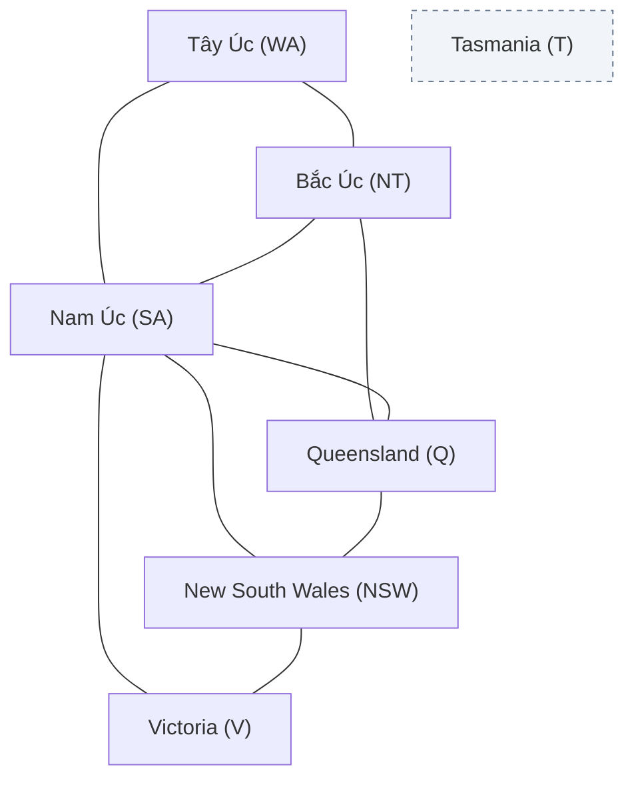
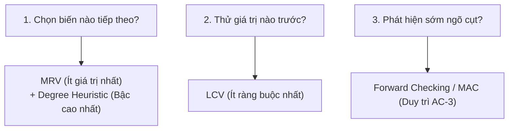

*Học phần AIT2004 — Cơ sở Trí tuệ Nhân tạo*

← [Chương 4: Tìm kiếm đối kháng](/bieu-dien-tri-thuc/bai-giang/04-tim-kiem-doi-khang.md) · [Mục lục môn học](/bieu-dien-tri-thuc/notes/00-muc-luc.md) · [Chương 14: Logic & Biểu diễn tri thức →](/bieu-dien-tri-thuc/bai-giang/14-logic-bieu-dien-tri-thuc.md)

::: info Trọng tâm bài giảng
Trong các giải thuật tìm kiếm truyền thống (BFS, DFS, A\*), trạng thái của bài toán được đối xử như một chiếc "hộp đen" nguyên tử: thuật toán chỉ có thể kiểm tra xem trạng thái đó có phải là đích hay không, hoặc mở rộng ra các trạng thái con, chứ không thể nhìn thấu cấu trúc bên trong của trạng thái.

**Bài toán Thỏa mãn Ràng buộc (Constraint Satisfaction Problems - CSP)** mở toang chiếc hộp đen đó ra: mỗi trạng thái được biểu diễn bằng một tập các biến, mỗi biến nhận giá trị trong một miền xác định, và nghiệm của bài toán là một cấu hình thỏa mãn toàn bộ các ràng buộc luật định. Bài giảng này phân tích:
1. **Hình thức hóa CSP:** Bộ ba $(X, D, C)$ và đồ thị ràng buộc (Constraint Graph).
2. **Lan truyền ràng buộc (Constraint Propagation):** Tính nhất quán cung (Arc Consistency) và thuật toán AC-3.
3. **Tìm kiếm quay lui (Backtracking Search):** Ba nguyên lý định hướng heuristic kinh điển: **MRV**, **Degree Heuristic** và **LCV**.
4. **Tìm kiếm cục bộ (Local Search) với Min-Conflicts:** Giải quyết bài toán hàng triệu biến số trong nháy mắt.
:::

---

## 5.1 Định nghĩa hình thức của CSP

Một bài toán thỏa mãn ràng buộc được định nghĩa bởi bộ ba hình thức $(X, D, C)$:
1. **Tập các biến (Variables $X$):**
   $$
   X = \{X_1, X_2, \ldots, X_n\}
   $$
2. **Tập các miền giá trị (Domains $D$):**
   $$
   D = \{D_1, D_2, \ldots, D_n\}
   $$
   Trong đó mỗi $D_i$ là tập các giá trị hợp lệ mà biến $X_i$ có thể nhận. Miền giá trị có thể rời rạc hữu hạn (màu sắc, ngày trong tuần), rời rạc vô hạn (tập số nguyên $\mathbb{Z}$), hoặc liên tục ($\mathbb{R}$).
3. **Tập các ràng buộc (Constraints $C$):**
   $$
   C = \{C_1, C_2, \ldots, C_m\}
   $$
   Mỗi ràng buộc $C_j$ chỉ định một tập biến tham gia (phạm vi - scope) và một quan hệ xác định các bộ giá trị hợp lệ giữa các biến đó.

### Trạng thái và Lời giải
- **Phép gán (Assignment):** Gán giá trị $v \in D_i$ cho một số biến $X_i$.
- **Phép gán nhất quán (Consistent Assignment):** Phép gán không vi phạm bất kỳ ràng buộc nào trong $C$.
- **Phép gán đầy đủ (Complete Assignment):** Mọi biến trong $X$ đều đã được gán giá trị.
- **Lời giải (Solution):** Một phép gán vừa **đầy đủ**, vừa **nhất quán**.

---

## 5.2 Ví dụ kinh điển: Bài toán Tô màu bản đồ

Xét bài toán tô màu các vùng lãnh thổ của nước Úc bằng 3 màu: Đỏ ($\text{red}$), Xanh lá ($\text{green}$), Xanh dương ($\text{blue}$), sao cho hai vùng có chung biên giới không được trùng màu nhau.



Mô hình hóa CSP:
- **Biến:** $X = \{\text{WA}, \text{NT}, \text{SA}, \text{Q}, \text{NSW}, \text{V}, \text{T}\}$
- **Miền giá trị:** $D_i = \{\text{red}, \text{green}, \text{blue}\}$ với mọi $i$.
- **Ràng buộc:** Các cặp kề nhau phải khác màu:
  $$
  \text{WA} \neq \text{NT}, \quad \text{WA} \neq \text{SA}, \quad \text{NT} \neq \text{SA}, \quad \text{NT} \neq \text{Q}, \quad \ldots
  $$

Một lời giải hợp lệ:
$$
\begin{aligned}
\{ &\text{WA}=\text{red},\; \text{NT}=\text{green},\; \text{SA}=\text{blue},\; \text{Q}=\text{red}, \\
   &\text{NSW}=\text{green},\; \text{V}=\text{red},\; \text{T}=\text{red} \}
\end{aligned}
$$

Lưu ý rằng Tasmania ($\text{T}$) là một hòn đảo độc lập không tiếp giáp với vùng nào, do đó nó có thể nhận bất kỳ màu nào mà không ảnh hưởng tới phần còn lại của lục địa.

---

## 5.3 Lan truyền ràng buộc và Thuật toán AC-3

Trước khi tiến hành tìm kiếm, một cỗ máy thông minh sẽ không vội vàng thử từng giá trị mà sẽ **suy luận để thu hẹp miền giá trị** của các biến. Tiến trình này gọi là **Lan truyền ràng buộc (Constraint Propagation)**.

### Tính nhất quán cung (Arc Consistency)
Một cung có hướng $(X_i, X_j)$ được gọi là **nhất quán cung (arc-consistent)** nếu:
> Với mọi giá trị $x \in D_i$, tồn tại ít nhất một giá trị $y \in D_j$ thỏa mãn ràng buộc nhị phân giữa $X_i$ và $X_j$.

Nếu tồn tại một giá trị $x \in D_i$ mà không có bất kỳ giá trị nào trong $D_j$ tương thích với nó, ta có thể **loại bỏ vĩnh viễn $x$ khỏi miền giá trị $D_i$**.

```mermaid
flowchart TD
    Xi["Xi: {red, green}"] -->|Cung (Xi, Xj): Xi != Xj| Xj["Xj: {red}"]
    note["Loại bỏ 'red' khỏi Xi<br/>-> Xi chỉ còn {green}"]
```

### Thuật toán AC-3 (Arc Consistency Algorithm #3)
AC-3 duy trì một hàng đợi chứa tất cả các cung $(X_i, X_j)$ cần kiểm tra tính nhất quán:
1. Lấy một cung $(X_i, X_j)$ ra khỏi hàng đợi.
2. Kiểm tra xem có giá trị nào trong $D_i$ không tìm được "bạn ghép đôi" hợp lệ trong $D_j$ hay không.
3. Nếu có, xóa các giá trị đó khỏi $D_i$.
4. **Điểm mấu chốt:** Nếu miền $D_i$ bị thu hẹp, mọi biến lân cận $X_k$ trỏ tới $X_i$ đều có nguy cơ mất tính nhất quán! Do đó, ta phải thêm lại tất cả các cung $(X_k, X_i)$ (với $k \neq j$) vào hàng đợi để tái kiểm tra.

```cpp
bool revise(CSP& csp, Variable xi, Variable xj) {
    bool revised = false;
    for (auto it = csp.D[xi].begin(); it != csp.D[xi].end(); ) {
        int x = *it;
        bool hasSupport = false;
        for (int y : csp.D[xj]) {
            if (csp.isSatisfied(xi, x, xj, y)) {
                hasSupport = true;
                break;
            }
        }
        if (!hasSupport) {
            it = csp.D[xi].erase(it); // Xóa giá trị không có bạn ghép đôi
            revised = true;
        } else {
            ++it;
        }
    }
    return revised;
}
```

Độ phức tạp thời gian của AC-3: Giả sử bài toán có $c$ ràng buộc nhị phân (tương ứng $2c$ cung) và kích thước miền giá trị lớn nhất là $d$. Mỗi cung $(X_k, X_i)$ chỉ bị đưa vào hàng đợi tối đa $d$ lần (vì $D_i$ chỉ có tối đa $d$ phần tử để bị xóa). Mỗi lần kiểm tra cung tốn $O(d^2)$. Do đó, thời gian tồi nhất của AC-3 là $O(c \cdot d^3)$ — một chi phí rất nhỏ so với việc tìm kiếm vét cạn hàm mũ!

---

## 5.4 Tìm kiếm quay lui (Backtracking Search) và Bộ ba Heuristic

Tìm kiếm quay lui là giải thuật DFS chuyên dụng cho CSP: tại mỗi bước, ta chọn **một biến chưa được gán**, gán thử lần lượt từng giá trị trong miền của nó, kiểm tra tính nhất quán; nếu gặp ngõ cụt thì lùi lại (backtrack).

Nếu duyệt ngây thơ, không gian tìm kiếm sẽ bùng nổ $O(d^n)$. Để tăng tốc độ lên hàng ngàn lần, người ta áp dụng ba nguyên tắc heuristic:



### 1. Heuristic MRV (Minimum Remaining Values — Thất bại sớm nhất)
- **Quy tắc:** Luôn chọn biến có **số lượng giá trị hợp lệ còn lại trong miền ít nhất** để gán trước.
- **Trực giác bản chất:** Triết lý "Thất bại sớm" (Fail-First). Biến nào càng khó gán, càng ít lựa chọn thì phải ưu tiên xử lý ngay. Nếu nhánh này không thể có nghiệm, nó sẽ bị phát hiện và cắt tỉa ngay từ gốc, ngăn không cho cây tìm kiếm phân nhánh vô ích.

### 2. Heuristic Bậc (Degree Heuristic)
- **Quy tắc:** Dùng để phá vỡ thế hòa điểm (tie-breaker) khi có nhiều biến cùng có giá trị MRV nhỏ nhất. Chọn biến tham gia vào **nhiều ràng buộc nhất đối với các biến chưa được gán khác**.
- **Tác dụng:** Giúp thu hẹp tối đa miền giá trị của các biến còn lại ở các bước tiếp theo.

### 3. Heuristic LCV (Least Constraining Value — Để lại đường sống)
- **Quy tắc:** Khi đã chọn được biến, ta phải quyết định thử giá trị nào trước. Heuristic LCV khuyên: **Hãy ưu tiên giá trị nào loại trừ ít phương án lựa chọn nhất của các biến lân cận.**
- **Trực giác bản chất:** Trái ngược với việc chọn biến (cần chọn biến dễ thất bại nhất), khi chọn giá trị, ta mong muốn tìm ra nghiệm càng nhanh càng tốt. Chọn giá trị "hiền lành nhất" sẽ để lại không gian rộng mở nhất cho các biến tiếp theo tìm được nghiệm hợp lệ.

---

## 5.5 Kiểm tra tiến (Forward Checking) và MAC

Mỗi khi ta gán một giá trị cho biến $X$, ta có thể nhìn trước một bước:
- **Forward Checking:** Với mỗi biến chưa gán $Y$ kề với $X$, lập tức xóa khỏi $D_Y$ bất kỳ giá trị nào xung đột với giá trị vừa gán cho $X$. Nếu bất kỳ miền $D_Y$ nào trở thành rỗng ($\emptyset$), ta lập tức quay lui mà không cần bước tiếp!
- **MAC (Maintaining Arc Consistency):** Thay vì chỉ kiểm tra các biến kề trực tiếp, sau mỗi lần gán giá trị, ta kích hoạt thuật toán AC-3 trên toàn bộ các biến chưa gán để lan truyền triệt để mọi hệ quả.

---

## 5.6 Tìm kiếm cục bộ với Heuristic Min-Conflicts

Với các bài toán quy mô khổng lồ (ví dụ bài toán xếp $N$-Hậu với $N = 1.000.000$ quân cờ), phương pháp quay lui hoàn toàn bất lực. Thay vào đó, người ta sử dụng **Tìm kiếm cục bộ (Local Search)**:
1. Bắt đầu từ một phép gán đầy đủ ngẫu nhiên (chấp nhận có nhiều ràng buộc bị vi phạm).
2. Tại mỗi bước lặp, chọn ngẫu nhiên một biến đang bị xung đột.
3. Thay đổi giá trị của biến đó sang giá trị **gây ra ít xung đột nhất với các biến khác (Min-Conflicts Heuristic)**.
4. Lặp lại cho tới khi số lượng xung đột bằng 0.

Kỳ diệu thay, với xác suất rất cao, heuristic Min-Conflicts có thể tìm ra nghiệm của bài toán $1.000.000$-Hậu chỉ sau vài chục đến vài trăm bước di chuyển!

---

## 5.7 Ứng dụng thực tế của CSP trong Công nghiệp

- **Lập thời khóa biểu và Lịch thi đại học:** Phân bổ hàng trăm môn học, giảng viên và phòng thi vào các ca thi sao cho không sinh viên nào bị trùng lịch thi và không phòng thi nào bị quá tải.
- **Lập lịch bay hàng không:** Điều phối máy bay, tổ bay, tiếp viên và cửa ra vào sân bay (Airport Gate Allocation) đáp ứng các quy định an toàn hàng không nghiêm ngặt.
- **Quy hoạch tài nguyên mạng máy tính:** Phân bổ dải tần số vô tuyến cho các trạm phát sóng di động BTS sao cho các trạm kề cận không gây nhiễu sóng lẫn nhau (bài toán tô màu đồ thị thực tế).
- **Trình biên dịch và Phân bổ thanh ghi (Register Allocation):** Phân bổ số lượng thanh ghi vật lý hạn chế của CPU cho hàng ngàn biến số trong mã nguồn chương trình.

---

## Hệ thống bài tập tự luyện {#bai-tap}

### Bài tập 1: Mô phỏng từng bước thuật toán lan truyền tính nhất quán cung AC-3
**Đề bài:**
Cho bài toán CSP gồm ba biến $X, Y, Z$ với các miền giá trị ban đầu:
$$
D_X = \{1, 2\}, \quad D_Y = \{1, 2\}, \quad D_Z = \{1, 2, 3\}
$$
Các ràng buộc nhị phân giữa các biến là:
- $X < Y$ (giá trị của $X$ phải nhỏ hơn giá trị của $Y$)
- $Y = Z$ (giá trị của $Y$ phải bằng giá trị của $Z$)

Hãy mô phỏng từng bước hoạt động của thuật toán AC-3:
1. Liệt kê tập hợp các cung có hướng ban đầu trong hàng đợi $Q$.
2. Theo dõi việc rút từng cung $(U, V)$ khỏi $Q$, kiểm tra sự thu hẹp của miền giá trị $D_U$ và việc bổ sung các cung liên đới vào lại hàng đợi.
3. Cho biết miền giá trị cuối cùng của cả ba biến sau khi AC-3 dừng lại.

**Phân tích & Hướng dẫn giải:**
1. **Khởi tạo hàng đợi cung:**
   - Mỗi ràng buộc nhị phân tạo ra hai cung có hướng ngược nhau.
   - Hàng đợi ban đầu gồm 4 cung:
     $$
     Q = \{(X, Y), (Y, X), (Y, Z), (Z, Y)\}
     $$
2. **Quá trình thực thi AC-3:**
   - **Xét cung $(X, Y)$ với ràng buộc $X < Y$:**
     + Với $x = 1 \in D_X$: Tồn tại $y = 2 \in D_Y$ thỏa $1 < 2$ (giữ 1).
     + Với $x = 2 \in D_X$: Không tồn tại $y \in D_Y = \{1, 2\}$ sao cho $2 < y$. Do đó, giá trị 2 bị xóa khỏi $D_X$.
     + Cập nhật: $D_X = \{1\}$. Vì $D_X$ bị thu hẹp, cần thêm các cung $(V, X)$ kề với $X$ vào hàng đợi (ở đây $X$ chỉ kề $Y$, nhưng cung $(Y, X)$ đã có sẵn trong $Q$).
   - **Xét cung $(Y, X)$ với ràng buộc $X < Y$ (tức $Y > X$):**
     + Với $y = 1 \in D_Y$: Cần tìm $x \in D_X = \{1\}$ sao cho $1 > x$. Không có giá trị thỏa mãn. Xóa 1 khỏi $D_Y$.
     + Với $y = 2 \in D_Y$: Có $x = 1 \in D_X$ thỏa $2 > 1$ (giữ 2).
     + Cập nhật: $D_Y = \{2\}$. Vì $D_Y$ bị thay đổi, ta phải thêm cung kề $(Z, Y)$ vào hàng đợi (nếu chưa có).
   - **Xét cung $(Y, Z)$ với ràng buộc $Y = Z$:**
     + Với $y = 2 \in D_Y$: Tồn tại $z = 2 \in D_Z$ thỏa $2 = 2$ (giữ 2).
     + Miền $D_Y$ không đổi ($D_Y = \{2\}$).
   - **Xét cung $(Z, Y)$ với ràng buộc $Z = Y$:**
     + Với $z = 1$: Không có giá trị trong $D_Y = \{2\}$ bằng 1. Xóa 1 khỏi $D_Z$.
     + Với $z = 2$: Có $y = 2 \in D_Y$ bằng 2 (giữ 2).
     + Với $z = 3$: Không có giá trị trong $D_Y = \{2\}$ bằng 3. Xóa 3 khỏi $D_Z$.
     + Cập nhật: $D_Z = \{2\}$. Vì $D_Z$ bị thu hẹp, ta thêm lại cung $(Y, Z)$ vào $Q$.
   - **Xét cung $(Y, Z)$ lần 2:**
     + Với $y = 2 \in D_Y$: Tồn tại $z = 2 \in D_Z$ thỏa mãn. Miền $D_Y$ không đổi.
   - Hàng đợi $Q = \emptyset$, thuật toán kết thúc.
3. **Miền giá trị cuối cùng:**
   $$
   D_X = \{1\}, \quad D_Y = \{2\}, \quad D_Z = \{2\}
   $$
   Cả ba miền đều rút gọn về đúng 1 giá trị duy nhất và thỏa mãn toàn bộ ràng buộc.

---

### Bài tập 2: So sánh Kiểm tra tiến (Forward Checking) và Duy trì AC-3 (MAC)
**Đề bài:**
Xét bài toán 4-Hậu đặt 4 quân hậu lên bàn cờ $4 \times 4$ sao cho không có hai quân nào cùng hàng, cùng cột hoặc cùng đường chéo. Gọi $X_1, X_2, X_3, X_4$ là vị trí hàng của các quân hậu ở cột 1, 2, 3, 4 với miền ban đầu:
$$
D_i = \{1, 2, 3, 4\}, \quad \forall i \in \{1, 2, 3, 4\}
$$

Giả sử ta thực hiện bước gán đầu tiên: đặt quân hậu cột 1 vào hàng 1 ($X_1 = 1$).
1. Hãy xác định miền giá trị còn lại của $X_2, X_3, X_4$ sau bước lan truyền của Forward Checking. Thuật toán có phát hiện ra ngõ cụt ngay lúc này không?
2. Giả sử tiếp tục gán $X_2 = 3$. Forward Checking cập nhật các miền giá trị tiếp theo như thế nào?
3. Ngược lại, nếu sử dụng thuật toán MAC ngay sau khi gán $X_1 = 1$, cơ chế AC-3 có thể phát hiện ngõ cụt sớm hơn không? Giải thích rõ quá trình lan truyền.

**Phân tích & Hướng dẫn giải:**
1. **Lan truyền với Forward Checking sau khi gán $X_1 = 1$:**
   - Xóa các vị trí bị $X_1 = 1$ khống chế:
     + Cột 2 ($X_2$): Xóa hàng 1 (cùng hàng) và hàng 2 (đường chéo). Còn lại:
       $$
       D_2 = \{3, 4\}
       $$
     + Cột 3 ($X_3$): Xóa hàng 1 (cùng hàng) và hàng 3 (đường chéo). Còn lại:
       $$
       D_3 = \{2, 4\}
       $$
     + Cột 4 ($X_4$): Xóa hàng 1 (cùng hàng) và hàng 4 (đường chéo). Còn lại:
       $$
       D_4 = \{2, 3\}
       $$
   - Cả 3 miền còn lại đều khác rỗng. Do đó, Forward Checking **không** phát hiện ngõ cụt và vẫn tiếp tục phân nhánh.
2. **Tiếp tục gán $X_2 = 3$ với Forward Checking:**
   - Cập nhật miền từ việc gán $X_2 = 3$:
     + $X_3$: Xóa hàng 3 (cùng hàng), hàng 2 và 4 (đường chéo của $X_2$). Khi đó $D_3$ đang có $\{2, 4\}$ bị xóa sạch cả hai giá trị, dẫn tới:
       $$
       D_3 = \emptyset
       $$
   - Lúc này miền $D_3$ rỗng, Forward Checking phát hiện ngõ cụt và kích hoạt quay lui, hủy việc gán $X_2 = 3$ để thử $X_2 = 4$.
3. **Cơ chế lan truyền sâu của MAC:**
   - Khi áp dụng MAC, thuật toán không chỉ xét ảnh hưởng trực tiếp từ biến vừa gán ($X_1$) lên các biến lân cận, mà còn chạy AC-3 trên các cặp biến chưa gán như $(X_2, X_3), (X_3, X_4)$.
   - Sự khác biệt then chốt là MAC giúp phát hiện các mâu thuẫn gián tiếp giữa các biến chưa gán từ sớm hơn một bước, giúp cây tìm kiếm không phải tốn công phân nhánh xuống các tầng sâu vô ích.

---

### Bài tập 3: Giải bài toán thỏa mãn ràng buộc bằng thuật toán Min-Conflicts
**Đề bài:**
Cho bài toán 4-Hậu với trạng thái gán đầy đủ ban đầu:
$$
[X_1 = 1, X_2 = 2, X_3 = 3, X_4 = 4]
$$
(tức cả 4 quân hậu đều nằm trên đường chéo chính từ ô $(1,1)$ tới $(4,4)$).
1. Hãy đếm số lượng xung đột hiện tại của từng quân hậu.
2. Chọn ngẫu nhiên quân hậu $X_1$ để di chuyển. Tính số xung đột mà $X_1$ sẽ tạo ra khi đặt vào các vị trí hàng $\{1, 2, 3, 4\}$. Heuristic Min-Conflicts sẽ chọn chuyển $X_1$ sang hàng nào?
3. Mô phỏng tiếp các bước di chuyển cho tới khi đưa bàn cờ về trạng thái thỏa mãn hoàn toàn (0 xung đột).

**Phân tích & Hướng dẫn giải:**
1. **Số lượng xung đột tại trạng thái ban đầu:**
   - Vì nằm trên cùng một đường chéo chính, mỗi cặp quân hậu đều khống chế lẫn nhau. Tổng số cặp xung đột là:
     $$
     \binom{4}{2} = \frac{4 \times 3}{2} = 6 \text{ cặp xung đột}
     $$
   - Mỗi quân hậu đều xung đột với 3 quân hậu còn lại (số xung đột của mỗi biến là 3).
2. **Xét biến $X_1$ và chọn hàng theo Min-Conflicts:**
   - Giữ nguyên vị trí của $X_2 = 2, X_3 = 3, X_4 = 4$:
     + Nếu đặt $X_1 = 1$: Xung đột với $X_2, X_3, X_4$ (đều chung đường chéo) $\implies 3$ xung đột.
     + Nếu đặt $X_1 = 2$: Cùng hàng với $X_2$ (1 xung đột), chéo với $X_3$ (1 xung đột) $\implies 2$ xung đột.
     + Nếu đặt $X_1 = 3$: Cùng hàng với $X_3$ (1 xung đột), chéo với $X_2$ (1 xung đột) và chéo với $X_4$ (1 xung đột) $\implies 3$ xung đột.
     + Nếu đặt $X_1 = 4$: Cùng hàng với $X_4$ (1 xung đột), chéo với $X_3$ (1 xung đột) $\implies 2$ xung đột.
   - Heuristic Min-Conflicts chọn hàng có ít xung đột nhất là hàng 2 hoặc hàng 4 (giả sử chọn chuyển $X_1 = 2$).
3. **Các bước tiếp theo:**
   - Qua từng bước lặp, thuật toán lần lượt chọn các quân hậu còn xung đột ($X_2, X_3, X_4$) và dịch chuyển dọc theo cột của chúng tới ô có số xung đột nhỏ nhất.
   - Quá trình chuyển dịch sẽ nhanh chóng thoát khỏi vùng xung đột đường chéo và hội tụ về một nghiệm hợp lệ của bài toán 4-Hậu, chẳng hạn:
     $$
     [X_1 = 2, X_2 = 4, X_3 = 1, X_4 = 3]
     $$
     Tại cấu hình này, không có bất kỳ hai quân hậu nào cùng hàng hoặc cùng đường chéo, số xung đột bằng 0 và thuật toán kết thúc thành công.

---

[← Quay lại Chương 4: Tìm kiếm đối kháng](/bieu-dien-tri-thuc/bai-giang/04-tim-kiem-doi-khang.md) · [Mục lục môn học](/bieu-dien-tri-thuc/notes/00-muc-luc.md) · [Tiếp tục sang Chương 14: Logic & Biểu diễn tri thức →](/bieu-dien-tri-thuc/bai-giang/14-logic-bieu-dien-tri-thuc.md)
