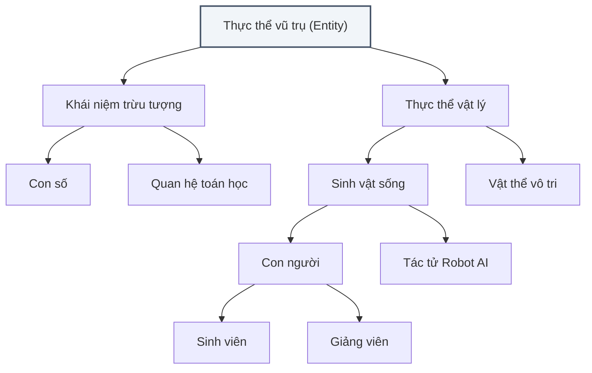
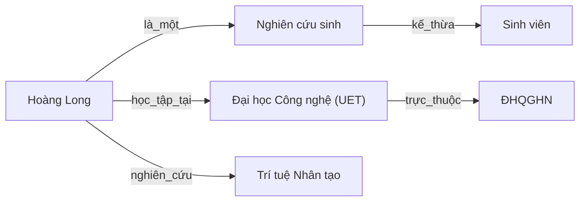

*Học phần AIT2004 — Cơ sở Trí tuệ Nhân tạo*

← [Chương 4: Tìm kiếm đối kháng](/bieu-dien-tri-thuc/bai-giang/04-tim-kiem-doi-khang.md) · [Mục lục môn học](/bieu-dien-tri-thuc/notes/00-muc-luc.md) · [Chương 16: Mạng Bayes & suy luận →](/bieu-dien-tri-thuc/bai-giang/16-mang-bayes.md)

::: info Trọng tâm bài giảng
Trí tuệ nhân tạo không chỉ dừng lại ở các thuật toán thám hiểm không gian trạng thái hay các phép toán số học thuần túy. Để một cỗ máy có thể hành xử thông minh thực sự, nó cần phải sở hữu **tri thức (knowledge)** và khả năng **suy luận (reasoning)** từ tri thức đó để rút ra những kết luận mới chưa từng được nạp sẵn.

Đây là cái nôi của trường phái AI biểu tượng (Symbolic AI). Bài giảng này dẫn dắt chúng ta qua các trụ cột hình thức:
1. **Từ Logic Mệnh đề đến Logic Vị từ Bậc nhất (FOL):** Vì sao ta phải mở rộng chiếc hộp đen mệnh đề để nhìn vào cấu trúc của thế giới?
2. **Cú pháp, Ngữ nghĩa và Các Lượng từ ($\forall, \exists$):** Nghệ thuật chuyển dịch ngôn ngữ tự nhiên sang biểu thức toán học chuẩn xác, tránh các cạm bẫy đảo chiều logic.
3. **Cơ chế Suy luận Hình thức:** Thuật toán hợp nhất hóa (Unification), quy tắc Modus Ponens tổng quát và hợp giải phản chứng (Resolution).
4. **Bản thể luận (Ontology) & Mạng ngữ nghĩa:** Cách tổ chức tri thức của toàn bộ thế giới thực thành các đồ thị tri thức (Knowledge Graphs).
:::

---

## 14.1 Vì sao Logic Mệnh đề không đủ sức biểu đạt thế giới?

Trong Logic mệnh đề (Propositional Logic), đơn vị cơ bản nhất là một **mệnh đề nguyên tử** — một phát biểu chỉ có thể nhận giá trị Đúng ($\text{True}$) hoặc Sai ($\text{False}$), ví dụ:
$$
P: \text{“Trời đang mưa”}, \quad Q: \text{“Đường trơn”}
$$

Logic mệnh đề rất thanh thoát khi kiểm tra các suy luận đơn giản thông qua bảng chân trị. Tuy nhiên, khi áp dụng vào trí tuệ nhân tạo, nó bộc lộ một **khiếm khuyết chí mạng**: **Logic mệnh đề coi mỗi sự thật như một chiếc "hộp đen" nguyên tử.** Nó không có cách nào nhìn vào cấu trúc bên trong chiếc hộp để biết sự thật đó đang nói về đối tượng nào, mang thuộc tính gì, hay có mối quan hệ ra sao với các thực thể khác.

Hãy xem xét phát biểu tưởng chừng rất tự nhiên sau:
> “Mọi sinh viên đều phải tích lũy đủ tín chỉ tốt nghiệp.”

Nếu chỉ dùng logic mệnh đề, chúng ta bất lực trong việc viết ra một quy tắc khái quát! Vì không có khái niệm biến số hay đối tượng, chúng ta buộc phải tạo ra vô số mệnh đề độc lập cho từng người:
$$
\text{SinhVien\_An} \implies \text{DuTinChi\_An}
$$
$$
\text{SinhVien\_Binh} \implies \text{DuTinChi\_Binh}
$$
$$
\text{SinhVien\_Cuong} \implies \text{DuTinChi\_Cuong}
$$

Nếu trường học có 10.000 sinh viên, cơ sở tri thức phải lưu 10.000 câu riêng rẽ. Nếu có một sinh viên mới nhập học, hệ thống hoàn toàn không biết sinh viên đó có cần đủ tín chỉ hay không cho đến khi ta tự tay chép thêm một câu mới vào bộ nhớ!

Rõ ràng, ta cần một ngôn ngữ hình thức biểu đạt mạnh mẽ hơn: một ngôn ngữ cho phép phân rã thế giới thành **đối tượng**, **thuộc tính** và **quan hệ**, đồng thời cho phép nói những câu tổng quát áp dụng cho cả một tập hợp. Ngôn ngữ đó chính là **Logic Vị từ Bậc nhất (First-Order Logic - FOL)**.

---

## 14.2 Bốn viên gạch nền tảng của Logic Vị từ Bậc nhất

Thế giới trong góc nhìn của FOL được kiến tạo từ 4 thành tố cơ bản:

| Thành tố | Bản chất hình thức | Ví dụ minh họa |
|:---|:---|:---|
| **Hằng số (Constants)** | Định danh một thực thể cụ thể duy nhất trong thế giới bài toán | $\text{Nam}, \text{UET}, \text{AIT2004}, 2$ |
| **Biến số (Variables)** | Ký hiệu đại diện cho một đối tượng trừu tượng bất kỳ trong miền xác định | $x, y, z$ |
| **Hàm số (Functions)** | Ánh xạ từ một hoặc nhiều đối tượng sang **một đối tượng khác** có liên hệ mật thiết | $\text{MeCua}(x)$, $\text{LopTruong}(y)$, $\text{Abs}(z)$ |
| **Vị từ (Predicates)** | Ánh xạ từ một hoặc nhiều đối tượng sang **chân trị $\{\text{True}, \text{False}\}$**, biểu thị thuộc tính hoặc quan hệ | $\text{LaSinhVien}(x)$, $\text{HocMon}(x, y)$ |

Một phát biểu hoàn chỉnh trong FOL được xây dựng từ:
- **Hạng từ (Term):** Một biểu thức logic trỏ tới một đối tượng (có thể là hằng số, biến số, hoặc hàm số lồng nhau như $\text{MeCua}(\text{Nam})$).
- **Câu nguyên tố (Atomic Sentence):** Tạo thành khi một vị từ nhận các hạng từ làm tham số, ví dụ $\text{HocMon}(\text{Nam}, \text{AIT2004})$, hoặc biểu thức so sánh bằng giữa hai hạng từ ($t_1 = t_2$).
- **Câu phức hợp (Complex Sentence):** Kết hợp các câu nguyên tố bằng các liên từ logic quen thuộc: $\neg$ (phủ định), $\land$ (hội), $\lor$ (tuyển), $\implies$ (kéo theo), $\iff$ (tương đương).

---

## 14.3 Lượng từ: Bí quyết diễn đạt sự khái quát

Sức mạnh kỳ diệu nhất của FOL nằm ở hai lượng từ toán học:

### 1. Lượng từ với mọi ($\forall$ — Universal Quantifier)
Phát biểu $\forall x \; P(x)$ khẳng định rằng tính chất $P$ đúng với **mọi đối tượng $x$** nằm trong không gian đang xét.

> **Quy tắc vàng:** Lượng từ $\forall$ hầu như luôn đi kèm với phép kéo theo ($\implies$).

Hãy quan sát sự khác biệt tinh tế nhưng mang tính quyết định:
- **Cách viết chuẩn mực:**
  $$
  \forall x \; \big(\text{SinhVien}(x) \implies \text{ChamChi}(x)\big)
  $$
  Ý nghĩa: "Với mọi vật $x$ trong vũ trụ, nếu $x$ là sinh viên thì $x$ chăm chỉ." Nếu $x$ là một chiếc bàn (không phải sinh viên), tiền đề $\text{SinhVien}(x)$ nhận giá trị $\text{False}$, và phép kéo theo $\text{False} \implies \dots$ tự động nhận giá trị $\text{True}$. Câu phát biểu hoàn toàn hợp lý!
- **Cạm bẫy chết người khi dùng $\land$ với $\forall$:**
  $$
  \forall x \; \big(\text{SinhVien}(x) \land \text{ChamChi}(x)\big)
  $$
  Câu này có nghĩa là: "Mọi thực thể trên cõi đời này (từ cốc nước, quyển sách đến Mặt Trời) vừa là sinh viên, vừa chăm chỉ!" Đây là một phát biểu hoàn toàn phi lý.

---

### 2. Lượng từ tồn tại ($\exists$ — Existential Quantifier)
Phát biểu $\exists x \; P(x)$ khẳng định rằng có **ít nhất một đối tượng $x$** thỏa mãn tính chất $P$.

> **Quy tắc vàng:** Lượng từ $\exists$ hầu như luôn đi kèm với phép hội ($\land$).

- **Cách viết chuẩn mực:**
  $$
  \exists x \; \big(\text{SinhVien}(x) \land \text{DiemA}(x)\big)
  $$
  Ý nghĩa: "Tồn tại một thực thể $x$ sao cho $x$ vừa là sinh viên, vừa đạt điểm A."
- **Cạm bẫy chết người khi dùng $\implies$ với $\exists$:**
  $$
  \exists x \; \big(\text{SinhVien}(x) \implies \text{DiemA}(x)\big)
  $$
  Một cách người ta hay dùng để nhận diện câu sai này là: Hãy chọn một vật bất kỳ không phải là sinh viên (ví dụ một quả táo). Vì quả táo không phải là sinh viên, tiền đề $\text{SinhVien}(\text{QuaTao})$ bằng $\text{False}$. Phép kéo theo lập tức nhận giá trị $\text{True}$! Do đó câu khẳng định trên trở thành đúng một cách vô nghĩa trong một thế giới mà không có bất kỳ sinh viên nào đạt điểm A, thậm chí không có bất kỳ sinh viên nào tồn tại!

---

### 3. Trật tự lượng từ: Đảo trật tự, đảo ngược thế giới

Một lỗi tư duy kinh điển là ngộ nhận rằng các lượng từ có thể hoán đổi vị trí tùy tiện.

Xét hai câu logic có vẻ tương đồng:
1. **Câu A:** $\forall x \; \exists y \; \text{Loves}(x, y)$
   *Giải nghĩa:* "Với mỗi người $x$, đều tồn tại một người $y$ mà $x$ yêu thương."
   Nghĩa là: Ai trên đời cũng có một người để yêu thương (mỗi người có thể yêu một đối tượng hoàn toàn khác nhau).
2. **Câu B:** $\exists y \; \forall x \; \text{Loves}(x, y)$
   *Giải nghĩa:* "Tồn tại một người $y$ duy nhất sao cho tất cả mọi người $x$ đều yêu thương $y$."
   Nghĩa là: Có một nhân vật đặc biệt (một vị thánh hoặc thần tượng) được toàn thể nhân loại tôn sùng!

Rõ ràng Câu B đưa ra một đòi hỏi mạnh mẽ hơn Câu A rất nhiều: $\exists y \forall x \implies \forall x \exists y$, nhưng chiều ngược lại hoàn toàn không đúng.

Tuy nhiên, nếu hai lượng từ cùng loại đi liền nhau, ta hoàn toàn có quyền đảo thứ tự tự do:
$$
\forall x \forall y \; P(x, y) \iff \forall y \forall x \; P(x, y)
$$
$$
\exists x \exists y \; P(x, y) \iff \exists y \exists x \; P(x, y)
$$

---

## 14.4 Suy luận trong FOL: Thuật toán Hợp nhất hóa (Unification)

Để rút ra tri thức mới từ các quy tắc đã có, máy tính cần đối khớp các biểu thức logic.
Ví dụ ta có quy tắc:
$$
\forall x \; \big(\text{BietLapTrinh}(x) \implies \text{HocDuocAI}(x)\big)
$$
Và ta có sự thật: $\text{BietLapTrinh}(\text{Binh})$.
Làm thế nào để máy tính tự động suy ra $\text{HocDuocAI}(\text{Binh})$? Nó phải tìm ra một phép thế biến $x$ thành $\text{Binh}$.

### Định nghĩa toán học
**Phép thế (Substitution $\theta$):** Là một tập hữu hạn các cặp gán biến với hạng từ:
$$
\theta = \{v_1 / t_1, v_2 / t_2, \ldots, v_k / t_k\}
$$
Ký hiệu $\alpha\theta$ là biểu thức thu được sau khi thay thế đồng thời mọi biến $v_i$ trong $\alpha$ bằng $t_i$.

Thuật toán **Hợp nhất hóa (Unification)** nhận vào hai biểu thức logic $\alpha, \beta$ và tìm ra một phép thế $\theta$ sao cho:
$$
\text{Unify}(\alpha, \beta) = \theta \quad \text{thỏa mãn } \alpha\theta = \beta\theta
$$

### Ví dụ hợp nhất hóa
Xét bài toán tìm phép thế hợp nhất giữa hai biểu thức:
$$
\text{Unify}\Big(\text{DayHoc}(x, \text{UET}), \; \text{DayHoc}(\text{ThayLong}, y)\Big)
$$
Phép thế hợp nhất cần tìm là:
$$
\theta = \{x / \text{ThayLong}, \; y / \text{UET}\}
$$
Khi áp dụng $\theta$ vào cả hai vế, ta thu được cùng một câu nguyên tố: $\text{DayHoc}(\text{ThayLong}, \text{UET})$.

### Quy tắc chuẩn hóa tên biến (Standardizing Apart)
Một lưu ý thực hành rất quan trọng: Trước khi hợp nhất hai câu khác nhau, ta bắt buộc phải đổi tên các biến bị trùng lặp.
Ví dụ: Câu 1 có biến $x$, Câu 2 cũng dùng biến $x$ nhưng trong một phạm vi lượng từ độc lập. Nếu không đổi tên biến $x$ của Câu 2 thành $x_2$, thuật toán có thể rơi vào tình trạng bế tắc khi cố ép $x$ phải nhận hai giá trị mâu thuẫn cùng lúc.

---

## 14.5 Quy tắc Modus Ponens tổng quát (Generalized Modus Ponens - GMP)

Với kỹ thuật hợp nhất hóa, ta nâng cấp luật Modus Ponens cổ điển thành phiên bản tổng quát dành cho các mệnh đề dạng Horn (các câu có dạng $p_1 \land p_2 \land \cdots \land p_n \implies q$):

$$
\frac{p_1', \; p_2', \; \ldots, \; p_n', \qquad (p_1 \land p_2 \land \cdots \land p_n \implies q)}{q\theta}
$$
với điều kiện tồn tại phép thế $\theta$ sao cho $p_i'\theta = p_i\theta$ với mọi $i = 1, \ldots, n$.

GMP là trái tim vận hành của hai cơ chế suy luận nền tảng:
- **Suy luận tiến (Forward Chaining):** Bắt đầu từ tập các sự thật đã biết trong cơ sở tri thức, kích hoạt các luật có tiền đề thỏa mãn để sinh thêm sự thật mới, lặp lại cho đến khi trả lời được câu hỏi truy vấn. (Thường dùng trong các hệ thống giám sát và suy luận thời gian thực).
- **Suy luận lùi (Backward Chaining):** Bắt đầu từ câu hỏi truy vấn cần chứng minh, tìm ngược lại các luật có phần kết luận khớp với truy vấn, rồi đệ quy chứng minh các tiền đề của luật đó. Đây chính là cơ chế suy diễn cốt lõi của ngôn ngữ lập trình trí tuệ nhân tạo **Prolog**.

---

## 14.6 Bản thể luận (Ontology) & Đồ thị Tri thức (Knowledge Graphs)

### Bản thể luận là gì?

Nếu Logic vị từ cung cấp cho chúng ta **cú pháp và luật suy luận** (giống như bảng chữ cái và ngữ pháp), thì câu hỏi tiếp theo là: **Làm thế nào để phân loại và tổ chức toàn bộ khái niệm của thế giới thực một cách có hệ thống?**

Khoa học giải quyết bài toán này gọi là **Bản thể luận (Ontology)**.
Một Ontology định nghĩa:
- Các lớp khái niệm (Classes/Concepts).
- Hệ thống phân cấp kế thừa (Taxonomy: quan hệ $\text{is-a}$).
- Các thuộc tính và quan hệ giữa các lớp.
- Các ràng buộc tiên đề (Axioms).

### Mạng ngữ nghĩa (Semantic Networks) và Đồ thị tri thức

Khi các khái niệm và quan hệ được biểu diễn dưới dạng đồ thị có hướng gắn nhãn (Labeled Directed Graph), ta có một **Mạng ngữ nghĩa**:
- Nút biểu diễn đối tượng hoặc khái niệm.
- Cạnh có hướng biểu diễn quan hệ (ví dụ: `là_một`, `thuộc_về`, `sáng_lập_bởi`).

Sức mạnh lớn nhất của mạng ngữ nghĩa là cơ chế **Kế thừa thuộc tính (Property Inheritance)**: Vì `Hoàng Long` là một `Nghiên cứu sinh`, mà `Nghiên cứu sinh` là một `Sinh viên`, nên bất kỳ quy định nào áp dụng cho `Sinh viên` (như có thẻ thư viện, phải đóng học phí) đều tự động áp dụng cho `Hoàng Long` mà không cần phải gán thủ công!

### Logic mô tả (Description Logic - DL) và Chuẩn Web Ngữ nghĩa (OWL)
Trong các hệ thống hiện đại của World Wide Web Consortium (W3C), tri thức được biểu diễn bằng **Logic mô tả (Description Logic)** thông qua chuẩn OWL (Web Ontology Language).
DL lược bỏ bớt một số tính năng tự do của FOL đầy đủ để giữ cho thời gian suy luận (phân loại lớp, kiểm tra tính tương thích) luôn nằm trong giới hạn đa thức, cho phép xây dựng các đồ thị tri thức quy mô khổng lồ như **Google Knowledge Graph** hay **Wikidata** với hàng tỷ thực thể và hàng chục tỷ mối quan hệ.

---

## 14.7 Ứng dụng thực tế của Biểu diễn Tri thức và Logic

- **Hệ chuyên gia Y tế (Clinical Decision Support):** Chuẩn đoán bệnh và tương tác thuốc dựa trên hàng chục nghìn luật suy luận lâm sàng chuẩn y khoa.
- **Đồ thị tri thức công cụ tìm kiếm (Google Knowledge Graph):** Khi bạn tìm kiếm một danh nhân hay bộ phim, chiếc hộp thông tin xuất hiện bên phải màn hình chính là kết quả của việc liên kết các thực thể trong Ontology.
- **Kiểm chứng hình thức phần cứng và phần mềm (Formal Verification):** Chứng minh toán học rằng một con chip xử lý hoặc một đoạn mã hợp đồng thông minh (Smart Contract) không có lỗi bảo mật trước khi sản xuất hàng loạt.
- **Hệ thống tư vấn pháp luật tự động:** Mô hình hóa các điều luật, quy định hành chính thành các luật vị từ để tự động kiểm tra tính hợp pháp của các hồ sơ kinh doanh.

---

[← Quay lại Chương 4: Tìm kiếm đối kháng](/bieu-dien-tri-thuc/bai-giang/04-tim-kiem-doi-khang.md) · [Mục lục môn học](/bieu-dien-tri-thuc/notes/00-muc-luc.md) · [Tiếp tục sang Chương 16: Mạng Bayes & suy luận →](/bieu-dien-tri-thuc/bai-giang/16-mang-bayes.md)
