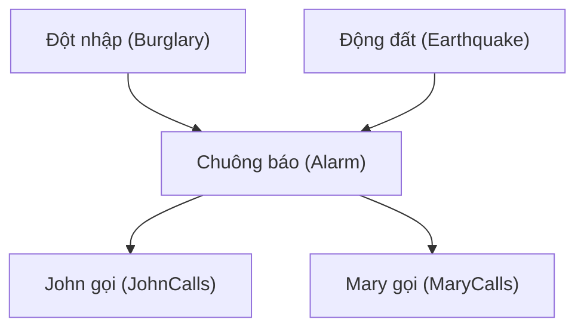
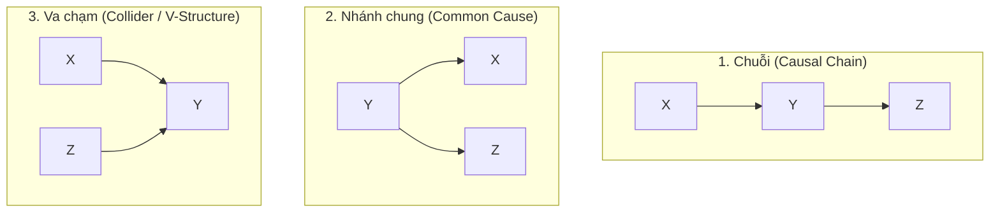

*Học phần AIT2004 — Cơ sở Trí tuệ Nhân tạo*

← [Chương 14: Logic & Biểu diễn tri thức](/bieu-dien-tri-thuc/bai-giang/14-logic-bieu-dien-tri-thuc.md) · [Mục lục môn học](/bieu-dien-tri-thuc/notes/00-muc-luc.md)

::: info Trọng tâm bài giảng
Trong các chương về Logic, chúng ta giả định thế giới vận hành tuyệt đối trắng đen: một mệnh đề chỉ có thể là Đúng hoặc Sai. Nhưng trong đời sống thực tế, một bác sĩ không bao giờ dám khẳng định $100\%$ rằng "Bệnh nhân sốt thì chắc chắn bị cảm cúm", một xe tự hành không thể chắc chắn $100\%$ phía trước là người đi bộ hay một cái bóng đổ khi camera bị mờ sương.

Sự không chắc chắn (Uncertainty) là quy luật của tự nhiên. Để xử lý tri thức không hoàn hảo, Trí tuệ Nhân tạo kết hợp Đại số Đồ thị với Lý thuyết Xác suất để tạo nên một kiệt tác: **Mạng Bayes (Bayesian Networks)** do Judea Pearl (giải Turing 2011) kiến tạo. Bài giảng này phân tích:
1. **Từ Bùng nổ xác suất đồng thời đến Đồ thị phi chu trình (DAG):** Sức mạnh thần kỳ của tính độc lập có điều kiện.
2. **Quy tắc phân tích nhân tử (Factorization):** Cách thu nhỏ bảng xác suất từ hàng tỷ tham số xuống kích thước bỏ túi.
3. **Cấu trúc D-separation & Hiện tượng Explaining Away:** Điều kiện hình học để hai biến số độc lập với nhau.
4. **Thuật toán Suy luận:** Khử biến (Variable Elimination) và lấy mẫu xấp xỉ.
:::

---

## 16.1 Vì sao Logic bất lực trước thế giới thực?

Hãy xét bài toán chẩn đoán y khoa: Ta muốn lập một luật logic:
$$
\forall x \; \big(\text{DauRang}(x) \implies \text{SauRang}(x)\big)
$$
Luật này **sai**, vì đau răng có thể do viêm nướu, mọc răng khôn, hoặc chấn thương.
Ta sửa lại thành phép hội:
$$
\forall x \; \big(\text{SauRang}(x) \implies \text{DauRang}(x)\big)
$$
Luật này **vẫn sai**, vì nhiều người sâu răng giai đoạn đầu không hề cảm thấy đau!

Trong khoa học máy tính, đây được gọi là **Vấn nạn định chuẩn (Qualification Problem)**: Để một câu logic đúng tuyệt đối trong thế giới thực, ta phải liệt kê hàng ngàn điều kiện ngoại lệ không bao giờ hết. Hơn nữa, các cảm biến thực tế luôn có nhiễu (sensor noise) và thông tin thu thập được chỉ là một phần (partial observability).

Thay vì vật lộn với các khẳng định nhị phân cứng nhắc, ta sử dụng **Lý thuyết Xác suất** để định lượng **mức độ niềm tin (Degree of Belief)** của tác tử:
$$
P(\text{SauRang} \mid \text{DauRang}) = 0.8
$$
Nghĩa là: Nếu một bệnh nhân có triệu chứng đau răng, xác suất họ bị sâu răng là $80\%$.

---

## 16.2 Thách thức của Bảng phân phối đồng thời

Giả sử hệ thống chẩn đoán của chúng ta có $n$ biến ngẫu nhiên nhị phân (ví dụ $n$ loại triệu chứng và bệnh khác nhau).
Một phân phối đồng thời đầy đủ (Full Joint Probability Distribution) là một bảng khổng lồ liệt kê xác suất của mọi tổ hợp khả dĩ:
$$
P(X_1 = x_1, X_2 = x_2, \ldots, X_n = x_n)
$$

Bảng này chứa tổng cộng:
$$
2^n - 1 \quad \text{tham số độc lập}
$$

Hãy thử làm một phép tính định lượng:
- Nếu $n = 30$ biến (một bệnh xá thu nhỏ): Bảng cần $2^{30} - 1 \approx 1.073.741.823$ giá trị (hơn $1$ tỷ tham số!).
- Để điền đủ một tỷ con số này từ thực tế, ta cần dữ liệu bệnh án của hàng tỷ người — điều hoàn toàn bất khả thi.

Làm thế nào để thoát khỏi thảm họa bùng nổ lũy thừa này? Lời giải chính là: **Khai thác tính Độc lập có điều kiện (Conditional Independence)**.

---

## 16.3 Cấu trúc hình thức của Mạng Bayes

Một **Mạng Bayes** là một cấu trúc dữ liệu mô hình hóa các mối quan hệ xác suất giữa các biến ngẫu nhiên, bao gồm hai phần:
1. **Một Đồ thị có hướng phi chu trình (DAG - Directed Acyclic Graph):**
   - Mỗi nút đại diện cho một biến ngẫu nhiên (rời rạc hoặc liên tục).
   - Mỗi cung có hướng $X \to Y$ biểu thị ảnh hưởng nhân quả hoặc trực tiếp từ biến cha $X$ sang biến con $Y$.
2. **Một tập các Bảng xác suất có điều kiện (CPT - Conditional Probability Table):**
   - Tại mỗi nút $X_i$, ta gắn kèm một bảng phân phối có điều kiện $P(X_i \mid \text{Parents}(X_i))$, xác định xác suất của $X_i$ dựa trên mọi tổ hợp giá trị của các nút cha trực tiếp của nó.

### Định lý phân tích nhân tử toàn cục (The Chain Rule for Bayesian Networks)
Nhờ tính chất đồ thị, phân phối xác suất đồng thời đầy đủ của toàn bộ mạng được tính bằng tích đơn giản của các bảng xác suất có điều kiện tại từng nút:

$$
P(X_1, X_2, \ldots, X_n) = \prod_{i=1}^n P(X_i \mid \text{Parents}(X_i))
$$

### Sức mạnh nén tham số thần kỳ
Xét mạng Báo trộm gia đình ở trên với $5$ biến nhị phân:
- Nếu dùng bảng đồng thời đầy đủ: cần $2^5 - 1 = 31$ tham số.
- Nếu dùng Mạng Bayes:
  - $B$: không có cha $\to 1$ tham số ($P(B)$).
  - $E$: không có cha $\to 1$ tham số ($P(E)$).
  - $A$: có 2 cha ($B, E$) $\to 2^2 = 4$ tham số.
  - $J$: có 1 cha ($A$) $\to 2^1 = 2$ tham số.
  - $M$: có 1 cha ($A$) $\to 2^1 = 2$ tham số.
  - **Tổng cộng:** chỉ cần $1 + 1 + 4 + 2 + 2 = \mathbf{10}$ tham số!

Nếu mỗi nút chỉ có tối đa $k$ nút cha, số lượng tham số toàn mạng chỉ tăng tuyến tính theo số biến: $O(n \cdot 2^k)$ thay vì bùng nổ theo hàm mũ $O(2^n)$!

---

## 16.4 Cấu trúc D-separation & Hiện tượng "Giải tỏa nghi vấn" (Explaining Away)

Làm thế nào để nhìn vào hình dáng đồ thị mà biết chắc chắn hai biến số $X$ và $Y$ có độc lập với nhau khi đã quan sát một tập biến chứng cứ $E$ hay không?
Judea Pearl đã phát minh ra khái niệm **D-separation (Phân tách có hướng)** dựa trên việc phân tích ba cấu trúc hình học cơ bản:

### 1. Cấu trúc Chuỗi (Causal Chain): $X \to Y \to Z$
Nếu chưa biết $Y$: Thông tin có thể truyền từ $X$ sang $Z$ ($X$ và $Z$ phụ thuộc).
Khi **ĐÃ BIẾT $Y$**: Đường dẫn bị chặn lại! $X$ và $Z$ trở nên **độc lập có điều kiện** khi biết $Y$:
$$
P(Z \mid X, Y) = P(Z \mid Y)
$$

### 2. Cấu trúc Nhánh chung (Common Cause / Fork): $X \leftarrow Y \to Z$
$Y$ là nguyên nhân chung của cả $X$ và $Z$ (ví dụ: $Y$ là "Mùa đông", $X$ là "Cảm cúm", $Z$ là "Bán chạy áo ấm").
Khi **ĐÃ BIẾT $Y$**: Đường dẫn bị chặn lại! Biết bạn bị cảm cúm không làm thay đổi xác suất người khác mua áo ấm một khi ta đã biết rõ hiện tại đang là mùa đông.

### 3. Cấu trúc Va chạm (Collider / V-Structure): $X \to Y \leftarrow Z$
Đây là cấu trúc kỳ thú nhất và khác biệt hoàn toàn với hai cấu trúc trên!
Hai nguyên nhân độc lập $X$ (Đột nhập) và $Z$ (Động đất) cùng dẫn tới một hậu quả $Y$ (Chuông báo động).
- Khi **CHƯA BIẾT gì về $Y$**: $X$ và $Z$ hoàn toàn **độc lập** với nhau! (Việc có động đất hay không chẳng liên quan gì tới việc có trộm hay không).
- Khi **ĐÃ BIẾT $Y$** (hoặc biết một con cháu của $Y$): Hai biến $X$ và $Z$ bất ngờ trở nên **PHỤ THUỘC** lẫn nhau!

> **Hiện tượng Giải tỏa nghi vấn (Explaining Away):**
> Giả sử chuông báo động reo ($Y=\text{true}$). Bạn đang rất hoảng sợ vì nghĩ nhà bị trộm ($X$). Bỗng nhiên, bạn nghe đài phát thanh báo vừa có một trận động đất lớn ($Z=\text{true}$). Ngay lập tức, mối nghi ngờ về việc có trộm giảm hẳn xuống! Lý do: Biến cố Động đất đã "giải thích trọn vẹn" cho tiếng chuông reo, làm giảm sự cần thiết của giả thuyết Đột nhập. Hai biến vốn độc lập bỗng nhiên tác động qua lại khi biến hậu quả chung được quan sát!

---

## 16.5 Suy luận trong Mạng Bayes: Thuật toán Khử biến (Variable Elimination)

Nhiệm vụ cốt lõi của một hệ thống chẩn đoán là tính toán phân phối hậu nghiệm của một biến truy vấn $Q$ khi đã quan sát được tập chứng cứ $E = e$:
$$
P(Q \mid E = e) = \frac{P(Q, E = e)}{P(E = e)} = \alpha \sum_{H} P(Q, E = e, H)
$$
Trong đó $H$ là tập hợp tất cả các biến ẩn (Hidden/Unobserved variables) còn lại trong mạng.

Nếu tính tổng trực tiếp, ta lại gặp lại bài toán hàm mũ. Thuật toán **Khử biến (Variable Elimination)** tối ưu hóa phép tính bằng cách áp dụng **luật phân phối của phép nhân đối với phép cộng**:
$$
a \cdot b + a \cdot c = a \cdot (b + c)
$$
Thuật toán đẩy các dấu $\sum$ vào sâu nhất có thể, nhóm các tích xác suất thành các nhân tử (Factors), tính toán và lưu đệm (memoization) kết quả trung gian, từ đó giảm đáng kể số lượng phép nhân số học.

---

## 16.6 Ứng dụng thực tế của Mạng Bayes

- **Chẩn đoán y khoa chuyên sâu:** Hệ thống Pathfinder tích hợp mạng Bayes gồm hàng ngàn biến mô bệnh học để phân loại các dạng ung thư hạch phức tạp, đạt độ chính xác tương đương các chuyên gia đầu ngành.
- **Hệ thống cảnh báo an toàn hàng không:** Phân tích xác suất hỏng hóc đồng thời của các hệ thống động cơ phụ trợ để đưa ra quyết định hạ cánh khẩn cấp.
- **Phục hồi tín hiệu trong định vị vệ tinh GPS (Bộ lọc Kalman & HMM):** Bản chất của Bộ lọc Kalman và Mô hình Markov Ẩn (HMM) chính là các trường hợp riêng của Mạng Bayes trên trục thời gian.
- **Phát hiện gian lận thẻ tín dụng:** Phân tích hành vi mua sắm bất thường dựa trên mạng lưới các biến nhân quả (vị trí giao dịch, số tiền, tần suất).

---

[← Quay lại Chương 14: Logic & Biểu diễn tri thức](/bieu-dien-tri-thuc/bai-giang/14-logic-bieu-dien-tri-thuc.md) · [Mục lục môn học](/bieu-dien-tri-thuc/notes/00-muc-luc.md)
