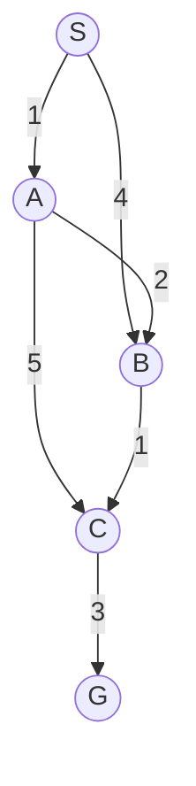

# Lộ trình & Mục lục · AIT2004 Cơ sở Trí tuệ Nhân tạo

Học phần **AIT2004 Cơ sở Trí tuệ Nhân tạo** là trụ cột nền tảng của khối ngành Công nghệ Thông tin và Trí tuệ Nhân tạo. Bộ bài giảng được thiết kế với tư duy sư phạm chuẩn mực, phân tích sâu sắc từ trực giác toán học, cơ chế thuật toán, phân tích độ phức tạp đến các ứng dụng công nghệ trong đời sống thực tế.

Mỗi bài giảng là một chuyên đề độc lập, có cấu trúc chặt chẽ từ bài toán mở đầu, mô hình hóa hình thức, bảng chạy từng bước, mã nguồn C++ chuẩn mực và các đúc kết cạm bẫy tư duy.

---

## Phần 1. Tác tử thông minh & Không gian trạng thái

| Bài giảng | Chủ đề trọng tâm | Trạng thái |
|:---|:---|:---:|
| [Bài 1: Giới thiệu & Tác tử thông minh](/bieu-dien-tri-thuc/bai-giang/01-gioi-thieu-tac-tu.md) | Bốn trường phái AI, Tác tử hợp lý, đặc tả PEAS và phân loại môi trường |  Sẵn sàng |
| [Bài 2: Tìm kiếm mù](/bieu-dien-tri-thuc/bai-giang/02-tim-kiem-mu.md) | Bản chất không gian trạng thái, BFS, DFS, UCS (Dijkstra) và giải thuật IDS |  Sẵn sàng |

---

## Phần 2. Tìm kiếm kinh nghiệm & Tối ưu hóa

| Bài giảng | Chủ đề trọng tâm | Trạng thái |
|:---|:---|:---:|
| [Bài 3: Tìm kiếm kinh nghiệm](/bieu-dien-tri-thuc/bai-giang/03-tim-kiem-kinh-nghiem.md) | Hàm Heuristic, Greedy Best-First, A\*, tính Admissible/Consistent và IDA\* |  Sẵn sàng |
| [Bài 4: Tìm kiếm đối kháng](/bieu-dien-tri-thuc/bai-giang/04-tim-kiem-doi-khang.md) | Lý thuyết trò chơi tổng bằng không, Minimax, cắt tỉa Alpha–Beta, hiệu ứng đường chân trời |  Sẵn sàng |
| [Bài 5: Bài toán thỏa mãn ràng buộc (CSP)](/bieu-dien-tri-thuc/bai-giang/05-csp.md) | Bộ ba $(X, D, C)$, lan truyền AC-3, quay lui Backtracking với MRV, Degree, LCV |  Sẵn sàng |

---

## Phần 3. Biểu diễn tri thức & Suy luận hình thức

| Bài giảng | Chủ đề trọng tâm | Trạng thái |
|:---|:---|:---:|
| [Bài 14: Logic & Biểu diễn tri thức](/bieu-dien-tri-thuc/bai-giang/14-logic-bieu-dien-tri-thuc.md) | Logic vị từ bậc nhất (FOL), lượng từ, hợp nhất hóa Unification, GMP và Ontology |  Sẵn sàng |
| [Bài 16: Mạng Bayes & Suy luận](/bieu-dien-tri-thuc/bai-giang/16-mang-bayes.md) | Mô hình đồ thị xác suất DAG, độc lập có điều kiện, D-separation và thuật toán khử biến |  Sẵn sàng |

---

## Đồ thị mẫu dùng đối chiếu xuyên suốt các bài giảng tìm kiếm

Để thấy rõ sự khác biệt bản chất giữa các chiến lược tìm kiếm, các bài giảng tìm kiếm (Chương 2, 3, 4) đều sử dụng một đồ thị trạng thái mẫu chung ($S \to G$) với chi phí tối ưu thực tế đã biết trước ($C^* = 7$):

- **BFS:** Tìm ra $S \to A \to C \to G$ với chi phí $9$ (tối ưu số bước, nhưng tốn phí).
- **DFS:** Phụ thuộc may rủi thứ tự nhánh, có thể ra $8$ hoặc $9$.
- **UCS:** Quét đều sóng chi phí, tìm đúng $S \to A \to B \to C \to G$ ($=7$) nhưng mở rộng nhiều đỉnh thừa.
- **A\*:** Kết hợp với la bàn heuristic, đi thẳng tới nghiệm tối ưu $7$ mà không lãng phí tài nguyên.
