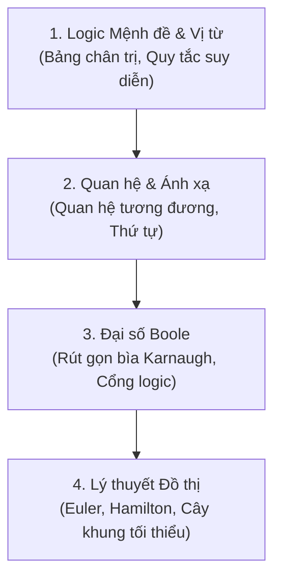

# Toán Rời Rạc (Discrete Mathematics) 

Toán rời rạc là ngôn ngữ nền tảng của toàn bộ ngành Khoa học Máy tính. Khác với Toán giải tích làm việc với các đại lượng liên tục (đạo hàm, tích phân), Toán rời rạc làm việc với các đối tượng đếm được, logic và cấu trúc.

---

##  Các Chuyên đề Trọng tâm

### 1. [Logic Mệnh đề & Vị từ](./logic.md)
- Bảng chân trị các phép toán: $\land$ (AND), $\lor$ (OR), $\neg$ (NOT), $\rightarrow$ (Kéo theo), $\leftrightarrow$ (Tương đương).
- Các luật logic tương đương: De Morgan, phân phối, giao hoán.
- Lượng từ $\forall$ (với mọi) và $\exists$ (tồn tại).

### 2. [Quan hệ & Ánh xạ](./relations.md)
- Tính chất quan hệ: Phản xạ, Đối xứng, Phản đối xứng, Bắc cầu.
- Quan hệ tương đương & Lớp tương đương.
- Quan hệ thứ tự bộ phận (Poset) & Biểu đồ Hasse.

### 3. [Lý thuyết Đồ thị trong Toán rời rạc](./graph-theory.md)
- Định lý bắt tay: $\sum \text{deg}(v) = 2|E|$.
- Đồ thị Euler (chu trình & đường đi Euler).
- Đồ thị Hamilton.
- Đồ thị phẳng & Công thức Euler cho mặt phẳng: $V - E + F = 2$.

---

## 📖 Giáo trình & Nguồn Tham khảo Chuẩn Quốc tế

1. **Kenneth H. Rosen**, [*Discrete Mathematics and Its Applications (8th Edition)*](https://www.mheducation.com/highered/product/discrete-mathematics-its-applications-rosen/M9781259676512.html), McGraw-Hill. Giáo trình tiêu chuẩn vàng toàn cầu cho môn Toán rời rạc ngành Khoa học Máy tính: Logic mệnh đề & vị từ, quan hệ, hàm số, phương pháp quy nạp toán học, đại số Boole và lý thuyết đồ thị cơ bản.
2. **Eric Lehman, F. Thomson Leighton, & Albert R. Meyer**, [*Mathematics for Computer Science*](https://courses.csail.mit.edu/6.042/spring18/mcs.pdf), MIT OpenCourseWare (6.042J). Bản sách PDF mở chính thức từ MIT CSAIL: [MIT MCS Book (PDF)](https://courses.csail.mit.edu/6.042/spring18/mcs.pdf). Khóa học trực tuyến đi kèm: [MIT OCW 6.042J: Mathematics for Computer Science](https://ocw.mit.edu/courses/6-042j-mathematics-for-computer-science-spring-2015/).
3. **Nguyễn Đức Nghĩa & Nguyễn Tô Thành**, *Toán rời rạc*, NXB Đại học Quốc gia Hà Nội. Giáo trình giảng dạy tiêu chuẩn của Trường Đại học Công nghệ (ĐHQGHN).
4. **TrevTutor — Discrete Mathematics Series**: [YouTube Playlist](https://www.youtube.com/playlist?list=PLDDGPdw7e6Ag1EIznZ-m-qXu4XX3A0cIz). Chuỗi video sư phạm trực quan phân tích logic, quan hệ tương đương, quan hệ thứ tự và đồ thị.
