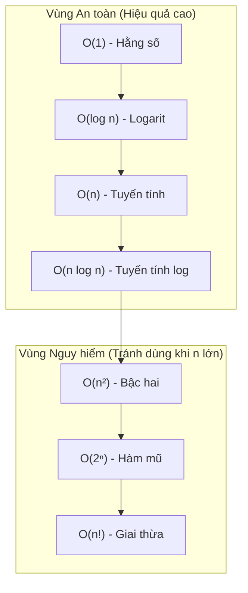

Khi mới bắt đầu học lập trình, bạn chỉ quan tâm: *"Chương trình chạy ra kết quả đúng chưa?"*.  
Nhưng khi học Cấu trúc Dữ liệu & Giải thuật tại UET, câu hỏi quan trọng gấp 10 lần là:  
 **"Chương trình chạy đúng, nhưng nếu dữ liệu tăng từ 1.000 phần tử lên 10.000.000 phần tử thì máy tính chạy trong 0.1 giây hay chạy mất 3 ngày?"**

Đó chính là lý do **Ký hiệu Big-O** ra đời.

---

## 1. Ẩn dụ Dễ hiểu: Ký hiệu Big-O là gì?

Hãy tưởng tượng bạn cần gửi một tập tài liệu 100 GB cho một người bạn ở TP. Hồ Chí Minh:

- **Cách 1: Gửi qua mạng Internet.**  
  Nếu mạng có tốc độ cố định, 1 GB mất 1 phút $\rightarrow$ 100 GB mất 100 phút. Nếu gửi 1.000 GB sẽ mất 1.000 phút.  
  $\Rightarrow$ Thời gian tăng tuyến tính theo kích thước dữ liệu: **$\mathcal{O}(n)$**.

- **Cách 2: Chép vào USB rồi đi máy bay mang vào.**  
  Dù USB chứa 1 file text 1 KB hay chứa đầy 100 GB dữ liệu, thời gian bay từ Hà Nội vào TP.HCM vẫn cố định là 2 tiếng.  
  $\Rightarrow$ Thời gian không đổi bất kể dữ liệu lớn thế nào: **$\mathcal{O}(1)$**.

::: tip Định nghĩa Feynman
**Big-O** không đo bằng "giây" hay "mili-giây" (vì máy tính mỗi người mạnh yếu khác nhau).  
Big-O đo **tốc độ tăng số phép tính** khi kích thước đầu vào $n$ tăng lên vô hạn.
:::

---

## 2. Bảng Xếp hạng Tốc độ từ Nhanh đến Chậm

Dưới đây là các độ phức tạp bạn sẽ gặp liên tục trong mọi bài thi và bài kiểm tra:

| Ký hiệu | Tên gọi | Tốc độ | Ví dụ thực tế |
| :--- | :--- | :--- | :--- |
| $\mathcal{O}(1)$ | Hằng số (Constant) |  Nhanh nhất | Truy cập phần tử mảng bằng chỉ số `a[i]`, Push/Pop đỉnh Stack |
| $\mathcal{O}(\log n)$ | Logarit (Logarithmic) |  Rất nhanh | Tìm kiếm nhị phân (Binary Search), Tìm kiếm trên cây BST cân bằng |
| $\mathcal{O}(n)$ | Tuyến tính (Linear) |  Tốt | Duyệt tìm kiếm tuần tự từ đầu đến cuối mảng 1 vòng `for` |
| $\mathcal{O}(n \log n)$ | Tuyến tính Log |  Khá | MergeSort, QuickSort (trung bình), HeapSort |
| $\mathcal{O}(n^2)$ | Bậc hai (Quadratic) |  Chậm | 2 vòng lặp lồng nhau (BubbleSort, SelectionSort) |
| $\mathcal{O}(2^n)$ | Hàm mũ (Exponential) |  Cực chậm | Đệ quy quay lui giải bài toán cái túi hoặc tháp Hà Nội |
| $\mathcal{O}(n!)$ | Giai thừa (Factorial) |  Không khả thi | Vét cạn người du lịch (TSP) thử mọi hoán vị |



---

## 3. Mẹo Tính Nhanh Độ phức tạp Trong Bài Thi

### Quy tắc 1: Bỏ qua Hằng số & Phần tử bậc thấp
- Thuật toán chạy $f(n) = 5n^2 + 100n + 9999$ phép tính.
- Khi $n$ tiến ra vô cùng (ví dụ $n = 1.000.000$), $n^2$ sẽ áp đảo hoàn toàn $100n$ và $9999$.
- $\Rightarrow$ Độ phức tạp đơn giản là **$\mathcal{O}(n^2)$**.

### Quy tắc 2: Vòng lặp đơn và Vòng lặp lồng nhau

```cpp
// Vòng lặp O(n)
for (int i = 0; i < n; i++) {
    // Thực hiện thao tác O(1)
}

// Hai vòng lặp lồng nhau O(n^2)
for (int i = 0; i < n; i++) {
    for (int j = 0; j < n; j++) {
        // Thực hiện thao tác O(1)
    }
}
```

### Quy tắc 3: biến đếm nhân đôi hoặc chia đôi cho thời gian logarithm

```cpp
// Biến i tăng theo cấp số nhân: i = 1, 2, 4, 8, 16...
// Số bước lặp k thỏa mãn 2^k = n  ==> k = log2(n)
for (int i = 1; i < n; i = i * 2) {
    cout << i << "\n";
}
```
Mỗi khi bạn thấy vòng lặp bước nhảy nhân đôi `i *= 2` hoặc chia đôi `n /= 2`, độ phức tạp chắc chắn là **$\mathcal{O}(\log n)$**.

---

## 4. Phân biệt: Time Complexity vs Space Complexity

- **Time Complexity (Độ phức tạp thời gian):** Đếm tổng số thao tác cơ bản của thuật toán.
- **Space Complexity (Độ phức tạp không gian / bộ nhớ):** Đếm lượng bộ nhớ phụ trội mà thuật toán cấp phát thêm (không tính bộ nhớ chứa dữ liệu mảng ban đầu).
  - Ví dụ: Đảo ngược mảng ngay trên mảng ban đầu $\rightarrow$ Bộ nhớ phụ $\mathcal{O}(1)$ (In-place).
  - Tạo thêm một mảng mới kích thước $n$ để chứa kết quả $\rightarrow$ Bộ nhớ phụ $\mathcal{O}(n)$.

---

## 5. Hệ thống bài tập tự luyện {#bai-tap}

### Bài 1: Phân tích độ phức tạp của các đoạn mã C++

::: exercise Yêu cầu
Xác định độ phức tạp thời gian theo ký hiệu $\mathcal{O}$ của hai đoạn mã nguồn sau theo kích thước đầu vào $n$:

Đoạn mã A:
```cpp
long long tong = 0;
for (int i = 0; i < n; i++) {
    for (int j = i; j < n; j++) {
        tong += (i * j);
    }
}
```

Đoạn mã B:
```cpp
long long dem = 0;
for (int i = 1; i <= n; i *= 2) {
    for (int j = 0; j < i; j++) {
        dem++;
    }
}
```
:::

::: solution
#### Lời giải chi tiết
1. **Xét đoạn mã A:**
   - Khi $i = 0$, vòng lặp trong chạy $n$ lần.
   - Khi $i = 1$, vòng lặp trong chạy $n - 1$ lần.
   - ...
   - Khi $i = n - 1$, vòng lặp trong chạy $1$ lần.
   Tổng số phép tính là:
   $$
   S = n + (n - 1) + (n - 2) + \dots + 1 = \frac{n(n + 1)}{2} = \frac{n^2}{2} + \frac{n}{2}
   $$
   Bỏ qua hệ số hằng số $\frac{1}{2}$ và bậc thấp hơn $\frac{n}{2}$, độ phức tạp thời gian là **$\mathcal{O}(n^2)$**.

2. **Xét đoạn mã B:**
   - Biến $i$ nhận các giá trị lũy thừa của 2: $1, 2, 4, 8, \dots, 2^k$ với $2^k \le n$.
   - Tại mỗi bước $i$, vòng lặp trong chạy đúng $i$ lần.
   Tổng số lần thực hiện phép tính `dem++` là tổng cấp số nhân:
   $$
   S = 1 + 2 + 4 + 8 + \dots + 2^k = 2^{k+1} - 1
   $$
   Vì $2^k \le n < 2^{k+1}$, ta có $S < 2n$.
   Do đó, tổng số phép tính bị chặn trên bởi $2n$, suy ra độ phức tạp thời gian là **$\mathcal{O}(n)$**, không phải $\mathcal{O}(n \log n)$.
:::

---

### Bài 2: Giải hệ thức truy hồi bằng Định lý thợ (Master Theorem)

::: exercise Yêu cầu
Dùng Định lý thợ để xác định bậc độ phức tạp thời gian tiệm cận $T(n)$ cho hai giải thuật đệ quy thỏa mãn:
1. $T(n) = 2T(n/2) + \mathcal{O}(n)$ (Thuật toán Merge Sort)
2. $T(n) = 3T(n/2) + \mathcal{O}(n)$
:::

::: solution
#### Lời giải chi tiết
Dạng tổng quát của Định lý thợ: $T(n) = a T(n/b) + f(n)$ với $a \ge 1, b > 1$.
Ta so sánh $f(n)$ với hàm ngưỡng $n^{\log_b a}$:

1. **Với hệ thức $T(n) = 2T(n/2) + \mathcal{O}(n)$:**
   - $a = 2, b = 2 \implies \log_b a = \log_2 2 = 1$.
   - Hàm chi phí phân chia $f(n) = \mathcal{O}(n) = \Theta(n^1)$.
   - Vì $f(n) = \Theta(n^{\log_b a})$, rơi vào trường hợp 2 của Định lý thợ:
     $$
     T(n) = \Theta(n^{\log_b a} \log n) = \Theta(n \log n).
     $$

2. **Với hệ thức $T(n) = 3T(n/2) + \mathcal{O}(n)$:**
   - $a = 3, b = 2$, suy ra $\log_2 3 \approx 1.585$.
   - Hàm chi phí phân chia $f(n) = \mathcal{O}(n) = \mathcal{O}(n^1)$.
   - Vì $1 < \log_2 3$, ta có $f(n) = \mathcal{O}(n^{\log_2 3 - \epsilon})$ với $\epsilon \approx 0.585 > 0$.
   - Rơi vào trường hợp 1 của Định lý thợ:
     $$
     T(n) = \Theta(n^{\log_b a}) = \Theta(n^{\log_2 3}) \approx \Theta(n^{1.585}).
     $$
:::

---

## 6. Nguồn tham khảo & Đọc thêm

- Thomas H. Cormen, Charles E. Leiserson, Ronald L. Rivest, Clifford Stein, *Introduction to Algorithms (CLRS)*, MIT Press, Chương 3 (Growth of Functions) và Chương 4 (Divide-and-Conquer).
- [Big-O Cheat Sheet](https://www.bigocheatsheet.com/) - Bảng tra cứu trực quan độ phức tạp của toàn bộ cấu trúc dữ liệu và giải thuật.
