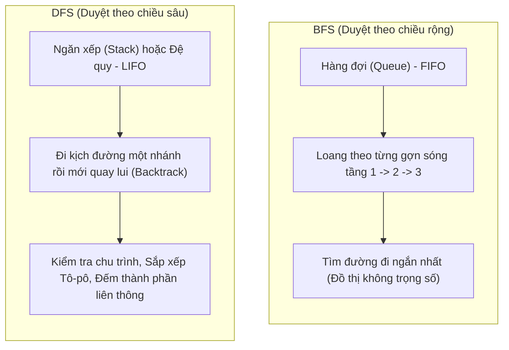

Đồ thị giúp mô hình hóa các đối tượng cùng quan hệ giữa chúng, chẳng hạn mạng xã hội Facebook (người dùng là đỉnh, quan hệ bạn bè là cạnh), bản đồ Google Maps (ngã tư là đỉnh, đường phố là cạnh có trọng số độ dài), hay mạng Internet.

---

## Minh họa tương tác

<CodeIllustration type="search" />

## 1. Biểu diễn Đồ thị: Ma trận kề vs Danh sách kề

Cho đồ thị có $V$ đỉnh và $E$ cạnh:

| Phương pháp | Bộ nhớ | Kiểm tra 2 đỉnh $(u, v)$ có kề nhau? | Duyệt mọi đỉnh kề của $u$ | Thích hợp khi |
| :--- | :--- | :--- | :--- | :--- |
| **Ma trận kề (Adjacency Matrix)** | $\mathcal{O}(V^2)$ | $\mathcal{O}(1)$ (truy cập `matrix[u][v]`) | $\mathcal{O}(V)$ | Đồ thị dày (nhiều cạnh, $E \approx V^2$) |
| **Danh sách kề (Adjacency List)** | $\mathcal{O}(V + E)$ | $\mathcal{O}(\text{deg}(u))$ | $\mathcal{O}(\text{deg}(u))$ | Đồ thị thưa (ít cạnh, $E \ll V^2$) |

---

## 2. So sánh Trực quan: BFS vs DFS

###  Ẩn dụ Dễ nhớ:
- **BFS (Breadth-First Search):** Giống như hòn đá ném xuống mặt hồ phẳng lặng, sóng lan tròn đều theo từng vòng ra xa dần. Đỉnh nào gần điểm xuất phát sẽ được ghé thăm trước.
- **DFS (Depth-First Search):** Giống như bạn đi khám phá một mê cung. Cứ gặp ngã rẽ là bạn đi sâu mãi vào một nhánh cho đến khi đâm vào ngõ cụt thì mới quay lui lại ngã ba trước đó để thử nhánh khác.

---

## 3. Thuật toán Dijkstra: Tìm Đường đi Ngắn nhất

Dijkstra tìm đường đi ngắn nhất từ một đỉnh nguồn $S$ đến tất cả các đỉnh còn lại trên đồ thị có **trọng số không âm** ($w \ge 0$).

###  Nguyên lý Tham lam (Greedy Strategy):
1. Khởi tạo mảng khoảng cách `dist[i] = vô cùng`, riêng `dist[S] = 0`.
2. Dùng hàng đợi ưu tiên (Min-Priority Queue / `std::priority_queue` trong C++) để luôn chọn ra **đỉnh $u$ chưa xét có khoảng cách nhỏ nhất**.
3. Thử "thư giãn" (Relaxation) tất cả các cạnh kề $(u, v)$ với trọng số $w$:
   Nếu điều kiện sau thỏa mãn:
   $$
   dist[u] + w < dist[v] \implies dist[v] = dist[u] + w
   $$
4. Lặp lại cho đến khi xét hết mọi đỉnh.

::: warning Cảnh báo Đi thi
Thuật toán Dijkstra **KHÔNG** chạy đúng trên đồ thị có cạnh mang **trọng số âm**! Khi gặp trọng số âm, bạn phải dùng thuật toán **Bellman-Ford**.
:::

---

## Hệ thống bài tập tự luyện {#bai-tap}

### Bài tập 1: Phát hiện chu trình trong đồ thị có hướng bằng DFS (Tô màu 3 trạng thái)
**Đề bài:**
Cho một đồ thị có hướng $G = (V, E)$. Hãy trình bày thuật toán kiểm tra xem $G$ có chứa chu trình hay không bằng phương pháp duyệt theo chiều sâu DFS với kỹ thuật tô 3 màu cho mỗi đỉnh:
- Màu trắng (0): Đỉnh chưa được thăm.
- Màu xám (1): Đỉnh đang nằm trong ngăn xếp đệ quy (đang được duyệt dở các nhánh con).
- Màu đen (2): Đỉnh đã duyệt xong toàn bộ các nhánh con và rời khỏi ngăn xếp.

**Phân tích & Hướng dẫn giải:**
1. **Dấu hiệu nhận biết chu trình:**
   Trong đồ thị có hướng, chu trình xuất hiện khi và chỉ khi quá trình DFS gặp một cạnh ngược (back-edge), nghĩa là từ đỉnh hiện tại $u$ có cung đi tới một đỉnh $v$ đang có màu xám ($v$ là tổ tiên trực tiếp hoặc gián tiếp của $u$ trên cây duyệt DFS).
2. **Thuật toán chi tiết:**
   - Khởi tạo mảng `color[u] = 0` cho mọi đỉnh $u \in V$.
   - Lặp qua từng đỉnh $u$: nếu `color[u] == 0`, gọi hàm `dfs(u)`.
   - Trong hàm `dfs(u)`:
     + Gán `color[u] = 1` (đánh dấu đỉnh đang duyệt).
     + Duyệt mọi đỉnh kề $v$ của $u$:
       * Nếu `color[v] == 1`: Phát hiện cạnh ngược $(u, v)$, kết luận đồ thị có chu trình và dừng thuật toán.
       * Nếu `color[v] == 0` và đệ quy `dfs(v)` trả về kết quả có chu trình: Lan truyền kết quả lên phía trên.
     + Gán `color[u] = 2` (hoàn tất duyệt toàn bộ cây con gốc $u$).
3. **Độ phức tạp:**
   - Thời gian: $\mathcal{O}(V + E)$ vì mỗi đỉnh được tô màu xám đúng một lần và chuyển sang màu đen đúng một lần, mỗi cạnh được xét đúng một lần.
   - Không gian bộ nhớ: $\mathcal{O}(V)$ cho mảng màu và ngăn xếp đệ quy.

---

### Bài tập 2: Mô phỏng thuật toán Dijkstra và giải thích giới hạn trọng số âm
**Đề bài:**
Cho đồ thị có hướng có trọng số gồm 4 đỉnh $S, A, B, C$ với tập cạnh:
- $(S, A) = 4$, $(S, B) = 2$
- $(B, A) = 1$, $(B, C) = 5$
- $(A, C) = 1$

1. Hãy mô phỏng từng bước thuật toán Dijkstra tìm đường đi ngắn nhất từ đỉnh nguồn $S$ tới tất cả các đỉnh còn lại. Lập bảng theo dõi khoảng cách $dist$ và đỉnh được cố định (trích xuất khỏi Min-Heap) qua từng bước.
2. Giả sử ta thêm một cạnh $(C, B) = -7$. Hãy chỉ ra vì sao thuật toán Dijkstra không thể áp dụng cho đồ thị này, và hiện tượng gì xảy ra với bài toán đường đi ngắn nhất.

**Phân tích & Hướng dẫn giải:**
1. **Mô phỏng từng bước:**
   - Khởi tạo:
     $$
     dist[S] = 0, \quad dist[A] = \infty, \quad dist[B] = \infty, \quad dist[C] = \infty
     $$
     Hàng đợi ưu tiên chứa: $\{(0, S)\}$.
   - **Bước 1:** Trích xuất đỉnh có khoảng cách nhỏ nhất là $S$ ($dist[S] = 0$). Cố định $S$.
     Thư giãn các cạnh kề:
     + Cạnh $(S, A) = 4$: Cập nhật $dist[A] = 4$.
     + Cạnh $(S, B) = 2$: Cập nhật $dist[B] = 2$.
     Hàng đợi còn: $\{(2, B), (4, A)\}$.
   - **Bước 2:** Trích xuất đỉnh $B$ ($dist[B] = 2$). Cố định $B$.
     Thư giãn các cạnh kề của $B$:
     + Cạnh $(B, A) = 1$: Cập nhật $dist[A] = 3$.
     + Cạnh $(B, C) = 5$: Cập nhật $dist[C] = 7$.
     Hàng đợi còn: $\{(3, A), (7, C)\}$.
   - **Bước 3:** Trích xuất đỉnh $A$ ($dist[A] = 3$). Cố định $A$.
     Thư giãn cạnh kề của $A$:
     + Cạnh $(A, C) = 1$: Cập nhật $dist[C] = 4$.
     Hàng đợi còn: $\{(4, C)\}$.
   - **Bước 4:** Trích xuất đỉnh $C$ ($dist[C] = 4$). Cố định $C$. Không còn cạnh đi ra.
   - **Kết quả cuối cùng:**
     $$
     dist[S] = 0, \quad dist[B] = 2, \quad dist[A] = 3, \quad dist[C] = 4
     $$
2. **Hiện tượng khi có cạnh âm $(C, B) = -7$:**
   - Chu trình $B \to A \to C \to B$ có tổng trọng số:
     $$
     w(B, A) + w(A, C) + w(C, B) = 1 + 1 + (-7) = -5 < 0
     $$
     Đây là một **chu trình âm (negative cycle)**.
   - Mỗi lần đi vòng quanh chu trình này, tổng chi phí đường đi lại giảm đi 5 đơn vị. Do đó, chi phí đường đi từ $S$ tới bất kỳ đỉnh nào trong chu trình có thể giảm xuống $-\infty$, khiến bài toán đường đi ngắn nhất không tồn tại nghiệm hữu hạn.
   - Dijkstra hoạt động dựa trên giả định tham lam: một khi đỉnh $u$ được trích xuất khỏi Min-Heap thì khoảng cách $dist[u]$ đã là tối ưu toàn cục và không bao giờ bị giảm tiếp. Với trọng số âm, giả định này bị phá vỡ hoàn toàn vì một đỉnh đã chốt vẫn có thể giảm chi phí thông qua cạnh âm sau đó.

---

##  Nguồn Tham khảo & Trực quan Đồ thị

- [VisuAlgo - Graph Traversal & Dijkstra](https://visualgo.net/en/sssp) - Chạy mô phỏng từng bước thuật toán Dijkstra trực tiếp.
- [CP-Algorithms - Graph Theory](https://cp-algorithms.com/graph/breadth-first-search.html) - Tài liệu trình bày thuật toán đồ thị kèm giải thích và code C++ để đối chiếu.
