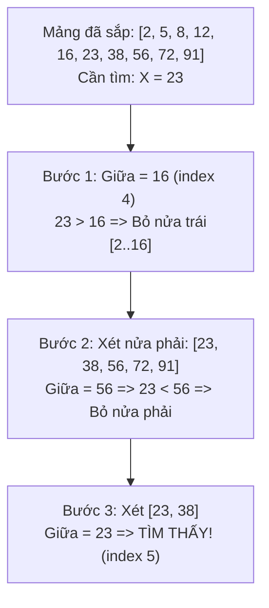

Tìm kiếm là một trong những thao tác cơ bản nhất khi làm việc với dữ liệu. Từ tìm kiếm một sinh viên theo mã số đến tìm kiếm từ khóa trong cơ sở dữ liệu hàng tỷ bản ghi.

---

## 1. Tìm kiếm Nhị phân (Binary Search)

::: danger Điều kiện Tiên quyết Bắt buộc
**Mảng phải được sắp xếp trước!** Nếu mảng chưa sắp xếp, bạn không thể dùng Binary Search mà phải dùng Linear Search $\mathcal{O}(n)$ hoặc sắp xếp trước.
:::

###  Trực giác Đơn giản
Giống như trò chơi đoán số từ $1$ đến $100$:
- Người kia nghĩ số $73$.
- Lần 1: Bạn đoán $50$ $\rightarrow$ Báo "Lớn hơn". Bạn loại ngay được 50 số đầu ($1 \rightarrow 50$).
- Lần 2: Bạn đoán ở giữa đoạn $51 \rightarrow 100$, tức là $75$ $\rightarrow$ Báo "Nhỏ hơn". Bạn loại tiếp được đoạn $75 \rightarrow 100$.
- Cứ mỗi lần đoán, bạn **cắt đôi không gian tìm kiếm**.

Độ phức tạp chỉ mất $\log_2(100) \approx 7$ lần đoán! Với mảng $1.000.000$ phần tử, Binary Search tìm ra trong tối đa **20 phép so sánh**.



###  Mã Cài đặt C++ Chống Tràn Số

```cpp
int binarySearch(const vector<int>& arr, int target) {
    int left = 0;
    int right = arr.size() - 1;

    while (left <= right) {
        // Tránh tràn số (overflow) thay vì dùng (left + right) / 2
        int mid = left + (right - left) / 2;

        if (arr[mid] == target) {
            return mid; // Tìm thấy tại chỉ số mid
        }
        if (arr[mid] < target) {
            left = mid + 1;  // Tìm tiếp bên nửa phải
        } else {
            right = mid - 1; // Tìm tiếp bên nửa trái
        }
    }
    return -1; // Không tìm thấy
}
```

---

## 2. Kỹ thuật Hai Con Trỏ (Two Pointers)

Kỹ thuật hai con trỏ giúp giảm độ phức tạp từ $\mathcal{O}(n^2)$ xuống $\mathcal{O}(n)$ trên mảng đã sắp xếp.

### Bài toán 2-Sum: tìm hai số có tổng bằng giá trị cho trước
- Đặt con trỏ `left = 0` (số nhỏ nhất) và `right = n - 1` (số lớn nhất).
- Tính `sum = arr[left] + arr[right]`:
  - Nếu `sum == S` $\rightarrow$ Tìm thấy cặp số!
  - Nếu `sum < S` $\rightarrow$ Cần tổng lớn hơn $\rightarrow$ Tăng `left++`.
  - Nếu `sum > S` $\rightarrow$ Cần tổng nhỏ hơn $\rightarrow$ Giảm `right--`.

```cpp
bool hasPairWithSum(const vector<int>& arr, int targetSum) {
    int left = 0;
    int right = arr.size() - 1;
    while (left < right) {
        int currentSum = arr[left] + arr[right];
        if (currentSum == targetSum) return true;
        if (currentSum < targetSum) left++;
        else right--;
    }
    return false;
}
```

---

## 3. Hệ thống bài tập tự luyện {#bai-tap}

### Bài 1: Cài đặt biến thể tìm kiếm nhị phân: `lower_bound` và `upper_bound`

::: exercise Yêu cầu
Cho một mảng số nguyên $A$ đã sắp xếp tăng dần và một giá trị $x$.
1. **`lower_bound`**: Tìm chỉ số đầu tiên $i$ sao cho $A[i] \ge x$. Nếu mọi phần tử đều nhỏ hơn $x$, trả về $n$.
2. **`upper_bound`**: Tìm chỉ số đầu tiên $i$ sao cho $A[i] > x$. Nếu không có phần tử nào lớn hơn $x$, trả về $n$.

Viết mã C++ cài đặt hai hàm trên với độ phức tạp thời gian $\mathcal{O}(\log n)$ và bộ nhớ phụ $\mathcal{O}(1)$.
:::

::: solution
#### Lời giải chi tiết
```cpp
// Cài đặt lower_bound: phần tử đầu tiên >= target
int lowerBound(const vector<int>& arr, int target) {
    int low = 0, high = arr.size(); // Chú ý high = n để xử lý trường hợp không tìm thấy
    while (low < high) {
        int mid = low + (high - low) / 2;
        if (arr[mid] >= target) {
            high = mid; // Thu hẹp về nửa trái, giữ mid vì có thể là đáp án
        } else {
            low = mid + 1;
        }
    }
    return low;
}

// Cài đặt upper_bound: phần tử đầu tiên > target
int upperBound(const vector<int>& arr, int target) {
    int low = 0, high = arr.size();
    while (low < high) {
        int mid = low + (high - low) / 2;
        if (arr[mid] > target) {
            high = mid;
        } else {
            low = mid + 1;
        }
    }
    return low;
}
```

*Ứng dụng quan trọng:* Số lần xuất hiện của phần tử $x$ trong mảng đã sắp xếp được tính ngay bằng công thức:
$$\text{count}(x) = \text{upper\_bound}(x) - \text{lower\_bound}(x)$$
trong đúng $\mathcal{O}(\log n)$ thời gian mà không cần duyệt tuyến tính.
:::

---

### Bài 2: Tìm kiếm trên mảng đã sắp xếp bị xoay vòng (Rotated Sorted Array)

::: exercise Yêu cầu
Cho mảng số nguyên gồm các phần tử phân biệt ban đầu đã sắp xếp tăng dần, nhưng bị xoay vòng tại một điểm chốt không xác định (ví dụ mảng `[0, 1, 2, 4, 5, 6, 7]` bị xoay thành `[4, 5, 6, 7, 0, 1, 2]`).
Hãy viết hàm tìm vị trí của một số `target` trong mảng với thời gian $\mathcal{O}(\log n)$. Nếu không tồn tại, trả về $-1$.
:::

::: solution
#### Lời giải chi tiết
Ý tưởng cốt lõi: Khi chia đôi một mảng bị xoay vòng tại vị trí `mid`, **luôn có ít nhất một nửa (nửa trái hoặc nửa phải) được sắp xếp hoàn toàn tăng dần**.
Ta xác định nửa nào đã sắp xếp, sau đó kiểm tra xem `target` có nằm trong khoảng giá trị của nửa đó hay không:

```cpp
int searchRotated(const vector<int>& nums, int target) {
    int low = 0, high = nums.size() - 1;

    while (low <= high) {
        int mid = low + (high - low) / 2;
        if (nums[mid] == target) return mid;

        // Kiểm tra xem nửa bên trái có được sắp xếp tăng dần hay không
        if (nums[low] <= nums[mid]) {
            // Target nằm trong phạm vi của nửa trái đã sắp xếp
            if (target >= nums[low] && target < nums[mid]) {
                high = mid - 1;
            } else {
                low = mid + 1;
            }
        } 
        // Ngược lại, nửa bên phải chắc chắn được sắp xếp tăng dần
        else {
            // Target nằm trong phạm vi của nửa phải đã sắp xếp
            if (target > nums[mid] && target <= nums[high]) {
                low = mid + 1;
            } else {
                high = mid - 1;
            }
        }
    }
    return -1; // Không tìm thấy
}
```
Độ phức tạp thời gian: Tại mỗi vòng lặp, ta loại bỏ được một nửa không gian tìm kiếm, do đó thời gian chạy là $\mathcal{O}(\log n)$. Bộ nhớ phụ $\mathcal{O}(1)$.
:::

---

## 4. Nguồn tham khảo & Đọc thêm

- [LeetCode Explore - Binary Search](https://leetcode.com/explore/learn/card/binary-search/)
- [VisuAlgo - Binary Search](https://visualgo.net/en/bst)
