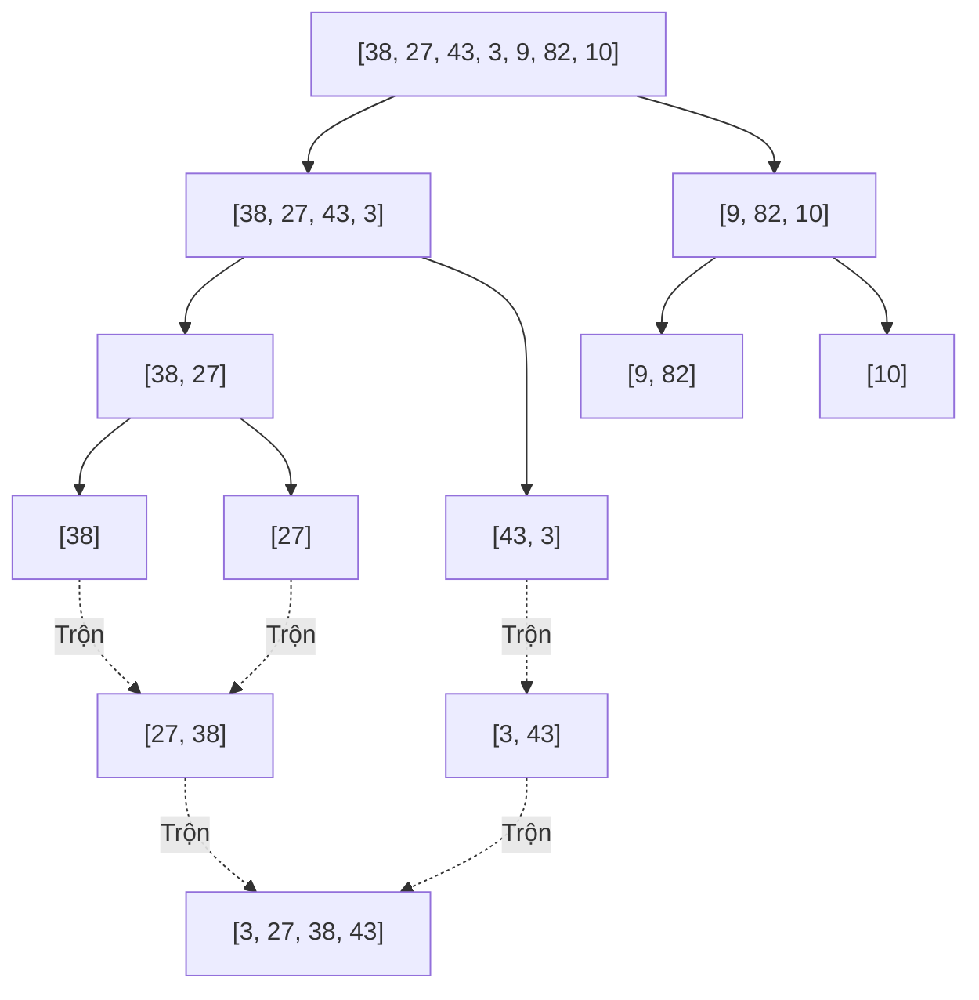
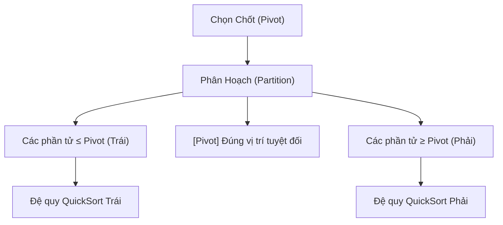

Sắp xếp là bài toán kinh điển nhất trong khoa học máy tính: *Cho một danh sách các phần tử, hãy sắp xếp chúng theo thứ tự tăng dần (hoặc giảm dần).*

Bài này tập trung vào MergeSort và QuickSort, đồng thời đối chiếu chúng với BubbleSort và SelectionSort có độ phức tạp $\mathcal{O}(n^2)$ trong trường hợp xấu nhất. MergeSort có thời gian $\mathcal{O}(n \log n)$, còn QuickSort cần xét cả cách chọn pivot và trường hợp đầu vào.

---

## 1. Bảng So sánh Nhanh (Cheat Sheet Đi Thi)

| Thuật toán | Tốt nhất | Trung bình | Xấu nhất | Bộ nhớ phụ | Ổn định (Stable)? | Phương pháp |
| :--- | :--- | :--- | :--- | :--- | :--- | :--- |
| **Bubble / Insertion** | $\mathcal{O}(n)$ | $\mathcal{O}(n^2)$ | $\mathcal{O}(n^2)$ | $\mathcal{O}(1)$ | Có | So sánh từng cặp |
| **MergeSort** | $\mathcal{O}(n \log n)$ | $\mathcal{O}(n \log n)$ | $\mathcal{O}(n \log n)$ | $\mathcal{O}(n)$ | **Có** | Chia để trị (Divide & Conquer) |
| **QuickSort** | $\mathcal{O}(n \log n)$ | $\mathcal{O}(n \log n)$ | $\mathcal{O}(n^2)$ | $\mathcal{O}(\log n)$ | **Không** | Phân hoạch quanh Pivot |
| **HeapSort** | $\mathcal{O}(n \log n)$ | $\mathcal{O}(n \log n)$ | $\mathcal{O}(n \log n)$ | $\mathcal{O}(1)$ | **Không** | Dùng Max-Heap |

::: info Khái niệm "Tính Ổn Định" (Stability) là gì?
Một thuật toán sắp xếp là **Stable** nếu hai phần tử có giá trị bằng nhau vẫn giữ nguyên thứ tự xuất hiện trước sau như ban đầu.  
*Ví dụ:* Danh sách sinh viên đã sắp theo Tên, nếu dùng thuật toán Stable để sắp lại theo Điểm số thì các bạn cùng điểm vẫn sẽ giữ nguyên thứ tự tên ban đầu.
:::

---

## 2. MergeSort: Thuật toán Chia để Trị Hoàn hảo

###  Ý tưởng Cốt lõi
MergeSort dựa trên 3 bước **Chia để trị (Divide & Conquer)**:
1. **Chia (Divide):** Chia đôi mảng thành 2 nửa bằng nhau cho đến khi mỗi mảng con chỉ còn 1 phần tử (mảng 1 phần tử hiển nhiên đã được sắp xếp).
2. **Trị (Conquer):** Đệ quy sắp xếp từng nửa mảng con.
3. **Trộn (Combine/Merge):** Trộn 2 mảng con đã sắp xếp thành 1 mảng lớn hoàn chỉnh.



###  Kỹ thuật Trộn Hai Mảng Đã Sắp Xếp (Merge Step)
Cho 2 mảng: $A = [2, 7]$ và $B = [3, 5]$.  
- Dùng 2 con trỏ `i` trỏ vào $A$, `j` trỏ vào $B$.
- So sánh $A[i]$ và $B[j]$, phần tử nào nhỏ hơn thì đưa vào mảng kết quả và tăng con trỏ tương ứng.
- Bước này duyệt qua toàn bộ phần tử $\rightarrow$ Thời gian trộn là **$\mathcal{O}(n)$**.
- Vì cây đệ quy chia đôi mảng có chiều cao là $\log_2(n)$ tầng, mỗi tầng tốn $\mathcal{O}(n)$ $\rightarrow$ **Tổng thời gian luôn là $\mathcal{O}(n \log n)$** trong mọi trường hợp!

---

## 3. QuickSort: Sắp xếp Nhanh bằng Phân Hoạch

###  Ý tưởng Cốt lõi
Thay vì chia đôi cố định ở giữa như MergeSort, QuickSort chọn một phần tử làm **Chốt (Pivot)** và phân hoạch:
- Đẩy toàn bộ các số **nhỏ hơn Pivot** sang bên trái.
- Đẩy toàn bộ các số **lớn hơn Pivot** sang bên phải.
- Lúc này, Pivot đã nằm **chính xác 100%** tại vị trí cuối cùng của nó trong mảng đã sắp xếp!
- Tiếp tục đệ quy phân hoạch nửa bên trái và nửa bên phải của Pivot.



### Khi nào QuickSort có thời gian bậc hai?
- Nếu mảng đã có thứ tự sẵn (hoặc ngược chiều) mà bạn luôn chọn **phần tử đầu tiên hoặc cuối cùng** làm Pivot:
  - Một bên sẽ có $0$ phần tử, bên còn lại có $n - 1$ phần tử.
  - Cây đệ quy bị lệch hẳn 1 bên thành cây thoái hóa sâu $n$ tầng.
  - Tổng số bước: $$
(n-1) + (n-2) + \dots + 1 = \frac{n(n-1)}{2} \implies \mathcal{O}(n^2)
$$.
- **Giải pháp khắc phục:** 
  - Chọn Pivot ngẫu nhiên (Randomized QuickSort).
  - Chọn Pivot là trung vị của 3 phần tử: Đầu, Giữa, Cuối (Median-of-three).

---

## 4. Mã Cài đặt Mẫu Chuẩn C++ (Kèm Chú Thích Dễ Hiểu)

```cpp
#include <iostream>
#include <vector>
using namespace std;

// Hàm phân hoạch Lomuto cho QuickSort
int partition(vector<int>& arr, int low, int high) {
    int pivot = arr[high]; // Chọn phần tử cuối làm Pivot
    int i = low - 1;       // i đánh dấu ranh giới vùng số nhỏ hơn pivot

    for (int j = low; j < high; j++) {
        if (arr[j] < pivot) {
            i++;
            swap(arr[i], arr[j]);
        }
    }
    swap(arr[i + 1], arr[high]); // Đưa pivot về đúng vị trí ở giữa
    return i + 1;                // Trả về vị trí của pivot
}

void quickSort(vector<int>& arr, int low, int high) {
    if (low < high) {
        int pi = partition(arr, low, high);
        quickSort(arr, low, pi - 1);  // Đệ quy nửa trái
        quickSort(arr, pi + 1, high); // Đệ quy nửa phải
    }
}
```

---

## 5. Hệ thống bài tập tự luyện {#bai-tap}

### Bài 1: Phân tích tính ổn định (Stability) của thuật toán sắp xếp

::: exercise Yêu cầu
1. Thế nào là một thuật toán sắp xếp ổn định (Stable Sort)? Nêu ý nghĩa thực tiễn khi sắp xếp các bản ghi có nhiều trường dữ liệu (ví dụ: sắp xếp sinh viên theo điểm số, những người bằng điểm nhau phải giữ nguyên thứ tự tên ban đầu).
2. Tại sao Merge Sort là thuật toán ổn định trong khi Quick Sort kinh điển lại không ổn định? Đưa ra một mảng ví dụ cụ thể minh chứng Quick Sort làm đảo lộn thứ tự tương đối của các phần tử bằng nhau.
:::

::: solution
#### Lời giải chi tiết
1. **Định nghĩa tính ổn định:**
   Một thuật toán sắp xếp được gọi là ổn định nếu nó bảo toàn thứ tự tương đối ban đầu của các phần tử có cùng giá trị khóa. Nghĩa là, nếu $A[i] = A[j]$ với $i < j$ trước khi sắp xếp, thì sau khi sắp xếp, vị trí mới của $A[i]$ vẫn luôn đứng trước vị trí mới của $A[j]$.
   *Ý nghĩa thực tế:* Giúp thực hiện sắp xếp nhiều tiêu chí (Multi-key sort). Ví dụ danh sách đã được xếp theo thứ tự bảng chữ cái tên; khi ta chạy một thuật toán ổn định để xếp theo điểm GPA, các bạn cùng GPA sẽ tự động giữ nguyên thứ tự bảng chữ cái mà không cần so sánh lại trường tên.

2. **So sánh Merge Sort và Quick Sort:**
   - **Merge Sort ổn định** vì trong bước trộn (`merge`), khi hai phần tử ở mảng con trái và mảng con phải bằng nhau ($L[i] == R[j]$), thuật toán luôn ưu tiên chọn phần tử từ mảng con trái $L[i]$ vào mảng kết quả trước.
   - **Quick Sort không ổn định** vì trong bước phân hoạch (`partition`), các phép hoán đổi từ xa (`swap`) có thể đưa một phần tử nhảy vọt qua các phần tử bằng nó.
   *Ví dụ phản chứng:* Xét mảng các cặp `(giá trị, nhãn)`:
   $$
   A = [ (3, \text{a}), (5, \text{x}), (3, \text{b}), (2, \text{y}) ]
   $$
   Chọn phần tử cuối $(2, \text{y})$ làm pivot trong phân hoạch Lomuto. Thuật toán duyệt và hoán đổi $(3, \text{a})$ với chính nó không đổi, nhưng cuối cùng hoán đổi pivot $(2, \text{y})$ với phần tử tại chỉ số ranh giới $(5, \text{x})$. Trong các trường hợp hoán đổi từ xa với pivot ở giữa mảng, phần tử $(3, \text{a})$ có thể bị đổi chỗ về phía sau $(3, \text{b})$, làm mất thứ tự ban đầu.
:::

---

### Bài 2: Đếm số cặp nghịch thế bằng Merge Sort cải tiến

::: exercise Yêu cầu
Cho một mảng số nguyên $A$ gồm $n$ phần tử. Một cặp chỉ số $(i, j)$ được gọi là một cặp nghịch thế nếu:
$$
i < j \quad \text{và} \quad A[i] > A[j]
$$
1. Viết mã giả hoặc mã C++ đếm số cặp nghịch thế trong thời gian $\mathcal{O}(n \log n)$ bằng cách cải biên bước trộn (`merge`) của Merge Sort.
2. Giải thích vì sao thuật toán này có thể đếm được số cặp nghịch thế mà không cần so sánh từng cặp một trong $\mathcal{O}(n^2)$.
:::

::: solution
#### Lời giải chi tiết
1. **Mã nguồn C++:**
```cpp
long long mergeAndCount(vector<int>& arr, int left, int mid, int right) {
    vector<int> L(arr.begin() + left, arr.begin() + mid + 1);
    vector<int> R(arr.begin() + mid + 1, arr.begin() + right + 1);

    int i = 0, j = 0, k = left;
    long long count = 0;

    while (i < L.size() && j < R.size()) {
        if (L[i] <= R[j]) {
            arr[k++] = L[i++];
        } else {
            arr[k++] = R[j++];
            // Tất cả các phần tử còn lại từ L[i] đến cuối L đều lớn hơn R[j]
            count += (L.size() - i);
        }
    }
    while (i < L.size()) arr[k++] = L[i++];
    while (j < R.size()) arr[k++] = R[j++];
    return count;
}

long long countInversions(vector<int>& arr, int left, int right) {
    long long count = 0;
    if (left < right) {
        int mid = left + (right - left) / 2;
        count += countInversions(arr, left, mid);
        count += countInversions(arr, mid + 1, right);
        count += mergeAndCount(arr, left, mid, right);
    }
    return count;
}
```

2. **Bản chất thuật toán:**
   Khi trộn hai mảng con đã được sắp xếp tăng dần $L$ và $R$: nếu phát hiện $L[i] > R[j]$, vì mảng $L$ đã có thứ tự nên toàn bộ các phần tử đứng sau $i$ trong $L$ (tức là $L[i], L[i+1], \dots, L[|L|-1]$) đều lớn hơn $R[j]$.
   Do đó, chỉ với một phép so sánh, ta đếm được ngay lập tức $(|L| - i)$ cặp nghịch thế cùng lúc mà không cần duyệt từng phần tử.
   Độ phức tạp tổng thể vẫn tuân theo hệ thức truy hồi của Merge Sort:
   $$T(n) = 2T(n/2) + \mathcal{O}(n) \implies \mathcal{O}(n \log n)$$
:::

---

## 6. Nguồn tham khảo & Đọc thêm

- [VisuAlgo - Sorting Visualization](https://visualgo.net/en/sorting) - Xem hoạt họa chạy từng dòng code của QuickSort và MergeSort theo thời gian thực.
- Thomas H. Cormen et al., *Introduction to Algorithms*, Chương 7: Quicksort và Chương 8: Sorting in Linear Time.
