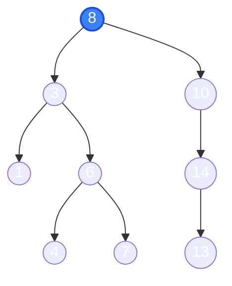

Cấu trúc cây (Tree) là một cấu trúc dữ liệu phi tuyến tính (non-linear), mô phỏng quan hệ phân cấp như cây gia phả, cấu trúc thư mục trên ổ đĩa, hay DOM trong HTML.

---

## 1. Cây Nhị Phân Tìm Kiếm (Binary Search Tree - BST)

Một cây nhị phân được gọi là **BST** nếu với mọi nút (Node):
- Mọi nút trên **cây con trái** đều có giá trị **nhỏ hơn** nút hiện tại.
- Mọi nút trên **cây con phải** đều có giá trị **lớn hơn** nút hiện tại.

::: tip Kết quả duyệt giữa trên cây tìm kiếm nhị phân
Khi duyệt cây BST theo thứ tự **Inorder (Trái $\rightarrow$ Gốc $\rightarrow$ Phải)**, bạn luôn thu được một dãy số **tăng dần khi các khóa phân biệt**!
*Ví dụ cây trên:* $1 \to 3 \to 4 \to 6$ và $7 \to 8 \to 10 \to 13 \to 14$.
:::

---

## 2. Các Phép Duyệt Cây (Tree Traversals)

| Cách duyệt | Thứ tự đi | Ứng dụng phổ biến |
| :--- | :--- | :--- |
| **Tiền thứ tự (Preorder)** | **Gốc** $\rightarrow$ Trái $\rightarrow$ Phải | Sao chép cây, biểu diễn tiền tố (Ba Lan) |
| **Trung thứ tự (Inorder)** | Trái $\rightarrow$ **Gốc** $\rightarrow$ Phải | Xuất dữ liệu BST theo thứ tự tăng dần |
| **Hậu thứ tự (Postorder)**| Trái $\rightarrow$ Phải $\rightarrow$ **Gốc** | Giải phóng/xóa bộ nhớ cây từ dưới lên |
| **Theo mức (Level-order)** | Từng tầng từ trên xuống (BFS) | Tìm đường đi ngắn nhất hoặc in cây theo tầng |

---

## 3. Thao tác Xóa trên BST (Thường Xuất hiện trong Đề thi UET)

Xóa một nút trên cây BST chia làm 3 trường hợp:
1. **Trường hợp 1 (Nút lá):** Không có con $\rightarrow$ Xóa trực tiếp nút đó.
2. **Trường hợp 2 (Nút có 1 con):** Nối thẳng con của nó vào cha của nó rồi xóa nút.
3. **Trường hợp 3 (Nút có 2 con):**
   - Tìm **phần tử nhỏ nhất bên cây con phải** (Inorder Successor) hoặc phần tử lớn nhất bên cây con trái.
   - Sao chép giá trị đó đè lên nút cần xóa.
   - Xóa nút thay thế đó (lúc này nút thay thế chỉ rơi vào Trường hợp 1 hoặc 2).

---

## 4. Hiện tượng Suy biến & Cây Cân bằng (AVL Tree)

Nếu bạn chèn một dãy số đã sắp xếp sẵn: `1, 2, 3, 4, 5` vào BST thông thường:
- Cây sẽ biến thành một danh sách liên kết thẳng đứng (chiều cao $h = n$).
- Tốc độ tìm kiếm bị tụt từ $\mathcal{O}(\log n)$ xuống $\mathcal{O}(n)$.

Để khắc phục, người ta phát minh ra **Cây cân bằng (AVL Tree / Red-Black Tree)**:
- Tự động xoay cây (Left Rotation, Right Rotation) khi hệ số cân bằng (chênh lệch chiều cao 2 nhánh) $> 1$ hoặc $< -1$.
- Giữ chiều cao luôn đạt mức $\mathcal{O}(\log n)$.

---

## 5. Hệ thống bài tập tự luyện {#bai-tap}

### Bài 1: Khôi phục cây nhị phân từ thứ tự duyệt Preorder và Inorder

::: exercise Yêu cầu
Cho thứ tự duyệt hai phép của một cây nhị phân có các nút mang giá trị phân biệt:
- **Tiền thứ tự (Preorder):** `[A, B, D, E, C, F]`
- **Trung thứ tự (Inorder):** `[D, B, E, A, C, F]`

1. Dựng lại cấu trúc cây nhị phân ban đầu (chỉ rõ nút gốc, cây con trái và cây con phải).
2. Xác định thứ tự duyệt hậu thứ tự (Postorder) của cây này.
:::

::: solution
#### Lời giải chi tiết
1. **Quy trình dựng cây:**
   - Trong duyệt Preorder (`Gốc -> Trái -> Phải`), phần tử đầu tiên luôn là **gốc của cây**: vậy gốc là `A`.
   - Tìm vị trí `A` trong Inorder (`Trái -> Gốc -> Phải`):
     - Bên trái của `A` trong Inorder là `[D, B, E]` $\implies$ Đây là các nút thuộc **cây con trái** của `A`.
     - Bên phải của `A` trong Inorder là `[C, F]` $\implies$ Đây là các nút thuộc **cây con phải** của `A`.
   - **Xét cây con trái:** Gồm các nút `{B, D, E}`.
     - Trong Preorder, sau `A` là `B`, vậy `B` là gốc của cây con trái.
     - Trong Inorder, bên trái `B` là `D` (vậy `D` là con trái của `B`), bên phải `B` là `E` (vậy `E` là con phải của `B`).
   - **Xét cây con phải:** Gồm các nút `{C, F}`.
     - Trong Preorder, sau khi hết nhánh trái là đến `C`, vậy `C` là gốc cây con phải của `A`.
     - Trong Inorder, `C` đứng trước `F`, nên `F` là con phải của `C`.
   - **Cấu trúc cây hoàn chỉnh:**
     - `A` là gốc. Con trái là `B`, con phải là `C`.
     - `B` có con trái là `D`, con phải là `E`.
     - `C` có con phải là `F` (con trái rỗng).

2. **Duyệt Postorder (`Trái -> Phải -> Gốc`):**
   - Nhánh trái: Duyệt `D` -> `E` -> `B`.
   - Nhánh phải: Duyệt `F` -> `C`.
   - Cuối cùng là gốc: `A`.
   - Kết quả Postorder: `[D, E, B, F, C, A]`.
:::

---

### Bài 2: Mô phỏng chèn phần tử và phép xoay trên Cây AVL

::: exercise Yêu cầu
Bắt đầu từ một cây AVL rỗng, lần lượt chèn các số nguyên sau vào cây:
$$10, 20, 30, 40, 50, 25$$
1. Mô tả trạng thái cây sau khi chèn 3 phần tử đầu tiên $10, 20, 30$. Chỉ rõ loại phép xoay (Rotation) cần thực hiện.
2. Mô tả trạng thái cây sau khi chèn tiếp $40, 50$.
3. Khi chèn tiếp phần tử $25$, xảy ra hiện tượng mất cân bằng ở đâu và loại phép xoay kép nào được kích hoạt?
:::

::: solution
#### Lời giải chi tiết
1. **Chèn $10, 20, 30$:**
   - Cây tạo thành nhánh lệch phải (Right-Right): $10 \to 20 \to 30$.
   - Nút $10$ có hệ số cân bằng $h_{\text{left}} - h_{\text{right}} = 0 - 2 = -2$ (mất cân bằng).
   - Thực hiện **Phép xoay đơn sang trái (Left Rotation)** tại $10$: nút $20$ lên làm gốc, con trái là $10$, con phải là $30$. Cây cân bằng hoàn hảo.

2. **Chèn tiếp $40, 50$:**
   - Chèn $40$: vào con phải của $30$. Cây vẫn cân bằng.
   - Chèn $50$: vào con phải của $40$. Nhánh con bên phải của $30$ bị lệch phải ($30 \to 40 \to 50$), nút $30$ mất cân bằng (hệ số $-2$).
   - Thực hiện **Phép xoay đơn sang trái** tại nút $30$: nút $40$ lên thay thế, con trái là $30$, con phải là $50$.
   - Lúc này cây có gốc $20$: con trái là $10$, con phải là $40$ (với con của $40$ là $30$ và $50$). Chiều cao cây là 3, cân bằng.

3. **Chèn tiếp $25$:**
   - $25$ được chèn vào con trái của nút $30$.
   - Kiểm tra hệ số cân bằng từ dưới lên:
     - Tại nút $40$: nhánh trái có $30 \to 25$ (chiều cao 2), nhánh phải có $50$ (chiều cao 1) $\implies$ hệ số là $2 - 1 = 1$ (vẫn cân bằng).
     - Tại nút gốc $20$: nhánh trái có $10$ (chiều cao 1), nhánh phải có nút $40$ (chiều cao 3) $\implies$ hệ số cân bằng tại gốc là $1 - 3 = -2$ (mất cân bằng).
   - Nhánh gây mất cân bằng là: đi sang phải đến $40$, rồi đi sang trái đến $30$ (dạng Right-Left).
   - Kích hoạt **Phép xoay kép Phải-Trái (Right-Left Double Rotation)**:
     - Bước 1: Xoay phải tại nút $40$ để biến nhánh lệch thành Right-Right.
     - Bước 2: Xoay trái tại nút gốc $20$.
     - Kết quả: Nút $30$ được đưa lên làm gốc mới của toàn bộ cây!
:::

---

## 6. Nguồn tham khảo & Đọc thêm

- [VisuAlgo - BST & AVL Tree Simulator](https://visualgo.net/en/bst) - Thử chèn, xóa và quan sát cây tự động xoay cân bằng.
- Thomas H. Cormen et al., *Introduction to Algorithms*, Chương 12 (Binary Search Trees) và Chương 13 (Red-Black Trees).
