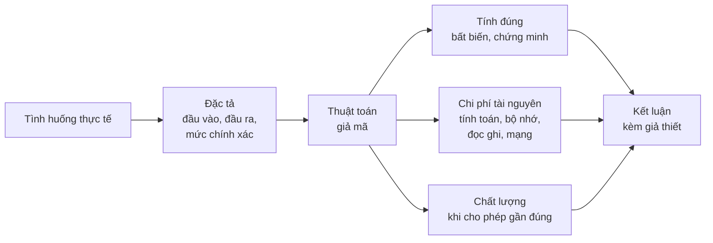
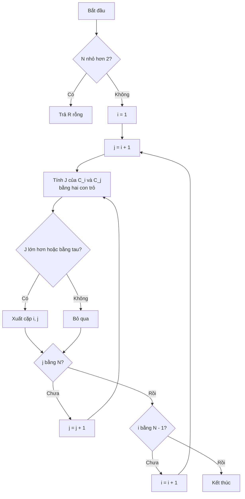
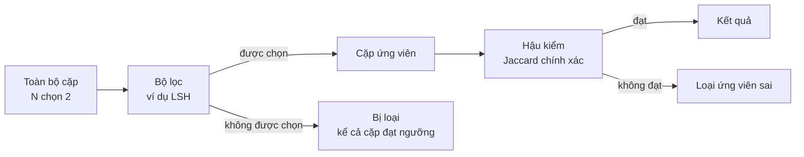
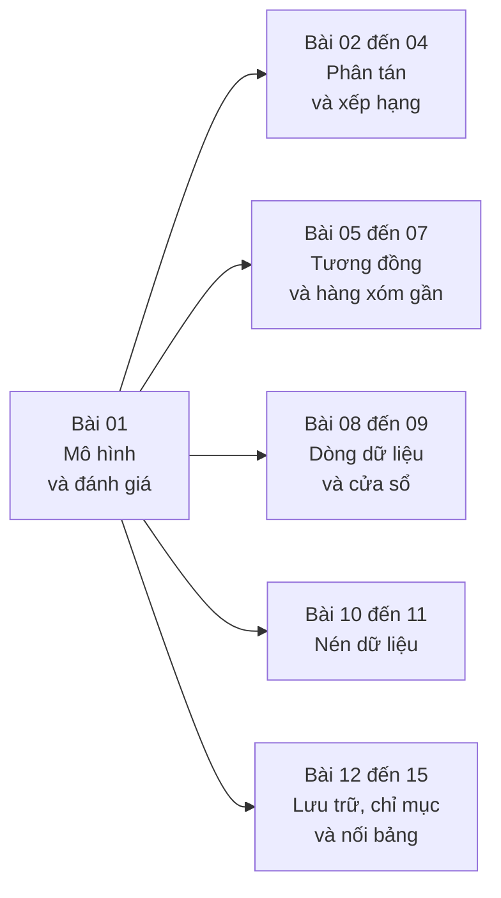

# Bài 01 · Bài toán dữ liệu lớn và mô hình thuật toán

> *"Một thuật toán chạy được chưa phải là một thuật toán đúng; một thuật toán đúng chưa phải là một thuật toán dùng được; và một kết quả đúng chưa phải là một kết luận đúng."*

← [Mục lục](./index.md) · [Bài tiếp theo →](./bai-02-mapreduce-va-xu-ly-du-lieu-lon.md)

::: info Bài này giải quyết vấn đề gì?
Khi dữ liệu lớn hơn bộ nhớ của một máy, nằm rải trên nhiều máy, hoặc đến liên tục không dừng, những thuật toán "học ở năm hai" (sắp xếp mảng, duyệt mọi cặp, nạp hết vào RAM) bắt đầu gãy. Bài 01 không dạy một thuật toán cụ thể, mà dạy **cách đặt bài toán và cách chấm điểm một lời giải**:

- **Đặc tả**: đầu vào là gì, đầu ra chính xác là gì, có cho phép sai số không.
- **Đánh giá**: lời giải có đúng không, tốn bao nhiêu phép tính, bộ nhớ, khối đĩa, byte qua mạng, độ trễ.
- **Giới hạn suy luận**: tìm đúng mẫu trong dữ liệu chưa chắc đã đủ căn cứ để kết luận về thế giới thật (nguyên lý Bonferroni).

Toàn bộ học phần (Bài 02–15) là những câu trả lời khác nhau cho các giới hạn được nêu ở đây.
:::

**Nguồn đối chiếu:** Slide Bài 01 của học phần; MMDS (Leskovec–Rajaraman–Ullman) mục 1.2, 1.3.4, phần mở đầu Chương 3 (tr. 73–75), bài tập 1.2.1–1.2.2.

---

## 1. Dữ liệu lớn: khi nào thì "lớn"?

::: tip Ẩn dụ: Thư viện quốc gia và chiếc bàn học
Bạn cần tổng hợp thông tin từ **cả một thư viện quốc gia** (dữ liệu $D$), nhưng **chiếc bàn học** (bộ nhớ chính $M$) chỉ đặt được vài chục cuốn. Bạn không thể "bê cả thư viện lên bàn". Bạn phải chọn: đọc lần lượt từng chồng sách (quét tuần tự), ghi chú lại những gì cần (trạng thái gọn), nhờ bạn bè chia nhau đọc (phân tán), hoặc làm thẻ mục lục để khỏi lật lại (chỉ mục). Mỗi lựa chọn có giá của nó.
:::

"Lớn" không phải là một con số cố định. Dữ liệu là **lớn** khi nó vượt **một giới hạn tài nguyên** của cách giải đơn giản:

| Giới hạn | Biểu hiện | Hướng xử lý trong học phần |
|---|---|---|
| Dữ liệu $D$ lớn hơn bộ nhớ $M$ | Không nạp trọn tệp vào RAM | Sắp xếp ngoài, chỉ mục (Bài 12–15) |
| Dữ liệu nằm trên nhiều máy | Gom về một máy tốn đường truyền | Map-Reduce (Bài 02) |
| Số cặp cần so sánh bùng nổ | $\binom{N}{2}$ phép so sánh | MinHash, LSH (Bài 05–06) |
| Dữ liệu đến liên tục | Không thể lưu hết lịch sử | Lấy mẫu, Bloom, sketch (Bài 08–09) |
| Truy vấn cần trả lời nhanh | Quét toàn kho cho mỗi truy vấn | Chỉ mục véc-tơ HNSW, PQ (Bài 07) |
| Dung lượng lưu trữ | Lưu nguyên văn tốn đĩa | Nén Huffman, LZ, JPEG (Bài 10–11) |

### 1.1. Mười ba tình huống mở đầu

Slide Bài 01 dẫn ra một loạt bài toán thực tế, mỗi bài là "lời hứa" cho một bài học về sau:

| Tình huống | Đầu ra cần có | Trở ngại chính | Bài học |
|---|---|---|---|
| Cộng kích thước trang theo máy chủ | Tổng byte mỗi máy chủ | Tệp nhật ký lớn hơn bộ nhớ | 02 |
| Đếm số lần xuất hiện của từng từ | Một số đếm cho mỗi từ | Kho nằm trên nhiều máy | 02 |
| Tính điểm quan trọng trang web | Điểm cho mỗi trang | Lặp nhiều vòng trên đồ thị lớn | 03 |
| Ưu tiên kết quả theo chủ đề ("Jaguar") | Điểm theo chủ đề | Không thể lưu một bộ điểm cho mỗi người | 04 |
| Hạn chế liên kết rác | Điểm ít bị thao túng | Nhiều liên kết do cùng một bên tạo | 04 |
| Tìm cặp tài liệu gần trùng | Các cặp đạt ngưỡng | $\binom{N}{2}$ cặp | 05–06 |
| Tìm $k$ đoạn gần véc-tơ truy vấn | $k$ định danh | Quét 10 tỷ véc-tơ 3072 chiều | 07 |
| Giữ mẫu truy vấn, lọc thư đến | Mẫu theo người dùng; quyết định nhận/loại | Bộ nhớ hữu hạn, dòng không dừng | 08 |
| Đếm người dùng, lượt truy cập gần đây | Số phân biệt; số trong cửa sổ | Bản ghi hết hạn vẫn phải bị loại | 09 |
| Lưu văn bản ít dung lượng hơn | Chuỗi khôi phục nguyên vẹn | Mã và thông tin giải mã đều tốn chỗ | 10–11 |
| Giảm dung lượng ảnh | Ảnh đạt chất lượng yêu cầu | Phải đo sai khác | 11 |
| Sắp tệp lớn, tra cứu, giao vùng bản đồ | Tệp có thứ tự; bản ghi thỏa điều kiện | Mỗi lần đọc khối đều tốn | 12–14 |
| Ghép sinh viên với môn đăng ký | Mọi cặp trùng mã | 100 + 400 khối, bộ nhớ 20 khối | 15 |

::: warning Chú ý ký hiệu
$D$ là **dung lượng tệp bản ghi**, $M$ là **bộ nhớ khả dụng**. Đừng đồng nhất $D$ với "tổng kích thước nội dung trang web" — bảng tổng theo máy chủ (kết quả) cũng có thể vượt bộ nhớ.
:::

---

## 2. Khung phân tích: Đặc tả → Thuật toán → Đánh giá

::: tip Ẩn dụ: Hợp đồng xây nhà
**Đặc tả** là bản hợp đồng: nhà mấy tầng, mấy phòng, chịu được bão cấp mấy. **Thuật toán** là cách đội thợ xây. **Đánh giá** là nghiệm thu: nhà có đúng hợp đồng không (tính đúng), tốn bao nhiêu gạch, bao nhiêu ngày công (chi phí). Bạn không thể nghiệm thu một ngôi nhà nếu chưa có hợp đồng.
:::



Ba câu hỏi phải tách bạch:

1. **Kết quả tính có đúng đặc tả không?** — câu hỏi về thuật toán.
2. **Tính tốn bao nhiêu?** — câu hỏi về mô hình chi phí.
3. **Kết quả có cho phép kết luận điều ta muốn về dữ liệu không?** — câu hỏi về mô hình dữ liệu (mục 6).

---

## 3. Bài toán mẫu: tìm cặp tài liệu gần trùng

### 3.1. Hiện tượng

Kho web có rất nhiều bản sao "gần giống": trang được sao chép sang máy chủ khác, đổi tên miền, đổi vài liên kết, nhưng nội dung chính giữ nguyên. So sánh **bằng nhau từng ký tự** sẽ bỏ sót toàn bộ các cặp này. Ta cần một **độ đo tương đồng** và một **ngưỡng**.

::: tip Ẩn dụ: Hai danh sách bài hát yêu thích
Hai người bạn mỗi người có một danh sách bài hát yêu thích. Để đo "gu nhạc giống nhau đến đâu", ta đếm **số bài cả hai cùng thích** chia cho **số bài có trong ít nhất một danh sách**. Một bài người A nghe 100 lần vẫn chỉ tính là một bài — ta so **tập hợp**, không so **số lần**.
:::

### 3.2. Trực giác hình học: biểu đồ Venn

Biểu diễn mỗi tài liệu bằng **tập các đoạn ký tự liên tiếp cùng độ dài** (shingle — học kỹ ở Bài 05). Hai tập $S, T$ chồng lên nhau như hai hình tròn Venn:

- Phần giao $S \cap T$ là "nội dung chung".
- Phần hợp $S \cup T$ là "toàn bộ nội dung xuất hiện ở ít nhất một bên".

Tỷ lệ giữa hai phần này chính là độ tương đồng Jaccard.

### 3.3. Công thức chặt chẽ

$$
J(S,T) = \frac{\lvert S \cap T \rvert}{\lvert S \cup T \rvert}, \qquad S, T \neq \varnothing
$$

**Ví dụ trong slide (MMDS Ví dụ 3.1):** $S$ có 2 phần tử riêng, 3 phần tử chung, $T$ có 3 phần tử riêng. Khi đó $\lvert S \cap T \rvert = 3$, $\lvert S \cup T \rvert = 2 + 3 + 3 = 8$, nên $J(S,T) = 3/8$.

Với ngưỡng $\tau$, cặp này được chọn **khi và chỉ khi** $\tau \le 3/8$.

### 3.4. Đặc tả hình thức

| Thành phần | Nội dung |
|---|---|
| Đầu vào | $N$ tập hữu hạn, **không rỗng** $C_1, \ldots, C_N$; ngưỡng $\tau \in [0,1]$ |
| Đầu ra | $R = \lbrace (i,j) : 1 \le i < j \le N,\ J(C_i, C_j) \ge \tau \rbrace$ |
| Yêu cầu | Trả **đủ** mọi cặp đạt ngưỡng, **không** trả cặp sai, mỗi cặp **đúng một lần** |
| Biên | $N < 2 \Rightarrow R = \varnothing$; tập rỗng nằm ngoài miền đầu vào |

**Bảng ký hiệu**

| Ký hiệu | Ý nghĩa |
|---|---|
| $N$ | Số tài liệu trong kho |
| $C_i$ | Tập shingle (đoạn ký tự) của tài liệu thứ $i$ |
| $\tau$ | Ngưỡng tương đồng, do người dùng cung cấp |
| $J(S,T)$ | Độ tương đồng Jaccard của hai tập |
| $R$ | Tập kết quả: các cặp chỉ số đạt ngưỡng |
| $L$ | Kích thước tập lớn nhất, $L = \max_i \lvert C_i \rvert$ |
| $i < j$ | Loại cặp tự so sánh $(i,i)$ và cặp đảo thứ tự $(j,i)$ |

::: warning Tại sao loại tập rỗng?
Nếu $S = T = \varnothing$ thì $\lvert S \cup T \rvert = 0$, phân số $0/0$ không xác định. Slide **không** ngầm gán $J = 1$ cho hai tài liệu rỗng. Muốn xử lý, phải ghi quy ước riêng (Bài 05).
:::

### 3.5. Thuật toán xét mọi cặp (brute force)

```text
nếu N < 2: kết thúc với kết quả rỗng
cho i = 1, ..., N−1:
    cho j = i+1, ..., N:
        tính chính xác J(C_i, C_j)
        nếu J(C_i, C_j) ≥ τ:
            xuất cặp (i, j)
```



**Tính giao và hợp bằng hai con trỏ.** Nếu mỗi tập được lưu thành **danh sách đã sắp tăng dần, không lặp**, ta đi song song hai con trỏ:

- Hai phần tử bằng nhau → tăng `giao`, tăng cả hai con trỏ.
- Phần tử bên trái nhỏ hơn → nó chỉ thuộc bên trái, tăng con trỏ trái.
- Ngược lại → tăng con trỏ phải.

Cuối cùng $\lvert S \cup T \rvert = \lvert S \rvert + \lvert T \rvert - \lvert S \cap T \rvert$. Mỗi phần tử được đọc nhiều nhất một lần nên chi phí là $O(\lvert S \rvert + \lvert T \rvert) = O(L)$.

### 3.6. Dry-run 1: Jaccard bằng hai con trỏ

Lấy $S = [a, b, c, d, e]$ và $T = [c, d, e, f, g, h]$ (đã sắp theo bảng chữ cái). Đây đúng là cấu hình của slide: 2 phần tử riêng của $S$ ($a, b$), 3 chung ($c, d, e$), 3 riêng của $T$ ($f, g, h$).

| Bước | Con trỏ $S$ | Con trỏ $T$ | So sánh | Hành động | giao |
|---|---|---|---|---|---|
| 1 | $a$ | $c$ | $a < c$ | Tăng trỏ $S$ | 0 |
| 2 | $b$ | $c$ | $b < c$ | Tăng trỏ $S$ | 0 |
| 3 | $c$ | $c$ | bằng | Tăng cả hai, giao += 1 | 1 |
| 4 | $d$ | $d$ | bằng | Tăng cả hai, giao += 1 | 2 |
| 5 | $e$ | $e$ | bằng | Tăng cả hai, giao += 1 | 3 |
| 6 | hết | $f$ | — | $S$ hết, dừng | 3 |

Kết quả: $\lvert S \cap T \rvert = 3$, $\lvert S \cup T \rvert = 5 + 6 - 3 = 8$, $J = 3/8 = 0{,}375$. ✓

### 3.7. Dry-run 2: Thuật toán xét mọi cặp với $N = 4$, $\tau = 0{,}3$

Bốn tài liệu:

- $C_1 = \lbrace a,b,c,d,e \rbrace$
- $C_2 = \lbrace c,d,e,f,g,h \rbrace$
- $C_3 = \lbrace a,b,c,d \rbrace$
- $C_4 = \lbrace x,y \rbrace$

| Bước | Cặp $(i,j)$ | Giao | Hợp | $J$ | $J \ge 0{,}3$? | $R$ sau bước | Bất biến: phần đã xét |
|---|---|---|---|---|---|---|---|
| 0 | — | — | — | — | — | $\varnothing$ | chưa xét cặp nào |
| 1 | (1,2) | 3 | 8 | 0,375 | Có | $\lbrace(1,2)\rbrace$ | (1,2) |
| 2 | (1,3) | 4 | 5 | 0,800 | Có | $\lbrace(1,2),(1,3)\rbrace$ | (1,2),(1,3) |
| 3 | (1,4) | 0 | 7 | 0,000 | Không | không đổi | + (1,4) |
| 4 | (2,3) | 2 | 8 | 0,250 | Không | không đổi | + (2,3) |
| 5 | (2,4) | 0 | 8 | 0,000 | Không | không đổi | + (2,4) |
| 6 | (3,4) | 0 | 6 | 0,000 | Không | không đổi | đủ 6 cặp |

Kết quả cuối: $R = \lbrace (1,2), (1,3) \rbrace$. Tổng số cặp đã xét: $\binom{4}{2} = 6$.

**Câu hỏi slide:** Nếu vòng trong bắt đầu từ $j = 1$ thì sao? Thuật toán sẽ xét cả $(1,1)$ (tự so sánh, luôn có $J = 1$, bị xuất sai) và cả $(2,1)$ lẫn $(1,2)$ (xuất trùng hai thứ tự). Vi phạm điều kiện $i < j$ của đặc tả.

### 3.8. Tính đúng: chứng minh bằng bất biến vòng lặp

::: tip Ẩn dụ: Người kiểm phiếu
Người kiểm phiếu đọc từng lá phiếu một. Tại **bất kỳ thời điểm nào**, bảng đếm trên tường phản ánh **chính xác** các lá phiếu đã đọc — không thiếu, không thừa. Khi đọc hết thùng phiếu, bảng đếm chính là kết quả bầu cử. Đó là tư tưởng của **bất biến**.
:::

**Bất biến:** Sau mỗi bước, tập cặp đã xuất bằng **đúng** tập các cặp đạt ngưỡng **trong phần đã xét**.

- **Khởi tạo:** chưa xét cặp nào, chưa xuất cặp nào → bất biến đúng.
- **Duy trì:** giả sử đúng trước khi xét cặp mới $(i,j)$. Nếu $J \ge \tau$ thì xuất; nếu không thì bỏ qua. Cặp này chưa từng được xuất (mỗi cặp $i < j$ chỉ được duyệt đúng một lần), nên sau bước, bất biến vẫn đúng.
- **Kết thúc:** vòng lặp hữu hạn, dừng sau đúng $N(N-1)/2$ cặp. Khi đó "phần đã xét" là toàn bộ miền cặp, nên tập đã xuất bằng $R$.

::: warning Tính đúng ≠ chạy nhanh
Chứng minh trên chỉ nói thuật toán **trả đúng**. Nó không nói gì về thời gian. Và nó dựa trên giả thiết phép kiểm Jaccard **chính xác** — cài đặt bằng số thực dấu phẩy động có thể đổi quyết định tại đúng ngưỡng (ví dụ $J = \tau$).
:::

### 3.9. Khối lượng tính toán

$$
\underbrace{\binom{N}{2} = \frac{N(N-1)}{2}}_{\text{số cặp}} \times \underbrace{O(L)}_{\text{chi phí một cặp}} = O(N^2 L)
$$

Với $N = 10^6$ tài liệu: $\binom{10^6}{2} = 499\,999\,500\,000$ cặp, **gần 500 tỷ cặp**. Đây là phép đếm, không phải số đo thời gian.

::: info Ghi chú
Nếu đầu ra $R$ vốn đã có cỡ $\Theta(N^2)$ cặp thì riêng việc **xuất** chúng đã tốn $\Theta(N^2)$ thao tác. Giảm số cặp đối chiếu (Bài 05–06) chỉ có lợi khi số cặp thật sự đạt ngưỡng nhỏ.
:::

---

## 4. Mười tiêu chí đánh giá một lời giải

::: tip Ẩn dụ: Chọn phương tiện đi Đà Nẵng
Máy bay nhanh nhất nhưng đắt; tàu hỏa rẻ hơn nhưng lâu; xe khách rẻ nhất nhưng mệt. Không có "phương tiện tốt nhất" — chỉ có phương tiện tốt nhất **theo tiêu chí bạn đặt ra**. Thuật toán cũng vậy: chỉ so sánh được khi đã nêu **mô hình chi phí** và **yêu cầu đầu ra**.
:::

| Nhóm | Tiêu chí | Đơn vị điển hình | Ví dụ minh họa trong slide |
|---|---|---|---|
| Kết quả | Tính đúng | đúng/sai theo đặc tả | Xét mọi cặp trả đúng $R$ |
| Kết quả | Chất lượng gần đúng | recall@$k$, sai số tái tạo | Tìm $k$ hàng xóm véc-tơ |
| Tài nguyên | Khối lượng tính toán | số phép toán | $O(N^2 L)$ cho gần trùng |
| Tài nguyên | Bộ nhớ làm việc | số khối, byte | Nối bảng 100 + 400 khối, $M = 20$ khối |
| Tài nguyên | Đọc ghi, số lượt quét | số khối chuyển | Sắp xếp ngoài, $2F$ cho đọc + ghi |
| Tài nguyên | Dữ liệu truyền qua mạng | byte | Đếm từ: gửi số đếm thay vì văn bản |
| Tài nguyên | Dung lượng lưu trữ | byte | Nén văn bản: mã + thông tin giải mã |
| Vận hành | Độ trễ truy vấn | giây | Truy vấn véc-tơ |
| Vận hành | Chi phí xây dựng | giây, bộ nhớ đỉnh | Xây chỉ mục véc-tơ |
| Vận hành | Chi phí cập nhật | thao tác mỗi cập nhật | Chỉ mục theo lương phải sửa khi lương đổi |

::: danger Không cộng các đơn vị khác nhau
Không có phép tính "5 giây + 20 khối + 80 byte". Mỗi tiêu chí đo một thứ riêng. Báo cáo phải nêu rõ đang so sánh theo tiêu chí nào.
:::

### 4.1. Đọc ghi: một lượt quét không phải là $F$

Gọi $F$ là số khối của tệp. Đọc hết tệp tốn $F$ lần chuyển khối. Nếu một lượt **vừa đọc vừa ghi** ra $F$ khối mới thì tốn $2F$, không phải $F$. Sắp xếp ngoài có nhiều lượt trộn, mỗi lượt lại đọc và ghi toàn bộ dữ liệu. **Ít phép so sánh chưa chắc ít khối đọc ghi.**

### 4.2. Độ trễ khác thông lượng

- **Độ trễ**: thời gian từ khi nhận **một** truy vấn đến khi trả kết quả, gồm cả thời gian chờ trong hàng đợi.
- **Thông lượng**: số truy vấn hoàn tất trong một đơn vị thời gian.

Hai đại lượng này không đồng nhất.

### 4.3. Chất lượng gần đúng: recall@$k$

Với bài toán tìm $k$ hàng xóm gần nhất, gọi $G$ là tập $k$ hàng xóm thật (chuẩn đúng) và $A$ là tập $k$ kết quả thuật toán trả về:

$$
\operatorname{recall@}k = \frac{\lvert G \cap A \rvert}{k}
$$

**Dry-run 3 (recall):**

| Đại lượng | Giá trị |
|---|---|
| Chuẩn đúng $G$ | $\lbrace a,b,c,d,e \rbrace$ |
| Kết quả $A$ | $\lbrace c,d,e,f,g \rbrace$ |
| $G \cap A$ | $\lbrace c,d,e \rbrace$, có 3 phần tử |
| recall@5 | $3/5 = 0{,}6$ |

Hai kết quả sai $f, g$ **không bù** được cho hai hàng xóm thật bị thiếu $a, b$.

::: warning Đừng lẫn hai ví dụ
$3/8$ là **Jaccard** của hai tập shingle. $3/5$ là **recall@5** của truy vấn véc-tơ. Hai con số đến từ hai bài toán khác nhau.
:::

### 4.4. Lọc ứng viên và nguy cơ bỏ sót

Nhiều thuật toán nhanh chia làm hai giai đoạn: **bộ lọc** chọn ra một số **cặp ứng viên**, rồi **hậu kiểm** tính Jaccard chính xác cho từng ứng viên.



**Câu hỏi slide:** Hậu kiểm chính xác từng ứng viên đã đủ bảo đảm trả **mọi** cặp đạt ngưỡng chưa?

**Chưa.** Hậu kiểm bảo đảm **không trả cặp sai** (mọi cặp trả ra đều đạt ngưỡng). Nhưng để **trả đủ**, mọi cặp đạt ngưỡng phải lọt qua bộ lọc. Cặp bị bộ lọc loại thì hậu kiểm **không bao giờ nhìn thấy**. Khi cho phép bỏ sót, phải công bố đặc tả gần đúng mới, không âm thầm giữ lời hứa "trả đủ".

---

## 5. Năm mạch của học phần



Đây là **thứ tự học**, không phải chuỗi tiên quyết bắt buộc: nhóm sau không cần toàn bộ nhóm trước.

| Mạch | Phương pháp đại diện | Ý tưởng một câu |
|---|---|---|
| 02 | Map-Reduce | Map phát cặp khóa–giá trị, hệ thống gom theo khóa, Reduce gộp |
| 03–04 | PageRank, PageRank theo chủ đề, TrustRank, HITS | Điểm truyền theo liên kết, cộng thêm điểm nền dịch chuyển |
| 05–06 | MinHash, LSH | Chữ ký gọn cho tập; chia dải để chọn cặp có khả năng giống |
| 07 | HNSW, PQ, IVF-PQ | Đồ thị lân cận nhiều tầng; nén véc-tơ thành mã tâm |
| 08 | Lấy mẫu, Bloom filter | Giữ đại diện; "chắc chắn không" hoặc "có thể có" |
| 09 | Flajolet–Martin, Count-Min, DGIM, AMS | Trạng thái gọn đủ trả lời một thống kê |
| 10–11 | Huffman, mã hóa số học, LZ77/78/LZW, JPEG | Mã theo phân phối ký hiệu; tham chiếu đoạn lặp; lượng tử hóa hệ số |
| 12–15 | Sắp ngoài, B+-tree, băm, chỉ mục đảo, R-tree, nối trộn, nối băm | Tổ chức dữ liệu để giảm số khối đọc ghi |

**Kiến thức nền:** tiên quyết chính thức là Cấu trúc dữ liệu và giải thuật (UET.CS1058). Xác suất, toán rời rạc, đại số tuyến tính, cơ sở dữ liệu được ôn **theo nơi sử dụng**. Học phần: UET.DSE2053, 3 tín chỉ.

---

## 6. Mô hình ngẫu nhiên và giới hạn suy luận (Nguyên lý Bonferroni)

### 6.1. Hiện tượng

Bạn tìm trong hồ sơ khách sạn những cặp người **cùng ở một khách sạn trong hai ngày khác nhau** — một dấu hiệu "có thể" của hoạt động phối hợp. Thuật toán chạy đúng, trả về hàng trăm nghìn cặp. Có phải tất cả đều đáng ngờ?

::: tip Ẩn dụ: Nghịch lý ngày sinh và tờ vé số
Xác suất **bạn** trúng độc đắc gần như bằng 0. Nhưng xác suất **có ai đó** trong cả nước trúng thì gần như chắc chắn — vì có hàng triệu người mua vé. Khi số phép thử khổng lồ, sự kiện "hiếm" với từng phép thử trở nên **phổ biến** trên tổng thể. Tìm thấy người trúng số không chứng minh người đó gian lận.
:::

### 6.2. Mô hình nền "không phối hợp"

| Ký hiệu | Giá trị | Ý nghĩa |
|---|---|---|
| $P$ | $10^9$ | Số người |
| $T$ | $1000$ | Số ngày quan sát |
| $H$ | $10^5$ | Số khách sạn |
| $q$ | $0{,}01$ | Xác suất một người đi khách sạn trong một ngày |

**Giả thiết:** nếu đi, mỗi người chọn **đều** một trong $H$ khách sạn; các lựa chọn **độc lập** giữa mọi người và mọi ngày. Đây là giả thiết của mô hình, **không** phải kết quả kiểm chứng từ dữ liệu thật.

### 6.3. Xác suất một phép thử

**Một ngày cố định, hai người cố định cùng khách sạn:**

$$
p = \underbrace{q \cdot q}_{\text{cả hai đều đi}} \times \underbrace{\frac{1}{H}}_{\text{người thứ hai chọn trùng}} = \frac{q^2}{H} = \frac{10^{-4}}{10^5} = 10^{-9}
$$

**Hai ngày cố định khác nhau** (độc lập giữa các ngày):

$$
p^2 = 10^{-18}
$$

Khách sạn **có thể khác nhau** giữa hai ngày; điều kiện chỉ là trong **từng** ngày, hai người ở cùng một khách sạn.

### 6.4. Đếm số phép thử

Một **phép thử** = một cặp người (không thứ tự) × một cặp ngày (không thứ tự):

$$
\text{Số phép thử} = \binom{P}{2} \binom{T}{2}
$$

### 6.5. Kỳ vọng số biến cố trùng

Đặt $X_t$ là **biến chỉ báo**: $X_t = 1$ nếu phép thử $t$ trùng cả hai ngày, ngược lại $X_t = 0$. Khi đó $\mathbb{E}[X_t] = p^2$ và $X = \sum_t X_t$ đếm số biến cố trùng. Theo **tính tuyến tính của kỳ vọng**:

$$
\mathbb{E}[X] = \sum_t \mathbb{E}[X_t] = \binom{P}{2}\binom{T}{2}\, p^2
$$

::: info Tại sao không cần độc lập giữa các phép thử?
Tính tuyến tính của kỳ vọng $\mathbb{E}[\sum X_t] = \sum \mathbb{E}[X_t]$ đúng **với mọi** biến ngẫu nhiên, kể cả phụ thuộc nhau. Giả thiết độc lập chỉ được dùng để tính $q^2$ và $p^2$, **không** dùng để cộng kỳ vọng.
:::

### 6.6. Dry-run 4: Tính số trùng kỳ vọng

| Bước | Biểu thức | Giá trị |
|---|---|---|
| 1 | $\binom{P}{2} = P(P-1)/2$ | $499\,999\,999\,500\,000\,000 \approx 5 \times 10^{17}$ |
| 2 | $\binom{T}{2} = 1000 \cdot 999 / 2$ | $499\,500 \approx 5 \times 10^5$ |
| 3 | $p = q^2/H$ | $10^{-9}$ |
| 4 | $p^2$ | $10^{-18}$ |
| 5 | $\mathbb{E}[X] = (1) \times (2) \times (4)$ | $\approx 249\,749{,}99975 \approx 249\,750$ |

MMDS xấp xỉ $\binom{n}{2} \approx n^2/2$ nên được $\approx 250\,000$. Chênh lệch nhỏ chỉ do cách xấp xỉ.

**Ý nghĩa:** ngay cả khi **không ai phối hợp**, mô hình vẫn dự đoán khoảng **250 nghìn** biến cố trùng. Nếu thực tế chỉ có vài chục cặp phối hợp thật, chúng sẽ chìm nghỉm trong biển trùng ngẫu nhiên.

### 6.7. Giới hạn kết luận

| Kết quả đã có | Phạm vi kết luận hợp lệ |
|---|---|
| Thuật toán tìm đúng mọi mẫu trùng | Có những cặp thỏa điều kiện hai người, hai ngày |
| Mô hình nền cho kỳ vọng $\approx 249\,750$ | Trùng ngẫu nhiên có thể tạo rất nhiều kết quả |
| Một cặp cụ thể xuất hiện trong kết quả | **Chưa** suy ra xác suất họ có phối hợp |

**Câu hỏi slide:** Thuật toán liệt kê đủ mọi mẫu trùng có xác nhận giả thiết độc lập của mô hình không? **Không.** Tính đúng của phép tìm kiếm được kiểm theo đặc tả; giả thiết về hành vi con người là vấn đề khác. Tương tự, tìm đủ các cặp tài liệu đạt ngưỡng Jaccard **không chứng minh** có hành vi sao chép.

---

## 7. Bài tập MMDS có lời giải

### Bài 1.2.1 — Ba biến thể của bài toán khách sạn

Áp dụng **từng thay đổi riêng** (không cộng dồn), các tham số khác giữ nguyên như mô hình gốc.

| Câu | Thay đổi | Số phép thử | Xác suất một phép thử | $\mathbb{E}$ | So với gốc |
|---|---|---|---|---|---|
| Gốc | — | $\binom{10^9}{2}\binom{1000}{2}$ | $10^{-18}$ | $\approx 249\,750$ | 1× |
| (a) | $T = 2000$ ngày | $\binom{10^9}{2}\binom{2000}{2}$ | $10^{-18}$ | $\approx 999\,500$ | gần 4× |
| (b) | $P = 2 \times 10^9$, $H = 2 \times 10^5$ | $\binom{2 \cdot 10^9}{2}\binom{1000}{2}$ | $(q^2/H)^2 = 2{,}5 \times 10^{-19}$ | $\approx 249\,750$ | gần không đổi |
| (c) | Trùng **ba** ngày | $\binom{10^9}{2}\binom{1000}{3}$ | $(10^{-9})^3 = 10^{-27}$ | $\approx 0{,}0831$ | giảm cực mạnh |

**Lời giải chi tiết:**

- **(a)** $\binom{T}{2}$ tăng từ $\approx T^2/2$ lên $\approx (2T)^2/2$, tức **gấp khoảng 4 lần**; xác suất mỗi phép thử không đổi. $\mathbb{E} \approx 999\,499{,}999 \approx 10^6$.
- **(b)** $\binom{P}{2}$ gấp khoảng 4 lần (vì $P$ gấp đôi), nhưng $p = q^2/H$ giảm một nửa nên $p^2$ giảm **4 lần**. Hai hiệu ứng triệt tiêu: $\mathbb{E} \approx 249\,749{,}999875$. Lỗi hay gặp: tăng $P$ mà quên tăng $H$, hoặc tưởng $p^2$ chỉ giảm 2 lần.
- **(c)** Đổi $\binom{T}{2}$ thành $\binom{T}{3} = 166\,167\,000$ và lũy thừa xác suất thành 3: $\mathbb{E} \approx 0{,}0831$. Kỳ vọng dưới 1 **không** có nghĩa không bao giờ xảy ra trùng, càng không chứng minh danh tính của cặp nào.

### Bài 1.2.2 — Giỏ hàng trùng nhau

$10^8$ người, mỗi người $100$ lượt mua/năm, mỗi lượt mua đúng $10$ trong $1000$ mặt hàng. Giả thuyết của đề: một cặp cần tìm sẽ mua **cùng một tập 10 mặt hàng** vào một thời điểm trong năm.

| Bước | Lập luận | Kết quả |
|---|---|---|
| 1. Đơn vị đếm | Một cặp người × một lượt của người thứ nhất × một lượt của người thứ hai | $\binom{10^8}{2} \times 100^2$ phép thử |
| 2. Xác suất trùng | Cố định tập của lượt thứ nhất; lượt thứ hai chọn đều trong $\binom{1000}{10}$ tập | $1 / \binom{1000}{10}$ |
| 3. Kỳ vọng | $\mathbb{E}[Y] = \binom{10^8}{2} \cdot 10^4 / \binom{1000}{10}$ | $\approx 1{,}90 \times 10^{-4}$ |
| 4. Cận xác suất | $Y$ nguyên không âm nên $\Pr(Y \ge 1) \le \mathbb{E}[Y]$ (bất đẳng thức Markov) | $\le 1{,}90 \times 10^{-4}$ |

**Kết luận có điều kiện:** khác hẳn ví dụ khách sạn, nền ngẫu nhiên gần như không tạo trùng, nên phép tìm **không bị ngập** bởi trùng ngẫu nhiên — trong khuôn khổ giả thuyết của đề. Nhưng kỳ vọng nền **không phải** xác suất một cặp là đối tượng cần tìm khi đã quan sát thấy trùng; còn cần mô hình thay thế và tỷ lệ nền.

Lỗi hay gặp: nhân thêm $10!$ cho thứ tự mặt hàng (giỏ là **tập**, không có thứ tự); chỉ so lượt thứ $k$ của người này với lượt thứ $k$ của người kia (phải so **mọi** kết hợp $100 \times 100$).

---

## 8. Code minh họa (Python / NumPy)

Chương trình dưới đây độc lập, chạy được ngay với Python 3.8+ và NumPy. Nó gồm ba phần: Jaccard bằng hai con trỏ, tìm mọi cặp gần trùng (phiên bản vector hóa bằng ma trận), và máy tính kỳ vọng Bonferroni chính xác bằng phân số.

```python
"""
Bài 01 - Bài toán dữ liệu lớn và mô hình thuật toán
Chạy: python bai01.py
"""
from fractions import Fraction
from math import comb

import numpy as np


# ---------------------------------------------------------------
# 1. Jaccard bằng hai con trỏ trên danh sách đã sắp, không lặp
# ---------------------------------------------------------------
def jaccard_hai_con_tro(S, T):
    """Trả về (giao, hợp, J) cho hai danh sách đã sắp tăng dần, không rỗng."""
    if not S or not T:
        raise ValueError("Tập rỗng nằm ngoài miền đầu vào của đặc tả")
    i = j = giao = 0
    while i < len(S) and j < len(T):
        if S[i] == T[j]:          # phần tử chung -> tăng giao, tăng cả hai trỏ
            giao += 1
            i += 1
            j += 1
        elif S[i] < T[j]:         # phần tử chỉ thuộc S
            i += 1
        else:                     # phần tử chỉ thuộc T
            j += 1
    hop = len(S) + len(T) - giao  # |S ∪ T| = |S| + |T| - |S ∩ T|
    return giao, hop, Fraction(giao, hop)


# ---------------------------------------------------------------
# 2. Thuật toán xét mọi cặp (bản tham chiếu, có kiểm bất biến)
# ---------------------------------------------------------------
def tim_cap_gan_trung(tap, tau):
    """Duyệt i < j, trả về danh sách cặp (i, j) đánh số từ 1 có J >= tau."""
    N = len(tap)
    R = []
    if N < 2:
        return R
    ds = [sorted(c) for c in tap]                 # biểu diễn cài đặt: danh sách đã sắp
    for i in range(N - 1):
        for j in range(i + 1, N):                 # j bắt đầu từ i + 1, không phải 0
            _, _, J = jaccard_hai_con_tro(ds[i], ds[j])
            if J >= tau:                          # so sánh phân số chính xác, không làm tròn
                R.append((i + 1, j + 1))
    return R


# ---------------------------------------------------------------
# 3. Phiên bản vector hóa: tính toàn bộ ma trận Jaccard một lần
# ---------------------------------------------------------------
def ma_tran_jaccard(tap):
    """Mã hóa mỗi tập thành một hàng nhị phân, tính giao bằng tích ma trận."""
    tu_vung = sorted(set().union(*tap))
    vi_tri = {w: k for k, w in enumerate(tu_vung)}
    X = np.zeros((len(tap), len(tu_vung)), dtype=np.int64)
    for r, c in enumerate(tap):
        X[r, [vi_tri[w] for w in c]] = 1
    giao = X @ X.T                                   # giao[i, j] = |C_i ∩ C_j|
    kich_thuoc = X.sum(axis=1)
    hop = kich_thuoc[:, None] + kich_thuoc[None, :] - giao
    return giao / hop


# ---------------------------------------------------------------
# 4. Kỳ vọng Bonferroni cho bài toán khách sạn (số học chính xác)
# ---------------------------------------------------------------
def ky_vong_khach_san(P, T, H, q, so_ngay=2):
    """E[X] = C(P,2) * C(T, so_ngay) * (q^2 / H) ^ so_ngay."""
    p = Fraction(q) ** 2 / H                      # xác suất trùng trong một ngày
    return comb(P, 2) * comb(T, so_ngay) * p ** so_ngay


def ky_vong_gio_hang(nguoi, luot, so_mat_hang, kich_thuoc_gio):
    """E[Y] = C(nguoi,2) * luot^2 / C(so_mat_hang, kich_thuoc_gio)."""
    return Fraction(comb(nguoi, 2) * luot ** 2, comb(so_mat_hang, kich_thuoc_gio))


if __name__ == "__main__":
    # Dry-run 1: S và T của slide, J = 3/8
    S = ["a", "b", "c", "d", "e"]
    T = ["c", "d", "e", "f", "g", "h"]
    print("Jaccard(S, T) =", jaccard_hai_con_tro(S, T))

    # Dry-run 2: bốn tài liệu, tau = 0.3
    kho = [{"a", "b", "c", "d", "e"},
           {"c", "d", "e", "f", "g", "h"},
           {"a", "b", "c", "d"},
           {"x", "y"}]
    print("R =", tim_cap_gan_trung(kho, Fraction(3, 10)))
    print("Ma trận Jaccard:\n", np.round(ma_tran_jaccard(kho), 3))
    print("Số cặp với N = 10^6:", comb(10 ** 6, 2))

    # Dry-run 3: recall@5
    G, A = {"a", "b", "c", "d", "e"}, {"c", "d", "e", "f", "g"}
    print("recall@5 =", Fraction(len(G & A), 5))

    # Dry-run 4 và bài tập 1.2.1
    q = Fraction(1, 100)
    print("Gốc  :", float(ky_vong_khach_san(10**9, 1000, 10**5, q)))
    print("(a)  :", float(ky_vong_khach_san(10**9, 2000, 10**5, q)))
    print("(b)  :", float(ky_vong_khach_san(2 * 10**9, 1000, 2 * 10**5, q)))
    print("(c)  :", float(ky_vong_khach_san(10**9, 1000, 10**5, q, so_ngay=3)))
    # Bài tập 1.2.2
    print("Giỏ hàng:", float(ky_vong_gio_hang(10**8, 100, 1000, 10)))
```

**Kết quả mong đợi:**

```text
Jaccard(S, T) = (3, 8, Fraction(3, 8))
R = [(1, 2), (1, 3)]
Ma trận Jaccard:
 [[1.    0.375 0.8   0.   ]
 [0.375 1.    0.25  0.   ]
 [0.8   0.25  1.    0.   ]
 [0.    0.    0.    1.   ]]
Số cặp với N = 10^6: 499999500000
recall@5 = 3/5
Gốc  : 249749.99975025
(a)  : 999499.9990005
(b)  : 249749.999875125
(c)  : 0.0830834999169165
Giỏ hàng: 0.00018981846904990663
```

::: info Vì sao dùng `Fraction`?
Đặc tả yêu cầu phép kiểm $J \ge \tau$ **chính xác**. Với số thực dấu phẩy động, $3/8$ biểu diễn được chính xác nhưng $3/10$ thì không; tại đúng ngưỡng, sai số làm tròn có thể đổi quyết định. Phiên bản ma trận NumPy nhanh hơn nhiều nhưng chỉ dùng để quan sát; với ngưỡng biên, nên so sánh bằng số nguyên: $\text{giao} \cdot \text{mẫu}(\tau) \ge \text{tử}(\tau) \cdot \text{hợp}$.
:::

---

## 9. Tổng kết

::: danger Bẫy thi & Ngộ nhận kinh điển
1. **Đếm số cặp sai:** $N$ tài liệu có $\binom{N}{2} = N(N-1)/2$ cặp không thứ tự, **không phải** $N^2$ hay $N(N-1)$.
2. **Vòng lặp trong bắt đầu từ $j = 1$:** gây cặp tự so sánh $(i,i)$ và xuất trùng hai thứ tự. Phải là $j = i+1$.
3. **Đếm phần tử lặp trong Jaccard:** tập shingle là **tập hợp**; một đoạn lặp nhiều lần trong văn bản chỉ tính một lần.
4. **Gán $J(\varnothing, \varnothing) = 1$:** không có trong đặc tả; tập rỗng nằm ngoài miền đầu vào.
5. **"Hậu kiểm chính xác thì không bỏ sót":** sai. Hậu kiểm chỉ loại cặp sai; cặp bị bộ lọc bỏ qua không bao giờ được cứu.
6. **Lẫn Jaccard $3/8$ với recall $3/5$:** hai bài toán khác nhau, hai độ đo khác nhau.
7. **Đọc + ghi một lượt = $F$ khối:** sai, phải là $2F$.
8. **Cộng các tiêu chí khác đơn vị:** giây, khối, byte không cộng với nhau.
9. **Bonferroni — dùng độc lập để cộng kỳ vọng:** tuyến tính kỳ vọng không cần độc lập; độc lập chỉ dùng để tính $p$.
10. **Bài 1.2.1(b):** tăng $P$ gấp đôi nhưng quên $H$ cũng gấp đôi, hoặc nghĩ $p^2$ chỉ giảm 2 lần (thực tế giảm 4 lần).
11. **Bài 1.2.2:** nhân $10!$ cho thứ tự mặt hàng; chỉ so lượt cùng số thứ tự.
12. **"Kỳ vọng nhỏ hơn 1 nghĩa là không xảy ra":** sai. Kỳ vọng $0{,}083$ vẫn cho phép xảy ra trùng; và chỉ là cận trên của xác suất.
13. **Kết luận về hành vi từ mẫu trùng:** Jaccard cao không chứng minh sao chép; trùng khách sạn không chứng minh phối hợp.
:::

### Bảng công thức ghi nhớ nhanh

| Khái niệm | Công thức / Từ khóa |
|---|---|
| Jaccard | $J(S,T) = \lvert S \cap T \rvert / \lvert S \cup T \rvert$ |
| Hợp từ giao | $\lvert S \cup T \rvert = \lvert S \rvert + \lvert T \rvert - \lvert S \cap T \rvert$ |
| Tập kết quả gần trùng | $R = \lbrace (i,j) : i < j,\ J(C_i,C_j) \ge \tau \rbrace$ |
| Số cặp | $\binom{N}{2} = N(N-1)/2$ |
| Chi phí xét mọi cặp | $O(N^2 L)$, mỗi cặp $O(L)$ bằng hai con trỏ |
| Bất biến | Tập đã xuất = các cặp đạt ngưỡng trong phần đã xét |
| recall@$k$ | $\lvert G \cap A \rvert / k$ |
| Đọc và ghi một lượt | $2F$ khối |
| Xác suất trùng một ngày | $p = q^2/H$ |
| Kỳ vọng trùng hai ngày | $\binom{P}{2}\binom{T}{2}\,p^2 \approx 249\,750$ |
| Tuyến tính kỳ vọng | $\mathbb{E}[\sum X_t] = \sum \mathbb{E}[X_t]$, không cần độc lập |
| Bất đẳng thức Markov (biến nguyên không âm) | $\Pr(Y \ge 1) \le \mathbb{E}[Y]$ |
| Từ khóa | đặc tả, tính đúng, bất biến, mô hình chi phí, ứng viên, hậu kiểm, Bonferroni |

← [Mục lục](./index.md) · [Bài tiếp theo →](./bai-02-mapreduce-va-xu-ly-du-lieu-lon.md)
