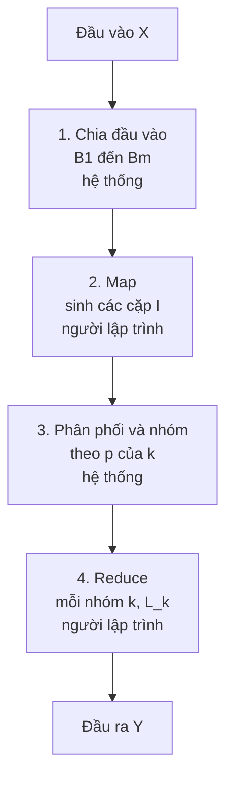
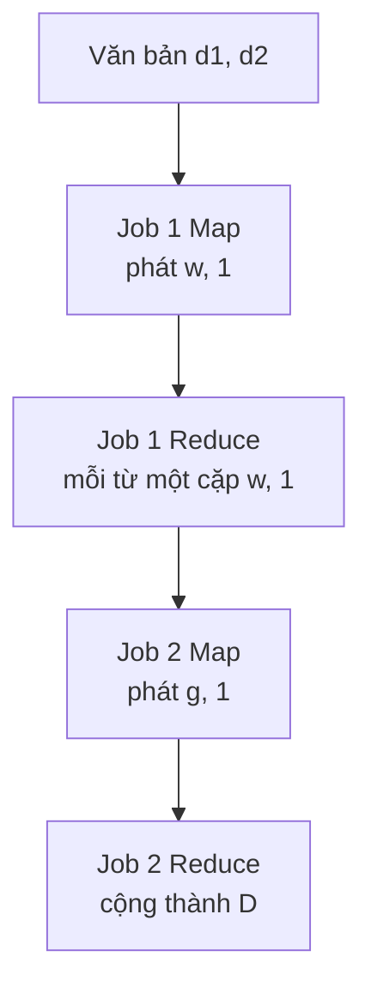
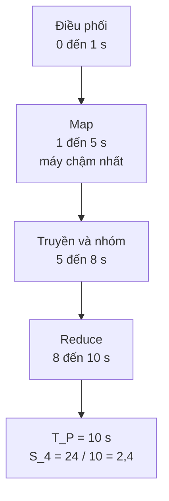
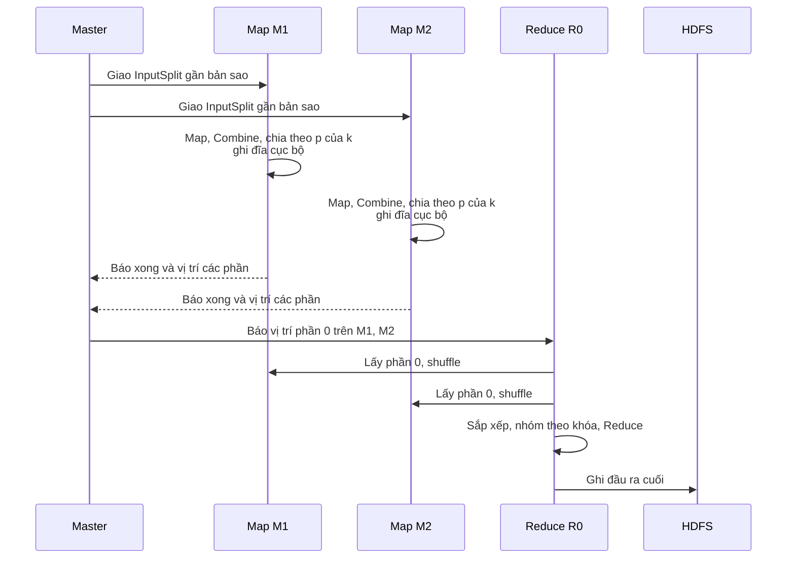

> *"Đừng mang núi đến với thợ. Hãy đưa thợ đến chân núi — rồi chỉ gửi về những viên đá quý."*

← [Bài trước](/giai-thuat-du-lieu/bai-giang/bai-01-bai-toan-du-lieu-lon-va-mo-hinh-thuat-toan.md) · [Mục lục](/giai-thuat-du-lieu/index.md) · [Bài tiếp theo →](/giai-thuat-du-lieu/bai-giang/bai-03-pagerank-mo-hinh-va-tinh-toan.md)

::: info Bài này giải quyết vấn đề gì?
Năm 2004 Google công bố chỉ mục hơn **8 tỷ trang**. Nghiên cứu Sawzall (2005) xử lý mẫu **450 GB nhật ký nén**. Lần thu thập năm 1998 có **24 triệu trang với hơn 259 triệu liên kết**. Không máy nào giữ nổi chừng ấy, và dữ liệu vốn đã nằm rải trên nhiều máy.

Map-Reduce là **mô hình lập trình** cho phép bạn chỉ viết hai hàm nhỏ — **Map** và **Reduce** — còn hệ thống lo phần khó: Chia dữ liệu, giao việc cho máy, chuyển dữ liệu theo khóa, phát hiện máy hỏng và chạy lại. Trong Khoa học dữ liệu, đây là nền móng cho mọi phép tổng hợp quy mô lớn: Đếm từ, xây chỉ mục, nhân ma trận, PageRank (Bài 03), và là tiền thân của Spark.
:::

**Nguồn đối chiếu:** Slide Bài 02 của học phần, MMDS Chương 2 (mục 2.1.1–2.1.2, 2.2.1–2.2.6, 2.3.1, 2.5.1–2.5.2, bài tập 2.3.1), Dean & Ghemawat, *MapReduce*, OSDI 2004 và tài liệu Apache Hadoop 3.4.2.

**Bố cục bài:** (1) Giới thiệu → (2) Mô hình Map-Reduce → (3) Các ví dụ → (4) Chi phí và lợi ích song song hóa → (5) Hệ thống thực thi *(đọc thêm)* → (6) Thực hành Hadoop → (7) Bài tập MMDS.

---

## Minh họa tương tác

<CodeIllustration type="mapreduce" />

## 1. Giới thiệu: Dữ liệu lớn trên nhiều máy

### 1.1. Bốn yêu cầu của một mô hình tính toán phân tán

| # | Yêu cầu | Ý nghĩa |
|---|---|---|
| 1 | Dữ liệu nằm trên nhiều máy | Chương trình phải xử lý các phần dữ liệu ở những nơi khác nhau |
| 2 | Song song hóa | Nhiều máy cùng làm các phần việc độc lập để rút ngắn thời gian |
| 3 | Đưa tính toán đến gần dữ liệu | Ưu tiên chạy tại máy đang lưu dữ liệu để giảm truyền mạng |
| 4 | Điều phối và phục hồi "trong suốt" | Lập trình viên mô tả phép tính, hệ thống lo chia việc, lập lịch, chống lỗi |

"Trong suốt" **không** có nghĩa máy không hỏng, mà là hệ thống phát hiện lỗi và chạy lại tác vụ khi có thể. Song song hóa nhằm giảm thời gian, **không** hứa tăng tốc tuyến tính.

### 1.2. Ví dụ khởi động: Cộng một dãy số trên ba máy

::: tip Ẩn dụ: Kiểm kê kho của chuỗi siêu thị
Ban giám đốc muốn biết tổng số chai nước trong cả chuỗi. Thay vì chở hàng của mọi chi nhánh về trụ sở để đếm, mỗi chi nhánh **tự đếm kho của mình** rồi chỉ gửi về **một con số**. Trụ sở cộng các con số lại. Cách làm này đúng vì phép cộng không quan tâm ai đếm trước, đếm theo nhóm nào.
:::

Tính $S = a_1 + \cdots + a_6$ trên ba máy, mỗi máy giữ hai số:

$$
s_1 = a_1 + a_4,\quad s_2 = a_2 + a_5,\quad s_3 = a_3 + a_6,\qquad S = s_1 + s_2 + s_3
$$

Cách làm đúng nhờ hai tính chất của phép cộng:

- **Giao hoán**: Đổi thứ tự các số, $x + y = y + x$.
- **Kết hợp**: Đổi cách nhóm, $(x + y) + z = x + (y + z)$.

**Khái quát.** Mọi toán tử $\oplus : D \times D \to D$ **đóng** trên cùng miền, **giao hoán** và **kết hợp** (ví dụ $+$, $\max$, $\min$, hợp tập hợp) đều cho phép "tính cục bộ rồi gộp" mà kết quả không phụ thuộc thứ tự hay cách nhóm.

::: warning Số thực dấu phẩy động
Trên máy tính, phép cộng số `float` **không** kết hợp tuyệt đối do làm tròn: Đổi cách nhóm có thể cho kết quả khác ở các chữ số cuối. Các lập luận trong bài giả sử **số học chính xác**.
:::

### 1.3. Lưu trữ phân tán HDFS

Hệ thống tệp phân tán Hadoop (HDFS) chia tệp thành **khối** và lưu **nhiều bản sao** của mỗi khối trên các máy khác nhau, thường trải trên nhiều **rack** (tủ máy) nối với nhau qua bộ chuyển mạch.

- **Cục bộ hóa:** bộ lập lịch ưu tiên máy có khối → cùng rack → rack khác.
- **Chịu lỗi:** mất một máy (hoặc một rack) vẫn còn bản sao ở nơi khác. NameNode chỉ đạo sao chép lại để bù bản sao thiếu.

::: danger Bản sao không phải dữ liệu mới
Khối A có 3 bản sao **không** có nghĩa dữ liệu của A được cộng 3 lần. Bản sao thuộc về **lưu trữ** (độ bền, vị trí đọc). Tính toán chỉ xử lý mỗi khối logic **đúng một lần**.
:::

---

## 2. Mô hình tính toán Map-Reduce

### 2.1. Bài toán xuyên suốt: Đếm tần suất từ

**Đặc tả.** Cho $n \ge 1$ văn bản $d_1, \ldots, d_n$ đã tách từ theo cùng một quy tắc, $d_i = (w_{i1}, \ldots, w_{im_i})$. Gọi $V$ là tập các từ xuất hiện. Với mỗi $w \in V$:

$$
c_i(w) = \bigl\lvert \lbrace j \in \lbrace 1, \ldots, m_i \rbrace : W_{ij} = w \rbrace \bigr\rvert, \qquad c(w) = \sum_{i=1}^{n} c_i(w)
$$

$c_i(w)$ đếm số lần từ $w$ xuất hiện trong văn bản thứ $i$. $c(w)$ cộng kết quả qua mọi văn bản. Viết đầy đủ, $c(w)=c_1(w)+c_2(w)+\cdots+c_n(w)$. Trong $\sum_{i=1}^n$, chỉ số $i$ chạy qua các văn bản, không chạy qua các từ bên trong một văn bản. Còn dấu $|\{\cdots\}|$ đếm số vị trí $j$ thỏa điều kiện. Các lần xuất hiện lặp của một từ đều được đếm.

Đầu ra: Mỗi $w \in V$ có **đúng một** cặp $(w, c(w))$.

| Ký hiệu | Ý nghĩa |
|---|---|
| $d_i$ | Văn bản thứ $i$, là một **dãy** từ (giữ lặp) |
| $m_i$ | Số từ trong văn bản $d_i$ |
| $V$ | Tập các từ xuất hiện trong toàn kho |
| $c_i(w)$ | Số lần từ $w$ xuất hiện trong $d_i$ |
| $c(w)$ | Tổng số lần xuất hiện của $w$ trong toàn kho |

"Tần suất" ở đây là **số lần xuất hiện**, không chia cho tổng số từ, và **không phải** số văn bản chứa từ.

### 2.2. Ba bước: Map, nhóm theo khóa, Reduce

::: tip Ẩn dụ: Bưu điện phân loại thư
Mỗi **nhân viên nhận thư** (Map) đọc từng lá thư và dán nhãn mã bưu chính lên đó — họ không cần biết thư sẽ đi đâu tiếp. **Trung tâm phân loại** (hệ thống) gom mọi thư cùng mã bưu chính vào cùng một bao, gửi đến đúng bưu cục. **Bưu cục địa phương** (Reduce) mở bao của mình và xử lý từng mã một. Nhân viên chỉ cần biết "dán nhãn gì" và "xử lý bao thế nào". Mọi khâu vận chuyển đã có hệ thống lo.
:::

```text
Map(d_i):
  với mỗi lần từ w xuất hiện trong d_i:
      phát(w, 1)

Reduce(w, L_w):
  c = 0
  với mỗi giá trị v trong L_w:
      c = c + v
  phát(w, c)
```

- **Khóa** = từ. **Giá trị** $1$ = một lần xuất hiện.
- Một từ xuất hiện $m$ lần trong cùng văn bản → Map phát **$m$ cặp** $(w, 1)$, không gộp trước.
- Hệ thống gom **mọi** giá trị của cùng từ $w$ (từ mọi tác vụ Map) vào danh sách $L_w$.
- Từ không xuất hiện thì không có nhóm, Reduce **không được gọi** cho từ đó.

### 2.3. Dry-run 1: Đếm từ trên hai văn bản

$d_1$ = "mèo chó mèo", $d_2$ = "chó chim".

| Pha | Đầu vào | Đầu ra |
|---|---|---|
| Map trên $d_1$ | "mèo chó mèo" | (mèo,1), (chó,1), (mèo,1) |
| Map trên $d_2$ | "chó chim" | (chó,1), (chim,1) |
| Nhóm theo khóa | 5 cặp trung gian | mèo: [1,1] · chó: [1,1] · chim: [1] |
| Reduce mèo | (mèo, [1,1]) | (mèo, 2) |
| Reduce chó | (chó, [1,1]) | (chó, 2) |
| Reduce chim | (chim, [1]) | (chim, 1) |
| Kiểm tra | 5 lần xuất hiện đầu vào | $2 + 2 + 1 = 5$  |

Phân biệt: "Mèo" xuất hiện **2 lần** nhưng chỉ trong **1 văn bản**. "chó" xuất hiện 2 lần trong 2 văn bản.

### 2.4. Hình thức hóa

**Hàm Map** biến một cặp đầu vào thành một **dãy** cặp trung gian:

$$
\mathrm{Map} : K_1 \times V_1 \longrightarrow (K_2 \times V_2)^*
$$

**Hàm Reduce** nhận một khóa và danh sách giá trị, trả một dãy cặp đầu ra:

$$
\mathrm{Reduce} : K_2 \times V_2^* \longrightarrow (K_3 \times V_3)^*
$$

**Nhóm theo khóa.** Gọi $I$ là dãy mọi cặp trung gian (giữ lặp). Với mỗi khóa $k$:

$$
L_k = [\, v \mid (k', v) \in I,\ k' = k \,]
$$

**Hàm phân phối.** Với $r \ge 1$ tác vụ Reduce, $p : K_2 \to \lbrace 0, \ldots, r-1 \rbrace$ gán mỗi khóa cho một tác vụ, thường có dạng $p(k) = h(k) \bmod r$ với $h$ là hàm băm.

| Ký hiệu | Ý nghĩa |
|---|---|
| $K_1, V_1$ | Miền khóa, giá trị **đầu vào** (ví dụ: Mã văn bản, nội dung) |
| $K_2, V_2$ | Miền khóa, giá trị **trung gian** (ví dụ: Từ, số 1) |
| $K_3, V_3$ | Miền khóa, giá trị **đầu ra**, có thể khác $K_2, V_2$ |
| $A^*$ | Các **dãy** hữu hạn phần tử của $A$, gồm dãy rỗng, **giữ lặp** |
| $I$ | Dãy toàn bộ cặp trung gian (mô tả logic, không bắt buộc lưu một chỗ) |
| $L_k$ | Danh sách giá trị đi cùng khóa $k$ |
| $m, r$ | Số tác vụ Map, số tác vụ Reduce |
| $p$ | Hàm phân phối khóa → tác vụ Reduce |

::: warning Dãy, không phải tập
Ký hiệu $(K_2 \times V_2)^*$ là **dãy**. Nếu dùng tập hợp, hai cặp (mèo,1) giống hệt nhau sẽ bị gộp làm một và số đếm sai.
:::

**Các quy tắc cần giữ:**

- **Cùng khóa → cùng tác vụ Reduce.** Khác khóa **có thể** cùng tác vụ, nhưng vẫn là **hai nhóm riêng**, Reduce được gọi riêng cho từng khóa.
- **Reduce không được phụ thuộc thứ tự** giá trị trong $L_k$, vì hệ thống không cam kết thứ tự.
- Phân biệt **hàm** với **tác vụ**: Một tác vụ Map gọi hàm Map nhiều lần (mỗi văn bản một lần). Một tác vụ Reduce thực hiện nhiều "reducer" (mỗi khóa một lần).

### 2.5. Các pha của một công việc



Bốn pha này là **pha logic**: Trong cài đặt thật, việc chuyển dữ liệu có thể bắt đầu khi một số Map khác còn chạy. Reduce cho mỗi khóa chỉ chốt kết quả khi đã nhận đủ dữ liệu của khóa đó.

**Giả mã hình thức của một công việc** (theo slide):

```text
khởi tạo O_0, ..., O_{r−1} là các dãy rỗng
chia X thành B_1, ..., B_m theo vị trí bản ghi
song song với j = 1, ..., m:
  I_j ← gom_giữ_lặp(Map(k,v) với mỗi (k,v) trong B_j)
I ← gom_giữ_lặp(I_1, ..., I_m)
song song với t = 0, ..., r−1:
  với mỗi khóa phân biệt k xuất hiện trong I và p(k) = t:
    L_k ← danh sách các v đi cùng k trong I
    ghi mọi cặp Reduce(k, L_k) vào O_t
trả về Y = gom_giữ_lặp(O_0, ..., O_{r−1})
```

Trường hợp biên: $X$ rỗng → $I$ rỗng → không có khóa → $Y$ rỗng. Giả thiết: Map và Reduce **xác định** và **kết thúc**. Reduce độc lập với thứ tự giá trị. Mỗi vị trí bản ghi đóng góp đúng một lần — các lần chạy lại hay tác vụ dự phòng **không** được tính thêm.

### 2.6. Hàm Combine: Gộp cục bộ trước khi gửi

::: tip Ẩn dụ: Đóng gói trước khi gửi bưu điện
Thay vì gửi 100 phong bì, mỗi phong bì ghi "mèo: 1", nhân viên gộp thành **một** phong bì ghi "mèo: 100". Bưu cục cuối vẫn cộng ra đúng tổng — nhưng xe tải chở ít hơn hẳn.
:::

**Combine** chạy ở phía Map, gộp các giá trị **cùng khóa trong dữ liệu cục bộ** của một tác vụ Map, trước khi truyền qua mạng.

**Điều kiện đủ để Combine giữ nguyên kết quả** (với các phép gộp trong bài):

1. Phép gộp **đóng** trên kiểu giá trị trung gian (đầu vào và đầu ra Combine cùng kiểu).
2. Phép gộp **kết hợp** và **giao hoán**.
3. **Giữ nguyên khóa**.
4. Tương thích với Reduce cuối: Thay một nhóm bằng trạng thái đã gộp không làm đổi kết quả Reduce.

Khi đó kết quả **không đổi** dù hệ thống bỏ qua Combine, gộp một phần hay gộp nhiều lần. Combine là **tối ưu tùy chọn**, không phải một pha bắt buộc.

**Dry-run 2: Đếm từ có Combine** (giao $d_1$ cho Map 1, $d_2$ cho Map 2)

| Tác vụ | Map phát | Sau Combine | Số cặp gửi đi |
|---|---|---|---|
| Map 1 ($d_1$) | (mèo,1), (chó,1), (mèo,1) | (mèo,2), (chó,1) | 2 |
| Map 2 ($d_2$) | (chó,1), (chim,1) | (chó,1), (chim,1) | 2 |
| Tổng | 5 cặp | 4 cặp | $5 \to  4$ |
| Reduce | — | chó nhận [1, 1] → (chó, 2) | mèo: $[2] \to  2$, chim: $[1] \to  1$ |

Hai cặp "chó" vẫn phải gặp nhau tại Reduce, vì chúng nằm ở **hai tác vụ Map khác nhau** và chưa được cộng chung.

::: danger Trung bình KHÔNG dùng được làm Combine trực tiếp
Trung bình không có tính kết hợp khi các nhóm có kích thước khác nhau. Ví dụ dãy $2, 4, 9$: Trung bình của nhóm $[2,4]$ là $3$, của $[9]$ là $9$. Trung bình của hai trung bình là $6$, nhưng trung bình đúng của cả dãy là $5$. Cách đúng: Giữ trạng thái **(tổng, số lượng)**, chỉ chia ở Reduce cuối (mục 3.3).
:::

---

## 3. Các ví dụ Map-Reduce

Ba ví dụ cho thấy ba kiểu "giá trị" khác nhau: **Tích phần tử**, **dấu hiệu hiện diện**, và **cặp trạng thái**.

### 3.1. Nhân ma trận – véc tơ

**Đặc tả.** $A \in \mathbb{R}^{p \times q}$, $v \in \mathbb{R}^{q}$. Tính $y = Av \in \mathbb{R}^p$:

$$
y_i = \sum_{j=1}^{q} a_{ij} v_j, \qquad 1 \le i \le p
$$

Dữ liệu logic: $pq$ bản ghi $(i, j, a_{ij})$, **kể cả phần tử 0**. Giả thiết: $v$ **vừa bộ nhớ** mỗi tác vụ Map (trường hợp không vừa là mục 2.3.2 MMDS, ngoài phạm vi bài này).

::: tip Ẩn dụ: Tính lương theo phòng ban
Mỗi bản ghi chấm công $(i, j, a_{ij})$ nói "nhân viên thuộc phòng $i$ làm $a_{ij}$ giờ ở loại việc $j$", còn $v_j$ là đơn giá loại việc $j$ (bảng giá dán ở mọi chi nhánh). Mỗi chi nhánh nhân giờ với đơn giá rồi gửi kết quả **theo phòng ban $i$**. Tổng lương của phòng $i$ chính là $y_i$. Khóa phải là **phòng ban**, vì ta muốn tổng theo phòng.
:::

**Ứng dụng: Điểm tương đồng trang web – truy vấn.** Hàng của $A$ là trang web, cột là từ, phần tử là trọng số của từ trong trang. $v$ là trọng số của từ trong truy vấn. Nếu mỗi hàng và $v$ đều được chuẩn hóa về độ dài Euclid 1, thì $y_i$ là **cosine** giữa trang $i$ và truy vấn.

**Các hàm:**

```text
Map(B):                       # B là một khối ma trận, v đã có trong bộ nhớ
  với mỗi bản ghi (i, j, a_ij) trong B:
    yield(i, a_ij * v[j])

Combine(i, L): yield(i, sum(L))
Reduce(i, L):  yield(i, sum(L))
```

Khóa là hàng $i$. Giá trị là tích $a_{ij} v_j$ hoặc tổng bộ phận các tích.

**Dry-run 3: Ma trận $4 \times 4$ chia thành bốn khối $2 \times 2$**

$$
A = \left[\begin{array}{cc|cc} 1 & 2 & 0 & 1 \\ 0 & 1 & 2 & 0 \\ \hline 2 & 0 & 1 & 1 \\ 1 & 1 & 0 & 2 \end{array}\right], \qquad v = \begin{bmatrix} 1 \\ 2 \\ 3 \\ 4 \end{bmatrix}
$$

$B_{11}$: Hàng 1–2, cột 1–2. $B_{12}$: Hàng 1–2, cột 3–4. $B_{21}$: Hàng 3–4, cột 1–2. $B_{22}$: Hàng 3–4, cột 3–4. Chỉ số $(i,j)$ là **chỉ số toàn cục**.

| Khối | Các tích được tính | Map yield | Combine yield |
|---|---|---|---|
| $B_{11}$ | $1\cdot1,\ 2\cdot2,\ 0\cdot1,\ 1\cdot2$ | (1,1), (1,4), (2,0), (2,2) | (1,5), (2,2) |
| $B_{12}$ | $0\cdot3,\ 1\cdot4,\ 2\cdot3,\ 0\cdot4$ | (1,0), (1,4), (2,6), (2,0) | (1,4), (2,6) |
| $B_{21}$ | $2\cdot1,\ 0\cdot2,\ 1\cdot1,\ 1\cdot2$ | (3,2), (3,0), (4,1), (4,2) | (3,2), (4,3) |
| $B_{22}$ | $1\cdot3,\ 1\cdot4,\ 0\cdot3,\ 2\cdot4$ | (3,3), (3,4), (4,0), (4,8) | (3,7), (4,8) |

| Khóa (hàng) | $L_i$ sau nhóm | Reduce | Kiểm tra trực tiếp |
|---|---|---|---|
| 1 | [5, 4] | (1, 9) | $1 + 4 + 0 + 4 = 9$  |
| 2 | [2, 6] | (2, 8) | $0 + 2 + 6 + 0 = 8$  |
| 3 | [2, 7] | (3, 9) | $2 + 0 + 3 + 4 = 9$  |
| 4 | [3, 8] | (4, 11) | $1 + 2 + 0 + 8 = 11$  |

Kết quả: $y = (9, 8, 9, 11)^T$. Mỗi hàng nhận đóng góp từ **hai** khối. Khóa $i$ giúp gom đủ. Lưu ý $A$ ở đây **chưa chuẩn hóa**, nên $9, 8, 9, 11$ không phải điểm cosine.

**Tính đúng.** (1) Mỗi tọa độ thuộc đúng một khối logic, Map yield mỗi tích đúng một lần. (2) Khóa $i$ gom đúng $q$ tích của hàng $i$ (giữ cả tích 0). (3) Combine bảo toàn tổng nhờ phép cộng kết hợp, giao hoán. Vậy Reduce trả đúng $y_i$ cho mọi $i$.

**Tại sao khóa là hàng $i$ chứ không phải cột $j$?** Vì $y_i$ là tổng **theo hàng**: Các tích cùng hàng phải về chung một khóa để được cộng. Cột $j$ không ứng với thành phần nào của kết quả.

### 3.2. Đếm số từ phân biệt (MMDS bài 2.3.1(d), chuyển sang từ)

**Đặc tả.** Gọi $W_i$ là **tập** các từ trong $d_i$. Đầu ra:

$$
D = \left\lvert \bigcup_{i=1}^{n} W_i \right\rvert, \qquad D = 0 \text{ nếu mọi văn bản rỗng}
$$

**Ứng dụng:** $D$ là số chiều (số cột) của ma trận trang–từ ở mục 3.1 khi dùng toàn bộ từ vựng.

::: tip Ẩn dụ: Điểm danh lớp học
Để đếm **số học sinh khác nhau** đã đến thư viện trong tuần, bạn không cộng số lượt mỗi ngày (một bạn đến 5 ngày sẽ bị đếm 5 lần). Bước 1: Lập danh sách tên, mỗi tên ghi **một lần**. Bước 2: Đếm số dòng của danh sách.
:::

**Vì sao khó?** Cộng số từ phân biệt của từng văn bản sẽ **đếm trùng**: $d_1$ có 2 loại (mèo, chó), $d_2$ có 2 loại (chó, chim), cộng ra $4$, nhưng đúng là $3$ — "chó" bị đếm hai lần.

**Phương án hai công việc:**

| Hàm | Công việc 1: Loại trùng | Công việc 2: Đếm |
|---|---|---|
| Map | Mỗi lần từ $w$ xuất hiện → phát $(w, 1)$ | Nhận $(w, 1)$ → phát $(g, 1)$ |
| Combine | Nhận $(w, L)$ → phát **một** cặp $(w, 1)$ | Nhận $(g, L)$ → phát $(g, \sum L)$ |
| Reduce | Nhận $(w, L)$ → phát **một** cặp $(w, 1)$ | Nhận $(g, L)$ → phát $(g, \sum L)$ |

$g$ là **nhãn cố định** (khóa chung) để gom toàn bộ số đếm về một chỗ, không phải một từ. Nếu Công việc 1 không có đầu ra, chương trình điều phối trả $D = 0$ (không gọi Reduce với nhóm rỗng).



**Dry-run 4:**

| Bước | Dữ liệu |
|---|---|
| Job 1 – Map | $d_1$: (Mèo,1), (chó,1), (mèo,1) · $d_2$: (Chó,1), (chim,1) |
| Job 1 – Combine | $d_1$: (Mèo,1), (chó,1) · $d_2$: (Chó,1), (chim,1) |
| Job 1 – Reduce | mèo [1] → (mèo,1) · chó [1,1] → (chó,1) · chim [1] → (chim,1) |
| Job 2 – Map | (g,1), (g,1), (g,1) |
| Job 2 – Reduce | g [1,1,1] → (g, 3) |

Kết luận: $D = 3$ loại từ, trong khi có 5 lần xuất hiện.

**Tính đúng.** Đầu ra Job 1 tương ứng một–một với các từ phân biệt. Cụ thể, mỗi từ có mặt sinh ít nhất một cặp Map, rồi Reduce thay cả nhóm bằng đúng một cặp. Từ vắng mặt không sinh cặp nào. Vì vậy, Job 2 đếm số cặp đó sẽ cho đúng $D$. Combine 1 giữ sự hiện diện của từ, còn Combine 2 giữ tổng số lượng.

### 3.3. Trung bình cộng (MMDS bài 2.3.1(b))

**Đặc tả.** Dãy $a_1, \ldots, a_n \in \mathbb{R}$, $n \ge 1$:

$$
\mu = \frac{1}{n} \sum_{i=1}^{n} a_i
$$

Hai phần tử bằng nhau vẫn là hai đóng góp. Trung bình của dãy rỗng **không xác định**.

**Ứng dụng:** số từ trung bình mỗi trang. Với "mèo chó mèo" (3 từ) và "chó chim" (2 từ): $\mu = (3+2)/2 = 2{,}5$ từ/trang. Trang rỗng vẫn là một trang và đóng góp $(0, 1)$. Bỏ nó sẽ làm sai mẫu số.

::: tip Ẩn dụ: Điểm trung bình toàn khối
Lớp A có 40 học sinh, trung bình 8. Lớp B có 10 học sinh, trung bình 6. Trung bình toàn khối **không phải** $(8+6)/2 = 7$, mà là $(40 \cdot 8 + 10 \cdot 6)/50 = 7{,}6$. Mỗi lớp phải báo cáo **tổng điểm và sĩ số**, không chỉ báo điểm trung bình.
:::

**Các hàm** (với $g$ là khóa chung, $L$ là danh sách trạng thái $(s, c)$, $S = \sum s$, $C = \sum c$):

| Hàm | Đầu vào → cặp phát ra | Kiểu giá trị |
|---|---|---|
| Map | $a_i \longrightarrow (g, (a_i, 1))$ | cặp (tổng, số lượng) |
| Combine | $(g, L) \longrightarrow (g, (S, C))$ | cặp (tổng, số lượng) |
| Reduce | $(g, L) \longrightarrow (g, S/C)$ | một số |

**Dry-run 5:** Map 1 nhận $[2, 4]$, Map 2 nhận $[9]$.

| Bước | Dữ liệu | Trạng thái |
|---|---|---|
| Map 1 | phát $(g,(2,1))$, $(g,(4,1))$ | — |
| Combine 1 | cộng từng thành phần | $(g,(6,2))$ |
| Map 2 | phát $(g,(9,1))$ | — |
| Combine 2 | chỉ một cặp | $(g,(9,1))$ |
| Reduce | $L = [(6,2),(9,1)]$, $S = 15$, $C = 3$ | phát $(g, 5)$ |

$\mu = \frac{15}{3} = 5$. Nếu chia ở Combine, ta được trung bình của $3$ và $9$ là $6$ — **sai**.

**Tính đúng (quy nạp).** Bất biến: Mỗi trạng thái $(s, c)$ là đúng tổng và đúng số phần tử của **một nhóm vị trí rời nhau**. Cơ sở: Map phát $(a_i, 1)$. Bước gộp: Gộp hai nhóm rời nhau bằng cộng từng thành phần giữ bất biến. Cuối cùng $S = \sum a_i$, $C = n > 0$, nên $S/C = \mu$.

---

## 4. Chi phí và lợi ích của song song hóa

Ba đại lượng chính, **khác đơn vị**, không cộng với nhau:

| Ký hiệu | Đo cái gì | Đơn vị |
|---|---|---|
| $W$ | Tổng công việc (số phép toán) | phép toán |
| $T_P$ | Thời gian hoàn thành trên $P$ máy | giây |
| $V$ | Lượng dữ liệu qua đường truyền đang xét | byte |
| $C$ | Tổng kích thước đầu vào mọi tác vụ (quy ước MMDS) | byte, MB |

Trong phần này $P$ là **số máy**. Đừng nhầm với $p$ là số hàng ma trận.

### 4.1. Tổng công việc không giảm khi chia máy

Cộng $n$ số chia đều cho $P$ máy (khởi tạo tổng bằng phần tử đầu, nên nhóm $k$ phần tử tốn $k-1$ phép cộng):

$$
W_P = \underbrace{P\left(\frac{n}{P} - 1\right)}_{\text{cộng cục bộ}} + \underbrace{(P - 1)}_{\text{gộp}} = n - 1
$$

Với $n = 16$, $P = 4$: $4 \times 3 + 3 = 15$, đúng bằng khi cộng trên một máy. **Song song hóa không giảm tổng việc. Nó chia việc ra để giảm thời gian chờ.**

### 4.2. Thời gian của một pha = máy chậm nhất

::: tip Ẩn dụ: Đoàn leo núi
Cả đoàn chỉ "đến đỉnh" khi **người cuối cùng** lên tới nơi. Thời gian của pha là thời gian của máy về đích muộn nhất, **không** phải tổng thời gian mọi máy.
:::

Gọi $t_m$ là tổng thời gian các tác vụ giao cho máy $m$:

$$
T_{\text{pha}} = \max_m t_m
$$

Ví dụ slide: Máy 1 chạy A, B (mỗi tác vụ 2 s), máy 2 chạy C, D (mỗi tác vụ 3 s), máy 3 chạy E (3 s). $T_{\text{pha}} = \max(4, 6, 3) = 6$ s.

### 4.3. Thời gian cộng nhiều số trên nhiều máy

Với $\tau > 0$ là thời gian một phép cộng, một tác vụ Reduce gộp tuần tự:

$$
T_P = \left(\frac{n}{P} - 1\right)\tau + (P - 1)\tau
$$

**Dry-run 6: Chọn số máy cho $n = 16$**

| $P$ | Map: $(n/P - 1)\tau$ | Reduce: $(P-1)\tau$ | $T_P$ | Tổng việc $W_P$ |
|---|---|---|---|---|
| 1 | $15\tau$ | $0$ | $15\tau$ | 15 |
| 2 | $7\tau$ | $1\tau$ | $8\tau$ | 15 |
| 4 | $3\tau$ | $3\tau$ | $6\tau$ | 15 |
| 8 | $1\tau$ | $7\tau$ | $8\tau$ | 15 |
| 16 | $0$ | $15\tau$ | $15\tau$ | 15 |

Thêm máy giảm phần Map nhưng **tăng** phần gộp tuần tự. Từ công thức, $T_P$ nhỏ nhất khi $n/P + P$ nhỏ nhất, tức $P = \sqrt{n}$ (đạo hàm $-n/P^2 + 1 = 0$). Với $n = 16$, tối ưu là $P = 4$. Nhận xét này suy ra từ mô hình gộp tuần tự của slide. Gộp theo cây sẽ cho lịch khác.

### 4.4. Chi phí đầu vào và chi phí khởi tạo tác vụ (MMDS 2.5.1)

**Quy ước MMDS:** chi phí một tác vụ là **kích thước đầu vào** của nó. Chi phí thuật toán là tổng trên mọi tác vụ.

$$
C = I + H
$$

| Ký hiệu | Ý nghĩa |
|---|---|
| $I$ | Tổng kích thước dữ liệu gốc các tác vụ Map đọc (tính cả đọc cục bộ) |
| $H$ | Tổng kích thước dữ liệu trung gian các tác vụ Reduce nhận |

Ví dụ: $I = 100$ MB, $H = 40$ MB → $C = 140$ MB. **Đầu ra cuối không được cộng** vào $C$ theo quy ước này. Combine nằm trong Map nên làm giảm $H$, giữ nguyên $I$.

::: warning Quy ước khác
Một số slide (Stanford CS246) đếm tổng đọc/ghi thành $I + 2H + O$. Đó là quy ước khác. Trong bài thi theo học phần này dùng $C = I + H$ của MMDS 2.5.1, trừ khi đề nói khác.
:::

### 4.5. Thời gian truyền: Mô hình độ trễ – băng thông

$$
T_{\text{truyền}} \approx \lambda + \frac{V}{B}
$$

| Ký hiệu | Ý nghĩa |
|---|---|
| $\lambda$ | Độ trễ khởi đầu (giây), trước khi dữ liệu bắt đầu tới |
| $V$ | Lượng dữ liệu cần truyền (MB) |
| $B$ | Băng thông (MB/s), quy ước 1 MB = $10^6$ byte, phân biệt MB và Mb |

Ví dụ: $V = 100$ MB, $B = 50$ MB/s, $\lambda = 0{,}02$ s → $T \approx 2{,}02$ s.

**Băng thông dùng chung.** Nếu 4 máy mỗi máy gửi 100 MB qua **cùng một đường nối** 100 MB/s sang rack khác thì $V = 400$ MB và

$$
T \ge \frac{V}{B} = \frac{400}{100} = 4 \text{ s}
$$

Đây là **cận dưới**: 100 MB/s là băng thông của cả đường nối, không phải của mỗi máy. Đưa tính toán đến gần dữ liệu giúp giảm số byte phải đi qua đường nối này.

### 4.6. Combine giảm lượng truyền nhưng tăng việc ở Map

Giả thiết mỗi cặp 16 byte, mọi cặp qua đường truyền đúng một lần:

| Phương án | Số cặp truyền | $V$ |
|---|---|---|
| Không Combine | 5 | $5 \times 16 = 80$ byte |
| Có Combine | 4 | $4 \times 16 = 64$ byte (giảm 20%) |

Giảm 20% **lượng truyền**, nhưng Map phải cộng thêm. Muốn biết Combine có giúp **nhanh hơn** hay không, phải tính thời gian toàn công việc.

### 4.7. Thời gian toàn công việc và mức tăng tốc

Với các pha nối tiếp, không chồng lấp, không lỗi:

$$
T_P = T_{\text{điều phối}} + T_{\text{Map}} + T_{\text{truyền và nhóm}} + T_{\text{Reduce}}
$$

$$
S_P = \frac{T_1}{T_P}
$$

Ví dụ slide ($P = 4$): $T_P = 1 + 4 + 3 + 2 = 10$ s. $T_1 = 24$ s → $S_4 = 2{,}4$. Có lợi về thời gian khi $T_P < T_1$. So sánh phải cùng đầu vào, cùng đầu ra, cùng phạm vi đo.



### 4.8. Dry-run 7: Câu hỏi kiểm tra của slide

Dữ kiện: $P = 3$. Điều phối 1 s. Tải Map mỗi máy $2 s / 3 s / 5 s$. $V = 120$ MB. $B = 40$ MB/s. Reduce 2 s. $T_1 = 22$ s. Bỏ độ trễ và chi phí nhóm.

| Bước | Tính | Kết quả |
|---|---|---|
| $T_{\text{Map}}$ | $\max(2, 3, 5)$ | 5 s |
| $T_{\text{truyền}}$ | $120 / 40$ | 3 s |
| $T_P$ | $1 + 5 + 3 + 2$ | 11 s |
| $S_P$ | $22 / 11$ | 2 |
| Có Combine: $T'_{\text{Map}}$ | $5 + 1$ | 6 s |
| Có Combine: $T'_{\text{truyền}}$ | $40 / 40$ | 1 s |
| $T'_P$ | $1 + 6 + 1 + 2$ | 10 s (tiết kiệm 1 s) |
| $S'_P$ | $22 / 10$ | 2,2 |

Lợi ích ròng của Combine: Bớt 2 s truyền, thêm 1 s Map. Sai lầm hay gặp: **Cộng** tải ba máy ($2+3+5 = 10$) để tính $T_{\text{Map}}$, hoặc quên pha điều phối.

---

## 5. Hệ thống thực thi Map-Reduce *(đọc thêm)*

Phần này giải thích **cơ chế** tạo ra các chi phí ở mục 4. Slide đánh dấu là đọc thêm, không tiên quyết.



| Cơ chế | Điểm cần nhớ |
|---|---|
| InputSplit | Đơn vị **chia việc** cho Map, khối HDFS là đơn vị **lưu trữ**, hai thứ có thể khác nhau |
| Cục bộ hóa | Ưu tiên máy có bản sao → cùng rack → rack khác, là ưu tiên, không bảo đảm |
| Phân phối | Mỗi Map chia đầu ra thành $r$ phần theo $p(k)$, lưu trên **đĩa cục bộ** |
| Shuffle | Mỗi Reduce lấy phần của mình **trực tiếp** từ các máy Map, không qua Master |
| Sắp và nhóm | Hệ thống sắp, ghép, Reduce đọc lần lượt từng nhóm, không cần giữ cả nhóm trong RAM |
| Master | Theo dõi trạng thái chờ / đang chạy / hoàn tất, mất liên lạc quá hạn coi là lỗi |

**Phục hồi lỗi phụ thuộc nơi lưu dữ liệu:**

| Dữ liệu | Nơi lưu | Khi mất máy lưu |
|---|---|---|
| Đầu vào | HDFS có bản sao | Đọc bản sao khác |
| Đầu ra Map trung gian | Đĩa cục bộ | **Chạy lại Map** để tạo lại (kể cả Map đã "xong") |
| Đầu ra Reduce đã hoàn tất | HDFS | Giữ nguyên, không cần chạy lại |

- Máy chạy **Map** hỏng trước khi Reduce lấy xong dữ liệu → Map đó phải chạy lại trên máy khác, Master báo vị trí mới cho Reduce.
- Máy chạy **Reduce** hỏng giữa chừng → chỉ chạy lại Reduce đó, lấy lại các phần trung gian. Map không phải chạy lại nếu đầu ra của chúng còn.
- **Master hỏng** (trong mô hình MMDS) → cả công việc phải khởi động lại.
- Một tác vụ có thể có **nhiều lần thực thi** (chạy lại sau lỗi, hoặc bản dự phòng khi chạy quá chậm). Hệ thống chỉ chấp nhận **một** kết quả cho mỗi tác vụ logic, không cộng hai bản.

---

## 6. Thực hành Hadoop với Docker Compose

Cụm 6 container Docker trên một máy: **NameNode**, **2 DataNode** (HDFS, replication 2), **ResourceManager**, **2 NodeManager** (YARN). Container Docker là tiến trình cô lập trên host. Container YARN là đơn vị tài nguyên NodeManager cấp cho ApplicationMaster, Map hoặc Reduce.

**Khởi động và kiểm tra:**

```bash
cd hadoop-compose
docker compose pull
docker compose up -d
docker compose ps
docker compose exec namenode hdfs dfsadmin -report   # cần 2 DataNode "Live"
docker compose exec namenode yarn node -list         # cần 2 NodeManager "RUNNING"
```

Web UI: HDFS tại `http://127.0.0.1:19870`, YARN tại `http://127.0.0.1:18088`.

**mapper.py** (Hadoop Streaming đưa từng dòng qua stdin):

```python
import sys

# Mỗi từ phân cách bởi khoảng trắng đóng góp một lần xuất hiện.
for line in sys.stdin:
    for word in line.split():
        print(f"{word}\t1")
```

**reducer.py** (Hadoop đưa các dòng cùng khóa **liền nhau**. Dùng được làm cả combiner):

```python
import sys
from itertools import groupby

# Hadoop đưa các dòng cùng khóa liền nhau; đọc nhóm lần lượt.
pairs = (line.rstrip("\n").split("\t", 1) for line in sys.stdin)
for word, group in groupby(pairs, key=lambda pair: pair[0]):
    total = sum(int(value) for _, value in group)
    print(f"{word}\t{total}")
```

**Nộp công việc:**

```bash
docker compose exec -T namenode bash /work/run-job.sh
```

Script dùng các tham số Streaming: `-files /work/mapper.py,/work/reducer.py`, `-mapper 'python3 mapper.py'`, `-combiner 'python3 reducer.py'`, `-reducer 'python3 reducer.py'`, 2 Reduce, minsplit 128 MiB (mỗi tệp nhỏ thành một Map).

**Kết quả và bộ đếm của lần chạy kiểm thử:**

```text
chim	1
chó	2
mèo	2
```

| Bộ đếm | Giá trị | Ý nghĩa |
|---|---|---|
| Map input records | 2 | hai dòng văn bản |
| Map output records | 5 | 5 cặp (từ, 1) |
| Combine output records | 4 | hai cặp "mèo" của $d_1$ đã gộp |
| Reduce output records | 3 | ba từ phân biệt |

Với 2 Reduce, output có hai tệp `part-*`. Lần chạy mẫu có một tệp chứa cả ba khóa và một tệp **rỗng** — hàm băm mặc định không bảo đảm cân bằng tải. Số lần Combine chạy không cố định giữa các lần nộp job. Bộ đếm đo **số cặp**, không đo thời gian.

**Câu hỏi kiểm tra của slide:** (1) Xóa Combiner, kết quả không đổi vì phép cộng kết hợp và giao hoán. (2) Replication 2 không làm tổng thành 10: Bản sao là lưu trữ, mỗi từ vẫn chỉ được một Map xử lý một lần. (3) Bằng chứng job đúng: Trạng thái `SUCCEEDED` trên YARN, bộ đếm hợp lệ, và `part-*` cho đúng chim 1, chó 2, mèo 2 — `docker compose ps` chỉ cho biết container đang chạy.

---

## 7. Bài tập MMDS 2.3.1 có lời giải

### 7.1. Số nguyên lớn nhất — bài 2.3.1(a)

| Hàm | Đặc tả |
|---|---|
| Map | Trên khối $B_j$: Quét, giữ $b_j = \max B_j$, phát $(*, b_j)$ |
| Combine | $(*, L) \to (*, \max L)$ |
| Reduce | $(*, L) \to \max L$ |

**Tính đúng:** bất biến khi quét — biến đang giữ bằng max của tiền tố đã đọc. Mỗi phần tử thuộc đúng một khối, nên max toàn tệp bằng max của các max khối. $\max$ kết hợp, giao hoán nên Combine an toàn. Chi phí quét $\Theta(n)$. Map phát $m$ cặp. **Biên:** tệp rỗng không có max — báo không có giá trị, **không** trả 0 (dữ liệu có thể toàn số âm).

### 7.2. Trung bình cộng — bài 2.3.1(b)

Map trên $B_j$ phát $(*, (s_j, c_j))$. Combine cộng từng thành phần. Reduce trả $S/C$. Bất biến: Mỗi trạng thái là tổng và số phần tử của đúng phần dữ liệu nó đại diện. **Biên:** tệp rỗng → $C = 0$, trung bình không xác định, không chia cho 0.

### 7.3. Số giá trị phân biệt — bài 2.3.1(d)

Hai vòng như mục 3.2: Job 1 phát $(x, 1)$, Reduce thay mỗi nhóm bằng một cặp $(x, 1)$. Job 2 đổi thành $(*, 1)$ rồi cộng. Job 1 tạo tối đa $n$ cặp trung gian và $D$ cặp đầu ra. Job 2 tạo tối đa $D$ cặp. Combine **không** bảo đảm chỉ còn $O(D)$ cặp toàn cục, vì cùng giá trị có thể ở nhiều Map. Một Reduce giữ toàn bộ tập giá trị cũng đúng nhưng cần bộ nhớ $\Theta(D)$. **Biên:** đầu vào rỗng → $D = 0$, do chương trình điều phối trả.

---

## 8. Code minh họa: Mô phỏng Map-Reduce bằng Python

Chương trình dưới đây là một **máy Map-Reduce thu nhỏ** chạy trong một tiến trình: Chia đầu vào, Map, Combine, phân phối theo băm, nhóm, Reduce — đúng như giả mã hình thức ở mục 2.5. Nó chạy lại toàn bộ năm dry-run của bài và kiểm tra bằng NumPy.

```python
"""
Bài 02 - Mô phỏng mô hình Map-Reduce
Chạy: python bai02.py
"""
from collections import defaultdict
from fractions import Fraction
from zlib import crc32

import numpy as np


# ---------------------------------------------------------------
# 1. Máy Map-Reduce thu nhỏ (một tiến trình, mô phỏng m Map, r Reduce)
# ---------------------------------------------------------------
def phan_phoi(khoa, r):
    """Hàm phân phối p(k) = h(k) mod r; crc32 cho kết quả ổn định giữa các lần chạy."""
    return crc32(repr(khoa).encode("utf-8")) % r


def chay_job(cac_phan, ham_map, ham_reduce, ham_combine=None, r=2, ghi_vet=False):
    """
    cac_phan    : danh sách các phần đầu vào B_1..B_m (mỗi phần là danh sách bản ghi)
    ham_map     : bản ghi -> danh sách cặp (k, v)
    ham_combine : (k, L) -> danh sách cặp (k, v'), cùng kiểu giá trị trung gian
    ham_reduce  : (k, L) -> danh sách cặp đầu ra
    """
    # Pha 2: mỗi tác vụ Map xử lý một phần, có thể Combine cục bộ
    bo_dem = {"map_out": 0, "combine_out": 0}
    vung_reduce = [defaultdict(list) for _ in range(r)]       # r "ổ đĩa" của Reduce
    for j, phan in enumerate(cac_phan, start=1):
        cap = [c for ban_ghi in phan for c in ham_map(ban_ghi)]  # giữ lặp: dãy, không phải tập
        bo_dem["map_out"] += len(cap)
        if ham_combine is not None:
            nhom_cuc_bo = defaultdict(list)
            for k, v in cap:
                nhom_cuc_bo[k].append(v)
            cap = [c for k, L in nhom_cuc_bo.items() for c in ham_combine(k, L)]
        bo_dem["combine_out"] += len(cap)
        if ghi_vet:
            print(f"  Map {j}: gửi {cap}")
        # Pha 3: phân phối theo p(k) và nhóm theo khóa
        for k, v in cap:
            vung_reduce[phan_phoi(k, r)][k].append(v)
    # Pha 4: mỗi tác vụ Reduce gọi hàm Reduce cho từng khóa (nhóm riêng)
    dau_ra = []
    for t in range(r):
        for k in sorted(vung_reduce[t], key=repr):
            dau_ra.extend(ham_reduce(k, vung_reduce[t][k]))
    if ghi_vet:
        print(f"  Bộ đếm: {bo_dem}")
    return dau_ra


# ---------------------------------------------------------------
# 2. Đếm từ
# ---------------------------------------------------------------
def map_dem_tu(van_ban):
    return [(w, 1) for w in van_ban.split()]


def cong_theo_khoa(k, L):
    return [(k, sum(L))]


# ---------------------------------------------------------------
# 3. Nhân ma trận - véc tơ, Map nhận cả một khối
# ---------------------------------------------------------------
def tao_khoi(A, kich_thuoc=2):
    """Chia A thành các khối vuông; mỗi khối là danh sách bản ghi (i, j, a_ij), chỉ số từ 1."""
    p, q = A.shape
    khoi = []
    for r0 in range(0, p, kich_thuoc):
        for c0 in range(0, q, kich_thuoc):
            khoi.append([[(i + 1, j + 1, int(A[i, j]))
                          for i in range(r0, min(r0 + kich_thuoc, p))
                          for j in range(c0, min(c0 + kich_thuoc, q))]])
    return khoi


def lam_map_ma_tran(v):
    def ham_map(B):                      # B là một khối; v có sẵn trong bộ nhớ
        return [(i, a * v[j - 1]) for (i, j, a) in B]
    return ham_map


# ---------------------------------------------------------------
# 4. Đếm từ phân biệt: hai công việc
# ---------------------------------------------------------------
def mot_cap_moi_khoa(k, L):
    return [(k, 1)]                      # giữ sự hiện diện, không giữ số lần


def map_sang_khoa_chung(cap):
    return [("g", 1)]


# ---------------------------------------------------------------
# 5. Trung bình cộng với trạng thái (tổng, số lượng)
# ---------------------------------------------------------------
def map_trung_binh(a):
    return [("g", (Fraction(a), 1))]


def combine_trung_binh(k, L):
    return [(k, (sum(s for s, _ in L), sum(c for _, c in L)))]   # chưa chia!


def reduce_trung_binh(k, L):
    S = sum(s for s, _ in L)
    C = sum(c for _, c in L)
    return [(k, S / C)]


# ---------------------------------------------------------------
# 6. Mô hình chi phí
# ---------------------------------------------------------------
def thoi_gian_cong(n, P, tau=1):
    """T_P = (n/P - 1) tau + (P - 1) tau, một Reduce gộp tuần tự."""
    return (n // P - 1) * tau + (P - 1) * tau


if __name__ == "__main__":
    kho = [["mèo chó mèo"], ["chó chim"]]          # Map 1 nhận d1, Map 2 nhận d2

    print("Dry-run 1: đếm từ không Combine")
    print(" ", sorted(chay_job(kho, map_dem_tu, cong_theo_khoa, ghi_vet=True)))

    print("Dry-run 2: đếm từ có Combine")
    print(" ", sorted(chay_job(kho, map_dem_tu, cong_theo_khoa, cong_theo_khoa, ghi_vet=True)))

    print("Dry-run 3: nhân ma trận - véc tơ")
    A = np.array([[1, 2, 0, 1], [0, 1, 2, 0], [2, 0, 1, 1], [1, 1, 0, 2]])
    v = np.array([1, 2, 3, 4])
    y = dict(chay_job(tao_khoi(A), lam_map_ma_tran(v), cong_theo_khoa, cong_theo_khoa, r=2))
    y_mr = np.array([y[i] for i in range(1, A.shape[0] + 1)])
    print("  Map-Reduce:", y_mr, "| NumPy A @ v:", A @ v, "| khớp:", np.array_equal(y_mr, A @ v))

    print("Dry-run 4: đếm từ phân biệt")
    job1 = chay_job(kho, map_dem_tu, mot_cap_moi_khoa, mot_cap_moi_khoa)
    job2 = chay_job([job1], map_sang_khoa_chung, cong_theo_khoa, cong_theo_khoa, r=1)
    D = job2[0][1] if job2 else 0                  # điều phối trả 0 khi không có từ
    print("  Job 1:", sorted(job1), "| D =", D)

    print("Dry-run 5: trung bình cộng")
    kq = chay_job([[2, 4], [9]], map_trung_binh, reduce_trung_binh, combine_trung_binh, r=1)
    print("  mu =", kq[0][1])

    print("Dry-run 6: thời gian cộng 16 số")
    for P in (1, 2, 4, 8, 16):
        print(f"  P = {P:2d}: T_P = {thoi_gian_cong(16, P)} tau")

    print("Dry-run 7: câu hỏi kiểm tra")
    T_P = 1 + max(2, 3, 5) + 120 / 40 + 2
    T_Pc = 1 + (max(2, 3, 5) + 1) + 40 / 40 + 2
    print(f"  T_P = {T_P} s, S_P = {22 / T_P}; có Combine: T'_P = {T_Pc} s, S'_P = {22 / T_Pc}")
```

**Kết quả mong đợi:**

```text
Dry-run 1: đếm từ không Combine
  Map 1: gửi [('mèo', 1), ('chó', 1), ('mèo', 1)]
  Map 2: gửi [('chó', 1), ('chim', 1)]
  Bộ đếm: {'map_out': 5, 'combine_out': 5}
  [('chim', 1), ('chó', 2), ('mèo', 2)]
Dry-run 2: đếm từ có Combine
  Map 1: gửi [('mèo', 2), ('chó', 1)]
  Map 2: gửi [('chó', 1), ('chim', 1)]
  Bộ đếm: {'map_out': 5, 'combine_out': 4}
  [('chim', 1), ('chó', 2), ('mèo', 2)]
Dry-run 3: nhân ma trận - véc tơ
  Map-Reduce: [ 9  8  9 11] | NumPy A @ v: [ 9  8  9 11] | khớp: True
Dry-run 4: đếm từ phân biệt
  Job 1: [('chim', 1), ('chó', 1), ('mèo', 1)] | D = 3
Dry-run 5: trung bình cộng
  mu = 5
Dry-run 6: thời gian cộng 16 số
  P =  1: T_P = 15 tau
  P =  2: T_P = 8 tau
  P =  4: T_P = 6 tau
  P =  8: T_P = 8 tau
  P = 16: T_P = 15 tau
Dry-run 7: câu hỏi kiểm tra
  T_P = 11.0 s, S_P = 2.0; có Combine: T'_P = 10.0 s, S'_P = 2.2
```

---

## 9. Tổng kết

::: danger Bẫy thi & Ngộ nhận kinh điển
1. **Đầu ra Map là tập hợp:** sai, là **dãy** giữ lặp. Dùng tập sẽ mất các cặp (mèo,1) trùng và đếm sai.
2. **Đếm "tần suất" bằng số văn bản chứa từ:** sai, phải đếm **số lần xuất hiện**.
3. **Khóa ma trận–véc tơ là cột $j$:** sai, phải là hàng $i$ vì $y_i$ là tổng theo hàng.
4. **Cộng số từ phân biệt của từng văn bản:** đếm trùng ($2 + 2 = 4$ thay vì $3$). Phải loại trùng toàn cục trước.
5. **Dùng Reduce của bài trung bình làm Combine:** Reduce phát $S/C$ (một số) nên không gộp tiếp được. Combine phải giữ cặp $(s, c)$.
6. **"Trung bình của trung bình":** chỉ đúng khi các nhóm có cùng kích thước.
7. **Combine là bắt buộc / luôn chạy đúng một lần:** sai. Hệ thống có thể không chạy hoặc chạy nhiều lần. Kết quả phải không đổi trong mọi trường hợp.
8. **Combine luôn làm chạy nhanh hơn:** chưa chắc. Nó giảm $V$ nhưng tăng việc ở Map. Khóa không lặp thì không giảm gì.
9. **$T_{\text{Map}}$ = tổng tải các máy:** sai, là **max** (máy chậm nhất).
10. **Tăng số máy luôn giảm thời gian:** sai. Phần gộp tuần tự, truyền mạng, điều phối, tải lệch có thể làm $T_P$ tăng (xem bảng $n = 16$).
11. **Tổng công việc giảm khi song song:** sai, $W_P = n - 1$ không đổi.
12. **Cộng đầu ra cuối vào $C$:** theo MMDS 2.5.1, $C = I + H$, không tính đầu ra cuối.
13. **100 MB/s là băng thông mỗi máy:** khi đường nối dùng chung, 4 máy gửi tổng 400 MB cần ít nhất 4 s.
14. **Replication làm tăng số đếm:** sai. Bản sao là lưu trữ. Mỗi khối logic xử lý đúng một lần.
15. **Reduce đã xong phải chạy lại khi Map hỏng:** không. Map đã xong phải chạy lại nếu đầu ra cục bộ mất **và** còn Reduce chưa lấy. Reduce đã ghi lên HDFS được giữ.
16. **Trả 0 cho max hoặc trung bình của tệp rỗng:** sai. Max không xác định, trung bình chia cho 0. Chỉ "số giá trị phân biệt" mới có $D = 0$.
17. **Reduce phụ thuộc thứ tự giá trị trong $L_k$:** hệ thống không cam kết thứ tự.
:::

### Bảng công thức ghi nhớ nhanh

| Khái niệm | Công thức / Từ khóa |
|---|---|
| Hàm Map | $K_1 \times V_1 \to (K_2 \times V_2)^*$ |
| Hàm Reduce | $K_2 \times V_2^* \to (K_3 \times V_3)^*$ |
| Nhóm theo khóa | $L_k = [\, v \mid (k', v) \in I,\ k' = k \,]$ |
| Hàm phân phối | $p(k) = h(k) \bmod r$, cùng khóa → cùng Reduce |
| Đếm từ | $c(w) = \sum_i c_i(w)$, Map phát $(w,1)$, Reduce cộng |
| Ma trận–véc tơ | $y_i = \sum_j a_{ij} v_j$, khóa $i$, giá trị $a_{ij} v_j$ |
| Phân biệt | $D = \lvert \bigcup_i W_i \rvert$, hai job: Loại trùng rồi đếm |
| Trung bình | trạng thái $(s, c)$, chia $S/C$ chỉ ở Reduce cuối |
| Điều kiện Combine | đóng, kết hợp, giao hoán, giữ khóa, tương thích Reduce |
| Tổng công việc | $W_P = n - 1$ (cộng $n$ số) |
| Thời gian một pha | $T_{\text{pha}} = \max_m t_m$ |
| Cộng $n$ số trên $P$ máy | $T_P = (n/P - 1)\tau + (P-1)\tau$, tối ưu gần $P = \sqrt{n}$ |
| Chi phí MMDS | $C = I + H$ |
| Thời gian truyền | $T \approx \lambda + V/B$, dùng chung: $T \ge V/B$ |
| Toàn công việc | $$
T_P = T_{\text{điều phối}} + T_{\text{Map}} + T_{\text{truyền}} + T_{\text{Reduce}}
$$ |
| Mức tăng tốc | $S_P = T_1 / T_P$ |
| Từ khóa | khóa–giá trị, shuffle, combiner, InputSplit, cục bộ hóa, replication, Master, chạy lại, bản dự phòng |

← [Bài trước](/giai-thuat-du-lieu/bai-giang/bai-01-bai-toan-du-lieu-lon-va-mo-hinh-thuat-toan.md) · [Mục lục](/giai-thuat-du-lieu/index.md) · [Bài tiếp theo →](/giai-thuat-du-lieu/bai-giang/bai-03-pagerank-mo-hinh-va-tinh-toan.md)
