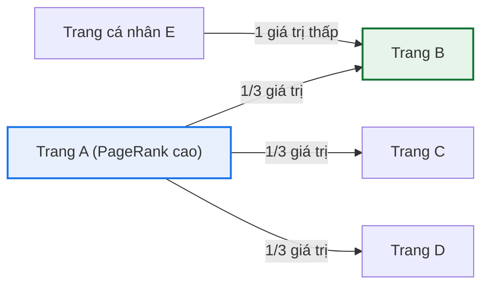
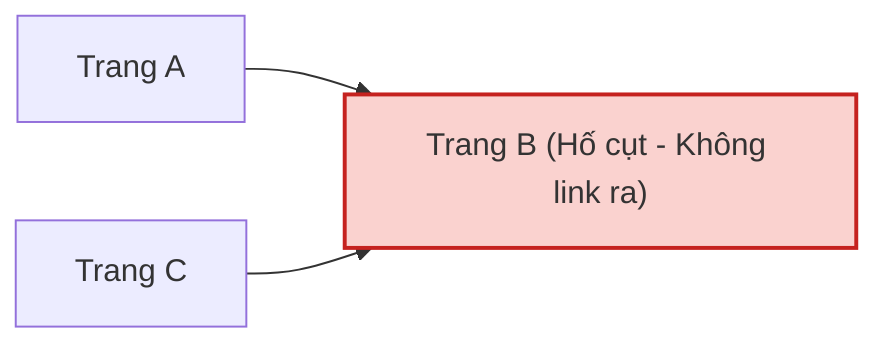
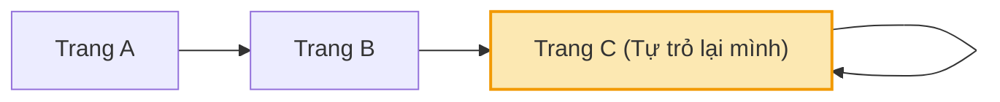
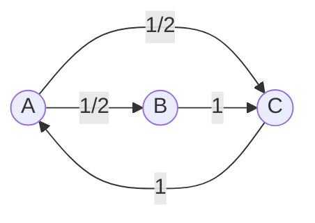

> *"Một trang web quan trọng không phải vì nó tự nhận mình quan trọng, mà vì nó được các trang quan trọng khác trỏ liên kết đến."*  
> — **Larry Page & Sergey Brin (1998)**

← [Bài 02: Map-Reduce](/giai-thuat-du-lieu/bai-giang/bai-02-mapreduce-va-xu-ly-du-lieu-lon.md) · [Mục lục](/giai-thuat-du-lieu/index.md)

::: info Bài này giải quyết vấn đề gì?
Khi World Wide Web bùng nổ vào cuối thập niên 1990 với hàng tỷ trang tài liệu, các công cụ tìm kiếm dựa trên văn bản thuần túy (Inverted Index, tần suất từ khoá TF-IDF) hoàn toàn thất bại trước nạn **spam từ khóa** (nhồi nhét từ ẩn màu trắng trên nền trắng để lừa máy tìm kiếm).

Larry Page và Sergey Brin nhận ra rằng: **cấu trúc liên kết siêu văn bản (hyperlink)** giữa các trang web chính là một hệ thống bình chọn khổng lồ có trọng số. Bài học này trình bày:
- **Mô hình toán học:** Biểu diễn Web dưới dạng đồ thị có hướng và Chuỗi Markov (Markov Chain).
- **Thuật toán Power Iteration:** Tính toán vector riêng trạng thái dừng trên đồ thị hàng tỷ đỉnh.
- **Hai cạm bẫy thực tế:** Xử lý triệt để hiện tượng **Dead Ends** (hố cụt) và **Spider Traps** (bẫy nhện) bằng cơ chế **Teleportation** với hệ số suy giảm $\beta$.
- **Cài đặt quy mô lớn:** Kiến trúc tính toán lặp ma trận thưa thớt trên hạ tầng phân tán MapReduce.
:::

**Nguồn đối chiếu:** MMDS (Leskovec–Rajaraman–Ullman) Chương 5: *Link Analysis* (mục 5.1–5.3); Bài báo gốc: *The Anatomy of a Large-Scale Hypertextual Web Search Engine* (Page & Brin, 1998).

---

## 1. Trực giác: Cấu trúc liên kết như một cuộc bỏ phiếu dân chủ có trọng số

Hãy tưởng tượng bạn tìm kiếm từ khóa *"đại học"*:
- Trang chủ của một trường đại học lớn có thể chỉ xuất hiện từ "đại học" vài lần.
- Trong khi một kẻ spam tạo một trang cá nhân lặp lại từ "đại học" 10.000 lần.

Nếu chỉ đếm từ khóa, trang spam sẽ thắng. Để giải quyết điều này, ta khai thác cấu trúc đồ thị:
1. Mỗi **hyperlink** từ trang $j$ trỏ tới trang $i$ ($j \to i$) được xem là một **lá phiếu tín nhiệm** của $j$ dành cho $i$.
2. Không phải lá phiếu nào cũng có giá trị như nhau: Lá phiếu từ một trang uy tín (như `wikipedia.org` hay `stanford.edu`) có trọng lượng lớn hơn gấp vạn lần lá phiếu từ một blog vô danh mới tạo.
3. Nếu một trang uy tín $j$ trỏ tới quá nhiều liên kết (out-degree $d_j$ lớn), giá trị của từng lá phiếu bị chia đều: Mỗi trang con chỉ nhận được $\frac{1}{d_j}$ độ uy tín của $j$.



---

## 2. Mô hình toán học: Người lướt Web ngẫu nhiên (Random Surfer)

### 2.1. Chuỗi Markov trên đồ thị Web

Giả sử mạng Web gồm $N$ trang $\{1, 2, \dots, N\}$. Một người lướt web ngẫu nhiên (Random Surfer) bắt đầu tại một trang bất kỳ. Tại mỗi bước:
- Nếu đang ở trang $j$, người này chọn ngẫu nhiên một trong $d_j$ liên kết ra ngoài của $j$ với xác suất bằng nhau là $\frac{1}{d_j}$ để đi tới trang tiếp theo.

Gọi $r_i$ là xác suất dài hạn (long-term probability) người lướt web dừng chân tại trang $i$. Theo nguyên lý dòng chảy bảo toàn xác suất:
$$r_i = \sum_{j \to i} \frac{r_j}{d_j}$$

### 2.2. Ma trận chuyển tiếp Markov (Stochastic Matrix) $M$

Ta định nghĩa ma trận $M$ kích thước $N \times N$, trong đó phần tử $M_{ij}$ tại hàng $i$, cột $j$ biểu diễn xác suất chuyển từ trang $j$ sang trang $i$:
$$M_{ij} = \begin{cases} \frac{1}{d_j} & \text{nếu có liên kết } j \to i \\ 0 & \text{ngược lại} \end{cases}$$

::: tip Lưu ý quan trọng về quy ước chỉ số
Cột $j$ của ma trận $M$ tổng bằng 1 (cột ngẫu nhiên - column stochastic). Lưu ý rằng $M_{ij}$ là dòng từ $j$ tới $i$ (hàng là đích đến, cột là điểm xuất phát).
:::

Khi đó, hệ phương trình xác suất được viết gọn dưới dạng ma trận:
$$\mathbf{r} = M \mathbf{r}$$

Về mặt đại số tuyến tính: Vector điểm PageRank $\mathbf{r}$ chính là **vector riêng (eigenvector)** của ma trận $M$ ứng với **trị riêng $\lambda = 1$** (Perron-Frobenius Theorem).

---

## 3. Thuật toán Lặp lũy thừa (Power Iteration)

Vì mạng Web có hàng tỷ đỉnh, ta không thể tìm vector riêng bằng phép khử Gauss ($O(N^3)$). Thay vào đó, ta dùng thuật toán lặp số học **Power Iteration**:

1. **Khởi tạo:** Gán điểm khởi đầu đều nhau cho mọi trang:
   $$\mathbf{r}^{(0)} = \left[ \frac{1}{N}, \frac{1}{N}, \dots, \frac{1}{N} \right]^T$$
2. **Vòng lặp:** Tại bước $t+1$, nhân ma trận với vector của bước $t$:
   $$\mathbf{r}^{(t+1)} = M \mathbf{r}^{(t)}$$
3. **Điều kiện dừng:** Lặp cho đến khi khoảng cách giữa hai bước đủ nhỏ:
   $$\sum_{i=1}^N \left| r_i^{(t+1)} - r_i^{(t)} \right| < \epsilon \quad (\text{thường chọn } \epsilon = 10^{-6})$$

Trên thực tế đồ thị Web, chỉ sau khoảng **30 đến 50 vòng lặp**, vector $\mathbf{r}$ đã hội tụ với độ chính xác rất cao!

---

## 4. Hai cạm bẫy thực tế: Dead Ends & Spider Traps

Mô hình lý thuyết trên chỉ hội tụ hoàn hảo khi đồ thị Web là **liên thông mạnh (strongly connected)** và **không có chu kỳ (aperiodic)**. Tuy nhiên, Web thực tế có cấu trúc rất lộn xộn, dẫn tới 2 lỗi nghiêm trọng:

### 4.1. Dead Ends (Hố cụt)
- **Hiện tượng:** Trang web không có bất kỳ liên kết ra ngoài nào ($d_j = 0$). Cột tương ứng trong $M$ toàn số 0.
- **Hậu quả:** Khi người lướt web đến đây, họ không có đường đi tiếp. Điểm PageRank bị "rò rỉ" ra ngoài vũ trụ, sau mỗi vòng lặp tổng $\sum r_i$ giảm dần và cuối cùng **toàn bộ vector $\mathbf{r} \to \mathbf{0}$**.



### 4.2. Spider Traps (Bẫy nhện)
- **Hiện tượng:** Một trang hoặc một cụm trang chỉ có liên kết trỏ lẫn nhau hoặc tự trỏ về chính nó, không có liên kết nào thoát ra ngoài.
- **Hậu quả:** Người lướt web đi vào và bị kẹt vĩnh viễn bên trong. Qua các vòng lặp, toàn bộ điểm PageRank của toàn bộ mạng Internet bị cụm này hút cạn ($r_{\text{trap}} \to 1$, tất cả các trang còn lại về $0$).



---

## 5. Giải pháp của Google: Damping Factor & Random Teleport

Để khắc phục đồng thời cả Spider Traps và Dead Ends, Brin và Page đề xuất cơ chế **Dịch chuyển tức thời ngẫu nhiên (Random Teleportation)**:

Tại mỗi bước, người lướt Web quyết định:
1. Với xác suất $\beta$ (thường chọn $\beta = 0.85$): Tiếp tục bấm theo một liên kết ngẫu nhiên trên trang hiện tại.
2. Với xác suất $1 - \beta$ (tương đương $15\%$): Nhàm chán và quyết định **nhảy tức thời** đến một trang web bất kỳ ngẫu nhiên trên toàn bộ Internet!

### Công thức PageRank hoàn chỉnh:

$$\mathbf{r} = \beta M \mathbf{r} + \frac{1 - \beta}{N} \mathbf{1}$$

Trong đó:
- $\beta \in (0, 1)$ gọi là **Hệ số suy giảm (Damping Factor)**.
- $\mathbf{1}$ là vector toàn số 1 kích thước $N \times 1$.
- Đại lượng $\frac{1 - \beta}{N}$ đóng vai trò là "mức thuế" tối thiểu chia đều cho mọi trang, đảm bảo không trang nào bị về 0 điểm và không bẫy nào có thể hút cạn điểm của mạng.

::: tip Xử lý Dead Ends trong công thức
Nếu gặp một trang hố cụt $j$ (cột trong $M$ toàn số 0), ta quy ước người dùng tại $j$ sẽ tự động teleport tới mọi trang với xác suất $\frac{1}{N}$.
:::

---

## 6. Ví dụ tính toán chi tiết từng bước bằng số

Xét một mạng Web nhỏ gồm 3 trang: **A, B, C** với các liên kết:
- $A \to B, A \to C$ (A có 2 link ra: $d_A = 2$)
- $B \to C$ (B có 1 link ra: $d_B = 1$)
- $C \to A$ (C có 1 link ra: $d_C = 1$)



### Bước 1: Thiết lập ma trận chuyển tiếp $M$

Hàng 1 là đích A, Hàng 2 là B, Hàng 3 là C:
$$M = \begin{bmatrix}
0 & 0 & 1 \\
1/2 & 0 & 0 \\
1/2 & 1 & 0
\end{bmatrix}$$

### Bước 2: Tính toán Power Iteration với $\beta = 0.85, N = 3$

Số hạng teleport cố định: $\frac{1 - \beta}{N} = \frac{0.15}{3} = 0.05$.

- **Khởi tạo ($t = 0$):**
  $$\mathbf{r}^{(0)} = \begin{bmatrix} 1/3 \\ 1/3 \\ 1/3 \end{bmatrix} \approx \begin{bmatrix} 0.3333 \\ 0.3333 \\ 0.3333 \end{bmatrix}$$

- **Vòng lặp 1 ($t = 1$):**
  $$M \mathbf{r}^{(0)} = \begin{bmatrix} 0 & 0 & 1 \\ 0.5 & 0 & 0 \\ 0.5 & 1 & 0 \end{bmatrix} \begin{bmatrix} 0.3333 \\ 0.3333 \\ 0.3333 \end{bmatrix} = \begin{bmatrix} 0.3333 \\ 0.1667 \\ 0.5000 \end{bmatrix}$$
  $$\mathbf{r}^{(1)} = 0.85 \times \begin{bmatrix} 0.3333 \\ 0.1667 \\ 0.5000 \end{bmatrix} + \begin{bmatrix} 0.05 \\ 0.05 \\ 0.05 \end{bmatrix} = \begin{bmatrix} 0.3333 \\ 0.1917 \\ 0.4750 \end{bmatrix}$$

- **Vòng lặp 2 ($t = 2$):**
  $$M \mathbf{r}^{(1)} = \begin{bmatrix} 0.4750 \\ 0.1667 \\ 0.3583 \end{bmatrix} \implies \mathbf{r}^{(2)} = 0.85 \times \begin{bmatrix} 0.4750 \\ 0.1667 \\ 0.3583 \end{bmatrix} + \begin{bmatrix} 0.05 \\ 0.05 \\ 0.05 \end{bmatrix} = \begin{bmatrix} 0.4538 \\ 0.1917 \\ 0.3546 \end{bmatrix}$$

Sau khoảng 20 vòng lặp, nghiệm hội tụ về giá trị dừng:
$$\mathbf{r}^* \approx \begin{bmatrix} 0.3877 \\ 0.2148 \\ 0.3975 \end{bmatrix}$$

**Kết luận xếp hạng:** Trang **C** đứng đầu ($39.75\%$), kế tiếp là trang **A** ($38.77\%$), và cuối cùng là trang **B** ($21.48\%$). Điều này hoàn toàn khớp với trực quan: Trang C nhận được liên kết từ cả A và B!

---

## 7. Cài đặt PageRank trên MapReduce cho Dữ liệu lớn

Khi $N = 100$ tỷ trang Web, ma trận $M$ chứa $10^{22}$ phần tử — không một siêu máy tính nào có thể lưu trực tiếp ma trận này trong RAM. Tuy nhiên, ma trận $M$ cực kỳ **thưa (sparse)** vì mỗi trang trung bình chỉ có khoảng 10–50 liên kết ra ngoài.

### Kiến trúc tính toán MapReduce cho mỗi vòng lặp:

1. **Dữ liệu đầu vào:** Mỗi bản ghi gồm: `(Trang nguồn u, Điểm r_u hiện tại, Danh sách liên kết ra [v_1, v_2, ..., v_k])`
2. **Hàm Map:**
   - Với mỗi trang đích $v_i$ trong danh sách: Phát ra cặp `(v_i, r_u / k)`.
   - Đồng thời phát lại cấu trúc đồ thị `(u, [v_1, ..., v_k])` để dùng cho vòng lặp tiếp theo.
3. **Hàm Reduce:**
   - Nhận khóa là trang đích $v$ và danh sách các phần đóng góp từ các trang trỏ tới nó.
   - Cộng dồn: $S_v = \sum \text{contributions}$.
   - Áp dụng hệ số suy giảm: $r_v^{\text{mới}} = \beta \cdot S_v + \frac{1 - \beta}{N}$.
   - Ghi ra đĩa kết quả của vòng lặp này để làm đầu vào cho vòng lặp kế tiếp.

---

## 8. Mã nguồn Python thực nghiệm (Vectorized NumPy)

```python
import numpy as np

def compute_pagerank(M, beta=0.85, epsilon=1e-6, max_iter=100):
    """
    Tính vector điểm PageRank bằng thuật toán Power Iteration.
    
    Tham số:
        M: Ma trận chuyển tiếp Markov (N x N), column-stochastic
        beta: Hệ số suy giảm Damping Factor (mặc định 0.85)
        epsilon: Ngưỡng dừng sai số L1
    """
    N = M.shape[0]
    # Khởi tạo vector điểm đều nhau
    r = np.ones(N) / N
    teleport = (1.0 - beta) / N
    
    for iteration in range(1, max_iter + 1):
        r_new = beta * M.dot(r) + teleport
        
        # Kiểm tra độ lệch chuẩn L1
        diff = np.sum(np.abs(r_new - r))
        print(f"Vòng lặp {iteration:02d}: Điểm = {np.round(r_new, 4)}, Độ lệch = {diff:.6f}")
        
        r = r_new
        if diff < epsilon:
            print(f"--> Thuật toán hội tụ sau {iteration} vòng lặp!")
            break
            
    return r

# Khai báo đồ thị 3 đỉnh từ Ví dụ mục 6
M = np.array([
    [0.0, 0.0, 1.0],
    [0.5, 0.0, 0.0],
    [0.5, 1.0, 0.0]
])

scores = compute_pagerank(M)
print("\nKết quả PageRank cuối cùng:")
for idx, page in enumerate(['A', 'B', 'C']):
    print(f"Trang {page}: {scores[idx]:.4f} ({scores[idx]*100:.2f}%)")
```

---

## 9. Câu hỏi tự kiểm tra & Thảo luận

::: tip Câu hỏi ôn tập
1. **Tại sao $\beta$ thường được chọn bằng 0.85 mà không phải 1.0 hay 0.5?**  
   *Gợi ý:* Nếu $\beta = 1.0$, ta đối mặt nguy cơ Spider Trap và Dead End. Nếu $\beta$ quá nhỏ (ví dụ 0.1), thành phần ngẫu nhiên át đi cấu trúc liên kết thực tế. Giá trị 0.85 là điểm cân bằng lý tưởng được kiểm chứng qua thực nghiệm của Google.
2. **Nếu một trang cố tình tạo ra 1.000 trang con rác tự trỏ về nó, nó có thể tăng PageRank lên vô hạn không?**  
   *Gợi ý:* Hãy xem xét định luật bảo toàn dòng PageRank và thành phần "đánh thuế" $\beta$. Đây là cơ sở của thuật toán chống spam liên kết **TrustRank** (Bài 04).
:::

---

← [Bài 02: Map-Reduce](/giai-thuat-du-lieu/bai-giang/bai-02-mapreduce-va-xu-ly-du-lieu-lon.md) · [Mục lục học phần](/giai-thuat-du-lieu/index.md)
