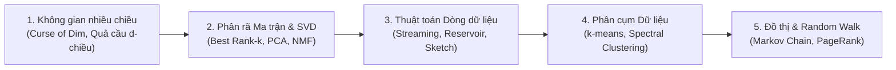

# Giải Thuật Nền Tảng Cho Khoa Học Dữ Liệu 📊🔬

Môn học **Giải thuật nền tảng cho Khoa học dữ liệu** (Foundations of Data Science / Fundamental Algorithms for Data Science) cung cấp nền tảng toán học và thuật toán hiện đại để giải quyết các bài toán dữ liệu quy mô lớn: hình học không gian nhiều chiều, giảm chiều dữ liệu (SVD, Random Projection), thuật toán dòng dữ liệu (Streaming Algorithms), phân cụm và mô hình đồ thị.

---

## 🗺️ Lộ trình Môn học Trọng tâm

---

## 📚 Danh mục Bài học

| Bài | Tên chuyên đề | Trạng thái |
|---|---|---|
| **00** | **Mục lục & Khung chương trình** | ✅ Sẵn sàng |
| **01** | Hình học trong không gian nhiều chiều (High-Dimensional Space) | ⏳ Chờ nạp bài |
| **02** | Phân rã ma trận giá trị kỳ dị (SVD) & Giảm chiều dữ liệu | ⏳ Chờ nạp bài |
| **03** | Bước ngẫu nhiên và Xích Markov (Random Walks & Markov Chains) | ⏳ Chờ nạp bài |
| **04** | Thuật toán cho dòng dữ liệu lớn (Streaming Algorithms & Sketching) | ⏳ Chờ nạp bài |
| **05** | Phân cụm dữ liệu & Spectral Clustering | ⏳ Chờ nạp bài |
| **06** | Mô hình đồ thị, Đồ thị ngẫu nhiên & Thuật toán PageRank | ⏳ Chờ nạp bài |

---

## 📖 Giáo trình & Nguồn Tham khảo Chuẩn Quốc tế

1. **"Foundations of Data Science"** — *Avrim Blum, John Hopcroft, Ravindran Kannan* (Cambridge University Press). Giáo trình tiêu chuẩn vàng cho các môn giải thuật khoa học dữ liệu tại các đại học hàng đầu thế giới (Cornell, CMU).
2. **"Mining of Massive Datasets" (MMDS)** — *Jure Leskovec, Anand Rajaraman, Jeffrey D. Ullman* (Stanford University).
3. **Bài giảng & Slide môn học:** Khoa Công nghệ Thông tin — Trường Đại học Công nghệ (ĐHQGHN).
