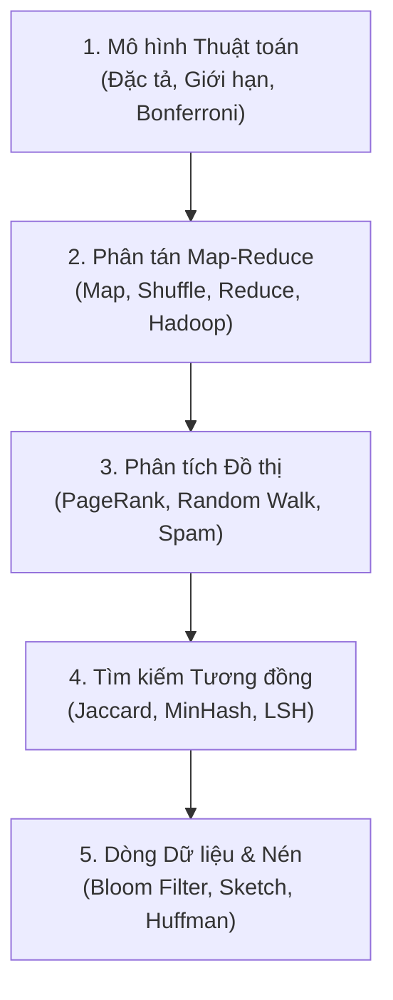

# Giải Thuật Nền Tảng Cho Khoa Học Dữ Liệu 

Môn học **Giải thuật nền tảng cho Khoa học dữ liệu** (Foundations of Data Science / Algorithmic Foundations of Data Science) trình bày cách mô hình hóa và giải các bài toán dữ liệu quy mô lớn. Các chủ đề gồm tính toán phân tán Map-Reduce, phân tích liên kết (PageRank), tìm kiếm tương đồng (MinHash, LSH) và chỉ mục véc-tơ. Phần sau xét thuật toán dòng dữ liệu (Streaming), nén dữ liệu và cấu trúc dữ liệu ngoài bộ nhớ chính.

---

##  Lộ trình Môn học Trọng tâm

---

##  Danh mục Bài học

| Bài | Tên chuyên đề | Trạng thái |
|---|---|---|
| **Bài 01** | [**Bài toán dữ liệu lớn và mô hình thuật toán**](./bai-01-bai-toan-du-lieu-lon-va-mo-hinh-thuat-toan.md) *(Đặc tả, độ đo tương đồng Jaccard, tiêu chí đánh giá thuật toán và nguyên lý Bonferroni)* |  **Đã hoàn thành** |
| **Bài 02** | [**Mô hình tính toán Map-Reduce**](./bai-02-mapreduce-va-xu-ly-du-lieu-lon.md) *(Mô hình lập trình Map/Reduce/Combine, nhân ma trận, mô hình chi phí và thực hành Hadoop)* |  **Đã hoàn thành** |
| **Bài 03** | [**PageRank: Mô hình và tính toán**](./bai-03-pagerank-mo-hinh-va-tinh-toan.md) *(Random Surfer, Power Iteration, xử lý Dead Ends và Spider Traps)* |  Đang biên soạn |
| **Bài 04** | PageRank theo chủ đề và chống spam liên kết (Topic-Sensitive & TrustRank) |  Chờ nạp bài |
| **Bài 05** | Tìm tập tương đồng & Kỹ thuật Shingling / MinHash |  Chờ nạp bài |
| **Bài 06** | Tìm kiếm lân cận cục bộ (Locality-Sensitive Hashing - LSH) |  Chờ nạp bài |
| **Bài 07** | Tìm kiếm véc-tơ quy mô lớn (Vector Search, HNSW, PQ) |  Chờ nạp bài |
| **Bài 08** | Khai phá dòng dữ liệu I: Lấy mẫu và Bộ lọc Bloom (Bloom Filter) |  Chờ nạp bài |
| **Bài 09** | Khai phá dòng dữ liệu II: Đếm phân biệt (Flajolet-Martin) và Count-Min Sketch |  Chờ nạp bài |
| **Bài 10** | Nén dữ liệu không mất mát: Mã hoá Huffman và Lempel-Ziv |  Chờ nạp bài |
| **Bài 11** | Nén dữ liệu có mất mát: Biến đổi Cosin rời rạc (DCT) và JPEG |  Chờ nạp bài |
| **Bài 12** | Thuật toán ngoài bộ nhớ chính (External Memory) & Sắp xếp ngoài (Merge Sort) |  Chờ nạp bài |
| **Bài 13** | Cấu trúc dữ liệu cây ngoài bộ nhớ: B-Tree và các biến thể |  Chờ nạp bài |
| **Bài 14** | Chỉ mục không gian: R-Tree và truy vấn phạm vi đa chiều |  Chờ nạp bài |
| **Bài 15** | Phân cụm dữ liệu quy mô lớn (BFR, CURE) và Tổng kết học phần |  Chờ nạp bài |

---

##  Giáo trình & Nguồn Tham khảo Chuẩn Quốc tế

1. **Jure Leskovec, Anand Rajaraman, & Jeffrey D. Ullman**, [*Mining of Massive Datasets (MMDS - 3rd Edition)*](http://www.mmds.org/), Cambridge University Press. Bản sách PDF và slide trực tuyến miễn phí chính thức tại [mmds.org](http://www.mmds.org/). Tài liệu cốt lõi về MapReduce, LSH, PageRank và khai phá dòng dữ liệu. Khóa học trực tuyến đi kèm: [Stanford CS246: Mining Massive Datasets](https://web.stanford.edu/class/cs246/).
2. **Avrim Blum, John Hopcroft, & Ravindran Kannan**, [*Foundations of Data Science*](https://www.cs.cornell.edu/jeh/book.pdf), Cambridge University Press. Bản PDF trực tuyến chính thức từ Đại học Cornell: [Cornell Foundations of Data Science (PDF)](https://www.cs.cornell.edu/jeh/book.pdf). Cung cấp nền tảng lý thuyết chặt chẽ về dữ liệu cao chiều, phân rã ma trận, đồ thị ngẫu nhiên và mô hình xác suất.
3. **Jeffrey Dean & Sanjay Ghemawat**, [*MapReduce: Simplified Data Processing on Large Clusters*](https://research.google/pubs/pub62/), Google / OSDI 2004. Bài báo gốc kinh điển: [OSDI'04 Paper (PDF)](https://static.googleusercontent.com/media/research.google.com/en//archive/mapreduce-osdi04.pdf).
4. **Jiawei Han, Micheline Kamber, & Jian Pei**, [*Data Mining: Concepts and Techniques (3rd Edition)*](https://www.sciencedirect.com/book/9780123814791/data-mining-concepts-and-techniques), Morgan Kaufmann. Giáo trình chuẩn mực về tiền xử lý dữ liệu, khai phá luật kết hợp, phân cụm và phân lớp.
5. **Charu C. Aggarwal**, [*Data Mining: The Textbook*](https://link.springer.com/book/10.1007/978-3-319-14142-8), Springer. Tài liệu tham khảo toàn diện về các giải thuật khai phá dữ liệu, độ đo khoảng cách, đồ thị và chuỗi thời gian.
6. **Đề cương bài giảng UET.DSE2053 — Giải thuật nền tảng cho Khoa học dữ liệu**, Viện Trí tuệ Nhân tạo & Khoa CNTT, Trường Đại học Công nghệ (ĐHQGHN).
