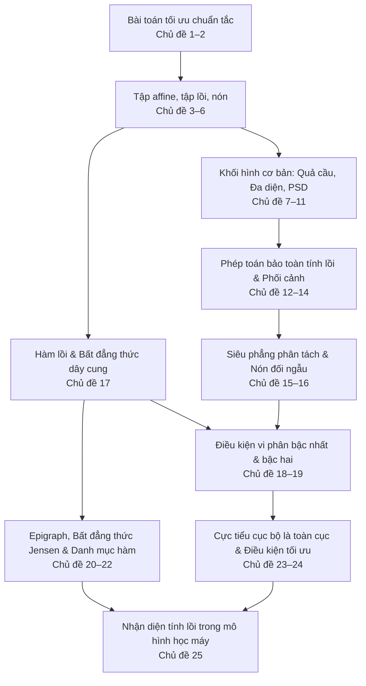

Nhà toán học lỗi lạc R. Tyrrell Rockafellar từng đưa ra một đúc kết kinh điển làm thay đổi hoàn toàn diện mạo của lý thuyết tối ưu hiện đại: *"Ranh giới phân chia cốt lõi trong tối ưu không nằm ở sự phân biệt giữa bài toán tuyến tính và phi tuyến, mà nằm ở ranh giới giữa tính lồi và phi lồi."*

Ở Bài 00, ta đã giải một bài toán bình phương tối thiểu đơn giản bằng cách tính đạo hàm rồi cho triệt tiêu về 0. Cách tiếp cận giải tích cổ điển đó vận hành trơn tru khi bài toán không có bất kỳ ràng buộc nào. Thế nhưng trong thế giới thực, các bài toán luôn bị bủa vây bởi các giới hạn: Năng lượng pin có hạn, ngân sách đầu tư cố định, độ trễ mạng viễn thông, hay xác suất dự đoán phải nằm trong đoạn $[0, 1]$. Khi đưa các ràng buộc vào mô hình, hàng loạt câu hỏi hóc búa lập tức xuất hiện:
- Điểm dừng vừa tìm được có thực sự là nghiệm tốt nhất trên toàn bộ miền khảo sát hay chỉ là một cực tiểu cục bộ trong một thung lũng hẹp?
- Nếu nghiệm tối ưu bị đẩy ra tận đường biên của miền khả thi thì làm sao kiểm chứng khi gradient không còn bằng 0?
- Làm thế nào để thuật toán tránh rơi vào trạng thái dừng cục bộ tại các điểm yên ngựa hoặc cực tiểu địa phương kém chất lượng?

Chương này mở rộng phân tích sang một họ bài toán có cấu trúc toán học đặc biệt: **Bài toán tối ưu lồi (Convex Optimization)**. Với bài toán tối ưu lồi, ta có một bảo đảm toán học vững chắc: **Mọi cực tiểu cục bộ đều là cực tiểu toàn cục**. Để làm chủ công cụ này, chúng ta sẽ khảo sát hai trụ cột gắn kết hữu cơ:
1. **Hình học của tập lồi (Convex Sets)**: Không gian dung chứa các quyết định và phương án khả thi.
2. **Giải tích của hàm lồi (Convex Functions)**: Thước đo đánh giá mục tiêu mất mát hoặc chi phí cần tối thiểu hóa.

---

## 1. Cấu trúc chương học và Hướng dẫn tiếp cận

Nội dung chương được cấu trúc thành 25 chủ đề chuyên sâu, phân bổ mạch lạc trong bốn phần:
- **Phần I (Chủ đề 1–2)**: Ngôn ngữ chuẩn tắc của bài toán tối ưu hóa và hai dạng bài toán nền tảng.
- **Phần II (Chủ đề 3–16)**: Hình học không gian tập lồi, các khối hình cơ bản, phép toán bảo toàn tính lồi và định lý siêu phẳng phân tách.
- **Phần III (Chủ đề 17–22)**: Giải tích hàm lồi, bất đẳng thức Jensen, điều kiện vi phân bậc nhất, bậc hai và bộ quy tắc nhận diện hàm lồi.
- **Phần IV (Chủ đề 23–25)**: Nguyên lý cực tiểu toàn cục, điều kiện tối ưu trên miền ràng buộc và ứng dụng trực tiếp trong các mô hình học máy.

Mỗi chủ đề đều trang bị phần giải thích bản chất trực quan, câu hỏi đào sâu tư duy và bài tập kèm lời giải chi tiết.

<TopicMap />

---

## 2. Ba lộ trình học tập tùy biến

Tùy theo mục tiêu nghiên cứu và nền tảng cá nhân, người học có thể lựa chọn một trong ba lộ trình tiếp cận sau:

### Lộ trình 1: Khung xương cốt lõi (Core Track)
Dành cho lần đọc đầu tiên để nắm bắt nhanh định lý trung tâm và các công cụ thực chiến:
- Chủ đề 1. [Bài toán tối ưu và những gì cần viết ra](./bai-01-nhap-mon-toi-uu/bai-toan-toi-uu.md)
- Chủ đề 2. [Bình phương tối thiểu và quy hoạch tuyến tính](./bai-01-nhap-mon-toi-uu/hai-lop-bai-toan-kinh-dien.md)
- Chủ đề 3. [Đường thẳng, đoạn thẳng và tập affine](./bai-01-nhap-mon-toi-uu/duong-thang-va-tap-affine.md)
- Chủ đề 5. [Tập lồi, tổ hợp lồi và bao lồi](./bai-01-nhap-mon-toi-uu/tap-loi-va-bao-loi.md)
- Chủ đề 7. [Siêu phẳng và nửa không gian](./bai-01-nhap-mon-toi-uu/sieu-phang-va-nua-khong-gian.md)
- Chủ đề 12. [Các phép toán giữ tính lồi của tập](./bai-01-nhap-mon-toi-uu/phep-toan-giu-tinh-loi.md)
- Chủ đề 17. [Hàm lồi và bất đẳng thức dây cung](./bai-01-nhap-mon-toi-uu/ham-loi.md)
- Chủ đề 18. [Điều kiện bậc nhất](./bai-01-nhap-mon-toi-uu/dieu-kien-bac-nhat.md)
- Chủ đề 19. [Điều kiện bậc hai và độ cong](./bai-01-nhap-mon-toi-uu/dieu-kien-bac-hai.md)
- Chủ đề 23. [Cực tiểu cục bộ và cực tiểu toàn cục](./bai-01-nhap-mon-toi-uu/cuc-bo-va-toan-cuc.md)
- Chủ đề 24. [Điều kiện tối ưu bậc nhất trên miền lồi](./bai-01-nhap-mon-toi-uu/dieu-kien-toi-uu.md)

### Lộ trình 2: Nhãn quan hình học không gian (Geometric Track)
Dành cho người muốn thấu suốt nguồn gốc không gian của các tập hợp và chuẩn bị nền móng vững chắc cho lý thuyết đối ngẫu Lagrange:
- Chủ đề 4. [Chiều affine và nội tương đối](./bai-01-nhap-mon-toi-uu/noi-tuong-doi.md)
- Chủ đề 6. [Nón và nón lồi](./bai-01-nhap-mon-toi-uu/non-loi.md)
- Chủ đề 8–11. [Quả cầu và ellipsoid](./bai-01-nhap-mon-toi-uu/qua-cau-va-ellipsoid.md), [Quả cầu chuẩn và nón chuẩn](./bai-01-nhap-mon-toi-uu/chuan-va-non-chuan.md), [Đa diện và đơn hình](./bai-01-nhap-mon-toi-uu/da-dien-va-don-hinh.md), [Nón ma trận nửa xác định dương PSD](./bai-01-nhap-mon-toi-uu/non-psd.md)
- Chủ đề 13–14. [Phép phối cảnh](./bai-01-nhap-mon-toi-uu/phoi-canh-va-phan-tuyen-tinh.md), [Bất đẳng thức tổng quát qua nón](./bai-01-nhap-mon-toi-uu/bat-dang-thuc-tong-quat.md)
- Chủ đề 15–16. [Siêu phẳng phân tách và siêu phẳng tựa](./bai-01-nhap-mon-toi-uu/sieu-phang-phan-tach-va-tua.md), [Nón đối ngẫu](./bai-01-nhap-mon-toi-uu/non-doi-ngau.md)

### Lộ trình 3: Trọng tâm Trí tuệ nhân tạo & Học máy (Machine Learning Track)
Tập trung trực tiếp vào các hàm mất mát, kiến trúc mô hình và bài toán tối ưu thường gặp trong AI hiện đại:
- [Bình phương tối thiểu và quy hoạch tuyến tính](./bai-01-nhap-mon-toi-uu/hai-lop-bai-toan-kinh-dien.md) cùng [Chuẩn L1 thúc đẩy nghiệm thưa](./bai-01-nhap-mon-toi-uu/chuan-va-non-chuan.md)
- [Độ phân kỳ KL qua điều kiện bậc nhất](./bai-01-nhap-mon-toi-uu/dieu-kien-bac-nhat.md) cùng [Hàm Softmax và Log-Sum-Exp](./bai-01-nhap-mon-toi-uu/cac-ham-loi-quen-thuoc.md)
- [Bất đẳng thức Jensen và Cận dưới biến phân ELBO](./bai-01-nhap-mon-toi-uu/epigraph-tap-muc-duoi-jensen.md) cùng [Nhận diện tính lồi của hàm mất mát](./bai-01-nhap-mon-toi-uu/phep-toan-giu-tinh-loi-cua-ham.md)
- [Phân tích tính lồi trong các mô hình học máy](./bai-01-nhap-mon-toi-uu/tinh-loi-trong-mo-hinh-hoc-may.md)

---

## 3. Bức tranh tổng thể

Sơ đồ sau minh họa sự liên kết logic xuyên suốt giữa các chủ đề:

- **Phần I**: Thiết lập ngôn ngữ toán học chuẩn mực: Biến quyết định, hàm mục tiêu, hệ thống ràng buộc đẳng thức và bất đẳng thức. Chỉ ra ba trạng thái suy biến khiến bài toán không có nghiệm: Không khả thi (miền rỗng), không bị chặn dưới, hoặc giá trị tối ưu chỉ đạt được ở vô cực (không đạt cận).
- **Phần II**: Xây dựng nền tảng hình học của tập lồi từ tổ hợp affine, tổ hợp lồi tới tổ hợp nón. Giới thiệu các khối hình cơ sở cấu thành miền ràng buộc thực tế: Siêu phẳng, nửa không gian, ellipsoid, đa diện và nón nửa xác định dương. Thiết lập hai định lý hình học nền tảng: Siêu phẳng phân tách và siêu phẳng tựa.
- **Phần III**: Chuyển giao từ hình học sang giải tích. Hàm lồi được định nghĩa qua bất đẳng thức dây cung, tương đương với việc phần trên đồ thị (epigraph) tạo thành một tập lồi. Trang bị ba công cụ nhận diện tính lồi: Định nghĩa gốc, điều kiện vi phân bậc nhất (mặt phẳng tiếp tuyến luôn là cận dưới toàn cục), và điều kiện bậc hai (ma trận Hessian nửa xác định dương khắp nơi).
- **Phần IV**: Hội tụ hai thế giới hình học và giải tích. Chứng minh định lý trung tâm: Cực tiểu cục bộ trên miền lồi luôn là cực tiểu toàn cục. Mở rộng điều kiện tối ưu sang trường hợp nghiệm nằm trên biên của miền ràng buộc qua bất đẳng thức biến phân $\nabla f_0(x^*)^T (y - x^*) \ge 0$. Cuối cùng, làm sáng tỏ câu hỏi cốt tử trong AI: Tại sao bài toán hồi quy Logistic lồi theo trọng số, trong khi mạng nơ-ron sâu lại phi lồi.

---

## 4. Hệ thống Bài tập Tự luyện & Vận dụng Chuyên sâu

::: exercise 1. Nhận diện bốn thành phần và Cải dạng bài toán tối ưu
1. Một robot tự hành cần lựa chọn vận tốc di chuyển $v \in \mathbb{R}$ sao cho tiến gần nhất tới vận tốc tham chiếu $v_{\mathrm{ref}}$, đồng thời tiết kiệm năng lượng và không vượt quá giới hạn an toàn động cơ:
   $$
   \min_{v} (v - v_{\mathrm{ref}})^2 + \lambda v^2 \quad \text{sao cho} \quad |v| \le v_{\max},
   $$
   với $\lambda > 0$ và $v_{\max} > 0$. Hãy xác định tường minh: Dữ kiện bài toán, vector biến quyết định, hàm mục tiêu và miền khả thi. Xác định nghiệm tối ưu giải tích $v^*$ theo các tham số.
2. Xét ba bài toán tối ưu sau, phân tích xem bài toán nào là bài toán lồi hoặc có thể đưa về bài toán lồi:
   - Bài toán A: Cực tiểu hóa $\min_x \|Ax - b\|_1 + \|x\|_2^2$ với điều kiện $x \succeq 0$.
   - Bài toán B: Cực đại hóa $\max_x x_1 x_2$ với điều kiện $x_1 + x_2 = 4$ và $x \succ 0$.
   - Bài toán C: Cực tiểu hóa $\min_x \max_{i=1,\dots,m} |a_i^T x - b_i|$.
:::

::: solution
1. **Phân tích các thành phần mô hình**:
   - **Dữ kiện bài toán (Problem data)**: Vận tốc tham chiếu $v_{\mathrm{ref}} \in \mathbb{R}$, trọng số điều chuẩn năng lượng $\lambda > 0$, và giới hạn vận tốc $v_{\max} > 0$.
   - **Biến quyết định (Optimization variable)**: Vận tốc $v \in \mathbb{R}$ (vô hướng 1 chiều).
   - **Hàm mục tiêu (Objective function)**:
     $$
     f(v) = (v - v_{\mathrm{ref}})^2 + \lambda v^2 = (1 + \lambda)v^2 - 2v_{\mathrm{ref}}v + v_{\mathrm{ref}}^2.
     $$
   - **Miền khả thi (Feasible set)**: Đoạn đóng $\mathcal{C} = [-v_{\max}, v_{\max}]$, là một tập lồi compact khác rỗng.
   
   **Tìm nghiệm giải tích**:
   Đạo hàm $f'(v) = 2(1 + \lambda)v - 2v_{\mathrm{ref}} = 0$ cho nghiệm tự do (không ràng buộc):
   $$
   v_{\mathrm{free}} = \frac{v_{\mathrm{ref}}}{1 + \lambda}.
   $$
   Vì $f''(v) = 2(1 + \lambda) > 0$, hàm số lồi ngặt trên $\mathbb{R}$. Nghiệm tối ưu có ràng buộc là hình chiếu của $v_{\mathrm{free}}$ lên đoạn $[-v_{\max}, v_{\max}]$:
   $$
   v^* = \operatorname{clip}\left(\frac{v_{\mathrm{ref}}}{1 + \lambda}, -v_{\max}, v_{\max}\right) = \begin{cases} -v_{\max} & \text{nếu } \frac{v_{\mathrm{ref}}}{1 + \lambda} < -v_{\max}, \\ \frac{v_{\mathrm{ref}}}{1 + \lambda} & \text{nếu } \left|\frac{v_{\mathrm{ref}}}{1 + \lambda}\right| \le v_{\max}, \\ v_{\max} & \text{nếu } \frac{v_{\mathrm{ref}}}{1 + \lambda} > v_{\max}. \end{cases}
   $$

2. **Cải dạng bài toán**:
   - **Bài toán A**: Là bài toán lồi chính tắc do hàm mục tiêu là tổng của hàm lồi $\|Ax - b\|_1$ và hàm lồi ngặt $\|x\|_2^2$, trên nón không âm $x \succeq 0$ (tập lồi).
   - **Bài toán B**: Hàm mục tiêu $x_1 x_2$ không lõm trên $\mathbb{R}^2$, nhưng với $x \succ 0$, việc cực đại hóa $x_1 x_2$ tương đương cực đại hóa $\log(x_1 x_2) = \log x_1 + \log x_2$. Vì hàm logarit lõm, bài toán chuyển thành quy hoạch lồi và có nghiệm duy nhất $x_1^* = x_2^* = 2$.
   - **Bài toán C**: Là hàm lồi vì là giá trị lớn nhất (pointwise maximum) của các hàm lồi $|a_i^T x - b_i|$. Chuyển về Quy hoạch tuyến tính (LP) bằng kỹ thuật epigraph: Đặt $\min_{x, t} t$ với điều kiện $-t \le a_i^T x - b_i \le t$ với mọi $i = 1, \dots, m$.
:::

::: exercise 2. Tập lồi, Phản ví dụ và Ba cấp độ Bảo đảm Tối ưu
1. Với mỗi tập hợp sau trong $\mathbb{R}^2$, xác định tập lồi hay không lồi. Nếu không lồi, hãy chỉ ra một phản ví dụ số học tường minh:
   - Tập hộp: $C_1 = [-1, 1] \times [0, 2]$.
   - $C_2 = \{x \in \mathbb{R}^2 \mid \|x\|_2 = 1\}$.
   - $C_3 = \{x \in \mathbb{R}^2 \mid x_1 + x_2 = 1\}$.
2. Phân biệt ba cấp độ bảo đảm trong lý thuyết tối ưu hóa: Bảo đảm tồn tại nghiệm, bảo đảm cực tiểu cục bộ là toàn cục, và bảo đảm nghiệm duy nhất. Cho biết vì sao tính lồi đơn độc không đủ để khẳng định nghiệm tồn tại và duy nhất.
:::

::: solution
1. **Kiểm tra tính lồi**:
   - $C_1$ là tập lồi vì là tích Descartes của hai đoạn đóng, tương đương giao của bốn nửa không gian đóng.
   - $C_2$ **không lồi**: Lấy hai điểm $x = (1, 0)^T \in C_2$ và $y = (-1, 0)^T \in C_2$. Trung điểm của chúng là:
     $$
     m = \frac{1}{2}x + \frac{1}{2}y = (0, 0)^T.
     $$
     Ta có $\|m\|_2 = 0 \ne 1$, suy ra $m \notin C_2$.
   - $C_3$ là tập lồi vì là một siêu phẳng (tập affine). Với mọi $x, y \in C_3$ và $\theta \in [0, 1]$, tổ hợp lồi thỏa mãn:
     $$
     \begin{aligned}
     (\theta x_1 + (1-\theta)y_1) + (\theta x_2 + (1-\theta)y_2) &= \theta(x_1 + x_2) + (1-\theta)(y_1 + y_2) \\
     &= \theta(1) + (1-\theta)(1) = 1.
     \end{aligned}
     $$

2. **Ba cấp độ bảo đảm**:
   - **Bảo đảm tồn tại nghiệm (Existence)**: Dựa trên Định lý Weierstrass: Hàm mục tiêu liên tục trên miền khả thi đóng và bị chặn (compact) khác rỗng thì luôn đạt giá trị nhỏ nhất toàn cục.
   - **Bảo đảm cực tiểu cục bộ là toàn cục (Global optimality of local minima)**: Dựa trên **tính lồi**: Nếu hàm mục tiêu lồi trên miền khả thi lồi, mọi điểm cực tiểu cục bộ đều tự động là cực tiểu toàn cục. Tuy nhiên, bài toán lồi vẫn có thể không có nghiệm (miền không bị chặn và hàm giảm dần ra vô cực, như $\min e^x$).
   - **Bảo đảm tính duy nhất (Uniqueness)**: Dựa trên **tính lồi ngặt (strictly convex)** hoặc lồi mạnh: Hàm lồi ngặt trên miền lồi có nhiều nhất một điểm cực tiểu toàn cục.
   
   *Kết luận sư phạm*: Tính lồi chỉ bảo đảm "nếu có cực tiểu cục bộ thì đó là toàn cục", nhưng không bảo đảm cực tiểu đó tồn tại hay duy nhất. Để có nghiệm duy nhất, ta cần kết hợp điều kiện tồn tại (tập mức dưới compact) với điều kiện duy nhất (lồi ngặt).
:::

::: exercise 3. Bài toán điều khiển tối ưu một bước với giới hạn chấp hành
Xét bài toán điều khiển một bước cho xe tự hành: Trạng thái hiện tại là $s = 2$. Sau khi áp dụng lực điều khiển $u$, trạng thái tiếp theo trở thành $s + u$. Ta muốn triệt tiêu độ lệch trạng thái về 0 nhưng đồng thời phải tiết kiệm năng lượng, và cơ cấu chấp hành có giới hạn vật lý:
$$
\min_u \frac{1}{2} (2 + u)^2 + \frac{1}{2} u^2 \quad \text{sao cho} \quad |u| \le 0.5.
$$
1. Chứng minh bài toán trên là bài toán tối ưu lồi.
2. Tìm nghiệm tối ưu $u^*$ và kiểm chứng bằng điều kiện tối ưu bậc nhất trên miền lồi.
3. Nếu cơ cấu chấp hành không bị giới hạn ($u \in \mathbb{R}$ tự do), nghiệm tối ưu sẽ thay đổi ra sao?
:::

::: solution
1. **Tính lồi**: Hàm mục tiêu:
   $$
   f(u) = \frac{1}{2}(2 + u)^2 + \frac{1}{2}u^2 = u^2 + 2u + 2
   $$
   có đạo hàm bậc hai $f''(u) = 2 > 0$, do đó lồi ngặt trên $\mathbb{R}$. Miền khả thi là đoạn thẳng $\mathcal{C} = [-0.5, 0.5]$, là một tập lồi đóng. Do đó đây là bài toán tối ưu lồi.
2. **Tìm nghiệm và kiểm chứng**: Đạo hàm bậc nhất là $f'(u) = 2u + 2$. Trên đoạn $[-0.5, 0.5]$, ta thấy $f'(u) \ge 2(-0.5) + 2 = 1 > 0$, nghĩa là hàm số đồng biến trên toàn bộ miền khả thi. Do đó, hàm số đạt giá trị nhỏ nhất tại điểm mút bên trái: $u^* = -0.5$. Giá trị mất mát tối ưu là:
   $$
   f(-0.5) = \frac{1}{2}(1.5)^2 + \frac{1}{2}(-0.5)^2 = 1.125 + 0.125 = 1.25.
   $$
   
   Kiểm chứng qua điều kiện tối ưu bậc nhất trên miền lồi: Ta cần chỉ ra $\nabla f(u^*)^T (y - u^*) \ge 0$ với mọi $y \in \mathcal{C}$. Tại $u^* = -0.5$, ta có $f'(-0.5) = 1$. Với mọi $y \in [-0.5, 0.5]$, ta có:
   $$
   f'(u^*) (y - u^*) = 1 \cdot (y - (-0.5)) = y + 0.5 \ge 0.
   $$
   Bất đẳng thức nghiệm đúng với mọi $y \in \mathcal{C}$. Điều này chứng minh chặt chẽ rằng $u^* = -0.5$ là nghiệm tối ưu toàn cục, dù đạo hàm tại đó khác 0 do nghiệm nằm trên biên ràng buộc.
3. **Khi không có giới hạn**: Ta giải phương trình đạo hàm triệt tiêu: $f'(u) = 2u + 2 = 0 \iff u = -1$. Lúc này giá trị mất mát tối ưu là $f(-1) = \frac{1}{2}(1)^2 + \frac{1}{2}(-1)^2 = 1.0 < 1.25$. Giới hạn vật lý $|u| \le 0.5$ đã kích hoạt (ràng buộc chặt) và làm dịch chuyển điểm cân bằng tối ưu của hệ thống.
:::

::: exercise 4. Hệ phương trình chuẩn tắc và Phân tích hình học phép chiếu OLS
Cho ma trận đặc trưng $X$ và vector nhãn mục tiêu $y$:
$$
X = \begin{bmatrix} 1 & 0 \\ 1 & 1 \\ 1 & 2 \end{bmatrix}, \qquad y = \begin{bmatrix} 0 \\ 1 \\ 3 \end{bmatrix}.
$$
1. Thiết lập ma trận Gram $X^TX$ và vector $X^Ty$.
2. Tìm nghiệm bình phương tối thiểu $w^*$ bằng cách giải hệ phương trình chuẩn tắc (Normal Equations).
3. Tính vector dự đoán $\hat{y} = Xw^*$ và vector phần dư $r = y - \hat{y}$. Kiểm chứng tính trực giao giữa phần dư và không gian cột của $X$: $X^T r = 0$.
4. Tính tổng bình phương sai số nhỏ nhất $\|r\|_2^2$.
:::

::: solution
1. **Thiết lập các đại lượng**:
   $$
   X^TX = \begin{bmatrix} 1 & 1 & 1 \\ 0 & 1 & 2 \end{bmatrix} \begin{bmatrix} 1 & 0 \\ 1 & 1 \\ 1 & 2 \end{bmatrix} = \begin{bmatrix} 3 & 3 \\ 3 & 5 \end{bmatrix}.
   $$
   $$
   X^Ty = \begin{bmatrix} 1 & 1 & 1 \\ 0 & 1 & 2 \end{bmatrix} \begin{bmatrix} 0 \\ 1 \\ 3 \end{bmatrix} = \begin{bmatrix} 4 \\ 7 \end{bmatrix}.
   $$
2. **Giải hệ phương trình chuẩn tắc**:
   Định thức $\det(X^TX) = 15 - 9 = 6 \ne 0$. Ma trận khả nghịch:
   $$
   (X^TX)^{-1} = \frac{1}{6} \begin{bmatrix} 5 & -3 \\ -3 & 3 \end{bmatrix}.
   $$
   Nghiệm tối ưu duy nhất là:
   $$
   w^* = (X^TX)^{-1} X^Ty = \frac{1}{6} \begin{bmatrix} 5 \cdot 4 - 3 \cdot 7 \\ -3 \cdot 4 + 3 \cdot 7 \end{bmatrix} = \frac{1}{6} \begin{bmatrix} -1 \\ 9 \end{bmatrix} = \begin{bmatrix} -1/6 \\ 3/2 \end{bmatrix}.
   $$
3. **Dự đoán, phần dư và kiểm chứng trực giao**:
   Vector dự đoán tối ưu:
   $$
   \hat{y} = Xw^* = \begin{bmatrix} 1 & 0 \\ 1 & 1 \\ 1 & 2 \end{bmatrix} \begin{bmatrix} -1/6 \\ 3/2 \end{bmatrix} = \begin{bmatrix} -1/6 \\ 4/3 \\ 17/6 \end{bmatrix}.
   $$
   Vector phần dư:
   $$
   r = y - \hat{y} = \begin{bmatrix} 0 - (-1/6) \\ 1 - 4/3 \\ 3 - 17/6 \end{bmatrix} = \begin{bmatrix} 1/6 \\ -1/3 \\ 1/6 \end{bmatrix} = \frac{1}{6} \begin{bmatrix} 1 \\ -2 \\ 1 \end{bmatrix}.
   $$
   Kiểm chứng tính trực giao:
   $$
   X^Tr = \frac{1}{6} \begin{bmatrix} 1 & 1 & 1 \\ 0 & 1 & 2 \end{bmatrix} \begin{bmatrix} 1 \\ -2 \\ 1 \end{bmatrix} = \frac{1}{6} \begin{bmatrix} 1 - 2 + 1 \\ 0 - 2 + 2 \end{bmatrix} = \begin{bmatrix} 0 \\ 0 \end{bmatrix}.
   $$
   Hệ thức $X^Tr = 0$ được thỏa mãn tuyệt đối, minh chứng hình học rằng $\hat{y}$ chính là hình chiếu trực giao của $y$ lên không gian con $\operatorname{col}(X)$.
4. **Tổng bình phương sai số**:
   $$
   \|r\|_2^2 = \left(\frac{1}{6}\right)^2 + \left(-\frac{2}{6}\right)^2 + \left(\frac{1}{6}\right)^2 = \frac{1 + 4 + 1}{36} = \frac{6}{36} = \frac{1}{6}.
   $$
:::

::: exercise 5. Ma trận thiếu hạng và Cấu trúc Tập nghiệm Affine
Cho ma trận suy biến và vector mục tiêu:
$$
X = \begin{bmatrix} 1 & 1 \\ 2 & 2 \end{bmatrix}, \qquad y = \begin{bmatrix} 1 \\ 2 \end{bmatrix}.
$$
1. Mô tả toàn bộ tập nghiệm tối ưu của bài toán bình phương tối thiểu $\min_w \|Xw - y\|_2^2$.
2. Giải thích vì sao giá trị tối ưu đạt được hữu hạn ($p^* = 0$) nhưng nghiệm tối ưu lại không duy nhất.
:::

::: solution
1. **Mô tả tập nghiệm**:
   Ta nhận thấy cột 2 của $X$ trùng với cột 1, do đó $Xw = (w_1 + w_2) \begin{bmatrix} 1 \\ 2 \end{bmatrix}$. Biểu thức phần dư trở thành:
   $$
   \|Xw - y\|_2^2 = \left\| (w_1 + w_2 - 1) \begin{bmatrix} 1 \\ 2 \end{bmatrix} \right\|_2^2 = 5 (w_1 + w_2 - 1)^2.
   $$
   Giá trị nhỏ nhất là $0$, đạt được khi và chỉ khi $w_1 + w_2 = 1$.
   Do đó, tập nghiệm tối ưu là một đường thẳng affine một chiều trong $\mathbb{R}^2$:
   $$
   \mathcal{S} = \{ (t, 1 - t)^T \mid t \in \mathbb{R} \} = \begin{bmatrix} 0 \\ 1 \end{bmatrix} + \operatorname{span}\left( \begin{bmatrix} -1 \\ 1 \end{bmatrix} \right).
   $$
2. **Bản chất giải tích**:
   Ma trận $X$ có cỡ $2 \times 2$ nhưng chỉ có hạng bằng 1 ($\operatorname{rank}(X) = 1 < 2$). Do đó:
   $$
   X^TX = \begin{bmatrix} 5 & 5 \\ 5 & 5 \end{bmatrix}
   $$
   chỉ là ma trận nửa xác định dương ($\lambda_1 = 10, \lambda_2 = 0$), không xác định dương. Hàm mục tiêu $f(w) = 5(w_1 + w_2 - 1)^2$ là hàm lồi nhưng **không lồi ngặt** (đồ thị có lòng máng phẳng kéo dài dọc theo hướng $(-1, 1)^T$). Vì vector $y$ nằm trong không gian cột của $X$, giá trị tối ưu $p^* = 0$ đạt được hoàn hảo, nhưng toàn bộ đáy máng đều là nghiệm, tạo nên vô số nghiệm khả thi.
:::

::: exercise 6. Nghịch lý Mất mát Logistic khi Dữ liệu phân tách tuyến tính
Xét hàm mất mát logistic đơn biến:
$$
L(w) = 2 \log(1 + e^{-w}) \quad \text{với } w \in \mathbb{R}.
$$
1. Tính đạo hàm bậc nhất $L'(w)$ và đạo hàm bậc hai $L''(w)$. Chứng minh $L(w)$ lồi ngặt trên $\mathbb{R}$.
2. Chứng minh rằng $\inf_{w \in \mathbb{R}} L(w) = 0$, nhưng bài toán tối ưu $\min_{w \in \mathbb{R}} L(w)$ hoàn toàn không có nghiệm.
3. Giải thích vì sao tính lồi ngặt không bảo đảm sự tồn tại của nghiệm tối ưu.
:::

::: solution
1. **Tính đạo hàm và chứng minh lồi ngặt**:
   $$
   L'(w) = 2 \cdot \frac{-e^{-w}}{1 + e^{-w}} = -\frac{2}{1 + e^w} < 0 \quad \forall w \in \mathbb{R}.
   $$
   $$
   L''(w) = -2 \cdot \frac{-(e^w)}{(1 + e^w)^2} = \frac{2e^w}{(1 + e^w)^2} > 0 \quad \forall w \in \mathbb{R}.
   $$
   Vì $L''(w) > 0$ với mọi $w \in \mathbb{R}$, hàm mất mát $L(w)$ lồi ngặt (strictly convex) trên toàn trục số.
2. **Giá trị tối ưu và sự vắng mặt của nghiệm**:
   Vì $L'(w) < 0$ khắp nơi, hàm số nghịch biến nghiêm ngặt. Khi $w \to +\infty$:
   $$
   \lim_{w \to +\infty} L(w) = \lim_{w \to +\infty} 2 \log(1 + e^{-w}) = 2 \log(1) = 0.
   $$
   Mặt khác, với mọi $w$ hữu hạn, ta luôn có $1 + e^{-w} > 1$, dẫn đến $L(w) > 0$. Do đó, giá trị cận dưới đúng là $\inf_{w \in \mathbb{R}} L(w) = 0$, nhưng không tồn tại bất kỳ điểm $w^* \in \mathbb{R}$ nào để $L(w^*) = 0$. Tập nghiệm tối ưu hoàn toàn rỗng ($\mathcal{X}^* = \emptyset$).
3. **Ý nghĩa sư phạm trong AI**:
   Đây là hiện tượng đặc trưng trong hồi quy logistic khi dữ liệu phân tách tuyến tính hoàn hảo: Thuật toán tối ưu sẽ đẩy trọng số $w \to +\infty$ để xác suất dự đoán tiến tới 100%, khiến nghiệm phân kỳ ra vô hạn ($+\infty$). Bài tập này nhấn mạnh: **Tính lồi ngặt chỉ bảo đảm nghiệm là duy nhất nếu nghiệm tồn tại, nhưng không bảo đảm sự tồn tại của nghiệm**. Để nghiệm tồn tại, hàm số cần có tập mức dưới compact (tính cưỡng bức - coercivity).
:::

::: exercise 7. Khắc phục bằng Điều chuẩn L2 trong Hồi quy Logistic
Xét bài toán hồi quy logistic có số hạng điều chuẩn trọng số $L_2$:
$$
L_\mu(w) = \sum_{i=1}^n \log(1 + e^{-y_i a_i^T w}) + \frac{\mu}{2} \|w\|_2^2 \quad \text{với } \mu > 0, \; w \in \mathbb{R}^d.
$$
1. Tính ma trận Hessian $\nabla^2 L_\mu(w)$ và chứng minh $L_\mu(w)$ lồi mạnh (strongly convex).
2. Chứng minh rằng bài toán luôn luôn tồn tại nghiệm tối ưu duy nhất trên $\mathbb{R}^d$.
:::

::: solution
1. **Tính ma trận Hessian và lồi mạnh**:
   Đặt $z_i = -y_i a_i^T w$. Đạo hàm của hàm thành phần $\ell_i(w) = \log(1 + e^{-y_i a_i^T w})$ cho ma trận Hessian:
   $$
   \nabla^2 \ell_i(w) = \frac{e^{-y_i a_i^T w}}{(1 + e^{-y_i a_i^T w})^2} a_i a_i^T = d_i a_i a_i^T,
   $$
   với $d_i = \sigma(y_i a_i^T w)(1 - \sigma(y_i a_i^T w)) > 0$. Vì $a_i a_i^T \succeq 0$, ma trận Hessian của phần mất mát dữ liệu luôn nửa xác định dương:
   $$
   \sum_{i=1}^n \nabla^2 \ell_i(w) \succeq 0.
   $$
   Thành phần điều chuẩn $\frac{\mu}{2}\|w\|_2^2$ có Hessian bằng $\mu I$. Do đó:
   $$
   \nabla^2 L_\mu(w) = \sum_{i=1}^n d_i a_i a_i^T + \mu I \succeq \mu I \succ 0.
   $$
   Điều này chứng minh hàm số $L_\mu(w)$ lồi mạnh với tham số $m = \mu > 0$.
2. **Chứng minh nghiệm tồn tại và duy nhất**:
   - **Tính duy nhất**: Do hàm lồi mạnh kéo theo lồi ngặt, bài toán có nhiều nhất một điểm cực tiểu toàn cục.
   - **Tính tồn tại**: Vì $\log(1 + e^z) > 0$, ta có đánh giá chặn dưới:
     $$
     L_\mu(w) \ge \frac{\mu}{2}\|w\|_2^2.
     $$
     Khi $\|w\|_2 \to \infty$, ta có $L_\mu(w) \to \infty$. Do đó, tập mức dưới:
     $$
     \mathcal{S} = \{ w \in \mathbb{R}^d \mid L_\mu(w) \le L_\mu(0) \}
     $$
     là một tập đóng và bị chặn (compact) trong $\mathbb{R}^d$. Theo Định lý Weierstrass, hàm liên tục $L_\mu$ đạt giá trị nhỏ nhất trên tập compact $\mathcal{S}$. Mọi điểm ngoài $\mathcal{S}$ đều có giá trị lớn hơn $L_\mu(0)$, do đó điểm đạt giá trị nhỏ nhất trên $\mathcal{S}$ cũng chính là cực tiểu toàn cục trên toàn không gian $\mathbb{R}^d$.
   
   Kết hợp tính tồn tại và tính duy nhất, nghiệm tối ưu $w^*$ tồn tại và duy nhất. Điều chuẩn $L_2$ đã hóa giải hoàn toàn nghịch lý trôi dạt trọng số ở Bài 6!
:::

::: exercise 8. Mô hình hóa Hệ thống Phân bố Công suất Chiếu sáng
Một hệ thống gồm $m$ bóng đèn được dùng để chiếu sáng $n$ khu vực. Gọi $p \in \mathbb{R}^m$ là vector công suất của các đèn. Độ rọi đo được tại $n$ khu vực được mô hình hóa qua hệ thức tuyến tính:
$$
I = Ap \quad (A \in \mathbb{R}_+^{n \times m}).
$$
Mục tiêu là điều chỉnh công suất $p$ sao cho độ rọi thực tế $I$ bám sát độ rọi mong muốn $I_{\mathrm{des}} \in \mathbb{R}^n$, dưới giới hạn công suất trần của từng bóng đèn $0 \le p_j \le p_{\max}$ và giới hạn tổng công suất toàn hệ thống $\mathbf{1}^T p \le P_{\mathrm{total}}$.
1. Thiết lập bài toán tối ưu dưới dạng chuẩn tắc với tiêu chuẩn sai số bình phương nhỏ nhất.
2. Chứng minh miền khả thi và hàm mục tiêu của bài toán là lồi.
3. Nêu điều kiện để bài toán có nghiệm tối ưu duy nhất.
:::

::: solution
1. **Thiết lập mô hình**:
   $$
   \begin{aligned}
   \text{minimize}\quad & \|Ap - I_{\mathrm{des}}\|_2^2 \\
   \text{subject to}\quad & 0 \le p_j \le p_{\max}, \quad j = 1, \dots, m, \\
   & \sum_{j=1}^m p_j \le P_{\mathrm{total}}.
   \end{aligned}
   $$
2. **Chứng nhận tính lồi**:
   - **Hàm mục tiêu**: Khai triển dạng toàn phương:
     $$
     f_0(p) = \|Ap - I_{\mathrm{des}}\|_2^2 = p^T(A^TA)p - 2(A^T I_{\mathrm{des}})^T p + \|I_{\mathrm{des}}\|_2^2.
     $$
     Ma trận Hessian là $\nabla^2 f_0(p) = 2A^TA \succeq 0$, do đó hàm mục tiêu là hàm toàn phương lồi.
   - **Miền khả thi**: Là giao của hộp siêu lập phương $[0, p_{\max}]^m$ (giao của $2m$ nửa không gian) và nửa không gian tổng công suất $\{p \mid \mathbf{1}^T p \le P_{\mathrm{total}}\}$. Do giao của các tập lồi là tập lồi, miền khả thi là một đa diện lồi compact (đóng và bị chặn).
   - Vì hàm mục tiêu liên tục trên miền compact khác rỗng (với giả thiết $P_{\mathrm{total}} \ge 0$), nghiệm tối ưu luôn luôn tồn tại theo Định lý Weierstrass.
3. **Điều kiện nghiệm duy nhất**:
   Hàm mục tiêu lồi ngặt khi và chỉ khi ma trận Hessian dương xác định: $A^TA \succ 0$, tương đương với việc ma trận $A$ có hạng cột đầy đủ ($\operatorname{rank}(A) = m \le n$). Khi đó, không có hai tổ hợp công suất khác nhau nào tạo ra cùng một phân bố ánh sáng, bảo đảm nghiệm tối ưu $p^*$ là duy nhất.
:::

::: exercise 9. Chuỗi lập luận tối ưu hóa cho hàm Log-Sum-Exp điều quy
Xét hàm số $f(x) = \log(e^{x_1} + e^{x_2}) + \frac{1}{2}\|x\|_2^2$ xác định trên $\mathbb{R}^2$.
1. Chứng minh hàm số $f(x)$ lồi mạnh (strongly convex).
2. Tận dụng tính đối xứng của bài toán để dự đoán nghiệm cực tiểu $x^*$, sau đó kiểm chứng bằng vector gradient.
3. Giải thích vì sao điểm tìm được là điểm cực tiểu toàn cục duy nhất của bài toán.
:::

::: solution
1. **Chứng minh lồi mạnh**: Hàm Softmax Log-Sum-Exp $g(x) = \log(e^{x_1} + e^{x_2})$ có ma trận Hessian nửa xác định dương $\nabla^2 g(x) \succeq 0$ trên toàn không gian $\mathbb{R}^2$. Thành phần điều quy $\frac{1}{2}\|x\|_2^2$ có ma trận Hessian đúng bằng ma trận đơn vị $I$. Do đó, ma trận Hessian của tổng là $\nabla^2 f(x) = \nabla^2 g(x) + I \succeq I$. Điều này chứng minh hàm số $f(x)$ lồi mạnh với tham số $m = 1$.
2. **Dự đoán và kiểm chứng**: Do vai trò của hai biến $x_1$ và $x_2$ hoàn toàn bình đẳng và hàm số đối xứng qua đường phân giác $x_1 = x_2$, ta dự đoán nghiệm tối ưu thỏa mãn $x_1^* = x_2^* = t$. Khi đó hàm số trở thành hàm một biến:
   $$
   h(t) = \log(2e^t) + \frac{1}{2}(2t^2) = \log 2 + t + t^2.
   $$
   Đạo hàm $h'(t) = 1 + 2t = 0 \iff t = -0.5$. Ta kiểm chứng lại trên không gian hai chiều: Gradient của hàm số là:
   $$
   \nabla f(x) = \begin{bmatrix} \frac{e^{x_1}}{e^{x_1} + e^{x_2}} + x_1 \\ \frac{e^{x_2}}{e^{x_1} + e^{x_2}} + x_2 \end{bmatrix} = \operatorname{softmax}(x) + x.
   $$
   Tại điểm $x^* = (-0.5, -0.5)^T$, ta có $\operatorname{softmax}(x^*) = (0.5, 0.5)^T$, do đó:
   $$
   \nabla f(x^*) = \begin{bmatrix} 0.5 \\ 0.5 \end{bmatrix} + \begin{bmatrix} -0.5 \\ -0.5 \end{bmatrix} = \begin{bmatrix} 0 \\ 0 \end{bmatrix}.
   $$
   Điểm dự đoán thỏa mãn chính xác phương trình đạo hàm triệt tiêu. Giá trị nhỏ nhất tương ứng là $f(x^*) = \log 2 - 0.25 \approx 0.4431$.
3. **Tính duy nhất toàn cục**: Vì $f(x)$ là hàm lồi khả vi trên toàn bộ không gian $\mathbb{R}^2$, điểm có gradient triệt tiêu $\nabla f(x^*) = 0$ tự động là điểm cực tiểu toàn cục. Hơn nữa, do $f(x)$ lồi mạnh nên ma trận Hessian dương xác định khắp nơi ($\nabla^2 f(x) \succ 0$), suy ra hàm số lồi ngặt và điểm cực tiểu toàn cục là duy nhất.
:::

---

## Tóm tắt cốt lõi

1. **Bản chất của bài toán lồi**: Miền khả thi là tập lồi và hàm mục tiêu là hàm lồi. Tính chất này loại bỏ triệt để nguy cơ rơi vào cực tiểu cục bộ: Mọi cực tiểu cục bộ đều là cực tiểu toàn cục.
2. **Khối hình và Phép toán bảo toàn**: Các miền ràng buộc phức tạp trong thực tế được thiết lập từ các khối hình cơ sở (siêu phẳng, nửa không gian, quả cầu, đa diện, nón PSD) thông qua phép giao, ảnh affine và phép phối cảnh.
3. **Điều kiện vi phân và Nhận diện**: Hàm lồi có tiếp diện luôn nằm dưới đồ thị ($\nabla f(x)^T(y-x) \le f(y) - f(x)$) và ma trận Hessian luôn nửa xác định dương ($\nabla^2 f(x) \succeq 0$).
4. **Điều kiện tối ưu tổng quát**: Khi bài toán có ràng buộc, nghiệm tối ưu $x^*$ được chứng nhận bởi bất đẳng thức $\nabla f_0(x^*)^T (y - x^*) \ge 0$ với mọi điểm khả thi $y$, ngay cả khi nghiệm nằm ở đường biên và gradient không triệt tiêu.

---

## Tài liệu tham khảo và Đọc thêm

Dành cho người học muốn nghiên cứu chuyên sâu về lý thuyết và hình học tối ưu lồi:
- **Stephen Boyd & Lieven Vandenberghe**, *Convex Optimization*, Cambridge University Press. Đọc kỹ Chương 1 (Tổng quan), Chương 2 (Tập lồi và nón lồi), Chương 3 (Hàm lồi, phép toán bảo toàn tính lồi, bất đẳng thức Jensen), Chương 4 (Bài toán tối ưu lồi và phân loại) và Chương 7 (Mô hình hóa hình học trong thống kê).
- **R. Tyrrell Rockafellar**, *Convex Analysis*, Princeton University Press. Tác phẩm kinh điển đặt nền móng giải tích hiện đại cho tập lồi, hàm lồi và vi phân dưới (subgradient).

Tiếp theo: [Bài 02: Phân loại các bài toán tối ưu lồi: LP, QP, SOCP và SDP](./bai-02-tap-loi.md).
