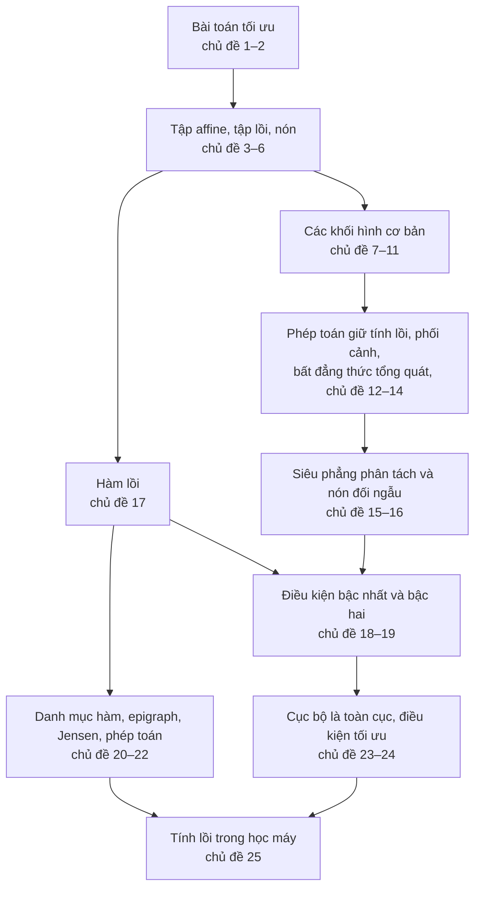

Ở Bài 00, ta tìm tham số làm hàm mất mát nhỏ nhất bằng cách khai triển một biểu thức bậc hai rồi cho đạo hàm bằng 0. Cách làm ấy chạy tốt khi bài toán nhỏ và không có ràng buộc. Nhưng chỉ cần thêm vài ràng buộc, hay đổi hàm bình phương thành một hàm mất mát khác, ta lập tức gặp những câu hỏi khó hơn nhiều: điểm vừa tìm có thật sự tốt nhất trên toàn miền không, hay chỉ tốt nhất trong vùng lân cận? Nghiệm nằm trên biên thì kiểm chứng thế nào? Có bao nhiêu nghiệm?

Chương này trả lời những câu hỏi ấy cho một lớp bài toán đặc biệt: **bài toán tối ưu lồi**. Với lớp bài toán này, mọi điểm tốt nhất trong một lân cận cũng là điểm tốt nhất trên toàn miền, và ta có những chứng nhận gọn gàng để biết mình đã tới nghiệm. Để đi tới kết quả đó, ta cần hai thứ: hình học của **tập lồi**, nơi các lựa chọn khả thi sống, và giải tích của **hàm lồi**, thứ ta muốn cực tiểu.

## Cách đọc chương này

Nội dung được chia thành 25 chủ đề ngắn, xếp trong bốn phần. Mỗi chủ đề tập trung vào một ý, có mô phỏng tương tác để bạn tự kéo, thả và kiểm chứng, một loạt câu hỏi đào sâu bản chất, và bài tập có lời giải gập. Bạn không cần đọc liền một mạch: thanh tiến độ ở đầu mỗi chủ đề cho biết bạn đang ở đâu, và hai nút ở cuối trang dẫn sang chủ đề trước hoặc sau.

<TopicMap />

## Ba lộ trình đọc

Hai mươi lăm chủ đề là một khối lượng không nhỏ, và không phải ai cũng cần đọc hết ở lần đầu. Ba lộ trình dưới đây giúp bạn chọn.

**Lộ trình cốt lõi**, cho lần đọc đầu tiên. Mười một chủ đề này đủ để hiểu định lý trung tâm của chương và dùng nó:

- Chủ đề 1. [Bài toán tối ưu và những gì cần viết ra](./bai-01-nhap-mon-toi-uu/bai-toan-toi-uu.md)
- Chủ đề 2. [Bình phương tối thiểu và quy hoạch tuyến tính](./bai-01-nhap-mon-toi-uu/hai-lop-bai-toan-kinh-dien.md)
- Chủ đề 3. [Đường thẳng, đoạn thẳng và tập affine](./bai-01-nhap-mon-toi-uu/duong-thang-va-tap-affine.md)
- Chủ đề 5. [Tập lồi, tổ hợp lồi và bao lồi](./bai-01-nhap-mon-toi-uu/tap-loi-va-bao-loi.md)
- Chủ đề 7. [Siêu phẳng và nửa không gian](./bai-01-nhap-mon-toi-uu/sieu-phang-va-nua-khong-gian.md)
- Chủ đề 12. [Các phép toán giữ tính lồi của tập](./bai-01-nhap-mon-toi-uu/phep-toan-giu-tinh-loi.md)
- Chủ đề 17. [Hàm lồi và bất đẳng thức dây cung](./bai-01-nhap-mon-toi-uu/ham-loi.md)
- Chủ đề 18. [Điều kiện bậc nhất](./bai-01-nhap-mon-toi-uu/dieu-kien-bac-nhat.md)
- Chủ đề 19. [Điều kiện bậc hai và độ cong](./bai-01-nhap-mon-toi-uu/dieu-kien-bac-hai.md)
- Chủ đề 23. [Cực tiểu cục bộ và cực tiểu toàn cục](./bai-01-nhap-mon-toi-uu/cuc-bo-va-toan-cuc.md)
- Chủ đề 24. [Điều kiện tối ưu bậc nhất trên miền lồi](./bai-01-nhap-mon-toi-uu/dieu-kien-toi-uu.md)

**Lộ trình hình học**, khi bạn muốn hiểu sâu các khối hình mà mọi bài toán lồi được dựng từ đó. Ba chủ đề cuối là nền trực tiếp cho chương đối ngẫu.

- Chủ đề 4. [Chiều affine và nội tương đối](./bai-01-nhap-mon-toi-uu/noi-tuong-doi.md)
- Chủ đề 6. [Nón và nón lồi](./bai-01-nhap-mon-toi-uu/non-loi.md)
- Chủ đề 8–11. [Quả cầu và ellipsoid](./bai-01-nhap-mon-toi-uu/qua-cau-va-ellipsoid.md), [quả cầu chuẩn và nón chuẩn](./bai-01-nhap-mon-toi-uu/chuan-va-non-chuan.md), [đa diện và đơn hình](./bai-01-nhap-mon-toi-uu/da-dien-va-don-hinh.md), [nón PSD](./bai-01-nhap-mon-toi-uu/non-psd.md)
- Chủ đề 13–14. [Phép phối cảnh](./bai-01-nhap-mon-toi-uu/phoi-canh-va-phan-tuyen-tinh.md), [bất đẳng thức tổng quát](./bai-01-nhap-mon-toi-uu/bat-dang-thuc-tong-quat.md)
- Chủ đề 15–16. [Siêu phẳng phân tách và siêu phẳng tựa](./bai-01-nhap-mon-toi-uu/sieu-phang-phan-tach-va-tua.md), [nón đối ngẫu](./bai-01-nhap-mon-toi-uu/non-doi-ngau.md)

**Lộ trình học máy**, khi bạn muốn thấy ngay chương này nói gì về các mô hình quen thuộc.

- [Bình phương tối thiểu và quy hoạch tuyến tính](./bai-01-nhap-mon-toi-uu/hai-lop-bai-toan-kinh-dien.md) và [chuẩn ℓ1 với nghiệm thưa](./bai-01-nhap-mon-toi-uu/chuan-va-non-chuan.md)
- [Độ phân kỳ KL qua điều kiện bậc nhất](./bai-01-nhap-mon-toi-uu/dieu-kien-bac-nhat.md) và [softmax, log-sum-exp](./bai-01-nhap-mon-toi-uu/cac-ham-loi-quen-thuoc.md)
- [Jensen, phương sai và ELBO](./bai-01-nhap-mon-toi-uu/epigraph-tap-muc-duoi-jensen.md) và [đọc tính lồi của một hàm mất mát](./bai-01-nhap-mon-toi-uu/phep-toan-giu-tinh-loi-cua-ham.md)
- [Nhận diện tính lồi trong mô hình học máy](./bai-01-nhap-mon-toi-uu/tinh-loi-trong-mo-hinh-hoc-may.md)

## Bức tranh chung

Sơ đồ sau cho thấy các phần của chương dựa vào nhau ra sao. Mũi tên đi từ ý được dùng tới ý dùng nó.

**Phần I** dạy cách viết một bài toán tối ưu cho đúng: biến, dữ liệu, hàm mục tiêu, ràng buộc, giá trị tối ưu, và ba cách một bài toán có thể "hỏng": không khả thi, không bị chặn, hoặc không đạt cận. Hai lớp bài toán kinh điển, bình phương tối thiểu và quy hoạch tuyến tính, được dùng làm ví dụ xuyên suốt chương.

**Phần II** dựng hình học của tập lồi. Đi từ đường thẳng qua hai điểm, ta có tập affine, rồi tập lồi, rồi nón, tương ứng với bốn kiểu tổ hợp tuyến tính. Các khối hình cơ bản gồm siêu phẳng, nửa không gian, quả cầu, ellipsoid, đa diện và nón ma trận nửa xác định dương. Giao, ảnh affine và phép phối cảnh cho phép lắp ghép chúng thành những tập phức tạp hơn mà vẫn giữ tính lồi. Hai định lý hình học quan trọng nhất là siêu phẳng phân tách và siêu phẳng tựa, kèm khái niệm nón đối ngẫu, nền của mọi chứng nhận tối ưu về sau.

**Phần III** chuyển từ tập sang hàm. Hàm lồi là hàm có đồ thị nằm dưới mọi dây cung, tương đương với epigraph lồi. Ba công cụ nhận diện là định nghĩa, điều kiện bậc nhất (tiếp tuyến là cận dưới toàn cục) và điều kiện bậc hai (Hessian nửa xác định dương). Một danh mục ngắn các hàm cơ bản cùng bộ quy tắc lắp ghép đủ để nhận diện phần lớn hàm mất mát trong thực tế mà không cần tính đạo hàm.

**Phần IV** ráp hai thế giới. Bài toán tối ưu lồi có miền khả thi lồi và hàm mục tiêu lồi, và nhờ đó mọi cực tiểu cục bộ là toàn cục. Điều kiện tối ưu $\nabla f_0(x)^T (y - x) \ge 0$ cho mọi điểm khả thi $y$ chứng nhận nghiệm kể cả khi nó nằm trên biên. Chủ đề cuối áp dụng tất cả vào học máy: vì sao hồi quy logistic lồi theo tham số, vì sao mạng nơ-ron thì không, và vì sao câu hỏi "lồi theo biến nào" quan trọng.

## Bài tập tổng hợp

Các bài dưới đây cần kiến thức từ nhiều phần của chương. Hãy thử làm sau khi đã đọc ít nhất lộ trình cốt lõi.

::: exercise 1. Phân loại bốn bài toán
Bài toán nào là bài toán lồi, hoặc viết lại được thành bài toán lồi tương đương? (a) Cực tiểu $\|Ax - b\|_1 + \|x\|_2^2$ với $x \succeq 0$. (b) Cực đại $x_1 x_2$ với $x_1 + x_2 = 4$, $x \succeq 0$. (c) Cực tiểu $\max_i |a_i^T x - b_i|$. (d) Cực tiểu $\|x\|_2$ với $\|x\|_2 \ge 1$.
:::

::: solution
(a) Lồi: chuẩn $\ell_1$ hợp với hàm affine, cộng bình phương chuẩn, đều lồi, và $x \succeq 0$ là các ràng buộc tuyến tính. (b) Ở dạng gốc thì không: $x_1 x_2$ không lõm trên $\mathbb{R}^2_+$, chẳng hạn tại $(1, 1)$ và $(3, 3)$ nó bằng 1 và 9, còn tại trung điểm $(2, 2)$ chỉ bằng 4, nhỏ hơn trung bình 5. Nhưng với $x \succ 0$, cực đại $x_1 x_2$ tương đương cực đại $\log x_1 + \log x_2$, một hàm lõm, nên bài toán viết lại được thành bài toán lồi. Nghiệm là $(2, 2)$, nơi gradient $(1/x_1,\ 1/x_2)$ tỉ lệ với $(1, 1)$. Điểm có một tọa độ bằng 0 cho tích bằng 0, không thể tối ưu. (c) Lồi: max của các trị tuyệt đối của hàm affine, và viết được thành quy hoạch tuyến tính bằng dạng epigraph. (d) Không lồi: miền khả thi là phần bù của quả cầu mở, không lồi. Nghiệm vẫn dễ thấy, mọi điểm trên mặt cầu đơn vị với giá trị 1, nhưng đó là một tập không lồi các nghiệm, điều không thể xảy ra ở bài toán lồi.
:::

::: exercise 2. Một bài toán điều khiển một bước
Trạng thái hiện tại là $s = 2$, và sau khi tác động $u$, trạng thái mới là $s + u$. Ta muốn đưa trạng thái về gần 0 nhưng không tốn quá nhiều năng lượng, và độ lớn tác động bị giới hạn: cực tiểu $\tfrac12 (2 + u)^2 + \tfrac12 u^2$ với $|u| \le 0.5$. (a) Chứng minh đây là bài toán lồi. (b) Tìm nghiệm và kiểm chứng bằng điều kiện tối ưu trên miền. (c) Nếu bỏ giới hạn, nghiệm là gì?
:::

::: solution
(a) Hàm mục tiêu là tổng hai bình phương của hàm affine nên lồi, và $|u| \le 0.5$ là hai ràng buộc tuyến tính. (b) Đạo hàm là $(2 + u) + u = 2 + 2u$, dương trên cả đoạn $[-0.5, 0.5]$, nên hàm tăng trên đoạn và nghiệm là $u^\star = -0.5$, với giá trị $\tfrac12 \cdot 1.5^2 + \tfrac12 \cdot 0.25 = 1.25$. Kiểm chứng: tại $u^\star$, đạo hàm bằng 1, và với mọi $y \in [-0.5, 0.5]$, $1 \cdot (y - (-0.5)) = y + 0.5 \ge 0$. Điều kiện tối ưu thỏa dù đạo hàm khác 0, vì nghiệm nằm trên biên. (c) Không giới hạn, cho đạo hàm bằng 0 được $u = -1$: tác động đưa trạng thái về $1$, chia đều "chi phí" giữa độ lệch trạng thái và năng lượng. Ràng buộc $|u| \le 0.5$ chặt tại nghiệm và thật sự làm thay đổi nghiệm.
:::

::: exercise 3. Một chuỗi lập luận xuyên chương
Cho $f(x) = \log(e^{x_1} + e^{x_2}) + \tfrac12\|x\|_2^2$ trên $\mathbb{R}^2$. (a) Chứng minh $f$ lồi mạnh. (b) Dùng tính đối xứng để đoán điểm cực tiểu, rồi kiểm chứng bằng gradient. (c) Giải thích vì sao đó là cực tiểu toàn cục duy nhất, nêu rõ kết quả nào của chương được dùng ở mỗi bước.
:::

::: solution
(a) Log-sum-exp lồi với Hessian nửa xác định dương (chủ đề những hàm lồi thường gặp), và $\tfrac12\|x\|_2^2$ có Hessian $I$. Tổng có Hessian $\succeq I$, nên $f$ lồi mạnh với $m = 1$ (chủ đề điều kiện bậc hai). (b) $f$ không đổi khi đổi chỗ $x_1$ và $x_2$, nên thử $x_1 = x_2 = t$: $f = \log 2 + t + t^2$, nhỏ nhất khi $t = -\tfrac12$. Kiểm chứng: $\nabla f(x) = \operatorname{softmax}(x) + x$, tại $(-\tfrac12, -\tfrac12)$ bằng $(\tfrac12, \tfrac12) + (-\tfrac12, -\tfrac12) = 0$. Giá trị nhỏ nhất là $\log 2 - \tfrac14 \approx 0.443$. (c) $f$ lồi và khả vi, nên điểm có gradient bằng 0 là cực tiểu toàn cục (chủ đề điều kiện bậc nhất). $f$ lồi nghiêm ngặt vì Hessian xác định dương, nên có nhiều nhất một cực tiểu (chủ đề cực tiểu cục bộ và toàn cục). Hai điều này cho cực tiểu toàn cục duy nhất. Lập luận đối xứng chỉ dùng để đoán nghiệm, còn việc kiểm chứng dựa hoàn toàn vào gradient.
:::

## Tóm tắt

Một bài toán tối ưu lồi có miền khả thi lồi, được mô tả bằng bất đẳng thức của các hàm lồi và đẳng thức affine, cùng một hàm mục tiêu lồi. Hình học của tập lồi cho các khối hình cơ bản, các phép toán lắp ghép, và định lý siêu phẳng phân tách. Giải tích của hàm lồi cho ba công cụ nhận diện, một danh mục hàm cơ bản và các quy tắc lắp ghép. Ghép lại, ta được định lý trung tâm: mọi cực tiểu cục bộ của bài toán lồi là toàn cục, cùng điều kiện tối ưu $\nabla f_0(x)^T (y - x) \ge 0$ để chứng nhận nghiệm cả khi nó nằm trên biên.

Tính lồi luôn phải xét theo biến của bài toán tối ưu. Nhiều mô hình học máy tuyến tính theo tham số là bài toán lồi, còn mạng nơ-ron thì không, và nhận ra sự khác biệt ấy là kỹ năng chính mà chương này muốn để lại.

## Nguồn và đọc thêm

- S. Boyd, L. Vandenberghe, *Convex Optimization*, Cambridge University Press, 2004: chương 1, chương 2, §3.1–3.2, §4.1–4.2 và §7.1. Mỗi chủ đề ghi rõ mục và trang tương ứng ở phần nguồn của nó.
- Các mô phỏng, ví dụ số, câu hỏi và bài tập do người soạn bổ sung, và mọi con số đã được tính lại bằng chương trình. Tên và thứ tự bài giảng theo trang môn học.

[Bài 00](./bai-00-on-tap-nen-tang.md) · [Bài 02 — Các bài toán tối ưu lồi](./bai-02-tap-loi.md)
