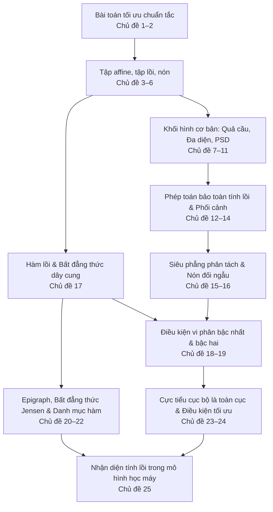

Nhà toán học lỗi lạc R. Tyrrell Rockafellar từng đưa ra một đúc kết kinh điển làm thay đổi hoàn toàn diện mạo của lý thuyết tối ưu hiện đại: *"Ranh giới phân chia cốt lõi trong tối ưu không nằm ở sự phân biệt giữa bài toán tuyến tính và phi tuyến, mà nằm ở ranh giới giữa tính lồi và phi lồi."*

Ở Bài 00, ta đã giải một bài toán bình phương tối thiểu đơn giản bằng cách tính đạo hàm rồi cho triệt tiêu về 0. Cách tiếp cận giải tích cổ điển đó vận hành trơn tru khi bài toán không có bất kỳ ràng buộc nào. Thế nhưng trong thế giới thực, các bài toán luôn bị bủa vây bởi các giới hạn: Năng lượng pin có hạn, ngân sách đầu tư cố định, độ trễ mạng viễn thông, hay xác suất dự đoán phải nằm trong đoạn $[0, 1]$. Khi đưa các ràng buộc vào mô hình, hàng loạt câu hỏi hóc búa lập tức xuất hiện:
- Điểm dừng vừa tìm được có thực sự là nghiệm tốt nhất trên toàn bộ miền khảo sát hay chỉ là một cực tiểu cục bộ trong một thung lũng hẹp?
- Nếu nghiệm tối ưu bị đẩy ra tận đường biên của miền khả thi thì làm sao kiểm chứng khi gradient không còn bằng 0?
- Làm thế nào để thuật toán không bị mắc kẹt vô vọng ở những điểm yên ngựa hay cực tiểu địa phương nghèo nàn?

Chương này mở rộng phân tích sang một lớp bài toán có cấu trúc toán học đặc biệt: **Bài toán tối ưu lồi (Convex Optimization)**. Với bài toán tối ưu lồi, ta có một bảo đảm toán học vững chắc: **Mọi cực tiểu cục bộ đều là cực tiểu toàn cục**. Để làm chủ công cụ này, chúng ta sẽ khảo sát hai trụ cột gắn kết hữu cơ:
1. **Hình học của tập lồi (Convex Sets)**: Không gian dung chứa các quyết định và phương án khả thi.
2. **Giải tích của hàm lồi (Convex Functions)**: Thước đo đánh giá mục tiêu mất mát hoặc chi phí cần tối thiểu hóa.

---

## 1. Cấu trúc chương học và Hướng dẫn tiếp cận

Nội dung chương được cấu trúc thành 25 chủ đề chuyên sâu, phân bổ mạch lạc trong bốn phần:
- **Phần I (Chủ đề 1–2)**: Ngôn ngữ chuẩn tắc của bài toán tối ưu hóa và hai lớp bài toán nền tảng.
- **Phần II (Chủ đề 3–16)**: Hình học không gian tập lồi, các khối hình cơ bản, phép toán bảo toàn tính lồi và định lý siêu phẳng phân tách.
- **Phần III (Chủ đề 17–22)**: Giải tích hàm lồi, bất đẳng thức Jensen, điều kiện vi phân bậc nhất, bậc hai và bộ quy tắc nhận diện hàm lồi.
- **Phần IV (Chủ đề 23–25)**: Nguyên lý cực tiểu toàn cục, điều kiện tối ưu trên miền ràng buộc và ứng dụng trực tiếp trong các mô hình học máy.

Mỗi chủ đề đều trang bị phần giải thích bản chất trực quan, câu hỏi đào sâu tư duy và bài tập kèm lời giải chi tiết.

<TopicMap />

---

## 2. Ba lộ trình học tập tùy biến

Tùy theo mục tiêu nghiên cứu và nền tảng cá nhân, bạn có thể lựa chọn một trong ba lộ trình tiếp cận sau:

### Lộ trình 1: Khung xương cốt lõi (Core Track)
Dành cho lần đọc đầu tiên để nắm bắt nhanh định lý trung tâm và các công cụ thực chiến:
- Chủ đề 1. [Bài toán tối ưu và những gì cần viết ra](./bai-01-nhap-mon-toi-uu/bai-toan-toi-uu.md)
- Chủ đề 2. [Bình phương tối thiểu và quy hoạch tuyến tính](./bai-01-nhap-mon-toi-uu/hai-lop-bai-toan-kinh-dien.md)
- Chủ đề 3. [Đường thẳng, đoạn thẳng và tập affine](./bai-01-nhap-mon-toi-uu/duong-thang-va-tap-affine.md)
- Chủ đề 5. [Tập lồi, tổ hợp lồi và bao lồi](./bai-01-nhap-mon-toi-uu/tap-loi-va-bao-loi.md)
- Chủ đề 7. [Siêu phẳng và nửa không gian](./bai-01-nhap-mon-toi-uu/sieu-phang-va-nua-khong-gian.md)
- Chủ đề 12. [Các phép toán giữ tính lồi của tập](./bai-01-nhap-mon-toi-uu/phep-toan-giu-tinh-loi.md)
- Chủ đề 17. [Hàm lồi và bất đẳng thức dây cung](./bai-01-nhap-mon-toi-uu/ham-loi.md)
- Chủ đề 18. [Điều kiện bậc nhất](./bai-01-nhap-mon-toi-uu/dieu-kien-bac-nhat.md)
- Chủ đề 19. [Điều kiện bậc hai và độ cong](./bai-01-nhap-mon-toi-uu/dieu-kien-bac-hai.md)
- Chủ đề 23. [Cực tiểu cục bộ và cực tiểu toàn cục](./bai-01-nhap-mon-toi-uu/cuc-bo-va-toan-cuc.md)
- Chủ đề 24. [Điều kiện tối ưu bậc nhất trên miền lồi](./bai-01-nhap-mon-toi-uu/dieu-kien-toi-uu.md)

### Lộ trình 2: Nhãn quan hình học không gian (Geometric Track)
Dành cho người muốn thấu suốt nguồn gốc không gian của các tập hợp và chuẩn bị nền móng vững chắc cho lý thuyết đối ngẫu Lagrange:
- Chủ đề 4. [Chiều affine và nội tương đối](./bai-01-nhap-mon-toi-uu/noi-tuong-doi.md)
- Chủ đề 6. [Nón và nón lồi](./bai-01-nhap-mon-toi-uu/non-loi.md)
- Chủ đề 8–11. [Quả cầu và ellipsoid](./bai-01-nhap-mon-toi-uu/qua-cau-va-ellipsoid.md), [Quả cầu chuẩn và nón chuẩn](./bai-01-nhap-mon-toi-uu/chuan-va-non-chuan.md), [Đa diện và đơn hình](./bai-01-nhap-mon-toi-uu/da-dien-va-don-hinh.md), [Nón ma trận nửa xác định dương PSD](./bai-01-nhap-mon-toi-uu/non-psd.md)
- Chủ đề 13–14. [Phép phối cảnh](./bai-01-nhap-mon-toi-uu/phoi-canh-va-phan-tuyen-tinh.md), [Bất đẳng thức tổng quát qua nón](./bai-01-nhap-mon-toi-uu/bat-dang-thuc-tong-quat.md)
- Chủ đề 15–16. [Siêu phẳng phân tách và siêu phẳng tựa](./bai-01-nhap-mon-toi-uu/sieu-phang-phan-tach-va-tua.md), [Nón đối ngẫu](./bai-01-nhap-mon-toi-uu/non-doi-ngau.md)

### Lộ trình 3: Trọng tâm Trí tuệ nhân tạo & Học máy (Machine Learning Track)
Tập trung trực tiếp vào các hàm mất mát, kiến trúc mô hình và bài toán tối ưu thường gặp trong AI hiện đại:
- [Bình phương tối thiểu và quy hoạch tuyến tính](./bai-01-nhap-mon-toi-uu/hai-lop-bai-toan-kinh-dien.md) cùng [Chuẩn L1 thúc đẩy nghiệm thưa](./bai-01-nhap-mon-toi-uu/chuan-va-non-chuan.md)
- [Độ phân kỳ KL qua điều kiện bậc nhất](./bai-01-nhap-mon-toi-uu/dieu-kien-bac-nhat.md) cùng [Hàm Softmax và Log-Sum-Exp](./bai-01-nhap-mon-toi-uu/cac-ham-loi-quen-thuoc.md)
- [Bất đẳng thức Jensen và Cận dưới biến phân ELBO](./bai-01-nhap-mon-toi-uu/epigraph-tap-muc-duoi-jensen.md) cùng [Nhận diện tính lồi của hàm mất mát](./bai-01-nhap-mon-toi-uu/phep-toan-giu-tinh-loi-cua-ham.md)
- [Phân tích tính lồi trong các mô hình học máy](./bai-01-nhap-mon-toi-uu/tinh-loi-trong-mo-hinh-hoc-may.md)

---

## 3. Bức tranh tổng thể

Sơ đồ sau minh họa sự liên kết logic xuyên suốt giữa các chủ đề:

- **Phần I**: Thiết lập ngôn ngữ toán học chuẩn mực: Biến quyết định, hàm mục tiêu, hệ thống ràng buộc đẳng thức và bất đẳng thức. Chỉ ra ba trạng thái suy biến khiến bài toán không có nghiệm: Không khả thi (miền rỗng), không bị chặn dưới, hoặc giá trị tối ưu chỉ đạt được ở vô cực (không đạt cận).
- **Phần II**: Xây dựng nền tảng hình học của tập lồi từ tổ hợp affine, tổ hợp lồi tới tổ hợp nón. Giới thiệu các khối hình cơ sở cấu thành miền ràng buộc thực tế: Siêu phẳng, nửa không gian, ellipsoid, đa diện và nón nửa xác định dương. Thiết lập hai định lý hình học nền tảng: Siêu phẳng phân tách và siêu phẳng tựa.
- **Phần III**: Chuyển giao từ hình học sang giải tích. Hàm lồi được định nghĩa qua bất đẳng thức dây cung, tương đương với việc phần trên đồ thị (epigraph) tạo thành một tập lồi. Trang bị ba công cụ nhận diện tính lồi: Định nghĩa gốc, điều kiện vi phân bậc nhất (mặt phẳng tiếp tuyến luôn là cận dưới toàn cục), và điều kiện bậc hai (ma trận Hessian nửa xác định dương khắp nơi).
- **Phần IV**: Hội tụ hai thế giới hình học và giải tích. Chứng minh định lý trung tâm: Cực tiểu cục bộ trên miền lồi luôn là cực tiểu toàn cục. Mở rộng điều kiện tối ưu sang trường hợp nghiệm nằm trên biên của miền ràng buộc qua bất đẳng thức biến phân $\nabla f_0(x^*)^T (y - x^*) \ge 0$. Cuối cùng, làm sáng tỏ câu hỏi cốt tử trong AI: Tại sao bài toán hồi quy Logistic lồi theo trọng số, trong khi mạng nơ-ron sâu lại phi lồi.

---

## 4. Bài tập tổng hợp

::: exercise 1. Nhận diện và cải dạng bài toán tối ưu
Xét bốn bài toán sau. Hãy xác định bài toán nào là bài toán lồi (hoặc có thể biến đổi tương đương về một bài toán lồi):
1. $\min_x \|Ax - b\|_1 + \|x\|_2^2$ với điều kiện $x \succeq 0$.
2. $\max_x x_1 x_2$ với điều kiện $x_1 + x_2 = 4$ và $x \succeq 0$.
3. $\min_x \max_{i} |a_i^T x - b_i|$.
4. $\min_x \|x\|_2$ với điều kiện $\|x\|_2 \ge 1$.
:::

::: solution
1. **Bài toán lồi**: Chuẩn $L_1$ hợp với biến đổi affine là hàm lồi, bình phương chuẩn Euclid $\|x\|_2^2$ là hàm lồi ngặt, và tổng của hai hàm lồi là hàm lồi. Ràng buộc $x \succeq 0$ xác định một nón không âm (nửa không gian đóng), là tập lồi.
2. **Có thể chuyển về bài toán lồi**: Ở dạng nguyên bản, hàm mục tiêu $f(x) = x_1 x_2$ không lõm trên $\mathbb{R}^2_+$ (ma trận Hessian $\begin{bmatrix} 0 & 1 \\ 1 & 0 \end{bmatrix}$ có trị riêng $\pm 1$, không nửa xác định âm). Tuy nhiên, với $x \succ 0$, việc cực đại hóa $x_1 x_2$ tương đương hoàn toàn với việc cực đại hóa $\log(x_1 x_2) = \log x_1 + \log x_2$. Vì hàm logarit lõm, bài toán trở thành quy hoạch lồi và có nghiệm duy nhất tại $x_1^* = x_2^* = 2$.
3. **Bài toán lồi**: Hàm mục tiêu là giá trị lớn nhất (pointwise maximum) của các hàm lồi $|a_i^T x - b_i|$, do đó là hàm lồi. Ta có thể chuyển bài toán này về dạng Quy hoạch tuyến tính (LP) bằng kỹ thuật biến phụ epigraph: Cụ thể, xét bài toán $\min_{x, t} t$ với ràng buộc $-t \le a_i^T x - b_i \le t$ với mọi $i$.
4. **Không lồi**: Miền ràng buộc $\|x\|_2 \ge 1$ là phần bù của một quả cầu mở, không phải là tập lồi. Tập nghiệm tối ưu là toàn bộ mặt cầu đơn vị $\{x \mid \|x\|_2 = 1\}$, tạo thành một tập hợp không lồi, điều không bao giờ xảy ra đối với bài toán tối ưu lồi có nghiệm duy nhất.
:::

::: exercise 2. Bài toán điều khiển tối ưu một bước với giới hạn chấp hành
Xét bài toán điều khiển một bước cho xe tự hành: Trạng thái hiện tại là $s = 2$. Sau khi áp dụng lực điều khiển $u$, trạng thái tiếp theo trở thành $s + u$. Ta muốn triệt tiêu độ lệch trạng thái về 0 nhưng đồng thời phải tiết kiệm năng lượng, và cơ cấu chấp hành có giới hạn vật lý:
$$
\min_u \frac{1}{2} (2 + u)^2 + \frac{1}{2} u^2 \quad \text{sao cho} \quad |u| \le 0.5.
$$
1. Chứng minh bài toán trên là bài toán tối ưu lồi.
2. Tìm nghiệm tối ưu $u^*$ và kiểm chứng bằng điều kiện tối ưu bậc nhất trên miền lồi.
3. Nếu cơ cấu chấp hành không bị giới hạn ($u \in \mathbb{R}$ tự do), nghiệm tối ưu sẽ thay đổi ra sao?
:::

::: solution
1. **Tính lồi**: Hàm mục tiêu:
   $$f(u) = \frac{1}{2}(2 + u)^2 + \frac{1}{2}u^2 = u^2 + 2u + 2$$
   có đạo hàm bậc hai $f''(u) = 2 > 0$, do đó lồi ngặt trên $\mathbb{R}$. Miền khả thi là đoạn thẳng $\mathcal{C} = [-0.5, 0.5]$, là một tập lồi đóng. Do đó đây là bài toán tối ưu lồi.
2. **Tìm nghiệm và kiểm chứng**: Đạo hàm bậc nhất là $f'(u) = 2u + 2$. Trên đoạn $[-0.5, 0.5]$, ta thấy $f'(u) \ge 2(-0.5) + 2 = 1 > 0$, nghĩa là hàm số đồng biến trên toàn bộ miền khả thi. Do đó, hàm số đạt giá trị nhỏ nhất tại điểm mút bên trái: $u^* = -0.5$. Giá trị mất mát tối ưu là:
   $$f(-0.5) = \frac{1}{2}(1.5)^2 + \frac{1}{2}(-0.5)^2 = 1.125 + 0.125 = 1.25.$$
   
   Kiểm chứng qua điều kiện tối ưu bậc nhất trên miền lồi: Ta cần chỉ ra $\nabla f(u^*)^T (y - u^*) \ge 0$ với mọi $y \in \mathcal{C}$. Tại $u^* = -0.5$, ta có $f'(-0.5) = 1$. Với mọi $y \in [-0.5, 0.5]$, ta có:
   $$
   f'(u^*) (y - u^*) = 1 \cdot (y - (-0.5)) = y + 0.5 \ge 0.
   $$
   Bất đẳng thức nghiệm đúng với mọi $y \in \mathcal{C}$. Điều này chứng minh chặt chẽ rằng $u^* = -0.5$ là nghiệm tối ưu toàn cục, dù đạo hàm tại đó khác 0 do nghiệm nằm trên biên ràng buộc.
3. **Khi không có giới hạn**: Ta giải phương trình đạo hàm triệt tiêu: $f'(u) = 2u + 2 = 0 \iff u = -1$. Lúc này giá trị mất mát tối ưu là $f(-1) = \frac{1}{2}(1)^2 + \frac{1}{2}(-1)^2 = 1.0 < 1.25$. Giới hạn vật lý $|u| \le 0.5$ đã kích hoạt (ràng buộc chặt) và làm dịch chuyển điểm cân bằng tối ưu của hệ thống.
:::

::: exercise 3. Chuỗi lập luận tối ưu hóa cho hàm Log-Sum-Exp điều quy
Xét hàm số $f(x) = \log(e^{x_1} + e^{x_2}) + \frac{1}{2}\|x\|_2^2$ xác định trên $\mathbb{R}^2$.
1. Chứng minh hàm số $f(x)$ lồi mạnh (strongly convex).
2. Tận dụng tính đối xứng của bài toán để dự đoán nghiệm cực tiểu $x^*$, sau đó kiểm chứng bằng vector gradient.
3. Giải thích vì sao điểm tìm được là điểm cực tiểu toàn cục duy nhất của bài toán.
:::

::: solution
1. **Chứng minh lồi mạnh**: Hàm Softmax Log-Sum-Exp $g(x) = \log(e^{x_1} + e^{x_2})$ có ma trận Hessian nửa xác định dương $\nabla^2 g(x) \succeq 0$ trên toàn không gian $\mathbb{R}^2$. Thành phần điều quy $\frac{1}{2}\|x\|_2^2$ có ma trận Hessian đúng bằng ma trận đơn vị $I$. Do đó, ma trận Hessian của tổng là $\nabla^2 f(x) = \nabla^2 g(x) + I \succeq I$. Điều này chứng minh hàm số $f(x)$ lồi mạnh với tham số $m = 1$.
2. **Dự đoán và kiểm chứng**: Do vai trò của hai biến $x_1$ và $x_2$ hoàn toàn bình đẳng và hàm số đối xứng qua đường phân giác $x_1 = x_2$, ta dự đoán nghiệm tối ưu thỏa mãn $x_1^* = x_2^* = t$. Khi đó hàm số trở thành hàm một biến:
   $$
   h(t) = \log(2e^t) + \frac{1}{2}(2t^2) = \log 2 + t + t^2.
   $$
   Đạo hàm $h'(t) = 1 + 2t = 0 \iff t = -0.5$. Ta kiểm chứng lại trên không gian hai chiều: Gradient của hàm số là:
   $$
   \nabla f(x) = \begin{bmatrix} \frac{e^{x_1}}{e^{x_1} + e^{x_2}} + x_1 \\ \frac{e^{x_2}}{e^{x_1} + e^{x_2}} + x_2 \end{bmatrix} = \operatorname{softmax}(x) + x.
   $$
   Tại điểm $x^* = (-0.5, -0.5)^T$, ta có $\operatorname{softmax}(x^*) = (0.5, 0.5)^T$, do đó:
   $$
   \nabla f(x^*) = \begin{bmatrix} 0.5 \\ 0.5 \end{bmatrix} + \begin{bmatrix} -0.5 \\ -0.5 \end{bmatrix} = \begin{bmatrix} 0 \\ 0 \end{bmatrix}.
   $$
   Điểm dự đoán thỏa mãn chính xác phương trình đạo hàm triệt tiêu. Giá trị nhỏ nhất tương ứng là $f(x^*) = \log 2 - 0.25 \approx 0.4431$.
3. **Tính duy nhất toàn cục**: Vì $f(x)$ là hàm lồi khả vi trên toàn bộ không gian $\mathbb{R}^2$, điểm có gradient triệt tiêu $\nabla f(x^*) = 0$ tự động là điểm cực tiểu toàn cục. Hơn nữa, do $f(x)$ lồi mạnh nên ma trận Hessian dương xác định khắp nơi ($\nabla^2 f(x) \succ 0$), suy ra hàm số lồi ngặt và điểm cực tiểu toàn cục là duy nhất.
:::

---

## Tóm tắt cốt lõi

1. **Bản chất của bài toán lồi**: Miền khả thi là tập lồi và hàm mục tiêu là hàm lồi. Tính chất này loại bỏ triệt để nguy cơ rơi vào cực tiểu cục bộ: Mọi cực tiểu cục bộ đều là cực tiểu toàn cục.
2. **Khối hình và Phép toán bảo toàn**: Các miền ràng buộc phức tạp trong thực tế được thiết lập từ các khối hình cơ sở (siêu phẳng, nửa không gian, quả cầu, đa diện, nón PSD) thông qua phép giao, ảnh affine và phép phối cảnh.
3. **Điều kiện vi phân và Nhận diện**: Hàm lồi có tiếp diện luôn nằm dưới đồ thị ($\nabla f(x)^T(y-x) \le f(y) - f(x)$) và ma trận Hessian luôn nửa xác định dương ($\nabla^2 f(x) \succeq 0$).
4. **Điều kiện tối ưu tổng quát**: Khi bài toán có ràng buộc, nghiệm tối ưu $x^*$ được chứng nhận bởi bất đẳng thức $\nabla f_0(x^*)^T (y - x^*) \ge 0$ với mọi điểm khả thi $y$, ngay cả khi nghiệm nằm ở đường biên và gradient không triệt tiêu.

---

## Tài liệu tham khảo và Đọc thêm

Dành cho bạn đọc muốn nghiên cứu chuyên sâu về lý thuyết và hình học tối ưu lồi:
- **Stephen Boyd & Lieven Vandenberghe**, *Convex Optimization*, Cambridge University Press. Đọc kỹ Chương 1 (Tổng quan), Chương 2 (Tập lồi và nón lồi), Chương 3 (Hàm lồi, phép toán bảo toàn tính lồi, bất đẳng thức Jensen), Chương 4 (Bài toán tối ưu lồi và phân loại) và Chương 7 (Mô hình hóa hình học trong thống kê).
- **R. Tyrrell Rockafellar**, *Convex Analysis*, Princeton University Press. Tác phẩm kinh điển đặt nền móng giải tích hiện đại cho tập lồi, hàm lồi và vi phân dưới (subgradient).

Tiếp theo: [Bài 02: Phân loại các bài toán tối ưu lồi: LP, QP, SOCP và SDP](./bai-02-tap-loi.md).
