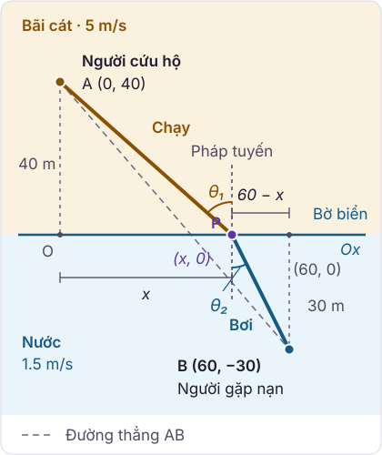
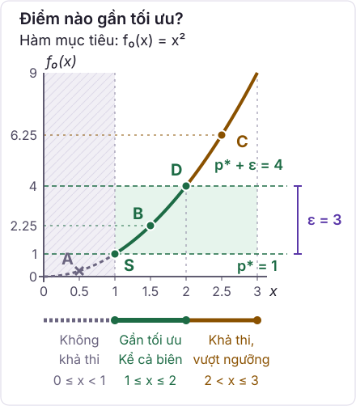

Mỗi ngày, chúng ta đưa ra hàng chục quyết định với mong muốn đạt được kết quả "tốt nhất có thể": Lựa chọn cung đường di chuyển để giảm thiểu thời gian tắc đường, phân bổ ngân sách và thời gian ôn luyện giữa các môn thi, hoặc xác định bộ trọng số tối ưu cho một mạng nơ-ron sâu trong trí tuệ nhân tạo. Tối ưu hóa toán học bắt đầu bằng một nhiệm vụ tưởng chừng hiển nhiên nhưng đòi hỏi sự chuẩn xác khắt khe: **Đặc tả hình thức bài toán**. 

Phần lớn thất bại khi giải quyết các bài toán tối ưu trong thực tế không xuất phát từ sự hạn chế của thuật toán tính toán, mà bắt nguồn từ việc mô hình toán học được thiết lập chưa phản ánh đúng bản chất câu hỏi cần giải quyết.

Bài giảng này trang bị ngôn ngữ nền tảng của lý thuyết tối ưu hóa: Phân biệt rạch ròi giữa biến quyết định, hàm mục tiêu và các ràng buộc. Đồng thời, chúng ta sẽ làm sáng tỏ sự khác biệt bản chất giữa giá trị tối ưu và nghiệm tối ưu, khảo sát các tình huống bài toán bất khả thi hoặc không bị chặn, và phân tích ranh giới cốt lõi giữa cực tiểu cục bộ (local minimum) với cực tiểu toàn cục (global minimum).

---

## 1. Bài toán Người cứu hộ

Một người cứu hộ đang đứng trên bãi cát, cách bờ biển $40\text{ m}$, thì phát hiện một người bơi bị chuột rút đang gặp nạn ngoài khơi. Người bị nạn ở vị trí cách bờ biển $30\text{ m}$ và lệch $60\text{ m}$ dọc theo bờ so với vị trí của người cứu hộ. Trên cát, người cứu hộ có thể chạy với vận tốc $5\text{ m/s}$, nhưng khi xuống nước chỉ có thể bơi với vận tốc $1.5\text{ m/s}$. 

Câu hỏi đặt ra là: **Người cứu hộ nên chạy tới vị trí nào trên đường bờ biển rồi mới lao xuống nước để tiếp cận người bị nạn trong thời gian ngắn nhất?**

### Phân tích hai trực giác ban đầu
Khi đối diện với bài toán này, trực giác thường đưa ra hai phương án đối lập, và cả hai đều chưa phải là phương án tối ưu:
1. **Phương án đường thẳng ngắn nhất**: Chạy và bơi thẳng một mạch từ vị trí đứng đến chỗ người bị nạn ($AB$). Quãng đường này ngắn nhất về mặt hình học ($\sqrt{60^2 + 70^2} \approx 92.2\text{ m}$), nhưng người cứu hộ phải bơi tới gần $39.5\text{ m}$ dưới nước. Vì tốc độ bơi rất chậm ($1.5\text{ m/s}$), riêng quãng bơi đã tốn tới $26.3\text{ s}$, đưa tổng thời gian lên khoảng $36.88\text{ s}$.
2. **Phương án giảm thiểu quãng bơi**: Chạy dọc bờ cát đến đúng vị trí đối diện người bị nạn rồi mới bơi vuông góc ra khơi để quãng đường bơi ngắn nhất có thể ($30\text{ m}$). Lộ trình này tốn khoảng $34.42\text{ s}$, nhanh hơn đường thẳng, nhưng vẫn chưa phải là lộ trình nhanh nhất.

Phương án tối ưu thực sự đạt được tại điểm cân bằng hài hòa giữa hai xu hướng hình học trên. Để tìm ra nó, ta cần chuyển hóa bài toán thực tế thành ngôn ngữ toán học.

### Thiết lập mô hình toán học
Chọn hệ trục tọa độ với trục hoành $Ox$ trùng với đường bờ biển (ranh giới giữa cát và nước), chiều dương hướng từ trái sang phải, đơn vị đo là mét.
- Vị trí người cứu hộ: Điểm $A(0, 40)$ trên bãi cát ($y \ge 0$).
- Vị trí người bị nạn: Điểm $B(60, -30)$ dưới nước ($y < 0$).
- Vị trí tiếp nước: Điểm rẽ $P(x, 0)$ trên đường bờ biển với hoành độ $0 \le x \le 60$.

  

**Hình 1.1: Lộ trình của người cứu hộ.** Đoạn $AP$ là quãng đường chạy trên cát, còn đoạn $PB$ là quãng đường bơi dưới nước. Các góc $\theta_1$ và $\theta_2$ được đo với **pháp tuyến**, tức đường thẳng vuông góc với bờ biển tại điểm tiếp nước.

Điểm $P$ trong hình minh họa một vị trí tiếp nước khả thi. Để tìm lộ trình nhanh nhất, ta sẽ chọn vị trí này sao cho tổng thời gian chạy và bơi nhỏ nhất.

Giả sử trong mỗi môi trường, người cứu hộ chuyển động theo đường thẳng với vận tốc không đổi. Khi đó, toàn bộ lộ trình được xác định duy nhất bởi hoành độ $x$ của vị trí tiếp nước $P(x, 0)$. 

Tổng thời gian di chuyển là một hàm số theo biến $x$:

$$
T(x) = \frac{\sqrt{40^2 + x^2}}{5} + \frac{\sqrt{30^2 + (60 - x)^2}}{1.5}, \qquad 0 \le x \le 60.
$$

Trong đó:
- Số hạng thứ nhất $\frac{\sqrt{40^2 + x^2}}{5} = \frac{|AP|}{v_1}$ là thời gian chạy trên cát từ $A$ tới $P$.
- Số hạng thứ hai $\frac{\sqrt{30^2 + (60 - x)^2}}{1.5} = \frac{|PB|}{v_2}$ là thời gian bơi dưới nước từ $P$ tới $B$.

Khi $x$ tăng lên, quãng đường chạy trên cát dài thêm nhưng quãng đường bơi dưới nước ngắn lại. Hai số hạng tạo ra một lực giằng co đối nghịch theo biến $x$, và nghiệm tối ưu chính là điểm cân bằng lý tưởng của cuộc giằng co này.

Giải bài toán trên, ta thu được nghiệm tối ưu:
$$
x^\star \approx 52.6\text{ m}, \qquad T(x^\star) \approx 33.82\text{ s}.
$$
Tại nghiệm này, người cứu hộ chạy khoảng $66.1\text{ m}$ trên cát (mất $13.22\text{ s}$), sau đó bơi khoảng $30.9\text{ m}$ dưới nước (mất $20.60\text{ s}$). So với phương án đi theo đường thẳng ($36.88\text{ s}$), người cứu hộ tới nơi sớm hơn khoảng $3.06\text{ s}$, rút ngắn hơn 8% thời gian cứu nạn.

*Lưu ý*: Những giả thiết vừa đặt ra là của người lập mô hình toán học nhằm phản ánh các yếu tố trọng yếu nhất. Trong thực tế, bãi biển có thể có sóng ngầm, dòng chảy siết hoặc vùng nước nông có thể lội nhanh hơn bơi. Mỗi chi tiết thực tế được bổ sung sẽ điều chỉnh hàm mục tiêu $T(x)$ và dịch chuyển nghiệm tối ưu tương ứng.

<LifeguardLab />

### Tính tối ưu tuyệt đối của lộ trình hai đoạn thẳng
Tại đây xuất hiện một câu hỏi sâu sắc về bản chất tối ưu: Con số $33.82\text{ s}$ là tốt nhất trong họ các lộ trình gồm hai đoạn thẳng gấp khúc. Liệu một lộ trình uốn lượn đường cong mềm mại nào đó có thể giúp người cứu hộ tới nơi sớm hơn không?

Câu trả lời là **không thể**, và lập luận toán học hoàn toàn sáng rõ:
- Giả sử người cứu hộ chọn một quỹ đạo tùy ý từ $A$ tới $B$. Gọi $P$ là điểm cuối cùng mà quỹ đạo đó tiếp xúc với đường bờ biển trước khi xuống nước hẳn.
- Từ $P$ tới $B$, toàn bộ chuyển động diễn ra dưới nước với vận tốc không vượt quá $1.5\text{ m/s}$. Quãng đường ngắn nhất giữa hai điểm trong không gian Euclid là đoạn thẳng, do đó thời gian bơi luôn tốn ít nhất $|PB| / 1.5$ giây.
- Trước khi tới $P$, vận tốc di chuyển ở bất kỳ đâu cũng không vượt quá vận tốc tối đa trên cát ($5\text{ m/s}$). Do đó thời gian di chuyển từ $A$ tới $P$ luôn tốn ít nhất $|AP| / 5$ giây.
- Cộng hai vế lại, tổng thời gian của bất kỳ lộ trình nào cũng bị chặn dưới bởi $T(x_P)$, trong đó $x_P$ là hoành độ của điểm tiếp bờ $P$. Vì $T(x_P) \ge T(x^\star) \approx 33.82\text{ s}$ với mọi $x_P \in [0, 60]$, nên không một đường cong nào có thể nhanh hơn lộ trình hai đoạn thẳng $A \to P^\star \to B$.

::: tip Nguyên lý phương pháp luận tối ưu
Một phương án chỉ được khẳng định chắc chắn là **tối ưu toàn cục** khi ta chứng minh được một **ngưỡng chặn lý thuyết** đúng cho toàn bộ mọi phương án khả thi, và phương án được chọn đã chạm tới đúng ngưỡng chặn lý thuyết đó.
:::

### Mối liên hệ tự nhiên với Định luật khúc xạ Snell
Đạo hàm bậc nhất của hàm thời gian $T(x)$ theo $x$ là:

$$
T'(x) = \frac{x}{5\sqrt{40^2 + x^2}} - \frac{60 - x}{1.5\sqrt{30^2 + (60 - x)^2}}.
$$

Quan sát các tam giác vuông trong Hình 1.1:
- Gọi $\theta_1$ là góc giữa đoạn chạy $AP$ và pháp tuyến của bờ biển: $\sin\theta_1 = \frac{x}{\sqrt{40^2 + x^2}}$.
- Gọi $\theta_2$ là góc giữa đoạn bơi $PB$ và pháp tuyến của bờ biển: $\sin\theta_2 = \frac{60 - x}{\sqrt{30^2 + (60 - x)^2}}$.

Khi triệt tiêu đạo hàm $T'(x) = 0$, ta thu được một phương trình đẹp đẽ:

$$
\frac{\sin\theta_1}{5} = \frac{\sin\theta_2}{1.5} \iff \frac{\sin\theta_1}{v_1} = \frac{\sin\theta_2}{v_2}.
$$

Biểu thức này chính là dạng toán học kinh điển của [Định luật khúc xạ Snell](/wiki/dinh-luat-snell.md) trong quang học. Trong hiện tượng khúc xạ ánh sáng, tia sáng truyền giữa hai môi trường trong suốt với vận tốc truyền sóng khác nhau. Theo **Nguyên lý thời gian cực tiểu của Fermat**, tia sáng luôn tự động chọn đường đi sao cho thời gian truyền là nhỏ nhất. Tỉ số vận tốc chạy và bơi $5 / 1.5$ trong bài toán cứu hộ đóng vai trò hoàn toàn tương tự tỉ số vận tốc ánh sáng giữa hai môi trường.

Tại nghiệm tối ưu, $\theta_1 \approx 52.8^\circ$ còn $\theta_2 \approx 13.8^\circ$: Quãng chạy trên cát đi xiên nhiều để tận dụng tốc độ cao, trong khi quãng bơi dưới nước bẻ góc gần như vuông góc với bờ biển để giảm thiểu quãng đường bơi chậm.

### Từ phương trình đại số đến phương pháp tối ưu số học
Khi bình phương hai vế để khử căn thức trong phương trình $T'(x) = 0$, ta thu được một phương trình đại số bậc bốn đầy đủ theo biến $x$. 

Mặc dù phương trình bậc bốn về mặt lý thuyết có công thức nghiệm căn thức Ferrari, nhưng biểu thức giải tích đó quá cồng kềnh và nhạy cảm với sai số làm tròn số học. Trong thực tế tính toán khoa học và trí tuệ nhân tạo, người ta không bao giờ giải nghiệm tường minh đại số cho những bài toán này. Thay vào đó, các **thuật toán tối ưu số học (numerical optimization)** như phương pháp chia đôi (bisection), thuật toán lặp tiếp tuyến Newton-Raphson, hoặc thuật toán hạ gradient (gradient descent) được áp dụng để tìm ra nghiệm số $x^\star \approx 52.6\text{ m}$ với độ chính xác tùy ý chỉ trong vài micro-giây.

Đặc tính toán học cốt lõi bảo đảm điểm dừng duy nhất này chắc chắn là điểm cực tiểu toàn cục trên toàn bộ miền xác định (chứ không phải một điểm dừng cục bộ) chính là tính chất hình học mà chúng ta sẽ khảo sát sâu ở các chủ đề tiếp theo: **Hàm thời gian $T(x)$ là một hàm lồi (convex function)**.

### Ba trụ cột cốt lõi của một bài toán tối ưu
Bài học nhập môn cốt lõi của toàn bộ môn học tối ưu hóa nằm trọn vẹn trong ví dụ trực quan này. Trước khi bắt tay vào tìm lời giải hay áp dụng bất kỳ thuật toán nào, ta bắt buộc phải định nghĩa tường minh ba trụ cột của bài toán:
1. **Biến quyết định (Ta được quyền lựa chọn đại lượng nào?):** Vị trí tiếp nước $x$ trên đường bờ biển.
2. **Hàm mục tiêu (Tiêu chuẩn tối thượng cần tối thiểu hay tối đa hóa là gì?):** Giảm thiểu tối đa tổng thời gian di chuyển $T(x)$.
3. **Ràng buộc (Ranh giới giới hạn không gian hành động là gì?):** Vận tốc tối đa trong từng môi trường và khoảng bờ biển cho phép tiếp nước $0 \le x \le 60$.

Chỉ cần thay đổi một trong ba trụ cột này, bản chất toán học của bài toán sẽ lập tức biến đổi hoàn toàn. Chẳng hạn, nếu mục tiêu chuyển thành "quãng đường ngắn nhất" thay vì "thời gian ngắn nhất", đoạn thẳng $AB$ sẽ lập tức trở thành nghiệm tối ưu!

---

## 2. Dạng tổng quát của một bài toán tối ưu

Trong lý thuyết tối ưu hóa toán học, một bài toán tối ưu tổng quát được biểu diễn dưới dạng chuẩn tắc (standard form) như sau:

$$
\begin{aligned}
\text{minimize}\quad & f_0(x)\\
\text{subject to}\quad & f_i(x) \le 0, \quad i = 1, \ldots, m,\\
& h_i(x) = 0, \quad i = 1, \ldots, p.
\end{aligned}
$$

Trong đó:
- $x \in \mathbb{R}^n$ là **vector biến quyết định (optimization variables)**: Các đại lượng ta có quyền điều khiển.
- $f_0 : \mathbb{R}^n \to \mathbb{R}$ là **hàm mục tiêu (objective function)**, hay hàm chi phí (cost function): Thang đo đánh giá chất lượng của từng phương án (giá trị càng nhỏ càng tốt).
- $f_i(x) \le 0$ ($i = 1, \dots, m$) là các **ràng buộc bất đẳng thức (inequality constraints)**.
- $h_i(x) = 0$ ($i = 1, \dots, p$) là các **ràng buộc đẳng thức (equality constraints)**.

Khi bài toán không có ràng buộc ($m = p = 0$), ta gọi đó là **bài toán tối ưu không ràng buộc (unconstrained optimization)**.

Quy ước đưa vế phải về 0 và quy đổi về bất đẳng thức $\le$ hoàn toàn không làm mất tính tổng quát của bài toán:
- Ràng buộc $g(x) \le b$ được chuyển vế thành $g(x) - b \le 0$.
- Ràng buộc $g(x) \ge b$ được đổi dấu thành $b - g(x) \le 0$.

Chẳng hạn, bài toán cứu hộ ở Mục 1 có biến quyết định vô hướng $x$, hàm mục tiêu $f_0(x) = T(x)$, và hai ràng buộc bất đẳng thức $-x \le 0$ và $x - 60 \le 0$.

::: info Vì sao phải phân tách rạch ròi giữa Bất đẳng thức và Đẳng thức?
Về mặt thao tác đại số thuần túy, mọi ràng buộc đều có thể quy đổi qua lại lẫn nhau:
- Một ràng buộc đẳng thức $h(x) = 0$ có thể biểu diễn tương đương thành hai bất đẳng thức đồng thời: Cặp điều kiện $h(x) \le 0$ và $-h(x) \le 0$.
- Ngược lại, một bất đẳng thức $f(x) \le 0$ có thể chuyển thành đẳng thức bằng cách bổ sung một biến bù không âm (slack variable) $s \ge 0$: Phương trình $f(x) + s = 0$.

Tuy nhiên, trong lý thuyết tối ưu hóa và thực tiễn kỹ nghệ AI, người ta luôn luôn tách biệt rạch ròi hai nhóm ràng buộc $f_i(x) \le 0$ và $h_i(x) = 0$ bởi ba lý do nền tảng:

1. **Bản chất hình học không gian (Geometric Dimensionality):**
   - Ràng buộc đẳng thức $h_i(x) = 0$ làm **giảm số bậc tự do (số chiều)** của không gian tìm kiếm. Mỗi phương trình độc lập giam hãm nghiệm trên một mặt siêu cong mỏng dẹt (hypersurface) có số chiều $n - 1$.
   - Ràng buộc bất đẳng thức $f_i(x) \le 0$ phân chia không gian thành hai nửa: Miền hợp lệ (vùng bên trong và biên) và miền cấm. Không gian tìm kiếm vẫn giữ nguyên số chiều $n$ ban đầu.
2. **Độ ổn định số học và Giải thuật tính toán (Numerical Algorithm Stability):**
   - Nếu ta ép một đẳng thức thành hai bất đẳng thức $h(x) \le 0$ và $-h(x) \le 0$, miền khả thi sẽ bị "bóp nghẹt" thành một tập có **phần trong rỗng (empty interior)**. Điều này vi phạm nghiêm trọng điều kiện tiên quyết của các thuật toán điểm trong (Interior-point methods), tiêu biểu là điều kiện Slater, khiến hàm chắn logarit (log-barrier) và ma trận Hessian số học bị kỳ dị (phát nổ).
   - Giữ nguyên ràng buộc đẳng thức cho phép máy tính áp dụng các phép khử biến trực tiếp hoặc chiếu gradient lên không gian con trực giao (projected gradient) một cách ổn định và chuẩn xác.
3. **Bản chất ngữ nghĩa của dữ liệu thực tế (Physical & Data Semantics):**
   - Trong các bài toán thực tế, ràng buộc đẳng thức biểu thị các **định luật bảo toàn bất biến** của tự nhiên (bảo toàn năng lượng, cân bằng luồng mạng, tổng xác suất phân phối bằng 1).
   - Ràng buộc bất đẳng thức biểu thị các **giới hạn tài nguyên hữu hạn** (ngân sách chi tiêu, dung lượng bộ nhớ GPU, công suất trần của động cơ).
   
Việc giữ đúng bản chất ngữ nghĩa giúp mô hình trong sáng, dễ giải thích, và tạo điều kiện trực tiếp cho việc phân tích độ nhạy (sensitivity analysis) thông qua các nhân tử Lagrange tương ứng.
:::

### Phân biệt Biến quyết định và Dữ liệu bài toán
Một bài toán còn chứa các đại lượng không đổi trong suốt quá trình giải, chẳng hạn tọa độ $A(0, 40)$, $B(60, -30)$ và các vận tốc $5\text{ m/s}, 1.5\text{ m/s}$ trong bài toán cứu hộ. Chúng là **dữ liệu bài toán (problem data)** hay tham số, được cố định trước khi tìm nghiệm. 

Trong học máy, ranh giới này biến chuyển linh hoạt theo ngữ cảnh:
- Trong **pha huấn luyện (training phase)**: Vector trọng số mô hình $w$ là biến quyết định cần tối ưu, còn tập dữ liệu huấn luyện đóng vai trò là tham số cố định.
- Trong **pha suy luận (inference phase)**: Bộ trọng số $w$ đã được đóng băng cố định thành tham số, và vector đầu vào $x$ là dữ liệu mới cần xử lý.

Miền xác định của toàn bộ bài toán là giao của miền xác định của hàm mục tiêu và tất cả các hàm ràng buộc:
$$
\mathcal{D} = \operatorname{dom} f_0 \cap \left( \bigcap_{i=1}^m \operatorname{dom} f_i \right) \cap \left( \bigcap_{i=1}^p \operatorname{dom} h_i \right).
$$

---

## 3. Điểm khả thi, Miền khả thi và Giá trị tối ưu

Một điểm $x \in \mathcal{D}$ được gọi là **khả thi (feasible)** nếu nó thỏa mãn đồng thời tất cả các ràng buộc: Cả hai điều kiện $f_i(x) \le 0$ và $h_i(x) = 0$ đều được thỏa mãn. 

Tập hợp tất cả các điểm khả thi tạo thành **miền khả thi (feasible set)** $\mathcal{X}$. Khi $\mathcal{X} \ne \emptyset$, bài toán được gọi là **khả thi**. Trái lại, nếu $\mathcal{X} = \emptyset$, bài toán là **bất khả thi (infeasible)**.

### Định nghĩa Giá trị tối ưu qua Infimum
**Giá trị tối ưu (optimal value)** của bài toán được định nghĩa là:

$$
p^\star = \inf \{f_0(x) \mid x \in \mathcal{X}\}.
$$

Ký hiệu $\inf$ (infimum) biểu thị **cận dưới lớn nhất (greatest lower bound)**. Trong lý thuyết tối ưu hóa tổng quát, người ta sử dụng $\inf$ thay vì $\min$ bởi vì giá trị nhỏ nhất của một tập hợp có thể không đạt được, trong khi cận dưới lớn nhất luôn tồn tại xác định trên tập số thực mở rộng $\mathbb{R} \cup \{-\infty, +\infty\}$:
- Nếu bài toán bất khả thi ($\mathcal{X} = \emptyset$), theo quy ước toán học: Giá trị $p^\star = +\infty$ (vì không có bất kỳ lựa chọn hợp lệ nào, chi phí tối thiểu được xem là vô hạn).
- Nếu tồn tại một dãy điểm khả thi $x_k$ làm $f_0(x_k) \to -\infty$, thì $p^\star = -\infty$, và ta nói bài toán **không bị chặn dưới (unbounded below)**.

Một điểm khả thi $x^\star \in \mathcal{X}$ thỏa mãn $f_0(x^\star) = p^\star$ được gọi là **nghiệm tối ưu (optimal point / minimizer)**. Khi tồn tại ít nhất một nghiệm tối ưu, ta nói giá trị tối ưu **đạt được (attained)**. Tập hợp tất cả các nghiệm tối ưu được gọi là **tập tối ưu (optimal set)** $\mathcal{X}_{\mathrm{opt}}$.

### Ba tình huống kinh điển về sự tồn tại của nghiệm
Xét ba bài toán tối ưu một biến sau trên miền mở $x > 0$:

| Bài toán trên miền $x > 0$ | Giá trị tối ưu $p^\star$ | Nghiệm tối ưu $x^\star$ | Bản chất toán học |
| :--- | :---: | :---: | :--- |
| $\min f_0(x) = 1/x$ | $p^\star = 0$ | Không tồn tại | Bị chặn dưới bởi 0 nhưng không bao giờ chạm tới 0 khi $x \in (0, +\infty)$. |
| $\min f_0(x) = -\log x$ | $p^\star = -\infty$ | Không tồn tại | Bài toán không bị chặn dưới khi cho $x \to +\infty$. |
| $\min f_0(x) = x \log x$ | $p^\star = -1/e$ | $x^\star = 1/e$ | Giá trị tối ưu đạt được tại duy nhất một điểm dừng $f_0'(x) = \log x + 1 = 0$. |

Trường hợp thứ nhất ($f_0(x) = 1/x$) là minh chứng trực quan nhất: Bài toán có giá trị tối ưu hữu hạn ($p^\star = 0$) nhưng tập nghiệm tối ưu hoàn toàn rỗng!

<OptimumLab />

::: tip Thử thách tư duy: Tập đóng và Định lý Weierstrass
Nếu bài toán $\min x$ với ràng buộc $x > 0$ được chuyển thành $x \ge 0$, điều gì sẽ xảy ra với nghiệm tối ưu?
:::

Xem phân tích chi tiết

Với $x > 0$, giá trị tối ưu là $p^\star = 0$ nhưng không đạt được vì điểm $0$ không thuộc miền khả thi. Khi đổi thành $x \ge 0$, điểm $0$ trở thành phương án khả thi và đạt đúng giá trị $0$, biến $x^\star = 0$ thành nghiệm tối ưu duy nhất!

Hai miền khả thi chỉ khác nhau đúng một điểm biên, nhưng đó lại chính là điểm tụ mà mọi phương án cải thiện đều hướng về. Theo **Định lý Weierstrass**, một hàm số liên tục trên một tập khả thi đóng và bị chặn (tập compact) khác rỗng luôn luôn đạt giá trị nhỏ nhất toàn cục. Đây là lý do trong thực tế, các ràng buộc bất đẳng thức luôn được thiết lập dưới dạng $\le$ thay vì $<$ để bảo đảm miền khả thi là một tập đóng.

---

## 4. Nghiệm $\varepsilon$-gần tối ưu và Tiêu chí dừng thuật toán

Trong tính toán số học trên máy tính, các thuật toán lặp hầu như không bao giờ chạm tới nghiệm chính xác tuyệt đối $p^\star$ do giới hạn độ chính xác dấu phẩy động. Do đó, trong lý thuyết tối ưu hóa người ta định nghĩa khái niệm **nghiệm $\varepsilon$-gần tối ưu ($\varepsilon$-suboptimal point)**:

Một điểm khả thi $x \in \mathcal{X}$ được gọi là $\varepsilon$-gần tối ưu nếu:
$$
f_0(x) \le p^\star + \varepsilon \qquad (\varepsilon > 0).
$$

Vì đây là bài toán cực tiểu, mọi điểm khả thi đều có giá trị mục tiêu không nhỏ hơn $p^\star$. Khi $p^\star$ hữu hạn, điều kiện gần tối ưu vì thế có thể viết thành:

$$
\begin{aligned}
p^\star &\le f_0(x), \\
f_0(x) &\le p^\star + \varepsilon.
\end{aligned}
$$

Trên trục giá trị mục tiêu, ta cần tìm một điểm khả thi có giá trị nằm trong đoạn từ $p^\star$ đến $p^\star+\varepsilon$, kể cả hai đầu mút. Điều kiện $f_0(x)\ge p^\star$ riêng lẻ chưa cho biết điểm đó đã đủ gần tối ưu hay chưa.

::: example Phân biệt điểm đạt yêu cầu, vượt ngưỡng và không khả thi
Xét bài toán cực tiểu $f_0(x)=x^2$ trên miền khả thi $\mathcal{X}=[1,3]$. Vì $x^2\ge 1$ trên miền này và dấu bằng đạt tại $x=1$, ta có $p^\star=1$. Chọn $\varepsilon=3$, khi đó ngưỡng chấp nhận là $p^\star+\varepsilon=4$.

::: info Cách đọc hình
Trục ngang biểu diễn vị trí $x$, còn trục đứng biểu diễn giá trị $f_0(x)$. Mỗi điểm được đặt tại tọa độ $(x,f_0(x))$. Vùng vạch xiên ở bên trái ứng với $x<1$, nên các điểm trong vùng đó bị loại trước khi xét sai số. Đoạn cong màu xanh là phần vừa khả thi vừa gần tối ưu. Đoạn cong màu nâu vẫn khả thi nhưng vượt ngưỡng đã chọn.

Hai đường ngang đánh dấu $p^\star=1$ và $p^\star+\varepsilon=4$. **Khoảng cách theo trục đứng** giữa chúng là $\varepsilon=3$. Dải xanh nhạt biểu diễn các giá trị mục tiêu từ $1$ đến $4$, nhưng một điểm nằm trong dải này vẫn phải thỏa ràng buộc mới được chấp nhận. Sai số $\varepsilon$ đo độ chênh lệch của giá trị mục tiêu, không phải khoảng cách giữa hai vị trí trên trục $x$.
:::

**Xét từng điểm trên đồ thị:**

- **Điểm A: Không khả thi.** Tại $x=0.5$, ta có $f_0(x)=0.25$. Giá trị này thấp hơn $p^\star$, nhưng $0.5\notin[1,3]$. Vì vậy, A không được gọi là điểm tối ưu hay gần tối ưu của bài toán, dù nó nằm dưới cả hai đường mức.
- **Điểm S: Tối ưu.** Tại $x=1$, ta có $f_0(x)=1=p^\star$. Điểm này khả thi và độ chênh lệch so với giá trị tối ưu bằng $0$, nên cũng thỏa điều kiện gần tối ưu.
- **Điểm B: Gần tối ưu.** Tại $x=1.5$, ta có $f_0(x)=2.25$. Điểm này khả thi và nằm giữa hai đường mức. Độ chênh lệch là $2.25-1=1.25$, nhỏ hơn $\varepsilon=3$.
- **Điểm D: Đúng ngưỡng, vẫn được chấp nhận.** Tại $x=2$, ta có $f_0(x)=4$. Điểm này khả thi và nằm trên đường mức trên. Độ chênh lệch là $4-1=3=\varepsilon$. Vì định nghĩa dùng dấu $\le$, D vẫn là điểm gần tối ưu.
- **Điểm C: Khả thi nhưng không gần tối ưu.** Tại $x=2.5$, ta có $f_0(x)=6.25$. Điểm này thuộc miền khả thi, nhưng nằm phía trên đường mức trên. Độ chênh lệch là $6.25-1=5.25$, lớn hơn $\varepsilon=3$. Điều kiện $f_0(x)\ge p^\star$ đúng nhưng chưa đủ để chấp nhận C.

**Các khoảng trên trục ngang:** Vì $x$ dương trên miền khả thi, điều kiện $x^2\le 4$ tương đương với $x\le 2$. Do đó:

- **Đoạn $[1,2]$: Khả thi và gần tối ưu.** Cả hai đầu mút đều được tính vào. Đầu trái là điểm tối ưu S, còn đầu phải là điểm D có sai số đúng bằng $\varepsilon$.
- **Khoảng $(2,3]$: Khả thi nhưng vượt ngưỡng.** Đầu trái $2$ không thuộc khoảng này vì D vẫn đạt yêu cầu. Đầu phải $3$ thuộc miền khả thi, nhưng có giá trị mục tiêu $9>4$.
- **Ngoài đoạn $[1,3]$: Không khả thi.** Hình chỉ hiển thị phần $0\le x\le 3$, nên vùng vạch xiên minh họa phần bị loại ở bên trái. Các giá trị $x<0$ hoặc $x>3$ cũng không thuộc miền khả thi của bài toán.

Với một điểm khả thi, trường hợp $f_0(x)<p^\star$ không thể xảy ra. Nếu thêm điều kiện $f_0(x)\le p^\star$, ta buộc phải có $f_0(x)=p^\star$, tức là điểm tối ưu. Điểm A cho thấy vì sao ta phải kiểm tra ràng buộc trước khi so sánh giá trị mục tiêu với bất kỳ ngưỡng nào.
:::

Khái niệm này đóng vai trò quyết định trong việc thiết lập **tiêu chí dừng (stopping criteria)** của các thuật toán: Nếu ta tìm được một chặn dưới lý thuyết $\ell \le p^\star$ (thường xuất phát từ bài toán đối ngẫu Lagrange) và một điểm khả thi $x$ thỏa mãn:
$$
f_0(x) - \ell \le \varepsilon,
$$
thì ta có thể khẳng định chắc chắn $100\%$ rằng điểm $x$ đang xét là $\varepsilon$-gần tối ưu, ngay cả khi ta chưa hề biết giá trị chính xác của $p^\star$!

Trong ví dụ trên, $\ell=0$ là một chặn dưới hợp lệ. Tại điểm B, ta có $f_0(1.5)-\ell=2.25\le 3$, nên tiêu chí dừng chứng nhận được điểm này. Tại $x=2$, khoảng cách đến chặn dưới là $4>3$, dù điểm đó vẫn gần tối ưu với sai số đã chọn. Như vậy, tiêu chí dùng chặn dưới là điều kiện đủ. Nếu tiêu chí chưa thỏa, ta chưa thể kết luận điểm đang xét không gần tối ưu.

Quay lại bài toán người cứu hộ: Vì $\sqrt{40^2 + x^2} \ge 40$ và $\sqrt{30^2 + (60 - x)^2} \ge 30$, nên mọi phương án di chuyển đều tốn ít nhất:
$$
\ell = \frac{40}{5} + \frac{30}{1.5} = 8 + 20 = 28\text{ s}.
$$
Do đó $\ell = 28\text{ s}$ là một chặn dưới hợp lệ của $p^\star$. Phương án chạy đến $x = 60$ rồi bơi thẳng tốn khoảng $34.42\text{ s}$. Không cần giải phương trình đạo hàm, ta đã biết chắc chắn phương án này cách nghiệm tối ưu không quá $34.42 - 28 = 6.42\text{ s}$. Kỹ thuật kẹp giá trị tối ưu giữa một điểm khả thi và một cận dưới đối ngẫu chính là linh hồn của lý thuyết Đối ngẫu Lagrange ở Bài 03.

---

## 5. Cực tiểu cục bộ và Cực tiểu toàn cục

Trong bài toán tối ưu tổng quát, ta cần phân biệt rạch ròi hai cấp độ tối ưu:
- **Tối ưu toàn cục (Global optimum)**: Điểm $x^\star \in \mathcal{X}$ thỏa mãn $f_0(x^\star) \le f_0(z)$ với **mọi** $z \in \mathcal{X}$.
- **Tối ưu cục bộ (Local optimum)**: Điểm $x \in \mathcal{X}$ chỉ tốt hơn các phương án khả thi nằm trong một lân cận bán kính $R > 0$ quanh nó:
  $$
  f_0(x) \le f_0(z) \qquad \forall z \in \mathcal{X} \text{ thỏa mãn } \|z - x\|_2 \le R.
  $$

Trong toàn bộ môn học này, khi dùng từ "nghiệm tối ưu" mà không kèm định ngữ, ta luôn mặc định hiểu là **nghiệm tối ưu toàn cục**.

<svg viewBox="0 0 600 220" width="100%" height="auto" style="max-width: 600px; background: var(--vp-c-bg-soft, #f8fafc); border-radius: 8px; border: 1px solid var(--vp-c-divider, #e2e8f0);">
  <!-- Đồ thị hàm số hai thung lũng -->
  <path d="M 50 40 C 100 20, 130 190, 190 190 C 250 190, 290 80, 360 80 C 430 80, 470 140, 520 140 C 550 140, 570 60, 580 40" fill="none" stroke="#2563eb" stroke-width="2.5" />
  
  <!-- Cực tiểu toàn cục -->
  <circle cx="190" cy="190" r="5" fill="#16a34a" />
  <line x1="190" y1="190" x2="190" y2="20" stroke="#16a34a" stroke-width="1.2" stroke-dasharray="3,3" />
  <text x="130" y="210" font-size="12" font-weight="700" fill="#16a34a">Cực tiểu toàn cục (x*)</text>
  
  <!-- Cực đại cục bộ -->
  <circle cx="360" cy="80" r="4" fill="#dc2626" />
  <text x="325" y="70" font-size="12" font-weight="600" fill="#dc2626">Cực đại cục bộ</text>
  
  <!-- Cực tiểu cục bộ -->
  <circle cx="520" cy="140" r="5" fill="#d97706" />
  <line x1="520" y1="140" x2="520" y2="20" stroke="#d97706" stroke-width="1.2" stroke-dasharray="3,3" />
  <text x="460" y="165" font-size="12" font-weight="700" fill="#d97706">Cực tiểu cục bộ (Bẫy)</text>
</svg>

  <strong>Hình 1.2:</strong> Đồ thị hàm không lồi với hai lòng máng cực tiểu. Thuật toán leo đồi hoặc hạ gradient cục bộ có thể bị giữ chân và hội tụ nhầm tại cực tiểu cục bộ bên phải.

Xét hàm số $f(x) = x^4 - 4x^2 + x$:
- Điểm $x \approx 1.35$ có $f(x) \approx -2.62$ là một cực tiểu cục bộ.
- Điểm $x \approx -1.47$ có $f(x) \approx -5.44$ là cực tiểu toàn cục.

Nếu một thuật toán tối ưu chỉ dựa trên thông tin gradient cục bộ tại vị trí hiện tại và xuất phát ở phía bên phải, nó sẽ nhanh chóng trượt xuống đáy $x \approx 1.35$ và dừng lại mà hoàn toàn không hay biết rằng ở phía bên trái tồn tại một thung lũng sâu hơn rất nhiều.

Sự khác biệt giữa cục bộ và toàn cục chính là thách thức lớn nhất của tối ưu hóa phi tuyến tổng quát. Định lý nền tảng hóa giải trọn vẹn nguy cơ rơi vào bẫy cực tiểu cục bộ chính là: **Trong bài toán tối ưu lồi, mọi cực tiểu cục bộ đều là cực tiểu toàn cục!**

---

## 6. Ràng buộc chặt, Ràng buộc thừa và Bài toán khả thi

Tại một điểm khả thi $x \in \mathcal{X}$:
- Ràng buộc bất đẳng thức $f_i(x) \le 0$ được gọi là **chặt (active / binding)** nếu dấu đẳng thức xảy ra: $f_i(x) = 0$.
- Ngược lại, nếu $f_i(x) < 0$, ràng buộc được gọi là **không chặt (inactive)**.
- Mọi ràng buộc đẳng thức $h_i(x) = 0$ luôn chặt tại mọi điểm khả thi.

*Ý nghĩa hình học*: Ràng buộc chặt là ràng buộc mà điểm nghiệm đang chạm trực tiếp vào đường biên giới hạn của nó. Trong khi đó, ràng buộc không chặt vẫn còn một khoảng hở an toàn.

::: example Minh họa ràng buộc chặt và ràng buộc không chặt
Xét bài toán tìm giá trị vô hướng $c$ khớp với ba số thực $1, 5, 6$:
$$
\min_c\ (c - 1)^2 + (c - 5)^2 + (c - 6)^2.
$$
- Khi chưa có ràng buộc: Đạo hàm $6c - 24 = 0 \implies c = 4$ (trung bình cộng), hàm mục tiêu đạt giá trị $14$.
- Nếu bổ sung ràng buộc $c \le 3$: Điểm $c = 4$ không còn khả thi. Trên miền $c \le 3$, hàm mục tiêu nghịch biến nên nghiệm bị đẩy về biên $c^\star = 3$, giá trị mục tiêu tăng lên $17$. Ràng buộc $c \le 3$ **chặt** tại nghiệm và nó trực tiếp định hình nghiệm tối ưu.
- Nếu bổ sung ràng buộc $c \le 5$: Điểm $c = 4$ vẫn khả thi và thỏa mãn $4 \le 5$. Nghiệm tối ưu giữ nguyên là $c^\star = 4$. Ràng buộc $c \le 5$ **không chặt** tại nghiệm.
:::

Một ràng buộc được gọi là **thừa (redundant)** nếu việc loại bỏ nó không làm thay đổi miền khả thi $\mathcal{X}$. Cần lưu ý: Một ràng buộc không chặt tại nghiệm tối ưu vẫn có thể **không thừa**, vì nó vẫn làm nhiệm vụ cắt bỏ một phần không gian ở các vùng khác.

### Bài toán khả thi (Feasibility Problem)
Khi hàm mục tiêu đồng nhất bằng 0 ($f_0(x) \equiv 0$), giá trị tối ưu của bài toán chỉ có thể nhận hai giá trị:
- $p^\star = 0$ nếu miền khả thi $\mathcal{X} \ne \emptyset$.
- $p^\star = +\infty$ nếu miền khả thi $\mathcal{X} = \emptyset$.

Bài toán khi đó được gọi là **Bài toán khả thi**:

$$
\begin{aligned}
\text{find}\quad & x\\
\text{subject to}\quad & f_i(x) \le 0, \quad i = 1, \ldots, m,\\
& h_i(x) = 0, \quad i = 1, \ldots, p.
\end{aligned}
$$

Bài toán khả thi không tìm kiếm phương án tốt nhất, mà trả lời câu hỏi tiên quyết: *Hệ ràng buộc có mâu thuẫn hay không, và nếu không thì hãy chỉ ra ít nhất một điểm khả thi.* Trong thực tế, nhiều thuật toán giải tối ưu phức tạp (như Pha 1 của thuật toán Simplex hay phương pháp điểm trong) bắt buộc phải giải một bài toán khả thi trước để tìm điểm xuất phát hợp lệ.

---

## 7. Bài toán Cực đại và các Phép biến đổi tương đương

Theo quy ước chuẩn tắc quốc tế trong lý thuyết tối ưu hóa, ta luôn thống nhất làm việc với bài toán cực tiểu hóa. Một bài toán cực đại hóa hàm mục tiêu $f_0(x)$ được chuyển đổi tự nhiên sang bài toán cực tiểu tương đương:

$$
\max_{x \in \mathcal{X}} f_0(x) \iff \min_{x \in \mathcal{X}} \big( -f_0(x) \big).
$$

Hai bài toán có **cùng tập nghiệm tối ưu**, trong khi giá trị tối ưu đổi dấu:
$$
p^\star_{\max} = - p^\star_{\min}.
$$

Trong học máy, phép biến đổi này được áp dụng liên tục: Thay vì cực đại hóa hàm hợp lý của mô hình trên tập dữ liệu (Maximum Likelihood Estimation - MLE), người ta cực tiểu hóa hàm đối số âm log-likelihood (Negative Log-Likelihood - NLL):
$$
\max_\theta \prod_{i=1}^N P(y_i \mid x_i; \theta) \iff \min_\theta \sum_{i=1}^N -\log P(y_i \mid x_i; \theta).
$$
Phép lấy logarit biến tích thành tổng và bảo toàn nguyên vẹn vị trí cực trị nhờ tính đồng biến ngặt của hàm $\log$.

---

## 8. Ba dạng bài toán thực tế điển hình

Bảng dưới đây minh họa cách mô hình hóa ba bài toán kỹ nghệ điển hình dưới cùng một khuôn dạng toán học:

| Lĩnh vực ứng dụng | Biến quyết định $x$ | Hàm mục tiêu $f_0(x)$ | Các ràng buộc tiêu biểu |
| :--- | :--- | :--- | :--- |
| **Phân bổ danh mục đầu tư tài chính** | Tỷ trọng vốn đầu tư vào từng mã tài sản | Mức độ rủi ro (phương sai danh mục $\sigma^2$) | Tổng tỷ trọng bằng $1$, không bán khống ($x_i \ge 0$), lợi nhuận kỳ vọng đạt ngưỡng mục tiêu. |
| **Thiết kế vi mạch tích hợp (VLSI)** | Kích thước hình học (chiều rộng, chiều dài) từng cổng logic | Tổng công suất tiêu thụ điện năng | Giới hạn dung sai chế tạo bán dẫn, diện tích chip tối đa, trễ đường truyền tín hiệu không vượt ngưỡng. |
| **Huấn luyện mô hình học máy** | Vector trọng số và bias của mạng nơ-ron | Hàm mất mát (MSE, Cross-entropy) cộng số hạng điều chuẩn | Giới hạn chuẩn trọng số ($L_2, L_1$), ràng buộc phi âm cho các tham số xác suất. |

::: info Lưu ý: Nguyên lý mô hình hóa trong AI
**Lời giải tối ưu chỉ có giá trị khi mô hình toán học phản ánh trung thực bài toán thực tế.** Một mô hình khớp hoàn hảo dữ liệu huấn luyện (loss bằng 0) vẫn có thể thất bại thảm hại khi triển khai thực tế nếu tiêu chí tối ưu hóa không bao hàm khả năng khái quát hóa (generalization) trên dữ liệu mới.
:::

---

## 9. Những câu hỏi để đào sâu bản chất

**Câu 1.** Khẳng định *"Một bài toán tối ưu có giá trị tối ưu hữu hạn thì chắc chắn tồn tại nghiệm tối ưu"* là đúng hay sai? Hãy nêu một điều kiện đủ để khẳng định trở thành đúng.

Xem phân tích chi tiết

Khẳng định trên là **sai**. Phản ví dụ kinh điển: $\min_{x \in \mathbb{R}} e^x$. Vì $e^x > 0$ với mọi $x$ và tiến dần về $0$ khi $x \to -\infty$, giá trị tối ưu là $p^\star = 0$ (hữu hạn), nhưng không tồn tại bất kỳ số thực $x$ nào để $e^x = 0$. Tập nghiệm tối ưu là rỗng.

Để khẳng định đúng, theo **Định lý Weierstrass**: Hàm mục tiêu $f_0(x)$ phải liên tục và miền khả thi $\mathcal{X}$ phải là một tập **khác rỗng, đóng và bị chặn (tập compact)**. Trong phản ví dụ trên, miền $\mathbb{R}$ đóng nhưng không bị chặn.

**Câu 2.** Bài toán $\min (x - 1)^2$ với ràng buộc $x^2 \le 4$ có bao nhiêu ràng buộc chặt tại nghiệm? Nếu đổi ràng buộc thành $x^2 \le 1/4$ thì kết luận thay đổi thế nào?

Xem phân tích chi tiết

- Với $x^2 \le 4 \iff x \in [-2, 2]$: Điểm cực tiểu không ràng buộc $x = 1$ nằm gọn bên trong khoảng $(-2, 2)$. Do đó nghiệm tối ưu là $x^\star = 1$, giá trị tối ưu bằng $0$. Tại điểm này, $1^2 - 4 = -3 < 0$, ràng buộc **không chặt**.
- Với $x^2 \le 1/4 \iff x \in [-1/2, 1/2]$: Hàm $(x - 1)^2$ nghịch biến trên đoạn này, do đó nghiệm tối ưu bị đẩy sát biên phải $x^\star = 1/2$ với giá trị $(1/2 - 1)^2 = 1/4$. Ràng buộc $(1/2)^2 = 1/4$ trở thành **chặt**.

**Câu 3.** Trong bài toán người cứu hộ, nếu vận tốc bơi dưới nước bằng đúng vận tốc chạy trên cát ($v_1 = v_2$) thì lộ trình tối ưu là gì? Nếu ngược lại, người cứu hộ có ca nô chạy trên nước với vận tốc $5\text{ m/s}$ trong khi bãi cát lún chỉ đi được $1.5\text{ m/s}$ thì lộ trình thay đổi thế nào?

Xem phân tích chi tiết

- Khi $v_1 = v_2 = v$: Hàm thời gian $T(x) = \frac{1}{v}(|AP| + |PB|)$. Tối thiểu hóa thời gian trùng với tối thiểu hóa quãng đường hình học. Theo bất đẳng thức tam giác, $|AP| + |PB| \ge |AB|$, dấu bằng xảy ra khi $P$ nằm chính xác trên đoạn thẳng $AB$. Điểm tiếp nước tối ưu là giao điểm của $AB$ với bờ biển ($x = 240/7 \approx 34.29\text{ m}$). Hệ thức Snell khi đó cho $\sin\theta_1 = \sin\theta_2 \implies \theta_1 = \theta_2$, hai đoạn nối tiếp thẳng hàng không bị bẻ góc.
- Khi $v_1 = 1.5\text{ m/s}$ (cát) và $v_2 = 5\text{ m/s}$ (nước): Vì $v_2 > v_1$, hệ thức Snell $\frac{\sin\theta_1}{1.5} = \frac{\sin\theta_2}{5}$ buộc $\theta_2 > \theta_1$. Lộ trình tối ưu sẽ đi gần như vuông góc qua bãi cát để xuống nước sớm nhất, rồi chạy xiên với tốc độ cao trên mặt nước ($x^\star \approx 10.6\text{ m}$). Quy tắc trực giác: **Đi xiên ở môi trường nhanh, đi vuông góc với mặt phân cách ở môi trường chậm.**

**Câu 4.** Hãy tìm một bài toán tối ưu khả thi, bị chặn dưới, có nghiệm, nhưng tập tối ưu chứa vô số điểm.

Xem phân tích chi tiết

Xét bài toán $\min f_0(x) = \max\{0, |x| - 1\}$ trên $\mathbb{R}$. Hàm số nhận giá trị bằng $0$ trên toàn bộ đoạn $[-1, 1]$ và nhận giá trị dương bên ngoài đoạn này. Do đó, giá trị tối ưu là $p^\star = 0$, và tập nghiệm tối ưu là toàn bộ đoạn thẳng $\mathcal{X}_{\mathrm{opt}} = [-1, 1]$ gồm vô số điểm. Điều này chứng minh rằng tập nghiệm tối ưu không nhất thiết phải là một điểm đơn lẻ, mà có thể là một tập lồi liên tục.

**Câu 5.** Hai bài toán $\min f_0(x)$ và $\min e^{f_0(x)}$ trên cùng một miền khả thi $\mathcal{X}$ có cùng tập nghiệm tối ưu không? Có cùng giá trị tối ưu không?

Xem phân tích chi tiết

- **Cùng tập nghiệm tối ưu**: Vì hàm số $g(u) = e^u$ là hàm đồng biến ngặt trên $\mathbb{R}$, thứ tự giữa các giá trị được bảo toàn tuyệt đối: $f_0(x) \le f_0(y) \iff e^{f_0(x)} \le e^{f_0(y)}$. Do đó mọi điểm cực tiểu của bài toán này cũng là điểm cực tiểu của bài toán kia.
- **Giá trị tối ưu khác nhau**: Chúng liên hệ qua công thức $p^\star_2 = e^{p^\star_1}$ (nếu $p^\star_1$ hữu hạn). Đây là minh chứng mẫu mực cho khái niệm **hai bài toán tương đương (equivalent problems)**: Khác nhau về giá trị nhưng bảo toàn trọn vẹn nghiệm tối ưu.

**Câu 6.** Cận dưới $28\text{ s}$ ở Mục 4 khá lỏng. Hãy áp dụng bất đẳng thức Cauchy–Schwarz $\sqrt{p^2 + q^2} \ge p\cos\varphi + q\sin\varphi$ (đúng với mọi góc $\varphi$) để tìm cận dưới chặt nhất cho hàm thời gian $T(x)$.

Xem phân tích chi tiết

Áp dụng bất đẳng thức cho từng số hạng của $T(x)$ với hai góc $\varphi_1, \varphi_2 \in [0, \pi/2]$:
$$
T(x) \ge \frac{40\cos\varphi_1 + x\sin\varphi_1}{5} + \frac{30\cos\varphi_2 + (60 - x)\sin\varphi_2}{1.5}.
$$
Gom các số hạng chứa biến $x$:
$$
T(x) \ge 8\cos\varphi_1 + 20\cos\varphi_2 + 40\sin\varphi_2 + x\left( \frac{\sin\varphi_1}{5} - \frac{\sin\varphi_2}{1.5} \right).
$$
Để cận dưới hoàn toàn độc lập với biến $x$ (đúng với mọi vị trí tiếp nước), hệ số của $x$ bắt buộc phải triệt tiêu:
$$
\frac{\sin\varphi_1}{5} = \frac{\sin\varphi_2}{1.5}.
$$
Điều kiện để triệt tiêu biến $x$ lại xuất hiện chính xác là **Định luật Snell**! Khi chọn $\varphi_1 = \theta_1^\star \approx 52.8^\circ$ và $\varphi_2 = \theta_2^\star \approx 13.8^\circ$, cận dưới đạt giá trị lớn nhất đúng bằng $33.82\text{ s} = T(x^\star)$. Đây là minh chứng tuyệt mỹ cho nguyên lý đối ngẫu: Cận dưới đối ngẫu tốt nhất chạm đúng giá trị tối ưu của bài toán gốc!

---

## 10. Bài tập tự luyện

::: exercise 1. Bài toán cứu hộ khi bờ biển có chướng ngại vật
Trở lại bài toán người cứu hộ ở Mục 1, nhưng giả sử đoạn bờ biển ứng với $x > 45\text{ m}$ là bãi đá ngầm nguy hiểm, người cứu hộ không được phép tiếp nước tại đó.
1. Viết bài toán tối ưu mới dưới dạng chuẩn tắc.
2. Tìm nghiệm tối ưu mới $x^\star$ và cho biết ràng buộc nào chặt tại nghiệm.
3. Tính đạo hàm $T'(45)$ và giải thích vì sao phương trình $T'(x) = 0$ không thể dùng để tìm nghiệm trong trường hợp này.
:::
::: solution
1. Bài toán dạng chuẩn tắc:
   $$
   \min T(x) \qquad \text{thỏa mãn} \quad -x \le 0, \quad x - 45 \le 0.
   $$
   (Ràng buộc cũ $x \le 60$ trở thành ràng buộc thừa vì đã có $x \le 45$).
2. Nghiệm tối ưu không ràng buộc $x \approx 52.6\text{ m}$ bị vi phạm vì nằm ngoài miền khả thi mới $[0, 45]$.
   Tính đạo hàm tại biên: Giá trị $T'(45) \approx -0.149 < 0$. Vì đạo hàm cấp hai $T''(x) > 0$ trên toàn miền, $T'(x)$ là hàm tăng ngặt. Do đó $T'(x) < 0$ với mọi $x \in [0, 45]$. Hàm thời gian $T(x)$ nghịch biến trên toàn bộ miền khả thi $[0, 45]$.
   Nghiệm tối ưu mới bắt buộc nằm tại mút biên phải:
   $$
   x^\star = 45\text{ m}, \qquad T(45) \approx 34.40\text{ s}.
   $$
   Ràng buộc $x \le 45$ chặt tại nghiệm.
3. Tại nghiệm, $T'(45) \approx -0.149 \ne 0$. Đạo hàm không triệt tiêu vì nghiệm nằm tại biên của miền khả thi, nơi người cứu hộ muốn tiếp tục dịch sang phải để bơi ít hơn nhưng rào cản bãi đá đã chặn đứng chuyển động này. Phương trình $T'(x) = 0$ có nghiệm tại $x \approx 52.6\text{ m}$, hoàn toàn nằm ngoài miền khả thi!
:::

::: exercise 2. Xác định giá trị tối ưu và tập tối ưu
Xác định miền khả thi, giá trị tối ưu $p^\star$ và tập tối ưu $\mathcal{X}_{\mathrm{opt}}$ cho các bài toán sau:
1. $\min (x - 5)^2$ với $1 \le x \le 3$.
2. $\min (x + 1)^2$ với $-1 < x \le 2$.
3. $\min x$ với $x \ge 3$ và $x \le 2$.
4. $\min (3 - x)$ với $x \ge 1$.
:::
::: solution
1. Miền khả thi là đoạn $[1, 3]$. Vì $x \le 3 < 5$, hàm $(x - 5)^2$ nghịch biến trên đoạn này. Nghiệm tối ưu là $x^\star = 3$, giá trị tối ưu $p^\star = (3 - 5)^2 = 4$. Tập tối ưu $\mathcal{X}_{\mathrm{opt}} = \{3\}$.
2. Miền khả thi là nửa khoảng $(-1, 2]$. Vì $(x + 1)^2 > 0$ với mọi $x > -1$ và tiến dần về $0$ khi $x \to -1^+$, giá trị tối ưu là $p^\star = 0$. Tuy nhiên điểm $-1$ không thuộc miền khả thi, nên không tồn tại nghiệm. Tập tối ưu là rỗng: $\mathcal{X}_{\mathrm{opt}} = \emptyset$.
3. Hệ ràng buộc $x \ge 3$ và $x \le 2$ không có điểm chung. Miền khả thi rỗng, bài toán bất khả thi: $p^\star = +\infty$, $\mathcal{X}_{\mathrm{opt}} = \emptyset$.
4. Khi $x \to +\infty$, hàm $3 - x \to -\infty$. Bài toán không bị chặn dưới: $p^\star = -\infty$, $\mathcal{X}_{\mathrm{opt}} = \emptyset$.
:::

::: exercise 3. Quy chuẩn hóa về dạng chuẩn tắc
Đưa bài toán tối ưu sau về dạng chuẩn tắc:
$$
\max_{x_1, x_2} 5x_1 + 4x_2 \qquad \text{thỏa mãn} \quad x_1 + x_2 \le 6, \quad 2x_1 + x_2 \le 9, \quad x_1 \ge 0, \quad x_2 \ge 0.
$$
:::
::: solution
Chuyển bài toán cực đại thành bài toán cực tiểu hàm đối số âm, chuyển các ràng buộc về dạng vế phải bằng 0:
$$
\begin{aligned}
\text{minimize}\quad & f_0(x_1, x_2) = -5x_1 - 4x_2 \\
\text{subject to}\quad & f_1(x_1, x_2) = x_1 + x_2 - 6 \le 0, \\
& f_2(x_1, x_2) = 2x_1 + x_2 - 9 \le 0, \\
& f_3(x_1, x_2) = -x_1 \le 0, \\
& f_4(x_1, x_2) = -x_2 \le 0.
\end{aligned}
$$
Bài toán có 4 ràng buộc bất đẳng thức và 0 ràng buộc đẳng thức. Giá trị tối ưu của bài toán cực đại ban đầu bằng $-p^\star$ của bài toán chuẩn tắc. (Đây là một bài toán quy hoạch tuyến tính kinh điển với nghiệm tối ưu tại đỉnh $(x_1^\star, x_2^\star) = (3, 3)$ và giá trị cực đại bằng $27$).
:::

---

## Tóm tắt cốt lõi

1. **Ba trụ cột của bài toán tối ưu**: Biến quyết định (những gì được chọn), Hàm mục tiêu (tiêu chí đánh giá chất lượng) và Các ràng buộc (ranh giới khả thi).
2. **Giá trị tối ưu vs Nghiệm tối ưu**: Giá trị tối ưu $p^\star$ được xác định qua infimum (luôn tồn tại trên $\mathbb{R} \cup \{\pm\infty\}$). Nghiệm tối ưu là điểm khả thi đạt đúng $p^\star$ và có thể không tồn tại dù $p^\star$ hữu hạn.
3. **Cực tiểu cục bộ vs Cực tiểu toàn cục**: Cực tiểu cục bộ chỉ tốt trong lân cận nhỏ, trong khi cực tiểu toàn cục tốt nhất trên toàn miền khả thi. Tính lồi là bảo chứng vàng giúp hai khái niệm này hợp nhất.
4. **Bản chất của ràng buộc**: Ràng buộc đẳng thức làm giảm số bậc tự do của không gian tìm kiếm, trong khi ràng buộc bất đẳng thức phân chia không gian thành miền hợp lệ và miền cấm. Ràng buộc chặt tại nghiệm là ràng buộc trực tiếp định hình vị trí tối ưu.

---

## Tài liệu đọc thêm và Nghiên cứu chuyên sâu

Dành cho người học muốn nghiên cứu chuyên sâu về nền tảng giải tích của bài toán tối ưu hóa:

- **Stephen Boyd & Lieven Vandenberghe**, *Convex Optimization*, Cambridge University Press, Chương 1 (Introduction) và Chương 4 (§4.1: Optimization problem formulation).
- **Jorge Nocedal & Stephen J. Wright**, *Numerical Optimization*, Springer, Chương 1 và 2 về các nguyên lý cơ bản của tối ưu hóa liên tục.
- **Dimitris Bertsimas & John N. Tsitsiklis**, *Introduction to Linear Optimization*, Athena Scientific, Chương 1 về mô hình hóa các bài toán ra quyết định thực tế.
- **Eugene Hecht**, *Optics*, Pearson. Khảo sát chi tiết về Nguyên lý thời gian cực tiểu của Fermat và Định luật khúc xạ Snell trong quang hình học.

---

[Bài giảng 01: Nhập môn tối ưu hóa](../bai-01-nhap-mon-toi-uu.md) · [Chủ đề tiếp theo: Bình phương tối thiểu và Quy hoạch tuyến tính](./hai-lop-bai-toan-kinh-dien.md)
