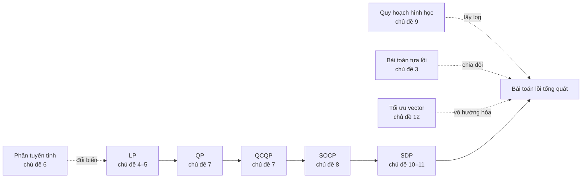

Lecture 01 cho ta định nghĩa tập lồi, hàm lồi, và định lý trung tâm: với bài toán lồi, mọi cực tiểu cục bộ đều là toàn cục. Nhưng một bài toán thực tế không đến với ta dưới dạng "hãy cực tiểu một hàm lồi trên một tập lồi". Nó đến dưới dạng một tỉ số chi phí, một ràng buộc phải đúng với mọi giá trị của một tham số bất định, một ma trận tương quan cần hợp lệ, hay một sự đánh đổi giữa sai số và độ phức tạp. Kỹ năng chính của chương này là **nhận ra** một bài toán thuộc lớp nào, và **viết lại** nó cho tới khi cấu trúc lồi hiện rõ.

Chương đi qua các lớp bài toán lồi chuẩn mà các bộ giải hiện đại xử lý được: quy hoạch tuyến tính, quy hoạch toàn phương, quy hoạch nón bậc hai, quy hoạch hình học và quy hoạch nửa xác định. Chúng lồng vào nhau như những búp bê, mỗi lớp mô tả được nhiều bài toán hơn lớp trước và đòi hỏi tính toán nhiều hơn. Xen giữa là những phép biến đổi giúp đưa bài toán về các lớp ấy, và hai mở rộng quan trọng: bài toán tựa lồi, giải bằng chia đôi, và bài toán nhiều mục tiêu, giải bằng vô hướng hóa.

## Cách đọc chương này

Nội dung được chia thành 12 chủ đề, xếp trong sáu phần. Mỗi chủ đề trả lời một câu hỏi, có một mô phỏng tương tác để bạn tự thay đổi dữ liệu và quan sát nghiệm, một phần câu hỏi đào sâu có lời giải thích, và bài tập tự luyện có lời giải. Mọi ví dụ số đều được tính lại bằng chương trình. Bản đồ dưới đây cho biết câu hỏi của từng chủ đề và mục tương ứng trong sách *Convex Optimization*.

<TopicMap />

## Ba lộ trình đọc

**Lộ trình cốt lõi**, cho lần đọc đầu tiên. Bảy chủ đề này đủ để nhận diện và viết lại các lớp bài toán lồi chính:

- Chủ đề 1. [Bài toán tương đương và các phép biến đổi cơ bản](./bai-02-tap-loi/bai-toan-tuong-duong.md)
- Chủ đề 2. [Khử ràng buộc đẳng thức và tối ưu theo từng nhóm biến](./bai-02-tap-loi/khu-rang-buoc-va-toi-uu-tung-phan.md)
- Chủ đề 4. [Quy hoạch tuyến tính: các dạng viết và hình học của nghiệm](./bai-02-tap-loi/quy-hoach-tuyen-tinh.md)
- Chủ đề 7. [Quy hoạch toàn phương và QCQP](./bai-02-tap-loi/quy-hoach-toan-phuong.md)
- Chủ đề 8. [Quy hoạch nón bậc hai và LP bền vững](./bai-02-tap-loi/quy-hoach-non-bac-hai.md)
- Chủ đề 10. [Bài toán dạng nón và quy hoạch nửa xác định](./bai-02-tap-loi/bai-toan-dang-non-va-sdp.md)
- Chủ đề 12. [Tối ưu vector, điểm Pareto và đường đánh đổi](./bai-02-tap-loi/toi-uu-vector-va-danh-doi.md)

**Lộ trình mô hình hóa**, khi bạn muốn học những "mẹo" biến một bài toán trông không lồi thành bài toán lồi:

- Chủ đề 3. [Hàm tựa lồi và phương pháp chia đôi](./bai-02-tap-loi/toi-uu-tua-loi.md)
- Chủ đề 5. [Những bài toán trở thành LP](./bai-02-tap-loi/mo-hinh-lp.md)
- Chủ đề 6. [Quy hoạch phân tuyến tính](./bai-02-tap-loi/quy-hoach-phan-tuyen-tinh.md)
- Chủ đề 9. [Quy hoạch hình học](./bai-02-tap-loi/quy-hoach-hinh-hoc.md)
- Chủ đề 11. [Phần bù Schur và các bài toán về trị riêng](./bai-02-tap-loi/phan-bu-schur-va-bai-toan-tri-rieng.md)

**Lộ trình học máy**, khi bạn muốn thấy ngay chương này nói gì về các mô hình quen thuộc:

- [Đổi biến qua log σ](./bai-02-tap-loi/bai-toan-tuong-duong.md) và [hệ số chặn như một bài toán tối ưu từng phần](./bai-02-tap-loi/khu-rang-buoc-va-toi-uu-tung-phan.md)
- [Phân lớp tuyến tính bằng LP](./bai-02-tap-loi/quy-hoach-tuyen-tinh.md) và [cận chặt cho xác suất khi chỉ biết vài moment](./bai-02-tap-loi/mo-hinh-lp.md)
- [Hệ số bất định và ràng buộc xác suất](./bai-02-tap-loi/quy-hoach-non-bac-hai.md), [ma trận tương quan hợp lệ](./bai-02-tap-loi/bai-toan-dang-non-va-sdp.md)
- [Ridge, lasso và đường đánh đổi](./bai-02-tap-loi/toi-uu-vector-va-danh-doi.md), cùng lý do [số đặc trưng khác 0 không phải hàm tựa lồi](./bai-02-tap-loi/toi-uu-tua-loi.md)

## Bức tranh chung

Sơ đồ sau cho thấy các lớp bài toán lồng vào nhau ra sao, và mỗi phép biến đổi đưa bài toán nào về lớp nào. Mũi tên liền nối một lớp với lớp tổng quát hơn chứa nó, mũi tên nét đứt là một phép biến đổi.

**Phần I** là bộ công cụ biến đổi. Hai bài toán tương đương khi nghiệm của bài toán này cho ngay nghiệm của bài toán kia. Đổi biến, bọc hàm trong một hàm đơn điệu, thêm biến bù, chuyển sang dạng epigraph, khử ràng buộc đẳng thức và tối ưu theo từng nhóm biến đều giữ nghiệm, nhưng chỉ một số phép giữ được tính lồi. Bài toán tựa lồi, có mọi tập mức dưới lồi, được giải bằng một dãy bài toán khả thi lồi.

**Phần II** là quy hoạch tuyến tính: các dạng viết, hình học của nghiệm trên đa diện, và những bài toán không trông tuyến tính chút nào nhưng là LP, như tâm Chebyshev, cực tiểu hàm tuyến tính từng khúc, cận cho kỳ vọng và quy hoạch phân tuyến tính.

**Phần III** cho phép hàm mục tiêu và ràng buộc cong lên. Quy hoạch toàn phương có nghiệm có thể nằm giữa cạnh hay bên trong đa diện. Quy hoạch nón bậc hai xuất hiện tự nhiên khi dữ liệu bất định, trong LP bền vững và ràng buộc xác suất.

**Phần IV** là quy hoạch hình học, lồi không phải trong biến gốc mà trong thang logarit.

**Phần V** thay thứ tự từng thành phần bằng thứ tự của ma trận nửa xác định dương, cho quy hoạch nửa xác định, lớp rộng nhất của chương. Phần bù Schur là công cụ viết các ràng buộc phi tuyến thành bất đẳng thức ma trận tuyến tính.

**Phần VI** xử lý nhiều mục tiêu cùng lúc. Câu trả lời là cả một đường đánh đổi các điểm Pareto, và vô hướng hóa biến nó thành một họ bài toán thông thường. Ridge, lasso và danh mục Markowitz đều thuộc loại này.

## Bài tập tổng hợp

Các bài dưới đây cần kiến thức từ nhiều phần của chương. Hãy thử làm sau khi đã đọc ít nhất lộ trình cốt lõi.

::: exercise 1. Bài toán này thuộc lớp nào?
Với mỗi bài toán, cho biết lớp hẹp nhất chứa nó trong số LP, QP, QCQP, SOCP, GP, SDP, hoặc cho biết nó không lồi ở dạng hiện tại. (a) Cực tiểu $\|Ax - b\|_1 + \|x\|_\infty$. (b) Cực tiểu $\|Ax - b\|_2$ với $x \succeq 0$. (c) Cực đại $x_1x_2x_3$ với $x_1 + 2x_2 + 3x_3 \le 6$ và $x \succ 0$. (d) Cực tiểu $\lambda_{\max}(A_0 + x_1A_1 + x_2A_2)$ với các $A_i$ đối xứng. (e) Cực tiểu $x_1^2 - x_2^2$ trên hình vuông $[-1, 1]^2$.
:::

::: solution
(a) LP, vì dùng biến phụ cho từng trị tuyệt đối của phần dư và một biến $t$ cho chuẩn $\ell_\infty$ thì mọi ràng buộc đều tuyến tính. (b) SOCP, khi viết thành cực tiểu $t$ với $\|Ax - b\|_2 \le t$. Nếu bình phương hàm mục tiêu, ta lại được một QP tương đương có cùng nghiệm. (c) GP: cực đại một monomial tương đương cực tiểu nghịch đảo của nó, và ràng buộc là $\tfrac16(x_1 + 2x_2 + 3x_3) \le 1$, một posynomial. Theo bất đẳng thức AM–GM áp dụng cho $x_1$, $2x_2$, $3x_3$ có tổng 6, nghiệm là $(2, 1, \tfrac23)$ với tích $\tfrac43$. (d) SDP: cực tiểu $t$ với $tI - A_0 - x_1A_1 - x_2A_2 \succeq 0$. (e) Không lồi: Hessian $\operatorname{diag}(2, -2)$ có trị riêng âm, và đây là một QP không lồi.
:::

::: exercise 2. Trị tuyệt đối thành LP
Viết bài toán cực tiểu $|x - 1| + 2|x + 1|$ thành LP và giải bằng cách chia ba khoảng $x \le -1$, $-1 \le x \le 1$, $x \ge 1$.
:::

::: solution
Đặt $u \ge |x - 1|$ và $v \ge |x + 1|$ bằng bốn ràng buộc tuyến tính $u \ge x - 1$, $u \ge 1 - x$, $v \ge x + 1$, $v \ge -x - 1$, rồi cực tiểu $u + 2v$. Trên ba khoảng, hàm mục tiêu lần lượt là $-3x - 1$, $x + 3$ và $3x + 1$: giảm cho tới $x = -1$ rồi tăng. Nghiệm là $x = -1$ với giá trị 2, và các biến phụ tối ưu là $u = 2$, $v = 0$. Không cần thêm $u \ge 0$: hai bất đẳng thức của $u$ đã kéo theo điều đó.
:::

::: exercise 3. Kẹp giá trị tối ưu từ hai phía
Bài 00 dẫn tới hàm mất mát $f(w) = 7w^2 - 11w + \tfrac92$. Thêm ràng buộc $w \le \tfrac12$. (a) Bỏ ràng buộc để có một cận dưới. (b) Dùng một điểm khả thi để có một cận trên. (c) Chứng minh cận trên chính là giá trị tối ưu.
:::

::: solution
(a) Không ràng buộc, nghiệm là $w = \tfrac{11}{14}$ với giá trị $\tfrac92 - \tfrac{121}{28} = \tfrac{5}{28}$, một cận dưới vì bài toán không ràng buộc là một nới lỏng. (b) Điểm $w = \tfrac12$ khả thi và cho $f = \tfrac74 - \tfrac{11}{2} + \tfrac92 = \tfrac34$, một cận trên. Khoảng cách giữa hai cận là $\tfrac34 - \tfrac{5}{28} = \tfrac47$. (c) Trên miền $w \le \tfrac12$, đạo hàm $14w - 11 \le -4 < 0$, nên $f$ giảm khi $w$ tăng tới biên, và nghiệm là $w^\star = \tfrac12$ với $p^\star = \tfrac34$. Lecture 03 sẽ chứng nhận cùng kết quả bằng nhân tử Lagrange.
:::

## Tóm tắt

Một bài toán thực tế hiếm khi được phát biểu sẵn dưới dạng chuẩn lồi. Các phép biến đổi tương đương giữ nghiệm nhưng không phải lúc nào cũng giữ tính lồi, và tính lồi là tính chất của cách viết. Các lớp bài toán lồi chuẩn lồng vào nhau: LP, QP, QCQP, SOCP và SDP, cùng với GP lồi trong thang logarit. Bài toán tựa lồi và bài toán phân tuyến tính được đưa về một dãy bài toán khả thi lồi hoặc về đúng một LP. Bài toán nhiều mục tiêu có câu trả lời là một đường đánh đổi các điểm Pareto, tìm được bằng vô hướng hóa.

Sau chương này, bạn nhận ra được lớp của một bài toán, viết nó về dạng mà một bộ giải chấp nhận, và chỉ ra phép biến đổi nào đã giữ hay làm mất tính lồi. Lecture 03 sẽ dùng chính những dạng viết này để xây dựng cận dưới và chứng nhận tối ưu qua đối ngẫu Lagrange.

## Nguồn và đọc thêm

- S. Boyd, L. Vandenberghe, *Convex Optimization*, Cambridge University Press, 2004: §3.4, §4.1.3, §4.2.4–4.2.5, §4.3–4.7, §6.3 và phụ lục A.5.5. Mỗi chủ đề ghi rõ mục và trang tương ứng ở phần nguồn của nó.
- Các mô phỏng, ví dụ số, câu hỏi và bài tập do người soạn bổ sung, và mọi con số đã được tính lại bằng chương trình. Tên và thứ tự bài giảng theo trang môn học.

[Bài 01](./bai-01-nhap-mon-toi-uu.md) · [Bài 03 — Đối ngẫu Lagrange](./bai-03-doi-ngau-lagrange.md)
