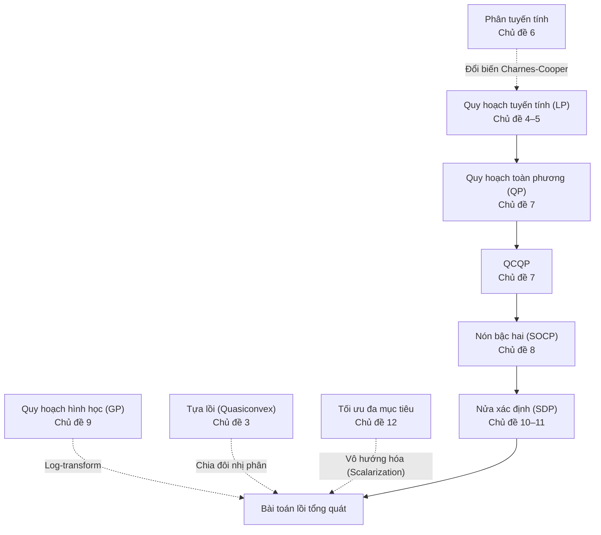

Ở Bài 01, chúng ta đã nắm giữ định lý nền tảng: Với bài toán tối ưu lồi, mọi cực tiểu cục bộ đều tự động là cực tiểu toàn cục. Tuy nhiên, trong thực tế kỹ nghệ và nghiên cứu AI, bài toán hiếm khi xuất hiện dưới dạng "nguyên mẫu lồi" hiển nhiên. Bài toán thường ẩn mình dưới dạng một tỉ số chi phí trên lợi nhuận, một hệ thống điều khiển tự hành chịu nhiễu bất định, một bài toán ước lượng ma trận hiệp phương sai của danh mục đầu tư, hay sự đánh đổi giữa độ chính xác và độ thưa thớt của mô hình.

Năng lực cốt lõi của một chuyên gia khoa học dữ liệu và tối ưu hóa là **nhận diện cấu trúc toán học** của bài toán và làm chủ nghệ thuật **biến đổi tương đương** để đưa bài toán về các lớp chuẩn tắc mà các bộ giải (solvers) hiện đại có thể giải quyết hiệu quả trong thời gian thực.

Chương này dẫn dắt chúng ta qua phả hệ bao hàm kinh điển của các bài toán tối ưu lồi:

$$
\text{LP} \subset \text{QP} \subset \text{QCQP} \subset \text{SOCP} \subset \text{SDP}.
$$

Mỗi dạng bài toán kế thừa và mở rộng năng lực biểu diễn hình học của dạng bài toán đứng trước nó: Từ các đa diện phẳng (Quy hoạch tuyến tính - LP), các mặt cong toàn phương (Quy hoạch toàn phương - QP, QCQP), các nón băng Lorentz (Quy hoạch nón bậc hai - SOCP), cho tới nón ma trận nửa xác định dương (Quy hoạch nửa xác định - SDP). Bên cạnh đó là Quy hoạch hình học (GP), ví dụ điển hình của việc đưa một bài toán phi lồi về dạng lồi qua phép đổi biến logarit, và lý thuyết Tối ưu hóa đa mục tiêu với đường biên Pareto trong học máy.

---

## 1. Cấu trúc chương học và Bản đồ chủ đề

Chương học gồm 12 chủ đề chuyên sâu, phân chia theo sáu nhóm năng lực:
- **Phần I (Chủ đề 1–3)**: Kỹ thuật biến đổi bài toán tương đương, khử biến, tối ưu từng phần và phương pháp chia đôi cho bài toán tựa lồi.
- **Phần II (Chủ đề 4–6)**: Quy hoạch tuyến tính (LP), hình học của nghiệm đa diện và quy hoạch phân tuyến tính.
- **Phần III (Chủ đề 7–8)**: Quy hoạch toàn phương (QP, QCQP) và Quy hoạch nón bậc hai (SOCP) trong điều kiện bất định.
- **Phần IV (Chủ đề 9)**: Quy hoạch hình học (GP) và nghệ thuật đổi thang đo logarit.
- **Phần V (Chủ đề 10–11)**: Quy hoạch nửa xác định (SDP), phần bù Schur và bài toán tối ưu hóa trị riêng ma trận.
- **Phần VI (Chủ đề 12)**: Tối ưu hóa vector và đường cong đánh đổi Pareto trong học máy.

<TopicMap />

---

## 2. Ba lộ trình học tập tùy biến

### Lộ trình 1: Khung xương cốt lõi (Core Track)
Lộ trình cơ bản nhằm nắm vững các dạng bài toán lồi chuẩn tắc:
- Chủ đề 1. [Bài toán tương đương và các phép biến đổi cơ bản](./bai-02-tap-loi/bai-toan-tuong-duong.md)
- Chủ đề 2. [Khử ràng buộc đẳng thức và tối ưu theo từng nhóm biến](./bai-02-tap-loi/khu-rang-buoc-va-toi-uu-tung-phan.md)
- Chủ đề 4. [Quy hoạch tuyến tính: Các dạng viết và hình học của nghiệm](./bai-02-tap-loi/quy-hoach-tuyen-tinh.md)
- Chủ đề 7. [Quy hoạch toàn phương và QCQP](./bai-02-tap-loi/quy-hoach-toan-phuong.md)
- Chủ đề 8. [Quy hoạch nón bậc hai và LP bền vững](./bai-02-tap-loi/quy-hoach-non-bac-hai.md)
- Chủ đề 10. [Bài toán dạng nón và quy hoạch nửa xác định](./bai-02-tap-loi/bai-toan-dang-non-va-sdp.md)
- Chủ đề 12. [Tối ưu vector, điểm Pareto và đường đánh đổi](./bai-02-tap-loi/toi-uu-vector-va-danh-doi.md)

### Lộ trình 2: Nghệ thuật mô hình hóa và Cải dạng (Modeling Track)
Dành cho người muốn làm chủ các kỹ thuật đưa bài toán phức tạp về dạng lồi chuẩn:
- Chủ đề 3. [Hàm tựa lồi và phương pháp chia đôi](./bai-02-tap-loi/toi-uu-tua-loi.md)
- Chủ đề 5. [Những bài toán đưa được về quy hoạch tuyến tính LP](./bai-02-tap-loi/mo-hinh-lp.md)
- Chủ đề 6. [Quy hoạch phân tuyến tính](./bai-02-tap-loi/quy-hoach-phan-tuyen-tinh.md)
- Chủ đề 9. [Quy hoạch hình học](./bai-02-tap-loi/quy-hoach-hinh-hoc.md)
- Chủ đề 11. [Phần bù Schur và các bài toán về trị riêng ma trận](./bai-02-tap-loi/phan-bu-schur-va-bai-toan-tri-rieng.md)

### Lộ trình 3: Trọng tâm Ứng dụng Trí tuệ nhân tạo (Machine Learning Track)
Khám phá sự xuất hiện tự nhiên của các họ bài toán lồi trong các mô hình AI:
- [Đổi biến qua hàm sigmoid](./bai-02-tap-loi/bai-toan-tuong-duong.md) cùng [Hệ số chặn (bias) như bài toán tối ưu từng phần](./bai-02-tap-loi/khu-rang-buoc-va-toi-uu-tung-phan.md)
- [Phân lớp tuyến tính bằng LP](./bai-02-tap-loi/quy-hoach-tuyen-tinh.md) cùng [Cận xác định cho phân phối xác suất qua moment](./bai-02-tap-loi/mo-hinh-lp.md)
- [Học máy bền vững trước nhiễu dữ liệu qua SOCP](./bai-02-tap-loi/quy-hoach-non-bac-hai.md) cùng [Ước lượng ma trận tương quan qua SDP](./bai-02-tap-loi/bai-toan-dang-non-va-sdp.md)
- [Đường biên đánh đổi Pareto trong hồi quy Ridge, Lasso](./bai-02-tap-loi/toi-uu-vector-va-danh-doi.md)

---

## 3. Bức tranh tổng thể

Sơ đồ sau mô tả phả hệ bao hàm giữa các họ bài toán tối ưu và những phép biến đổi tương đương:

- **Phần I**: Trang bị bộ công cụ biến đổi đại số bảo toàn tính lồi: Đổi biến khả nghịch, hợp với hàm đơn điệu tăng, đưa vào biến bù (slack variables), biểu diễn dạng epigraph, khử ràng buộc đẳng thức affine, và tối ưu hóa từng phần. Đối với bài toán tựa lồi (quasiconvex) có tập mức dưới lồi nhưng đồ thị không lồi, ta giải quyết triệt để thông qua một dãy bài toán kiểm tra tính khả thi lồi bằng phương pháp chia đôi nhị phân.
- **Phần II**: Phân tích hình học của Quy hoạch tuyến tính (LP): Miền khả thi là một đa diện lồi (polyhedron), và nghiệm tối ưu luôn đạt được tại các đỉnh cực (extreme points). Khám phá các bài toán tưởng chừng phi tuyến nhưng lại quy về LP một cách kỳ tài: Xấp xỉ Chebyshev, hàm chi phí tuyến tính từng khúc, và quy hoạch phân tuyến tính.
- **Phần III**: Mở rộng hàm mục tiêu và ràng buộc sang bậc hai. QP cho phép tối ưu hóa các hàm chi phí khoảng cách và phương sai (mô hình danh mục đầu tư Markowitz, Support Vector Machines). SOCP xuất hiện như một công cụ đắc lực khi mô hình hóa bài toán dưới sự bất định của dữ liệu đầu vào (Robust LP) và các ràng buộc xác suất tin cậy (chance constraints).
- **Phần IV**: Giới thiệu Quy hoạch hình học (GP). Những bài toán tối ưu với các hàm monomial và posynomial vốn phi lồi trong không gian biến gốc, nhưng sau khi chuyển sang thang đo logarit ($y_i = \log x_i$), bài toán lập tức biến đổi thành một bài toán tối ưu lồi phẳng tuyệt đẹp.
- **Phần V**: Đỉnh cao của tối ưu hóa hình học dạng nón: Quy hoạch nửa xác định (SDP). Miền ràng buộc là nón các ma trận nửa xác định dương. Sử dụng công cụ bổ đề phần bù Schur (Schur complement), ta có thể "tuyến tính hóa" các ràng buộc toàn phương phi tuyến phức tạp thành các bất đẳng thức ma trận tuyến tính (LMI).
- **Phần VI**: Giải quyết xung đột giữa nhiều mục tiêu thực tế. Khi không thể đồng thời làm cực tiểu cả sai số dự đoán lẫn độ phức tạp mô hình, giải pháp là tìm kiếm tập nghiệm Pareto tối ưu. Kỹ thuật vô hướng hóa (scalarization) biến bài toán đa mục tiêu thành một họ bài toán lồi đơn mục tiêu có trọng số.

---

## 4. Bài tập tổng hợp

::: exercise 1. Nhận diện vị trí bài toán trong phả hệ tối ưu
Với mỗi bài toán sau, hãy xác định dạng bài toán hẹp nhất chứa nó (trong số LP, QP, QCQP, SOCP, GP, SDP), hoặc chỉ ra bài toán phi lồi ở dạng hiện tại:
1. $\min_x \|Ax - b\|_1 + \|x\|_\infty$.
2. $\min_x \|Ax - b\|_2$ với điều kiện $x \succeq 0$.
3. $\max_x x_1 x_2 x_3$ với điều kiện $x_1 + 2x_2 + 3x_3 \le 6$ và $x \succ 0$.
4. $\min_x \lambda_{\max}(A_0 + x_1 A_1 + x_2 A_2)$ với các ma trận $A_i$ đối xứng.
5. $\min_x (x_1^2 - x_2^2)$ trên hình vuông đơn vị $[-1, 1]^2$.
:::

::: solution
1. **Quy hoạch tuyến tính (LP)**: Bằng cách đưa vào các biến phụ epigraph $u \in \mathbb{R}^m$ cho từng thành phần $|a_i^T x - b_i| \le u_i$ và một biến vô hướng $t \in \mathbb{R}$ cho chuẩn cực đại $\|x\|_\infty \le t \iff -t \le x_j \le t$, bài toán quy về cực tiểu hóa tổng tuyến tính $\sum u_i + t$ dưới các ràng buộc bất đẳng thức tuyến tính.
2. **Quy hoạch nón bậc hai (SOCP)**: Viết lại dưới dạng epigraph: Cụ thể, xét bài toán $\min_{x, t} t$ với ràng buộc nón bậc hai $\|Ax - b\|_2 \le t$ và $x \ge 0$. Lưu ý: Nếu bình phương hàm mục tiêu thành $\frac{1}{2}\|Ax - b\|_2^2$, ta thu được một bài toán QP tương đương có cùng nghiệm.
3. **Quy hoạch hình học (GP)**: Cực đại hóa monomial $x_1 x_2 x_3$ tương đương cực tiểu hóa nghịch đảo của nó $x_1^{-1} x_2^{-1} x_3^{-1}$ (một monomial). Ràng buộc viết lại thành $\frac{1}{6}x_1 + \frac{1}{3}x_2 + \frac{1}{2}x_3 \le 1$ (một posynomial). Theo bất đẳng thức AM-GM, nghiệm tối ưu đạt được khi ba số hạng bằng nhau: $x_1^* = 2, x_2^* = 1, x_3^* = \frac{2}{3}$.
4. **Quy hoạch nửa xác định (SDP)**: Ràng buộc trị riêng cực đại $\lambda_{\max}(M(x)) \le t$ tương đương với bất đẳng thức ma trận tuyến tính $tI - M(x) \succeq 0$. Do đó bài toán quy về: Cụ thể, xét bài toán $\min_{x, t} t$ với ràng buộc $tI - A_0 - x_1 A_1 - x_2 A_2 \succeq 0$, đây là dạng chuẩn của SDP.
5. **Không lồi (Non-convex)**: Ma trận Hessian của hàm mục tiêu là $\begin{bmatrix} 2 & 0 \\ 0 & -2 \end{bmatrix}$ có một trị riêng âm, do đó hàm mục tiêu là dạng yên ngựa phi lồi. Nghiệm tối ưu nằm tại các góc biên rời rạc.
:::

::: exercise 2. Kỹ thuật epigraph chuyển đổi hàm trị tuyệt đối về LP
Xét bài toán tối ưu sau đây trên $\mathbb{R}$:
$$
\min_x |x - 1| + 2|x + 1|.
$$
1. Thiết lập bài toán tương đương dưới dạng Quy hoạch tuyến tính (LP).
2. Tìm nghiệm tối ưu bằng phương pháp phân chia khoảng giải tích và so sánh với kết quả LP.
:::

::: solution
1. **Thiết lập dạng LP**: Đưa vào hai biến phụ $u, v \in \mathbb{R}$ thỏa mãn $u \ge |x - 1|$ và $v \ge |x + 1|$. Bài toán trở thành:
   $$
   \begin{aligned}
   \min_{x, u, v} \quad & u + 2v \\
   \text{sao cho} \quad & u \ge x - 1, \quad u \ge 1 - x, \\
   & v \ge x + 1, \quad v \ge -x - 1.
   \end{aligned}
   $$
   Hàm mục tiêu tuyến tính và cả bốn ràng buộc đều là bất đẳng thức affine. Hai ràng buộc ngầm $u \ge 0$ và $v \ge 0$ được tự động thỏa mãn bởi các bất đẳng thức trên.
2. **Khảo sát giải tích**: Chia trục số thực thành ba khoảng:
   - Khi $x < -1$: $f(x) = (1 - x) + 2(-x - 1) = -3x - 1$, hàm nghịch biến.
   - Khi $-1 \le x \le 1$: $f(x) = (1 - x) + 2(x + 1) = x + 3$, hàm đồng biến.
   - Khi $x > 1$: $f(x) = (x - 1) + 2(x + 1) = 3x + 1$, hàm đồng biến.
   
   Hàm số đạt giá trị cực tiểu toàn cục duy nhất tại điểm nối $x^* = -1$, với giá trị tối ưu $p^* = |-1 - 1| + 2|-1 + 1| = 2$. Tại nghiệm tối ưu, các biến phụ nhận giá trị $u^* = 2, v^* = 0$.
:::

::: exercise 3. Kỹ thuật kẹp nghiệm và đánh giá khoảng cách đối ngẫu
Xét hàm mất mát ở Bài 00: $f(w) = 7w^2 - 11w + \frac{9}{2}$. Giả sử có thêm ràng buộc tham số $w \le \frac{1}{2}$.
1. Bỏ qua ràng buộc để tìm một cận dưới cho giá trị tối ưu.
2. Chọn một điểm khả thi hợp lệ để tìm một cận trên.
3. Chứng minh rằng cận trên tìm được chính là giá trị tối ưu toàn cục của bài toán.
:::

::: solution
1. **Cận dưới từ bài toán nới lỏng**: Khi loại bỏ ràng buộc $w \le 0.5$, bài toán không ràng buộc có nghiệm tại điểm dừng $w = \frac{11}{14}$. Giá trị mất mát tương ứng là $f(11/14) = \frac{5}{28} \approx 0.1786$. Vì miền khả thi của bài toán có ràng buộc là tập con của $\mathbb{R}$, giá trị tối ưu $p^*$ chắc chắn bị chặn dưới:
   $$p^* \ge \frac{5}{28}.$$
2. **Cận trên từ điểm khả thi**: Điểm biên $w = \frac{1}{2}$ thỏa mãn ràng buộc $w \le \frac{1}{2}$. Giá trị hàm số tại đây là:
   $$f\left(\frac{1}{2}\right) = 7\left(\frac{1}{4}\right) - 11\left(\frac{1}{2}\right) + \frac{9}{2} = \frac{7}{4} - \frac{22}{4} + \frac{18}{4} = \frac{3}{4} = 0.75.$$
   Vì điểm này khả thi, ta có cận trên: $p^* \le \frac{3}{4}$. Khoảng cách kẹp nghiệm hiện tại là $\frac{3}{4} - \frac{5}{28} = \frac{16}{28} = \frac{4}{7}$.
3. **Chứng nhận tối ưu**: Đạo hàm của hàm mục tiêu là $f'(w) = 14w - 11$. Trên toàn bộ miền khả thi $w \le \frac{1}{2}$, ta có:
   $$f'(w) \le 14\left(\frac{1}{2}\right) - 11 = 7 - 11 = -4 < 0.$$
   Đạo hàm mang dấu âm ngặt trên toàn miền, chứng tỏ hàm số nghịch biến trên $(-\infty, 0.5]$. Do đó, hàm số đạt giá trị nhỏ nhất tại điểm mút cực phải $w^* = \frac{1}{2}$, với giá trị tối ưu $p^* = \frac{3}{4}$. Ở Bài 03, ta sẽ chứng nhận kết quả này một cách có hệ thống thông qua lý thuyết Đối ngẫu Lagrange.
:::

---

## Tóm tắt cốt lõi

1. **Phả hệ bài toán lồi**: Các họ bài toán $\text{LP} \subset \text{QP} \subset \text{QCQP} \subset \text{SOCP} \subset \text{SDP}$ tạo nên bậc thang biểu diễn hình học từ đa diện phẳng đến nón ma trận nửa xác định dương.
2. **Nghệ thuật cải dạng**: Kỹ thuật biến phụ epigraph, đổi biến Charnes-Cooper cho hàm phân tuyến tính, và phép biến đổi logarit cho quy hoạch hình học giúp chuyển hóa nhiều bài toán tưởng như phi lồi về dạng lồi chuẩn tắc.
3. **Phần bù Schur**: Cầu nối toán học biến các ràng buộc ma trận phi tuyến thành bất đẳng thức ma trận tuyến tính (LMI) trong SDP.
4. **Tối ưu đa mục tiêu**: Khi các tiêu chí tối ưu xung đột, nghiệm tối ưu là tập hợp các điểm cân bằng Pareto. Phương pháp vô hướng hóa giúp quét toàn bộ đường biên Pareto bằng cách giải một họ bài toán lồi đơn mục tiêu.

---

## Tài liệu tham khảo và Đọc thêm

Dành cho người học muốn nghiên cứu chuyên sâu về các dạng bài toán tối ưu lồi:
- **Stephen Boyd & Lieven Vandenberghe**, *Convex Optimization*, Cambridge University Press. Đọc kỹ Chương 4 (Các bài toán tối ưu lồi chuyên biệt: LP, QP, QCQP, SOCP, SDP, GP) và Phụ lục A.5.5 về Phần bù Schur.
- **Dimitris Bertsimas & John N. Tsitsiklis**, *Introduction to Linear Optimization*, Athena Scientific. Tài liệu kinh điển về hình học đa diện và thuật toán Simplex cho quy hoạch tuyến tính.

Tiếp theo: [Bài 03: Lý thuyết đối ngẫu Lagrange và Điều kiện KKT](./bai-03-doi-ngau-lagrange.md).
