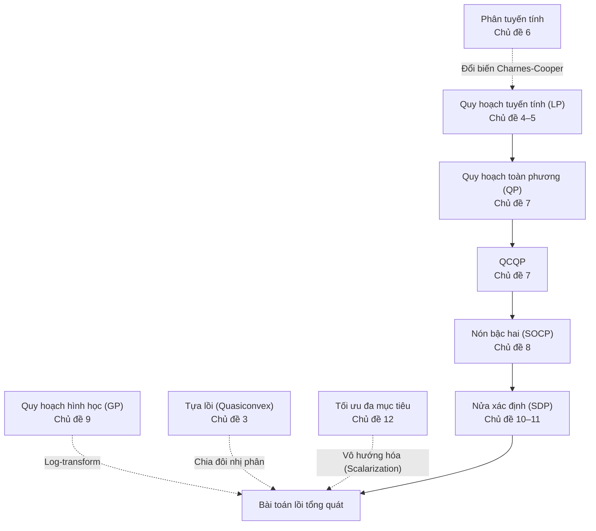

Ở Bài 01, chúng ta đã nắm giữ định lý nền tảng: Với bài toán tối ưu lồi, mọi cực tiểu cục bộ đều tự động là cực tiểu toàn cục. Tuy nhiên, trong thực tế kỹ nghệ và nghiên cứu AI, bài toán hiếm khi xuất hiện dưới dạng "nguyên mẫu lồi" hiển nhiên. Bài toán thường ẩn mình dưới dạng một tỉ số chi phí trên lợi nhuận, một hệ thống điều khiển tự hành chịu nhiễu bất định, một bài toán ước lượng ma trận hiệp phương sai của danh mục đầu tư, hay sự đánh đổi giữa độ chính xác và độ thưa thớt của mô hình.

Năng lực cốt lõi của một chuyên gia khoa học dữ liệu và tối ưu hóa là **nhận diện cấu trúc toán học** của bài toán và làm chủ nghệ thuật **biến đổi tương đương** để đưa bài toán về các lớp chuẩn tắc mà các bộ giải (solvers) hiện đại có thể giải quyết hiệu quả trong thời gian thực.

Chương này dẫn dắt chúng ta qua phả hệ bao hàm kinh điển của các bài toán tối ưu lồi:

$$
\text{LP} \subset \text{QP} \subset \text{QCQP} \subset \text{SOCP} \subset \text{SDP}.
$$

Mỗi dạng bài toán kế thừa và mở rộng năng lực biểu diễn hình học của dạng bài toán đứng trước nó: Từ các đa diện phẳng (Quy hoạch tuyến tính - LP), các mặt cong toàn phương (Quy hoạch toàn phương - QP, QCQP), các nón băng Lorentz (Quy hoạch nón bậc hai - SOCP), cho tới nón ma trận nửa xác định dương (Quy hoạch nửa xác định - SDP). Bên cạnh đó là Quy hoạch hình học (GP), ví dụ điển hình của việc đưa một bài toán phi lồi về dạng lồi qua phép đổi biến logarit, lý thuyết Tối ưu hóa đa mục tiêu với đường biên Pareto trong học máy, cùng các ứng dụng khớp hàm và quy hoạch mặt bằng vi mạch.

---

## 1. Cấu trúc chương học và Bản đồ chủ đề

Chương học gồm 16 chủ đề chuyên sâu, phân chia theo tám nhóm năng lực:
- **Phần I (Chủ đề 1–3)**: Kỹ thuật biến đổi bài toán tương đương, khử biến, tối ưu từng phần và phương pháp chia đôi cho bài toán tựa lồi.
- **Phần II (Chủ đề 4–6)**: Quy hoạch tuyến tính (LP), hình học của nghiệm đa diện và quy hoạch phân tuyến tính.
- **Phần III (Chủ đề 7–8)**: Quy hoạch toàn phương (QP, QCQP) và Quy hoạch nón bậc hai (SOCP) trong điều kiện bất định.
- **Phần IV (Chủ đề 9)**: Quy hoạch hình học (GP) và nghệ thuật đổi thang đo logarit.
- **Phần V (Chủ đề 10–11)**: Quy hoạch nửa xác định (SDP), phần bù Schur và bài toán tối ưu hóa trị riêng ma trận.
- **Phần VI (Chủ đề 12)**: Tối ưu hóa vector và đường cong đánh đổi Pareto trong học máy.
- **Phần VII (Chủ đề 13–15)**: Khớp hàm làm mượt spline, ước lượng mật độ phi tham số và cận xác suất Chebyshev - Chernoff nhiều chiều qua SDP.
- **Phần VIII (Chủ đề 16)**: Quy hoạch mặt bằng (Floor planning) và phân bổ không gian tối ưu qua quy hoạch hình học.

<TopicMap />

---

## 2. Ba lộ trình học tập tùy biến

### Lộ trình 1: Khung xương cốt lõi (Core Track)
Lộ trình cơ bản nhằm nắm vững các dạng bài toán lồi chuẩn tắc:
- Chủ đề 1. [Bài toán tương đương và các phép biến đổi cơ bản](./bai-02-tap-loi/bai-toan-tuong-duong.md)
- Chủ đề 2. [Khử ràng buộc đẳng thức và tối ưu theo từng nhóm biến](./bai-02-tap-loi/khu-rang-buoc-va-toi-uu-tung-phan.md)
- Chủ đề 4. [Quy hoạch tuyến tính: Các dạng viết và hình học của nghiệm](./bai-02-tap-loi/quy-hoach-tuyen-tinh.md)
- Chủ đề 7. [Quy hoạch toàn phương và QCQP](./bai-02-tap-loi/quy-hoach-toan-phuong.md)
- Chủ đề 8. [Quy hoạch nón bậc hai và LP bền vững](./bai-02-tap-loi/quy-hoach-non-bac-hai.md)
- Chủ đề 10. [Bài toán dạng nón và quy hoạch nửa xác định](./bai-02-tap-loi/bai-toan-dang-non-va-sdp.md)
- Chủ đề 12. [Tối ưu vector, điểm Pareto và đường đánh đổi](./bai-02-tap-loi/toi-uu-vector-va-danh-doi.md)

### Lộ trình 2: Nghệ thuật mô hình hóa và Cải dạng (Modeling Track)
Dành cho người muốn làm chủ các kỹ thuật đưa bài toán phức tạp về dạng lồi chuẩn:
- Chủ đề 3. [Hàm tựa lồi và phương pháp chia đôi](./bai-02-tap-loi/toi-uu-tua-loi.md)
- Chủ đề 5. [Những bài toán đưa được về quy hoạch tuyến tính LP](./bai-02-tap-loi/mo-hinh-lp.md)
- Chủ đề 6. [Quy hoạch phân tuyến tính](./bai-02-tap-loi/quy-hoach-phan-tuyen-tinh.md)
- Chủ đề 9. [Quy hoạch hình học](./bai-02-tap-loi/quy-hoach-hinh-hoc.md)
- Chủ đề 11. [Phần bù Schur và các bài toán về trị riêng ma trận](./bai-02-tap-loi/phan-bu-schur-va-bai-toan-tri-rieng.md)

### Lộ trình 3: Trọng tâm Ứng dụng Trí tuệ nhân tạo (Machine Learning Track)
Khám phá sự xuất hiện tự nhiên của các họ bài toán lồi trong các mô hình AI:
- [Đổi biến qua hàm sigmoid](./bai-02-tap-loi/bai-toan-tuong-duong.md) cùng [Hệ số chặn (bias) như bài toán tối ưu từng phần](./bai-02-tap-loi/khu-rang-buoc-va-toi-uu-tung-phan.md)
- [Phân lớp tuyến tính bằng LP](./bai-02-tap-loi/quy-hoach-tuyen-tinh.md) cùng [Cận xác định cho phân phối xác suất qua moment](./bai-02-tap-loi/mo-hinh-lp.md)
- [Học máy bền vững trước nhiễu dữ liệu qua SOCP](./bai-02-tap-loi/quy-hoach-non-bac-hai.md) cùng [Ước lượng ma trận tương quan qua SDP](./bai-02-tap-loi/bai-toan-dang-non-va-sdp.md)
- [Đường biên đánh đổi Pareto trong hồi quy Ridge, Lasso](./bai-02-tap-loi/toi-uu-vector-va-danh-doi.md)

---

## 3. Bức tranh tổng thể

Sơ đồ sau mô tả phả hệ bao hàm giữa các họ bài toán tối ưu và những phép biến đổi tương đương:

- **Phần I**: Trang bị bộ công cụ biến đổi đại số bảo toàn tính lồi: Đổi biến khả nghịch, hợp với hàm đơn điệu tăng, đưa vào biến bù (slack variables), biểu diễn dạng epigraph, khử ràng buộc đẳng thức affine, và tối ưu hóa từng phần. Đối với bài toán tựa lồi (quasiconvex) có tập mức dưới lồi nhưng đồ thị không lồi, ta giải quyết triệt để thông qua một dãy bài toán kiểm tra tính khả thi lồi bằng phương pháp chia đôi nhị phân.
- **Phần II**: Phân tích hình học của Quy hoạch tuyến tính (LP): Miền khả thi là một đa diện lồi (polyhedron), và nghiệm tối ưu luôn đạt được tại các đỉnh cực (extreme points). Khám phá các bài toán tưởng chừng phi tuyến nhưng lại quy về LP một cách kỳ tài: Xấp xỉ Chebyshev, hàm chi phí tuyến tính từng khúc, và quy hoạch phân tuyến tính.
- **Phần III**: Mở rộng hàm mục tiêu và ràng buộc sang bậc hai. QP cho phép tối ưu hóa các hàm chi phí khoảng cách và phương sai (mô hình danh mục đầu tư Markowitz, Support Vector Machines). SOCP xuất hiện như một công cụ đắc lực khi mô hình hóa bài toán dưới sự bất định của dữ liệu đầu vào (Robust LP) và các ràng buộc xác suất tin cậy (chance constraints).
- **Phần IV**: Giới thiệu Quy hoạch hình học (GP). Những bài toán tối ưu với các hàm monomial và posynomial vốn phi lồi trong không gian biến gốc, nhưng sau khi chuyển sang thang đo logarit ($y_i = \log x_i$), bài toán lập tức biến đổi thành một bài toán tối ưu lồi phẳng tuyệt đẹp.
- **Phần V**: Đỉnh cao của tối ưu hóa hình học dạng nón: Quy hoạch nửa xác định (SDP). Miền ràng buộc là nón các ma trận nửa xác định dương. Sử dụng công cụ bổ đề phần bù Schur (Schur complement), ta có thể "tuyến tính hóa" các ràng buộc toàn phương phi tuyến phức tạp thành các bất đẳng thức ma trận tuyến tính (LMI).
- **Phần VI**: Giải quyết xung đột giữa nhiều mục tiêu thực tế. Khi không thể đồng thời làm cực tiểu cả sai số dự đoán lẫn độ phức tạp mô hình, giải pháp là tìm kiếm tập nghiệm Pareto tối ưu. Kỹ thuật vô hướng hóa (scalarization) biến bài toán đa mục tiêu thành một họ bài toán lồi đơn mục tiêu có trọng số.

---

## 4. Bài tập tổng hợp

::: exercise 1. Nhận diện vị trí bài toán trong phả hệ tối ưu
Với mỗi bài toán sau, hãy xác định dạng bài toán hẹp nhất chứa nó (trong số LP, QP, QCQP, SOCP, GP, SDP), hoặc chỉ ra bài toán phi lồi ở dạng hiện tại:
1. $\min_x \|Ax - b\|_1 + \|x\|_\infty$.
2. $\min_x \|Ax - b\|_2$ với điều kiện $x \succeq 0$.
3. $\max_x x_1 x_2 x_3$ với điều kiện $x_1 + 2x_2 + 3x_3 \le 6$ và $x \succ 0$.
4. $\min_x \lambda_{\max}(A_0 + x_1 A_1 + x_2 A_2)$ với các ma trận $A_i$ đối xứng.
5. $\min_x (x_1^2 - x_2^2)$ trên hình vuông đơn vị $[-1, 1]^2$.
:::

::: solution
1. **Quy hoạch tuyến tính (LP)**: Bằng cách đưa vào các biến phụ epigraph $u \in \mathbb{R}^m$ cho từng thành phần $|a_i^T x - b_i| \le u_i$ và một biến vô hướng $t \in \mathbb{R}$ cho chuẩn cực đại $\|x\|_\infty \le t \iff -t \le x_j \le t$, bài toán quy về cực tiểu hóa tổng tuyến tính $\sum u_i + t$ dưới các ràng buộc bất đẳng thức tuyến tính.
2. **Quy hoạch nón bậc hai (SOCP)**: Viết lại dưới dạng epigraph: Cụ thể, xét bài toán $\min_{x, t} t$ với ràng buộc nón bậc hai $\|Ax - b\|_2 \le t$ và $x \ge 0$. Lưu ý: Nếu bình phương hàm mục tiêu thành $\frac{1}{2}\|Ax - b\|_2^2$, ta thu được một bài toán QP tương đương có cùng nghiệm.
3. **Quy hoạch hình học (GP)**: Cực đại hóa monomial $x_1 x_2 x_3$ tương đương cực tiểu hóa nghịch đảo của nó $x_1^{-1} x_2^{-1} x_3^{-1}$ (một monomial). Ràng buộc viết lại thành $\frac{1}{6}x_1 + \frac{1}{3}x_2 + \frac{1}{2}x_3 \le 1$ (một posynomial). Theo bất đẳng thức AM-GM, nghiệm tối ưu đạt được khi ba số hạng bằng nhau: $x_1^* = 2, x_2^* = 1, x_3^* = \frac{2}{3}$.
4. **Quy hoạch nửa xác định (SDP)**: Ràng buộc trị riêng cực đại $\lambda_{\max}(M(x)) \le t$ tương đương với bất đẳng thức ma trận tuyến tính $tI - M(x) \succeq 0$. Do đó bài toán quy về: Cụ thể, xét bài toán $\min_{x, t} t$ với ràng buộc $tI - A_0 - x_1 A_1 - x_2 A_2 \succeq 0$, đây là dạng chuẩn của SDP.
5. **Không lồi (Non-convex)**: Ma trận Hessian của hàm mục tiêu là $\begin{bmatrix} 2 & 0 \\ 0 & -2 \end{bmatrix}$ có một trị riêng âm, do đó hàm mục tiêu là dạng yên ngựa phi lồi. Nghiệm tối ưu nằm tại các góc biên rời rạc.
:::

::: exercise 2. Kỹ thuật epigraph chuyển đổi hàm trị tuyệt đối về LP
Xét bài toán tối ưu sau đây trên $\mathbb{R}$:
$$
\min_x |x - 1| + 2|x + 1|.
$$
1. Thiết lập bài toán tương đương dưới dạng Quy hoạch tuyến tính (LP).
2. Tìm nghiệm tối ưu bằng phương pháp phân chia khoảng giải tích và so sánh với kết quả LP.
:::

::: solution
1. **Thiết lập dạng LP**: Đưa vào hai biến phụ $u, v \in \mathbb{R}$ thỏa mãn $u \ge |x - 1|$ và $v \ge |x + 1|$. Bài toán trở thành:
   $$
   \begin{aligned}
   \min_{x, u, v} \quad & u + 2v \\
   \text{sao cho} \quad & u \ge x - 1, \quad u \ge 1 - x, \\
   & v \ge x + 1, \quad v \ge -x - 1.
   \end{aligned}
   $$
   Hàm mục tiêu tuyến tính và cả bốn ràng buộc đều là bất đẳng thức affine. Hai ràng buộc ngầm $u \ge 0$ và $v \ge 0$ được tự động thỏa mãn bởi các bất đẳng thức trên.
2. **Khảo sát giải tích**: Chia trục số thực thành ba khoảng:
   - Khi $x < -1$: $f(x) = (1 - x) + 2(-x - 1) = -3x - 1$, hàm nghịch biến.
   - Khi $-1 \le x \le 1$: $f(x) = (1 - x) + 2(x + 1) = x + 3$, hàm đồng biến.
   - Khi $x > 1$: $f(x) = (x - 1) + 2(x + 1) = 3x + 1$, hàm đồng biến.
   
   Hàm số đạt giá trị cực tiểu toàn cục duy nhất tại điểm nối $x^* = -1$, với giá trị tối ưu $p^* = |-1 - 1| + 2|-1 + 1| = 2$. Tại nghiệm tối ưu, các biến phụ nhận giá trị $u^* = 2, v^* = 0$.
:::

::: exercise 3. Kỹ thuật kẹp nghiệm và đánh giá khoảng cách đối ngẫu
Xét hàm mất mát ở Bài 00: $f(w) = 7w^2 - 11w + \frac{9}{2}$. Giả sử có thêm ràng buộc tham số $w \le \frac{1}{2}$.
1. Bỏ qua ràng buộc để tìm một cận dưới cho giá trị tối ưu.
2. Chọn một điểm khả thi hợp lệ để tìm một cận trên.
3. Chứng minh rằng cận trên tìm được chính là giá trị tối ưu toàn cục của bài toán.
:::

::: solution
1. **Cận dưới từ bài toán nới lỏng**: Khi loại bỏ ràng buộc $w \le 0.5$, bài toán không ràng buộc có nghiệm tại điểm dừng $w = \frac{11}{14}$. Giá trị mất mát tương ứng là $f(11/14) = \frac{5}{28} \approx 0.1786$. Vì miền khả thi của bài toán có ràng buộc là tập con của $\mathbb{R}$, giá trị tối ưu $p^*$ chắc chắn bị chặn dưới:
   $$p^* \ge \frac{5}{28}.$$
2. **Cận trên từ điểm khả thi**: Điểm biên $w = \frac{1}{2}$ thỏa mãn ràng buộc $w \le \frac{1}{2}$. Giá trị hàm số tại đây là:
   $$f\left(\frac{1}{2}\right) = 7\left(\frac{1}{4}\right) - 11\left(\frac{1}{2}\right) + \frac{9}{2} = \frac{7}{4} - \frac{22}{4} + \frac{18}{4} = \frac{3}{4} = 0.75.$$
   Vì điểm này khả thi, ta có cận trên: $p^* \le \frac{3}{4}$. Khoảng cách kẹp nghiệm hiện tại là $\frac{3}{4} - \frac{5}{28} = \frac{16}{28} = \frac{4}{7}$.
3. **Chứng nhận tối ưu**: Đạo hàm của hàm mục tiêu là $f'(w) = 14w - 11$. Trên toàn bộ miền khả thi $w \le \frac{1}{2}$, ta có:
   $$f'(w) \le 14\left(\frac{1}{2}\right) - 11 = 7 - 11 = -4 < 0.$$
   Đạo hàm mang dấu âm ngặt trên toàn miền, chứng tỏ hàm số nghịch biến trên $(-\infty, 0.5]$. Do đó, hàm số đạt giá trị nhỏ nhất tại điểm mút cực phải $w^* = \frac{1}{2}$, với giá trị tối ưu $p^* = \frac{3}{4}$. Ở Bài 03, ta sẽ chứng nhận kết quả này một cách có hệ thống thông qua lý thuyết Đối ngẫu Lagrange.
:::

::: exercise 4. Bài toán pha trộn dinh dưỡng và dạng chuẩn tắc của Quy hoạch tuyến tính (LP)
Một cơ sở nông nghiệp công nghệ cao cần phối trộn hai loại phân bón vi lượng I và II với chi phí lần lượt là $3$ và $2$ (đơn vị: 10.000 VNĐ/kg). Hàm lượng dinh dưỡng và yêu cầu tối thiểu được cho trong bảng sau:

| Loại phân bón | Đơn giá (10.000 VNĐ/kg) | Nitơ (g/kg) | Phốtpho (g/kg) |
| :--- | :--- | :--- | :--- |
| Loại I | 3 | 2 | 1 |
| Loại II | 2 | 1 | 2 |
| **Yêu cầu tối thiểu** | — | **4** | **5** |

Gọi $x_1, x_2 \ge 0$ lần lượt là khối lượng phân bón loại I và loại II cần mua (kg).
1. Thiết lập bài toán tối ưu chi phí dưới dạng Quy hoạch tuyến tính (LP). Chứng minh bài toán là lồi và đưa về dạng chuẩn tắc bằng cách bổ sung biến bù dư (slack variables).
2. Xác định nghiệm ứng viên từ giao điểm của hai đường biên dinh dưỡng. Chứng minh bằng tổ hợp tuyến tính hệ số không âm của các ràng buộc rằng $(x_1^*, x_2^*) = (1, 2)$ là nghiệm tối ưu toàn cục với chi phí nhỏ nhất là $7$ (tức 70.000 VNĐ).
3. Giả sử khối lượng phân bón loại I bị giới hạn bởi trần cung $x_1 \le 0{,}5$. Tìm nghiệm tối ưu mới và chứng minh chi phí tối ưu tăng lên $7{,}5$ (75.000 VNĐ). Tại nghiệm mới này, hàm lượng phốtpho có bị dư thừa không? Nêu trực giác hình học về sự dư thừa tài nguyên.
:::

::: solution
1. **Thiết lập mô hình LP và dạng chuẩn tắc**:
   Hàm mục tiêu chi phí và các ràng buộc kỹ thuật được viết như sau:
   $$
   \begin{aligned}
   \min_{x_1, x_2} \quad & 3x_1 + 2x_2 \\
   \text{sao cho} \quad & 2x_1 + x_2 \ge 4, \\
   & x_1 + 2x_2 \ge 5, \\
   & x_1 \ge 0, \quad x_2 \ge 0.
   \end{aligned}
   $$
   Hàm mục tiêu là hàm affine nên lồi. Tập khả thi là giao của bốn nửa không gian đóng nên là một đa diện lồi (polyhedron). Do đó bài toán là một LP lồi.
   
   Để chuyển về dạng chuẩn tắc $\min d^T z$ với $Az = b, z \ge 0$, ta đưa vào hai biến bù dư $s_1, s_2 \ge 0$ đại diện cho lượng dinh dưỡng vượt mức tối thiểu:
   $$
   2x_1 + x_2 - s_1 = 4, \qquad x_1 + 2x_2 - s_2 = 5.
   $$
   Đặt vector biến mở rộng $z = (x_1, x_2, s_1, s_2)^T \ge 0$, ta thu được hệ ma trận:
   $$
   A = \begin{bmatrix} 2 & 1 & -1 & 0 \\ 1 & 2 & 0 & -1 \end{bmatrix}, \qquad b = \begin{bmatrix} 4 \\ 5 \end{bmatrix}, \qquad d = \begin{bmatrix} 3 \\ 2 \\ 0 \\ 0 \end{bmatrix}.
   $$

2. **Xác định và chứng nhận nghiệm tối ưu**:
   Giao điểm của hai đường biên dinh dưỡng $2x_1 + x_2 = 4$ và $x_1 + 2x_2 = 5$ là nghiệm của hệ phương trình tuyến tính. Nhân phương trình đầu với 2 rồi trừ phương trình sau:
   $$
   3x_1 = 3 \implies x_1 = 1, \quad x_2 = 2.
   $$
   Điểm $(1, 2)$ hoàn toàn khả thi vì thỏa mãn $x_1, x_2 \ge 0$, với tổng chi phí $3(1) + 2(2) = 7$.
   
   Để chứng nhận tính tối ưu toàn cục, ta biểu diễn hàm mục tiêu thành tổ hợp tuyến tính hệ số không âm của các vế trái ràng buộc:
   $$
   3x_1 + 2x_2 = \frac{4}{3}(2x_1 + x_2) + \frac{1}{3}(x_1 + 2x_2).
   $$
   Vì hai trọng số $\frac{4}{3} > 0$ và $\frac{1}{3} > 0$ đều không âm, với mọi điểm $(x_1, x_2)$ khả thi bất kỳ, ta luôn có bất đẳng thức:
   $$
   3x_1 + 2x_2 \ge \frac{4}{3}(4) + \frac{1}{3}(5) = \frac{16 + 5}{3} = 7.
   $$
   Mọi điểm khả thi đều có chi phí không nhỏ hơn $7$, trong khi phương án $(1, 2)$ đạt đúng giá trị $7$. Do đó $(1, 2)$ là nghiệm tối ưu toàn cục duy nhất, với chi phí $7$ đơn vị (70.000 VNĐ).

3. **Biến thể có trần cung $x_1 \le 0{,}5$**:
   Nghiệm tối ưu cũ $x_1 = 1$ vi phạm trần cung $x_1 \le 0{,}5$. Tại miền mới, ta kết hợp ràng buộc nitơ và trần cung:
   $$
   3x_1 + 2x_2 = 2(2x_1 + x_2) - x_1 \ge 2(4) - 0{,}5 = 7{,}5.
   $$
   Dấu bằng đạt được khi $2x_1 + x_2 = 4$ và $x_1 = 0{,}5$, suy ra $x_2 = 4 - 2(0{,}5) = 3$.
   
   Kiểm tra tính khả thi của phương án $(0{,}5, 3)$:
   - Ràng buộc nitơ: $2(0{,}5) + 3 = 4 \ge 4$ (đạt chính xác).
   - Ràng buộc phốtpho: $0{,}5 + 2(3) = 6{,}5 \ge 5$ (thỏa mãn dư thừa $1{,}5$ g).
   - Ràng buộc trần cung: $x_1 = 0{,}5 \le 0{,}5$.
   
   Tổng chi phí tại phương án này là $3(0{,}5) + 2(3) = 7{,}5$ (75.000 VNĐ).
   
   **Nhận xét sư phạm**: Ràng buộc bất đẳng thức trong tối ưu hóa thực tế không đòi hỏi mọi tài nguyên phải tiêu thụ vừa khít. Tại nghiệm tối ưu mới, ràng buộc nitơ hoạt động tích cực (active constraint) nên dùng vừa đủ, còn ràng buộc phốtpho không hoạt động (inactive constraint) dẫn đến dư thừa $1{,}5$ g phốtpho.
:::

::: exercise 5. So sánh hồi quy sai số tuyệt đối và hồi quy minimax qua cải dạng LP
Cho tập dữ liệu gồm $5$ quan sát với biến độc lập $u$ và nhãn mục tiêu $y$:
$$
u = (-2, -1, 0, 1, 2), \qquad y = (-2, -1, 3, 1, 2)^T.
$$
Xét mô hình hồi quy tuyến tính $f(u) = au + b$ với vector tham số $w = (a, b)^T$. Vector phần dư dự đoán là $r = Xw - y \in \mathbb{R}^5$, trong đó ma trận dữ liệu $X \in \mathbb{R}^{5 \times 2}$ có hàng thứ $i$ là $(u_i, 1)$.
1. Thiết lập phép cải dạng chuyển đổi hai bài toán sau về Quy hoạch tuyến tính (LP) bằng cách đưa vào biến phụ:
   - Bài toán hồi quy sai số tuyệt đối: $\min_w \sum_{i=1}^5 |r_i|$.
   - Bài toán hồi quy sai số cực đại (minimax): $\min_w \max_{i=1,\dots,5} |r_i|$.
2. Chứng minh tính tương đương hai chiều của phép cải dạng và giải thích tại sao không dùng đạo hàm tại gốc tọa độ.
3. Tìm nghiệm giải tích của cả hai bài toán trên bộ dữ liệu đã cho:
   - Chứng minh bài toán sai số tuyệt đối có nghiệm $w^* = (1, 0)$ với tổng sai số bằng $3$.
   - Chứng minh bài toán minimax có nghiệm $w^* = (1, 1{,}5)$ với sai số cực đại bằng $1{,}5$.
4. Phân tích sự đánh đổi bản chất giữa hai tiêu chí: Tại sao minimax lại hy sinh tổng sai số để kẹp chặt sai số ngoại lai lớn nhất?
:::

::: solution
1. **Cải dạng về Quy hoạch tuyến tính**:
   - **Hồi quy sai số tuyệt đối (chuẩn L1)**: Đưa vào $5$ biến phụ $t = (t_1, \dots, t_5)^T \in \mathbb{R}^5$:
     $$
     \begin{aligned}
     \min_{w, t} \quad & \sum_{i=1}^5 t_i \\
     \text{sao cho} \quad & -t_i \le u_i a + b - y_i \le t_i, \quad \forall i = 1, \dots, 5.
     \end{aligned}
     $$
     Bài toán có $7$ biến ($2$ biến mô hình và $5$ biến phụ) cùng $10$ ràng buộc bất đẳng thức tuyến tính.
   - **Hồi quy minimax (chuẩn vô cùng)**: Đưa vào $1$ biến phụ vô hướng duy nhất $t \in \mathbb{R}$:
     $$
     \begin{aligned}
     \min_{w, t} \quad & t \\
     \text{sao cho} \quad & -t \le u_i a + b - y_i \le t, \quad \forall i = 1, \dots, 5.
     \end{aligned}
     $$
     Bài toán có $3$ biến và $10$ ràng buộc bất đẳng thức tuyến tính.

2. **Tính tương đương hai chiều và tính khả vi**:
   - Xét chiều thuận: Với mọi vector $w$ khả thi bất kỳ của bài toán gốc, ta luôn chọn được $t_i = |r_i(w)|$. Khi đó $(w, t)$ khả thi cho bài toán LP và đạt giá trị mục tiêu bằng đúng giá trị bài toán gốc. Do đó giá trị tối ưu của LP không lớn hơn giá trị tối ưu gốc.
   - Xét chiều ngược: Với mọi cặp $(w, t)$ khả thi cho LP, điều kiện $-t_i \le r_i \le t_i$ tương đương với $t_i \ge |r_i|$. Kéo theo $\sum t_i \ge \sum |r_i|$. Tại nghiệm tối ưu, nếu có chỉ số nào mà $t_i > |r_i|$, ta có thể giảm $t_i$ xuống bằng $|r_i|$ mà vẫn giữ nguyên tính khả thi, đồng thời làm giảm giá trị mục tiêu, mâu thuẫn với tính tối ưu. Do đó tại nghiệm tối ưu bắt buộc $t_i^* = |r_i^*|$.
   - Hàm giá trị tuyệt đối $|x|$ không khả vi tại $x = 0$ vì đạo hàm trái là $-1$ và đạo hàm phải là $+1$. Phép cải dạng epigraph giúp chuyển một bài toán tối ưu không trơn về một bài toán tối ưu tuyến tính trơn hoàn toàn tương đương mà không cần xấp xỉ làm mịn.

3. **Tìm nghiệm giải tích**:
   Phần dư tại từng điểm quan sát có dạng:
   $$
   \begin{aligned}
   r_1 &= -2a + b - (-2) = b - 2(a - 1), \\
   r_2 &= -a + b - (-1) = b - (a - 1), \\
   r_3 &= b - 3, \\
   r_4 &= a + b - 1 = b + (a - 1), \\
   r_5 &= 2a + b - 2 = b + 2(a - 1).
   \end{aligned}
   $$
   Đặt độ lệch hệ số góc $d = a - 1$.
   
   - **Xét bài toán L1**: Dùng bất đẳng thức tam giác cho từng cặp điểm đối xứng:
     $$
     \begin{aligned}
     |b - d| + |b + d| &\ge |(b - d) + (b + d)| = 2|b|, \\
     |b - 2d| + |b + 2d| &\ge |(b - 2d) + (b + 2d)| = 2|b|, \\
     |b - 3| &\ge 3 - |b|.
     \end{aligned}
     $$
     Cộng các vế lại:
     $$
     \sum_{i=1}^5 |r_i| \ge 2|b| + 2|b| + 3 - |b| = 3 + 3|b| \ge 3.
     $$
     Tổng sai số đạt giá trị nhỏ nhất bằng $3$ khi và chỉ khi $b = 0$. Khi $b = 0$, tổng sai số là:
     $$
     |-d| + |d| + |-2d| + |2d| + |-3| = 6|d| + 3 \ge 3,
     $$
     dấu bằng buộc $d = 0$, suy ra $a = 1$. Vậy nghiệm tối ưu duy nhất là $w^* = (1, 0)$, với vector phần dư $r^* = (0, 0, -3, 0, 0)^T$. Điểm dị biệt tại $u=0$ bị bỏ qua hoàn toàn, tạo nên tính bền vững đặc trưng của chuẩn L1.
   
   - **Xét bài toán minimax**: Điều kiện $|r_i| \le t$ với mọi $i$ dẫn tới:
     $$
     |b| = \left|\frac{(b - d) + (b + d)}{2}\right| \le \frac{|b - d| + |b + d|}{2} \le t, \qquad |b - 3| \le t.
     $$
     Áp dụng bất đẳng thức tam giác:
     $$
     3 = |b + (3 - b)| \le |b| + |3 - b| \le t + t = 2t \implies t \ge 1{,}5.
     $$
     Giá trị $t = 1{,}5$ đạt được khi $b = 1{,}5$ và $d = 0 \implies a = 1$. Khi đó vector phần dư là $(1{,}5; 1{,}5; -1{,}5; 1{,}5; 1{,}5)$, tất cả đều có giá trị tuyệt đối bằng đúng $1{,}5$. Nghiệm tối ưu duy nhất là $w^* = (1, 1{,}5)$ với sai số cực đại $t^* = 1{,}5$.

4. **Đánh giá sự đánh đổi (Trade-off)**:
   - Với nghiệm L1 $w^* = (1, 0)$: Tổng sai số tuyệt đối bằng $3$, nhưng sai số cực đại là $3$ (tại điểm ngoại lai $u=0$).
   - Với nghiệm minimax $w^* = (1, 1{,}5)$: Sai số cực đại giảm từ $3$ xuống còn $1{,}5$, nhưng tổng sai số tăng vọt từ $3$ lên $5 \times 1{,}5 = 7{,}5$.
   - Tiêu chí minimax chia đều gánh nặng sai số lên toàn bộ các điểm để dập tắt sai số tồi tệ nhất. Trái lại, chuẩn L1 chấp nhận một vài điểm ngoại lai có sai số lớn nhằm giữ cho đa số các điểm còn lại khớp hoàn hảo.
:::

::: exercise 6. Hồi quy bình phương tối thiểu có ràng buộc và hình phạt Tikhonov (QP)
Tiếp tục với bộ dữ liệu ở Bài 5, xét hàm mất mát bình phương tối thiểu:
$$
E(w) = \sum_{i=1}^5 (au_i + b - y_i)^2.
$$
1. Khai triển và hoàn thành bình phương để chứng minh:
   $$
   E(w) = 10(a - 1)^2 + 5\left(b - \frac{3}{5}\right)^2 + \frac{36}{5}.
   $$
   Đưa $E(w)$ về dạng chuẩn của Quy hoạch toàn phương (QP): $\frac{1}{2}w^T P w + q^T w + r_0$. Xác định ma trận $P$, vector $q$ và hằng số $r_0$. Chứng minh hàm mục tiêu lồi chặt.
2. Tìm nghiệm tối ưu không ràng buộc $w_{\text{OLS}}^*$. Sau đó, giả sử có thêm ràng buộc hệ số góc $a \le 0{,}5$, hãy tìm nghiệm tối ưu mới và giải thích tại sao nghiệm nằm trên biên khả thi.
3. Xét bài toán hồi quy Ridge (chính quy hóa Tikhonov): $\min_w E(w) + \lambda \|w\|_2^2$ với hệ số phạt $\lambda = 5$. Giải hệ phương trình dừng để tìm nghiệm tối ưu $w_{\text{Ridge}}^*$. So sánh giá trị hàm mất mát $E$ tại hai nghiệm và giải thích tại sao việc thêm hình phạt làm suy giảm độ khớp dữ liệu nhưng kiểm soát độ lớn tham số.
:::

::: solution
1. **Khai triển và hoàn thành bình phương**:
   Tính các tổng thống kê từ dữ liệu:
   $$
   \sum u_i = 0, \quad \sum u_i^2 = 10, \quad \sum y_i = 3, \quad \sum u_i y_i = 10, \quad \sum y_i^2 = 19.
   $$
   Ma trận Gram $X^T X$ và vector tích chéo $X^T y$:
   $$
   X^T X = \begin{bmatrix} 10 & 0 \\ 0 & 5 \end{bmatrix}, \qquad X^T y = \begin{bmatrix} 10 \\ 3 \end{bmatrix}.
   $$
   Hàm mất mát bình phương được khai triển:
   $$
   \begin{aligned}
   E(w) &= w^T (X^T X) w - 2 (X^T y)^T w + y^T y \\
   &= 10a^2 + 5b^2 - 20a - 6b + 19 \\
   &= 10(a^2 - 2a + 1) + 5\left(b^2 - \frac{6}{5}b + \frac{9}{25}\right) + 19 - 10 - \frac{9}{5} \\
   &= 10(a - 1)^2 + 5\left(b - \frac{3}{5}\right)^2 + \frac{36}{5}.
   \end{aligned}
   $$
   Dạng chuẩn QP $\frac{1}{2} w^T P w + q^T w + r_0$ có:
   $$
   P = \begin{bmatrix} 20 & 0 \\ 0 & 10 \end{bmatrix}, \qquad q = \begin{bmatrix} -20 \\ -6 \end{bmatrix}, \qquad r_0 = 19.
   $$
   Vì các trị riêng của $P$ là $20 > 0$ và $10 > 0$, ma trận $P \succ 0$ (xác định dương). Do đó hàm mục tiêu $E(w)$ lồi chặt trên toàn $\mathbb{R}^2$.

2. **Nghiệm OLS và nghiệm có ràng buộc**:
   - Khi không có ràng buộc: Hai số hạng bình phương đạt giá trị cực tiểu bằng $0$ độc lập nhau tại $a^* = 1$ và $b^* = \frac{3}{5} = 0{,}6$. Giá trị mất mát tối ưu là $E(w_{\text{OLS}}^*) = \frac{36}{5} = 7{,}2$.
   - Khi có ràng buộc $a \le 0{,}5$: Số hạng theo $b$ không phụ thuộc vào $a$ nên giá trị tối ưu theo $b$ vẫn giữ nguyên $b^* = 0{,}6$. Đối với biến $a$, trên nửa khoảng $(-\infty, 0{,}5]$, hàm số $10(a - 1)^2$ là hàm nghịch biến vì đạo hàm $20(a - 1) < 0$. Do đó giá trị nhỏ nhất đạt tại cận trên $a^* = 0{,}5$. Nghiệm tối ưu có ràng buộc là $w^* = (0{,}5; 0{,}6)$, với giá trị mất mát:
     $$
     E(w^*) = 10(0{,}5 - 1)^2 + \frac{36}{5} = 10(0{,}25) + 7{,}2 = 2{,}5 + 7{,}2 = 9{,}7 = \frac{97}{10}.
     $$
     Nghiệm nằm trên biên vì nghiệm tự do $a=1$ nằm ngoài miền khả thi.

3. **Chính quy hóa Tikhonov (Ridge) với $\lambda = 5$**:
   Hàm mục tiêu có phạt:
   $$
   J(w) = w^T (X^T X + 5I) w - 2(X^T y)^T w + y^T y.
   $$
   Điều kiện dừng đạo hàm bậc nhất:
   $$
   (X^T X + 5I) w = X^T y \iff \begin{bmatrix} 15 & 0 \\ 0 & 10 \end{bmatrix} \begin{bmatrix} a \\ b \end{bmatrix} = \begin{bmatrix} 10 \\ 3 \end{bmatrix}.
   $$
   Suy ra nghiệm đóng:
   $$
   a_{\text{Ridge}}^* = \frac{10}{15} = \frac{2}{3}, \qquad b_{\text{Ridge}}^* = \frac{3}{10} = 0{,}3.
   $$
   Tính toán mất mát khớp dữ liệu $E$ tại nghiệm Ridge:
   $$
   \begin{aligned}
   E(w_{\text{Ridge}}^*) &= 10\left(\frac{2}{3} - 1\right)^2 + 5\left(\frac{3}{10} - \frac{6}{10}\right)^2 + \frac{36}{5} \\
   &= 10\left(\frac{1}{9}\right) + 5\left(\frac{9}{100}\right) + \frac{36}{5} \\
   &= \frac{10}{9} + \frac{9}{20} + \frac{36}{5} = \frac{200 + 81 + 1296}{180} = \frac{1577}{180} \approx 8{,}76.
   \end{aligned}
   $$
   So sánh: Mất mát $E$ tăng từ $7{,}2$ lên $8{,}76$ (kém khớp dữ liệu hơn), nhưng bình phương độ dài tham số giảm rõ rệt:
   $$
   \|w_{\text{OLS}}^*\|_2^2 = 1^2 + 0{,}6^2 = 1{,}36, \qquad \|w_{\text{Ridge}}^*\|_2^2 = \left(\frac{2}{3}\right)^2 + \left(\frac{3}{10}\right)^2 = \frac{4}{9} + \frac{9}{100} = \frac{481}{900} \approx 0{,}534.
   $$
   Chính quy hóa Ridge chủ động đánh đổi độ chính xác trên tập huấn luyện để kiểm soát độ lớn trọng số, hạn chế hiện tượng quá khớp (overfitting).
:::

::: exercise 7. Ngưỡng triệt tiêu hệ số và tính thưa thớt của Lasso (Chính quy hóa L1)
Xét bài toán hồi quy Lasso trên bộ dữ liệu ở Bài 5:
$$
\min_{w = (a, b)^T} J_\lambda(w) = E(w) + \lambda (|a| + |b|), \qquad \lambda \ge 0,
$$
với hàm mất mát $E(w) = 10(a - 1)^2 + 5\left(b - \frac{3}{5}\right)^2 + \frac{36}{5}$.
1. Nhờ cấu trúc ma trận chéo của $X^T X$, hãy tách bài toán thành hai bài toán tối ưu một chiều độc lập cho $a$ và $b$. Dùng điều kiện dưới vi phân (subgradient) để chứng minh công thức nghiệm giải tích co mềm (soft-thresholding):
   $$
   a_\lambda = \max\left(1 - \frac{\lambda}{20}, 0\right), \qquad b_\lambda = \max\left(\frac{6 - \lambda}{10}, 0\right).
   $$
2. Tính nghiệm cụ thể tại $\lambda = 6$ và $\lambda = 20$. Giải thích tại sao hệ số chặn $b$ bị triệt tiêu về đúng $0$ trước hệ số góc $a$.
3. Chứng minh rằng với mọi $\lambda > 0$, hàm mục tiêu $J_\lambda(w)$ lồi chặt trên toàn $\mathbb{R}^2$ dù nó không khả vi tại các trục tọa độ.
:::

::: solution
1. **Tách biến và giải tích dưới vi phân**:
   Vì hàm mất mát $E(w)$ phân tách thành hai bình phương độc lập và hình phạt L1 là tổng tách biệt $|a| + |b|$, bài toán tách thành:
   $$
   \min_a \Big( 10(a - 1)^2 + \lambda |a| \Big), \qquad \min_b \Big( 5\left(b - \frac{3}{5}\right)^2 + \lambda |b| \Big).
   $$
   Xét bài toán tổng quát $\min_s \alpha(s - \mu)^2 + \lambda |s|$ với $\alpha > 0, \mu > 0$. Điều kiện tối ưu dưới vi phân là $0 \in \partial f(s)$:
   $$
   0 \in 2\alpha(s - \mu) + \lambda \partial |s|.
   $$
   - Nếu $s > 0$: $\partial |s| = \{1\}$, phương trình $2\alpha(s - \mu) + \lambda = 0 \implies s^* = \mu - \frac{\lambda}{2\alpha}$. Nghiệm này dương khi và chỉ khi $\lambda < 2\alpha \mu$.
   - Nếu $s < 0$: $\partial |s| = \{-1\}$, phương trình $2\alpha(s - \mu) - \lambda = 0$ cho $s^* = \mu + \frac{\lambda}{2\alpha} > 0$ (mâu thuẫn với giả thiết $s < 0$).
   - Nếu $s = 0$: $\partial |s| = [-1, 1]$, điều kiện tương đương với:
     $$
     0 \in -2\alpha \mu + \lambda [-1, 1] \iff \lambda \ge 2\alpha \mu.
     $$
   
   Kết hợp lại, ta thu được toán tử co mềm:
   $$
   s^* = \max\left(\mu - \frac{\lambda}{2\alpha}, 0\right).
   $$
   Áp dụng cụ thể:
   - Với $a$: Thay $\alpha = 10$ và $\mu = 1$, ta có:
     $$
     a_\lambda = \max\left(1 - \frac{\lambda}{20}, 0\right).
     $$
   - Với $b$: Thay $\alpha = 5$ và $\mu = \frac{3}{5}$, ta có:
     $$
     b_\lambda = \max\left(\frac{6 - \lambda}{10}, 0\right).
     $$

2. **Ngưỡng triệt tiêu hệ số**:
   - Khi $\lambda = 6$:
     $$
     a_6 = 1 - \frac{6}{20} = \frac{7}{10} = 0{,}7, \qquad b_6 = \max\left(\frac{6 - 6}{10}, 0\right) = 0.
     $$
     Nghiệm là $(0{,}7; 0)$. Hệ số chặn $b$ bị triệt tiêu hoàn toàn về $0$.
   - Khi $\lambda = 20$:
     $$
     a_{20} = \max\left(1 - \frac{20}{20}, 0\right) = 0, \qquad b_{20} = \max\left(\frac{6 - 20}{10}, 0\right) = 0.
     $$
     Nghiệm là $(0, 0)$. Mô hình trở thành mô hình rỗng triệt để.
   - **Trực giác sư phạm**: Ngưỡng triệt tiêu của $b$ là $\lambda_b^* = 2(5)(0{,}6) = 6$, trong khi ngưỡng của $a$ là $\lambda_a^* = 2(10)(1) = 20$. Hệ số $b$ bị triệt tiêu sớm hơn vì giá trị tự do ban đầu của nó nhỏ hơn ($0{,}6 < 1$) và độ cong của mất mát theo $b$ nhỏ hơn ($5 < 10$), khiến lực ép của hình phạt L1 dễ dàng kéo $b$ về gốc tọa độ.

3. **Tính lồi chặt của hàm mục tiêu**:
   Hàm $E(w)$ lồi chặt vì ma trận Hessian $\nabla^2 E = \operatorname{diag}(20, 10) \succ 0$. Với hai điểm $u \ne v$ và $\theta \in (0, 1)$, ta luôn có bất đẳng thức ngặt:
   $$
   E(\theta u + (1 - \theta)v) < \theta E(u) + (1 - \theta)E(v).
   $$
   Trong khi đó, hàm chuẩn một $\lambda \|w\|_1$ là hàm lồi thông thường:
   $$
   \lambda \|\theta u + (1 - \theta)v\|_1 \le \theta \lambda \|u\|_1 + (1 - \theta) \lambda \|v\|_1.
   $$
   Cộng hai bất đẳng thức lại, ta thu được:
   $$
   J_\lambda(\theta u + (1 - \theta)v) < \theta J_\lambda(u) + (1 - \theta)J_\lambda(v).
   $$
   Điều này chứng minh $J_\lambda(w)$ lồi chặt trên toàn không gian. Tính không khả vi tại $0$ không hề ảnh hưởng đến tính lồi chặt, và nghiệm tối ưu của bài toán luôn tồn tại duy nhất.
:::

::: exercise 8. Giới hạn độ lớn hệ số và Quy hoạch toàn phương ràng buộc toàn phương (QCQP)
Xét bài toán kiểm soát độ lớn tham số với trần cứng:
$$
\min_{w \in \mathbb{R}^2} E(w) \quad \text{sao cho} \quad \|w\|_2^2 \le R^2,
$$
trong đó $E(w)$ là hàm mất mát bình phương ở Bài 5, và bán kính được chọn là $R^2 = \frac{481}{900}$ (chính là bình phương độ dài của nghiệm Tikhonov với $\lambda = 5$ ở Bài 6).
1. Nhận diện dạng bài toán (QCQP). Chứng minh bài toán là lồi bằng cách kiểm tra riêng hàm mục tiêu và hàm ràng buộc.
2. Dùng tính tối ưu của bài toán phạt Tikhonov để chứng minh nghiệm của bài toán trần cứng này chính là $w^* = (\frac{2}{3}, \frac{3}{10})$ với giá trị tối ưu $E(w^*) = \frac{1577}{180}$.
3. Phân tích ranh giới lý thuyết: Tại sao việc đặt trần cứng không đồng nghĩa với việc chọn một hệ số phạt $\lambda$ cố định cho mọi giá trị bán kính $R$?
4. Khảo sát trường hợp $R^2 \ge \frac{34}{25}$: Nghiệm tối ưu sẽ thay đổi như thế nào?
:::

::: solution
1. **Nhận diện và chứng nhận tính lồi của QCQP**:
   Hàm mục tiêu $E(w)$ là hàm bậc hai lồi chặt. Ràng buộc bất đẳng thức $g(w) = w^T w - R^2 \le 0$ có ma trận Hessian $\nabla^2 g(w) = 2I \succ 0$ nên $g(w)$ lồi chặt. Tập mức dưới $\{w \mid g(w) \le 0\}$ là một hình cầu đóng lồi trong $\mathbb{R}^2$. Do đó bài toán là một Quy hoạch bậc hai có ràng buộc bậc hai (QCQP) lồi.

2. **Chứng nhận nghiệm tối ưu qua bài toán phạt Tikhonov**:
   Ở Bài 6, ta đã chứng minh $w^* = (\frac{2}{3}, \frac{3}{10})$ là nghiệm cực tiểu toàn cục duy nhất của bài toán không ràng buộc:
   $$
   \min_w \Big( E(w) + 5 \|w\|_2^2 \Big), \qquad \text{với giá trị nhỏ nhất} \quad J^* = \frac{343}{30}.
   $$
   Kéo theo với mọi $w \in \mathbb{R}^2$:
   $$
   E(w) + 5 \|w\|_2^2 \ge \frac{343}{30}.
   $$
   Với mọi điểm $w$ khả thi đối với bài toán trần cứng, ta có $\|w\|_2^2 \le \frac{481}{900}$. Do đó:
   $$
   E(w) \ge \frac{343}{30} - 5 \|w\|_2^2 \ge \frac{343}{30} - 5\left(\frac{481}{900}\right) = \frac{2058 - 481}{180} = \frac{1577}{180}.
   $$
   Mặt khác, tại điểm $w^* = (\frac{2}{3}, \frac{3}{10})$, ta có:
   $$
   \|w^*\|_2^2 = \left(\frac{2}{3}\right)^2 + \left(\frac{3}{10}\right)^2 = \frac{4}{9} + \frac{9}{100} = \frac{481}{900} = R^2,
   $$
   và giá trị mất mát tại đây là $E(w^*) = \frac{1577}{180}$.
   
   Điểm $w^*$ vừa khả thi vừa đạt đúng cận dưới lý thuyết, do đó $w^*$ là nghiệm tối ưu toàn cục duy nhất của bài toán QCQP có trần cứng.

3. **Phân tích ranh giới giữa trần cứng và phạt mềm**:
   Lập luận trên chứng minh rằng *tồn tại một tham số phạt* (ở đây là $\lambda = 5$) mà nghiệm của bài toán phạt mềm trùng khít với nghiệm của bài toán trần cứng, bởi vì bán kính $R^2$ đã được chọn chủ đích bằng đúng chuẩn nghiệm của bài toán phạt đó. Tuy nhiên, trong thực tế, không có một công thức chuyển đổi đơn giản $\lambda = f(R)$ độc lập với dữ liệu. Mối quan hệ giữa trần cứng $R$ và nhân tử Lagrange $\lambda$ phụ thuộc phi tuyến vào cấu trúc ma trận dữ liệu $X$ và nhãn $y$.

4. **Trường hợp bán kính rộng $R^2 \ge \frac{34}{25}$**:
   Chuẩn của nghiệm OLS không ràng buộc $w_{\text{OLS}}^* = (1, 0{,}6)$ là:
   $$
   \|w_{\text{OLS}}^*\|_2^2 = 1^2 + \left(\frac{3}{5}\right)^2 = 1 + \frac{9}{25} = \frac{34}{25}.
   $$
   Khi bán kính $R^2 \ge \frac{34}{25}$, nghiệm OLS tự do hoàn toàn nằm bên trong hình cầu khả thi. Vì nghiệm OLS là cực tiểu toàn cục trên toàn bộ $\mathbb{R}^2$, nó nghiễm nhiên là nghiệm tối ưu trên tập con khả thi. Khi đó ràng buộc trần cứng trở thành không hoạt động (inactive constraint), và nghiệm tối ưu giữ nguyên là $(1, 0{,}6)$ với chi phí $E = 7{,}2$.
:::

::: exercise 9. Quy hoạch hình học (GP): Thiết kế hình học hộp kín và phân bổ công suất phát
Quy hoạch hình học (GP) là công cụ tối ưu hóa khi các biến số đều mang giá trị dương và các ràng buộc được tạo nên từ các đơn thức (monomials) và đa thức dương (posynomials).
1. **Bài toán thiết kế hộp kín**: Cần thiết kế một thùng chứa hàng hình hộp chữ nhật có ba kích thước chiều dài, chiều rộng, chiều cao $a, b, c > 0$ (đo bằng dm). Thể tích yêu cầu cố định là $V = abc = 27\,\text{dm}^3$. Chi phí vật liệu tỷ lệ với diện tích bề mặt toàn phần $S = 2(ab + ac + bc)$.
   - Viết bài toán dưới dạng GP chuẩn. Chứng minh bài toán không lồi theo biến gốc $(a, b, c)$.
   - Đổi biến sang thang đo logarit $A = \log a, B = \log b, C = \log c$ và hàm mục tiêu $\log S$. Chứng minh bài toán sau đổi biến là một bài toán tối ưu lồi.
   - Vận dụng bất đẳng thức Cauchy-Schwarz hoặc AM-GM để tìm kích thước tối ưu và diện tích nhỏ nhất.
2. **Bài toán phân bổ công suất phát không dây**: Hai máy phát cùng truyền tín hiệu với công suất $p_1, p_2 > 0$ dưới tổng ngân sách công suất $p_1 + p_2 \le 6$. Tỷ số tín hiệu trên giao thoa và nhiễu (SINR) của hai máy lần lượt là:
   $$
   S_1(p) = \frac{p_1}{1 + \frac{1}{4}p_2}, \qquad S_2(p) = \frac{p_2}{1 + \frac{3}{2}p_1}.
   $$
   Mục tiêu là tối đa hóa chất lượng tồi nhất giữa hai kênh: $\max_{p > 0} \min\{S_1(p), S_2(p)\}$ sao cho $p_1 + p_2 \le 6$.
   - Cải dạng bài toán thành GP bằng cách đưa vào ngưỡng chất lượng $t > 0$.
   - Chứng minh cấu hình công suất tối ưu là $(p_1^*, p_2^*) = (2, 4)$ đạt ngưỡng chất lượng cân bằng $t^* = 1$.
:::

::: solution
1. **Bài toán thiết kế hộp kín**:
   - Dạng chuẩn GP:
     $$
     \min_{a, b, c > 0} \quad 2ab + 2ac + 2bc \quad \text{sao cho} \quad \frac{abc}{27} = 1.
     $$
     Hàm mục tiêu là một posynomial (tổng ba monomial), và ràng buộc đẳng thức là một monomial bằng 1. Đây đúng là dạng chuẩn của GP. Tuy nhiên theo biến gốc, tập khả thi $abc = 27$ không lồi (ví dụ: hai điểm $(1, 3, 9)$ và $(9, 3, 1)$ đều có tích 27, nhưng trung điểm $(5, 3, 5)$ có tích $75 \ne 27$). Hơn nữa ma trận Hessian của diện tích có các trị riêng âm trên miền dương, do đó hàm mục tiêu phi lồi theo biến gốc.
   - Đổi biến logarit: Đặt $A = \log a, B = \log b, C = \log c$. Khi đó $a = e^A, b = e^B, c = e^C$.
     Ràng buộc đẳng thức trở thành:
     $$
     \log(abc) - \log 27 = 0 \iff A + B + C = \log 27.
     $$
     Đây là một phương trình affine theo $(A, B, C)$.
     Hàm mục tiêu lấy logarit:
     $$
     F(A, B, C) = \log\left(2e^{A + B} + 2e^{A + C} + 2e^{B + C}\right).
     $$
     Đây là hàm log-sum-exp của các hàm affine, vốn là một hàm lồi đã được chứng minh ở Bài 01. Tập khả thi là một siêu phẳng affine lồi. Do đó bài toán sau đổi biến là một bài toán tối ưu lồi phẳng hoàn hảo.
   - Tìm nghiệm qua bất đẳng thức AM-GM: Với ba số dương $ab, ac, bc$:
     $$
     \frac{ab + ac + bc}{3} \ge \sqrt[3]{(ab)(ac)(bc)} = \sqrt[3]{a^2 b^2 c^2} = (abc)^{2/3} = 27^{2/3} = 9.
     $$
     Suy ra $ab + ac + bc \ge 27$, dẫn tới diện tích toàn phần:
     $$
     S = 2(ab + ac + bc) \ge 2(27) = 54\,\text{dm}^2.
     $$
     Dấu bằng đạt được khi và chỉ khi $ab = ac = bc \iff a = b = c$. Với $abc = 27$, ta có $a^* = b^* = c^* = 3\,\text{dm}$. Hình hộp tối ưu là hình lập phương cạnh $3\,\text{dm}$ với diện tích nhỏ nhất $54\,\text{dm}^2$.

2. **Bài toán phân bổ công suất phát**:
   - Cải dạng về GP: Đặt biến ngưỡng $t > 0$, bài toán tương đương:
     $$
     \begin{aligned}
     \min_{p > 0, t > 0} \quad & t^{-1} \\
     \text{sao cho} \quad & S_1(p) \ge t \iff \frac{t(1 + \frac{1}{4}p_2)}{p_1} \le 1 \iff t p_1^{-1} + \frac{1}{4}t p_1^{-1} p_2 \le 1, \\
     & S_2(p) \ge t \iff \frac{t(1 + \frac{3}{2}p_1)}{p_2} \le 1 \iff t p_2^{-1} + \frac{3}{2}t p_1 p_2^{-1} \le 1, \\
     & \frac{1}{6}p_1 + \frac{1}{6}p_2 \le 1.
     \end{aligned}
     $$
     Hàm mục tiêu $t^{-1}$ là một monomial, các vế trái của cả ba ràng buộc bất đẳng thức đều là các posynomial. Đây chính là dạng chuẩn GP.
   - Tìm nghiệm công suất:
     Giả sử ngưỡng chất lượng đạt được là $t = 1$. Khi đó hai ràng buộc SINR trở thành:
     $$
     p_1 \ge 1 + \frac{1}{4}p_2, \qquad p_2 \ge 1 + \frac{3}{2}p_1.
     $$
     Cộng hai bất đẳng thức:
     $$
     p_1 + p_2 \ge 2 + \frac{1}{4}p_2 + \frac{3}{2}p_1 \iff \frac{3}{4}p_2 - \frac{1}{2}p_1 \ge 2.
     $$
     Giải hệ phương trình khi cả hai kênh đều đạt dấu bằng $S_1 = S_2 = 1$:
     $$
     p_1 = 1 + \frac{1}{4}p_2, \qquad p_2 = 1 + \frac{3}{2}\left(1 + \frac{1}{4}p_2\right) = \frac{5}{2} + \frac{3}{8}p_2 \implies \frac{5}{8}p_2 = \frac{5}{2} \implies p_2 = 4.
     $$
     Thay vào tính $p_1$: $p_1 = 1 + \frac{1}{4}(4) = 2$.
     Tổng công suất tiêu thụ là $p_1 + p_2 = 2 + 4 = 6$, vừa khớp khít với ngân sách công suất tối đa.
     Nếu đòi hỏi ngưỡng $t > 1$, ta sẽ có $p_1 > 2$ và $p_2 > 4$, dẫn tới tổng công suất $p_1 + p_2 > 6$, vi phạm ngân sách. Do đó giá trị tối ưu là $t^* = 1$, đạt được tại cấu hình công suất $(p_1^*, p_2^*) = (2, 4)$.
:::

::: exercise 10. Hàm mất mát bản lề (Hinge Loss) và nới lỏng lồi trong phân loại SVM
Cho tập dữ liệu phân loại nhị phân trên đường thẳng với $4$ điểm:
$$
u = (-2, -1, 1, 2), \qquad y = (-1, +1, -1, +1).
$$
Mô hình bộ phân loại có tham số ngưỡng $\theta \in \mathbb{R}$, gán nhãn dự đoán theo dấu của điểm số $s_\theta(u) = u - \theta$.
Khoảng cách biên có dấu cho điểm thứ $i$ là $r_i(\theta) = y_i(u_i - \theta)$. Điểm bị phân loại sai khi $r_i(\theta) \le 0$.
1. Xét hàm mất mát thực nghiệm 0-1: $E(\theta) = \sum_{i=1}^4 \ell_{01}(r_i(\theta))$, trong đó $\ell_{01}(r) = 1$ khi $r \le 0$ và bằng $0$ khi $r > 0$. Lập bảng số lỗi theo các khoảng của $\theta$. Chứng minh $E(\theta)$ không phải là hàm lồi.
2. Để thu được bài toán tối ưu lồi, ta nới lỏng hàm mất mát 0-1 bằng hàm mất mát bản lề (Hinge loss):
   $$
   H(\theta) = \sum_{i=1}^4 \max\big(0, 1 - y_i(u_i - \theta)\big).
   $$
   Chứng minh rằng $\ell_{01}(r) \le \max(0, 1 - r)$ với mọi $r \in \mathbb{R}$.
3. Cải dạng bài toán cực tiểu hóa $H(\theta)$ thành Quy hoạch tuyến tính (LP) bằng cách đưa vào các biến bù $\xi \in \mathbb{R}^4$. Tìm nghiệm tối ưu của $H(\theta)$ và so sánh với tập nghiệm tối ưu của hàm mất mát 0-1 ban đầu.
:::

::: solution
1. **Khảo sát hàm mất mát 0-1 và tính phi lồi**:
   Dấu của biên $r_i(\theta) = y_i(u_i - \theta)$ cho từng điểm:
   - Điểm 1: $u_1 = -2, y_1 = -1$, suy ra $r_1 = \theta + 2$. Sai khi $\theta \le -2$.
   - Điểm 2: $u_2 = -1, y_2 = +1 \implies r_2 = -1 - \theta$. Sai khi $\theta \ge -1$.
   - Điểm 3: $u_3 = 1, y_3 = -1$, suy ra $r_3 = \theta - 1$. Sai khi $\theta \le 1$.
   - Điểm 4: $u_4 = 2, y_4 = +1 \implies r_4 = 2 - \theta$. Sai khi $\theta \ge 2$.
   
   Tổng số lỗi $E(\theta)$ theo các khoảng:
   - Khi $\theta < -2$: Lỗi tại điểm 1 và điểm 3, $E = 2$.
   - Khi $-2 < \theta < -1$: Chỉ lỗi tại điểm 3, $E = 1$.
   - Khi $-1 \le \theta \le 1$: Lỗi tại điểm 2 và điểm 3, $E = 2$.
   - Khi $1 < \theta < 2$: Chỉ lỗi tại điểm 2, $E = 1$.
   - Khi $\theta > 2$: Lỗi tại điểm 2 và điểm 4, $E = 2$.
   
   Số lỗi nhỏ nhất là $E^* = 1$, đạt được trên hai khoảng rời rạc $(-2, -1) \cup (1, 2)$.
   Tập nghiệm tối ưu không liên thông nên không thể là tập lồi. Hơn nữa, lấy hai điểm $\theta_1 = -1{,}5$ và $\theta_2 = 1{,}5$ đều có $E = 1$, nhưng trung điểm $\theta_0 = 0$ có $E(0) = 2 > 1$. Bất đẳng thức Jensen bị vi phạm:
   $$
   E\left(\frac{\theta_1 + \theta_2}{2}\right) = 2 > 1 = \frac{E(\theta_1) + E(\theta_2)}{2}.
   $$
   Do đó hàm mất mát 0-1 không lồi.

2. **Bất đẳng thức chặn trên của hàm bản lề**:
   - Nếu $r \le 0$: Ta có $1 - r \ge 1$, do đó $\max(0, 1 - r) = 1 - r \ge 1 = \ell_{01}(r)$.
   - Nếu $0 < r < 1$: Ta có $\max(0, 1 - r) = 1 - r > 0 = \ell_{01}(r)$.
   - Nếu $r \ge 1$: Ta có $\max(0, 1 - r) = 0 = \ell_{01}(r)$.
   
   Trong mọi trường hợp, ta luôn có $\ell_{01}(r) \le \max(0, 1 - r)$. Do đó hàm mất mát bản lề là một hàm chặn trên lồi (convex surrogate upper bound) của hàm mất mát đếm lỗi rời rạc.

3. **Cải dạng LP và tìm nghiệm tối ưu**:
   Đặt các biến bù epigraph $\xi_i \ge 0$ đại diện cho mức vi phạm biên tại mỗi điểm:
   $$
   \begin{aligned}
   \min_{\theta, \xi} \quad & \sum_{i=1}^4 \xi_i \\
   \text{sao cho} \quad & \xi_i \ge 1 - y_i(u_i - \theta), \quad \forall i = 1, \dots, 4, \\
   & \xi_i \ge 0, \quad \forall i = 1, \dots, 4.
   \end{aligned}
   $$
   Khai triển bốn số hạng của $H(\theta)$:
   $$
   H(\theta) = \max(0, -1 - \theta) + \max(0, 2 + \theta) + \max(0, 2 - \theta) + \max(0, -1 + \theta).
   $$
   Quan sát hai số hạng ở giữa:
   $$
   \max(0, 2 + \theta) + \max(0, 2 - \theta) \ge (2 + \theta) + (2 - \theta) = 4,
   $$
   đúng với mọi $\theta \in [-2, 2]$.
   Dấu bằng đạt được khi cả hai đại lượng đều không âm, tức $\theta \in [-2, 2]$.
   Xét hai số hạng biên:
   - Khi $\theta \in [-1, 1]$: $-1 - \theta \le 0$ và $-1 + \theta \le 0$, do đó hai số hạng biên này đều bằng $0$.
   - Khi đó $H(\theta) = 0 + (2 + \theta) + (2 - \theta) + 0 = 4$.
   - Khi $|\theta| > 1$: Một trong hai số hạng biên sẽ dương, làm $H(\theta) > 4$.
   
   Do đó giá trị nhỏ nhất của hàm mất mát bản lề là $H^* = 4$, đạt được trên toàn bộ đoạn $[-1, 1]$.
   
   **Nhận xét sâu sắc**: Nghiệm tối ưu của hàm bản lề nằm trên đoạn $[-1, 1]$, tại đó số lỗi thực tế là $2$. Trong khi nghiệm tốt nhất của hàm đếm lỗi 0-1 lại nằm ở ngoài khoảng đó (đạt $1$ lỗi). Đây là minh chứng kinh điển cho thấy việc nới lỏng lồi (convex surrogate) ưu tiên tính ổn định của biên phân loại (margin) hơn là tối ưu hóa cứng nhắc số lỗi trên tập huấn luyện hiện tại.
:::

::: exercise 11. Nới lỏng lồi (Convex Relaxation) cho bài toán chọn tập phủ và giới hạn đặc trưng
1. **Bài toán chọn gói dịch vụ (Set Cover)**: Một công ty cần chọn các gói dịch vụ điện toán đám mây $x = (x_1, x_2, x_3)^T \in \{0, 1\}^3$ với chi phí lần lượt là $2, 3, 4$ triệu đồng/tháng. Các yêu cầu kỹ thuật buộc phải thỏa mãn:
   $$
   x_1 + x_3 \ge 1, \qquad x_1 + x_2 \ge 1, \qquad x_2 + x_3 \ge 1.
   $$
   - Chứng minh tập khả thi nhị phân rời rạc không lồi. Liệt kê các phương án khả thi và xác định nghiệm nguyên tối ưu cùng chi phí nhỏ nhất $p^*$.
   - Nới lỏng điều kiện $x_i \in \{0, 1\}$ thành $x_i \in [0, 1]$. Chứng minh bài toán nới lỏng là LP và tìm nghiệm tối ưu phân số $x^R$ cùng chi phí nới lỏng $d^*$.
   - Dùng tổ hợp tuyến tính không âm để chứng minh $d^* = 4{,}5$. Thiết lập chuỗi bất đẳng thức kẹp cận cho giá trị tối ưu nguyên: $d^* \le p^* \le 5$.
2. **Nới lỏng từ chuẩn không sang chuẩn một trong chọn đặc trưng**: Cho bài toán hồi quy thưa với ràng buộc số lượng đặc trưng:
   $$
   \min_w \|Xw - y\|_2^2 \quad \text{sao cho} \quad \|w\|_0 \le k,
   $$
   với $\|w\|_0$ là số lượng thành phần khác $0$ của $w$.
   - Chứng minh tập khả thi $\{w \in \mathbb{R}^d \mid \|w\|_0 \le k\}$ với $1 \le k < d$ không phải là tập lồi.
   - Giải thích tại sao chuẩn L1 $\|w\|_1$ được chọn làm xấp xỉ lồi tốt nhất cho chuẩn $\|w\|_0$ trên hình cầu đơn vị.
:::

::: solution
1. **Bài toán chọn gói dịch vụ**:
   - Tập khả thi nhị phân rời rạc $S \subset \{0, 1\}^3$ không lồi vì một tập rời rạc gồm nhiều hơn một điểm thì đoạn nối giữa hai điểm bất kỳ không thể thuộc tập.
     Kiểm tra 8 cấu hình nhị phân:
     - $(0, 0, 0)$: Tổng các cặp đều bằng $0$, không khả thi.
     - $(1, 0, 0), (0, 1, 0), (0, 0, 1)$: Mỗi phương án chỉ thỏa 2 trong 3 ràng buộc, không khả thi.
     - $(1, 1, 0)$: Phủ đủ ba điều kiện, chi phí $2(1) + 3(1) + 4(0) = 5$ triệu.
     - $(1, 0, 1)$: Phủ đủ ba điều kiện, chi phí $2(1) + 3(0) + 4(1) = 6$ triệu.
     - $(0, 1, 1)$: Phủ đủ ba điều kiện, chi phí $2(0) + 3(1) + 4(1) = 7$ triệu.
     - $(1, 1, 1)$: Phủ đủ ba điều kiện, chi phí $2 + 3 + 4 = 9$ triệu.
     Nghiệm nguyên tối ưu là $x^* = (1, 1, 0)$ với chi phí tối ưu $p^* = 5$ triệu đồng.
   
   - Nới lỏng lồi (LP Relaxation): Thay $x_i \in \{0, 1\}$ bằng $0 \le x_i \le 1$.
     Bài toán trở thành:
     $$
     \begin{aligned}
     \min_{x} \quad & 2x_1 + 3x_2 + 4x_3 \\
     \text{sao cho} \quad & x_1 + x_3 \ge 1, \\
     & x_1 + x_2 \ge 1, \\
     & x_2 + x_3 \ge 1, \\
     & 0 \le x_i \le 1, \quad \forall i = 1, 2, 3.
     \end{aligned}
     $$
     Cộng ba ràng buộc phủ:
     $$
     2(x_1 + x_2 + x_3) \ge 3 \implies x_1 + x_2 + x_3 \ge 1{,}5.
     $$
     Xét điểm đối xứng $x^R = (0{,}5; 0{,}5; 0{,}5)$: Điểm này hoàn toàn khả thi vì mọi tổng cặp đều bằng $0{,}5 + 0{,}5 = 1 \ge 1$ và $0 \le 0{,}5 \le 1$.
     Chi phí tại $x^R$ là:
     $$
     2(0{,}5) + 3(0{,}5) + 4(0{,}5) = 4{,}5\,\text{triệu đồng}.
     $$
   
   - Chứng nhận cận dưới qua tổ hợp tuyến tính:
     Ta tìm các trọng số không âm $\alpha, \beta, \gamma \ge 0$ sao cho:
     $$
     \alpha(x_1 + x_3) + \beta(x_1 + x_2) + \gamma(x_2 + x_3) = (\alpha + \beta)x_1 + (\beta + \gamma)x_2 + (\alpha + \gamma)x_3 = 2x_1 + 3x_2 + 4x_3.
     $$
     Hệ phương trình:
     $$
     \begin{cases} \alpha + \beta = 2 \\ \beta + \gamma = 3 \\ \alpha + \gamma = 4 \end{cases} \implies \begin{cases} \alpha = 1{,}5 \\ \beta = 0{,}5 \\ \gamma = 2{,}5 \end{cases}.
     $$
     Cả ba trọng số đều không âm. Do đó với mọi phương án khả thi bất kỳ:
     $$
     2x_1 + 3x_2 + 4x_3 \ge 1{,}5(1) + 0{,}5(1) + 2{,}5(1) = 4{,}5.
     $$
     Vì vậy giá trị tối ưu của bài toán nới lỏng là $d^* = 4{,}5$.
     Do tập khả thi nguyên là tập con của tập khả thi nới lỏng, ta luôn có $d^* \le p^*$. Kết hợp với nghiệm nguyên hợp lệ $x = (1, 1, 0)$ có chi phí $5$, ta thiết lập được khung kẹp cận vững chắc:
     $$
     4{,}5 \le p^* \le 5.
     $$

2. **Bản chất của chuẩn không và nới lỏng L1**:
   - Xét tập $F = \{w \in \mathbb{R}^d \mid \|w\|_0 \le k\}$ với $1 \le k < d$.
     Chọn hai điểm $u = (1, \dots, 1, 0, \dots, 0)^T$ (chứa $k$ số 1 đầu tiên) và $v = (0, \dots, 0, 1, \dots, 1)^T$ (chứa $k$ số 1 cuối cùng, giả sử $2k \le d$). Cả hai điểm đều có $\|u\|_0 = k$ và $\|v\|_0 = k$ nên thuộc $F$.
     Tuy nhiên, trung điểm $w = \frac{u + v}{2}$ có $2k > k$ thành phần khác $0$ (nhận giá trị $0{,}5$). Kéo theo $\|w\|_0 = 2k > k$, tức $w \notin F$.
     Đoạn thẳng nối hai điểm trong tập thoát ra ngoài tập, chứng minh tập mức của chuẩn không phi lồi. Tối ưu hóa trên tập này là một bài toán NP-khó.
   - Để giải bài toán trong thời gian đa thức, ta tìm bao lồi (convex hull) của hàm mục tiêu và miền ràng buộc. Trên hình cầu đơn vị $\{w \mid \|w\|_\infty \le 1\}$, bao lồi lồi chặt nhất (convex envelope) của hàm đếm $\|w\|_0$ chính là chuẩn L1 $\|w\|_1$. Nhờ tính chất hình học có các góc nhọn trên các trục tọa độ, việc cực tiểu hóa chuẩn L1 thúc đẩy nghiệm tối ưu chạm vào các góc, biến nhiều thành phần của vector trọng số thành đúng số $0$, tạo ra tính thưa thớt tự nhiên cho mô hình học máy.
:::

---

## Tóm tắt cốt lõi

1. **Phả hệ bài toán lồi**: Các họ bài toán $\text{LP} \subset \text{QP} \subset \text{QCQP} \subset \text{SOCP} \subset \text{SDP}$ tạo nên bậc thang biểu diễn hình học từ đa diện phẳng đến nón ma trận nửa xác định dương.
2. **Nghệ thuật cải dạng**: Kỹ thuật biến phụ epigraph, đổi biến Charnes-Cooper cho hàm phân tuyến tính, và phép biến đổi logarit cho quy hoạch hình học giúp chuyển hóa nhiều bài toán tưởng như phi lồi về dạng lồi chuẩn tắc.
3. **Phần bù Schur**: Cầu nối toán học biến các ràng buộc ma trận phi tuyến thành bất đẳng thức ma trận tuyến tính (LMI) trong SDP.
4. **Tối ưu đa mục tiêu**: Khi các tiêu chí tối ưu xung đột, nghiệm tối ưu là tập hợp các điểm cân bằng Pareto. Phương pháp vô hướng hóa giúp quét toàn bộ đường biên Pareto bằng cách giải một họ bài toán lồi đơn mục tiêu.

---

## Tài liệu tham khảo và Đọc thêm

Dành cho người học muốn nghiên cứu chuyên sâu về các dạng bài toán tối ưu lồi:
- **Stephen Boyd & Lieven Vandenberghe**, *Convex Optimization*, Cambridge University Press. Đọc kỹ Chương 4 (Các bài toán tối ưu lồi chuyên biệt: LP, QP, QCQP, SOCP, SDP, GP) và Phụ lục A.5.5 về Phần bù Schur.
- **Dimitris Bertsimas & John N. Tsitsiklis**, *Introduction to Linear Optimization*, Athena Scientific. Tài liệu kinh điển về hình học đa diện và thuật toán Simplex cho quy hoạch tuyến tính.

Tiếp theo: [Bài 03: Lý thuyết đối ngẫu Lagrange và Điều kiện KKT](./bai-03-doi-ngau-lagrange.md).
