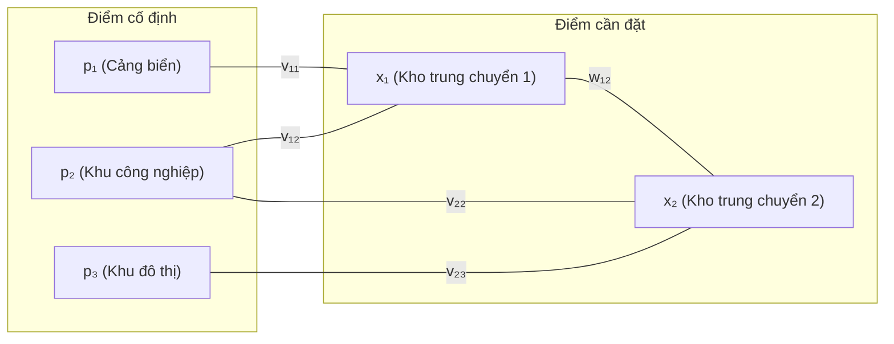

Trong thiết kế hệ thống vi mạch VLSI, quy hoạch mạng lưới phân phối logistics, và thiết lập các trạm phát sóng di động không dây (Cellular Base Stations), một bài toán kỹ thuật thường trực xuất hiện là: Ta đã có sẵn một tập hợp các điểm cố định trên bản đồ (các khu dân cư, các cổng đầu vào/ra của chip, các trạm nguồn), và ta cần tìm vị trí đặt một hoặc nhiều thiết bị mới sao cho tổng chi phí kết nối hoặc tổn hao truyền dẫn là nhỏ nhất.

Đây chính là **Bài toán định vị và đặt vị trí (Placement and Location Problems)**. Tùy thuộc vào hàm đo lường khoảng cách được lựa chọn (khoảng cách toàn phương, khoảng cách Euclid trực diện hay chuẩn Manhattan), bài toán sẽ chuyển hóa một cách tự nhiên từ việc giải một hệ phương trình tuyến tính Laplacian sang Quy hoạch tuyến tính (LP) hoặc Quy hoạch nón bậc hai (SOCP).

## 1. Mô hình hóa bài toán định vị tổng quát

Giả sử ta cần xác định tọa độ trong không gian $d$ chiều ($\mathbb{R}^d$, thông thường $d=2$ hoặc $d=3$) của:
- $N$ điểm tự do cần xác định vị trí: $x_1, x_2, \dots, x_N \in \mathbb{R}^d$.
- $K$ điểm cố định đã biết trước tọa độ: $p_1, p_2, \dots, p_K \in \mathbb{R}^d$.

Giữa các điểm có các liên kết truyền thông, dây dẫn hoặc tuyến vận tải:
- Trọng số liên kết giữa hai điểm tự do $x_i$ và $x_j$ là $w_{ij} \ge 0$ ($w_{ij} = w_{ji}$, $w_{ii} = 0$).
- Trọng số liên kết giữa điểm tự do $x_i$ và điểm cố định $p_k$ là $v_{ik} \ge 0$.

Hàm mục tiêu tổng chi phí cần cực tiểu hóa có dạng tổng quát:

$$
f(x_1, \dots, x_N) = \sum_{1 \le i < j \le N} w_{ij} \phi(x_i - x_j) + \sum_{i=1}^N \sum_{k=1}^K v_{ik} \phi(x_i - p_k),
$$

trong đó $\phi: \mathbb{R}^d \to \mathbb{R}$ là một hàm lồi đo khoảng cách sai lệch giữa hai điểm.

Vì tổng các hàm lồi hợp thành với các hàm affine vẫn là một hàm lồi, bài toán tìm vị trí tối ưu luôn là một bài toán tối ưu lồi, bảo đảm nghiệm tối ưu địa phương luôn là nghiệm tối ưu toàn cục.

## 2. Chi phí khoảng cách toàn phương (Mô hình lò xo Hooke)

Khi tổn hao tín hiệu tỷ lệ thuận với bình phương khoảng cách, hoặc khi ta mô hình hóa các kết nối như các lò xo đàn hồi lý tưởng thỏa mãn định luật Hooke, hàm khoảng cách được chọn là:

$$
\phi(u) = \|u\|_2^2.
$$

Hàm mục tiêu trở thành:

$$
f(x_1, \dots, x_N) = \sum_{1 \le i < j \le N} w_{ij} \|x_i - x_j\|_2^2 + \sum_{i=1}^N \sum_{k=1}^K v_{ik} \|x_i - p_k\|_2^2.
$$

Đây là một hàm toàn phương khả vi vô hạn và lồi ngặt theo toàn bộ vector vị trí $x = (x_1, \dots, x_N) \in \mathbb{R}^{Nd}$.

### Giải nghiệm qua hệ phương trình tuyến tính
Để tìm nghiệm cực tiểu, ta lấy đạo hàm riêng theo từng tọa độ $x_i$ và cho triệt tiêu:

$$
\nabla_{x_i} f = 2 \sum_{j=1}^N w_{ij} (x_i - x_j) + 2 \sum_{k=1}^K v_{ik} (x_i - p_k) = 0.
$$

Tương đương với:

$$
\left( \sum_{j=1}^N w_{ij} + \sum_{k=1}^K v_{ik} \right) x_i - \sum_{j=1}^N w_{ij} x_j = \sum_{k=1}^K v_{ik} p_k.
$$

Đặt $D_i = \sum_{j=1}^N w_{ij} + \sum_{k=1}^K v_{ik}$ là tổng trọng số kết nối vào điểm $x_i$. Hệ phương trình trên có thể viết gọn thành dạng ma trận khối:

$$
(L_w + \operatorname{diag}(V \mathbf{1})) X = V P,
$$

trong đó $L_w$ là ma trận Laplacian của đồ thị kết nối giữa các điểm tự do, và $V$ là ma trận trọng số nối với các điểm neo cố định. 

Ma trận hệ số là ma trận đường chéo trội ngặt (strictly diagonally dominant), do đó luôn đối xứng xác định dương. Nghiệm vị trí tối ưu được tìm ra chỉ bằng đúng một phép giải hệ phương trình tuyến tính (ví dụ bằng phân tích Cholesky hoặc thuật toán Gradient liên hợp CG). Mỗi tọa độ $x_i$ tối ưu bản chất là một phép bình quân gia quyền vị trí giữa các nút lân cận và các điểm neo cố định.

## 3. Chi phí khoảng cách Euclid trực diện (Bài toán Fermat–Weber)

Khi chi phí vận chuyển hàng hóa tỷ lệ thuận với quãng đường thực tế (tính theo kilomet đường chim bay), hàm chi phí là chuẩn Euclid bậc nhất:

$$
\phi(u) = \|u\|_2.
$$

Bài toán trở thành:

$$
\min_{x_1, \dots, x_N} \quad \sum_{1 \le i < j \le N} w_{ij} \|x_i - x_j\|_2 + \sum_{i=1}^N \sum_{k=1}^K v_{ik} \|x_i - p_k\|_2.
$$

Đây là phiên bản tổng quát nhiều chiều của bài toán điểm Fermat kinh điển (tìm điểm có tổng khoảng cách tới 3 đỉnh tam giác nhỏ nhất).

### Cải dạng thành Quy hoạch nón bậc hai (SOCP)
Vì hàm chuẩn Euclid không khả vi tại gốc tọa độ (khi hai điểm trùng nhau), ta không thể giải bằng cách đạo hàm bằng 0 đơn giản. Thay vào đó, ta đưa vào các biến phụ vô hướng $t_{ij} \ge 0$ và $s_{ik} \ge 0$ đóng vai trò chặn trên cho từng khoảng cách:

$$
\begin{aligned}
\min \quad & \sum_{1 \le i < j \le N} w_{ij} t_{ij} + \sum_{i=1}^N \sum_{k=1}^K v_{ik} s_{ik} \\
\text{sao cho} \quad & \|x_i - x_j\|_2 \le t_{ij}, \quad \forall 1 \le i < j \le N, \\
& \|x_i - p_k\|_2 \le s_{ik}, \quad \forall i, k.
\end{aligned}
$$

Mỗi ràng buộc $\|u\|_2 \le t$ chính là một **nón bậc hai (Second-Order Cone)** chuẩn mực. Toàn bộ bài toán trở thành một bài toán Quy hoạch nón bậc hai (SOCP) có thể giải quyết nhanh chóng bằng các thuật toán điểm trong chuyên dụng.

## 4. Chi phí chuẩn Manhattan $\ell_1$ (Mạng lưới ô bàn cờ)

Trong các đô thị có quy hoạch đường phố ô bàn cờ (như New York) hoặc trong công nghệ vi mạch tích hợp VLSI (nơi các dây dẫn chỉ được phép chạy theo hai hướng vuông góc: Hướng ngang hoặc hướng dọc), khoảng cách giữa hai điểm được đo bằng chuẩn $\ell_1$:

$$
\phi(u) = \|u\|_1 = \sum_{r=1}^d |u_r|.
$$

Khi đó, tổng chi phí trở thành:

$$
f(x) = \sum_{1 \le i < j \le N} w_{ij} \sum_{r=1}^d |x_{i,r} - x_{j,r}| + \sum_{i=1}^N \sum_{k=1}^K v_{ik} \sum_{r=1}^d |x_{i,r} - p_{k,r}|.
$$

### Phân rã độc lập theo từng trục tọa độ
Một đặc tính đại số tuyệt đẹp của chuẩn $\ell_1$ là tổng chi phí có thể phân tách thành $d$ bài toán hoàn toàn độc lập với nhau, mỗi bài toán chỉ phụ thuộc vào một trục tọa độ:

$$
f(x) = \sum_{r=1}^d f_r(x_{\cdot, r}),
$$

trong đó $x_{\cdot, r} = (x_{1,r}, x_{2,r}, \dots, x_{N,r}) \in \mathbb{R}^N$ là tọa độ thứ $r$ của các điểm.

Ta có thể tối ưu riêng rẽ tọa độ trục $X$, tọa độ trục $Y$ và tọa độ trục $Z$ mà không ảnh hưởng gì tới nhau! Mỗi bài toán một chiều có thể đưa về Quy hoạch tuyến tính (LP) bằng cách đổi $|u| \le t \iff -t \le u \le t$.

Đặc biệt, trong trường hợp chỉ cần tìm vị trí cho một điểm duy nhất $x \in \mathbb{R}^2$ nối với $K$ điểm neo cố định, bài toán đưa về việc tìm **trung vị có trọng số (Weighted Median)** của tập tọa độ, giải được ở độ phức tạp cực thấp $\mathcal{O}(K \log K)$ chỉ bằng thao tác sắp xếp mảng.

## 5. Ví dụ tính toán minh họa

Một công ty vận tải muốn đặt một kho trung chuyển duy nhất $x \in \mathbb{R}^2$ phục vụ ba trung tâm tiêu thụ hàng hóa đặt tại:

$$
p_1 = \begin{bmatrix} 0 \\ 0 \end{bmatrix}, \qquad p_2 = \begin{bmatrix} 4 \\ 0 \end{bmatrix}, \qquad p_3 = \begin{bmatrix} 0 \\ 4 \end{bmatrix}.
$$

Trọng số vận chuyển của ba trung tâm lần lượt là $v_1 = 1$, $v_2 = 1$, $v_3 = 2$.

### Trường hợp 1: Chi phí bình phương khoảng cách
Hàm mục tiêu:

$$
f(x) = 1 \|x - p_1\|_2^2 + 1 \|x - p_2\|_2^2 + 2 \|x - p_3\|_2^2.
$$

Đạo hàm triệt tiêu:

$$
2(x - p_1) + 2(x - p_2) + 4(x - p_3) = 0 \iff 8x = 2p_1 + 2p_2 + 4p_3.
$$

Tọa độ tối ưu:

$$
x^* = \frac{1(0,0) + 1(4,0) + 2(0,4)}{1 + 1 + 2} = \frac{(4, 8)}{4} = \begin{bmatrix} 1 \\ 2 \end{bmatrix}.
$$

Kho trung chuyển tối ưu chính là tâm tỉ cự của ba điểm neo.

### Trường hợp 2: Chi phí khoảng cách Manhattan $\ell_1$
Tách thành hai bài toán một chiều:
1. **Theo trục $X$**: Hàm số chi phí là:
   $$
   g(x_1) = 1|x_1 - 0| + 1|x_1 - 4| + 2|x_1 - 0| = 3|x_1| + |x_1 - 4|.
   $$
   - Nếu $x_1 < 0$: Độ dốc là $-3 - 1 = -4 < 0$.
   - Nếu $0 < x_1 < 4$: Độ dốc là $3 - 1 = 2 > 0$.
   Điểm làm hàm số đạt cực tiểu là tại điểm gãy $x_1^* = 0$.

2. **Theo trục $Y$**: Hàm số chi phí là:
   $$
   h(x_2) = 1|x_2 - 0| + 1|x_2 - 0| + 2|x_2 - 4| = 2|x_2| + 2|x_2 - 4|.
   $$
   - Nếu $x_2 < 0$: Độ dốc $-2 - 2 = -4$.
   - Nếu $0 \le x_2 \le 4$: Độ dốc $2 - 2 = 0$ (hàm số nằm ngang hằng số!).
   - Nếu $x_2 > 4$: Độ dốc $2 + 2 = 4$.
   Mọi điểm $x_2^* \in [0, 4]$ đều là nghiệm tối ưu!

Kho trung chuyển tối ưu theo chuẩn Manhattan có thể đặt tại bất kỳ vị trí nào trên đoạn thẳng nối $(0, 0)$ và $(0, 4)$.

## Bài tập tự luyện

::: exercise Định vị tháp truyền thông không dây
Ba trạm phát sóng di động đang hoạt động tại các vị trí $p_1 = (0, 3)$, $p_2 = (-4, 0)$, $p_3 = (4, 0)$. Ta cần đặt một trạm thu nhận trung gian $x = (x_1, x_2)$ với chi phí kết nối tỷ lệ với bình phương khoảng cách và trọng số đều nhau ($v_1 = v_2 = v_3 = 1$).

Ngoài ra, vì lý do địa hình, trạm mới phải nằm bên phải đường biên giới tự nhiên: $x_1 \ge 1$.

1. Lập bài toán tối ưu có ràng buộc cho việc tìm vị trí đặt trạm.
2. Tìm nghiệm tối ưu không ràng buộc và kiểm tra tính khả thi.
3. Sử dụng điều kiện KKT để tìm vị trí đặt trạm tối ưu có ràng buộc.
:::

::: solution
1. **Lập bài toán tối ưu**:
   Hàm mục tiêu:
   $$
   f(x) = (x_1 - 0)^2 + (x_2 - 3)^2 + (x_1 + 4)^2 + (x_2 - 0)^2 + (x_1 - 4)^2 + (x_2 - 0)^2.
   $$
   Khai triển:
   $$
   \begin{aligned}
   f(x) &= x_1^2 + (x_1^2 + 8x_1 + 16) + (x_1^2 - 8x_1 + 16) + (x_2^2 - 6x_2 + 9) + x_2^2 + x_2^2 \\
   &= 3x_1^2 + 32 + 3x_2^2 - 6x_2 + 9 = 3x_1^2 + 3(x_2 - 1)^2 + 38.
   \end{aligned}
   $$
   Bài toán tối ưu: Cực tiểu hóa $\min f(x_1, x_2)$ sao cho $1 - x_1 \le 0$.

2. **Nghiệm không ràng buộc**:
   Đạo hàm triệt tiêu tại $x_{\mathrm{uncon}} = (0, 1)$.
   Tại điểm này, $x_1 = 0 < 1$, vi phạm ràng buộc $x_1 \ge 1$!

3. **Điều kiện KKT và nghiệm tối ưu**:
   Vì hàm mục tiêu tách rời hoàn toàn giữa $x_1$ và $x_2$:
   - Với $x_2$: Không có ràng buộc, nghiệm tối ưu đạt tại đỉnh $x_2^* = 1$.
   - Với $x_1$: Hàm $3x_1^2$ đồng biến với mọi $x_1 \ge 0$. Do đó trên miền khả thi $x_1 \ge 1$, giá trị nhỏ nhất đạt được tại chính mút biên $x_1^* = 1$.
   Nhân tử Lagrange tương ứng thỏa mãn phương trình:
   $$
   \nabla_{x_1} f(1) + \lambda(-1) = 6(1) - \lambda = 0 \implies \lambda^* = 6 > 0.
   $$
   Vị trí đặt trạm tối ưu có ràng buộc là $x^* = (1, 1)$.
:::

## Tóm tắt

Bài toán định vị và mạng lưới (Placement and Location Problems) là ứng dụng thực tế trực quan của tối ưu hóa lồi trong thiết kế hệ thống và công nghiệp:
- **Chi phí bình phương khoảng cách**: Đưa về một hệ phương trình ma trận tuyến tính Laplacian đối xứng xác định dương, tương đương với trạng thái cân bằng lực lò xo.
- **Chi phí khoảng cách Euclid (Weber)**: Đưa về Quy hoạch nón bậc hai (SOCP), giải bằng phương pháp điểm trong.
- **Chi phí khoảng cách Manhattan**: Phân rã độc lập theo từng trục tọa độ và quy về Quy hoạch tuyến tính (LP) hoặc bài toán tìm trung vị một chiều.

## Tài liệu tham khảo

- Stephen Boyd, Lieven Vandenberghe, *Convex Optimization*, Cambridge University Press, Chapter 8: Geometric Problems (§8.7).
