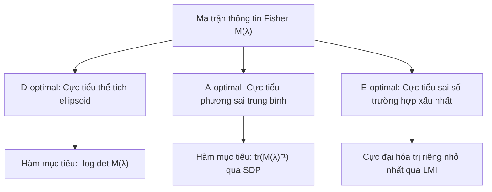

Trong khoa học dữ liệu, học máy chủ động (Active Learning) và kỹ thuật thực nghiệm, việc thu thập dữ liệu thường tốn kém chi phí, thời gian hoặc năng lượng. Một câu hỏi cốt lõi đặt ra là: Nếu ta chỉ có ngân sách thực hiện $m$ phép đo từ một tập $p$ phép thử khả dĩ ($p \ge n$), ta nên phân bổ số lần đo cho từng phép thử như thế nào để vector tham số chưa biết được ước lượng với độ chính xác cao nhất?

Bài toán **thiết kế thí nghiệm tối ưu (Optimal Experiment Design)** giải quyết trọn vẹn câu hỏi này. Bằng cách kết nối ma trận thông tin Fisher với ellipsoid sai số ước lượng, bài toán phân bổ nguyên được nới lỏng thành một bài toán tối ưu lồi quy mô lớn, mở đường cho các tiêu chuẩn tối ưu kinh điển như $D$-optimal, $A$-optimal và $E$-optimal.

## 1. Mô hình đo lường tuyến tính và Ma trận Fisher

Xét bài toán ước lượng vector tham số ẩn $x \in \mathbb{R}^n$. Người làm thí nghiệm có thể lựa chọn từ $p$ phép đo thử nghiệm khả dĩ với các vector đặc trưng $v_1, v_2, \dots, v_p \in \mathbb{R}^n$.

Mỗi khi chọn phép thử $i$, ta thu được một kết quả đo vô hướng $y$:

$$
y = v_i^T x + w,
$$

trong đó $w$ là nhiễu đo lường ngẫu nhiên độc lập có phân phối chuẩn $\mathcal{N}(0, \sigma^2)$ với $\sigma^2 > 0$.

Giả sử ta thực hiện phép thử thứ $i$ đúng $m_i$ lần ($m_i \in \{0, 1, 2, \dots\}$), với tổng ngân sách đo lường cố định là $m$:

$$
\sum_{i=1}^p m_i = m_1 + m_2 + \dots + m_p = m.
$$

Sau khi hoàn tất toàn bộ $m$ phép đo, ước lượng bình phương tối thiểu (cũng là ước lượng hợp lý cực đại - MLE) của vector tham số $x$ có ma trận hiệp phương sai sai số là:

$$
\operatorname{Cov}(\hat{x}) = \sigma^2 \left( \sum_{i=1}^p m_i v_i v_i^T \right)^{-1}.
$$

Đại lượng trung tâm quyết định độ chuẩn xác của ước lượng chính là **Ma trận thông tin Fisher (Fisher Information Matrix)**:

$$
M = \sum_{i=1}^p m_i v_i v_i^T = m_1 v_1 v_1^T + m_2 v_2 v_2^T + \dots + m_p v_p v_p^T.
$$

Ma trận $M \in \mathbb{S}_+^n$ là một ma trận đối xứng nửa xác định dương. Để vector tham số $x$ có thể ước lượng được (hệ xác định duy nhất), ma trận $M$ bắt buộc phải khả nghịch, tức là đối xứng xác định dương $M \succ 0$. Khi đó, ellipsoid tin cậy của sai số ước lượng $\hat{x} - x$ tại mức ý nghĩa thống kê tỷ lệ thuận với ma trận nghịch đảo:

$$
\mathcal{E}_{\text{sai số}} = \big\{ e \in \mathbb{R}^n \mid e^T M e \le 1 \big\}.
$$

Mục tiêu của người thiết kế thí nghiệm là làm cho ma trận thông tin $M$ "càng lớn càng tốt" theo nghĩa nửa xác định dương, tương đương với việc thu nhỏ thể tích hoặc bán kính của ellipsoid sai số $M^{-1}$.

## 2. Nới lỏng liên tục (Relaxed Experiment Design)

Bài toán tìm các số nguyên $m_i \in \mathbb{N}$ thỏa mãn $\sum_{i=1}^p m_i = m$ là một bài toán tối ưu rời rạc (tổ hợp) rất khó giải khi $p$ và $m$ lớn.

Để giải quyết một cách hiệu quả, ta chia cả hai vế cho tổng số phép đo $m$ và đặt:

$$
\lambda_i = \frac{m_i}{m}, \qquad \forall i = 1, \dots, p.
$$

Đại lượng $\lambda_i$ biểu diễn tỷ lệ phần trăm phân bổ ngân sách cho phép thử thứ $i$. Khi cho phép $\lambda_i$ nhận các giá trị thực liên tục trong đoạn $[0, 1]$, ta thu được bài toán **thiết kế thí nghiệm nới lỏng (Relaxed Design)**:

$$
\lambda \in \Delta = \left\{ \lambda \in \mathbb{R}^p \;\middle|\; \sum_{i=1}^p \lambda_i = \lambda_1 + \dots + \lambda_p = 1, \quad \lambda_i \ge 0, \; \forall i = 1, \dots, p \right\}.
$$

Ma trận thông tin Fisher chuẩn hóa trở thành một hàm affine theo vector phân bổ $\lambda$:

$$
M(\lambda) = \sum_{i=1}^p \lambda_i v_i v_i^T = \lambda_1 v_1 v_1^T + \lambda_2 v_2 v_2^T + \dots + \lambda_p v_p v_p^T.
$$

Vì $M(\lambda)$ là tổ hợp lồi của các ma trận hạng một $v_i v_i^T \succeq 0$, ánh xạ $\lambda \mapsto M(\lambda)$ là ánh xạ affine, bảo toàn trọn vẹn tính lồi của các hàm tiêu chuẩn tiếp theo.

## 3. Các tiêu chuẩn tối ưu lồi kinh điển

Có nhiều cách khác nhau để định lượng độ "lớn" của ma trận thông tin $M(\lambda)$, tương ứng với các tiêu chuẩn thiết kế thực nghiệm cổ điển:

### Tiêu chuẩn D-optimal (Determinant Criterion)

Tiêu chuẩn $D$-optimal hướng tới việc thu nhỏ **thể tích** của ellipsoid tin cậy sai số. Thể tích của ellipsoid $\mathcal{E}_{\text{sai số}}$ tỷ lệ nghịch với căn bậc hai định thức của $M(\lambda)$:

$$
\operatorname{Vol}(\mathcal{E}_{\text{sai số}}) \propto \frac{1}{\sqrt{\det M(\lambda)}} = \left( \det M(\lambda)^{-1} \right)^{1/2}.
$$

Thu nhỏ thể tích tương đương với cực đại hóa định thức $\det M(\lambda)$, hay thuận tiện hơn là cực tiểu hóa hàm đối logarit định thức:

$$
\begin{aligned}
\min_{\lambda} \quad & -\log \det M(\lambda) \\
\text{sao cho} \quad & \sum_{i=1}^p \lambda_i = 1, \\
& \lambda_i \ge 0, \quad \forall i = 1, \dots, p.
\end{aligned}
$$

Vì hàm số $f(X) = -\log \det X$ là hàm lồi ngặt trên nón ma trận đối xứng xác định dương $\mathbb{S}_{++}^n$, và $M(\lambda)$ phụ thuộc affine vào $\lambda$, bài toán $D$-optimal là một **bài toán tối ưu lồi ngặt**. Nghiệm tối ưu $\lambda^*$ là duy nhất và có thể giải quyết nhanh chóng bằng thuật toán Newton hoặc phương pháp điểm trong.

### Tiêu chuẩn A-optimal (Average Variance Criterion)

Tiêu chuẩn $A$-optimal hướng tới việc cực tiểu hóa **tổng phương sai** (hoặc phương sai trung bình) của các thành phần ước lượng:

$$
\sum_{j=1}^n \operatorname{Var}(\hat{x}_j) = \sigma^2 \operatorname{tr}\left( M(\lambda)^{-1} \right).
$$

Bỏ qua hằng số $\sigma^2$, bài toán được phát biểu thành:

$$
\begin{aligned}
\min_{\lambda} \quad & \operatorname{tr}\left( M(\lambda)^{-1} \right) \\
\text{sao cho} \quad & \sum_{i=1}^p \lambda_i = 1, \\
& \lambda_i \ge 0, \quad \forall i = 1, \dots, p.
\end{aligned}
$$

Hàm số $f(X) = \operatorname{tr}(X^{-1})$ là hàm lồi trên $\mathbb{S}_{++}^n$. Dùng bổ đề phần bù Schur, ta chuyển đổi bài toán $A$-optimal sang dạng Quy hoạch nửa xác định (SDP) chuẩn mực bằng cách đưa vào các biến phụ $u \in \mathbb{R}^n$:

$$
\begin{aligned}
\min_{\lambda, u} \quad & \sum_{j=1}^n u_j \\
\text{sao cho} \quad & \begin{bmatrix} M(\lambda) & e_j \\ e_j^T & u_j \end{bmatrix} \succeq 0, \quad \forall j = 1, \dots, n, \\
& \sum_{i=1}^p \lambda_i = 1, \quad \lambda_i \ge 0, \quad \forall i = 1, \dots, p,
\end{aligned}
$$

trong đó $e_j$ là vector đơn vị thứ $j$ trong $\mathbb{R}^n$.

### Tiêu chuẩn E-optimal (Eigenvalue Criterion)

Tiêu chuẩn $E$-optimal hướng tới việc bảo vệ ước lượng trong **trường hợp xấu nhất**. Chiều dài trục bán kính dài nhất của ellipsoid sai số bằng căn bậc hai của trị riêng lớn nhất của ma trận nghịch đảo $\lambda_{\max}(M(\lambda)^{-1})$, tức là $1 / \lambda_{\min}(M(\lambda))$.

Do đó, tiêu chuẩn $E$-optimal cực đại hóa trị riêng nhỏ nhất của $M(\lambda)$:

$$
\begin{aligned}
\max_{\lambda, t} \quad & t \\
\text{sao cho} \quad & M(\lambda) \succeq t I_n, \\
& \sum_{i=1}^p \lambda_i = 1, \quad \lambda_i \ge 0, \quad \forall i = 1, \dots, p.
\end{aligned}
$$

Đây là một bài toán Quy hoạch nửa xác định (SDP) trực tiếp với một bất đẳng thức ma trận tuyến tính (LMI).

## 4. Làm tròn số nguyên (Rounding) và Tính thưa

Sau khi tìm được nghiệm liên tục tối ưu $\lambda^*$, ta cần khôi phục lại các số nguyên $m_i$:
1. Nếu tổng số phép đo $m$ rất lớn ($m \gg n$), ta chỉ cần làm tròn đơn giản:
   $$
   m_i \approx \operatorname{round}(m \lambda_i^*),
   $$
   sau đó điều chỉnh nhỏ để tổng bằng $m$. Tổn thất độ chính xác do làm tròn khi đó là không đáng kể (cỡ $\mathcal{O}(1/m)$).
2. **Tính thưa của nghiệm (Sparsity)**: Một định lý sâu sắc của lý thuyết thiết kế thực nghiệm chỉ ra rằng luôn tồn tại một nghiệm tối ưu $\lambda^*$ có nhiều nhất $n(n+1)/2$ thành phần khác 0. Điều này có nghĩa là ta không cần thực hiện toàn bộ $p$ phép thử, mà chỉ cần chọn lọc một tập hợp con rất nhỏ các phép đo quan trọng nhất.

## 5. Ví dụ tính toán minh họa

Xét bài toán ước lượng vector tham số hai chiều $x \in \mathbb{R}^2$ ($n = 2$) với ngân sách đo lường $m = 100$. Ta có $p = 3$ phép thử ứng viên:

$$
v_1 = \begin{bmatrix} 1 \\ 0 \end{bmatrix}, \qquad v_2 = \begin{bmatrix} 0 \\ 1 \end{bmatrix}, \qquad v_3 = \begin{bmatrix} 1 \\ 1 \end{bmatrix}.
$$

Ta phân bổ tỷ lệ đo $\lambda = (\lambda_1, \lambda_2, \lambda_3)$ với $\lambda_1 + \lambda_2 + \lambda_3 = 1$ và $\lambda_i \ge 0$.

Các ma trận hạng một tương ứng:

$$
v_1 v_1^T = \begin{bmatrix} 1 & 0 \\ 0 & 0 \end{bmatrix}, \qquad v_2 v_2^T = \begin{bmatrix} 0 & 0 \\ 0 & 1 \end{bmatrix}, \qquad v_3 v_3^T = \begin{bmatrix} 1 & 1 \\ 1 & 1 \end{bmatrix}.
$$

Ma trận thông tin Fisher:

$$
M(\lambda) = \begin{bmatrix} \lambda_1 + \lambda_3 & \lambda_3 \\ \lambda_3 & \lambda_2 + \lambda_3 \end{bmatrix}.
$$

Định thức của ma trận:

$$
\det M(\lambda) = (\lambda_1 + \lambda_3)(\lambda_2 + \lambda_3) - \lambda_3^2 = \lambda_1 \lambda_2 + \lambda_1 \lambda_3 + \lambda_2 \lambda_3.
$$

Để áp dụng tiêu chuẩn $D$-optimal, ta cực đại hóa định thức này với điều kiện $\lambda_1 + \lambda_2 + \lambda_3 = 1$:

Theo bất đẳng thức đại số quen thuộc:

$$
\lambda_1 \lambda_2 + \lambda_1 \lambda_3 + \lambda_2 \lambda_3 \le \frac{1}{3} (\lambda_1 + \lambda_2 + \lambda_3)^2 = \frac{1}{3}.
$$

Dấu bằng đạt được khi và chỉ khi:

$$
\lambda_1^* = \lambda_2^* = \lambda_3^* = \frac{1}{3}.
$$

Nghiệm $D$-optimal khuyến nghị phân bổ đồng đều ngân sách cho cả ba hướng thử nghiệm: Mỗi hướng đo xấp xỉ $33$ đến $34$ lần. Khi đó định thức đạt giá trị cực đại là $1/3$, cho thể tích ellipsoid sai số nhỏ nhất có thể.

## Bài tập tự luyện

::: exercise Bài toán phân bổ cảm biến định vị
Một trạm quan trắc cần ước lượng vị trí nguồn phát tín hiệu $x \in \mathbb{R}^2$. Trạm có thể kích hoạt 4 cảm biến đặt tại các góc đo:

$$
v_1 = \begin{bmatrix} 1 \\ 0 \end{bmatrix}, \quad v_2 = \begin{bmatrix} -1 \\ 0 \end{bmatrix}, \quad v_3 = \begin{bmatrix} 0 \\ 1 \end{bmatrix}, \quad v_4 = \begin{bmatrix} 0 \\ -1 \end{bmatrix}.
$$

1. Chứng minh rằng $v_1 v_1^T = v_2 v_2^T$ và $v_3 v_3^T = v_4 v_4^T$.
2. Hãy rút gọn ma trận thông tin $M(\lambda)$ theo hai biến gộp $w_1 = \lambda_1 + \lambda_2$ và $w_2 = \lambda_3 + \lambda_4$.
3. Tìm phân bổ tối ưu theo tiêu chuẩn $D$-optimal và $A$-optimal.
:::

::: solution
1. **Tính các ma trận hạng một**:
   $$
   v_1 v_1^T = \begin{bmatrix} 1 \\ 0 \end{bmatrix} \begin{bmatrix} 1 & 0 \end{bmatrix} = \begin{bmatrix} 1 & 0 \\ 0 & 0 \end{bmatrix}, \qquad v_2 v_2^T = \begin{bmatrix} -1 \\ 0 \end{bmatrix} \begin{bmatrix} -1 & 0 \end{bmatrix} = \begin{bmatrix} 1 & 0 \\ 0 & 0 \end{bmatrix}.
   $$
   Tương tự:
   $$
   v_3 v_3^T = v_4 v_4^T = \begin{bmatrix} 0 & 0 \\ 0 & 1 \end{bmatrix}.
   $$
   Hai cảm biến đối xứng nhau qua gốc tọa độ mang lại ma trận thông tin giống hệt nhau.

2. **Rút gọn ma trận Fisher**:
   Đặt $w_1 = \lambda_1 + \lambda_2$ và $w_2 = \lambda_3 + \lambda_4$. Ta có $w_1 + w_2 = 1$ với $w_1, w_2 \ge 0$.
   Ma trận Fisher có dạng đường chéo:
   $$
   M(w) = \begin{bmatrix} w_1 & 0 \\ 0 & w_2 \end{bmatrix}.
   $$

3. **Tìm phân bổ tối ưu**:
   - Tiêu chuẩn $D$-optimal: Cực đại $\det M(w) = w_1 w_2$. Tích này đạt cực đại trên đoạn $[0, 1]$ khi $w_1^* = w_2^* = 1/2$.
   - Tiêu chuẩn $A$-optimal: Cực tiểu $\operatorname{tr}(M(w)^{-1}) = \frac{1}{w_1} + \frac{1}{w_2}$. Theo bất đẳng thức Cauchy-Schwarz, tổng này đạt cực tiểu khi $w_1^* = w_2^* = 1/2$.
   Như vậy, cả hai tiêu chuẩn đều dẫn tới kết luận: Dành $50\%$ thời gian đo theo phương ngang (chia tùy ý giữa cảm biến 1 và 2) và $50\%$ thời gian đo theo phương dọc (chia tùy ý giữa cảm biến 3 và 4).
:::

## Tóm tắt

Thiết kế thí nghiệm tối ưu (Optimal Experiment Design) biến bài toán chọn mẫu dữ liệu thực nghiệm thành một bài toán tối ưu lồi quy mô lớn thông qua việc nới lỏng liên tục phân bổ ngân sách. Việc cực đại hóa thông tin Fisher hoặc cực tiểu hóa ellipsoid sai số qua các tiêu chuẩn $D$-optimal (log-det), $A$-optimal (trace inverse) và $E$-optimal (SDP) là nền móng toán học vững chắc cho các kỹ thuật Active Learning, A/B Testing và giảm thiểu chi phí gắn nhãn dữ liệu trong Trí tuệ Nhân tạo hiện đại.

## Tài liệu tham khảo

- Stephen Boyd, Lieven Vandenberghe, *Convex Optimization*, Cambridge University Press, Chapter 7: Statistical Estimation (§7.5).
