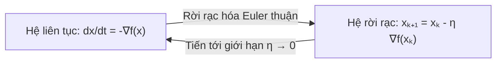
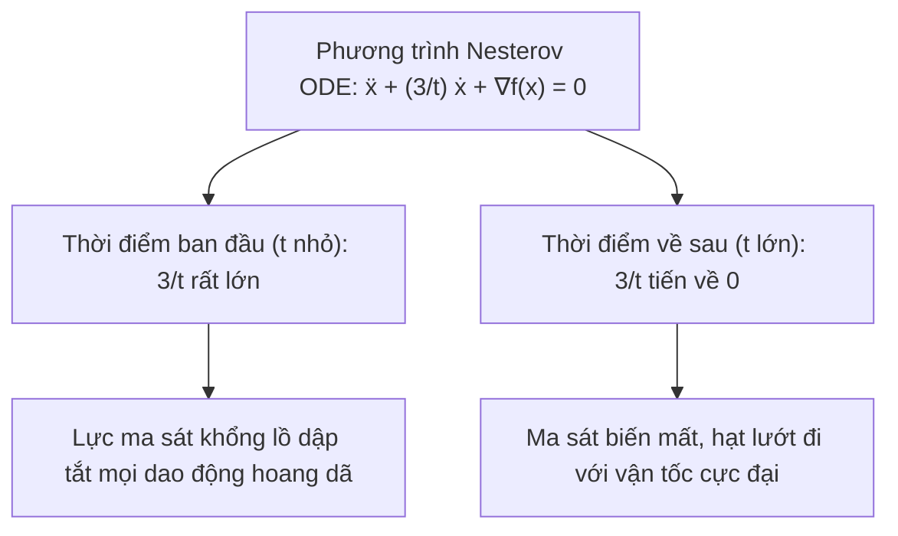

# Tối ưu hóa dưới lăng kính Hệ động lực liên tục và Động lượng Nesterov

Trong hầu hết các bài giảng khoa học máy tính, các thuật toán tối ưu hóa thường được giới thiệu như các quy tắc lặp rời rạc: Cho bước $k$, ta tính vector gradient tại điểm hiện tại rồi cộng trừ để thu được điểm ở bước $k+1$. 

Cách tiếp cận này tuy đơn giản nhưng thường che khuất bức tranh tổng thể và khiến cho một số thuật toán kinh điển, tiêu biểu là **Phương pháp gia tốc Nesterov (Nesterov Accelerated Gradient)**, trở nên giống như một "phép thuật đại số" khó nắm bắt. Suốt ba thập kỷ kể từ khi Yurii Nesterov công bố thuật toán vào năm 1983, người ta vẫn không khỏi tự hỏi: Tại sao một sự kết hợp tham số tưởng chừng kỳ lạ lại có thể tăng tốc độ hội tụ từ $\mathcal{O}(1/k)$ lên $\mathcal{O}(1/k^2)$?

Năm 2014, một công trình lịch sử của Weijie Su, Stephen Boyd và Emmanuel Candès tại Đại học Stanford đã hé lộ lời giải đáp: Khi cho độ dài bước lặp tiến về 0, các thuật toán tối ưu hóa rời rạc chính là quỹ đạo chuyển động của các **hệ động lực vật lý liên tục** được mô tả bằng các phương trình vi phân thường (ODEs).

---

## 1. Dòng chảy Gradient (Gradient Flow) và Phương pháp Euler

Xét hàm mục tiêu khả vi liên tục $f: \mathbb{R}^n \to \mathbb{R}$. Hãy tưởng tượng một chất điểm có tọa độ $x(t) \in \mathbb{R}^n$ di chuyển liên tục theo thời gian thực $t \ge 0$.

Quy luật chuyển động tự nhiên nhất để chất điểm luôn lăn xuống dốc theo hướng giảm nhanh nhất của thế năng $f$ là:

$$
\frac{dx(t)}{dt} = -\nabla f(x(t)), \qquad x(0) = x_0.
$$

Phương trình vi phân thường phi tuyến này được gọi là **Dòng chảy gradient (Gradient Flow)**.

### Bảo toàn tính suy giảm năng lượng qua hàm Lyapunov
Ta kiểm tra tốc độ thay đổi của giá trị hàm số $f(x(t))$ dọc theo quỹ đạo chuyển động bằng quy tắc chuỗi:

$$
\frac{d}{dt} f(x(t)) = \nabla f(x(t))^T \left( \frac{dx(t)}{dt} \right) = \nabla f(x(t))^T \big( -\nabla f(x(t)) \big) = -\|\nabla f(x(t))\|_2^2.
$$

Vì bình phương chuẩn Euclid luôn không âm, ta có:

$$
\frac{d}{dt} f(x(t)) \le 0.
$$

Đạo hàm chỉ bằng 0 khi và chỉ khi $\|\nabla f(x(t))\|_2 = 0$ (chất điểm đã chạm tới một điểm dừng). Hàm số $f(x(t))$ đóng vai trò như một **hàm Lyapunov**, bảo đảm rằng năng lượng thế năng luôn suy giảm nghiêm ngặt theo thời gian!

### Phương pháp Euler thuận: Sinh ra Gradient Descent
Nếu ta rời rạc hóa phương trình vi phân trên bằng phương pháp xấp xỉ đạo hàm sai phân Euler thuận với bước thời gian $\eta > 0$:

$$
\frac{x(t + \eta) - x(t)}{\eta} \approx -\nabla f(x(t)) \implies x(t + \eta) = x(t) - \eta \nabla f(x(t)).
$$

Đặt $x_k = x(k\eta)$, ta thu được chính xác thuật toán **Gradient Descent** quen thuộc:

$$
x_{k+1} = x_k - \eta \nabla f(x_k).
$$

Mọi phân tích hội tụ của Gradient Descent trong không gian rời rạc thực chất chỉ là xấp xỉ sai số của dòng chảy liên tục khi bước thời gian $\eta$ bị giới hạn bởi độ trơn Lipschitz của gradient.

---

## 2. Động lượng Polyak: Con lắc chịu lực ma sát hằng số

Năm 1964, Boris Polyak đề xuất phương pháp Heavy-Ball (Momentum) bằng cách bổ sung một số hạng quán tính:

$$
x_{k+1} = x_k - \eta \nabla f(x_k) + \beta (x_k - x_{k-1}).
$$

Chuyển số hạng $x_k$ sang vế trái và viết lại:

$$
(x_{k+1} - 2x_k + x_{k-1}) + (1 - \beta)(x_k - x_{k-1}) + \eta \nabla f(x_k) = 0.
$$

Khi bước thời gian $h = \sqrt{\eta} \to 0$ và đặt $1 - \beta = \gamma h$ ($\gamma > 0$), số hạng sai phân bậc hai tiến về đạo hàm cấp hai $\ddot{x}(t)$, số hạng sai phân bậc nhất tiến về vận tốc $\dot{x}(t)$. Ta thu được phương trình vi phân cấp hai:

$$
\ddot{x}(t) + \gamma \dot{x}(t) + \nabla f(x(t)) = 0.
$$

Về mặt vật lý, đây chính là **Định luật II Newton ($F = ma$)** cho một chất điểm có khối lượng $m = 1$ chuyển động trong trường thế năng $f(x)$:
- $\ddot{x}(t)$: Lực quán tính (gia tốc).
- $\gamma \dot{x}(t)$: Lực cản nhớt (ma sát) tỷ lệ với vận tốc, với hệ số ma sát cố định $\gamma > 0$.
- $\nabla f(x(t))$: Lực kéo thế năng.

Lực ma sát hằng số $\gamma$ giúp dập tắt dao động, nhưng vì $\gamma$ không đổi, quả bóng có thể bị trượt quá đà hoặc mất động lượng khi đi vào các thung lũng hẹp.

---

## 3. Lời giải mã Gia tốc Nesterov: Hệ số ma sát biến thiên $3/t$

Phương pháp gia tốc Nesterov cập nhật tham số qua hai bước lặp:

$$
\begin{aligned}
y_k &= x_k + \frac{k-1}{k+2} (x_k - x_{k-1}), \\
x_{k+1} &= y_k - s \nabla f(y_k).
\end{aligned}
$$

Hệ số động lượng $\frac{k-1}{k+2}$ không phải là hằng số, mà tăng dần theo số bước lặp $k$: Bắt đầu từ $0, \frac{1}{4}, \frac{2}{5}, \dots$ và tiệm cận về $1$.

Năm 2014, Su, Boyd và Candès đã chứng minh rằng khi bước nhảy $s \to 0$, quỹ đạo của thuật toán Nesterov hội tụ chính xác về một phương trình vi phân cấp hai phi thường:

$$
\ddot{x}(t) + \frac{3}{t} \dot{x}(t) + \nabla f(x(t)) = 0, \qquad t > 0.
$$

### Ý nghĩa vật lý trực quan của hệ số ma sát $3/t$
Phương trình trên mô tả một chất điểm chuyển động với **hệ số ma sát giảm dần tỷ lệ nghịch với thời gian**: $\gamma(t) = \frac{3}{t}$.

1. **Giai đoạn đầu ($t \to 0$)**: Hệ số ma sát $\frac{3}{t} \to +\infty$. Lực cản cực lớn này dập tắt ngay lập tức mọi dao động hỗn loạn ban đầu, giữ cho chất điểm không bị văng ra khỏi lưu vực hấp dẫn.
2. **Giai đoạn sau ($t \to +\infty$)**: Hệ số ma sát $\frac{3}{t} \to 0$. Khi chất điểm đã đi đúng vào lòng máng của thung lũng, lực ma sát biến mất, cho phép chất điểm bảo toàn tối đa động năng và lướt đi với tốc độ cực nhanh.

### Chứng minh tốc độ hội tụ $\mathcal{O}(1/t^2)$ qua hàm Lyapunov
Để chứng minh tốc độ hội tụ của hệ liên tục, Su, Boyd và Candès đã xây dựng hàm Lyapunov kết hợp giữa thế năng và cơ năng:

$$
\mathcal{E}(t) = t^2 \big( f(x(t)) - f^* \big) + 2 \left\| x(t) - x^* + \frac{t}{2} \dot{x}(t) \right\|_2^2.
$$

Đạo hàm của hàm năng lượng theo thời gian thỏa mãn:

$$
\frac{d}{dt} \mathcal{E}(t) \le 0, \qquad \forall t > 0.
$$

Do đó, năng lượng tại thời điểm $t$ không vượt quá năng lượng tại thời điểm ban đầu: $\mathcal{E}(t) \le \mathcal{E}(0) = 2 \|x_0 - x^*\|_2^2$.

Suy ra:

$$
t^2 \big( f(x(t)) - f^* \big) \le \mathcal{E}(t) \le 2 \|x_0 - x^*\|_2^2,
$$

tương đương với:

$$
f(x(t)) - f^* \le \frac{2 \|x_0 - x^*\|_2^2}{t^2} = \mathcal{O}\left( \frac{1}{t^2} \right).
$$

Khi quy đổi thời gian liên tục $t$ sang số bước lặp rời rạc $k$ ($t \sim k \sqrt{s}$), ta thu được chính xác cận hội tụ tối ưu $\mathcal{O}(1/k^2)$ của Nesterov! Bằng cách nhìn qua lăng kính phương trình vi phân, điều bí ẩn kéo dài 30 năm đã được giải thích một cách trong sáng và tự nhiên.

---

## 4. Mở rộng: Mạng nơ-ron như một Phương trình vi phân (Neural ODEs)

Ý tưởng xem quá trình rời rạc như một hệ liên tục không chỉ dừng lại ở các thuật toán tối ưu, mà còn truyền cảm hứng cho kiến trúc mạng nơ-ron hiện đại.

Xét mạng nơ-ron dư (Residual Network - ResNet), công thức cập nhật trạng thái ẩn qua các tầng là:

$$
h_{t+1} = h_t + f(h_t, \theta_t).
$$

Nếu ta xem chỉ số tầng $t$ như một bước thời gian $\Delta t = 1$:

$$
\frac{h_{t+1} - h_t}{\Delta t} = f(h_t, \theta_t).
$$

Khi số tầng tiến ra vô hạn và khoảng cách giữa các tầng tiến về 0, ta thu được mô hình **Neural ODE** (Chen et al., NeurIPS 2018):

$$
\frac{dh(t)}{dt} = f(h(t), t, \theta).
$$

Trạng thái đầu ra của mạng tại tầng cuối chính là tích phân của phương trình vi phân xuất phát từ đầu vào $h(0) = x$. Việc tính toán gradient để huấn luyện mạng khi đó được giải quyết thanh thoát bằng **phương pháp liên hợp (Adjoint State Method)** của lý thuyết điều khiển tối ưu Pontryagin, cho phép huấn luyện mạng nơ-ron có độ sâu tùy ý với chi phí bộ nhớ hằng số $\mathcal{O}(1)$!

---

## Tóm tắt

Lăng kính hệ động lực liên tục đem lại một góc nhìn thống nhất và giàu trực giác cho lý thuyết tối ưu hóa:
- Gradient Descent là phép rời rạc hóa Euler của dòng chảy gradient có năng lượng Lyapunov suy giảm đơn điệu.
- Động lượng Polyak mô phỏng con lắc vật lý Newton với ma sát hằng số.
- Gia tốc Nesterov giải mã thành công nhờ phương trình vi phân với lực ma sát biến thiên $3/t$, đạt tốc độ suy giảm thế năng $\mathcal{O}(1/t^2)$.
- Cầu nối liên tục này mở đường cho các mô hình học sâu hiện đại như Neural ODEs và dòng chảy chuẩn hóa (Normalizing Flows).

---

## Tài liệu tham khảo

- Weijie Su, Stephen Boyd, Emmanuel Candès, *A Dynamical System Perspective on Nesterov's Accelerated Gradient Method: A Non-Harmonic Oscillator View*, JMLR 2016 (NeurIPS 2014).
- Ricky T. Q. Chen, Yulia Rubanova, Jesse Bettencourt, David Duvenaud, *Neural Ordinary Differential Equations*, NeurIPS 2018.
- Yurii Nesterov, *A method for solving the convex programming problem with convergence rate $O(1/k^2)$*, Soviet Mathematics Doklady 1983.
- Stephen Boyd, Lieven Vandenberghe, *Convex Optimization*, Cambridge University Press.
