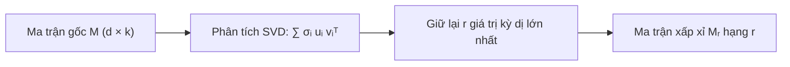
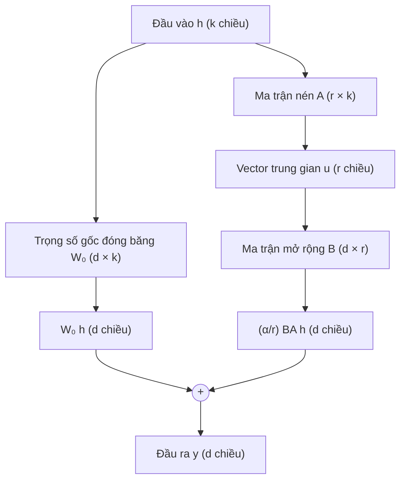

# Đại số tuyến tính của LoRA và Tối ưu hóa ma trận hạng thấp trong LLM

Trong kỷ nguyên của các mô hình ngôn ngữ lớn (Large Language Models - LLM), việc tinh chỉnh (fine-tuning) một mô hình có hàng chục tỷ tham số (như LLaMA, Mistral, GPT) đặt ra thách thức khổng lồ về mặt tài nguyên tính toán. Một mô hình $70$ tỷ tham số đòi hỏi hàng trăm gigabyte bộ nhớ đồ họa (VRAM) chỉ để lưu trữ trọng số, và thêm gấp 3 đến 4 lần dung lượng đó để lưu trữ gradient và trạng thái bộ tối ưu (như Adam).

Năm 2021, kỹ thuật **LoRA (Low-Rank Adaptation)** ra đời và tạo nên một cuộc cách mạng trong việc tinh chỉnh mô hình. Thay vì cập nhật toàn bộ ma trận trọng số, LoRA đóng băng trọng số gốc và chỉ tối ưu hóa hai ma trận nhỏ có hạng cực thấp.

Bản chất của LoRA không phải là một mẹo lập trình ngẫu nhiên, mà bắt nguồn sâu sắc từ các nguyên lý đại số tuyến tính cổ điển: **Định lý xấp xỉ hạng thấp Eckart–Young–Mirsky**, **chiều nội tại (intrinsic dimension)** và **tối ưu hóa ma trận**.

---

## 1. Chiều nội tại và Giả thuyết hạng thấp

Giả sử ma trận trọng số trong một tầng biến đổi tuyến tính (chẳng hạn như tầng chiếu Query hoặc Value trong cơ chế Self-Attention) có kích thước:

$$
W_0 \in \mathbb{R}^{d \times k},
$$

với $d, k$ thường ở mức $4096$, $8192$ hoặc lớn hơn. Số lượng tham số của một ma trận đơn lẻ này là $d \times k \approx 16$ đến $67$ triệu số thực.

Khi tinh chỉnh mô hình cho một tác vụ chuyên biệt (chẳng hạn như tóm tắt văn bản y khoa hoặc trích xuất dữ liệu có cấu trúc), trọng số cần cập nhật là:

$$
W = W_0 + \Delta W,
$$

trong đó $\Delta W \in \mathbb{R}^{d \times k}$ là lượng biến thiên tham số cần học.

Các nghiên cứu thực nghiệm tiên phong của Aghajanyan và cộng sự (2020) đã phát hiện ra một tính chất toán học nền tảng: Mặc dù không gian tham số của mạng nơ-ron có chiều cực lớn ($d \times k$), nhưng **chiều nội tại (intrinsic dimension)** của sự thích nghi cho một tác vụ cụ thể lại rất nhỏ. Nói cách khác, ma trận biến thiên $\Delta W$ có thể được biểu diễn một cách chính xác đáng kinh ngạc trong một không gian con có số chiều thấp hơn rất nhiều so với không gian ban đầu.

---

## 2. Định lý Eckart–Young–Mirsky: Xấp xỉ hạng thấp tối ưu

Để hiểu tại sao một ma trận lớn có thể thay thế bằng một ma trận hạng thấp, ta quay về định lý nền tảng của đại số tuyến tính số trị: Phân tích giá trị kỳ dị (Singular Value Decomposition - SVD).

Mọi ma trận $M \in \mathbb{R}^{d \times k}$ đều có thể phân tích thành:

$$
M = U \Sigma V^T = \sum_{i=1}^{\min(d, k)} \sigma_i u_i v_i^T,
$$

trong đó $U, V$ là các ma trận trực giao và $\sigma_1 \ge \sigma_2 \ge \dots \ge \sigma_{\min(d, k)} \ge 0$ là các giá trị kỳ dị.

### Định lý Eckart–Young–Mirsky
Nếu ta muốn tìm một ma trận hạng thấp $M_r$ có $\operatorname{rank}(M_r) \le r < \min(d, k)$ gần với $M$ nhất theo chuẩn Frobenius:

$$
\min_{X \in \mathbb{R}^{d \times k}} \|M - X\|_F \qquad \text{sao cho} \quad \operatorname{rank}(X) \le r,
$$

thì nghiệm tối ưu duy nhất chính là việc cắt ngắn phân tích SVD lấy $r$ số hạng đầu tiên:

$$
M_r = \sum_{i=1}^r \sigma_i u_i v_i^T.
$$

Sai số xấp xỉ nhỏ nhất đạt được chính xác bằng tổng bình phương của các giá trị kỳ dị bị bỏ qua:

$$
\|M - M_r\|_F^2 = \sum_{i=r+1}^{\min(d, k)} \sigma_i^2.
$$

Nếu phổ giá trị kỳ dị của một ma trận suy giảm nhanh (các giá trị kỳ dị đầu tiên rất lớn và các giá trị phía sau tiệm cận về 0), thì ma trận hạng $r$ hoàn toàn có thể khôi phục tới $99\%$ năng lượng và thông tin của ma trận ban đầu.

---

## 3. Cơ chế phân rã LoRA

Dựa trên trực giác hạng thấp, LoRA giả định rằng ma trận biến thiên $\Delta W$ có hạng rất nhỏ $r \ll \min(d, k)$ (thông thường chọn $r \in \{4, 8, 16, 32, 64\}$).

Bất kỳ ma trận nào có hạng tối đa $r$ đều có thể phân rã thành tích của hai ma trận gầy:

$$
\Delta W = B A,
$$

trong đó:
- $B \in \mathbb{R}^{d \times r}$ (ma trận chiếu lên không gian gốc).
- $A \in \mathbb{R}^{r \times k}$ (ma trận nén xuống không gian hạng thấp).

Khi truyền xuôi (Forward Pass), với vector đầu vào $h \in \mathbb{R}^k$, đầu ra được tính toán theo công thức:

$$
y = W_0 h + \Delta W h = W_0 h + \frac{\alpha}{r} B (A h),
$$

trong đó:
- $W_0$ được **đóng băng hoàn toàn (frozen)**, không cần tính đạo hàm hay cập nhật.
- Phép nhân được thực hiện theo thứ tự từ phải sang trái: Đầu tiên tính $u = A h \in \mathbb{R}^r$ (chi phí $\mathcal{O}(rk)$), sau đó tính $B u \in \mathbb{R}^d$ (chi phí $\mathcal{O}(dr)$). Vì $r$ rất nhỏ, tổng chi phí tính toán $\mathcal{O}(r(d + k))$ nhỏ hơn nhiều so với phép nhân ma trận đầy đủ $\mathcal{O}(dk)$.
- $\alpha > 0$ là hằng số tỷ lệ (scaling factor). Tỷ số $\frac{\alpha}{r}$ giúp ổn định quá trình tối ưu khi ta thay đổi siêu tham số hạng $r$.

---

## 4. Kỹ thuật khởi tạo tham số: Tại sao bắt đầu với $B = 0$?

Một chi tiết kỹ thuật tinh tế nhưng có ý nghĩa quyết định trong LoRA nằm ở cách khởi tạo hai ma trận $A$ và $B$:
- Ma trận $A$ được khởi tạo ngẫu nhiên theo phân phối chuẩn Gaussian: $A_{ij} \sim \mathcal{N}\left(0, \sigma^2\right)$.
- Ma trận $B$ được khởi tạo **hoàn toàn bằng 0**: $B = 0$.

Tại sao lại chọn $B = 0$ thay vì khởi tạo ngẫu nhiên cả hai ma trận?
1. **Bảo toàn trạng thái ban đầu**: Khi bắt đầu quá trình huấn luyện ($t = 0$), ta có:
   $$
   \Delta W = B A = 0 \cdot A = 0.
   $$
   Do đó, tại bước lặp đầu tiên:
   $$
   y = W_0 h + 0 = W_0 h.
   $$
   Mô hình khởi đầu chính xác bằng trạng thái của mô hình gốc đã được tiền huấn luyện kỹ lưỡng, hoàn toàn không bị "sốc phân phối" hay suy giảm hiệu năng đột ngột.
2. **Phá vỡ tính đối xứng (Symmetry Breaking)**: Mặc dù $B = 0$, nhưng $A \ne 0$. Khi lan truyền ngược, gradient của $B$ phụ thuộc vào $A$:
   $$
   \frac{\partial \mathcal{L}}{\partial B} = \left( \frac{\partial \mathcal{L}}{\partial y} \right) (Ah)^T \ne 0.
   $$
   Do đó, ma trận $B$ ngay lập tức nhận được gradient khác 0 và bắt đầu di chuyển khỏi điểm 0 theo hướng tối ưu, trong khi tính đối xứng giữa các kênh đã bị ma trận $A$ ngẫu nhiên phá vỡ hoàn toàn.

---

## 5. So sánh hiệu quả tài nguyên tính toán

Xét một mô hình ngôn ngữ với kích thước ẩn $d = k = 4096$. Giả sử ta áp dụng LoRA với hạng $r = 8$:
- Số tham số của ma trận đầy đủ $W_0$: Đúng $4096 \times 4096 = 16.777.216$ tham số ($\approx 16{,}78$ triệu).
- Số tham số của LoRA ($A$ và $B$): Đúng $4096 \times 8 + 8 \times 4096 = 65.536$ tham số ($\approx 65{,}5$ nghìn).
- **Tỷ lệ giảm tham số**:
  $$
  \frac{65.536}{16.777.216} \approx 0{,}39\%.
  $$

Số lượng tham số cần tối ưu hóa và lưu trữ gradient giảm tới **hơn 250 lần**! Điều này cho phép tinh chỉnh các mô hình khổng lồ trên các GPU thông dụng dành cho người tiêu dùng cá nhân.

Hơn nữa, khi triển khai phục vụ (inference), ta có thể gộp trực tiếp trọng số đã học vào mô hình gốc:

$$
W_{\text{deploy}} = W_0 + \frac{\alpha}{r} B A.
$$

Sau khi cộng ma trận, mô hình phục vụ có đúng kích thước ban đầu, không làm tăng thêm bất kỳ một mili-giây độ trễ nào trong quá trình sinh văn bản!

---

## 6. Mở rộng: Chuẩn hạt nhân (Nuclear Norm) và Hoàn thiện ma trận

Trong bài toán xấp xỉ ma trận tổng quát có nhiễu hoặc thiếu dữ liệu (chẳng hạn như bài toán gợi ý phim ảnh Netflix Prize, nơi $99\%$ phần tử của ma trận người dùng – bộ phim bị khuyết), bài toán đặt ra là:

$$
\min_{X} \operatorname{rank}(X) \qquad \text{sao cho} \quad X_{ij} = M_{ij}, \; \forall (i, j) \in \Omega.
$$

Vì hàm đếm hạng $\operatorname{rank}(X)$ là một hàm số rời rạc, không lồi và tối ưu tổ hợp là bài toán NP-khó, các nhà toán học đã tìm ra bao lồi tốt nhất (Convex Envelope) của nó: **Chuẩn hạt nhân (Nuclear Norm)**.

Chuẩn hạt nhân của ma trận $X$ là tổng của tất cả các giá trị kỳ dị của nó:

$$
\|X\|_* = \sum_{i=1}^{\min(d, k)} \sigma_i(X).
$$

Nới lỏng bài toán đếm hạng sang chuẩn hạt nhân:

$$
\min_{X} \|X\|_* \qquad \text{sao cho} \quad X_{ij} = M_{ij}, \; \forall (i, j) \in \Omega.
$$

Đây là một **bài toán tối ưu lồi** giải được chính xác bằng Quy hoạch nửa xác định (SDP). Tương tự như chuẩn $\ell_1$ tạo ra các vector thưa (Sparse Vectors) trong Lasso, chuẩn hạt nhân $\ell_1$ trên các giá trị kỳ dị ép hầu hết các giá trị kỳ dị về 0, tạo ra các ma trận có hạng thấp tự nhiên.

---

## Tóm tắt

LoRA là cầu nối mẫu mực giữa lý thuyết đại số tuyến tính cổ điển và kỹ thuật học sâu hiện đại:
- Bắt nguồn từ giả thuyết chiều nội tại thấp của các tác vụ chuyên biệt.
- Vận dụng trực tiếp định lý Eckart–Young–Mirsky để nén biểu diễn biến thiên qua tích hai ma trận gầy $B \times A$.
- Tiết kiệm hơn $99\%$ bộ nhớ huấn luyện và cho phép hòa tan không tốn kém vào mô hình gốc khi triển khai thực tế.

---

## Tài liệu tham khảo

- Edward J. Hu, et al., *LoRA: Low-Rank Adaptation of Large Language Models*, ICLR 2022.
- Armen Aghajanyan, Luke Zettlemoyer, Sonal Gupta, *Intrinsic Dimensionality Explains the Effectiveness of Language Model Fine-Tuning*, ACL 2021.
- Stephen Boyd, Lieven Vandenberghe, *Convex Optimization*, Cambridge University Press.
