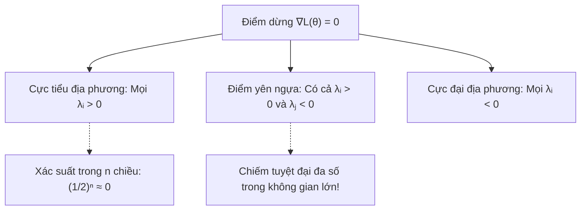
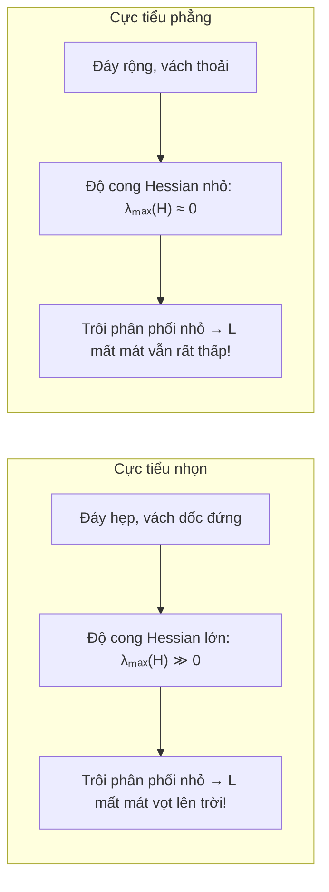

# Cảnh quan mất mát, Điểm yên ngựa và Tối ưu hóa cực tiểu phẳng (SAM)

Một trong những bí ẩn quyến rũ và nghịch lý lớn nhất của lý thuyết Trí tuệ Nhân tạo hiện đại là: **Tại sao mạng nơ-ron sâu lại có thể huấn luyện thành công bằng các thuật toán gradient đơn giản?**

Từ góc độ lý thuyết tối ưu hóa, hàm mất mát của một mạng nơ-ron sâu là một hàm số hoàn toàn phi lồi (non-convex) định nghĩa trên không gian hàng triệu hoặc hàng tỷ chiều. Trong trường hợp xấu nhất, tối ưu hóa phi lồi là một bài toán NP-khó. Về mặt toán học, hàm mất mát có thể chứa vô số cực tiểu địa phương tệ hại, các vùng bình nguyên bằng phẳng nghẽn mạch và các hố sâu vô hạn.

Thế nhưng trong thực tế, các thuật toán bậc một như Gradient Descent ngẫu nhiên (SGD) hay Adam hầu như luôn hội tụ tới những điểm có hàm mất mát rất nhỏ và khả năng tổng quát hóa xuất sắc. Điều gì trong hình học của **cảnh quan mất mát (Loss Landscape)** đã tạo nên hiện tượng thú vị này?

---

## 1. Lời nguyền chiều không gian và Sự áp đảo của Điểm yên ngựa

Trong các giáo trình giải tích một hoặc hai chiều cổ điển, người học thường có định kiến rằng trở ngại lớn nhất của tối ưu hóa phi lồi là bị "mắc kẹt trong cực tiểu địa phương tồi" (Local Minima). 

Tuy nhiên, trong không gian tham số nhiều chiều ($n \gg 10^3$), trực giác này hoàn toàn sai lầm.

Xét một điểm dừng (stationary point) $\theta_0$ nơi gradient triệt tiêu: $\nabla L(\theta_0) = 0$. Bản chất hình học của điểm dừng này phụ thuộc vào các trị riêng của ma trận đạo hàm bậc hai Hessian $H = \nabla^2 L(\theta_0)$:
- **Cực tiểu địa phương**: Toàn bộ $n$ trị riêng đều dương ($\lambda_i > 0, \forall i = 1, \dots, n$).
- **Cực đại địa phương**: Toàn bộ $n$ trị riêng đều âm ($\lambda_i < 0, \forall i = 1, \dots, n$).
- **Điểm yên ngựa (Saddle Point)**: Tồn tại cả trị riêng dương lẫn trị riêng âm. Tại đây, hàm số cong lên theo một số hướng và dốc xuống theo một số hướng khác.

### Xác suất toán học của cực tiểu địa phương
Giả sử một cách lý tưởng hóa rằng dấu của mỗi trị riêng có xác suất độc lập $50\%$ là âm hoặc dương. Khi đó:
- Xác suất để một điểm dừng là cực tiểu địa phương là:
  $$
  P(\text{Cực tiểu}) = \left(\frac{1}{2}\right)^n.
  $$
- Trong một mạng nơ-ron có $n = 10.000$ tham số, xác suất này là:
  $$
  \left(\frac{1}{2}\right)^{10.000} \approx 10^{-3010} \approx 0!
  $$

Nói cách khác, **hầu hết tất cả các điểm dừng có giá trị mất mát cao trong mạng nơ-ron sâu đều là điểm yên ngựa**, chứ không phải là cực tiểu địa phương! Luôn tồn tại ít nhất một vài hướng thoát hiểm (các hướng có trị riêng âm) mà dọc theo đó, giá trị hàm mất mát tiếp tục tụt dốc xuống thấp hơn.

---

## 2. Tại sao SGD thoát khỏi Điểm yên ngựa?

Một thuật toán Gradient Descent chính xác thuần túy trên toàn bộ dữ liệu có thể bị di chuyển rất chậm quanh điểm yên ngựa vì gradient tại đó rất nhỏ ($\nabla L \approx 0$).

Tuy nhiên, **Gradient Descent ngẫu nhiên (SGD)** tính toán gradient trên từng lô nhỏ (mini-batch) $B$:

$$
g_B(\theta) = \frac{1}{|B|} \sum_{i \in B} \nabla \ell_i(\theta) = \nabla L(\theta) + \xi,
$$

trong đó $\xi$ là vector nhiễu ngẫu nhiên có kỳ vọng bằng 0 và ma trận hiệp phương sai $\Sigma(\theta)$.

Nhiễu ngẫu nhiên này đóng vai trò như một lực khuếch tán nhiệt (Thermal Fluctuation / Langevin Diffusion). Khi thuật toán tiến vào vùng lân cận của một điểm yên ngựa:
1. Lực rung ngẫu nhiên $\xi$ đẩy tham số lệch ra khỏi điểm cân bằng không bền theo mọi phương.
2. Dọc theo các hướng có độ cong âm ($\lambda_i < 0$ của ma trận Hessian), thành phần lực kéo của hàm mất mát sẽ khuếch đại độ lệch này theo cấp số nhân.
3. Thuật toán trượt văng ra khỏi điểm yên ngựa và tiếp tục lao dốc xuống các thung lũng sâu hơn.

Nhiễu ngẫu nhiên của mini-batch không phải là một khiếm khuyết, mà chính là một cơ chế khám phá cảnh quan tối ưu vô giá!

---

## 3. Cực tiểu phẳng (Flat Minima) vs Cực tiểu nhọn (Sharp Minima)

Khi thuật toán đã tiến xuống đáy thung lũng, một câu hỏi quan trọng mới xuất hiện: Trong số vô số các cực tiểu có cùng giá trị hàm mất mát trên tập huấn luyện (chẳng hạn $L_{\text{train}} \approx 0$), cực tiểu nào sẽ cho kết quả tốt nhất khi đưa vào thực tế?

Năm 1997, Sepp Hochreiter và Jürgen Schmidhuber đã đưa ra một giả thuyết trực quan sâu sắc: **Các cực tiểu phẳng (Flat Minima) tổng quát hóa tốt hơn nhiều so với các cực tiểu nhọn (Sharp Minima)**.

### Giải thích bản chất bằng sự trôi phân phối (Covariate Shift)
Tập dữ liệu kiểm thử (Test Set) trong thực tế không bao giờ trùng khít $100\%$ với tập dữ liệu huấn luyện (Train Set). Sự sai khác này tương đương với một sự dịch chuyển nhỏ của vector tham số:

$$
\theta_{\text{test}} = \theta_{\text{train}} + \epsilon, \qquad \|\epsilon\|_2 \le \rho.
$$

Khai triển Taylor bậc hai của hàm mất mát quanh nghiệm huấn luyện $\theta^*$:

$$
L(\theta^* + \epsilon) \approx L(\theta^*) + \underbrace{\nabla L(\theta^*)^T \epsilon}_{= 0 \text{ vì cực tiểu}} + \frac{1}{2} \epsilon^T \nabla^2 L(\theta^*) \epsilon.
$$

Lượng suy giảm hiệu năng trên tập kiểm thử tỷ lệ thuận với dạng toàn phương của ma trận Hessian:

$$
\Delta L \approx \frac{1}{2} \epsilon^T H \epsilon \le \frac{1}{2} \lambda_{\max}(H) \|\epsilon\|_2^2.
$$

- Tại **Cực tiểu nhọn**: Trị riêng lớn nhất $\lambda_{\max}(H)$ rất lớn (vách dốc đứng). Một dịch chuyển rất nhỏ $\epsilon$ cũng làm cho mất mát kiểm thử vọt lên ngút trời, dẫn tới hiện tượng quá khớp (overfitting).
- Tại **Cực tiểu phẳng**: Trị riêng $\lambda_{\max}(H)$ rất nhỏ (thung lũng thoai thoải). Dù tham số có bị trôi lệch một khoảng $\epsilon$, mất mát vẫn duy trì ở mức tối ưu, đem lại khả năng tổng quát hóa bền vững.

---

## 4. Thuật toán SAM (Sharpness-Aware Minimization)

Làm thế nào để buộc bộ tối ưu chủ động tìm kiếm các thung lũng phẳng thay vì rơi vào các hố nhọn?

Năm 2021, Pierre Foret và các cộng sự tại Google Research đã đề xuất thuật toán **SAM (Sharpness-Aware Minimization)**. Thay vì cực tiểu hóa hàm mất mát tại một điểm đơn lẻ, SAM giải bài toán tối ưu min-max trên toàn bộ một quả cầu bán kính $\rho$:

$$
\min_\theta \max_{\|\epsilon\|_2 \le \rho} L(\theta + \epsilon).
$$

Nói cách khác: Hãy tìm một điểm $\theta$ sao cho ngay cả khi ta bị kẻ thù đẩy đi một khoảng xấu nhất trong bán kính $\rho$, hàm mất mát vẫn giữ được giá trị nhỏ!

### Bước 1: Tìm hướng nhiễu xấu nhất
Để giải bài toán cực đại hóa bên trong:

$$
\max_{\|\epsilon\|_2 \le \rho} L(\theta + \epsilon) \approx \max_{\|\epsilon\|_2 \le \rho} \big[ L(\theta) + \nabla L(\theta)^T \epsilon \big].
$$

Theo bất đẳng thức Cauchy–Schwarz, tích vô hướng $\nabla L(\theta)^T \epsilon$ đạt cực đại khi vector $\epsilon$ cùng hướng với gradient:

$$
\epsilon^*(\theta) = \rho \frac{\nabla L(\theta)}{\|\nabla L(\theta)\|_2}.
$$

Vector $\epsilon^*$ chỉ thẳng tới vị trí dốc nhất quanh điểm hiện tại.

### Bước 2: Cập nhật tham số theo điểm xấu nhất
Sau khi leo tới điểm xấu nhất $\theta + \epsilon^*$, ta tính gradient tại đó và thực hiện bước nhảy:

$$
\theta \leftarrow \theta - \eta \nabla L\big(\theta + \epsilon^*(\theta)\big).
$$

Bằng cách cập nhật theo gradient của điểm xấu nhất trong lân cận, SAM tự động trừng phạt các cực tiểu có độ cong lớn, dẫn dắt mô hình thoát khỏi các hố nhọn hẹp và định cư vững chắc tại các lưu vực thung lũng phẳng rộng rãi.

---

## Tóm tắt

Cảnh quan mất mát của mạng nơ-ron sâu hé lộ vẻ đẹp hình học phong phú của tối ưu hóa phi lồi hiện đại:
- Không gian nhiều chiều hóa giải nguy cơ kẹt ở cực tiểu địa phương vì hầu hết điểm dừng là điểm yên ngựa.
- Nhiễu ngẫu nhiên của mini-batch là động cơ đẩy thuật toán thoát khỏi điểm yên ngựa.
- Độ phẳng của cực tiểu quyết định khả năng tổng quát hóa trong thực tế. Thuật toán SAM hiện thực hóa nguyên lý này bằng bài toán tối ưu min-max lồi-lõm cục bộ.

---

## Tài liệu tham khảo

- Pierre Foret, Ariel Kleiner, Hossein Mobahi, Behnam Neyshabur, *Sharpness-Aware Minimization for Efficiently Improving Generalization*, ICLR 2021.
- Sepp Hochreiter, Jürgen Schmidhuber, *Flat Minima*, Neural Computation 1997.
- Yann Dauphin, et al., *Identifying and attacking the saddle point problem in high-dimensional non-convex optimization*, NeurIPS 2014.
- Stephen Boyd, Lieven Vandenberghe, *Convex Optimization*, Cambridge University Press.
