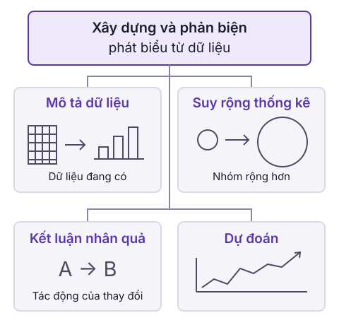

“70% người trả lời khảo sát chưa có kinh nghiệm viết mã máy tính” và “70% sinh viên toàn trường chưa có kinh nghiệm viết mã máy tính” cùng đưa ra một con số. Nhưng câu thứ nhất chỉ nói về nhóm đã trực tiếp tham gia khảo sát, còn câu thứ hai khẳng định về toàn bộ sinh viên, bao gồm cả những người chưa từng được hỏi. Dữ liệu nào cho phép ta đưa ra từng kết luận?

Mục tiêu của học phần là giúp người học biết cách **xây dựng và phản biện các phát biểu dựa trên dữ liệu**. Điều này dẫn ta tới câu hỏi cốt lõi đầu tiên: Từ dữ liệu thu thập được, ta **có thể đưa ra những loại phát biểu nào**? Để đánh giá một lập luận dựa trên dữ liệu, bước quyết định là phân loại: Phát biểu đó đang tóm tắt quan sát thực tế, suy rộng sang tập đối tượng lớn hơn, khẳng định một tác động nhân quả, hay đang dự đoán một giá trị chưa biết.

## 1. Các loại phát biểu từ dữ liệu

Trong phân tích thống kê, một **biến** (variable) là một đặc tính hoặc đại lượng có thể nhận các giá trị khác nhau giữa các đối tượng quan sát, chẳng hạn như kinh nghiệm viết mã, số giờ tự học trong tuần hay điểm bài thực hành. 

Dựa trên mục tiêu và phạm vi kết luận đối với các biến này, ta phân biệt bốn loại phát biểu cơ bản:

### 1.1. Mô tả dữ liệu

**Mô tả dữ liệu (Summary)** là việc mô tả một khía cạnh của tập dữ liệu đang có trong tay bằng con số, đồ thị hoặc lời văn.

Phát biểu mô tả chỉ phản ánh đúng những gì đã được ghi nhận trên những đối tượng đã được đo lường thực tế. Nó không tìm cách nói về bất kỳ đối tượng nào nằm ngoài tập dữ liệu hiện có.

**Ví dụ:** “Dựa trên dữ liệu khảo sát một lớp học, tỷ lệ người trả lời khảo sát cho biết mình chưa có kinh nghiệm viết mã máy tính là 70%.” Phát biểu này chỉ nói về nhóm đã trả lời khảo sát.

### 1.2. Suy rộng thống kê

**Suy rộng thống kê (Generalization)** là việc sử dụng dữ liệu đã ghi nhận từ một tập hợp hạn chế để mô tả hoặc đưa ra kết luận về một tập đối tượng rộng hơn.

Tập đối tượng rộng hơn này được gọi là **tổng thể** (population), còn tập hợp các đối tượng được ghi nhận dữ liệu được gọi là **mẫu** (sample). Một phát biểu suy rộng luôn mang tính suy diễn: Nó vượt qua phạm vi của dữ liệu thực tế để nói về những đối tượng mà ta chưa trực tiếp quan sát.

**Ví dụ:** “Dựa trên dữ liệu khảo sát một lớp học, tỷ lệ sinh viên toàn trường chưa có kinh nghiệm viết mã máy tính là 70%.” Ta đã mở rộng phạm vi từ nhóm trả lời sang toàn trường. Đó là một bước suy rộng cần được đánh giá về căn cứ.

### 1.3. Kết luận nhân quả

**Kết luận nhân quả (Causal Claim)** là phát biểu khẳng định rằng việc chủ động thay đổi giá trị của một biến (can thiệp) sẽ dẫn đến sự thay đổi giá trị của một biến khác.

Trong khi mô tả và suy rộng chỉ ghi nhận trạng thái của các biến khi chúng tự nhiên diễn ra, kết luận nhân quả đặt câu hỏi: “Nếu ta can thiệp vào $X$, giá trị của $Y$ có biến đổi tương ứng hay không?”

**Ví dụ:** “Dữ liệu từ một thí nghiệm ngẫu nhiên có đối chứng cho thấy việc dùng một loại kháng sinh mới loại bỏ hơn 99% các ca nhiễm khuẩn.” Phát biểu này nói về tác động của việc dùng thuốc đối với tình trạng nhiễm khuẩn.

### 1.4. Dự đoán

**Dự đoán (Prediction)** là việc ước tính hoặc phán đoán giá trị của một biến chưa biết dựa trên thông tin đã biết của các biến khác.

Dự đoán khai thác mối liên hệ thống kê giữa các biến. Đáng chú ý, biến chưa biết không nhất thiết phải nằm ở tương lai: Đó có thể là một giá trị ở quá khứ hoặc hiện tại mà ta chưa có điều kiện đo lường trực tiếp.

**Ví dụ:** “Dựa trên tin tức đã đọc và giá cổ phiếu Uber hôm nay, tôi dự đoán rằng giá cổ phiếu Uber ngày mai sẽ tăng 1,2%.” Tin tức và giá hôm nay là thông tin đã biết, còn mức thay đổi giá ngày mai là giá trị chưa biết.

## 2. Phạm vi và căn cứ của một kết luận

Việc phân loại phát biểu không chỉ là gắn nhãn từ ngữ, mà nhằm xác định loại bằng chứng tối thiểu cần có để bảo vệ kết luận đó.

### 2.1. Mô tả mẫu và suy rộng về tổng thể

Để hiểu sự khác biệt giữa mô tả và suy rộng, ta xét một trường hợp cụ thể: Một phiếu khảo sát trực tuyến nhận được câu trả lời từ 10 sinh viên, trong đó có 7 người cho biết chưa từng lập trình. Toàn trường có hàng nghìn sinh viên. Nhóm đã trả lời là mẫu thống kê, còn toàn bộ sinh viên của trường là tổng thể mà ta muốn nghiên cứu.

::: example Tính tỷ lệ trong nhóm đã trả lời
Tỷ lệ người chưa từng lập trình trong nhóm trả lời bằng số người thuộc nhóm này chia cho tổng số người trả lời:

$$\frac{7}{10}\times 100\%=70\%.$$

Ta có thể mô tả: “Trong 10 người trả lời khảo sát, 70% cho biết chưa từng lập trình.” Mẫu số là 10 vì phát biểu nói về nhóm đã trả lời.
:::

Phép chia $7 / 10 = 70\%$ là một phép tính số học chính xác trên dữ liệu mẫu. Nếu ta dừng lại ở câu mô tả trên, kết luận hoàn toàn có căn cứ và không thể bị bác bỏ về mặt số liệu.

Nếu viết “70% sinh viên toàn trường chưa từng lập trình”, ta đã mở rộng phạm vi kết luận từ mẫu sang tổng thể. Phép chia vẫn đúng với dữ liệu mẫu, nhưng không chứng minh rằng tỷ lệ của toàn trường cũng bằng 70%.

Để đánh giá bước suy rộng, ta cần biết những người trả lời được chọn như thế nào, có nhóm sinh viên nào ít có cơ hội tham gia hay không và có ai được mời nhưng không trả lời. Chẳng hạn, nếu chỉ hỏi trong một câu lạc bộ lập trình, nhóm trả lời có thể khác toàn trường về chính đặc điểm đang nghiên cứu. Hiện tượng này gọi là độ lệch chọn mẫu. Cỡ mẫu lớn cũng không tự sửa được độ lệch nếu cách lấy mẫu bị thiên vị từ đầu. Việc gọi một phát biểu là suy rộng chỉ xác định loại phát biểu, chưa chứng minh rằng nó có căn cứ.

::: tip Thử phân loại trước khi đọc đáp án
Chỉ thay cụm “10 người trả lời khảo sát” bằng “sinh viên toàn trường” có làm thay đổi loại phát biểu không? Vì sao?
:::

Đáp án và lý do

Có. Phát biểu ban đầu mô tả nhóm đã được quan sát. Phát biểu sau nói về toàn bộ sinh viên của trường, bao gồm những người chưa được quan sát, nên là suy rộng thống kê. Điều thay đổi là phạm vi đối tượng, không phải con số 70%.

### 2.2. Quan sát và can thiệp

**Can thiệp** nghĩa là chủ động thay đổi một yếu tố để xem kết quả chịu tác động thế nào.

Giả sử ta quan sát thấy sinh viên tham gia câu lạc bộ lập trình có điểm bài thực hành cao hơn. Đây là mô tả một quan hệ trong dữ liệu đã quan sát. Nó chưa đủ để khẳng định rằng tham gia câu lạc bộ làm điểm tăng, vì những người tham gia có thể đã có nhiều kinh nghiệm hơn trước đó.

Phát biểu “việc tham gia câu lạc bộ làm điểm tăng” là kết luận nhân quả: Nó nói về tác động của việc thay đổi một yếu tố. Muốn bảo vệ kết luận ấy, ta cần căn cứ để phân biệt tác động của việc tham gia với khác biệt có sẵn giữa các nhóm. Những yếu tố có sẵn nhưng đồng thời ảnh hưởng lên cả việc tham gia lẫn điểm số (như năng khiếu, sự chủ động học tập) được gọi là biến gây nhiễu.

Một cách nghiên cứu tác động là dùng **thí nghiệm ngẫu nhiên có đối chứng**: Phân người tham gia ngẫu nhiên vào các nhóm, rồi so sánh nhóm nhận can thiệp với nhóm đối chứng. Cách phân nhóm ngẫu nhiên giúp cân bằng các yếu tố gây nhiễu, hạn chế việc các khác biệt có sẵn quyết định ai nhận can thiệp. Khi đánh giá kết luận, ta vẫn cần xem thiết kế, cách đo và phạm vi đối tượng nghiên cứu.

### 2.3. Giá trị chưa biết trong một bài toán dự đoán

Trong ví dụ cổ phiếu, giá ngày mai là giá trị chưa biết. Dự đoán cũng có thể nói về một giá trị đã tồn tại nhưng chưa được quan sát. Chẳng hạn, dùng kinh nghiệm lập trình để đoán điểm bài thực hành đã chấm nhưng chưa công bố vẫn là dự đoán. Vì vậy, dự đoán không nhất thiết phải nói về tương lai.

Dự đoán khai thác mối liên kết thống kê giữa các biến và không tự giải thích nguyên nhân của kết quả. Một thông tin giúp đoán điểm không nhất thiết là yếu tố mà ta có thể thay đổi để làm điểm tăng. Trong thực tế đời sống, việc quan sát áp suất không khí giảm đột ngột giúp ta dự đoán trời sắp mưa bão rất chính xác, nhưng bản thân đồng hồ áp suất không tạo ra bão: Dùng tay vặn kim áp kế xuống không thể làm trời đổ mưa. Cũng như với suy rộng, phân loại đúng phát biểu chưa cho biết dự đoán chính xác đến đâu.

| Loại phát biểu | Câu hỏi cần xác định | Giới hạn khi đánh giá |
| --- | --- | --- |
| Mô tả dữ liệu | Dữ liệu đã có nói gì về nhóm đã quan sát? | Phải giữ đúng nhóm đối tượng và cách đo. |
| Suy rộng thống kê | Dữ liệu cho phép nói gì về nhóm rộng hơn? | Cần căn cứ cho bước đi từ mẫu sang tổng thể. |
| Kết luận nhân quả | Thay đổi một biến có ảnh hưởng đến biến khác không? | Quan hệ trong dữ liệu quan sát chưa tự chứng minh tác động. |
| Dự đoán | Giá trị chưa biết nào được đoán từ thông tin đã biết? | Một dự đoán cần được đánh giá về độ chính xác. |

## 3. Bài tập tự luyện

### Bài 1. Nhận diện loại phát biểu

::: exercise
Với mỗi câu sau, hãy xác định loại phát biểu và nêu đặc điểm quyết định:

1. Trong nhóm đã trả lời khảo sát lớp học, 70% cho biết chưa từng lập trình.
2. Dùng khảo sát lớp học để kết luận rằng 70% sinh viên toàn trường chưa từng lập trình.
3. Tham gia câu lạc bộ lập trình làm điểm bài thực hành tăng.
4. Dựa trên kinh nghiệm lập trình đã biết, ta đoán điểm bài thực hành chưa công bố của một sinh viên.
:::

::: solution
1. Mô tả dữ liệu, vì câu chỉ nói về nhóm đã trả lời khảo sát.
2. Suy rộng thống kê, vì kết luận nói về toàn trường, rộng hơn nhóm đã quan sát.
3. Kết luận nhân quả, vì từ “làm” khẳng định tác động của việc tham gia đối với điểm.
4. Dự đoán, vì điểm chưa biết được đoán từ thông tin đã biết về kinh nghiệm.

Đây là phân loại ý nghĩa của từng câu. Nó chưa chứng minh rằng các câu 2–4 đúng hoặc được dữ liệu hỗ trợ.
:::

### Bài 2. Tính đúng tỷ lệ và giữ đúng phạm vi

::: exercise
Một khảo sát nhận 20 câu trả lời, trong đó 14 người cho biết chưa từng lập trình. Hãy tính tỷ lệ, viết một câu mô tả đúng dữ liệu và giải thích vì sao chưa thể thay nhóm trả lời bằng toàn bộ sinh viên của trường.
:::

::: hint
Mẫu số phải là số người thực sự trả lời. Sau khi tính, kiểm tra xem chủ thể trong câu kết luận có đúng là nhóm ấy không.
:::

::: solution
Tỷ lệ trong nhóm trả lời là:

$$\frac{14}{20}\times 100\%=70\%.$$

Một câu mô tả đúng là: “Trong 20 người trả lời khảo sát, 70% cho biết chưa từng lập trình.” Nếu thay bằng toàn bộ sinh viên của trường, ta chuyển sang suy rộng. Đề bài chưa cho biết cách chọn mẫu và khả năng nhóm trả lời đại diện cho toàn trường, nên chưa đủ căn cứ cho kết luận ấy.
:::

### Bài 3. Tìm bước suy luận thiếu căn cứ

::: exercise
Một người lập luận: “Trong dữ liệu khảo sát, người tham gia câu lạc bộ có điểm cao hơn. Vì vậy, nếu buộc mọi người tham gia câu lạc bộ, điểm của họ sẽ tăng.” Hãy chỉ ra bước đầu tiên chưa được dữ liệu nêu trong đề hỗ trợ và đưa ra một cách giải thích khác cho quan sát ban đầu.
:::

::: solution
Bước thiếu căn cứ nằm ở việc chuyển từ khác biệt giữa hai nhóm đã quan sát sang tác động của một can thiệp. Quan sát ban đầu chưa cho biết điểm của cùng những người ấy sẽ thay đổi thế nào nếu họ tham gia.

Một cách giải thích khác là những sinh viên đã có nhiều kinh nghiệm lập trình vừa dễ tham gia câu lạc bộ hơn, vừa có thể đạt điểm cao hơn. Khả năng này cho thấy quan sát ban đầu chưa đủ chứng minh nhân quả. Nó cũng không chứng minh rằng việc tham gia hoàn toàn không có tác động.
:::

[Bài tiếp theo: Xác suất có điều kiện và Bayes](/xac-suat-thong-ke/bai-giang/01-xac-suat-va-bayes.md).

## 4. Tài liệu tham khảo

- Stat 20, UC Berkeley. [Understanding the World with Data](https://stat20.berkeley.edu/spring-2026/1-questions-and-data/01-understanding-the-world/notes.html), học kỳ xuân 2026, mục “Types of Claims”.
- [Creative Commons Attribution 4.0 International (CC BY 4.0)](https://creativecommons.org/licenses/by/4.0/). Nội dung và sơ đồ chuyển thể từ tài liệu trên được chia sẻ theo giấy phép này. [Thông báo giấy phép](https://stat20.berkeley.edu/spring-2026/license.html).
