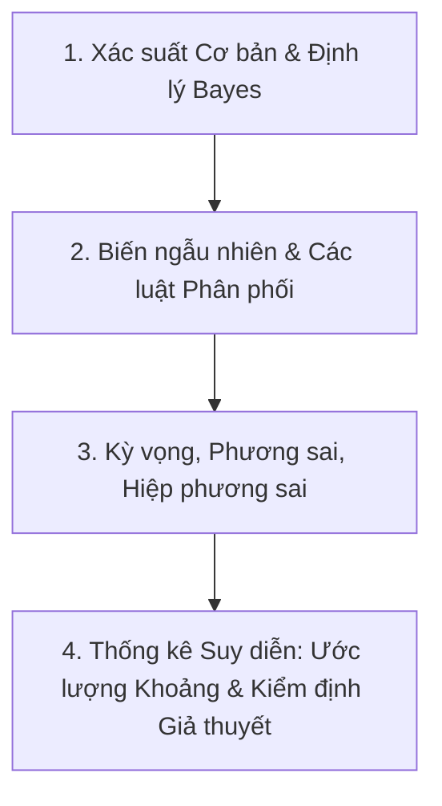

# Xác Suất Thống Kê 

Môn học **Xác suất Thống kê** giúp bạn xây dựng tư duy phân tích sự bất định, mô hình hóa dữ liệu ngẫu nhiên và đưa ra quyết định dựa trên dữ liệu.

---

##  Lộ trình Ôn tập Trọng tâm

- **Chương 1:** Không gian mẫu, Biến cố, Xác suất có điều kiện và Định lý Bayes
- **Chương 2:** Biến ngẫu nhiên rời rạc (Bernoulli, Nhị thức, Poisson, Hình học)
- **Chương 3:** Biến ngẫu nhiên liên tục (Đều, Mũ, Chuẩn Gauss)
- **Chương 4:** Luật số lớn và Định lý Giới hạn Trung tâm (CLT)
- **Chương 5:** Ước lượng tham số (Điểm, Khoảng tin cậy)
- **Chương 6:** Kiểm định giả thuyết (Z-test, T-test, Chi-square)

---

## 📖 Giáo trình & Nguồn Tham khảo Chuẩn Quốc tế

1. **Andrew Bray et al.**, [*Introduction to Probability and Statistics (STAT 20)*](https://www.stat20.org/), Department of Statistics, UC Berkeley. Bộ giáo trình tương tác mở trực tuyến toàn diện tại [stat20.org](https://www.stat20.org/), tập trung vào tư duy phân tích dữ liệu, suy rộng thống kê, can thiệp nhân quả và dự đoán.
2. **Joseph K. Blitzstein & Jessica Hwang**, [*Introduction to Probability (2nd Edition)*](https://projects.iq.harvard.edu/stat110/home), Chapman & Hall/CRC Press (Harvard Stat 110). Bản sách trực tuyến miễn phí chính thức: [probabilitybook.net](http://probabilitybook.net/). Giáo trình kinh điển giải thích bản chất trực giác sâu sắc của xác suất có điều kiện, biến ngẫu nhiên và các luật phân phối.
3. **Sheldon Ross**, [*A First Course in Probability (10th Edition)*](https://www.pearson.com/en-us/subject-catalog/p/first-course-in-probability-a/P200000003387), Pearson. Giáo trình chuẩn mực toàn cầu với hệ thống bài tập xác suất và biến ngẫu nhiên phong phú, chuẩn xác.
4. **Đào Hữu Hồ**, *Xác suất và Thống kê Toán học*, NXB Đại học Quốc gia Hà Nội. Giáo trình tiêu chuẩn của Đại học Quốc gia Hà Nội, bám sát khung chương trình đào tạo của Trường Đại học Công nghệ (UET).
5. **John A. Rice**, [*Mathematical Statistics and Data Analysis (3rd Edition)*](https://www.cengage.com/), Cengage Learning. Cung cấp nền tảng toán học chặt chẽ cho phần thống kê suy diễn, ước lượng tham số và kiểm định giả thuyết.
