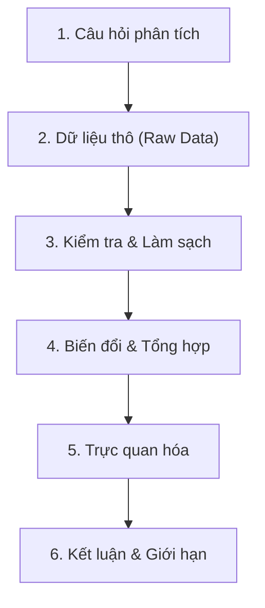

Trong thực tế, dữ liệu hiếm khi xuất hiện dưới dạng một bảng tính tinh tươm, hoàn chỉnh và sẵn sàng để đưa vào thuật toán. Phần lớn thời gian của một kỹ sư hay nhà phân tích dữ liệu không dành cho việc bấm nút huấn luyện mô hình, mà là vật lộn với những dòng dữ liệu chắp vá, những ô bị bỏ trống không rõ lý do, và những con số thiếu ngữ cảnh. Nếu tiếp cận dữ liệu chỉ bằng các thao tác bấm máy tính cơ học, ta rất dễ đưa ra những kết luận sai lệch nghiêm trọng mà bản thân không hề hay biết.

Bài học mở đầu này không chỉ hướng dẫn thiết lập công cụ, mà quan trọng hơn, giúp ta định hình nhãn quan của một người làm khoa học dữ liệu: luôn đặt câu hỏi phân tích trước khi viết câu lệnh, xây dựng quy trình có khả năng kiểm chứng, và tổ chức môi trường làm việc chuẩn mực để bất kỳ ai cũng có thể tái lập kết quả của mình.

## 1. Câu hỏi phân tích đi trước phép tính số học

Hãy bắt đầu bằng một bài toán giản dị. Một cửa hàng thống kê giá bán của bốn mặt hàng, nhưng trong sổ ghi chép có một mặt hàng chưa cập nhật giá: `gia = [24, 36, None, 60]` (đơn vị: nghìn đồng).

Câu hỏi đặt ra: **Giá trung bình là bao nhiêu?**

Máy tính có thể tính ra hai con số hoàn toàn khác nhau tùy vào cách ta lập trình:
- Nếu chia tổng cho 4, ta được $(24 + 36 + 0 + 60) / 4 = 30$ nghìn đồng.
- Nếu chỉ tính trên những mặt hàng đã biết giá, ta chia cho 3: $(24 + 36 + 60) / 3 = 40$ nghìn đồng.

Cả hai phép chia đều đúng về mặt số học thuần túy. Nhưng con số nào có nghĩa trong phân tích kinh doanh? 

Điều đó hoàn toàn phụ thuộc vào bản chất của ô trống kia. Nếu mặt hàng thứ ba là quà tặng kèm miễn phí có giá 0 đồng, phép chia cho 4 là chính xác. Ngược lại, nếu mặt hàng đó chỉ đơn thuần là chưa kịp nhập giá vào hệ thống, việc tự tiện gán giá 0 đồng đã kéo tụt giá trung bình của toàn bộ cửa hàng xuống một cách giả tạo. Trong lập trình xử lý dữ liệu, giá trị khuyết thiếu (`None`) đại diện cho **sự thiếu hiểu biết về dữ liệu**, chứ không bao giờ đồng nghĩa với **số không**.

```python
gia = [24, 36, None, 60]
da_co_gia = [x for x in gia if x is not None]
tong = sum(da_co_gia)
so_mat_hang = len(da_co_gia)
trung_binh = tong / so_mat_hang if so_mat_hang else None
so_thieu = len(gia) - so_mat_hang
print(trung_binh, so_thieu)  # 40.0 1
```

Tổng các giá trị đã quan sát được là $24 + 36 + 60 = 120$ nghìn đồng. Vì chỉ có 3 mặt hàng có giá xác định, giá trung bình của nhóm đã biết là $120 / 3 = 40$ nghìn đồng. Đồng thời, chương trình báo cáo rõ có 1 mặt hàng thiếu thông tin.

Một người làm dữ liệu cẩn trọng sẽ không bao giờ phát biểu: *"Giá trung bình của hàng hóa là 40 nghìn đồng"*. Câu phát biểu chính xác về mặt học thuật phải là: *"Giá trung bình của 3 mặt hàng đã xác định giá là 40 nghìn đồng, với 1 mặt hàng chưa rõ thông tin"*. Sự chặt chẽ trong ngôn từ phản ánh trực tiếp sự trung thực trong phân tích.

Khi đối mặt với các danh sách dữ liệu trong thực tế, các kỹ sư thường viết hàm tính toán đi kèm điều kiện bảo vệ `if so_mat_hang else None`. Điều này giúp hệ thống không bao giờ bị dừng đột ngột bởi lỗi chia cho 0 (`ZeroDivisionError`) khi nhận phải một danh sách chỉ toàn giá trị rỗng như `[None, None]`.

## 2. Quy trình xử lý dữ liệu có khả năng kiểm chứng

Một dự án phân tích dữ liệu không phải là một chuỗi hành động ngẫu hứng, mà là một **quy trình có cấu trúc** (Data Pipeline). Quy trình này dẫn dắt dữ liệu đi qua từng trạm biến đổi với đầu vào và đầu ra được định nghĩa minh bạch.



Quy trình này vận hành dựa trên ba nguyên tắc:

1. **Bất biến của dữ liệu gốc (Raw Data Immutability)**: Không bao giờ được phép chỉnh sửa trực tiếp trên tệp dữ liệu gốc. Mọi thao tác làm sạch, sửa lỗi chính tả hay điền khuyết phải được thực hiện bằng mã nguồn và lưu sang vùng dữ liệu mới. Nhờ đó, nếu một quy tắc làm sạch sau này bị phát hiện là sai sót, ta luôn có thể chạy lại quy trình từ đầu mà không làm biến dạng dữ liệu ban đầu.
2. **Khả năng truy xuất nguồn gốc (Data Provenance)**: Mỗi con số trên báo cáo cuối cùng đều phải giải trình được đường đi nước bước. Nó được trích xuất từ bảng nào, trải qua những bộ lọc điều kiện nào, bao nhiêu bản ghi dị biệt đã bị loại bỏ và vì lý do gì.
3. **Minh bạch về mẫu số**: Bất kỳ chỉ số nào xuất hiện cũng phải đi kèm kích thước mẫu. Báo cáo tỷ lệ hài lòng 100% nhưng chỉ khảo sát trên 2 khách hàng sẽ mang một ý nghĩa hoàn toàn khác so với khảo sát trên 2.000 khách hàng.

## 3. Hệ sinh thái công cụ: Chọn công cụ theo đúng bản chất thao tác

Trong hệ sinh thái Python dành cho dữ liệu, mỗi thư viện được thiết kế để giải quyết tối ưu một mắt xích chuyên biệt. Hiểu rõ thế mạnh của từng công cụ giúp ta tránh được việc "dùng dao mổ trâu để cắt trứng":

| Công cụ | Bản chất & Vai trò cốt lõi |
| :--- | :--- |
| **Python thuần** | Ngôn ngữ đóng vai trò nhạc trưởng: điều phối luồng thực thi, quản lý logic điều kiện, xử lý ngoại lệ và kết nối các hệ thống tệp. |
| **NumPy** | Xử lý các phép toán đại số tuyến tính trên mảng đa chiều liên tục trong bộ nhớ máy tính. NumPy là nền móng tính toán hiệu năng cao bằng mã nguồn C/Fortran nằm dưới hầu hết các thư viện khoa học dữ liệu. |
| **pandas** | Cung cấp cấu trúc bảng dữ liệu hai chiều có nhãn hàng và nhãn cột (DataFrame). pandas sinh ra để giải quyết các bài toán dữ liệu thực tế: hợp nhất bảng, xử lý giá trị khuyết thiếu, chuyển đổi cấu trúc và nhóm dữ liệu. |
| **Matplotlib & seaborn** | Trực quan hóa dữ liệu. Matplotlib cung cấp quyền kiểm soát chi tiết từng tọa độ, trong khi seaborn trừu tượng hóa các biểu đồ thống kê phức tạp bằng giao diện trang nhã. |
| **Jupyter Notebook** | Môi trường lập trình tương tác dạng sổ tay (computational notebook), cho phép tích hợp mã nguồn, biểu đồ hiển thị và lời giải thích học thuật trong cùng một giao diện. |

Một cái bẫy tinh vi mà người mới dùng Jupyter Notebook rất hay vấp ngã là **trạng thái ẩn** (hidden state). Trong một notebook, thứ tự các ô mã trên màn hình không quyết định thứ tự thực thi. Nếu bạn chạy một ô mã ở cuối để gán lại giá trị cho biến `x`, sau đó quay ngược lên chạy một ô mã ở đầu trang, ô mã ở đầu sẽ nhận giá trị mới của `x` thay vì giá trị ban đầu. 

Một kinh nghiệm thực tiễn đáng chú ý: trước khi đóng gói mã nguồn hoặc chia sẻ báo cáo cho người khác, hãy luôn bấm **Kernel -> Restart & Run All** (Khởi động lại nhân và chạy toàn bộ từ đầu đến cuối). Nếu tài liệu chạy trơn tru từ dòng đầu tiên đến dòng cuối cùng mà không nảy sinh lỗi, bạn mới có thể tin tưởng vào tính tái lập của kết quả.

## 4. Thiết lập môi trường làm việc chuẩn mực

Một bài toán kinh điển trong giới lập trình là: *"Mã nguồn chạy hoàn hảo trên máy của tôi, nhưng đem sang máy đồng nghiệp thì báo lỗi"*. Nguyên nhân chủ yếu xuất phát từ sự xung đột phiên bản giữa các thư viện cài đặt trên hệ điều hành.

Để giải quyết triệt để vấn đề này, chuẩn mực nghề nghiệp đòi hỏi mỗi dự án dữ liệu phải sống trong một **môi trường ảo** (virtual environment) độc lập.

Trong môi trường Windows PowerShell, ta tạo và kích hoạt môi trường ảo như sau:

```powershell
# 1. Khởi tạo môi trường ảo cục bộ trong thư mục .venv
python -m venv .venv

# 2. Cài đặt các thư viện trụ cột thông qua trình thông dịch của môi trường ảo
.\.venv\Scripts\python.exe -m pip install --upgrade pip
.\.venv\Scripts\python.exe -m pip install numpy pandas matplotlib seaborn jupyter

# 3. Khởi chạy máy chủ sổ tay Jupyter Notebook
.\.venv\Scripts\python.exe -m jupyter notebook
```

Sau khi cài đặt và kiểm tra các gói hoạt động tương thích, việc kế tiếp là chụp lại "bản kê khai sinh mệnh" của môi trường bằng lệnh đóng băng phụ thuộc:

```powershell
.\.venv\Scripts\python.exe -m pip freeze > requirements.txt
```

Tệp `requirements.txt` này đóng vai trò như một bản hướng dẫn kỹ thuật chuẩn xác. Khi một thành viên khác trong nhóm tiếp nhận dự án trên một máy tính mới, họ chỉ cần tạo môi trường ảo sạch và thực thi một dòng lệnh duy nhất:

```powershell
python -m pip install -r requirements.txt
```

Về mặt tổ chức thư mục trên đĩa cứng, một cấu trúc dự án khoa học và trong sáng thường được bố trí như sau:
- `data/raw/`: Nơi lưu trữ dữ liệu thô nguyên bản nhận từ nguồn. Thư mục này chỉ đọc và tuyệt đối không chỉnh sửa trực tiếp.
- `data/clean/`: Lưu dữ liệu đã trải qua các bước chuẩn hóa, làm sạch và xác thực.
- `notebooks/`: Chứa các sổ tay Jupyter dùng để thăm dò ý tưởng ban đầu, vẽ biểu đồ nháp.
- `src/`: Chứa các module Python (`.py`) đóng gói các hàm nghiệp vụ có thể tái sử dụng lâu dài.
- `README.md`: Bản mô tả mục tiêu đề tài, hướng dẫn cài đặt và câu lệnh tái hiện kết quả.

## 5. Bài tập tự luyện

::: exercise Thẩm định phạm vi kết luận
Xem lại danh sách giá `gia = [24, 36, None, 60]`. Giả sử trưởng phòng kinh doanh đọc báo cáo và ghi vào phần tóm tắt điều hành: *"Mặt hàng của chúng ta có giá bình quân là 40 nghìn đồng"*. Phát biểu này đúng hay sai? Cần bổ sung mệnh đề nào để kết luận trở nên trung thực về mặt thống kê?
:::

::: solution
Phát biểu trên là **chưa chính xác** và phóng đại phạm vi kết luận. Con số 40 nghìn đồng chỉ là giá trị trung bình trên 3 mặt hàng đã được xác định giá, hoàn toàn bỏ qua mặt hàng thứ tư. 

Để phát biểu trung thực, ta cần nói rõ: *"Dựa trên 3 mặt hàng đã có dữ liệu giá, mức bình quân hiện thời là 40 nghìn đồng. Danh mục còn 1 mặt hàng chưa thể định giá nên chưa thể suy rộng cho toàn bộ kho hàng"*.
:::

::: exercise Xử lý danh sách hoàn toàn khuyết thiếu
Nếu dữ liệu đầu vào là danh sách `[None, None]`, đoạn mã ở mục 1 sẽ trả về những giá trị nào cho các biến `tong`, `so_mat_hang`, `trung_binh` và `so_thieu`? Vai trò của biểu thức kiểm tra `if so_mat_hang else None` là gì?
:::

::: solution
Khi toàn bộ dữ liệu đều khuyết thiếu:
- Danh sách hợp lệ `da_co_gia` là danh sách rỗng `[]`.
- `tong` bằng $0$, `so_mat_hang` bằng $0$.
- Do `so_mat_hang` mang giá trị 0 (tương đương `False` trong điều kiện logic), biểu thức `if so_mat_hang else None` sẽ gán `trung_binh = None`.
- `so_thieu` bằng $2 - 0 = 2$.

Biểu thức điều kiện này giữ vai trò sống còn: ngăn chặn lỗi `ZeroDivisionError` (chia cho 0), đồng thời biểu đạt chuẩn xác trạng thái học thuật rằng giá trị trung bình lúc này là "chưa thể xác định" thay vì trả về một con số vô nghĩa.
:::

::: exercise Khắc phục lỗi trạng thái ẩn trong sổ tay
Một đồng nghiệp gửi cho bạn một tệp notebook có thể xuất ra biểu đồ rất đẹp khi chạy lần đầu. Nhưng khi bạn khởi động lại kernel và chạy lại từ trên xuống dưới, chương trình lập tức ném ra lỗi `NameError: name 'cleaned_data' is not defined`. Hãy giải thích cơ chế sinh ra lỗi này và cách xử lý.
:::

::: solution
Đây là hiện tượng lỗi do **trạng thái ẩn** (hidden state). Tác giả đã chạy một ô mã tạo ra biến `cleaned_data` ở phía dưới, sau đó di chuyển ô mã hoặc xóa nó đi, nhưng vùng nhớ kernel cũ vẫn còn giữ biến đó. Khi người khác mở tệp và chạy tuần tự từ đầu trên một kernel mới, biến đó chưa từng được khởi tạo nên chương trình ném ra lỗi `NameError`.

Cách khắc phục: Rà soát lại toàn bộ quy trình, đưa dòng mã khởi tạo biến `cleaned_data` vào đúng vị trí trước khi biến này được gọi. Sau đó, luôn chạy lại toàn bộ sổ tay bằng **Restart & Run All** để xác minh tính toàn vẹn của mã.
:::

::: exercise Thiết kế pipeline kiểm toán chất lượng dữ liệu với nhật ký vết (Data Lineage & Audit Log)
Trong một hệ thống tiếp nhận đơn hàng trực tuyến, bạn nhận được danh sách các bản ghi giao dịch thô:
```python
giao_dich_tho = [
    {"ma_don": "DH01", "so_tien": "250000"},
    {"ma_don": "DH02", "so_tien": "chua_thanh_toan"},
    {"ma_don": "DH03", "so_tien": "-50000"},
    {"ma_don": "DH04", "so_tien": "1200000"},
    {"ma_don": "DH05", "so_tien": None},
    {"ma_don": "DH06", "so_tien": "0"}
]
```
Hãy viết chương trình xử lý tập dữ liệu trên để:
1. Tính tổng doanh thu và giá trị trung bình của các đơn hàng hợp lệ (số tiền phải là số thực không âm $\ge 0$).
2. Xuất ra một bảng nhật ký kiểm toán (*Audit Log*) ghi nhận chính xác: tổng số bản ghi nhận vào, số bản ghi hợp lệ, số bản ghi bị loại và lý do chi tiết cho từng trường hợp bị loại.
:::

::: solution
#### Cách 1: Tiếp cận Căn bản & Trực quan (Vòng lặp tuần tự và tích lũy trạng thái)
Một cách người ta hay dùng khi mới bắt đầu là sử dụng vòng lặp `for` tuần tự để kiểm tra từng phần tử, bọc khối chuyển đổi trong `try-except` và ghi nhận vào các danh sách riêng biệt:

```python
don_hop_le = []
nhat_ky_loai = []

for gd in giao_dich_tho:
    ma = gd.get("ma_don")
    raw_val = gd.get("so_tien")
    
    if raw_val is None:
        nhat_ky_loai.append({"ma_don": ma, "ly_do": "Khuyết thiếu dữ liệu (None)"})
        continue
        
    try:
        val = float(raw_val)
        if val < 0:
            nhat_ky_loai.append({"ma_don": ma, "ly_do": f"Giá trị âm ({val}) không hợp lệ"})
        else:
            don_hop_le.append({"ma_don": ma, "so_tien": val})
    except ValueError:
        nhat_ky_loai.append({"ma_don": ma, "ly_do": f"Không thể ép kiểu số thực: '{raw_val}'"})

tong_tien = sum(d["so_tien"] for d in don_hop_le)
so_hop_le = len(don_hop_le)
trung_binh = (tong_tien / so_hop_le) if so_hop_le > 0 else None

print(f"Tổng hợp lệ: {so_hop_le}/{len(giao_dich_tho)} đơn | Tổng tiền: {tong_tien:,.0f} đ | Trung bình: {trung_binh:,.0f} đ")
print("Nhật ký loại trừ:", nhat_ky_loai)
```

#### Cách 2: Tiếp cận Nâng cao & Tối ưu (Đóng gói hàm bất biến trả về cấu trúc phân tách)
Trong môi trường sản xuất, ta đóng gói quy trình thành một hàm thuần khiết (*Pure Function*), phân tách dữ liệu thành hai nhánh rõ ràng mà không làm biến đổi dữ liệu đầu vào:

```python
from typing import NamedTuple, Any

class KetQuaKiemToan(NamedTuple):
    hop_le: list[dict[str, Any]]
    bi_loai: list[dict[str, Any]]
    tong_doanh_thu: float
    trung_binh: float | None

def kiem_toan_giao_dich(ds_giao_dich: list[dict[str, Any]]) -> KetQuaKiemToan:
    hop_le, bi_loai = [], []
    for r in ds_giao_dich:
        ma, raw = r.get("ma_don"), r.get("so_tien")
        if raw is None:
            bi_loai.append({"ma_don": ma, "ly_do": "GIA_TRI_THIEU"})
            continue
        try:
            val = float(raw)
            if val < 0:
                bi_loai.append({"ma_don": ma, "ly_do": "GIA_TRI_AM"})
            else:
                hop_le.append({"ma_don": ma, "so_tien": val})
        except (ValueError, TypeError):
            bi_loai.append({"ma_don": ma, "ly_do": "SAI_DINH_DANG"})
            
    tong = sum(x["so_tien"] for x in hop_le)
    tb = (tong / len(hop_le)) if hop_le else None
    return KetQuaKiemToan(hop_le=hop_le, bi_loai=bi_loai, tong_doanh_thu=tong, trung_binh=tb)

ket_qua = kiem_toan_giao_dich(giao_dich_tho)
assert len(giao_dich_tho) == len(ket_qua.hop_le) + len(ket_qua.bi_loai)
```

#### Phân tích bản chất & Bình luận sư phạm
- **Kỷ luật bảo toàn dữ liệu**: Đơn hàng miễn phí (`"0"`) vẫn là một đơn hợp lệ ($0 \ge 0$), trong khi đơn âm (`"-50000"`) và đơn lỗi định dạng (`"chua_thanh_toan"`) bị loại ra nhánh kiểm toán.
- **Phương trình bất biến**: Biểu thức kiểm chứng `len(giao_dich_tho) == len(hop_le) + len(bi_loai)` là bảo chứng vàng cho thấy không có bất kỳ dòng dữ liệu nào bị hệ thống "nuốt chửng" mà không rõ lý do.
:::

## 6. Nguồn và đọc thêm

- Wes McKinney, *Python for Data Analysis*, 3rd Edition — [Chương 1: Preliminaries](https://wesmckinney.com/book/preliminaries) và [Chương 2: Python Language Basics](https://wesmckinney.com/book/python-basics).
- [Bài giảng tham khảo môn Xử lý dữ liệu (iaidev)](https://courses.iaidev.com/programming-for-data-processing/2627-1/lecture-01-tong-quan-va-chinh-sach-ai.html).
- Toàn bộ ví dụ, phân tích logic và bài tập trong bài viết này do StudyHub biên soạn độc lập nhằm phục vụ sinh viên chuyên ngành.
