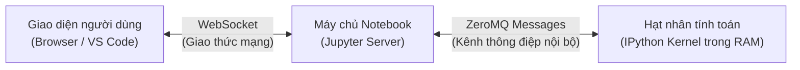

## 1. Vị thế của Môn học trong Chuỗi giá trị Dữ liệu

### 1.1. Hiện thực dữ liệu trong môi trường sản xuất
Trong các bài giảng lý thuyết nhập môn hoặc trên các diễn đàn công nghệ, người ta thường ca ngợi sức mạnh của các thuật toán Học máy (*Machine Learning*), Trí tuệ Nhân tạo (*AI*) hay những mô hình dự báo phức tạp. Tuy nhiên, một ngộ nhận kinh điển của người mới bắt đầu là tưởng tượng rằng dữ liệu luôn có sẵn dưới dạng các bảng tính tinh tươm, các cột số học ngay ngắn và các nhãn phân loại chuẩn mực.

Thực tế ngành công nghiệp dữ liệu khắc nghiệt hơn rất nhiều. Dữ liệu thô (*raw data*) trong thế giới thực luôn mang trong mình những đặc tính:
- **Phân mảnh và bất đồng bộ**: Một phần nằm trong tệp nhật ký máy chủ (server logs), một phần nằm ở cơ sở dữ liệu quan hệ SQL của bộ phận vận hành, một phần khác lại được gửi về dưới dạng chuỗi JSON lồng nhau từ các cổng thanh toán của đối tác.
- **Nhiễu loạn và suy hao**: Các trường tiền tệ bị lẫn ký tự đơn vị đo lường (như `$`, `VNĐ`, dấu phẩy ngăn phần nghìn), các trường ngày tháng bị đảo lộn giữa định dạng Anh (`DD/MM/YYYY`) và định dạng Mỹ (`MM/DD/YYYY`), các bản ghi bị nhân đôi do mạng chập chờn khi người dùng bấm gửi nhiều lần.
- **Xung đột ngữ nghĩa**: Cùng một trạng thái khách hàng rời bỏ dịch vụ, phòng kinh doanh định nghĩa là "sau 30 ngày không phát sinh đơn hàng", nhưng phòng tài chính lại quy ước là "đã gửi yêu cầu đóng tài khoản".

### 1.2. Quy tắc $80/20$ của ngành Khoa học Dữ liệu
Các cuộc khảo sát thực tế trên toàn cầu đối với các kỹ sư dữ liệu và nhà khoa học dữ liệu đều chỉ ra một tỷ lệ thực tế:

<DataDiagram name="effort" />

Khoảng $80\%$ tổng thời lượng và công sức của một dự án được dành cho việc chuyển hóa dữ liệu từ dạng hỗn loạn ban đầu thành một cấu trúc đáng tin cậy. Chỉ có khoảng $20\%$ thời gian còn lại được dùng để áp dụng thuật toán mô hình hóa hoặc vẽ biểu đồ báo cáo. Nếu tầng xử lý dữ liệu nền tảng làm sai lệch giá trị, toàn bộ các mô hình học máy tinh vi nhất đặt ở tầng trên đều trở thành vô nghĩa theo nguyên lý bất biến: **Rác vào thì Rác ra (*Garbage In, Garbage Out*)**.

Môn học **Lập trình xử lý dữ liệu** được thiết kế nhằm xây dựng cho sinh viên năng lực thực chiến cốt lõi này: Biến những luồng dữ liệu bẩn, phân tán thành những tài sản thông tin sạch sẽ, chuẩn mực và có thể kiểm chứng được bằng mã nguồn.

---

## 2. Ngăn xếp Tính toán Khoa học Python (Scientific Python Stack)

### 2.1. Python: Ngôn ngữ "keo dán" của Khoa học Máy tính
Tại sao Python, một ngôn ngữ thông dịch (*interpreted language*) với tốc độ thực thi các vòng lặp thuần túy chậm hơn hàng chục lần so với C hay C++, lại trở thành ngôn ngữ thống trị tuyệt đối trong lĩnh vực dữ liệu và AI?

Câu trả lời nằm ở vai trò **ngôn ngữ keo (*glue language*)**. Các nhà thiết kế hệ thống tính toán đã khéo léo kết hợp hai thế giới:
1. **Tầng người dùng (Cú pháp bậc cao)**: Python cung cấp cú pháp sáng rõ, gần gũi với ngôn ngữ tự nhiên, cho phép nhà nghiên cứu và kỹ sư thử nghiệm ý tưởng nhanh chóng mà không phải bận tâm về việc quản lý con trỏ, cấp phát bộ nhớ thủ công hay biên dịch mã nguồn phức tạp.
2. **Tầng tính toán hạt nhân (Hiệu năng C/Fortran/Rust)**: Bên dưới mui xe (*under the hood*), toàn bộ các thao tác tính toán nặng nề trên ma trận số học đều được giao phó cho các thư viện gốc viết bằng C, C++ hoặc Fortran (như BLAS, LAPACK, OpenBLAS).

Khi ta thực hiện một phép nhân hai mảng trong Python, trình thông dịch Python chỉ đóng vai trò người điều phối gửi chỉ thị xuống khối mã C đã được biên dịch tối ưu cho phần cứng CPU. Nhờ đó, lập trình viên tận hưởng trọn vẹn cả hai ưu điểm: Sự linh hoạt trong phát triển mã nguồn và tốc độ tính toán xấp xỉ mã C gốc.

### 2.2. Các trụ cột của Hệ sinh thái Dữ liệu Python

Hệ sinh thái xử lý dữ liệu hiện đại được xây dựng dựa trên ngăn xếp phân tầng chặt chẽ:

<DataDiagram name="python-stack" />

- **NumPy (*Numerical Python*)**: Cung cấp cấu trúc mảng nhiều chiều đồng nhất `ndarray` và các hàm toán học vector hóa (*ufuncs*), là nền móng bộ nhớ của mọi thư viện khoa học trong Python.
- **Pandas**: Xây dựng dựa trên NumPy, bổ sung cấu trúc dữ liệu bảng có nhãn hai chiều `DataFrame` và một chiều `Series`, cung cấp các công cụ đọc tệp, ghép bảng, xử lý giá trị khuyết thiếu và tổng hợp dữ liệu nâng cao.
- **Matplotlib & Seaborn**: Cung cấp công cụ trực quan hóa trực giao, từ việc kiểm soát từng thành phần đồ họa theo hướng đối tượng đến các biểu đồ phân tích thống kê đa chiều.

---

## 3. Kiến trúc Môi trường Tính toán & IPython Kernel

### 3.1. Phân định bản chất: Tệp mã nguồn `.py` và Sổ tay tính toán `.ipynb`
Trong thực tế phát triển phần mềm và nghiên cứu dữ liệu, người học thường tiếp xúc song song với hai định dạng tệp: Tệp kịch bản truyền thống `.py` (*Python script*) và tệp sổ tay tương tác `.ipynb` (*Jupyter Notebook*). Hai định dạng này có cấu trúc lưu trữ và mục đích sử dụng hoàn toàn khác biệt.

#### 1. Tệp mã nguồn `.py` (Plain text script)
- **Bản chất lưu trữ**: Là tệp văn bản thuần túy (*plain text*) được mã hóa theo chuẩn UTF-8. Tệp chỉ chứa các dòng mã lệnh Python nguyên bản cùng các dòng ghi chú giải thích.
- **Cơ chế thực thi**: Trình thông dịch CPython đọc tệp một cách tuần tự từ dòng đầu tiên đến dòng cuối cùng trong một tiến trình duy nhất rồi kết thúc phiên làm việc.
- **Ưu và nhược điểm**: Tệp rất nhẹ, dễ dàng kiểm soát phiên bản qua Git diff theo từng dòng. Định dạng này là chuẩn mực tối thượng để đóng gói thư viện, xây dựng module phần mềm và vận hành các đường ống sản xuất (*production pipelines*). Tuy nhiên, tệp `.py` không lưu lại trạng thái biến số hay hình ảnh đồ thị sau khi chạy xong. Mỗi lần muốn thử nghiệm một phép biến đổi nhỏ ở cuối tệp, lập trình viên buộc phải chạy lại toàn bộ chương trình từ đầu.

#### 2. Tệp sổ tay tính toán `.ipynb` (JSON document)
- **Bản chất lưu trữ**: Thực chất là một tệp dữ liệu có cấu trúc định dạng **JSON** (*JavaScript Object Notation*). Nếu mở một tệp `.ipynb` bằng trình soạn thảo văn bản thông thường (như Notepad), bạn sẽ thấy một cây đối tượng JSON chứa danh sách các ô (`cells`), siêu dữ liệu (`metadata`) và thông tin phiên bản.
- **Cấu trúc bên trong một ô (Cell)**: Mỗi ô được phân loại thành ô mã nguồn (`"cell_type": "code"`) hoặc ô thuyết minh (`"cell_type": "markdown"`). Đặc biệt, ô mã nguồn không chỉ lưu chuỗi lệnh (`source`) mà còn lưu trữ kèm theo số lần thực thi (`execution_count`) và toàn bộ kết quả đầu ra (`outputs`).
- **Khối kết quả đa phương tiện (`outputs`)**: Jupyter lưu trực tiếp bảng dữ liệu HTML, thông điệp in ra màn hình, thậm chí cả ảnh đồ thị được mã hóa dưới dạng chuỗi nhị phân Base64 (`image/png;base64,...`) vào ngay bên trong tệp JSON.
- **Ưu và nhược điểm**: Định dạng này lý tưởng cho việc khám phá dữ liệu ban đầu (*Exploratory Data Analysis - EDA*), giảng dạy học thuật và báo cáo khoa học vì kết hợp hài hòa giữa lời dẫn giải thuyết minh, công thức toán học và biểu đồ trực quan. Trái lại, tệp `.ipynb` rất nặng nề, khó hòa giải xung đột (*merge conflict*) trên Git do các thẻ siêu dữ liệu và chuỗi Base64 thay đổi liên tục sau mỗi lần nhấn phím thực thi.

```text
Sự khác biệt cốt lõi về cấu trúc tệp giữa .py và .ipynb:

[ tinh_toan.py ] (Văn bản thuần túy)
------------------------------------------------------------
import math
x = 16
print("Căn bậc hai:", math.sqrt(x))
------------------------------------------------------------

[ tinh_toan.ipynb ] (Tệp dữ liệu JSON có cấu trúc)
------------------------------------------------------------
{
  "cells": [
    {
      "cell_type": "code",
      "execution_count": 1,
      "metadata": {},
      "source": [
        "import math\n",
        "x = 16\n",
        "print(\"Căn bậc hai:\", math.sqrt(x))"
      ],
      "outputs": [
        {
          "output_type": "stream",
          "name": "stdout",
          "text": ["Căn bậc hai: 4.0\n"]
        }
      ]
    }
  ],
  "metadata": {
    "language_info": { "name": "python", "version": "3.12" }
  },
  "nbformat": 4,
  "nbformat_minor": 5
}
------------------------------------------------------------
```

### 3.2. Kiến trúc tương tác ba tầng: Trình duyệt, Máy chủ và IPython Kernel
Một điểm dễ gây nhầm lẫn khi mới tiếp cận là cho rằng giao diện trang web của Jupyter Notebook hay Google Colab chính là nơi trực tiếp chạy mã Python. Trên thực tế, hệ thống vận hành theo mô hình phân tầng ba thành phần độc lập:



<DataDiagram name="jupyter" />

1. **Giao diện người dùng (Front-end Client)**: Là trang web trên trình duyệt hoặc trình biên tập VS Code. Tầng này chỉ chịu trách nhiệm hiển thị các ô cell, ghi nhận phím bấm của người dùng, kết xuất mã Markdown và vẽ biểu đồ từ dữ liệu nhận về. Trình duyệt hoàn toàn không chứa trình thông dịch Python.
2. **Máy chủ Sổ tay (Jupyter Server)**: Chạy nền trên máy tính hoặc máy chủ đám mây, đóng vai trò cầu nối điều phối. Máy chủ quản lý các tệp tin trên ổ cứng, xác thực người dùng và chuyển tiếp yêu cầu từ trình duyệt tới hạt nhân tính toán thông qua kết nối WebSocket hai chiều.
3. **Hạt nhân tính toán (IPython Kernel)**: Là một tiến trình Python độc lập chạy ngầm trên hệ điều hành, sở hữu không gian bộ nhớ RAM riêng biệt. Khi bạn nhấn tổ hợp phím `Shift + Enter` tại một ô mã, nội dung mã được đóng gói thành thông điệp gửi qua socket ZeroMQ tới Kernel. Kernel thông dịch mã, cập nhật dữ liệu trong RAM và truyền kết quả trả ngược về máy chủ để hiển thị lên trình duyệt.

### 3.3. Minh họa cơ chế chạy Cell và Chỉ số Thực thi `In [ ]`
Mỗi ô mã nguồn trong giao diện sổ tay đều đi kèm một chỉ số thực thi nằm ở lề trái:

- **`In [ ]`**: Ô mã chưa từng được thực thi kể từ khi hạt nhân tính toán khởi động. Toàn bộ biến số khai báo trong ô này chưa tồn tại trong bộ nhớ RAM.
- **`In [*]`**: Ô mã đang trong quá trình xử lý. Tiến trình Kernel đang bận tính toán, nạp dữ liệu từ đĩa hoặc chờ phản hồi mạng. Các ô mã khác được bấm trong lúc này sẽ bị đưa vào hàng đợi chờ xử lý.
- **`In [n]`**: Ô mã đã thực thi thành công. Chỉ số $n$ là một số nguyên dương tăng dần, phản ánh **thứ tự thời gian thực tế** mà lệnh được gửi tới hạt nhân, hoàn toàn không phản ánh vị trí hình học của ô đó trên trang tài liệu.

Hãy quan sát minh họa trực quan dưới đây về một phiên làm việc có thứ tự bấm ô phi tuần tự:

```text
Màn hình Sổ tay tương tác (Thứ tự thị giác từ trên xuống dưới):

┌─ Ô Cell 1 ────────────────────────────────────────────────────────┐
│ In [1]: x = 10                                                    │
└───────────────────────────────────────────────────────────────────┘

┌─ Ô Cell 2 ────────────────────────────────────────────────────────┐
│ In [4]: print("Giá trị x hiện tại là:", x)                         │
│                                                                   │
│ Out [4]: Giá trị x hiện tại là: 20                                 │
└───────────────────────────────────────────────────────────────────┘

┌─ Ô Cell 3 ────────────────────────────────────────────────────────┐
│ In [3]: x = x + 5                                                 │
└───────────────────────────────────────────────────────────────────┘
```

Trong ví dụ trên, người học có thể bối rối khi thấy Cell 2 nằm ngay dưới Cell 1 (`x = 10`) nhưng lại in ra giá trị `20`. Nguyên nhân bắt nguồn từ trật tự thao tác thực tế theo thời gian:
1. Người dùng bấm chạy Cell 1 trước tiên $\implies$ Nhãn hiện `In [1]`, gán `x = 10` vào RAM.
2. Người dùng bỏ qua Cell 2, cuộn chuột xuống bấm chạy Cell 3 lần đầu $\implies$ Nhãn hiện `In [2]`, tính `x = 10 + 5 = 15`.
3. Người dùng tiếp tục bấm chạy Cell 3 thêm một lần nữa $\implies$ Nhãn tăng lên `In [3]`, tính `x = 15 + 5 = 20`.
4. Cuối cùng, người dùng cuộn ngược lên trên và bấm chạy Cell 2 $\implies$ Nhãn nhận giá trị `In [4]`, in ra giá trị mới nhất của `x` đang lưu trong RAM là $20$.

### 3.4. Bẫy Không gian tên Toàn cục (Global Namespace Trap)
Hiện tượng trên dẫn đến một trong những cạm bẫy lớn nhất khi làm việc với sổ tay tương tác: **Bẫy Không gian tên Toàn cục**.

#### 1. Cơ chế trạng thái tích lũy trong RAM
Hạt nhân IPython duy trì một vùng nhớ toàn cục duy nhất xuyên suốt phiên làm việc (*stateful environment*). Mọi biến số, hàm số và kiểu dữ liệu sau khi tạo ra sẽ nằm cố định trong RAM cho đến khi bạn khởi động lại hạt nhân hoặc tắt ứng dụng. Trạng thái của dữ liệu được quyết định hoàn toàn bởi trục thời gian bấm chuột của người dùng, chứ không tuân theo trật tự đọc từ trên xuống dưới của trang tài liệu.

Bảng dưới đây minh họa sự biến đổi của biến số trong RAM qua từng mốc thời gian:

| Mốc thời gian | Thao tác người dùng | Mã thực thi | Nhãn hiển thị | Trạng thái biến `x` trong RAM |
| :--- | :--- | :--- | :--- | :--- |
| Thời điểm $t_1$ | Nhấn chạy Cell 1 | `x = 10` | `In [1]` | $x = 10$ |
| Thời điểm $t_2$ | Nhấn chạy Cell 3 | `x = x + 5` | `In [2]` | $x = 15$ |
| Thời điểm $t_3$ | Nhấn lại Cell 3 | `x = x + 5` | `In [3]` | $x = 20$ |
| Thời điểm $t_4$ | Cuộn lên chạy Cell 2 | `print(x)` | `In [4]` | $x = 20$ (in ra màn hình: 20) |

#### 2. Cạm bẫy biến ma (Ghost Variable Trap)
Một rủi ro nghiêm trọng khác xảy ra khi người lập trình thử nghiệm mã nguồn nháp:
1. Bạn tạo một ô cell tạm thời để khai báo biến hỗ trợ: `du_lieu_tam = tai_bang()`.
2. Bạn chạy ô tiếp theo sử dụng biến đó để vẽ biểu đồ thành công.
3. Sau khi thấy biểu đồ xuất hiện như ý muốn, bạn cảm thấy ô khai báo tạm thời không còn cần thiết nên bấm nút xóa ô đó khỏi giao diện màn hình.

Tại thời điểm này, biến `du_lieu_tam` vẫn tồn tại nguyên vẹn trong bộ nhớ RAM của hạt nhân hiện tại, do đó mọi ô phía dưới vẫn chạy bình thường mà không hề báo lỗi. Tuy nhiên, khi bạn gửi tệp notebook này cho người khác hoặc đưa vào máy chủ chạy tự động, người nhận mở tệp lên và chạy từ đầu trên một hạt nhân sạch sẽ lập tức gặp lỗi sập chương trình:
```text
NameError: name 'du_lieu_tam' is not defined
```
Tình huống này giải thích rõ tại sao mã nguồn có thể chạy được trên máy người gửi nhưng lại gãy đổ trên máy người nhận.

> [!IMPORTANT] Kỷ luật sắt về Tính tái lập (Reproducibility)
> Trước khi nộp bài tập lớn, gửi báo cáo phân tích hoặc đưa mã nguồn vào kho lưu trữ Git, bạn bắt buộc phải thực hiện thao tác kiểm định cuối cùng:
>
> **Kernel $\to$ Restart Kernel and Run All Cells** *(Khởi động lại Hạt nhân và Chạy toàn bộ các ô)*.
>
> Thao tác này sẽ hủy tiến trình Python cũ, dọn sạch hoàn toàn bộ nhớ RAM, khởi tạo một tiến trình mới tinh và thực thi tuần tự từ ô đầu tiên đến ô cuối cùng. Nếu toàn bộ cuốn sổ tay chạy thông suốt từ đầu đến cuối mà không phát sinh bất kỳ lỗi nào, đồng thời các chỉ số hiển thị tăng đều đặn `In [1]`, `In [2]`, `In [3]`,..., sản phẩm của bạn mới chính thức đạt chuẩn về tính tái lập khoa học.

---

## 4. Quản trị Dự án Chuẩn mực: Môi trường ảo `venv` và Kiểm soát Phụ thuộc

Một kỹ sư dữ liệu chuyên nghiệp không bao giờ cài đặt thư viện bừa bãi vào môi trường Python gốc của hệ điều hành. Mỗi dự án nghiên cứu hoặc sản phẩm phân tích phải là một không gian độc lập và tự khép kín.

### 4.1. Vì sao người ta nghĩ ra Môi trường ảo (`venv`)?
Để hiểu được giá trị của môi trường ảo, trước hết ta cần nắm được cách thức tổ chức mặc định của Python trên máy tính.

Khi bạn cài đặt Python lên hệ điều hành, hệ thống chỉ cung cấp một thư mục lưu trữ duy nhất dành cho các gói phần mềm bên thứ ba, thường mang tên `site-packages` nằm sâu trong thư mục cài đặt gốc. Mỗi khi bạn gõ lệnh `pip install <ten-goi>`, trình quản lý gói sẽ tải mã nguồn về và ghi thẳng vào thư mục dùng chung này. Nếu gói phần mềm đó đã tồn tại một phiên bản trước đó, lệnh cài đặt mới sẽ âm thầm ghi đè và xóa bỏ phiên bản cũ.

Cách thiết kế dùng chung một chiếc tủ đồ này nhanh chóng bộc lộ hạn chế khi một lập trình viên phải phụ trách nhiều dự án cùng lúc. Các kỹ sư nhận thấy rằng: Mỗi dự án phần mềm có chu kỳ phát triển, đối tác công nghệ và ràng buộc thư viện hoàn toàn khác nhau. Một dự án không thể bị phụ thuộc hoặc làm hỏng các dự án khác chỉ vì một bản nâng cấp thư viện.

Môi trường ảo (*virtual environment* hay `venv`) ra đời như một **chiếc hộp cách ly (sandbox)** độc lập cho từng dự án. Về mặt bản chất kỹ thuật, `venv` thực chất chỉ là một thư mục con nằm ngay bên trong dự án của bạn (thường đặt tên là `.venv`), bao gồm:
1. **Bản sao hoặc liên kết biểu tượng (*symlink*)**: Trỏ tới tệp thực thi `python` của hệ thống.
2. **Thư mục `site-packages` riêng biệt**: Chứa toàn bộ các thư viện được cài đặt riêng cho dự án đó, hoàn toàn cách ly với phần còn lại của máy tính.
3. **Các kịch bản kích hoạt (`activate`)**: Có nhiệm vụ tạm thời điều chỉnh biến môi trường hệ thống `$PATH`, ưu tiên trỏ các lệnh `python` và `pip` vào bên trong thư mục `.venv`.

Khi bạn làm việc xong hoặc muốn dọn dẹp dự án, bạn chỉ cần xóa bỏ thư mục `.venv` đó là toàn bộ thư viện liên quan biến mất sạch sẽ, không để lại bất kỳ rác thải hay ảnh hưởng tiêu cực nào lên hệ điều hành.

### 4.2. Ba tình huống thực tế hằng ngày nếu không sử dụng `venv`
Nếu không duy trì kỷ luật tạo môi trường ảo, bạn sẽ thường xuyên đối mặt với ba tình huống trớ trêu sau đây trong công việc hằng ngày:

#### 1. Bi kịch xung đột phiên bản giữa các dự án (Dependency Collision)
- **Bối cảnh**: Bạn đang duy trì một hệ thống báo cáo bán hàng cho doanh nghiệp xây dựng từ năm ngoái (Dự án A), sử dụng thư viện `pandas` phiên bản cũ `1.5.3`. Sang học kỳ này, bạn bắt đầu làm đồ án môn Xử lý dữ liệu (Dự án B) cần sử dụng các tính năng tối ưu hóa kiểu dữ liệu chuỗi mới nhất của `pandas 2.2.0`.
- **Diễn biến**: Do không dùng môi trường ảo, bạn mở terminal lên và gõ `pip install pandas==2.2.0`. Lệnh này lập tức gỡ bỏ bản 1.5.3 và chép đè bản 2.2.0 vào hệ thống máy tính.
- **Hệ quả**: Dự án B chạy rất tốt, nhưng ngày hôm sau khi công ty yêu cầu bạn xuất báo cáo định kỳ cho Dự án A, chương trình Dự án A lập tức ném ra hàng loạt lỗi màu đỏ `ImportError` và gãy đổ chức năng vì nhiều cú pháp cũ đã bị loại bỏ ở phiên bản mới. Bạn rơi vào bẫy bế tắc: Nâng cấp mã nguồn Dự án A thì mất nhiều ngày kiểm thử lại toàn bộ hệ thống, trong khi hạ cấp phiên bản về `1.5.3` thì đồ án Dự án B không thể tiếp tục thực hiện.

#### 2. Ô nhiễm và làm tê liệt Python của Hệ điều hành (Corrupting System Python)
- **Bối cảnh**: Trên các hệ điều hành phổ biến dành cho lập trình viên như Ubuntu, Debian hay macOS, rất nhiều công cụ quản trị hệ thống cốt lõi (chẳng hạn công cụ cài đặt gói `apt`, trình quản lý mạng, các dịch vụ tường lửa hay tiện ích đồ họa) được viết và vận hành bằng chính phiên bản Python mặc định của hệ điều hành.
- **Diễn biến**: Khi gặp thông báo lỗi thiếu quyền cài đặt thư viện, người mới học thường gõ thêm quyền quản trị viên tối cao: `sudo pip install <ten-goi>`.
- **Hệ quả**: Trình quản lý gói `pip` với quyền root sẽ ghi đè các thư viện nền tảng của hệ điều hành bằng các phiên bản thử nghiệm của ngành khoa học dữ liệu. Sự bất tương thích này có thể khiến các công cụ quản lý hệ thống bị tê liệt, máy tính không thể cập nhật phần mềm, thậm chí mất hoàn toàn giao diện đồ họa khi khởi động lại máy. Đây là lý do các hệ điều hành hiện đại đã áp dụng tiêu chuẩn bảo vệ nghiêm ngặt (PEP 668), từ chối lệnh `pip install` ở môi trường ngoài và yêu cầu người dùng bắt buộc phải sử dụng môi trường ảo.

#### 3. Mất khả năng đóng gói và tái lập môi trường ("Chạy trên máy tôi nhưng sập trên máy bạn")
- **Bối cảnh**: Sau một thời gian học tập, máy tính của bạn đã được cài đặt tự do hàng trăm thư viện khác nhau phục vụ từ làm web, lập trình game, trí tuệ nhân tạo đến phân tích dữ liệu. Đến hạn nộp bài tập lớn, bạn gõ lệnh xuất danh sách phụ thuộc `pip freeze > requirements.txt` để gửi cho bạn cùng nhóm.
- **Diễn biến**: Tệp văn bản sinh ra chứa một danh sách khổng lồ gồm hơn 180 thư viện với các phiên bản hỗn tạp, trong đó chứa cả những gói chỉ hoạt động trên một hệ điều hành nhất định hoặc đòi hỏi driver phần cứng đặc thù của riêng máy bạn.
- **Hệ quả**: Khi giảng viên hoặc bạn cùng nhóm tải mã nguồn về và gõ `pip install -r requirements.txt`, quá trình cài đặt liên tục báo lỗi biên dịch, làm tràn bộ nhớ ổ đĩa hoặc cài đặt hàng loạt thư viện thừa thãi không liên quan. Nguy hiểm hơn, dự án có thể thiếu mất tính năng cốt lõi do bạn quên mất tên gói thư viện thực sự cần dùng.

### 4.3. Quy trình thực hành chuẩn mực với `venv`
Một quy trình làm việc chuyên nghiệp luôn bắt đầu bằng việc thiết lập môi trường biệt lập ngay khi khởi tạo dự án:

```bash
# Bước 1: Điều hướng vào thư mục dự án và khởi tạo môi trường ảo có tên .venv
python -m venv .venv

# Bước 2: Kích hoạt môi trường ảo
# Trên macOS / Linux:
source .venv/bin/activate
# Trên Windows PowerShell:
.venv\Scripts\Activate.ps1
```

Khi kích hoạt thành công, dấu nhắc lệnh trên terminal sẽ hiển thị thêm tiền tố `(.venv)`, báo hiệu cho bạn biết mọi lệnh gọi `python` hay `pip` từ lúc này trở đi đều được gói gọn an toàn bên trong chiếc hộp cát của dự án.

```bash
# Bước 3: Cài đặt các thư viện cần thiết cho dự án
pip install pandas numpy matplotlib

# Bước 4: Khóa danh sách phụ thuộc ra tệp cấu hình
pip freeze > requirements.txt
```

Khi một thành viên khác trong nhóm nghiên cứu nhận dự án hoặc khi triển khai lên máy chủ, họ chỉ cần thực hiện hai thao tác tái lập đơn giản:
```bash
# Tạo môi trường ảo sạch trên máy mới và kích hoạt
python -m venv .venv
source .venv/bin/activate  # Hoặc .venv\Scripts\Activate.ps1 trên Windows

# Cài đặt chính xác các phiên bản thư viện đã được khóa
pip install -r requirements.txt
```

Bên cạnh đó, tệp `.python-version` ghi rõ phiên bản Python chuẩn (ví dụ `3.12.8`) để các công cụ quản lý như `pyenv` hay `uv` tự động đồng bộ môi trường giữa các thành viên trong nhóm nghiên cứu.

> [!TIP] Nguyên tắc vàng khi làm việc với Git
> Thư mục `.venv` có thể chứa hàng chục nghìn tệp tin với dung lượng hàng trăm megabyte. Tuyệt đối **không bao giờ đưa thư mục `.venv` lên kho lưu trữ Git**.
>
> Bạn chỉ cần thêm dòng chữ `.venv/` vào tệp `.gitignore`. Kho lưu trữ mã nguồn chỉ cần lưu trữ mã lệnh của bạn và tệp kê khai `requirements.txt`. Bất kỳ ai tải mã nguồn về đều có thể tự động dựng lại môi trường nguyên bản chỉ bằng một dòng lệnh.

---

## 5. Phương pháp luận Làm việc với Trí tuệ Nhân tạo (AI)

Trong kỷ nguyên của các mô hình ngôn ngữ lớn (LLM), việc cấm đoán sử dụng AI là điều phi thực tế và đi ngược lại xu thế công nghệ. Tuy nhiên, ranh giới giữa một **kỹ sư làm chủ công cụ** và một **người phụ thuộc thụ động** nằm ở nhận thức về các quy ước ngầm.

### 5.1. Nhận diện các lựa chọn quy ước ngầm của AI
Khi bạn đưa cho AI một yêu cầu giản đơn: *"Hãy tính giá phòng trung bình của tập dữ liệu này"*, mô hình ngôn ngữ sẽ lập tức sinh ra một dòng mã như:
```python
avg_price = df["price"].mean()
```
Dòng mã này trông có vẻ hoàn hảo, nhưng thực chất AI vừa âm thầm chọn thay bạn hàng loạt quy ước nghiệp vụ quan trọng mà bạn không hề hay biết:
1. **Xử lý giá trị khuyết thiếu**: Hàm `.mean()` của pandas mặc định bỏ qua các giá trị `NaN` (`skipna=True`). Nếu cột có tới $40\%$ dữ liệu bị thiếu và các ô bị thiếu đó đều thuộc về các căn hộ giá rẻ, kết quả trung bình thu được sẽ bị kéo lệch lên cao một cách sai lầm.
2. **Hiện diện của ngoại lai**: Giá trị trung bình cộng (*Mean*) rất nhạy cảm với các điểm ngoại lai. Nếu có một căn biệt thự giá 500 triệu đồng/đêm, con số trung bình không còn đại diện cho mức giá phổ biến của thị trường (vốn phải dùng Trung vị - *Median*).
3. **Mẫu số bằng không**: Nếu tập dữ liệu lọc ra bị rỗng, phép tính sẽ trả về `NaN` và có thể làm sập các khối tính toán tài chính phía sau.

### 5.2. Nguyên tắc "Tự phác thảo trước khi hỏi" (Think First, Prompt Later)
Quy trình làm việc chuẩn mực của một nhà phân tích khi cộng tác với trợ lý AI bao gồm 3 bước:
1. **Tự phác thảo logic nghiệp vụ**: Xác định rõ ràng miền giá trị hợp lệ, cách ứng xử với giá trị rỗng, cấu trúc dữ liệu đầu vào và định dạng đầu ra kỳ vọng.
2. **Chỉ định ngữ cảnh và ràng buộc cho AI**: Yêu cầu AI viết mã kèm theo các điều kiện biên tường minh.
3. **Thẩm định và giải thích từng dòng**: Tuyệt đối không bao giờ tích hợp một đoạn mã vào hệ thống nếu bản thân bạn chưa thể giải thích cặn kẽ từng câu lệnh và các tác dụng phụ (*side effects*) của nó.

---

## 6. Hệ thống Bài tập Thực chiến Lab 1 {#bai-tap}

Toàn bộ hệ thống bài tập thực hành chuyên sâu và phòng Lab thực chiến của bài học này đã được tích hợp đầy đủ tại tab **Bài tập** ở đầu trang. Sau khi đọc xong phần lý thuyết, bạn hãy bấm chuyển sang tab [**Bài tập**](#bai-tap) để bắt đầu thực hành trên dữ liệu thực tế.

::: tip Chuyển sang Tab Bài tập
Bấm vào tab **Bài tập** trên thanh điều hướng bài giảng ở đầu trang để mở phòng Lab tương tác với 2 hướng tiếp cận (Cơ bản & Nâng cao), phân tích giả thuyết và bộ kiểm chứng tự động `assert`.
:::

## 7. Nguồn Tham khảo & Đọc thêm

- Wes McKinney, *Python for Data Analysis* (tái bản lần 3): [Chương 1: Preliminaries](https://wesmckinney.com/book/preliminaries) và [Chương 2: Python Language Basics, IPython, and Jupyter Notebooks](https://wesmckinney.com/book/python-basics).
- Tài liệu chính thức về Hạt nhân tương tác: [IPython Architecture and Messaging Protocol](https://ipython.readthedocs.io/en/stable/development/messaging.html).
- Hướng dẫn chuẩn hóa môi trường: [Python Virtual Environments (Real Python)](https://realpython.com/python-virtual-environments-a-primer/).
- [Bài giảng tham khảo môn Xử lý dữ liệu (IAI UET)](https://courses.iaidev.com/programming-for-data-processing/2627-1/lecture-01-tong-quan-va-chinh-sach-ai.html).
