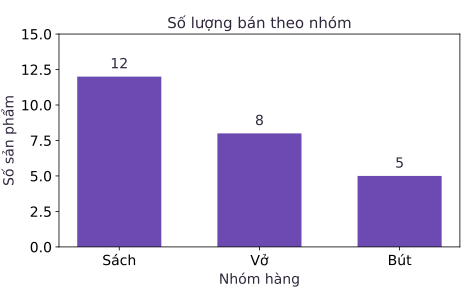
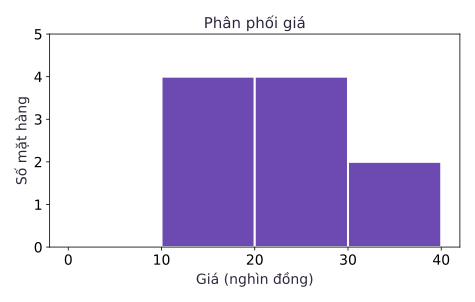

Một bảng dữ liệu với hàng chục nghìn con số có thể chứa đựng những quy luật giá trị, nhưng bộ não con người không được tiến hóa để đọc hiểu các ma trận số học khô khốc một cách trực quan. Trực quan hóa dữ liệu không đơn thuần là vẽ những bức tranh minh họa bắt mắt. Về bản chất khoa học, đây là quá trình **mã hóa thị giác thông tin định lượng (Visual Encoding of Quantitative Information)**, biến các giá trị trừu tượng thành các thuộc tính không gian mà thị giác con người có thể tiếp nhận và phân tích tức thì.

Các nghiên cứu kinh điển về nhận thức thị giác (tiêu biểu là công trình của Cleveland và McGill) đã chứng minh rằng: mắt người phán đoán vị trí trên cùng một thang đo và so sánh chiều dài với độ chính xác cao nhất. Ngược lại, việc ước lượng diện tích, góc nghiêng hay độ đậm nhạt của màu sắc thường có sai số nhận thức lớn hơn rất nhiều. Do đó, việc lựa chọn dạng biểu đồ nào hoàn toàn không phụ thuộc vào sở thích thẩm mỹ cá nhân, mà được quyết định bởi bản chất toán học của dữ liệu và câu hỏi phân tích cốt lõi bạn muốn trả lời.

Bài học này xây dựng nền tảng vững chắc về trực quan hóa dữ liệu với thư viện Matplotlib: phân định rạch ròi bài toán để chọn đúng dạng biểu đồ, làm chủ kiến trúc hướng đối tượng của Figure và Axes, nắm vững cơ chế chia khoảng của histogram và tuân thủ các nguyên tắc đạo đức để tạo ra những biểu đồ trung thực, sáng rõ.

## 1. Bản chất của câu hỏi quyết định hình thức biểu đồ

Trước khi viết bất kỳ dòng mã vẽ đồ thị nào, người làm dữ liệu phải tự đặt câu hỏi: "Tôi muốn người đọc nhìn ra điều gì từ biểu đồ này?". Mỗi dạng đồ thị được sinh ra để phục vụ một cấu trúc so sánh chuyên biệt:

| Câu hỏi phân tích | Dạng biểu đồ chuẩn mực | Kênh thị giác mã hóa | Kiểm tra dữ liệu trước khi vẽ |
| :--- | :--- | :--- | :--- |
| **So sánh đại lượng giữa các nhóm rời rạc** | Biểu đồ cột đứng hoặc thanh ngang (Bar chart) | Chiều dài của thanh phản ánh độ lớn đại lượng | Danh mục các nhóm có bị trùng lặp không? Đơn vị đo lường có đồng nhất? |
| **Theo dõi biến thiên tuần tự theo thời gian** | Biểu đồ đường (Line plot) | Vị trí điểm nối liền thể hiện xu hướng và nhịp điệu | Chuỗi thời gian đã được sắp xếp tăng dần chưa? Có khoảng trống thời gian bị gián đoạn không? |
| **Khám phá hình dạng phân phối của biến liên tục** | Biểu đồ tần suất (Histogram) | Diện tích và chiều cao của cột trong từng khoảng giá trị | Các điểm ngoại lai cực trị, số lượng khoảng (bins) và độ rộng từng khoảng |
| **Khảo sát mối quan hệ hiệp biến giữa hai biến số** | Biểu đồ phân tán (Scatter plot) | Tọa độ không gian hai chiều $(x, y)$ của từng quan sát | Đơn vị của hai trục, hiện tượng các điểm bị đè khít lên nhau (overplotting) |

### Phân biệt bản chất giữa Biểu đồ cột (Bar chart) và Histogram

Đây là hai dạng đồ thị mà người mới học thường xuyên nhầm lẫn vì thoạt nhìn cả hai đều gồm "những chiếc cột đứng". Tuy nhiên, cấu trúc toán học của chúng hoàn toàn khác nhau:

- **Biểu đồ cột (Bar chart)**: Trục hoành là tập hợp các **danh mục rời rạc (categorical variables)**, ví dụ như tên các nhóm hàng: Sách, Vở, Bút. Giữa các nhóm này không có khoảng cách toán học liên tục. Bạn hoàn toàn có thể hoán đổi vị trí của cột Sách và cột Bút mà không làm thay đổi bản chất dữ liệu. Các cột luôn được vẽ tách rời nhau bằng một khoảng trống (gap) để nhấn mạnh tính chất phân nhóm độc lập. Độ rộng của cột hoàn toàn tùy ý và không mang bất kỳ ý nghĩa số học nào. Chỉ có chiều dài cột là thuộc tính mã hóa thông tin.
- **Biểu đồ tần suất (Histogram)**: Trục hoành là một **trục số thực liên tục (continuous numeric axis)**. Mỗi cột đại diện cho một khoảng giá trị số học (gọi là bin). Vị trí và thứ tự của các khoảng bị khóa cứng theo trục số học từ nhỏ đến lớn. Các cột nằm san sát, dính liền kề nhau (trừ khi có một khoảng hoàn toàn không có dữ liệu). Độ rộng của cột đại diện cho khoảng biến thiên $\Delta x$, và diện tích của cột phản ánh mật độ hoặc số lượng quan sát rơi vào khoảng đó.

## 2. Kiến trúc hướng đối tượng của Matplotlib: Figure và Axes

Trong thư viện Matplotlib, người ta có thể vẽ nhanh bằng các hàm toàn cục kế thừa từ phong cách MATLAB (`plt.plot`, `plt.bar`). Tuy nhiên, trong môi trường sản xuất công nghiệp và các dự án kỹ thuật chuyên nghiệp, chuẩn mực bắt buộc là sử dụng **giao diện hướng đối tượng (Object-Oriented API)** tường minh.

Kiến trúc này phân tách rõ hai khái niệm nền tảng:
- **`Figure`**: Là toàn bộ khung tranh vật lý, bao gồm cửa sổ hiển thị, kích thước khung hình (tính bằng inch), độ phân giải (DPI), màu nền và tất cả các tiểu đồ thị nằm bên trong.
- **`Axes`**: Là một vùng vẽ đồ thị cụ thể (một hệ tọa độ) nằm trên Figure. Một Axes sở hữu trục hoành (X axis), trục tung (Y axis), lưới tọa độ, các vạch chia (ticks), tiêu đề và các đường cong dữ liệu. Một Figure có thể chứa một hoặc nhiều Axes (dưới dạng lưới đồ thị con - subplots).

Hàm `plt.subplots` là điểm khởi đầu chuẩn mực để khởi tạo đồng thời cả khung tranh Figure và đối tượng hệ trục Axes:

```python
import matplotlib.pyplot as plt
import pandas as pd

counts = pd.Series([12, 8, 5], index=["Sach", "Vo", "But"])
fig, ax = plt.subplots(figsize=(6, 4))
ax.bar(counts.index, counts.values, color="#6d4ab1")
ax.set(title="So luong ban theo nhom", xlabel="Nhom hang", ylabel="So san pham")
ax.set_ylim(bottom=0)
fig.tight_layout()
fig.savefig("ban-theo-nhom.png", dpi=160)
plt.close(fig)
```

### Nguyên tắc đạo đức: Trục tung của biểu đồ cột bắt buộc phải bắt đầu từ 0

Trong đoạn mã trên, lệnh `ax.set_ylim(bottom=0)` mang ý nghĩa phương pháp luận có tính nguyên tắc. Khi nhìn vào một biểu đồ cột, não bộ con người tự động so sánh **tỷ lệ chiều dài** của các cột để rút ra kết luận về quy mô tương đối.

Tổng số sản phẩm bán ra là $12 + 8 + 5 = 25$. Nhóm Vở có 8 sản phẩm, chiếm tỷ lệ:
$$\frac{8}{25} = 0.32 = 32\%$$
Tỷ lệ của nhóm Sách là $12/25 = 48\%$, và nhóm Bút là $5/25 = 20\%$. Khi trục tung bắt đầu từ 0, cột Sách cao gấp 2.4 lần cột Bút, phản ánh trung thực tỷ lệ số lượng $12 / 5 = 2.4$.

Nếu một người vô tình hay hữu ý cắt cụt trục tung (truncated axis), cho trục Y bắt đầu từ mốc 4:
- Cột Bút chỉ còn chiều cao hiển thị là $5 - 4 = 1$ đơn vị.
- Cột Sách có chiều cao hiển thị là $12 - 4 = 8$ đơn vị.
Khi đó, cột Sách trông cao gấp 8 lần cột Bút! Đây là một dạng thao túng thị giác kinh điển, phóng đại chênh lệch lên nhiều lần và dẫn dắt người xem đến những kết luận sai lệch. Do đó, với biểu đồ cột, điểm gốc 0 là một quy tắc đạo đức nghề nghiệp bắt buộc.



## 3. Histogram và cơ chế tính toán biên khoảng

Để dựng biểu đồ phân phối tần suất cho một mảng giá trị liên tục, thư viện phải thực hiện phép chia khoảng (binning). Việc hiểu rõ cơ chế toán học phía sau các mốc biên giúp ta không bị ngộ nhận về số lượng điểm trong từng khoảng:

```python
import numpy as np

prices = np.array([10, 12, 14, 16, 20, 20, 24, 28, 30, 36])
edges = [0, 10, 20, 30, 40]
freq, _ = np.histogram(prices, bins=edges)
print(freq.tolist())             # [0, 4, 4, 2]
fig, ax = plt.subplots(figsize=(6, 4))
ax.hist(prices, bins=edges, color="#6d4ab1", edgecolor="white")
ax.set(xlabel="Gia (nghin dong)", ylabel="So mat hang", title="Phan phoi gia")
fig.tight_layout()
fig.savefig("phan-phoi-gia.png", dpi=160)
plt.close(fig)
```

### Quy ước nửa đóng nửa mở của các khoảng dữ liệu

Khi truyền mảng mốc biên `edges = [0, 10, 20, 30, 40]`, hàm `np.histogram` và `ax.hist` chia không gian thành 4 khoảng theo quy ước chuẩn của toán học số:
1. Khoảng 1: $[0, 10)$ — nửa đóng nửa mở, lấy giá trị từ 0 đến bé hơn 10 (không chứa 10). Mảng dữ liệu không có phần tử nào nhỏ hơn 10, nên tần suất bằng 0.
2. Khoảng 2: $[10, 20)$ — lấy từ 10 đến bé hơn 20 (chứa 10, không chứa 20). Các giá trị thỏa mãn gồm $\{10, 12, 14, 16\}$, tổng cộng có 4 phần tử.
3. Khoảng 3: $[20, 30)$ — lấy từ 20 đến bé hơn 30 (chứa 20, không chứa 30). Các giá trị thỏa mãn gồm hai số 20, 24 và 28, tổng cộng có 4 phần tử. Điểm mốc 20 rơi vào khoảng này, không rơi vào khoảng 2.
4. Khoảng cuối cùng: $[30, 40]$ — đây là **ngoại lệ đặc biệt**: khoảng cuối cùng nhận cả hai biên đóng. Do đó, điểm 30, 36 và điểm biên trên cùng 40 (nếu có) đều thuộc về khoảng này. Trong mảng trên, có hai giá trị $\{30, 36\}$, tần suất bằng 2.

Kết quả đếm tần suất chính xác là mảng `[0, 4, 4, 2]`. 

Nếu bạn thiết lập tham số `density=True`, chiều cao của các cột sẽ được chuẩn hóa sao cho **tổng diện tích của toàn bộ các cột bằng đúng 1** (tương ứng với tích phân của hàm mật độ xác suất). Khi các khoảng có độ rộng khác nhau, độ cao của cột không còn phản ánh trực tiếp số lượng quan sát. Thay vào đó, người đọc phải nhân chiều cao với độ rộng của đáy để biết tỷ lệ xác suất trong khoảng đó.



## 4. Biểu diễn chuỗi thời gian và tương quan phân tán

Khi cần theo dõi diễn biến động của một đại lượng hoặc khảo sát sự phụ thuộc giữa hai biến số, ta kết hợp nhiều Axes trên cùng một Figure:

```python
daily = pd.Series([10, 15, 12], index=pd.date_range("2026-02-01", periods=3))
fig, axes = plt.subplots(1, 2, figsize=(9, 4))
axes[0].plot(daily.index, daily.values, marker="o")
axes[0].set(xlabel="Ngay", ylabel="So san pham", title="Ban theo ngay")
axes[1].scatter([1, 2, 3, 4], [20, 40, 60, 80])
axes[1].set(xlabel="So luong", ylabel="Doanh thu (nghin dong)")
fig.autofmt_xdate()
fig.tight_layout()
fig.savefig("duong-va-scatter.png", dpi=160)
plt.close(fig)
```

Phương thức `fig.autofmt_xdate()` tự động xoay nghiêng nhãn ngày tháng trên trục X để tránh tình trạng chữ bị đè lên nhau khi chuỗi thời gian kéo dài.

### Những lưu ý phân tích trên biểu đồ đường và phân tán

- **Tính liên tục trên biểu đồ đường (Line plot)**: Đường thẳng nối giữa hai điểm dữ liệu ngụ ý rằng hiện tượng biến thiên có tính chất tuần tự liên tục. Tuyệt đối không tự ý kẻ đường nối xuyên qua một khoảng thời gian bị khuyết thiếu dữ liệu (missing interval), vì hành vi đó sẽ đánh lừa người đọc rằng hệ thống vẫn duy trì hoạt động bình thường trong giai đoạn gián đoạn.
- **Tương quan và nhân quả trên biểu đồ phân tán (Scatter plot)**: Một đường thẳng dốc lên tuyệt đối giữa số lượng và doanh thu (trong ví dụ trên) là do công thức nhân đơn giá tạo ra. Trên dữ liệu thực tế, sự tồn tại của một xu hướng tương quan mạnh mẽ trên scatter plot chỉ chứng minh hai biến cùng biến thiên theo một chiều hướng, chứ không phải bằng chứng khẳng định biến này là nguyên nhân trực tiếp sinh ra biến kia.

## 5. Danh mục kiểm tra chất lượng trước khi phát hành biểu đồ

Một biểu đồ kỹ thuật chuyên nghiệp cần vượt qua danh mục thẩm định sau đây trước khi được đưa vào báo cáo hay ấn phẩm khoa học:

1. **Định danh trục và đơn vị đo lường tường minh**: Không bao giờ để trục số trơ trọi chỉ có các con số vô hồn. Trục hoành và trục tung phải ghi rõ tên biến số kèm đơn vị cụ thể (ví dụ: `Doanh thu (trieu dong)`, `Thoi gian (giay)`).
2. **Quy tắc tỷ lệ mực trên dữ liệu (Data-Ink Ratio của Edward Tufte)**: Tối đa hóa phần mực dùng để biểu diễn dữ liệu thực tế, tối thiểu hóa các yếu tố trang trí rườm rà (chartjunk). Tránh các hiệu ứng giả 3D, viền khung dày đặc hay hoa văn nền gây rối mắt.
3. **Phối màu có mục đích và hỗ trợ người mù màu**: Không lạm dụng màu sắc một cách ngẫu nhiên. Nếu dùng màu để phân loại danh mục, hãy sử dụng các bảng màu chuyên biệt (như ColorBrewer hoặc viridis) có độ tương phản rõ ràng và thân thiện với người khiếm thị màu sắc.
4. **Định dạng xuất hình phù hợp**:
   - Sử dụng định dạng vector (**SVG**, **PDF**) khi nhúng vào tài liệu in ấn hoặc báo cáo web để giữ nguyên độ sắc nét tuyệt đối của đường nét và phông chữ khi phóng to.
   - Sử dụng định dạng raster (**PNG**) với độ phân giải cao (`dpi=150` đến `dpi=300`) khi cần chia sẻ ảnh chụp nhanh hoặc nhúng vào slide trình chiếu thông thường.

## 6. Bài tập tự luyện

::: exercise Lựa chọn giữa Biểu đồ cột và Histogram
Một chuyên viên tài chính muốn phân tích cơ cấu chi tiêu của người tiêu dùng:
1. Câu hỏi 1: Nhóm ngành nào (Ăn uống, Giải trí, Mua sắm, Y tế) chiếm tổng số tiền chi tiêu lớn nhất?
2. Câu hỏi 2: Các hóa đơn mua sắm của khách hàng có xu hướng phân bổ tập trung ở mức giá nào (dưới 100 nghìn, 100 đến 500 nghìn, hay trên 1 triệu đồng)?

Hãy chỉ ra dạng biểu đồ thích hợp nhất cho từng câu hỏi và giải thích sự khác biệt cốt lõi.
:::

::: solution
1. Đối với Câu hỏi 1, biểu đồ phù hợp nhất là **Biểu đồ cột (Bar chart)** hoặc thanh ngang. Các nhóm ngành là các biến định tính độc lập, không có tính liên tục số học.
2. Đối với Câu hỏi 2, biểu đồ bắt buộc là **Biểu đồ tần suất (Histogram)**. Giá trị hóa đơn là một biến định lượng liên tục, và việc chia các mức giá thành các khoảng kế tiếp nhau cho phép khảo sát hình dạng phân phối (độ lệch, đỉnh phân phối) của hành vi tiêu dùng.
:::

::: exercise Xác định khoảng chứa trong phép chia khoảng Histogram
Cho mảng dữ liệu điểm số gồm ba giá trị $X = \{10, 20, 40\}$. Giả sử ta chia khoảng bằng danh sách mốc biên `bins = [0, 10, 20, 30, 40]`. Áp dụng quy tắc chia khoảng mặc định của `np.histogram`, hãy cho biết:
1. Điểm số 10 rơi vào khoảng nào?
2. Điểm số 20 rơi vào khoảng nào?
3. Điểm số 40 rơi vào khoảng nào?
4. Mảng tần số đếm được có giá trị là bao nhiêu?
:::

::: solution
Áp dụng quy ước nửa đóng nửa mở $[a, b)$ cho các khoảng trước và khoảng đóng $[c, d]$ cho khoảng cuối:
1. Điểm số 10 rơi vào khoảng thứ hai $[10, 20)$, vì khoảng thứ nhất $[0, 10)$ loại trừ biên trên 10.
2. Điểm số 20 rơi vào khoảng thứ ba $[20, 30)$, vì khoảng thứ hai $[10, 20)$ loại trừ biên trên 20.
3. Điểm số 40 rơi vào khoảng thứ tư $[30, 40]$, vì đây là khoảng cuối cùng nên nó nhận cả hai biên đầu và cuối.
4. Mảng tần số tương ứng cho 4 khoảng $[0, 10)$, $[10, 20)$, $[20, 30)$, $[30, 40]$ là: `[0, 1, 1, 1]`.
:::

::: exercise Tính toán tỷ lệ phần trăm và xác định không gian mẫu
Một cửa hàng văn phòng phẩm thống kê số lượng hàng bán trong một ngày gồm ba nhóm: Sách có 12 sản phẩm, Vở có 8 sản phẩm, và Bút có 5 sản phẩm.
1. Hãy tính tỷ lệ phần trăm số sản phẩm của nhóm Vở.
2. Nêu rõ mẫu số được sử dụng để tính tỷ lệ này đại diện cho đại lượng gì.
:::

::: solution
1. Tổng số sản phẩm bán ra của cả ba nhóm là:
   $$N = 12 + 8 + 5 = 25 \text{ (sản phẩm)}$$
   Tỷ lệ của nhóm Vở trong tổng số sản phẩm là:
   $$\text{Tỷ lệ} = \frac{8}{25} = 0.32 = 32\%$$
2. Mẫu số $25$ ở đây đại diện cho **tổng số lượng sản phẩm vật lý** bán ra của đúng ba nhóm hàng được khảo sát. Mẫu số này hoàn toàn không phải là tổng số đơn hàng (vì một đơn hàng có thể chứa nhiều sản phẩm), cũng không đại diện cho tổng doanh thu tiền tệ. Việc minh định rõ mẫu số giúp người đọc không bị ngộ nhận giữa quy mô sản phẩm và quy mô giao dịch.
:::

::: exercise Vạch trần thủ thuật cắt cụt trục tung và chuẩn hóa biểu đồ cột theo chuẩn mực OOP
Một nhóm tiếp thị gửi bản báo cáo khảo sát tỷ lệ hài lòng của khách hàng trên 3 phiên bản phần mềm:
- Phiên bản A: $93.5\%$
- Phiên bản B: $94.8\%$
- Phiên bản C: $97.2\%$

Trong slide báo cáo, nhóm tiếp thị vẽ biểu đồ cột với trục tung bắt đầu từ $92.0\%$ đến $98.0\%$. Thủ thuật này khiến cột của Phiên bản C trông cao gấp 3.5 lần so với Phiên bản A, tạo cảm giác về một bước nhảy vọt thần kỳ.
Yêu cầu:
1. Viết mã Matplotlib tái hiện biểu đồ thiên lệch (biến dạng thị giác) của nhóm tiếp thị.
2. Viết mã chuẩn mực theo kiến trúc hướng đối tượng (OOP) của Matplotlib với trục tung bắt đầu từ $0\%$, hiển thị nhãn giá trị chính xác trên đầu mỗi cột để cung cấp cái nhìn trung thực về mặt thống kê.
:::

::: solution
#### Cách 1: Tiếp cận Căn bản & Trực quan (Tái hiện bẫy cắt cụt trục tung Truncated Y-Axis)
Một cách người ta hay lạm dụng trong truyền thông là dùng hàm tĩnh của Matplotlib để ép trục tung:

```python
import matplotlib.pyplot as plt

phien_ban = ["Bản A", "Bản B", "Bản C"]
ty_le = [93.5, 94.8, 97.2]

# BẪY THỊ GIÁC: Cắt cụt trục tung từ 92%
plt.figure(figsize=(6, 4))
plt.bar(phien_ban, ty_le, color=["#cbd5e1", "#cbd5e1", "#3b82f6"])
plt.ylim(92, 98) # Trục tung không bắt đầu từ 0
plt.title("Biểu đồ biến dạng thị giác (Thổi phồng mức chênh lệch)")
plt.ylabel("Tỷ lệ hài lòng (%)")
plt.show()
# Quan sát: Phần cột hiện ra của Bản C cao 5.2 đơn vị (97.2 - 92),
# trong khi Bản A chỉ cao 1.5 đơn vị (93.5 - 92). Mắt nhìn thấy gấp 3.5 lần,
# trong khi thực tế Bản C chỉ nhỉnh hơn Bản A vỏn vẹn 3.7 điểm phần trăm!
```

#### Cách 2: Tiếp cận Nâng cao & Tối ưu (Chuẩn hóa hướng đối tượng OOP với tỷ lệ trung thực và nhãn bar_label)
Chuyên gia khoa học dữ liệu luôn tuân thủ nguyên tắc tôn trọng chiều dài cột, lập trình qua bộ đôi `Figure` và `Axes`:

```python
# Thiết lập chuẩn mực hướng đối tượng
fig, ax = plt.subplots(figsize=(7, 4.5), dpi=100)

cac_cot = ax.bar(phien_ban, ty_le, color=["#94a3b8", "#94a3b8", "#0284c7"], width=0.55)

# BẮT BUỘC: Khóa trục tung bắt đầu từ mốc 0% tuyệt đối
ax.set_ylim(0, 105)

# Định dạng nhãn và tiêu đề học thuật
ax.set_title("Tỷ lệ Hài lòng Khách hàng theo Phiên bản (Chuẩn mực Trung thực)", fontsize=12, fontweight="bold", pad=12)
ax.set_ylabel("Tỷ lệ phần trăm (%)", fontsize=10)
ax.grid(axis="y", linestyle="--", alpha=0.5)

# Hiển thị nhãn số liệu trực tiếp trên đỉnh mỗi cột
ax.bar_label(cac_cot, fmt="%.1f%%", padding=3, fontsize=10, fontweight="semibold")

# Tinh chỉnh giao diện: Bỏ khung viền thừa ở trên và bên phải
ax.spines["top"].set_visible(False)
ax.spines["right"].set_visible(False)

plt.tight_layout()
plt.show()
```

#### Phân tích bản chất & Bình luận sư phạm
- **Bản chất tâm lý học thị giác của Biểu đồ cột**: Não bộ con người mã hóa giá trị của biểu đồ cột thông qua **chiều dài hình học** của cột đó tính từ đường cơ sở (*Baseline*). Khi bạn cắt cụt trục tung (ví dụ từ $92\%$), bạn đã thay đổi điểm tựa cơ sở, biến một mức chênh lệch nhỏ $3.7$ điểm phần trăm thành một ảo ảnh quang học gấp $350\%$. Trong giới khoa học dữ liệu, hành vi cắt cụt trục tung của biểu đồ cột được xếp vào loại ngụy tạo thị giác thiếu trung thực (*Visual Deception*).
- **Khi nào được phép thu hẹp trục tung?**: Quy tắc bắt đầu từ $0$ áp dụng nghiêm ngặt cho **Biểu đồ cột (Bar chart)** vì mắt đọc chiều dài. Ngược lại, với **Biểu đồ đường (Line chart)** theo dõi sự biến thiên theo thời gian của một chỉ số sinh học hay tài chính (như thân nhiệt bệnh nhân $36.5^\circ\text{C} - 40^\circ\text{C}$, hay tỷ giá hối đoái), việc phóng to trục tung là hoàn toàn hợp lệ vì mắt đọc *vị trí của điểm* và *độ dốc của đường*, miễn là biểu đồ phải ghi chú rõ thang đo.
:::

## 7. Nguồn và đọc thêm

- Wes McKinney, *Python for Data Analysis*, 3rd Edition — [Chương 9: Plotting and Visualization](https://wesmckinney.com/book/plotting-and-visualization) (mục 9.1 và 9.2).
- Tài liệu chính thức về kiến trúc đồ họa: [Matplotlib documentation — Parts of a Figure](https://matplotlib.org/stable/users/explain/quick_start.html#parts-of-a-figure).
- Nghiên cứu nền tảng về mã hóa thị giác: Cleveland, W. S., & McGill, R. (1984), *Graphical Perception: Theory, Experimentation, and Application to the Development of Graphical Methods*, Journal of the American Statistical Association.
- Nguyên tắc thiết kế đồ họa thống kê: Edward Tufte, *The Visual Display of Quantitative Information*, Graphics Press.
- [Bài giảng tham khảo môn Xử lý dữ liệu (iaidev)](https://courses.iaidev.com/programming-for-data-processing/2627-1/lecture-12-truc-quan-hoa-co-ban.html).
