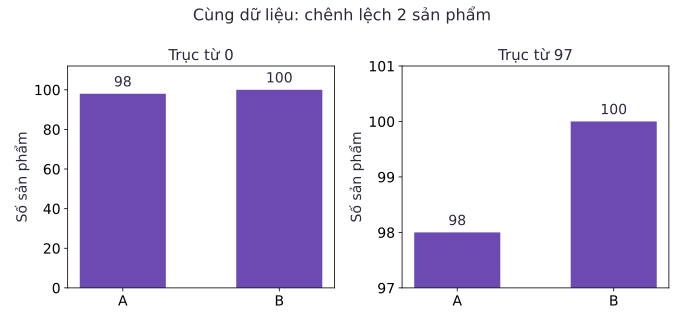
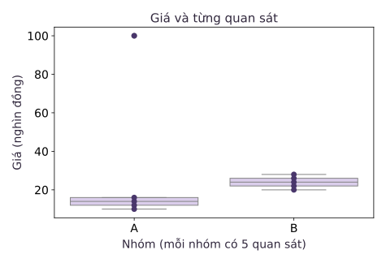

Một biểu đồ được lập trình hoàn toàn không có lỗi kỹ thuật, lấy số liệu chính xác từ cơ sở dữ liệu, vẫn có thể dẫn dắt người đọc tới những kết luận sai lệch nghiêm trọng. Trực quan hóa dữ liệu không dừng lại ở kỹ năng tạo hình. Phẩm chất quan trọng hơn của một nhà khoa học dữ liệu là **năng lực đọc và thẩm định biểu đồ có tư duy phản biện (Critical Chart Literacy)**. Bạn phải nhìn thấu qua lớp vỏ đồ họa để nhận diện các thủ pháp phóng đại thị giác, các thang đo bị thao túng và các đại lượng tóm tắt che giấu bản chất phân phối.

Khi hai nhóm sản phẩm có sản lượng là 98 và 100, mức chênh lệch thực tế chỉ vỏn vẹn 2%. Tuy nhiên, chỉ bằng một thao tác cắt gọt trục tọa độ, người ta có thể làm cho nhóm thứ hai trông như thể có quy mô gấp ba lần nhóm thứ nhất. Bài học này đi sâu vào giải phẫu các hình thức trực quan hóa nâng cao: bóc trần ảo ảnh trục cắt bằng hệ số dối trá, hiểu đúng cấu trúc toán học của biểu đồ hộp (boxplot), kiểm soát tính nhất quán của thang đo trên lưới đồ thị con và phân loại khoa học các thang màu biểu diễn.

## 1. Chênh lệch số học và ảo ảnh thị giác từ trục bị cắt

Hãy bắt đầu bằng một thí nghiệm trực quan so sánh hai phương thức dựng trục cho cùng một cặp giá trị:

```python
import matplotlib.pyplot as plt

fig, axes = plt.subplots(1, 2, figsize=(9, 4))
for ax in axes:
    ax.bar(["A", "B"], [98, 100], color="#6d4ab1")
    ax.set_ylabel("So san pham")
axes[0].set_ylim(0, 105)
axes[0].set_title("Truc bat dau tu 0")
axes[1].set_ylim(97, 101)
axes[1].set_title("Truc bi cat")
fig.tight_layout()
fig.savefig("so-sanh-truc.png", dpi=160)
plt.close(fig)
```

### Giải mã sự thao túng thị giác bằng Hệ số dối trá

Trong dữ liệu thực tế, sản lượng của nhóm A là 98 sản phẩm, nhóm B là 100 sản phẩm. Mức tăng trưởng tương đối từ A sang B được tính chính xác bằng:
$$\frac{100 - 98}{98} = \frac{2}{98} \approx 0.0204 = 2.04\%$$

Trên hình bên trái, khi trục tung bắt đầu từ 0, mắt người so sánh tỷ lệ chiều dài của hai cột. Tỷ lệ chiều cao hiển thị là $100 / 98 \approx 1.02$, phản ánh trung thực mức tăng nhẹ $2.04\%$.

Nhưng hãy nhìn sang hình bên phải. Bằng cách thiết lập `ylim(97, 101)`, trục tung đã bị cắt cụt mất 97 đơn vị đầu tiên:
- Chiều cao hiển thị của cột A chỉ còn là $98 - 97 = 1$ đơn vị.
- Chiều cao hiển thị của cột B là $100 - 97 = 3$ đơn vị.

Tỷ lệ chiều cao thị giác lúc này biến thành $3 / 1 = 300\%$ (cột B cao gấp 3 lần cột A). Edward Tufte đã đề xuất chỉ số **Hệ số dối trá (Lie Factor)** để lượng hóa mức độ thao túng này:

$$
\begin{aligned}
\text{Lie Factor} &= \frac{\text{Tỷ lệ thay đổi thể hiện trên hình}}{\text{Tỷ lệ thay đổi thực tế trong dữ liệu}} \\
&= \frac{(3 - 1) / 1}{(100 - 98) / 98} = \frac{200\%}{2.04\%} \approx 98.
\end{aligned}
$$

Một biểu đồ có hệ số dối trá lên tới gần 100 lần đã biến một biến động nhỏ nhặt thành một bước nhảy vọt giả tạo. Đây là lý do vì sao với biểu đồ cột, việc giữ trục tung bắt đầu từ 0 là nguyên tắc bất di bất dịch.



Đối với biểu đồ đường (Line plot), việc thu hẹp trục tọa độ đôi khi được chấp nhận để quan sát dao động của các chuỗi thời gian có phương sai nhỏ. Tuy nhiên, người trình bày bắt buộc phải ghi rõ khoảng biến thiên và không được dùng từ ngữ phóng đại để mô tả những dao động nhỏ ấy. Nếu dữ liệu có tốc độ tăng trưởng nhân theo cấp số nhân, ta có thể dùng thang đo logarit (log scale) để chuyển các đường cong lũy thừa thành đường thẳng, giúp so sánh tốc độ tăng trưởng phần trăm. Cần lưu ý rằng thang đo logarit không xác định cho các giá trị bằng 0 hoặc số âm.

## 2. Giải phẫu biểu đồ hộp: Tóm tắt năm số và râu Tukey

Biểu đồ hộp (Boxplot), do nhà toán học John Tukey phát minh, là công cụ kinh điển để tóm tắt phân phối dữ liệu dựa trên **bộ năm số thống kê**: giá trị nhỏ nhất, tứ phân vị thứ nhất ($Q_1$), trung vị ($Q_2$), tứ phân vị thứ ba ($Q_3$) và giá trị lớn nhất.

```python
import pandas as pd
import seaborn as sns

data = pd.DataFrame({
    "nhom": ["A"] * 5 + ["B"] * 5,
    "gia": [10, 12, 14, 16, 100, 20, 22, 24, 26, 28],
})
fig, ax = plt.subplots(figsize=(6, 4))
sns.boxplot(data=data, x="nhom", y="gia", whis=1.5, ax=ax, color="#d9c8f0")
sns.stripplot(data=data, x="nhom", y="gia", ax=ax, color="#49366b", jitter=False)
ax.set(xlabel="Nhom", ylabel="Gia (nghin dong)", title="Gia va tung quan sat")
fig.tight_layout()
fig.savefig("boxplot.png", dpi=160)
plt.close(fig)
```

### Cơ chế hoạt động của râu hộp (Whiskers)

Nhiều người lầm tưởng rằng hai đầu râu của boxplot luôn kéo dài tới đúng vị trí của hàng rào Tukey ($Q_1 - 1.5 \times IQR$ và $Q_3 + 1.5 \times IQR$). Đây là một hiểu lầm phổ biến.

Hãy phân tích dữ liệu nhóm A gồm năm phần tử: $\{10, 12, 14, 16, 100\}$:
- Trung vị ($Q_2$) là 14.
- Tứ phân vị dưới ($Q_1$) là 12, và tứ phân vị trên ($Q_3$) là 16.
- Độ trải giữa: $IQR = 16 - 12 = 4$.
- Hàng rào trên theo quy tắc Tukey: $Q_3 + 1.5 \times IQR = 16 + 1.5 \times 4 = 22$.

Điểm dữ liệu 100 vượt xa ngưỡng 22, do đó nó bị đánh dấu là một điểm ngoại lai và được vẽ thành một chấm tròn riêng biệt.

Bây giờ hãy chú ý đến đầu râu trên: Trong tập dữ liệu, các quan sát nhỏ hơn hoặc bằng 22 gồm có $\{10, 12, 14, 16\}$. Quan sát lớn nhất trong nhóm này là 16. Do đó, **râu trên kết thúc tại đúng giá trị 16**, chứ không kéo dài đến mốc lý thuyết 22. 

> Quy tắc vàng của biểu đồ hộp: Râu chỉ vươn tới **quan sát thực tế xa nhất vẫn nằm bên trong hàng rào**, chứ không bao giờ dừng lại ở một con số hư cấu giữa khoảng trống dữ liệu.

### Giới hạn của Boxplot và sức mạnh khi kết hợp Stripplot

Điểm yếu chí mạng của biểu đồ hộp là nó che giấu hoàn toàn cỡ mẫu ($n$) và hình thái phân phối chi tiết. Một hộp vẽ từ 5 quan sát trông có thể y hệt một hộp vẽ từ 50.000 quan sát. Ngoài ra, nếu dữ liệu có phân phối hai đỉnh (bimodal), boxplot vẫn chỉ vẽ ra một chiếc hộp đơn lẻ như phân phối chuẩn.

Đây là một kỹ thuật các kỹ sư dữ liệu thường dùng: chồng thêm một lớp biểu đồ phân tán các điểm thực (`sns.stripplot`) lên trên boxplot. Lớp điểm này phơi bày toàn bộ số lượng quan sát thực tế và mật độ phân bố thật, giúp người xem không bị đánh lừa bởi các đại lượng tóm tắt.



## 3. Đồng nhất thang đo trên lưới đồ thị con

Khi phân tích dữ liệu đa chiều, kỹ thuật chia nhỏ thành nhiều đồ thị con (Small Multiples hay Faceting) giúp ta so sánh hành vi giữa các phân khúc khác nhau:

```python
fig, axes = plt.subplots(1, 2, sharey=True, figsize=(9, 4))
for ax, group in zip(axes, ["A", "B"], strict=True):
    values = data.loc[data["nhom"] == group, "gia"]
    ax.scatter(range(len(values)), values)
    ax.set(xlabel="Vi tri quan sat", title=f"Nhom {group}, n={len(values)}")
axes[0].set_ylabel("Gia (nghin dong)")
fig.tight_layout()
fig.savefig("cung-thang.png", dpi=160)
plt.close(fig)
```

Tham số `sharey=True` là chìa khóa phương pháp luận quan trọng. Nếu không khóa chung thang đo trục tung, mỗi tiểu đồ thị sẽ tự động căn chỉnh trục theo miền giá trị cực tiểu và cực đại của riêng nó. Kết quả là một nhóm có mức giá dao động từ 10 đến 20 trông sẽ cao và biến động y hệt một nhóm có mức giá từ 1.000 đến 2.000. Việc đồng nhất thang đo bảo đảm rằng các vị trí không gian tương đương nhau luôn đại diện cho cùng một độ lớn số học.

### Nguyên lý lựa chọn bảng màu trong trực quan hóa

Màu sắc là một kênh truyền tải thông tin mạnh mẽ nhưng rất dễ bị lạm dụng. Khoa học thị giác phân chia bảng màu thành ba loại hình chuẩn mực:

1. **Thang màu tuần tự (Sequential Colormaps)**: Dùng để biểu diễn các biến số có thứ tự độ lớn liên tục tăng dần từ thấp đến cao (chẳng hạn như doanh thu, mật độ dân số). Độ sáng của màu thay đổi đều đặn từ nhạt sang đậm (ví dụ: các dải màu `Blues`, `Viridis`).
2. **Thang màu phân kỳ (Diverging Colormaps)**: Dùng khi dữ liệu có một điểm mốc trung tâm mang ý nghĩa số học hoặc thực tiễn đặc biệt (chẳng hạn như mức lợi nhuận bằng 0, độ lệch nhiệt độ so với trung bình, tỷ lệ tăng trưởng âm và dương). Hai đầu của thang màu sử dụng hai gam màu tương phản rõ rệt (như Xanh - Trắng - Đỏ), hội tụ về một màu trung tính ở điểm giữa.
3. **Thang màu định tính (Qualitative Colormaps)**: Dùng để phân biệt các danh mục rời rạc không có thứ bậc (như các phòng ban, các quốc gia). Các màu sắc có độ bão hòa và độ sáng tương đương nhau để tránh tạo ra cảm giác ngầm hiểu rằng một danh mục nào đó quan trọng hơn danh mục khác.

## 4. Quy trình phản biện khi đọc một biểu đồ số liệu

Trước khi chấp nhận bất kỳ kết luận nào được rút ra từ một biểu đồ, hãy thực hiện quy trình kiểm tra phản biện qua năm câu hỏi:

1. **Thực thể và đại lượng**: Mỗi điểm, mỗi cột hay mỗi ô màu đại diện cho đối tượng cụ thể nào? Nó là giá trị tổng, giá trị trung bình, trung vị hay tỷ lệ phần trăm? Mẫu số của tỷ lệ đó được lấy từ đâu?
2. **Thang đo và điểm gốc**: Trục tọa độ có bị cắt cụt không? Các đồ thị con có dùng chung thang đo không? Có sự chuyển đổi thang đo (như logarit) mà không giải thích không?
3. **Cỡ mẫu và độ phân tán**: Biểu đồ có thể hiện quy mô mẫu ($n$) không? Sự khác biệt giữa các nhóm có phải do một vài điểm ngoại lai chi phối?
4. **Bản chất của thanh sai số (Error Bars)**: Nếu đồ thị có vẽ thanh sai số, thanh đó đại diện cho đại lượng thống kê nào? Độ lệch chuẩn (SD), sai số chuẩn của trung bình (SEM), hay khoảng tin cậy 95% (CI)? Ba đại lượng này trả lời ba câu hỏi khoa học hoàn toàn khác nhau.
5. **Tương quan và quy kết nhân quả**: Biểu đồ có đang đánh đồng một mối tương quan thống kê trên không gian hai chiều thành một kết luận nhân quả thực tế không?

## 5. Bài tập tự luyện

::: exercise Tính toán mức tăng trưởng và hệ số dối trá khi cắt trục
Một doanh nghiệp báo cáo doanh thu quý 1 là 98 tỷ đồng và quý 2 là 100 tỷ đồng.
1. Hãy tính mức chênh lệch tuyệt đối và tỷ lệ phần trăm tăng trưởng thực tế của quý 2 so với quý 1.
2. Nếu chuyên viên đồ họa vẽ biểu đồ cột với trục tung bắt đầu từ 97 tỷ đồng và kết thúc ở 101 tỷ đồng, tỷ lệ chiều cao hiển thị của cột quý 2 so với cột quý 1 là bao nhiêu? Biểu đồ này tạo ra ấn tượng thị giác lệch lạc như thế nào?
:::

::: solution
1. Mức chênh lệch tuyệt đối là:
   $$100 - 98 = 2 \text{ (tỷ đồng)}$$
   Tỷ lệ phần trăm tăng trưởng thực tế so với quý 1 là:
   $$\frac{2}{98} \times 100\% \approx 2.0408\%$$
2. Khi trục tung bắt đầu từ 97 tỷ đồng:
   - Chiều cao hiển thị của cột quý 1 là $98 - 97 = 1$ đơn vị.
   - Chiều cao hiển thị của cột quý 2 là $100 - 97 = 3$ đơn vị.
   Tỷ lệ chiều cao hiển thị lúc này là $3 / 1 = 3$, tức là cột quý 2 trông cao gấp 3 lần (tăng 200%) so với cột quý 1. Người xem thiếu cảnh giác sẽ ngỡ rằng doanh nghiệp đã có một bước tăng trưởng thần kỳ gấp ba lần, trong khi thực tế mức tăng trưởng chỉ vỏn vẹn hơn 2%.
:::

::: exercise Giải thích điểm dừng của râu trên trong biểu đồ hộp
Cho một tập hợp dữ liệu gồm các giá trị: $X = \{10, 12, 14, 16, 100\}$.
1. Hãy tính $Q_1$, $Q_3$, khoảng trải giữa $IQR$ và ngưỡng hàng rào trên theo công thức Tukey ($whis=1.5$).
2. Vì sao hàng rào trên có giá trị là 22 nhưng râu trên của biểu đồ hộp lại dừng lại ở mốc 16?
:::

::: solution
1. Sắp xếp dữ liệu theo thứ tự tăng dần: $10, 12, 14, 16, 100$:
   - Trung vị $Q_2 = 14$.
   - Tứ phân vị thứ nhất $Q_1 = 12$.
   - Tứ phân vị thứ ba $Q_3 = 16$.
   - Khoảng trải giữa: $IQR = Q_3 - Q_1 = 16 - 12 = 4$.
   - Hàng rào trên lý thuyết:
     $$\text{Hàng rào trên} = Q_3 + 1.5 \times IQR = 16 + 1.5 \times 4 = 16 + 6 = 22$$
2. Giá trị 100 lớn hơn 22 nên nằm ngoài hàng rào trên và được coi là điểm ngoại lai. Trong số các điểm còn lại nhỏ hơn hoặc bằng 22, giá trị lớn nhất thực sự có mặt trong dữ liệu là 16. Theo định nghĩa toán học của biểu đồ hộp Tukey, râu không vẽ tới mốc lý thuyết của hàng rào mà chỉ vươn tới **quan sát thực tế lớn nhất vẫn còn nằm trong hàng rào**. Do đó, râu trên dừng lại chính xác tại 16.
:::

::: exercise Thách thức khi so sánh hai nhóm có cỡ mẫu chênh lệch cực lớn
Một nhóm nghiên cứu so sánh thời gian phản hồi của hai hệ thống máy chủ: Hệ thống A chỉ được thử nghiệm trên 5 lượt yêu cầu ($n_A = 5$), trong khi Hệ thống B được ghi nhận trên 50.000 lượt yêu cầu ($n_B = 50.000$). Biểu đồ báo cáo chỉ vẽ hai cột thể hiện giá trị trung bình bằng nhau ở mức 200 miligiây.
Cách trình bày này tiềm ẩn những cạm bẫy phân tích nào? Cần bổ sung những yếu tố gì để phản ánh đúng thực tế?
:::

::: solution
Cách trình bày chỉ dựa vào giá trị trung bình che giấu hai thông tin sống còn:
1. **Độ phân tán và phân phối**: Hệ thống A với 5 quan sát có thể chứa đựng phương sai cực lớn hoặc bị lệch mạnh bởi một vài giá trị cá biệt, trong khi Hệ thống B có độ tin cậy thống kê cao hơn rất nhiều.
2. **Độ bất định của ước lượng**: Sai số chuẩn của trung bình ($SEM = s / \sqrt{n}$) của nhóm A sẽ lớn hơn rất nhiều so với nhóm B. Khoảng tin cậy cho trung bình của A là rất rộng, trong khi của B là rất hẹp.

Để báo cáo trung thực, nhóm nghiên cứu cần:
- Ghi rõ cỡ mẫu $n$ ngay dưới nhãn của từng nhóm.
- Vẽ thêm biểu đồ phân phối (như strip plot kết hợp boxplot hoặc violin plot) để người đọc thấy được toàn bộ các điểm dữ liệu của nhóm nhỏ.
- Nếu thể hiện khoảng bất định, phải bổ sung thanh sai số (khoảng tin cậy) và chú thích rõ ràng phương pháp tính toán.
:::

## 6. Nguồn và đọc thêm

- Wes McKinney, *Python for Data Analysis*, 3rd Edition — [Chương 9: Plotting and Visualization](https://wesmckinney.com/book/plotting-and-visualization).
- Khung lý thuyết về biểu đồ hộp: Tukey, J. W. (1977), *Exploratory Data Analysis*, Addison-Wesley.
- Phê bình đồ họa thống kê: Edward R. Tufte, *The Visual Display of Quantitative Information*, Graphics Press (chương bàn về Lie Factor và Data-Ink Ratio).
- Hướng dẫn trực quan hóa phân phối: [seaborn tutorial — Visualizing distributions of data](https://seaborn.pydata.org/tutorial/distributions.html).
- [Bài giảng tham khảo môn Xử lý dữ liệu (iaidev)](https://courses.iaidev.com/programming-for-data-processing/2627-1/lecture-13-truc-quan-hoa-nang-cao.html).
