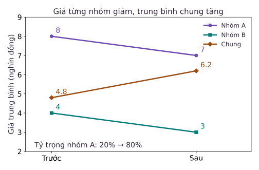

Chúng ta bước vào bài học tổng kết của toàn bộ học trình. Đến thời điểm này, bạn đã làm chủ các kỹ thuật từ nền tảng đến chuyên sâu: hiểu rõ cơ chế mảng bộ nhớ đệm trong NumPy, thuần thục phép lập chỉ mục và cơ chế sao chép khi ghi trong Pandas, biết xử lý dữ liệu chuỗi, chuỗi thời gian, làm sạch dữ liệu bẩn và kiểm soát đầu ra của mô hình ngôn ngữ lớn. Tuy nhiên, mọi kỹ năng lập trình tinh vi đó sẽ trở nên vô nghĩa nếu khâu cuối cùng bị gãy đổ: khâu phiên dịch các con số tính toán thành kết luận khoa học và truyền tải chúng tới người ra quyết định.

Trong thực tế, một bản báo cáo có thể chứa những con số hoàn toàn chính xác về mặt số học nhưng lại dẫn dắt người nghe đến những hành động sai lầm nghiêm trọng. Điều này thường xuất phát từ việc người phân tích không bóc tách sự thay đổi trong cơ cấu nhóm, đánh tráo khái niệm giữa số lượng và tỷ lệ, hoặc vội vã quy kết tương quan thành quan hệ nhân quả.

Bài học kết khóa này tích hợp toàn bộ kiến thức đã học thành một khung phương pháp luận hoàn chỉnh: giải mã hiện tượng nghịch lý Simpson khi cơ cấu nhóm biến động, chuẩn hóa ngôn ngữ đo lường giữa phần trăm và điểm phần trăm, thiết lập quy trình thẩm định năm bước từ bảng thô tới kết luận, và rèn luyện đạo đức trình bày dữ liệu với các giới hạn minh bạch.

## 1. Cơ cấu nhóm và sự đảo chiều của trung bình chung

Hãy quan sát một hiện tượng số học thoạt nhìn có vẻ phi lý: giá bán trung bình của từng nhóm mặt hàng riêng lẻ đều giảm xuống, nhưng giá bán trung bình chung của toàn bộ doanh nghiệp lại tăng lên rõ rệt.

Đoạn mã dưới đây mô phỏng dữ liệu kinh doanh của hai nhóm mặt hàng A và B qua hai kỳ khảo sát:

```python
import pandas as pd

summary = pd.DataFrame({
    "ky": ["Truoc", "Truoc", "Sau", "Sau"],
    "nhom": ["A", "B", "A", "B"],
    "so_mat_hang": [2, 8, 8, 2],
    "gia_tb": [8.0, 4.0, 7.0, 3.0],
})
summary["tong_gia"] = summary["so_mat_hang"] * summary["gia_tb"]
overall = summary.groupby("ky").agg(
    tong=("tong_gia", "sum"), n=("so_mat_hang", "sum")
)
overall["gia_tb"] = overall["tong"] / overall["n"]
print(overall["gia_tb"].to_dict())  # Sau: 6.2, Truoc: 4.8
```

### Vì sao trung bình chung đảo chiều khi từng nhóm đều giảm giá?

Hãy phân tích phép tính đằng sau hai con số tổng hợp:
- **Kỳ trước**:
  - Nhóm A có 2 mặt hàng với giá trung bình 8.0 nghìn đồng. Tổng giá trị nhóm A là $2 \times 8.0 = 16.0$.
  - Nhóm B có 8 mặt hàng với giá trung bình 4.0 nghìn đồng. Tổng giá trị nhóm B là $8 \times 4.0 = 32.0$.
  - Tổng giá trị của cả 10 mặt hàng là $16.0 + 32.0 = 48.0$.
  - Giá trung bình chung kỳ trước là:
    $$\bar{X}_{\text{Trước}} = \frac{48.0}{10} = 4.8 \text{ (nghìn đồng)}$$

- **Kỳ sau**:
  - Nhóm A hạ giá xuống còn 7.0 nghìn đồng (giảm 1.0 nghìn đồng). Nhóm này mở rộng quy mô lên 8 mặt hàng. Tổng giá trị là $8 \times 7.0 = 56.0$.
  - Nhóm B hạ giá xuống còn 3.0 nghìn đồng (giảm 1.0 nghìn đồng). Nhóm này thu hẹp còn 2 mặt hàng. Tổng giá trị là $2 \times 3.0 = 6.0$.
  - Tổng giá trị của cả 10 mặt hàng là $56.0 + 6.0 = 62.0$.
  - Giá trung bình chung kỳ sau là:
    $$\bar{X}_{\text{Sau}} = \frac{62.0}{10} = 6.2 \text{ (nghìn đồng)}$$

Giá trung bình chung tăng vọt từ 4.8 lên 6.2 nghìn đồng (tăng $29.2\%$), dù không có bất kỳ mặt hàng nào tăng giá.

Nguyên nhân cốt lõi nằm ở **sự dịch chuyển trọng số cơ cấu**. Giá trung bình của toàn thể không phải là trung bình cộng giản đơn của hai con số nhóm, mà là trung bình có trọng số theo quy mô:
$$\bar{X} = \sum w_i \bar{X}_i \quad \text{với} \quad w_i = \frac{n_i}{N}$$

Ở kỳ trước, nhóm B (nhóm giá rẻ) chiếm tới $80\%$ cơ cấu ($w_B = 0.8$), kéo giá trung bình chung xuống thấp. Ở kỳ sau, cơ cấu đảo ngược hoàn toàn: nhóm A (nhóm giá đắt) chiếm tới $80\%$ cơ cấu ($w_A = 0.8$), kéo giá trung bình chung tăng mạnh.



Nếu một nhà phân tích chỉ nhìn vào con số tổng thể và báo cáo rằng "giá cả đang leo thang", họ đã đưa ra một nhận định sai lệch về hành vi định giá sản phẩm. Ngược lại, nếu chỉ nói "giá từng nhóm đều giảm", họ lại bỏ qua sự thật rằng khách hàng trên thực tế đang phải chi trả nhiều tiền hơn do mua nhiều sản phẩm nhóm đắt tiền hơn. Một báo cáo trung thực bắt buộc phải trình bày cả hai tầng thông tin: xu hướng cục bộ trong từng nhóm và sự thay đổi trong cơ cấu danh mục.

## 2. Mẫu số là linh hồn của chỉ số: Phân biệt Phần trăm và Điểm phần trăm

Một cái bẫy kinh điển khác trong phân tích dữ liệu là việc đưa ra các con số đếm tuyệt đối mà tước bỏ đi mẫu số quy chiếu, hoặc sử dụng nhập nhằng giữa hai khái niệm: thay đổi tương đối và chênh lệch tuyệt đối.

Hãy xem xét bài toán kiểm soát chất lượng qua hai chu kỳ sản xuất:

```python
before_rate = 5 / 100
after_rate = 8 / 200
count_growth = (8 - 5) / 5
rate_change = (after_rate - before_rate) / before_rate
print(before_rate, after_rate, count_growth, rate_change)
# 0.05, 0.04, 0.6, xấp xỉ -0.2
```

Đoạn mã trên phơi bày hai khía cạnh đối lập:
1. **Số lượng lỗi tuyệt đối**: Tăng từ 5 sản phẩm lên 8 sản phẩm. Mức tăng trưởng số lượng lỗi là:
   $$\text{Tăng trưởng số lượng} = \frac{8 - 5}{5} = 0.6 = 60\%$$
2. **Tỷ lệ lỗi trên quy mô sản xuất**: Kỳ trước có 5 lỗi trên 100 sản phẩm ($5\%$). Kỳ sau có 8 lỗi trên 200 sản phẩm ($4\%$).

Nếu một bài báo giật tít: "Số lượng sản phẩm lỗi tăng vọt 60%", thông tin đó hoàn toàn đúng về mặt số đếm nhưng lại tạo ra ấn tượng sai lầm rằng dây chuyền đang hoạt động tồi đi. Thực tế, quy mô sản xuất đã tăng gấp đôi, và tỷ lệ lỗi trên mỗi đơn vị thành phẩm đã được cải thiện rõ rệt.

### Quy chuẩn ngôn ngữ: Điểm phần trăm (pp) so với Phần trăm (%)

Khi mô tả sự thay đổi của một đại lượng vốn dĩ đã là tỷ lệ phần trăm (như tỷ lệ lỗi từ $5\%$ xuống $4\%$), tiếng Việt học thuật phân biệt rạch ròi hai cách diễn đạt:

- **Chênh lệch tuyệt đối (Điểm phần trăm - Percentage Points)**:
  $$4\% - 5\% = -1\% \implies \text{Giảm 1 điểm phần trăm}$$
- **Thay đổi tương đối (Phần trăm - Percent)**:
  $$\frac{4\% - 5\%}{5\%} = \frac{-0.01}{0.05} = -0.20 = -20\% \implies \text{Giảm 20\% so với tỷ lệ ban đầu}$$

Nếu bạn viết câu văn mập mờ: "Tỷ lệ lỗi giảm 1%", người nghe trong ngành tài chính hoặc kiểm toán sẽ hiểu rằng tỷ lệ giảm từ $5\%$ xuống còn $5\% \times (1 - 0.01) = 4.95\%$. Sự nhầm lẫn giữa 1 điểm phần trăm và 1 phần trăm có thể gây ra sai số hàng triệu đơn vị trong các dự báo kinh tế. Mọi chỉ số tỷ lệ bắt buộc phải công khai rõ ràng: tử số đại diện cho cái gì, mẫu số đại diện cho quần thể nào, và đơn vị đo lường cụ thể là gì.

## 3. Quy trình thẩm định dữ liệu năm bước

Trước khi đóng dấu phê duyệt một kết quả phân tích hoặc ký tên vào một báo cáo kỹ thuật, người làm dữ liệu chuyên nghiệp phải thực hiện quy trình kiểm toán ngược từ câu kết luận quay về nguồn gốc bảng thô:

| Tầng thẩm định | Câu hỏi kiểm toán cốt lõi | Bằng chứng cần kiểm tra |
| :--- | :--- | :--- |
| **1. Khung câu hỏi** | Nghiên cứu muốn trả lời điều gì? Quần thể quan sát là ai? | Phạm vi thời gian, không gian và các giả định loại trừ. |
| **2. Làm sạch & Định kiểu** | Dữ liệu đầu vào có bị biến dạng không? | Kiểu dữ liệu từng cột, các giá trị bị khuyết, khóa chính và biên bản loại trừ dữ liệu lỗi. |
| **3. Ghép nối & Tổng hợp** | Phép kết nối có sinh ra trùng lặp ngoài ý muốn? | Số lượng dòng trước và sau khi ghép, việc tính đúng trọng số khi nhóm, và quy ước xử lý mẫu số bằng không. |
| **4. Trực quan hóa** | Biểu đồ có truyền tải trung thực số liệu không? | Điểm gốc trục tọa độ, tính nhất quán của thang đo, và nhãn đơn vị đo lường trên các trục. |
| **5. Kết luận & Khuyến nghị** | Câu văn có nói vượt quá phạm vi bằng chứng không? | Phân định rạch ròi giữa quan sát tương quan và quy luật nhân quả. |

### Phương pháp kiểm thử cục bộ bằng tay

Đây là một cách người ta hay dùng để kiểm chứng các đường ống tổng hợp phức tạp: trích xuất một mẫu nhỏ gồm 10 đến 20 dòng từ bảng dữ liệu gốc, dùng giấy bút hoặc bảng tính để tính tay từng phép cộng, phép nhân trọng số, rồi đối chiếu từng bước với kết quả do hàm `groupby` hay `agg` tạo ra. Phép kiểm thử vi mô này giúp phát hiện ngay lập tức các lỗi tiềm ẩn như nhân đôi bản ghi khi nối bảng (fan-out bug) hay tính sai trung bình của trung bình.

Dù mã nguồn được viết bởi chuyên gia lâu năm hay được tạo ra tự động bởi các trợ lý trí tuệ nhân tạo, quy trình thẩm định nội dung trên vẫn không thay đổi. Trách nhiệm học thuật và đạo đức nghề nghiệp luôn thuộc về con người ký tên dưới bản phân tích.

## 4. Nghệ thuật kể chuyện bằng dữ liệu có trách nhiệm

Một câu chuyện dữ liệu xuất sắc không phải là một bài văn hoa mỹ với những tính từ cảm thán sáo rỗng. Nó là một cấu trúc lập luận logic, minh bạch và khiêm nhường trước sự thật khách quan.

Hãy quan sát cách xây dựng một đoạn kết luận mẫu mực cho tình huống thay đổi cơ cấu ở Mục 1:

> "Trong tập dữ liệu khảo sát gồm 10 mặt hàng ở mỗi chu kỳ, giá bán trung bình chung toàn doanh nghiệp ghi nhận mức tăng từ 4.8 lên 6.2 nghìn đồng (tăng 29.2%). Tuy nhiên, khi bóc tách theo từng phân khúc, giá bán trung bình của cả nhóm A và nhóm B đều ghi nhận mức giảm 1.0 nghìn đồng. Sự gia tăng của trung bình chung hoàn toàn xuất phát từ sự dịch chuyển cơ cấu danh mục: tỷ trọng mặt hàng nhóm A (phân khúc giá cao) đã tăng mạnh từ 20% lên 80%. Dữ liệu quan sát hiện tại chỉ phản ánh sự dịch chuyển về mặt cơ cấu hàng hóa, chưa đủ căn cứ để kết luận nguyên nhân xuất phát từ sự thay đổi trong sở thích của người tiêu dùng hay do chiến lược cung ứng của doanh nghiệp."

Đoạn văn trên đáp ứng toàn diện các tiêu chuẩn học thuật:
- **Nêu rõ hiện tượng định lượng**: Có số liệu cụ thể kèm đơn vị tính rõ ràng.
- **Mở bước phân tích tầng sâu**: Giải thích cơ chế toán học phía sau hiện tượng thay vì chấp nhận kết luận bề mặt.
- **Giữ vững giới hạn suy diễn**: Không vội vã khẳng định một mối quan hệ nhân quả khi thiết kế nghiên cứu chưa cho phép.

Nếu bạn muốn khẳng định "công cụ X giúp nâng cao năng suất", bạn không thể chỉ dựa vào một biểu đồ cho thấy những người dùng công cụ X có điểm số cao hơn. Nhóm người chủ động dùng công cụ X có thể vốn dĩ đã có nền tảng năng lực, sự chăm chỉ hoặc điều kiện làm việc vượt trội hơn. Để chứng minh tác động nhân quả, bạn bắt buộc phải thực hiện các thử nghiệm ngẫu nhiên có kiểm soát (A/B testing) hoặc áp dụng các kỹ thuật kinh tế lượng phức tạp để loại bỏ các biến gây nhiễu.

## 5. Bài tập tự luyện

::: exercise So sánh trung bình số học giản đơn và trung bình có trọng số
Từ dữ liệu ở Mục 1, giả sử một nhân viên lấy trung bình cộng giản đơn của hai mức giá trung bình nhóm cho từng kỳ:
- Kỳ trước: $(8.0 + 4.0) / 2 = 6.0$
- Kỳ sau: $(7.0 + 3.0) / 2 = 5.0$

Nhân viên đó kết luận rằng giá trung bình chung đã giảm từ 6.0 xuống 5.0 nghìn đồng.
1. Phép tính của nhân viên đó sai ở điểm nào?
2. Vì sao kết quả đó lại mâu thuẫn hoàn toàn với kết quả 4.8 và 6.2 nghìn đồng tính được từ hàm `groupby`?
:::

::: solution
1. Phép tính của nhân viên sai lầm vì đã gán **trọng số bằng nhau ($50\% - 50\%$)** cho hai nhóm mặt hàng ở cả hai kỳ. Phép tính này bỏ qua hoàn toàn số lượng mặt hàng thực tế của từng nhóm.
2. Kết quả tính bằng `groupby` phản ánh giá trung bình tính trên từng mặt hàng đơn lẻ. Vì số lượng mặt hàng ở mỗi nhóm là khác nhau (kỳ trước nhóm B chiếm 8/10, kỳ sau nhóm A chiếm 8/10), ta bắt buộc phải nhân giá của từng nhóm với tỷ trọng số lượng tương ứng. Khi tính đúng trọng số thực tế, trung bình chung kỳ trước là 4.8 và kỳ sau là 6.2 nghìn đồng. Việc bỏ qua trọng số đã làm đảo ngược hoàn toàn chiều hướng biến thiên của đại lượng.
:::

::: exercise Phân biệt thay đổi phần trăm và điểm phần trăm
Tỷ lệ khách hàng rời bỏ dịch vụ của một công ty viễn thông giảm từ $5\%$ ở quý 1 xuống còn $4\%$ ở quý 2.
1. Hãy diễn đạt mức độ cải thiện này theo khái niệm điểm phần trăm.
2. Hãy diễn đạt mức độ cải thiện này theo khái niệm tỷ lệ phần trăm thay đổi tương đối.
3. Vì sao không được viết một cách vắn tắt là "tỷ lệ rời bỏ giảm 1%"?
:::

::: solution
1. Theo điểm phần trăm (chênh lệch tuyệt đối):
   $$\text{Chênh lệch} = 4\% - 5\% = -1\% \implies \text{Giảm 1 điểm phần trăm}$$
2. Theo tỷ lệ phần trăm tương đối:
   $$\text{Tỷ lệ thay đổi} = \frac{4\% - 5\%}{5\%} = \frac{-0.01}{0.05} = -0.20 = -20\% \implies \text{Giảm 20\% so với mức ban đầu}$$
3. Không được viết "giảm 1%" vì câu văn này tạo ra sự nhập nhằng nguy hiểm: người đọc có thể hiểu là tỷ lệ giảm đi $1\%$ của mức $5\%$ ban đầu, tức là còn $5\% \times (1 - 0.01) = 4.95\%$. Cách diễn đạt chuẩn mực trong báo cáo chuyên nghiệp bắt buộc phải ghi rõ là "giảm 1 điểm phần trăm" hoặc "giảm 20% so với kỳ trước".
:::

::: exercise Phân định giữa tương quan quan sát và quy luật nhân quả
Một nghiên cứu nội bộ tại một trường đại học ghi nhận rằng: sinh viên tham gia đầy đủ các buổi phụ đạo có điểm thi trung bình cuối kỳ là 8.5, trong khi sinh viên không tham gia chỉ đạt điểm trung bình là 6.0.
Một cán bộ quản lý đào tạo kết luận: "Chương trình phụ đạo đã giúp nâng điểm thi của sinh viên thêm 2.5 điểm".
Kết luận trên có chuẩn xác về mặt khoa học dữ liệu không? Những yếu tố gây nhiễu tiềm ẩn nào có thể giải thích cho chênh lệch này?
:::

::: solution
Kết luận trên **hoàn toàn chưa có đủ cơ sở khoa học**. Cán bộ quản lý đã đánh đồng mối liên hệ tương quan quan sát được trong dữ liệu thực nghiệm thành một khẳng định tác động nhân quả.

Chênh lệch 2.5 điểm có thể bị chi phối bởi các yếu tố gây nhiễu (confounding variables) mang tính hệ thống:
- **Động lực và sự tự giác**: Những sinh viên chủ động đăng ký tham gia lớp phụ đạo thường vốn dĩ là những người có ý thức học tập cao hơn, chăm chỉ hơn và dành nhiều thời gian tự học hơn. Chính động lực nội tại này mới là nguyên nhân chính giúp họ đạt điểm cao, chứ chưa chắc hoàn toàn do nội dung bài giảng phụ đạo.
- **Nền tảng kiến thức ban đầu**: Có thể nhóm tham gia phụ đạo có điều kiện học tập hoặc sự chuẩn bị tốt hơn từ trước.

Để khẳng định lớp phụ đạo thực sự làm tăng điểm số thêm bao nhiêu, nhà nghiên cứu cần thiết kế một thử nghiệm ngẫu nhiên (chẳng hạn bốc thăm ngẫu nhiên sinh viên vào nhóm phụ đạo và nhóm đối chứng) hoặc sử dụng các kỹ thuật thống kê nâng cao (như phương pháp bắt cặp điểm xu hướng - Propensity Score Matching) để kiểm soát các yếu tố gây nhiễu.
:::

## 6. Nguồn và đọc thêm

- Wes McKinney, *Python for Data Analysis*, 3rd Edition — [Chương 10: Data Aggregation and Group Operations](https://wesmckinney.com/book/data-aggregation) và [Chương 13: Data Analysis Examples](https://wesmckinney.com/book/data-analysis-examples).
- Hiện tượng nghịch lý Simpson trong thống kê: Simpson, E. H. (1951), *The Interpretation of Interaction in Contingency Tables*, Journal of the Royal Statistical Society.
- Phương pháp luận phân tích nhân quả: Pearl, J., & Mackenzie, D., *The Book of Why: The New Science of Cause and Effect*, Basic Books.
- Khung lý thuyết thống kê trên StudyHub: [Hiểu thế giới bằng dữ liệu](/xac-suat-thong-ke/bai-giang/00-hieu-the-gioi-bang-du-lieu.md).
- [Bài giảng tham khảo môn Xử lý dữ liệu (iaidev)](https://courses.iaidev.com/programming-for-data-processing/2627-1/lecture-14-ke-chuyen-bang-du-lieu.html).
